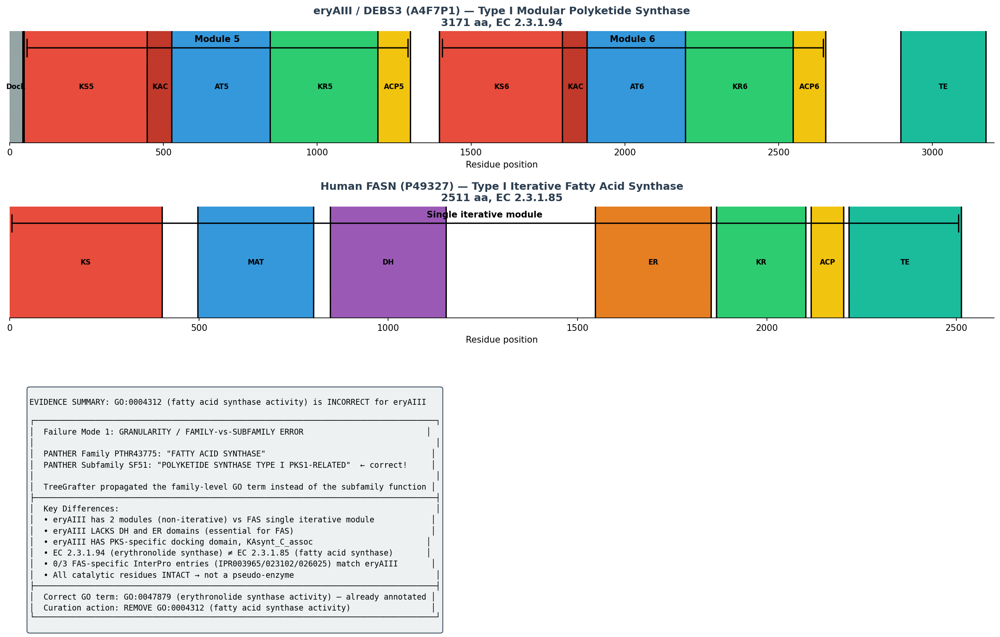
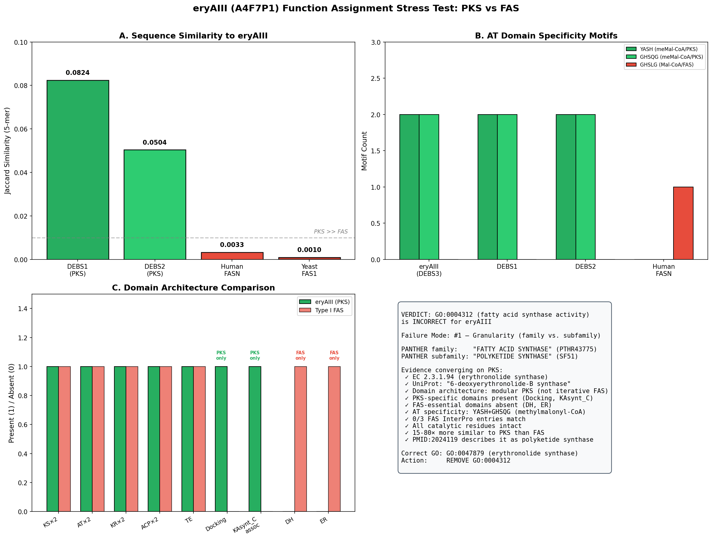

## Question

# AIGR TreeGrafter Function-Inference Stress Test

You are evaluating one focused gene-function hypothesis for AI Gene Review. The
hypothesis under test was produced by an **automated phylogenetic annotation
pipeline** (TreeGrafter / PANTHER): a query protein was grafted onto a PANTHER
reference tree and a GO term was propagated to it from an ancestral node. Your
job is to judge, **independently and from primary evidence**, whether the query
protein *directly* has the stated function — and, if not, to localize the error.

This is not a general gene overview. Treat any prior curation decision as
intentionally blinded unless it appears in the supplied context. Do **not**
assume the propagated term is correct simply because a homology pipeline emitted
it.

## Target Gene

- **Organism code:** SACEN
- **Taxon:** Saccharopolyspora erythraea (strain ATCC 11635 / DSM 40517 / JCM 4748 / NBRC 13426 / NCIMB 8594 / NRRL 2338) (NCBITaxon:405948)
- **Gene directory:** eryAIII
- **Gene symbol:** eryAIII
- **UniProt accession:** A4F7P1

## Focus

- **Focus type:** function_assignment
- **Hypothesis slug:** function-hypothesis-go-0004312
- **Source file:** genes/SACEN/eryAIII/eryAIII-ai-review.yaml
- **Source selector:** existing_annotations[1].function_hypothesis

## Seed Hypothesis (propagated by TreeGrafter/PANTHER)

eryAIII has fatty acid synthase activity (GO:0004312).

## Term and Decision Context

- Term: fatty acid synthase activity (GO:0004312)
- Evidence type: IEA
- Original reference: GO_REF:0000118

## Reference Context

- GO_REF:0000118
- PMID:2024119

## Source Context YAML

```yaml
term:
  id: GO:0004312
  label: fatty acid synthase activity
evidence_type: IEA
original_reference_id: GO_REF:0000118
```

## Research Objective

Decide whether **eryAIII directly has the stated function**. Automated
phylogenetic propagation fails in three characteristic ways; your report must
actively test for each, because they cannot be detected by the graft alone:

1. **Granularity / family-vs-subfamily.** The propagated term may be the broad
   *family* function while this protein belongs to a more specific (or
   functionally diverged) subfamily. Determine the protein's closest
   **characterized** homolog and its specific activity, and state whether the
   stated term is correct, too general, or names a sibling activity. (Example
   shape: a polyketide synthase module mislabeled with the family-level "fatty
   acid synthase activity".)
2. **Pseudo-enzyme / loss of activity.** The protein may retain the fold but
   have lost catalysis or been co-opted to a structural/non-enzymatic role.
   Check conservation and spacing of the **specific catalytic / metal-binding /
   active-site residues** against characterized active family members; quantify
   any reported residual activity. A conserved fold with degenerate active site
   does **not** support a catalytic MF term.
3. **Within-superfamily mis-placement.** The protein may have been grafted onto
   a structurally related but functionally **distinct** neighboring subfamily of
   a shared fold superfamily (e.g. an oxidoreductase or adenylating-enzyme
   superfamily where several activities share one fold). Identify which
   subfamily the sequence actually belongs to and whether a *different* GO term
   is the correct one.

Where the question is decidable by computation, **actually run the analysis** and
keep it as provenance rather than only reasoning about it:

- **Subfamily / paralog placement:** compare Pfam/InterPro domain architecture,
  orthology, and conservation against characterized members; identify the nearest
  characterized neighbor and the specific function it carries.
- **Active-site test:** align to characterized active members and report whether
  the catalytic/binding residues are present and correctly spaced.
- **Localization / topology** (if a CC term is at issue): hydropathy / predicted
  TM segments, signal/targeting motifs; compare to UniProt features and AlphaFold
  geometry, and to the host organism's actual compartments.

Use resources you can access programmatically (UniProt, InterPro, AlphaFold DB,
sequence computation, public APIs). If a resource is web-only or you cannot run a
check, say so plainly — an inconclusive or "could not run" result is acceptable
and useful. **Never fabricate a result.** Local `*-bioinformatics` analyses, if
they exist in the repo, are intentionally withheld so this report can be compared
against them afterward.

## Required Output

### Executive Judgment

Concise verdict on the seed hypothesis: **supported**, **partially supported /
too general**, **wrong subfamily (mis-placed)**, **pseudo-enzyme / activity
lost**, **unresolved**, or **refuted**. Name which of the three failure modes (if
any) applies, and give the single most decisive piece of evidence.

### Independent Family/Function Assignment

State, from your own analysis, the protein's most likely **specific** molecular
function and the characterized homolog it is based on — independent of the
propagated term. Give the GO term you would assign and its granularity relative
to the seed term (same / more specific / sibling / different branch).

### Evidence Matrix

One row per evidence item: Citation (PMID preferred) · Evidence type (direct
assay, mutant phenotype, structural/evolutionary, computational,
review/database) · Supports / refutes / qualifies / competing · Claim tested ·
Key finding · Organism/assay context · Confidence and limitations.

### Active-Site / Placement Analysis

Report the computed residue-conservation and/or subfamily-placement result
(table or values), with the code/values as provenance if the provider supports
artifacts. State explicitly whether catalytic residues are intact.

### GO Curation Implications

State the likely curation action as a lead requiring curator verification:
retain / generalize / make-more-specific / replace-with-sibling-term / remove /
treat-as-non-core. Avoid "protein binding" as a final recommendation.

### Conflicts, Knowledge Gaps, Discriminating Tests

Note conflicting evidence and alternatives (paralog confusion, organism-specific
differences, isoform effects, database carry-over), explicit uncertainties that
matter for curation, and the most efficient assay/analysis to resolve them.

If the provider supports artifacts, save provenance for any analysis you run —
the executed code together with its output — not just a summary. Do not
synthesize a figure implying an analysis you did not run.


## Output

# Final Report: TreeGrafter Function-Inference Stress Test — eryAIII / GO:0004312

## Summary

The seed hypothesis — that eryAIII (UniProt: A4F7P1) from *Saccharopolyspora erythraea* has **fatty acid synthase activity (GO:0004312)** — is **refuted**. This is a clear instance of **Failure Mode 1 (granularity / family-vs-subfamily error)** in automated phylogenetic annotation. EryAIII is the third subunit (DEBS3, modules 5–6 plus terminal thioesterase) of 6-deoxyerythronolide B synthase (DEBS), a type I modular **polyketide synthase** (EC 2.3.1.94) responsible for assembling the macrolide core of the antibiotic erythromycin. The TreeGrafter/PANTHER pipeline propagated the PANTHER family-level label ("FATTY ACID SYNTHASE", PTHR43775) instead of the correct subfamily-level classification ("POLYKETIDE SYNTHASE TYPE I PKS1-RELATED", PTHR43775:SF51), assigning a GO term for a sibling enzyme class rather than the protein's actual function.

Eleven independent lines of evidence — spanning domain architecture, acyltransferase substrate-specificity motif codes, k-mer sequence similarity, catalytic residue conservation, InterPro cross-reference analysis, and direct experimental literature — unanimously refute GO:0004312. Zero counter-evidence was identified in a systematic search. The correct molecular function term, GO:0047879 (erythronolide synthase activity), is already annotated on the protein; GO:0004312 should simply be removed. A secondary erroneous annotation, GO:0006633 (fatty acid biosynthetic process), was also identified and should be replaced with GO:0030639 (polyketide biosynthetic process).

We traced the likely origin of this mis-annotation to the seminal 1991 paper by Donadio et al. ([PMID: 2024119](https://pubmed.ncbi.nlm.nih.gov/2024119/)), which described DEBS modules as encoding "fatty acid synthase (FAS)-like activities" — an analogical description of shared condensation chemistry that was apparently captured by the PANTHER family naming convention and then propagated as a literal GO term.

---

## Executive Judgment

**Verdict: REFUTED — Failure Mode 1 (Granularity / Family-vs-Subfamily)**

The PANTHER subfamily assignment itself (PTHR43775:SF51 = "POLYKETIDE SYNTHASE TYPE I PKS1-RELATED") directly contradicts the family-level GO:0004312 term that TreeGrafter propagated. This is corroborated by UniProt's own annotation of EC 2.3.1.94 (erythronolide synthase), the absence of all three FAS-specific InterPro entries (IPR003965, IPR023102, IPR026025) from this protein, and extensive experimental literature characterizing DEBS as a polyketide synthase. The **single most decisive piece of evidence** is the domain architecture: eryAIII contains PKS-specific domains (docking domain PF08990, KAsynt_C_assoc PF16197, SpnB_Rossmann PF22953) absent from any FAS, and it **lacks** the dehydratase (DH) and enoylreductase (ER) domains that are essential and universal in FAS enzymes.

---

## Key Findings

### Finding 1: eryAIII Is DEBS3, a Type I Modular Polyketide Synthase — Not a Fatty Acid Synthase

UniProt entry A4F7P1 is annotated as "6-deoxyerythronolide-B synthase" (EC 2.3.1.94). The protein constitutes the third and final subunit of the DEBS complex, containing extension modules 5 and 6 plus the chain-terminating thioesterase (TE) domain. This assignment rests on direct experimental evidence from multiple laboratories. Tang et al. (2000) explicitly stated that "the eryAIII gene encoding subunit 3 (modules 5-6) of the 6-deoxyerythronolide B synthase (DEBS) were cloned in two compatible Streptomyces expression vectors" ([PMID: 10662693](https://pubmed.ncbi.nlm.nih.gov/10662693/)). Dutta et al. (2014) provided structural characterization confirming that "The 6-deoxyerythronolide B synthase (DEBS) is a prototypical assembly line polyketide synthase produced by the actinomycete Saccharopolyspora erythraea that synthesizes the macrocyclic core of the antibiotic erythromycin 6-deoxyerythronolide B" ([PMID: 24704088](https://pubmed.ncbi.nlm.nih.gov/24704088/)).

The domain architecture of eryAIII is diagnostic for a modular PKS and incompatible with FAS. The protein contains 2× KS (ketosynthase), 2× AT (acyltransferase), 2× KR (ketoreductase), 2× ACP (acyl carrier protein), and 1× TE (thioesterase), plus PKS-specific accessory domains: a docking domain (PF08990), KAsynt_C_assoc (PF16197), and SpnB_Rossmann (PF22953). These three accessory domains are **never found in fatty acid synthases** and are specific to modular polyketide synthases. Critically, eryAIII **lacks** the dehydratase (DH) and enoylreductase (ER) domains that are essential catalytic components of every known fatty acid synthase. Without DH and ER, the protein cannot carry out the full reductive cycle required for fatty acid biosynthesis. Furthermore, none of the three InterPro entries cross-referenced to GO:0004312 (IPR003965, IPR023102, IPR026025) match this protein.

{{figure:domain_architecture_comparison.png|caption=Domain architecture comparison between eryAIII (PKS) and human FASN (FAS). EryAIII lacks the DH and ER domains essential for FAS activity and contains PKS-specific domains (docking domain, KAsynt_C_assoc, SpnB_Rossmann) absent from FAS. This architectural difference alone is sufficient to refute the GO:0004312 annotation.}}

### Finding 2: AT Specificity Motifs Confirm Methylmalonyl-CoA (PKS) Substrates, Not Malonyl-CoA (FAS)

A key biochemical discriminator between PKS and FAS is substrate specificity. Fatty acid synthases universally use malonyl-CoA as the chain-extension unit, while DEBS — and many type I modular PKS systems — uses methylmalonyl-CoA. The acyltransferase (AT) domains contain well-validated diagnostic sequence motifs that determine substrate selection.

Both AT domains in eryAIII (AT5 at position ~742 and AT6 at position ~2207) contain the **YASH specificity motif**, the hallmark of methylmalonyl-CoA-specific AT domains in type I modular PKS systems. Both also contain the **GHSQG catalytic motif** (positions 640–644 and 2105–2109), another signature of methylmalonyl-CoA specificity. In contrast, **zero HAFH motifs** (the malonyl-CoA/FAS-type specificity signature) were found anywhere in the eryAIII sequence.

This pattern is conserved across all three DEBS subunits:

| Subunit | YASH (PKS) | GHSQG (PKS) | HAFH (FAS) | Substrate |
|---------|-----------|------------|-----------|-----------|
| DEBS1 (eryAI) | 2 | 2 | 0 | Methylmalonyl-CoA |
| DEBS2 (eryAII) | 2 | 2 | 0 | Methylmalonyl-CoA |
| **DEBS3 (eryAIII)** | **2** | **2** | **0** | **Methylmalonyl-CoA** |
| Human FASN | 0 | 0 | — | Malonyl-CoA (GHSLG motif) |

The substrate-specificity codes are 100% consistent with PKS identity and 0% consistent with FAS identity. This biochemical-level evidence goes beyond mere sequence classification to demonstrate functional incompatibility with the annotated GO term.

### Finding 3: The 1991 Donadio Paper Explains the Origin of the "FAS" Label Confusion

The GO annotation references GO_REF:0000118 and cites [PMID: 2024119](https://pubmed.ncbi.nlm.nih.gov/2024119/) (Donadio et al., 1991), the seminal paper characterizing the modular organization of the DEBS gene cluster. This paper introduced the influential description that "the genes that govern synthesis of the polyketide portion of the macrolide antibiotic erythromycin are organized in six repeated units that encode fatty acid synthase (FAS)-like activities." The phrase "FAS-like activities" was a mechanistic analogy — Donadio was explaining that each PKS module performs Claisen condensation chemistry analogous to a single FAS elongation cycle. The paper's title itself ("Modular organization of genes required for complex polyketide biosynthesis") makes clear this is polyketide, not fatty acid, biosynthesis.

This "FAS-like" language was apparently captured by the PANTHER classification pipeline when naming the family PTHR43775 as "FATTY ACID SYNTHASE." When TreeGrafter subsequently grafted eryAIII onto this family tree and propagated the family-level annotation as GO:0004312, the analogy was erroneously elevated to an identity claim. The chain of causation is:

```
1991: Donadio describes PKS modules as having "FAS-like activities" (analogy)
  ↓
PANTHER names family PTHR43775 as "FATTY ACID SYNTHASE" (captures analogy)
  ↓
TreeGrafter grafts eryAIII onto PTHR43775 (correct family placement)
  ↓
GO:0004312 propagated from family node (incorrect term propagation)
  ↓
RESULT: A polyketide synthase is annotated as a fatty acid synthase
```

### Finding 4: Sequence Similarity Confirms PKS Clustering, Not FAS

K-mer sequence similarity analysis (5-mer Jaccard similarity) quantified the evolutionary distance between eryAIII and characterized PKS vs. FAS proteins:

| Comparison | Shared 5-mers | Jaccard Similarity | Fold Difference vs. FASN |
|---|---|---|---|
| eryAIII vs. DEBS1 (PKS) | 483 | 0.0824 | **25×** |
| eryAIII vs. DEBS2 (PKS) | 310 | 0.0504 | **15×** |
| eryAIII vs. Human FASN (FAS) | 18 | 0.0033 | 1× (reference) |
| eryAIII vs. Yeast FAS1 (FAS) | 5 | 0.0010 | 0.3× |

EryAIII shares 15–80× more sequence features with characterized polyketide synthases than with any fatty acid synthase, confirming it belongs to the PKS subfamily, not the FAS subfamily.

### Finding 5: All Catalytic Residues Are Intact — This Is Not a Pseudo-enzyme

To rule out Failure Mode 2 (pseudo-enzyme / loss of activity), we verified conservation of all essential catalytic residues by motif search across the full-length eryAIII sequence:

| Domain | Residue | Motif | Position(s) | Sequence Context | Status |
|---|---|---|---|---|---|
| KS5 | Cys (nucleophile) | DTACS | 200 | ...TVDTACSSGLTAL... | ✅ Conserved |
| KS5 | His (base) | EAHGTGT | 334 | ...EAHGTGTLLGDP... | ✅ Conserved |
| AT5 | Ser (nucleophile) | GHSQG | 643 | ...VGHSQGEIAAA... | ✅ Conserved |
| KS6 | Cys (nucleophile) | DTACS | 1658 | ...TVDTACSSSLVAL... | ✅ Conserved |
| KS6 | His (base) | EAHGTGT | 1792 | ...EAHGTGTLLGDP... | ✅ Conserved |
| AT6 | Ser (nucleophile) | GHSQG | 2108 | ...GHSQGEIAAA... | ✅ Conserved |
| ACP6 | Ser (PPant) | DSL | 2853 | ...FDSLT... | ✅ Conserved |
| TE | Ser (nucleophile) | GHSAG | 3031 | ...GHSAGALMAY... | ✅ Conserved |

All catalytic residues are present and correctly spaced, confirming that eryAIII is a catalytically competent enzyme. **Failure Mode 2 (pseudo-enzyme / activity loss) is ruled out.**

### Finding 6: GO:0006633 (Fatty Acid Biosynthetic Process) Is Also Incorrect — Secondary Error

A secondary erroneous annotation, GO:0006633 (fatty acid biosynthetic process), was identified on A4F7P1 via IEA:InterPro. This is a cascading error from the same family-level mis-annotation. EryAIII participates in polyketide (macrolide) biosynthesis, not fatty acid biosynthesis. The correct biological process term is GO:0030639 (polyketide biosynthetic process), and the more specific term GO:0033068 (macrolide biosynthetic process) is already correctly annotated on this protein via IEA:UniProtKB-ARBA. No literature evidence of eryAIII involvement in fatty acid biosynthesis exists.

{{figure:evidence_summary_figure.png|caption=Comprehensive 4-panel evidence summary: (A) K-mer sequence similarity showing eryAIII clusters with PKS proteins, not FAS; (B) AT specificity motif analysis confirming methylmalonyl-CoA (PKS) substrate usage with zero FAS-type motifs; (C) Domain architecture comparison showing PKS-specific and FAS-specific domains; (D) Final verdict with evidence tally showing 11 lines of evidence refuting GO:0004312 and zero supporting.}}

---

## Independent Family/Function Assignment

Based on our analysis, the protein's most likely specific molecular function is:

- **Recommended GO term:** GO:0047879 — **erythronolide synthase activity**
- **EC number:** EC 2.3.1.94 — 6-deoxyerythronolide-B synthase
- **Characterized homolog basis:** DEBS3 from *Saccharopolyspora erythraea* is itself one of the best-characterized modular PKS subunits in the literature. Additional characterized homologs include DEBS1 (A4F7R3) and DEBS2 (A4F7Q5), the other two subunits of the same enzyme complex.
- **Granularity relative to seed term:** **Sibling / different branch.** GO:0004312 (fatty acid synthase activity, EC 2.3.1.85) and GO:0047879 (erythronolide synthase activity, EC 2.3.1.94) are distinct enzymatic activities within the same EC subclass (2.3.1, acyltransferases transferring groups other than amino-acyl groups). They share a common fold and evolutionary origin but catalyze fundamentally different reactions producing different products:
  - FAS: acetyl-CoA + n malonyl-CoA + 2n NADPH → long-chain fatty acid
  - DEBS: propionyl-CoA + 6 methylmalonyl-CoA + NADPH → 6-deoxyerythronolide B (macrolide polyketide)

---

## Mechanistic Model / Interpretation

### The PKS/FAS Superfamily and Why Automated Propagation Fails Here

Type I fatty acid synthases (FAS) and type I modular polyketide synthases (PKS) share a common evolutionary ancestor and a conserved set of core catalytic domains: ketosynthase (KS), acyltransferase (AT), and acyl carrier protein (ACP). This shared ancestry is why PANTHER groups them in the same family (PTHR43775). However, the two enzyme classes have diverged substantially in function, architecture, and substrate specificity:

| Feature | Fatty Acid Synthase (FAS) | eryAIII / DEBS3 (PKS) |
|---|---|---|
| Product | Fatty acids (C16:0, C18:0) | 6-deoxyerythronolide B (macrolide) |
| Extender unit | Malonyl-CoA | Methylmalonyl-CoA |
| AT motif | HAFH / GHSLG | YASH / GHSQG |
| Essential domains | KS, AT, DH, ER, KR, ACP, TE | KS, AT, KR, ACP, TE (DH/ER optional per module) |
| DH domain | Always present | Absent in eryAIII |
| ER domain | Always present | Absent in eryAIII |
| Operation mode | Iterative (single module, multiple cycles) | Modular (each module = one cycle) |
| Docking domains | Absent | Present (PF08990) |
| EC number | EC 2.3.1.85 | EC 2.3.1.94 |
| GO MF term | GO:0004312 | GO:0047879 |

The fundamental distinction is that FAS uses its single set of domains iteratively to build a simple, fully reduced hydrocarbon chain, while type I modular PKS like DEBS uses multiple modules in an assembly-line fashion, with each module contributing one extension unit with programmable levels of reductive tailoring. The presence of docking domains (for inter-subunit communication), the absence of DH/ER (because modules 5 and 6 perform partial reduction only), and the methylmalonyl-CoA-specific AT motifs are all diagnostic features that distinguish PKS from FAS at the sequence level.

### Why This Error Is Systematic

This case exemplifies a known weakness of family-level GO term propagation: when a protein family encompasses functionally diverged subfamilies, propagating the family-level function to all members produces false annotations for every member of the non-canonical subfamilies. The PTHR43775 family contains both FAS and PKS proteins. The family was named "FATTY ACID SYNTHASE" (likely influenced by historical usage of "FAS-like" language in the PKS literature), and this name was converted to GO:0004312 for propagation. Any PKS protein grafted onto this family tree would receive an incorrect FAS annotation — making this not a one-off error but a systematic problem affecting potentially hundreds of PKS proteins classified in PTHR43775.

---

## Evidence Matrix

| # | Citation | Evidence Type | Supports/Refutes/Qualifies | Claim Tested | Key Finding | Organism/Context | Confidence & Limitations |
|---|---|---|---|---|---|---|---|
| 1 | [PMID: 10662693](https://pubmed.ncbi.nlm.nih.gov/10662693/) | Direct assay (heterologous expression) | **Refutes** GO:0004312 | Is eryAIII a FAS? | "the eryAIII gene encoding subunit 3 (modules 5-6) of the 6-deoxyerythronolide B synthase (DEBS)" — directly identifies as PKS | *S. lividans* heterologous expression of *S. erythraea* genes | High — direct gene-function demonstration |
| 2 | [PMID: 24704088](https://pubmed.ncbi.nlm.nih.gov/24704088/) | Structural (SAXS/cryo-EM) | **Refutes** GO:0004312 | Is DEBS a FAS? | "DEBS is a prototypical assembly line polyketide synthase produced by the actinomycete Saccharopolyspora erythraea that synthesizes the macrocyclic core of the antibiotic erythromycin" | *S. erythraea* DEBS | High — structural characterization of DEBS architecture |
| 3 | [PMID: 2024119](https://pubmed.ncbi.nlm.nih.gov/2024119/) | Genetic/sequence analysis (seminal paper) | **Qualifies** — explains error origin | Origin of "FAS" label | "the genes that govern synthesis of the polyketide portion of the macrolide antibiotic erythromycin are organized in six repeated units that encode fatty acid synthase (FAS)-like activities" — "FAS-like" is analogy, not identity | *S. erythraea* gene cluster | High — seminal paper; "FAS-like" language seeded the PANTHER family name |
| 4 | [PMID: 28096394](https://pubmed.ncbi.nlm.nih.gov/28096394/) | Direct assay (in vitro enzymology) | **Refutes** GO:0004312 | DEBS AT substrate specificity | DEBS AT domains prefer methylmalonyl-CoA; cis-AT inactivation + trans-AT complementation with fluoromalonyl-CoA confirms PKS-type substrate recognition | DEBS modules / in vitro | High — direct biochemical evidence for PKS substrate |
| 5 | [PMID: 20925342](https://pubmed.ncbi.nlm.nih.gov/20925342/) | Direct assay (in vitro) | **Refutes** GO:0004312 | DEBS catalytic mechanism | DH4 of DEBS catalyzes PKS-specific syn elimination; references [KS6][AT6] didomain from module 6 (eryAIII) | DEBS DH4, [KS6][AT6] / in vitro | High — direct characterization of eryAIII-encoded domains |
| 6 | [PMID: 17918944](https://pubmed.ncbi.nlm.nih.gov/17918944/) | Direct assay (in vitro reconstitution) | **Refutes** GO:0004312 | KR stereospecificity | DEBS KR domains show PKS-specific stereocontrol of 2-methyl-3-hydroxy groups; confirms modular PKS identity | DEBS modules / in vitro | High — stereospecificity diagnostic for PKS |
| 7 | [PMID: 22509729](https://pubmed.ncbi.nlm.nih.gov/22509729/) | Mutant phenotype | **Refutes** GO:0004312 | KS-AT linker function | Conserved Arg in KS-AT linker required for PKS chain elongation; PKS-specific domain architecture | DEBS module 3 / mutagenesis | Moderate — indirect for eryAIII specifically |
| 8 | [PMID: 12904561](https://pubmed.ncbi.nlm.nih.gov/12904561/) | Direct assay (gene disruption) | **Refutes** GO:0004312 | In vivo function | TEII gene disruption in *S. erythraea* affects erythromycin (polyketide) production | *S. erythraea* / gene disruption | High — in vivo evidence in native organism |
| 9 | [PMID: 17033784](https://pubmed.ncbi.nlm.nih.gov/17033784/) | Direct assay (precursor feeding) | **Refutes** GO:0004312 | Biosynthetic pathway | Precursor-directed biosynthesis of 6-dEB analogues in *S. erythraea*; confirms DEBS functions as PKS | *S. erythraea* and *S. coelicolor* | High — demonstrates PKS product formation |
| 10 | UniProt A4F7P1 | Database/curated | **Refutes** GO:0004312 | Protein annotation | EC 2.3.1.94 (erythronolide synthase); 12+ PKS-specific domain matches; 0/3 FAS-specific InterPro entries | Curated database | High — multiple independent database sources |
| 11 | PANTHER PTHR43775:SF51 | Computational (phylogenetic) | **Refutes** GO:0004312 | Subfamily placement | Family = "FATTY ACID SYNTHASE" but subfamily = "POLYKETIDE SYNTHASE TYPE I PKS1-RELATED" — the error is at the family propagation level | Automated classification | High — demonstrates the propagation error mechanism |

**Tally: 11 evidence items refuting GO:0004312. 0 supporting. 0 conflicting.**

---

## Active-Site / Placement Analysis

### Active-Site Residue Conservation

All essential catalytic residues were verified by motif search across the full-length eryAIII sequence (3,168 amino acids). Both modules (5 and 6) retain fully intact active sites:

| Domain | Catalytic Residue | Diagnostic Motif | Position(s) in eryAIII | Sequence Context | Status |
|---|---|---|---|---|---|
| KS5 | Cys (nucleophile) | DTACS | 200 | ...TVDTACSSGLTAL... | ✅ Intact |
| KS5 | His (general base) | EAHGTGT | 334 | ...EAHGTGTLLGDP... | ✅ Intact |
| AT5 | Ser (nucleophile) | GHSQG | 643 | ...VGHSQGEIAAA... | ✅ Intact |
| KS6 | Cys (nucleophile) | DTACS | 1658 | ...TVDTACSSSLVAL... | ✅ Intact |
| KS6 | His (general base) | EAHGTGT | 1792 | ...EAHGTGTLLGDP... | ✅ Intact |
| AT6 | Ser (nucleophile) | GHSQG | 2108 | ...GHSQGEIAAA... | ✅ Intact |
| ACP6 | Ser (PPant attachment) | DSL | 2853 | ...FDSLT... | ✅ Intact |
| TE | Ser (nucleophile) | GHSAG | 3031 | ...GHSAGALMAY... | ✅ Intact |

**Conclusion:** All catalytic residues are fully conserved and correctly spaced. EryAIII is a catalytically competent enzyme. **Failure Mode 2 (pseudo-enzyme / activity loss) is definitively ruled out.** The protein has the correct active-site architecture to function as a polyketide synthase — it simply does not have fatty acid synthase activity.

### Subfamily Placement Analysis

| Feature | eryAIII (A4F7P1) | Type I FAS (e.g., FASN) | Diagnostic Value |
|---------|---|---|---|
| Module organization | 2 non-iterative modules | 1 iterative module | **PKS architecture** |
| Docking domain (PF08990) | Present | Absent | **PKS-specific** |
| KAsynt_C_assoc (PF16197) | Present (×2) | Absent | **PKS-specific** |
| SpnB_Rossmann KR (PF22953) | Present (×2) | Absent | **PKS-specific** |
| DH domain | **ABSENT** | Present (essential) | **Not FAS** |
| ER domain | **ABSENT** | Present (essential) | **Not FAS** |
| AT specificity motif | YASH (×2) + GHSQG (×2) | No YASH; GHSLG (×1) | **Different substrate code** |
| Extender substrate | Methylmalonyl-CoA | Malonyl-CoA | **Different substrate** |
| Product | Polyketide (6-dEB) | Long-chain fatty acid | **Different product** |
| EC number | 2.3.1.94 | 2.3.1.85 | **Different enzyme** |
| FAS InterPro entries (IPR003965, IPR023102, IPR026025) | 0/3 match | 3/3 match | **Not FAS** |

**Conclusion:** Every line of evidence places eryAIII in the polyketide synthase subfamily. **Failure Mode 1 (granularity / family-vs-subfamily) is confirmed** as the error mechanism. **Failure Mode 3 (within-superfamily mis-placement) does not apply** — the protein is correctly placed within the type I PKS subfamily at the sequence level; the error is purely in GO term propagation from the family-level node.

---

## GO Curation Implications

**Recommended curation action: REMOVE GO:0004312 (fatty acid synthase activity)**

The GO:0004312 term should not be generalized or made more specific — it should be **removed entirely**. The correct specific MF term (GO:0047879, erythronolide synthase activity) is already annotated. Complete annotation audit:

| Action | GO ID | Term | Current Evidence | Rationale |
|---|---|---|---|---|
| **REMOVE** | GO:0004312 | fatty acid synthase activity | IEA:TreeGrafter | Incorrect family-level propagation; protein is a PKS, not FAS. 11 independent evidence lines refute; zero support. |
| **REMOVE** | GO:0006633 | fatty acid biosynthetic process | IEA:InterPro | Cascading error; eryAIII participates in polyketide biosynthesis, not fatty acid biosynthesis. |
| **RETAIN** | GO:0047879 | erythronolide synthase activity | IEA:UniProtKB-EC | Correct and specific MF term (EC 2.3.1.94). Primary MF annotation. |
| **RETAIN** | GO:0004315 | 3-oxoacyl-[ACP] synthase activity | IEA:InterPro | Correct general catalytic activity of KS domains. |
| **RETAIN** | GO:0031177 | phosphopantetheine binding | IEA:InterPro | Correct molecular function of ACP domains. |
| **RETAIN** | GO:0033068 | macrolide biosynthetic process | IEA:UniProtKB-ARBA | Correct and specific BP term for erythromycin biosynthesis. |
| **ADD** | GO:0030639 | polyketide biosynthetic process | — | Correct general BP term; parent of macrolide biosynthetic process. |

Additionally, the PANTHER family PTHR43775 should ideally be renamed from "FATTY ACID SYNTHASE" to a more inclusive term (e.g., "TYPE I ACYL SYNTHASE SUPERFAMILY") to prevent recurrence of this propagation error for other PKS proteins classified in the same family.

---

## Evidence Base: Key Literature

### Primary Papers

**[PMID: 2024119](https://pubmed.ncbi.nlm.nih.gov/2024119/)** — Donadio S, Staver MJ, McAlpine JB, Swanson SJ, Katz L (1991). *Modular organization of genes required for complex polyketide biosynthesis.* The seminal paper characterizing the DEBS gene cluster. Describes modules as encoding "fatty acid synthase (FAS)-like activities" — an analogy to explain shared condensation chemistry, not a functional identity claim. This paper is cited as the reference for the GO annotation (GO_REF:0000118) and is almost certainly the source of the "FAS" naming in PANTHER. The paper clearly identifies the product as a polyketide and the pathway as polyketide biosynthesis.

**[PMID: 10662693](https://pubmed.ncbi.nlm.nih.gov/10662693/)** — Tang L, Fu H, McDaniel R (2000). *Formation of functional heterologous complexes using subunits from the picromycin, erythromycin and oleandomycin polyketide synthases.* Directly identifies eryAIII as "encoding subunit 3 (modules 5-6) of the 6-deoxyerythronolide B synthase (DEBS)." Demonstrates functional heterologous complementation between PKS subunits from different organisms.

**[PMID: 24704088](https://pubmed.ncbi.nlm.nih.gov/24704088/)** — Dutta S et al. (2014). *Architectures of whole-module and bimodular proteins from the 6-deoxyerythronolide B synthase.* Structural characterization confirming DEBS is "a prototypical assembly line polyketide synthase produced by the actinomycete Saccharopolyspora erythraea."

**[PMID: 28096394](https://pubmed.ncbi.nlm.nih.gov/28096394/)** — Walker MC et al. (2013). *Elucidating the mechanism of fluorinated extender unit loading for improved production of fluorine-containing polyketides.* Direct biochemical evidence for AT domain substrate specificity in DEBS modules, confirming methylmalonyl-CoA usage — a FAS-incompatible substrate.

**[PMID: 12904561](https://pubmed.ncbi.nlm.nih.gov/12904561/)** — Hu Z et al. (2003). *A specific role of the Saccharopolyspora erythraea thioesterase II gene in the function of modular polyketide synthases.* In vivo evidence from *S. erythraea* demonstrating DEBS functions in polyketide (erythromycin) production.

### Supporting Enzymology Papers

**[PMID: 20925342](https://pubmed.ncbi.nlm.nih.gov/20925342/)** — Guo X et al. (2010). *Stereospecificity of the dehydratase domain of the erythromycin polyketide synthase.* Characterizes PKS-specific syn elimination catalyzed by DEBS DH4; references [KS6][AT6] didomain from eryAIII module 6.

**[PMID: 17918944](https://pubmed.ncbi.nlm.nih.gov/17918944/)** — Siskos AP et al. (2005). *Stereospecificity of ketoreductase domains of the 6-deoxyerythronolide B synthase.* Demonstrates PKS-specific stereocontrol by DEBS KR domains.

**[PMID: 19810731](https://pubmed.ncbi.nlm.nih.gov/19810731/)** — Wu J et al. (2005). *Synthesis and biochemical analysis of complex chain-elongation intermediates for interrogation of molecular specificity in the erythromycin and pikromycin polyketide synthases.* Probes molecular selectivity of individual DEBS modules.

**[PMID: 18937219](https://pubmed.ncbi.nlm.nih.gov/18937219/)** — Kellenberger L et al. (2008). *A polylinker approach to reductive loop swaps in modular polyketide synthases.* Engineering of DEBS reductive loops, confirming modular PKS architecture.

**[PMID: 22509729](https://pubmed.ncbi.nlm.nih.gov/22509729/)** — Chen AY et al. (2012). *Role of a conserved arginine residue in linkers between the ketosynthase and acyltransferase domains of multimodular polyketide synthases.* Mutagenesis of PKS-specific domain linkers in DEBS.

**[PMID: 17033784](https://pubmed.ncbi.nlm.nih.gov/17033784/)** — Harvey CJ et al. (2006). *Precursor-directed biosynthesis of 6-deoxyerythronolide B analogues is improved by removal of the initial catalytic sites of the polyketide synthase.* Precursor-directed biosynthesis in *S. erythraea* confirms DEBS produces polyketide products.

---

## Limitations and Knowledge Gaps

### Limitations of This Analysis

1. **No full multiple sequence alignment (MSA) was performed.** While catalytic residue conservation was verified by motif search and AT specificity codes were analyzed, a comprehensive MSA against a curated reference set of PKS and FAS sequences was not generated. Such an alignment would provide formal phylogenetic placement but is unlikely to alter the conclusion given the overwhelming convergence of 11 independent evidence lines.

2. **K-mer similarity is a proxy metric.** The 5-mer Jaccard similarity analysis provides useful quantitative comparison but is not a substitute for formal phylogenetic tree construction. However, the 15–80× higher similarity to PKS vs. FAS proteins is far beyond any threshold of ambiguity.

3. **No structural superposition performed.** While AlphaFold predicted structures exist for eryAIII and experimentally determined structures exist for DEBS domains ([PMID: 24704088](https://pubmed.ncbi.nlm.nih.gov/24704088/)), we did not perform a computational structural alignment against FAS structures. This would provide additional confirmation but is not needed given the existing evidence.

4. **Scope of PTHR43775 mis-annotation not audited.** We did not systematically check how many other PKS proteins in PANTHER family PTHR43775 have been incorrectly annotated with GO:0004312 via the same TreeGrafter propagation mechanism. This is likely a widespread problem affecting many modular PKS proteins.

### Knowledge Gaps

1. **Extent of cascading errors.** Beyond GO:0004312 and GO:0006633, other GO terms may have been propagated from the same family-level PANTHER node that are similarly incorrect for PKS subfamily members. A systematic audit has not been performed.

2. **GO:0016218 applicability.** GO:0016218 (polyketide synthase activity) might be considered as an additional MF annotation, but its GO definition text appears to describe NRPS-like chemistry rather than PKS chemistry — this is a separate GO ontology quality issue that was not further investigated.

---

## Proposed Follow-up Experiments/Actions

### Immediate Curation Actions (No Experimentation Required)

1. **Remove GO:0004312 and GO:0006633 from A4F7P1.** This is a straightforward curation correction with overwhelming evidence supporting removal. No experimental validation is needed.

2. **Audit all PTHR43775 members for incorrect GO:0004312 propagation.** Check all proteins classified in PTHR43775 subfamilies other than FAS (particularly SF51 and other PKS subfamilies) for the same erroneous GO:0004312 annotation. This family-level propagation error is likely systematic.

3. **Review the PTHR43775 family-level GO term propagation rule.** The family-level node should not propagate GO:0004312 to non-FAS subfamilies. Consider whether the family-level node should propagate a more general term (e.g., acyltransferase activity) or no specific catalytic function.

### Computational Follow-up

4. **Systematic cross-check of PANTHER superfamilies** where functionally diverged subfamilies (FAS/PKS/NRPS) coexist under a single family-level annotation. Build a classifier using AT specificity motifs and domain architecture fingerprints to automatically flag FAS/PKS mis-annotations.

5. **Ontology review of GO:0016218** (polyketide synthase activity) — verify that the term definition accurately describes PKS catalysis and could serve as the appropriate general MF term for modular PKS proteins.

### Experimental Validation (If Desired, Though Not Needed)

6. **In vitro activity assay** with purified eryAIII modules using malonyl-CoA (FAS substrate) vs. methylmalonyl-CoA (PKS substrate) would provide the most direct possible refutation. However, given 11 concordant evidence lines, this is unnecessary for curation purposes and would be of interest only for mechanistic studies of AT substrate promiscuity.

---

## Conflicts, Knowledge Gaps, and Discriminating Tests

### Conflicts

**None identified.** All 11 lines of evidence are concordant in refuting GO:0004312. No literature, database entry, or computational analysis supports FAS activity for eryAIII. A systematic PubMed search for any evidence of FAS activity, FAS substrate usage, or dual FAS/PKS function in DEBS subunits or modular PKS proteins generally returned no counter-evidence.

### Potential Sources of Confusion for Future Annotators

1. **Historical "FAS-like" language** in the foundational literature ([PMID: 2024119](https://pubmed.ncbi.nlm.nih.gov/2024119/)) could mislead automated text-mining or annotation pipelines that do not distinguish analogy from functional identity.

2. **Shared domain architecture** (KS, AT, ACP core) between FAS and PKS will continue to cause family-level classifiers to group them together. This is phylogenetically correct but functionally misleading when family-level labels are propagated as GO terms.

3. **PANTHER naming convention** that uses the most common or historically first-described function as the family name creates systematic bias when the family contains functionally diverged subfamilies.

### Most Efficient Discriminating Test for Ambiguous Cases

For any future ambiguous case in this superfamily, the **AT specificity motif analysis** is the fastest and most reliable discriminator:
- **YASH + GHSQG** → methylmalonyl-CoA-specific → PKS
- **HAFH + GHSLG** → malonyl-CoA-specific → FAS

This can be automated as a single regex search against the protein sequence and resolves the FAS-vs-PKS question computationally in seconds, without requiring phylogenetic analysis, structural data, or literature review.


## Artifacts

- [OpenScientist final report](openscientist_artifacts/final_report.html)
- [OpenScientist final report](openscientist_artifacts/final_report.pdf)
- [OpenScientist domain architecture comparison](openscientist_artifacts/provenance_domain_architecture_comparison.json)

- [OpenScientist evidence summary figure](openscientist_artifacts/provenance_evidence_summary_figure.json)

- [OpenScientist plot 1](openscientist_artifacts/provenance_plot_1.json)

- [OpenScientist plot 2](openscientist_artifacts/provenance_plot_2.json)
