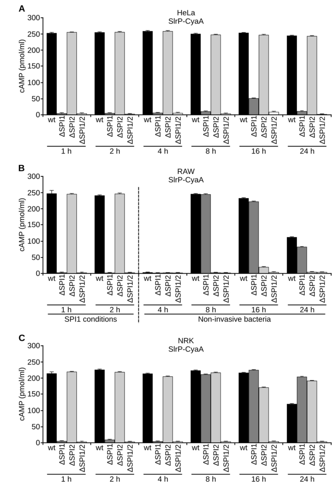

## Question

# Gene Research for Functional Annotation

## ⚠️ CRITICAL: Gene/Protein Identification Context

**BEFORE YOU BEGIN RESEARCH:** You MUST verify you are researching the CORRECT gene/protein. Gene symbols can be ambiguous, especially for less well-characterized genes from non-model organisms.

### Target Gene/Protein Identity (from UniProt):
- **UniProt Accession:** Q8ZQQ2
- **Protein Description:** RecName: Full=E3 ubiquitin-protein ligase SlrP; EC=2.3.2.27; AltName: Full=RING-type E3 ubiquitin transferase SlrP {ECO:0000305}; AltName: Full=Secreted effector protein SlrP;
- **Gene Information:** Name=slrP; OrderedLocusNames=STM0800;
- **Organism (full):** Salmonella typhimurium (strain LT2 / SGSC1412 / ATCC 700720).
- **Protein Family:** Belongs to the LRR-containing bacterial E3 ligase family.
- **Key Domains:** Leu-rich_rpt. (IPR001611); Leu-rich_rpt_typical-subtyp. (IPR003591); LRR-bact_E3_ubiq_ligases. (IPR051071); LRR_dom_sf. (IPR032675); LRR_E3_ligase_N. (IPR032674)

### MANDATORY VERIFICATION STEPS:

1. **Check if the gene symbol "slrP" matches the protein description above**
2. **Verify the organism is correct:** Salmonella typhimurium (strain LT2 / SGSC1412 / ATCC 700720).
3. **Check if protein family/domains align with what you find in literature**
4. **If you find literature for a DIFFERENT gene with the same or similar symbol, STOP**

### If Gene Symbol is Ambiguous or You Cannot Find Relevant Literature:

**DO NOT PROCEED WITH RESEARCH ON A DIFFERENT GENE.** Instead:
- State clearly: "The gene symbol 'slrP' is ambiguous or literature is limited for this specific protein"
- Explain what you found (e.g., "Found extensive literature on a different gene with the same symbol in a different organism")
- Describe the protein based ONLY on the UniProt information provided above
- Suggest that the protein function can be inferred from domain/family information

### Research Target:

Please provide a comprehensive research report on the gene **slrP** (gene ID: slrP, UniProt: Q8ZQQ2) in SALTY.

The research report should be a detailed narrative explaining the function, biological processes, and localization of the gene product. Citations should be given for all claims.

You should prioritize authoritative reviews and primary scientific literature when conducting research. You can supplement
this with annotations you find in gene/protein databases, but these can be outdated or inaccurate.

We are specifically interested in the primary function of the gene - for enzymes, what reaction is catalyzed, and what is the substrate specificity? For transporters, what is the substrate? For structural proteins or adapters, what is the broader structural role? For signaling molecules, what is the role in the pathway.

We are interested in where in or outside the cell the gene product carries out its function.

We are also interested in the signaling or biochemical pathways in which the gene functions. We are less interested in broad pleiotropic effects, except where these elucidate the precise role.

Include evidence where possible. We are interested in both experimental evidence as well as inference from structure, evolution, or bioinformatic analysis. Precise studies should be prioritized over high-throughput, where available.

## Output

Question: You are an expert researcher providing comprehensive, well-cited information.

Provide detailed information focusing on:
1. Key concepts and definitions with current understanding
2. Recent developments and latest research (prioritize 2023-2024 sources)
3. Current applications and real-world implementations
4. Expert opinions and analysis from authoritative sources
5. Relevant statistics and data from recent studies

Format as a comprehensive research report with proper citations. Include URLs and publication dates where available.
Always prioritize recent, authoritative sources and provide specific citations for all major claims.

# Gene Research for Functional Annotation

## ⚠️ CRITICAL: Gene/Protein Identification Context

**BEFORE YOU BEGIN RESEARCH:** You MUST verify you are researching the CORRECT gene/protein. Gene symbols can be ambiguous, especially for less well-characterized genes from non-model organisms.

### Target Gene/Protein Identity (from UniProt):
- **UniProt Accession:** Q8ZQQ2
- **Protein Description:** RecName: Full=E3 ubiquitin-protein ligase SlrP; EC=2.3.2.27; AltName: Full=RING-type E3 ubiquitin transferase SlrP {ECO:0000305}; AltName: Full=Secreted effector protein SlrP;
- **Gene Information:** Name=slrP; OrderedLocusNames=STM0800;
- **Organism (full):** Salmonella typhimurium (strain LT2 / SGSC1412 / ATCC 700720).
- **Protein Family:** Belongs to the LRR-containing bacterial E3 ligase family.
- **Key Domains:** Leu-rich_rpt. (IPR001611); Leu-rich_rpt_typical-subtyp. (IPR003591); LRR-bact_E3_ubiq_ligases. (IPR051071); LRR_dom_sf. (IPR032675); LRR_E3_ligase_N. (IPR032674)

### MANDATORY VERIFICATION STEPS:

1. **Check if the gene symbol "slrP" matches the protein description above**
2. **Verify the organism is correct:** Salmonella typhimurium (strain LT2 / SGSC1412 / ATCC 700720).
3. **Check if protein family/domains align with what you find in literature**
4. **If you find literature for a DIFFERENT gene with the same or similar symbol, STOP**

### If Gene Symbol is Ambiguous or You Cannot Find Relevant Literature:

**DO NOT PROCEED WITH RESEARCH ON A DIFFERENT GENE.** Instead:
- State clearly: "The gene symbol 'slrP' is ambiguous or literature is limited for this specific protein"
- Explain what you found (e.g., "Found extensive literature on a different gene with the same symbol in a different organism")
- Describe the protein based ONLY on the UniProt information provided above
- Suggest that the protein function can be inferred from domain/family information

### Research Target:

Please provide a comprehensive research report on the gene **slrP** (gene ID: slrP, UniProt: Q8ZQQ2) in SALTY.

The research report should be a detailed narrative explaining the function, biological processes, and localization of the gene product. Citations should be given for all claims.

You should prioritize authoritative reviews and primary scientific literature when conducting research. You can supplement
this with annotations you find in gene/protein databases, but these can be outdated or inaccurate.

We are specifically interested in the primary function of the gene - for enzymes, what reaction is catalyzed, and what is the substrate specificity? For transporters, what is the substrate? For structural proteins or adapters, what is the broader structural role? For signaling molecules, what is the role in the pathway.

We are interested in where in or outside the cell the gene product carries out its function.

We are also interested in the signaling or biochemical pathways in which the gene functions. We are less interested in broad pleiotropic effects, except where these elucidate the precise role.

Include evidence where possible. We are interested in both experimental evidence as well as inference from structure, evolution, or bioinformatic analysis. Precise studies should be prioritized over high-throughput, where available.

# Functional Annotation Research Report: *slrP* (UniProt Q8ZQQ2) in *Salmonella enterica* serovar Typhimurium (strain LT2 context)

## 1. Target verification (mandatory identity check)
The literature retrieved is consistent with the UniProt target identity **Q8ZQQ2**: **SlrP** is a *Salmonella enterica* serovar Typhimurium **type III–secreted effector** and a **leucine-rich repeat (LRR/LPX)–containing bacterial E3 ubiquitin ligase** belonging to the **NEL (novel E3 ligase) family**, with an N-terminal LRR/LPX region and a C-terminal catalytic NEL domain. (pillay2023speakingthehost pages 8-11, bullonesbolanos2022snrpd2isa pages 16-17)

## 2. Key concepts and definitions (current understanding)

### 2.1 SlrP as a NEL-family E3 ubiquitin ligase
NEL-family effectors are bacterial E3 ligases delivered into host cells by type III secretion systems (T3SS). They use a **HECT-like transthiolation mechanism**: the effector receives ubiquitin from a host E2~Ub conjugate onto a **catalytic cysteine** (thioester intermediate) and then transfers ubiquitin to substrate lysines. This family architecture typically includes an N-terminal substrate-recognition/autoinhibitory region (LRR/LPX) and a C-terminal catalytic NEL domain; one synthesis source reports SlrP has a **catalytic cysteine at C546** and a multi-LRR N-terminus. (e2024investigatingthefunctional pages 30-37, pillay2023speakingthehost pages 11-12)

### 2.2 What reaction SlrP catalyzes (EC 2.3.2.27)
Functionally, SlrP catalyzes **ubiquitin transfer** (E3 ubiquitin ligase activity; EC 2.3.2.27) from a host E2 enzyme to host protein substrates, producing ubiquitinated host proteins (often observed as polyubiquitin “ladders” in vitro). (bullonesbolanos2022snrpd2isa pages 8-11, pillay2023speakingthehost pages 8-11)

### 2.3 Substrate specificity determinants
Recent work comparing Salmonella NELs (SlrP, SspH1, SspH2) shows the **N-terminal (LRR-containing) region confers target specificity**, demonstrated using chimeric proteins that swap N- and C-terminal regions and alter which targets are ubiquitinated. (bullonesbolanos2024specificitiesandredundancies pages 1-2, bullonesbolanos2024specificitiesandredundancies pages 10-12)

## 3. Cellular localization and delivery (where SlrP acts)

### 3.1 Secretion/translocation route: SPI-1/T3SS1 and SPI-2/T3SS2
A key foundational study directly tested SlrP expression and translocation and concluded that **SlrP can be translocated by both T3SS1 (SPI-1) and T3SS2 (SPI-2)**. Importantly, the system used depends on **host cell type and infection timing**: in RAW264.7 macrophages the authors report **T3SS1 dependence early (1 h post-infection)** and **T3SS2 dependence later (6 h post-infection)**. (corderoalba2014patternsofexpression pages 1-2)

These timing and secretion-system dependencies are also visually supported by the cropped figure evidence from the same study (cAMP/CyaA′-based translocation assays across cell types and time points). (corderoalba2014patternsofexpression media e8f1f702)

A more recent comparative study likewise profiled NEL effector translocation using CyaA′ fusions in HeLa, RAW264.7, and NRK cells and collected readouts at **2, 4, and 8 h post-infection**, finding that (under native promoter control) SlrP is detectable at both short and long times, and that **translocation into RAW264.7 at 8 h is T3SS2-dependent** (using SPI mutants). (bullonesbolanos2024specificitiesandredundancies pages 10-12)

### 3.2 Intracellular localization after delivery
Following translocation, SlrP localizes **primarily in the host cytosol** and **partly at the endoplasmic reticulum (ER)**. (corderoalba2014patternsofexpression pages 1-2)

## 4. Regulation of *slrP* expression (bacterial-side control)

### 4.1 Induction conditions and regulatory network
SlrP expression is **optimal under intravacuolar-mimicking conditions** that induce SPI-2 (e.g., low pH/low Mg2+). (corderoalba2014patternsofexpression pages 1-2)

A genetic search for regulators identified **LeuO**, **Lon**, and the **PhoQ/PhoP** two-component system as regulators of *slrP*. The same study concluded that **PhoP directly activates *slrP* transcription under SPI-2–inducing conditions**, while **LeuO and Lon act via HilD under SPI-1–inducing conditions**. (corderoalba2014patternsofexpression pages 1-2)

Cropped figure evidence from this work also supports the PhoP/PhoQ regulatory role and promoter architecture. (corderoalba2014patternsofexpression media 25d6ccc9, corderoalba2014patternsofexpression media 110b31be)

In a 2024 study focused on NEL-family effectors, transcription of *slrP* (and the other NELs) is likewise described as dependent on **PhoP**, and in vivo expression in macrophage infection required PhoP. (bullonesbolanos2024specificitiesandredundancies pages 1-2, bullonesbolanos2024specificitiesandredundancies pages 10-12)

## 5. Host targets (substrates/partners), biochemical consequences, and pathways

### 5.1 Thioredoxin-1 (Trx1): oxidative stress and cell-death linkage
Multiple sources describe SlrP as interacting with mammalian **thioredoxin-1 (Trx1)** and catalyzing its ubiquitination. This ubiquitination is reported to **reduce thioredoxin activity** and is linked to **host cell death/cytotoxicity** during infection. (bullonesbolanos2024specificitiesandredundancies pages 2-3, pillay2023speakingthehost pages 8-11)

A 2023 effector-focused review contextualizes thioredoxin’s roles in oxidative stress regulation and downstream transcription factor responses (including NF-κB and p53) while summarizing SlrP’s ability to ubiquitinate thioredoxin and its association with cytotoxic outcomes. (pillay2023speakingthehost pages 11-12)

### 5.2 ERdj3: ER chaperone/folding interference
SlrP binds the human ER chaperone **ERdj3** and can **interfere with ERdj3 folding activity**, which is reported as another mechanism contributing to host cell death. (bullonesbolanos2024specificitiesandredundancies pages 1-2, worley2025salmonellatypeiii pages 11-12)

### 5.3 SNRPD2: spliceosome targeting and mapped ubiquitination sites
A 2022 primary study identified **SNRPD2 (SmD2)** as a **specific SlrP substrate**:
- SNRPD2 was found as an interactor in a yeast two-hybrid screen and validated by pull-downs using purified proteins and host-cell lysates. (bullonesbolanos2022snrpd2isa pages 8-11)
- In vitro ubiquitination assays demonstrated that **SNRPD2 is ubiquitinated by SlrP** (with polyubiquitination-like banding). (bullonesbolanos2022snrpd2isa pages 8-11)
- Mass spectrometry mapped ubiquitination to **SNRPD2 Lys85 and Lys92**, with evidence that Lys92 is preferred but not exclusive (additional lysines may be modified in a lysine-rich region). (bullonesbolanos2022snrpd2isa pages 14-16)
- Expression of SlrP in HEK293T cells did **not** produce detectable SNRPD2 degradation, suggesting **non-proteolytic** ubiquitin signaling, potentially affecting spliceosome assembly/stability. (bullonesbolanos2022snrpd2isa pages 14-16)

A 2024 NEL-family study reiterated SNRPD2 specificity and showed that chimeric constructs with SlrP’s N-terminus can confer the ability to ubiquitinate SNRPD2, supporting LRR/LPX-driven specificity. (bullonesbolanos2024specificitiesandredundancies pages 10-12)

### 5.4 E2 partner usage
A 2023 review identifies **Ube2D2** as an E2 conjugating enzyme implicated in SlrP-mediated ubiquitination; additional synthesis notes that NELs commonly utilize **UBE2D-family** E2s. (pillay2023speakingthehost pages 8-11, e2024investigatingthefunctional pages 30-37)

## 6. Biological roles in infection (phenotypes) and quantitative findings

### 6.1 Immune modulation: dendritic cell migration and antigen presentation
A 2023 review focusing on immune manipulation lists SlrP among effectors involved in adaptive immune interference, attributing a role in **inhibiting dendritic cell (DC) migration**, while explicitly noting that the mechanism remains to be determined. (zhou2023manipulationofhost pages 7-8, zhou2023manipulationofhost pages 8-10)

Separately, a 2023 effector review summarizes that SlrP **may ubiquitinate an unknown target to inhibit antigen presentation in dendritic cells** (hypothesis-level/unknown target). (pillay2023speakingthehost pages 8-11)

### 6.2 Intracellular proliferation and redundancy among Salmonella NEL ligases
A 2024 primary study identified **redundancy** among SlrP/SspH1/SspH2 for intracellular proliferation phenotypes: in competitive infection assays (10:1 input), only **NRK fibroblasts** showed a significant proliferation defect for the triple mutant, and **double mutants** (slrP sspH1; slrP sspH2) showed smaller but significant reductions in intracellular proliferation. (bullonesbolanos2024specificitiesandredundancies pages 10-12)

### 6.3 Quantitative context: effector numbers and secretion partitioning
In the broader Salmonella effector landscape:
- A 2024 NEL-family article states Salmonella secretes **more than 40 effectors** through its T3SSs. (bullonesbolanos2024specificitiesandredundancies pages 1-2)
- A 2014 study provided a concrete partitioning (at least in the authors’ accounting): **at least 38 effectors**, with **7 secreted via T3SS1**, **22 via T3SS2**, and **9 by both systems**. (corderoalba2014patternsofexpression pages 1-2)

### 6.4 Disease context statistics (not SlrP-specific but relevant implementation setting)
A 2024 EcoSal Plus review provides clinical-context statistics for salmonellosis: symptom onset typically **12–72 h** after exposure, symptoms often last **4–7 days**, and **<5%** of cases develop invasive disease requiring hospitalization/antimicrobials. Reported infectious dose varies from **~30 to >10^9 organisms**. (han2024infectionbiologyof pages 2-5)

## 7. Recent developments and latest research (2023–2024 emphasis)

### 7.1 2024: comparative NEL-family functional dissection
Bullones-Bolaños et al. (published Feb 2024) directly compared SlrP, SspH1, and SspH2, showing (i) PhoP-dependent transcription, (ii) secretion/translocation patterns varying with promoter context and time post infection, (iii) **target specificity encoded by N-termini**, and (iv) redundant phenotypes in intracellular proliferation assays. This study represents a recent experimental consolidation of how SlrP fits into the broader Salmonella NEL family. (bullonesbolanos2024specificitiesandredundancies pages 1-2, bullonesbolanos2024specificitiesandredundancies pages 10-12)

### 7.2 2023: synthesis of SlrP as a host-PTM effector
Pillay et al. (June 2023) emphasize that Salmonella effectors frequently catalyze eukaryotic-like PTMs and classify SlrP among NEL E3 ligases, summarizing known substrates (thioredoxin; SNRPD2) and infection-relevant phenotypes (cytotoxicity; immune presentation impacts) while noting key mechanistic gaps remain. (pillay2023speakingthehost pages 11-12, pillay2023speakingthehost pages 8-11)

### 7.3 2023: adaptive immune interference catalog (vaccine-oriented review)
Zhou et al. (Apr 2023) discuss Salmonella effectors in immune evasion and vaccine research; within the provided evidence, SlrP is specifically cataloged as inhibiting dendritic cell migration, with the mechanism explicitly unresolved, and without SlrP-specific vaccine implementation details. (zhou2023manipulationofhost pages 7-8, zhou2023manipulationofhost pages 8-10)

## 8. Current applications and real-world implementations

### 8.1 Experimental/biotechnological implementations
Across primary studies, SlrP is used as a model bacterial E3 ligase effector in:
- **CyaA′ (adenylate cyclase) translocation assays** to quantify timing and secretion-system dependence of effector delivery in mammalian cells. (corderoalba2014patternsofexpression pages 1-2, corderoalba2014patternsofexpression media e8f1f702)
- **Reporter fusions (lac/lux)** and **epitope tagging (3×FLAG)** to quantify expression and regulation under SPI-1 vs SPI-2 conditions. (corderoalba2014patternsofexpression pages 1-2, bullonesbolanos2024specificitiesandredundancies pages 10-12)
- **Yeast two-hybrid and mass spectrometry** to discover host targets and map modified residues (e.g., SNRPD2 K85/K92). (bullonesbolanos2022snrpd2isa pages 14-16)

These are concrete, real-world laboratory implementations that underpin mechanistic annotation.

### 8.2 Translational implications (anti-virulence/vaccine concepts)
The vaccine/immune-defense review frames effector-driven immune modulation as relevant to vaccine research broadly, but within the retrieved excerpts **SlrP is not singled out** as a direct vaccine antigen or as a specific deletion target for attenuation; rather, it is listed as an effector that inhibits DC migration with unknown mechanism. (zhou2023manipulationofhost pages 7-8, zhou2023manipulationofhost pages 8-10)

Therefore, the most defensible translational statement from the retrieved evidence is that **SlrP contributes to immune modulation and virulence-associated host cell outcomes**, making it a plausible anti-virulence target conceptually, but **SlrP-specific therapeutic/vaccine implementations were not evidenced in the retrieved sources**.

## 9. Expert opinions / authoritative synthesis (what experts emphasize)
Authoritative synthesis sources (2023–2024) converge on three expert-level interpretations:
1. **SlrP is a specialized, eukaryotic-like enzymatic effector** that uses ubiquitin signaling to rewire host processes. (pillay2023speakingthehost pages 8-11, bullonesbolanos2024specificitiesandredundancies pages 1-2)
2. **Substrate specificity is encoded in the N-terminal LRR/LPX region**, and redundancy with other NEL ligases can mask phenotypes—suggesting systems-level interpretation is necessary when assigning virulence roles. (bullonesbolanos2024specificitiesandredundancies pages 10-12, bullonesbolanos2024specificitiesandredundancies pages 1-2)
3. **Mechanistic gaps remain** between known biochemical substrates (e.g., Trx1, SNRPD2) and higher-order phenotypes (antigen presentation, anorexia/inflammasome, DC migration), indicating ongoing research needs. (pillay2023speakingthehost pages 11-12, zhou2023manipulationofhost pages 7-8)

## 10. Evidence map (artifact)
The following table consolidates the main functional-annotation claims and supporting evidence.

| Aspect | Key findings | Evidence type (review/primary) | Experimental system (if applicable) | Source (author year journal) | URL/DOI | Citation id placeholder |
|---|---|---|---|---|---|---|
| Identity/domains | SlrP is the *Salmonella enterica* serovar Typhimurium Salmonella leucine-rich repeat protein, a member of the NEL (novel E3 ligase) family with an N-terminal LRR/LPX substrate-recognition region and a C-terminal catalytic NEL domain; one source notes a catalytic cysteine at C546 and ~10–11 LRRs. | Review + primary | Comparative/domain analyses; family summaries | Pillay et al. 2023 *Microbiology*; Bullones-Bolaños et al. 2022 *Biology*; Dubrule 2024 | https://doi.org/10.1099/mic.0.001342; https://doi.org/10.3390/biology11101517; https://doi.org/10.7939/r3-sw4j-1k92 | (pillay2023speakingthehost pages 8-11, e2024investigatingthefunctional pages 30-37, bullonesbolanos2022snrpd2isa pages 16-17) |
| Secretion/translocation | SlrP is translocated into host cells by both SPI-1/T3SS1 and SPI-2/T3SS2. In macrophages, translocation shows timing dependence: T3SS1 contributes early (1 h p.i.) and T3SS2 later (6–8 h p.i.); native-promoter SlrP is detectable at both short and long infection times. | Review + primary | CyaA' translocation assays in HeLa, RAW264.7, NRK cells; SPI mutants (e.g., *ssaV*, *prgH*) | Cordero-Alba & Ramos-Morales 2014 *Journal of Bacteriology*; Pillay et al. 2023 *Microbiology*; Bullones-Bolaños et al. 2024 *Frontiers in Immunology* | https://doi.org/10.1128/jb.02158-14; https://doi.org/10.1099/mic.0.001342; https://doi.org/10.3389/fimmu.2024.1328707 | (corderoalba2014patternsofexpression pages 1-2, pillay2023speakingthehost pages 8-11, bullonesbolanos2024specificitiesandredundancies pages 10-12) |
| Regulation | *slrP* expression is optimal under intravacuolar-like, SPI2-inducing conditions (low pH/low Mg2+). Regulators identified include PhoQ/PhoP, LeuO, and Lon; PhoP directly activates transcription under SPI2-inducing conditions, while LeuO and Lon act through HilD under SPI1-inducing conditions. In vivo expression in macrophages requires PhoP. | Primary + recent primary synthesis | lac/lux transcriptional fusions, 3xFLAG immunoblotting, promoter mapping, infection assays | Cordero-Alba & Ramos-Morales 2014 *Journal of Bacteriology*; Bullones-Bolaños et al. 2024 *Frontiers in Immunology* | https://doi.org/10.1128/jb.02158-14; https://doi.org/10.3389/fimmu.2024.1328707 | (corderoalba2014patternsofexpression pages 1-2, bullonesbolanos2024specificitiesandredundancies pages 10-12, bullonesbolanos2024specificitiesandredundancies pages 1-2) |
| Enzymatic mechanism | SlrP is a bacterial E3 ubiquitin ligase (EC 2.3.2.27) of the NEL family. NEL ligases act via a HECT-like transthiolation mechanism involving a catalytic cysteine and autoinhibition relieved by substrate/ubiquitin-dependent conformational change of the LRR region. SlrP ubiquitinates thioredoxin and SNRPD2; SNRPD2 shows a polyubiquitination ladder in vitro. SlrP-specific ubiquitin linkage preference was not established in the cited evidence. | Review + primary | In vitro ubiquitination assays with purified proteins; mechanistic family comparisons | Pillay et al. 2023 *Microbiology*; Bullones-Bolaños et al. 2022 *Biology*; Dubrule 2024 | https://doi.org/10.1099/mic.0.001342; https://doi.org/10.3390/biology11101517; https://doi.org/10.7939/r3-sw4j-1k92 | (pillay2023speakingthehost pages 8-11, pillay2023speakingthehost pages 11-12, e2024investigatingthefunctional pages 30-37, bullonesbolanos2022snrpd2isa pages 8-11) |
| E2 partners | The reported host E2 partner for SlrP is Ube2D2; broader NEL-family summaries note preference for UBE2D-family enzymes. | Review + mechanistic synthesis | Ubiquitination pathway mapping in reviews | Pillay et al. 2023 *Microbiology*; Dubrule 2024 | https://doi.org/10.1099/mic.0.001342; https://doi.org/10.7939/r3-sw4j-1k92 | (pillay2023speakingthehost pages 8-11, e2024investigatingthefunctional pages 30-37) |
| Host substrates/interaction partners | Supported host partners/substrates include thioredoxin/Trx1 (ubiquitinated; activity reduced), ERdj3 (binds in ER; interferes with folding), and SNRPD2 (specific ubiquitination substrate among Salmonella NELs). A 2024 study reports 14 new SlrP interactors from a screen, with SNRPD2 validated. Interaction with TRIM32 was mentioned in a review snippet, but no mechanistic significance was established in the provided evidence. | Review + primary | Yeast two-hybrid, pull-downs, HeLa/HEK293T expression, purified-protein assays, mass spectrometry | Bullones-Bolaños et al. 2022 *Biology*; Bullones-Bolaños et al. 2024 *Frontiers in Immunology*; Pillay et al. 2023 *Microbiology* | https://doi.org/10.3390/biology11101517; https://doi.org/10.3389/fimmu.2024.1328707; https://doi.org/10.1099/mic.0.001342 | (pillay2023speakingthehost pages 11-12, bullonesbolanos2024specificitiesandredundancies pages 1-2, bullonesbolanos2022snrpd2isa pages 8-11, bullonesbolanos2022snrpd2isa pages 16-17, bullonesbolanos2022snrpd2isa pages 14-16) |
| Cellular localization | After translocation, SlrP localizes mainly to the host cytosol and partially to the endoplasmic reticulum; ER localization is consistent with ERdj3 interaction. | Primary | Host-cell localization studies summarized in expression/translocation work | Cordero-Alba & Ramos-Morales 2014 *Journal of Bacteriology* | https://doi.org/10.1128/jb.02158-14 | (corderoalba2014patternsofexpression pages 1-2) |
| Phenotypes/biological role | Reported roles include promotion of host cell death/cytotoxicity, contribution to virulence in vivo, inhibition of antigen presentation in dendritic cells, and possible prevention of host anorexia via inflammasome inhibition; however, for several phenotypes the direct substrate-to-phenotype link remains unresolved. SlrP, together with SspH1/SspH2, contributes redundantly to intracellular proliferation in fibroblasts. | Review + recent primary | Infection phenotypes in epithelial cells, dendritic cells, fibroblasts; review synthesis | Pillay et al. 2023 *Microbiology*; Bullones-Bolaños et al. 2024 *Frontiers in Immunology*; Worley 2025 *IJMS* | https://doi.org/10.1099/mic.0.001342; https://doi.org/10.3389/fimmu.2024.1328707; https://doi.org/10.3390/ijms26062611 | (pillay2023speakingthehost pages 11-12, worley2025salmonellatypeiii pages 11-12, bullonesbolanos2024specificitiesandredundancies pages 10-12, bullonesbolanos2024specificitiesandredundancies pages 1-2) |
| Quantitative/statistical notes | Salmonella encodes >40 effectors overall; one 2014 source notes at least 38 effectors categorized as 7 T3SS1-only, 22 T3SS2-only, and 9 secreted by both systems. Translocation/readouts in recent work were measured at 2, 4, and 8 h p.i.; competitive intracellular proliferation assays used a 10:1 input ratio, and only NRK fibroblasts showed a significant defect for the *slrP sspH1 sspH2* triple mutant, with smaller significant reductions for *slrP sspH1* and *slrP sspH2* double mutants. For SNRPD2, ubiquitinated lysines K85 and K92 were mapped, with Lys92 preferred but not exclusive. | Primary + review | cAMP translocation assays, competitive infection assays, mass spectrometry mapping | Cordero-Alba & Ramos-Morales 2014 *Journal of Bacteriology*; Bullones-Bolaños et al. 2022 *Biology*; Bullones-Bolaños et al. 2024 *Frontiers in Immunology*; Pillay et al. 2023 *Microbiology* | https://doi.org/10.1128/jb.02158-14; https://doi.org/10.3390/biology11101517; https://doi.org/10.3389/fimmu.2024.1328707; https://doi.org/10.1099/mic.0.001342 | (corderoalba2014patternsofexpression pages 1-2, bullonesbolanos2024specificitiesandredundancies pages 10-12, bullonesbolanos2022snrpd2isa pages 14-16, pillay2023speakingthehost pages 8-11, bullonesbolanos2024specificitiesandredundancies pages 1-2) |

*Table: This table summarizes evidence-supported functional annotation for Salmonella Typhimurium SlrP, including identity, secretion, regulation, enzymatic activity, host targets, localization, and phenotypic roles. It is useful as a compact evidence map linking each annotation claim to specific recent reviews and primary studies.*

A concise annotation-ready statement is provided here:

> SlrP is a *Salmonella enterica* serovar Typhimurium leucine-rich repeat (LRR/LPX)–NEL family type III secretion effector and E3 ubiquitin ligase that is delivered into host cells by both SPI-1/T3SS1 and SPI-2/T3SS2, with translocation varying by host cell type and infection stage. After translocation, it acts mainly in the host cytosol and partly at the endoplasmic reticulum, where it catalyzes ubiquitin transfer to selected host proteins, including thioredoxin-1, the ER chaperone ERdj3-associated pathway, and the spliceosomal protein SNRPD2; these activities are linked to reduced thioredoxin function, interference with ERdj3 folding activity, and likely non-proteolytic modulation of host RNA-processing machinery through SNRPD2 ubiquitination at K85/K92. (corderoalba2014patternsofexpression pages 1-2, bullonesbolanos2022snrpd2isa pages 14-16, pillay2023speakingthehost pages 8-11, bullonesbolanos2024specificitiesandredundancies pages 1-2)

*Blockquote: This blockquote summarizes the most evidence-supported functional annotation for SlrP: its identity, secretion route, enzymatic activity, major host substrates, and intracellular site of action. It is useful as a concise evidence-based statement for gene/protein annotation.*

## 11. Key limitations of the current evidence set
- **Ubiquitin chain linkage specificity** (e.g., K48 vs K63) for SlrP is not established in the extracted excerpts; linkage preferences are noted for other NELs (SspH1/SspH2) but not SlrP. (bullonesbolanos2024specificitiesandredundancies pages 1-2)
- Some phenotypes attributed to SlrP (antigen presentation inhibition; inflammasome/anorexia effects) are summarized in review form without direct mechanistic substrate mapping in the retrieved primary excerpts. (pillay2023speakingthehost pages 11-12, pillay2023speakingthehost pages 8-11)
- The UniProt target is defined for **strain LT2**, while several primary studies used strain **14028** backgrounds; nonetheless, SlrP function and classification are consistently described at the serovar level, and regulators/translocation patterns are expected to be broadly conserved but should be checked for strain-specific differences if LT2-specific precision is required. (corderoalba2014patternsofexpression pages 1-2, bullonesbolanos2022snrpd2isa pages 16-17)

## 12. Key references (with URLs and publication dates)
- Cordero-Alba M, Ramos-Morales F. **Patterns of Expression and Translocation of the Ubiquitin Ligase SlrP in *Salmonella enterica* Serovar Typhimurium**. *Journal of Bacteriology*. **2014-11**. https://doi.org/10.1128/jb.02158-14 (corderoalba2014patternsofexpression pages 1-2, corderoalba2014patternsofexpression media e8f1f702)
- Bullones-Bolaños A, et al. **SNRPD2 Is a Novel Substrate for the Ubiquitin Ligase Activity of the Salmonella Type III Secretion Effector SlrP**. *Biology (Basel)*. **2022-10**. https://doi.org/10.3390/biology11101517 (bullonesbolanos2022snrpd2isa pages 14-16)
- Pillay TD, et al. **Speaking the host language: how Salmonella effector proteins manipulate the host**. *Microbiology*. **2023-06**. https://doi.org/10.1099/mic.0.001342 (pillay2023speakingthehost pages 11-12, pillay2023speakingthehost pages 8-11)
- Zhou G, et al. **Manipulation of host immune defenses by effector proteins delivered from multiple secretion systems of Salmonella and its application in vaccine research**. *Frontiers in Immunology*. **2023-04**. https://doi.org/10.3389/fimmu.2023.1152017 (zhou2023manipulationofhost pages 7-8)
- Bullones-Bolaños A, et al. **Specificities and redundancies in the NEL family of bacterial E3 ubiquitin ligases of *Salmonella enterica* serovar Typhimurium**. *Frontiers in Immunology*. **2024-02**. https://doi.org/10.3389/fimmu.2024.1328707 (bullonesbolanos2024specificitiesandredundancies pages 10-12, bullonesbolanos2024specificitiesandredundancies pages 1-2)
- Han J, et al. **Infection biology of *Salmonella enterica***. *EcoSal Plus*. **2024-12**. https://doi.org/10.1128/ecosalplus.esp-0001-2023 (han2024infectionbiologyof pages 24-25, han2024infectionbiologyof pages 2-5)

References

1. (pillay2023speakingthehost pages 8-11): Timesh D. Pillay, Sahampath U. Hettiarachchi, Jiyao Gan, Ines Diaz-Del-Olmo, Xiu-Jun Yu, Janina H. Muench, Teresa L.M. Thurston, and Jaclyn S. Pearson. Speaking the host language: how salmonella effector proteins manipulate the host. Jun 2023. URL: https://doi.org/10.1099/mic.0.001342, doi:10.1099/mic.0.001342. This article has 60 citations and is from a peer-reviewed journal.

2. (bullonesbolanos2022snrpd2isa pages 16-17): Andrea Bullones-Bolaños, Juan Luis Araujo-Garrido, Jesús Fernández-García, Francisco Romero, Joaquín Bernal-Bayard, and Francisco Ramos-Morales. Snrpd2 is a novel substrate for the ubiquitin ligase activity of the salmonella type iii secretion effector slrp. Biology, 11:1517, Oct 2022. URL: https://doi.org/10.3390/biology11101517, doi:10.3390/biology11101517. This article has 9 citations.

3. (e2024investigatingthefunctional pages 30-37): Bradley E Dubrule. Investigating the functional consequences of the interaction between engineered ubiquitin variants and the salmonella novel e3 ligase ssph1. Text, 2024. URL: https://doi.org/10.7939/r3-sw4j-1k92, doi:10.7939/r3-sw4j-1k92. This article has 0 citations and is from a peer-reviewed journal.

4. (pillay2023speakingthehost pages 11-12): Timesh D. Pillay, Sahampath U. Hettiarachchi, Jiyao Gan, Ines Diaz-Del-Olmo, Xiu-Jun Yu, Janina H. Muench, Teresa L.M. Thurston, and Jaclyn S. Pearson. Speaking the host language: how salmonella effector proteins manipulate the host. Jun 2023. URL: https://doi.org/10.1099/mic.0.001342, doi:10.1099/mic.0.001342. This article has 60 citations and is from a peer-reviewed journal.

5. (bullonesbolanos2022snrpd2isa pages 8-11): Andrea Bullones-Bolaños, Juan Luis Araujo-Garrido, Jesús Fernández-García, Francisco Romero, Joaquín Bernal-Bayard, and Francisco Ramos-Morales. Snrpd2 is a novel substrate for the ubiquitin ligase activity of the salmonella type iii secretion effector slrp. Biology, 11:1517, Oct 2022. URL: https://doi.org/10.3390/biology11101517, doi:10.3390/biology11101517. This article has 9 citations.

6. (bullonesbolanos2024specificitiesandredundancies pages 1-2): Andrea Bullones-Bolaños, Paula Martín-Muñoz, Claudia Vallejo-Grijalba, Joaquín Bernal-Bayard, and Francisco Ramos-Morales. Specificities and redundancies in the nel family of bacterial e3 ubiquitin ligases of salmonella enterica serovar typhimurium. Frontiers in Immunology, Feb 2024. URL: https://doi.org/10.3389/fimmu.2024.1328707, doi:10.3389/fimmu.2024.1328707. This article has 12 citations and is from a peer-reviewed journal.

7. (bullonesbolanos2024specificitiesandredundancies pages 10-12): Andrea Bullones-Bolaños, Paula Martín-Muñoz, Claudia Vallejo-Grijalba, Joaquín Bernal-Bayard, and Francisco Ramos-Morales. Specificities and redundancies in the nel family of bacterial e3 ubiquitin ligases of salmonella enterica serovar typhimurium. Frontiers in Immunology, Feb 2024. URL: https://doi.org/10.3389/fimmu.2024.1328707, doi:10.3389/fimmu.2024.1328707. This article has 12 citations and is from a peer-reviewed journal.

8. (corderoalba2014patternsofexpression pages 1-2): Mar Cordero-Alba and Francisco Ramos-Morales. Patterns of expression and translocation of the ubiquitin ligase slrp in salmonella enterica serovar typhimurium. Journal of Bacteriology, 196:3912-3922, Nov 2014. URL: https://doi.org/10.1128/jb.02158-14, doi:10.1128/jb.02158-14. This article has 29 citations and is from a peer-reviewed journal.

9. (corderoalba2014patternsofexpression media e8f1f702): Mar Cordero-Alba and Francisco Ramos-Morales. Patterns of expression and translocation of the ubiquitin ligase slrp in salmonella enterica serovar typhimurium. Journal of Bacteriology, 196:3912-3922, Nov 2014. URL: https://doi.org/10.1128/jb.02158-14, doi:10.1128/jb.02158-14. This article has 29 citations and is from a peer-reviewed journal.

10. (corderoalba2014patternsofexpression media 25d6ccc9): Mar Cordero-Alba and Francisco Ramos-Morales. Patterns of expression and translocation of the ubiquitin ligase slrp in salmonella enterica serovar typhimurium. Journal of Bacteriology, 196:3912-3922, Nov 2014. URL: https://doi.org/10.1128/jb.02158-14, doi:10.1128/jb.02158-14. This article has 29 citations and is from a peer-reviewed journal.

11. (corderoalba2014patternsofexpression media 110b31be): Mar Cordero-Alba and Francisco Ramos-Morales. Patterns of expression and translocation of the ubiquitin ligase slrp in salmonella enterica serovar typhimurium. Journal of Bacteriology, 196:3912-3922, Nov 2014. URL: https://doi.org/10.1128/jb.02158-14, doi:10.1128/jb.02158-14. This article has 29 citations and is from a peer-reviewed journal.

12. (bullonesbolanos2024specificitiesandredundancies pages 2-3): Andrea Bullones-Bolaños, Paula Martín-Muñoz, Claudia Vallejo-Grijalba, Joaquín Bernal-Bayard, and Francisco Ramos-Morales. Specificities and redundancies in the nel family of bacterial e3 ubiquitin ligases of salmonella enterica serovar typhimurium. Frontiers in Immunology, Feb 2024. URL: https://doi.org/10.3389/fimmu.2024.1328707, doi:10.3389/fimmu.2024.1328707. This article has 12 citations and is from a peer-reviewed journal.

13. (worley2025salmonellatypeiii pages 11-12): Micah J. Worley. Salmonella type iii secretion system effectors. International Journal of Molecular Sciences, 26:2611, Mar 2025. URL: https://doi.org/10.3390/ijms26062611, doi:10.3390/ijms26062611. This article has 23 citations.

14. (bullonesbolanos2022snrpd2isa pages 14-16): Andrea Bullones-Bolaños, Juan Luis Araujo-Garrido, Jesús Fernández-García, Francisco Romero, Joaquín Bernal-Bayard, and Francisco Ramos-Morales. Snrpd2 is a novel substrate for the ubiquitin ligase activity of the salmonella type iii secretion effector slrp. Biology, 11:1517, Oct 2022. URL: https://doi.org/10.3390/biology11101517, doi:10.3390/biology11101517. This article has 9 citations.

15. (zhou2023manipulationofhost pages 7-8): Guodong Zhou, Yuying Zhao, Qifeng Ma, Quan Li, Shifeng Wang, and Huoying Shi. Manipulation of host immune defenses by effector proteins delivered from multiple secretion systems of salmonella and its application in vaccine research. Frontiers in Immunology, Apr 2023. URL: https://doi.org/10.3389/fimmu.2023.1152017, doi:10.3389/fimmu.2023.1152017. This article has 25 citations and is from a peer-reviewed journal.

16. (zhou2023manipulationofhost pages 8-10): Guodong Zhou, Yuying Zhao, Qifeng Ma, Quan Li, Shifeng Wang, and Huoying Shi. Manipulation of host immune defenses by effector proteins delivered from multiple secretion systems of salmonella and its application in vaccine research. Frontiers in Immunology, Apr 2023. URL: https://doi.org/10.3389/fimmu.2023.1152017, doi:10.3389/fimmu.2023.1152017. This article has 25 citations and is from a peer-reviewed journal.

17. (han2024infectionbiologyof pages 2-5): Jing Han, Nesreen Aljahdali, Shaohua Zhao, Hailin Tang, Heather Harbottle, Maria Hoffmann, Jonathan G. Frye, and Steven L. Foley. Infection biology of <i>salmonella enterica</i>. EcoSal Plus, Dec 2024. URL: https://doi.org/10.1128/ecosalplus.esp-0001-2023, doi:10.1128/ecosalplus.esp-0001-2023. This article has 91 citations.

18. (han2024infectionbiologyof pages 24-25): Jing Han, Nesreen Aljahdali, Shaohua Zhao, Hailin Tang, Heather Harbottle, Maria Hoffmann, Jonathan G. Frye, and Steven L. Foley. Infection biology of <i>salmonella enterica</i>. EcoSal Plus, Dec 2024. URL: https://doi.org/10.1128/ecosalplus.esp-0001-2023, doi:10.1128/ecosalplus.esp-0001-2023. This article has 91 citations.

## Artifacts

- [Edison artifact artifact-00](slrP-deep-research-falcon_artifacts/artifact-00.md)
- [Edison artifact artifact-01](slrP-deep-research-falcon_artifacts/artifact-01.md)

## Citations

1. corderoalba2014patternsofexpression pages 1-2
2. bullonesbolanos2024specificitiesandredundancies pages 10-12
3. pillay2023speakingthehost pages 11-12
4. pillay2023speakingthehost pages 8-11
5. bullonesbolanos2024specificitiesandredundancies pages 1-2
6. han2024infectionbiologyof pages 2-5
7. zhou2023manipulationofhost pages 7-8
8. e2024investigatingthefunctional pages 30-37
9. bullonesbolanos2024specificitiesandredundancies pages 2-3
10. worley2025salmonellatypeiii pages 11-12
11. zhou2023manipulationofhost pages 8-10
12. han2024infectionbiologyof pages 24-25
13. https://doi.org/10.1099/mic.0.001342;
14. https://doi.org/10.3390/biology11101517;
15. https://doi.org/10.7939/r3-sw4j-1k92
16. https://doi.org/10.1128/jb.02158-14;
17. https://doi.org/10.3389/fimmu.2024.1328707
18. https://doi.org/10.3389/fimmu.2024.1328707;
19. https://doi.org/10.1099/mic.0.001342
20. https://doi.org/10.1128/jb.02158-14
21. https://doi.org/10.3390/ijms26062611
22. https://doi.org/10.3390/biology11101517
23. https://doi.org/10.3389/fimmu.2023.1152017
24. https://doi.org/10.1128/ecosalplus.esp-0001-2023
25. https://doi.org/10.1099/mic.0.001342,
26. https://doi.org/10.3390/biology11101517,
27. https://doi.org/10.7939/r3-sw4j-1k92,
28. https://doi.org/10.3389/fimmu.2024.1328707,
29. https://doi.org/10.1128/jb.02158-14,
30. https://doi.org/10.3390/ijms26062611,
31. https://doi.org/10.3389/fimmu.2023.1152017,
32. https://doi.org/10.1128/ecosalplus.esp-0001-2023,