# Pathway Summary for shc1

## Overview

shc1 encodes a squalene-hopene cyclase enzyme that represents a remarkable example of horizontal gene transfer from bacteria to eukaryotes, enabling Schizosaccharomyces japonicus to survive in anaerobic environments [PMID:34353908, PMID:40195311]. This enzyme catalyzes the oxygen-independent cyclization of squalene to hopanoids, providing sterol surrogates when oxygen-dependent ergosterol biosynthesis is impaired [PMID:40195311]. The acquisition of this bacterial enzyme has fundamentally reorganized membrane physiology in S. japonicus, allowing it to adapt to sterol-limited anaerobic conditions that are lethal to most other yeasts.

## Hopanoid Biosynthesis Pathway

shc1 catalyzes the direct, oxygen-independent cyclization of squalene to produce various hopanoids including diplopterol, hop-22(29)-ene, hop-17(21)-ene, hop-21(22)-ene, and hopan-22-ol [PMID:34353908, PMID:40195311]. Unlike sterol biosynthesis, which requires multiple enzymatic steps and molecular oxygen, hopanoid formation occurs through a single cyclization reaction that does not require oxygen [PMID:40195311]. This pathway represents a parallel lipid biosynthetic route that can function under anaerobic conditions, providing essential membrane lipids when traditional sterol biosynthesis is blocked.

## Membrane Physiology Reorganization

The hopanoids produced by shc1 serve as functional sterol surrogates, replacing ergosterol in cellular membranes during anaerobic growth [PMID:40195311]. Diplopterol, the major hopanoid detected in S. japonicus, accumulates to levels similar to ergosterol content in sterol-supplemented cultures, indicating its role as a primary membrane sterol [PMID:34353908]. These hopanoids maintain membrane integrity, fluidity, and permeability properties necessary for cellular function, enabling the yeast to survive and grow under conditions where ergosterol biosynthesis cannot occur.

## Anaerobic Survival and Metabolic Adaptation

shc1 deletion is lethal under anaerobic conditions, demonstrating the enzyme's essential role in cellular response to oxygen limitation [PMID:40195311]. Wild-type S. japonicus can grow anaerobically by producing hopanoids as sterol substitutes, while shc1 knockout strains cannot survive without oxygen [PMID:40195311]. This adaptation allows S. japonicus to occupy ecological niches unavailable to other yeasts, such as oxygen-depleted environments in fermentation processes or anaerobic zones in natural habitats.

## Subcellular Localization and Membrane Integration

shc1 localizes to multiple cellular membranes including the endoplasmic reticulum, nuclear envelope, plasma membrane, and vacuolar membranes [PMID:40195311]. This widespread membrane association positions the enzyme at sites where hopanoid incorporation into membrane lipid bilayers occurs. The enzyme's membrane localization likely facilitates the direct incorporation of newly synthesized hopanoids into membrane structures, ensuring efficient membrane maintenance during periods when sterol biosynthesis is compromised.

## Horizontal Gene Transfer and Evolution

The shc1 gene shows high similarity to bacterial squalene-hopene cyclases, particularly those from Acetobacter species, confirming its origin through horizontal gene transfer [PMID:34353908]. This transfer event represents a significant evolutionary innovation that expanded the metabolic capabilities of S. japonicus beyond those of typical yeasts. The successful integration of a bacterial metabolic pathway into eukaryotic physiology demonstrates the potential for horizontal gene transfer to drive major evolutionary transitions and enable adaptation to new ecological niches.

## Hopanoid Biosynthesis and Anaerobic Adaptation Pathway Diagram

```mermaid
graph TD
    A["Squalene (C30 Triterpene)"] --> B["shc1: Squalene-Hopene Cyclase"]

    C["Oxygen-Independent Reaction"] -.-> B
    D["Single-Step Cyclization"] -.-> B
    E["Intramolecular Transferase Activity"] -.-> B

    B --> F["Diplopterol (Major Product)"]
    B --> G["Hop-22(29)-ene"]
    B --> H["Hop-17(21)-ene"]
    B --> I["Hop-21(22)-ene"]
    B --> J["Hopan-22-ol"]

    F --> K["Membrane Integration"]
    G --> K
    H --> K
    I --> K
    J --> K

    K --> L["Membrane Fluidity Maintenance"]
    K --> M["Membrane Integrity"]
    K --> N["Permeability Regulation"]

    O["Anaerobic Conditions"] --> P["Ergosterol Biosynthesis Blocked"]
    P --> Q["Oxygen-Dependent Pathway Inactive"]
    Q --> R["Hopanoids as Sterol Surrogates"]

    F --> R
    G --> R
    H --> R
    I --> R
    J --> R

    S["ER Membrane Localization"] -.-> B
    T["Nuclear Envelope"] -.-> B
    U["Plasma Membrane"] -.-> B
    V["Vacuolar Membrane"] -.-> B

    W["Horizontal Gene Transfer from Acetobacter"] -.-> B
    X["Bacterial Origin"] -.-> B
    Y["Evolutionary Innovation"] -.-> B

    Z["Cellular Survival Under Anoxia"] --> R
    AA["Growth in Oxygen-Limited Environments"] --> R
    BB["Metabolic Flexibility"] --> R

    CC["shc1Δ Lethal Phenotype"] --> O
    DD["Essential for Anaerobic Growth"] --> B
```

## Comparison with Sterol Biosynthesis

The hopanoid pathway represents a fundamentally different approach to membrane lipid production compared to traditional eukaryotic sterol biosynthesis [PMID:40195311]. While ergosterol biosynthesis requires oxygen for several enzymatic steps and involves complex multi-enzyme pathways, hopanoid production occurs through a single oxygen-independent cyclization reaction. This simplicity provides metabolic advantages under anaerobic conditions but comes at the cost of reduced structural diversity compared to the varied sterol molecules produced by conventional pathways.

## Biotechnological and Industrial Applications

The unique properties of shc1 make it valuable for biotechnological applications requiring anaerobic growth or sterol-independent membrane function [PMID:34353908]. Expression of shc1 in S. cerevisiae enabled hopanoid synthesis and improved anaerobic growth in sterol-free media, demonstrating the potential for engineering improved anaerobic fermentation strains [PMID:34353908]. This capability could be exploited for industrial fermentation processes where oxygen limitation is desired or where sterol supplementation is costly or impractical.

## Medical and Environmental Significance

Understanding hopanoid biosynthesis has broader implications for microbiology and environmental science, as hopanes are commonly found geological biomarkers that provide information about ancient microbial communities and environmental conditions. The study of shc1 in S. japonicus provides insights into how eukaryotes can adapt to oxygen-limited environments, which may be relevant for understanding early Earth environments or modern oxygen-depleted ecosystems. Additionally, the enzyme could serve as a model for developing novel lipid biosynthetic pathways in biotechnology applications.

## Metabolic Engineering and Synthetic Biology

The successful horizontal transfer and functional integration of shc1 demonstrates principles that could inform synthetic biology approaches for introducing novel metabolic capabilities into engineered organisms [PMID:40195311]. The enzyme's ability to provide an alternative to sterol biosynthesis could be exploited in metabolic engineering strategies for producing organisms with enhanced anaerobic capabilities or reduced oxygen requirements. Understanding the regulatory and localization mechanisms that enable shc1 function in eukaryotic cells provides valuable insights for designing effective metabolic engineering strategies.