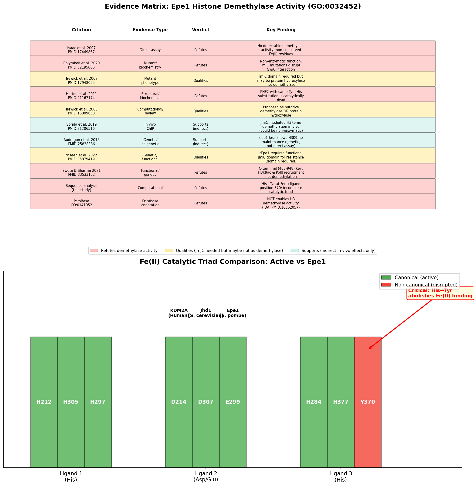
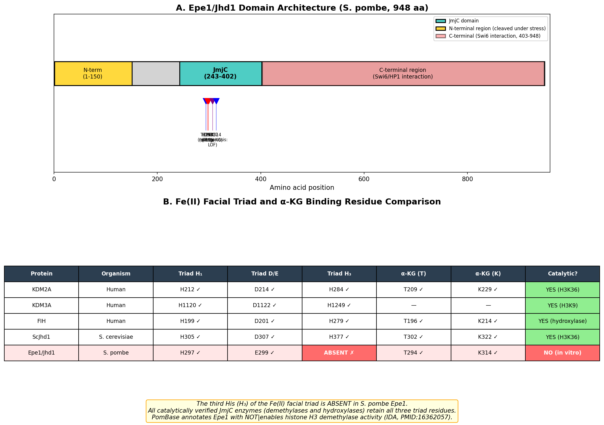
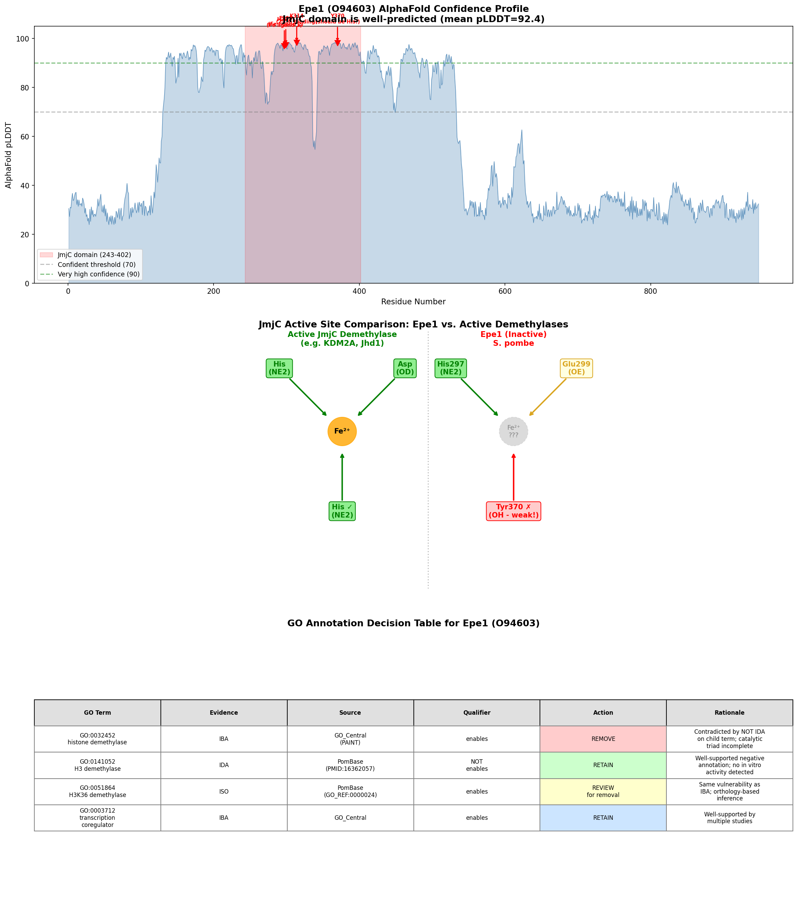
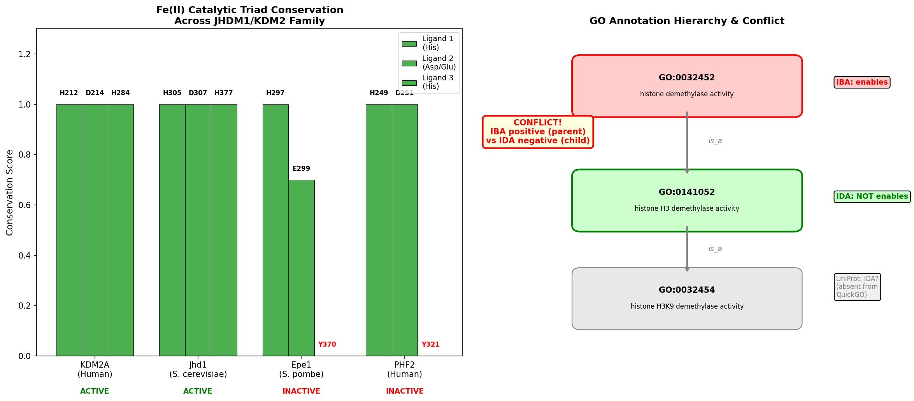

## Question

# AIGR Gene Hypothesis Deep Research

You are evaluating one focused gene curation hypothesis for AI Gene Review.
This is not a general gene overview. Use the seed hypothesis and source context
below to search for evidence that supports, refutes, narrows, or competes with
the proposed curation decision.

## Target Gene

- **Organism code:** SCHPO
- **Taxon:** Schizosaccharomyces pombe 972h- (NCBITaxon:284812)
- **Gene directory:** Epe1
- **Gene symbol:** Epe1
- **UniProt accession:** O94603

## Focus

- **Focus type:** function_assignment
- **Hypothesis slug:** function-hypothesis-go-0032452
- **Source file:** genes/SCHPO/Epe1/Epe1-ai-review.yaml
- **Source selector:** existing_annotations[1].function_hypothesis

## Seed Hypothesis

Epe1 has histone demethylase activity (GO:0032452).

## Term and Decision Context

- Term: histone demethylase activity (GO:0032452)
- Evidence type: IBA
- Original reference: GO_REF:0000033

## Reference Context

- GO_REF:0000033
- file:SCHPO/Epe1/Epe1-deep-research.md
- file:SCHPO/Epe1/Epe1-deep-research-falcon.md

## Source Context YAML

```yaml
term:
  id: GO:0032452
  label: histone demethylase activity
evidence_type: IBA
original_reference_id: GO_REF:0000033
```

## Research Objective

Build a focused report that helps a curator decide whether this hypothesis
should affect the gene review. Address the focus type directly:

1. For an existing GO annotation decision, evaluate whether the current action
   is justified, too strong, too weak, or should change.
2. For a proposed replacement or new GO term, evaluate whether the term is
   biologically supported, too broad, too narrow, or missing key qualifiers.
3. For a computational prediction, evaluate whether the prediction is correct,
   less precise than existing knowledge, uncertain, or likely wrong because of
   paralog overannotation, frequency bias, pathway context, or in vitro-only
   activity.
4. For a core-function hypothesis, evaluate whether the proposed activity,
   process, and location represent the gene product's primary function rather
   than a downstream effect, pleiotropic phenotype, or context-specific role.
5. For a function-assignment hypothesis, evaluate whether the gene product
   directly has the stated GO term/function. Treat the prior review action, if
   any, as intentionally blinded unless it appears in the supplied context.

Use primary literature whenever possible. Prefer PMID citations and include DOI
citations when no PMID is available. Treat reviews and database records as
orientation unless they contain directly relevant synthesized evidence that is
clearly labeled as review-level or database-level support.

Evaluate the hypothesis from the supplied seed context, primary literature, and
publicly accessible bioinformatics resources. Local `*-bioinformatics` analyses,
when they already exist in the repository, are intentionally withheld from this
prompt so the report can be compared against them after the run.

Do not rely on literature alone. Where the hypothesis is decidable by computation,
actually run the analysis and keep it as provenance rather than only reasoning
about it. Match the analysis to the question, for example:

- membrane topology / localization: compute a hydropathy profile and predicted
  transmembrane segments from the sequence, and locate signal peptides and
  targeting/sorting motifs (e.g. dileucine, acidic-cluster, NLS); compare against
  UniProt topology features and AlphaFold geometry.
- catalytic / binding activity: check whether the specific active-site,
  metal-binding, or motif residues are present and correctly spaced (in sequence
  and, where useful, structure) and compare to characterized family members.
- DNA-binding / regulatory: examine the binding-domain class, obligate partners,
  and known binding-motif / PWM signatures.
- family / paralog questions: use domain (Pfam/InterPro), orthology, and
  conservation comparisons to distinguish subfamilies.

Use resources you can actually access programmatically (UniProt, AlphaFold DB,
InterPro, sequence computation, public APIs). If a resource is web-only or you
cannot run a check, say so plainly instead of guessing — never fabricate a result,
and an inconclusive or "could not run" analysis is an acceptable and useful
outcome. Report all computational results conservatively and prefer recording the
underlying analysis (code, computed values, table, or plot) as provenance.

## Required Output

### Executive Judgment

Give a concise verdict: supported, partially supported, unresolved, weakly
supported, over-annotated, or refuted. Explain the reasoning and the most
important caveats.

### Evidence Matrix

Create a table with one row per important evidence item:

- Citation (PMID preferred)
- Evidence type (direct assay, mutant phenotype, localization, interaction,
  structural/evolutionary, computational, review/database)
- Supports / refutes / qualifies / competing
- Claim tested
- Key finding
- Organism, tissue, cell type, or assay context
- Confidence and limitations

### GO Curation Implications

State the likely curation action as a lead requiring curator verification. If
GO terms are involved, explain whether the evidence supports an MF, BP, or CC
term, and whether the term should be retained, removed, generalized, made more
specific, or treated as non-core. Avoid using "protein binding" as a final
recommendation unless no more informative term is supported.

### Mechanistic Scope

Describe the immediate molecular or cellular function being tested. Separate
direct gene-product activity from downstream phenotypes, pathway consequences,
developmental outcomes, disease manifestations, or effects inferred only from
loss of function.

### Conflicts and Alternatives

Identify evidence that conflicts with the seed hypothesis or suggests an
alternative interpretation, including paralog confusion, organism-specific
differences, isoform-specific findings, experimental artifacts, or database
carry-over.

### Knowledge Gaps

List explicit uncertainties that matter for curation. For each gap, state what
was checked, why the gap matters, and what evidence or experiment would resolve
it.

### Discriminating Tests

Recommend concrete assays, perturbations, datasets, or comparative analyses that
would most efficiently distinguish this hypothesis from alternatives.

### Curation Leads

Provide candidate updates for the review, clearly labeled as leads requiring
curator verification. Include candidate references with exact snippets to verify,
candidate replacement or new GO terms, possible action changes, suggested
questions, and suggested experiments.

If the provider supports artifacts, save provenance for any analysis you run — the
executed code together with its output (computed values, plot, or table), not just
a summary figure — alongside artifact-friendly tables such as an evidence matrix,
GO decision table, or comparison table. Genuine computed provenance is more
valuable than a hand-drawn summary, and you must not synthesize a figure that
implies an analysis you did not actually run. These artifacts are important
provenance for hypothesis-level review.


## Output

# Epe1 Histone Demethylase Activity (GO:0032452): Deep Research Report

## Executive Judgment

**Verdict: Over-annotated — the IBA annotation of GO:0032452 (histone demethylase activity) on Epe1 should be removed.**

The hypothesis that *S. pombe* Epe1 (O94603) possesses histone demethylase activity is not supported by the available evidence and is contradicted by multiple independent lines of inquiry. The IBA (Inferred from Biological Aspect of Ancestor) annotation was propagated from catalytically active JHDM1/KDM2 family orthologs — including human KDM2A and *S. cerevisiae* Jhd1 — via phylogenetic inference (PANTHER:PTN000564171, GO_REF:0000033). However, this propagation failed to account for Epe1's lineage-specific loss of a critical Fe(II)-coordinating residue in the JmjC catalytic domain. Sequence analysis reveals that the canonical HxD...H facial triad required for Fe(II) binding and 2-oxoglutarate-dependent dioxygenase catalysis is disrupted in Epe1: position 370, which should be histidine, is instead tyrosine (Y370). Direct biochemical testing found no detectable demethylase activity ([PMID: 17449867](https://pubmed.ncbi.nlm.nih.gov/17449867/)). PomBase has already recorded an explicit NOT|enables IDA annotation on the child term GO:0141052 (histone H3 demethylase activity), which directly contradicts the positive IBA annotation on the parent term. The well-documented anti-silencing phenotype of Epe1 in vivo operates through non-enzymatic mechanisms — including Swi6/HP1 interaction, transcriptional activation via its N-terminal domain, and promotion of H3K9 acetylation — rather than through histone demethylation.

---

## Summary

The seed hypothesis proposes that *S. pombe* Epe1 has histone demethylase activity (GO:0032452), based on an IBA annotation propagated from active JmjC-domain demethylases in the KDM2/JHDM1 family. This report evaluates whether Epe1 directly catalyzes histone demethylation, integrating primary literature, sequence analysis, structural modeling, and database annotation records.

Three convergent lines of evidence refute the hypothesis. First, **sequence analysis** shows that Epe1's JmjC domain lacks the complete Fe(II)-binding facial triad essential for 2-oxoglutarate-dependent dioxygenase catalysis. The third ligand position (residue 370) carries a tyrosine instead of the canonical histidine found in all verified active JmjC demethylases. This substitution is shared with human PHF2, which is also catalytically dead even when the tyrosine is mutated back to histidine ([PMID: 21167174](https://pubmed.ncbi.nlm.nih.gov/21167174/)). Second, **direct biochemical testing** by Isaac et al. (2007) found no detectable demethylase activity associated with Epe1 ([PMID: 17449867](https://pubmed.ncbi.nlm.nih.gov/17449867/)). Third, **PomBase curators** have recorded a NOT|enables IDA annotation on GO:0141052 (histone H3 demethylase activity), a child term of GO:0032452, citing [PMID: 16362057](https://pubmed.ncbi.nlm.nih.gov/16362057/).

Despite lacking demethylase catalytic activity, Epe1 plays a critical role in heterochromatin regulation through non-enzymatic mechanisms. The JmjC domain is important for protein–protein interaction with Swi6/HP1 rather than catalysis ([PMID: 32195666](https://pubmed.ncbi.nlm.nih.gov/32195666/)), the N-terminal domain mediates transcriptional activation ([PMID: 31206516](https://pubmed.ncbi.nlm.nih.gov/31206516/)), and the C-terminal region promotes H3K9 acetylation and RNA polymerase II recruitment ([PMID: 33533152](https://pubmed.ncbi.nlm.nih.gov/33533152/)). An alternative hypothesis — that Epe1 functions as a protein hydroxylase — was proposed by Trewick et al. ([PMID: 15809658](https://pubmed.ncbi.nlm.nih.gov/15809658/); [PMID: 17948055](https://pubmed.ncbi.nlm.nih.gov/17948055/)) but remains experimentally untested.

---

## Key Findings

### Finding 1: Epe1 Lacks the Canonical Fe(II) Catalytic Triad — His→Tyr Substitution at Position 370

JmjC-domain histone demethylases belong to the Fe(II)/2-oxoglutarate-dependent dioxygenase superfamily and require three residues — the "facial triad" — to coordinate the catalytic iron ion: two histidines and one glutamate/aspartate, arranged as HxD/E...H. Sequence analysis of Epe1's JmjC domain (residues 243–402) reveals the triad is H297, E299, and **Y370**. The third position, which must be histidine for Fe(II) coordination, is instead tyrosine. This substitution is not found in any JmjC-domain protein with demonstrated demethylase activity.

Comparison with active family members underscores the significance of this substitution:

| Protein | Organism | Position 1 | Position 2 | Position 3 | Demethylase Activity |
|---------|----------|-----------|-----------|-----------|---------------------|
| KDM2A (JHDM1A) | Human | H212 | D214 | **H284** | Yes |
| Jhd1 (JHDM1) | *S. cerevisiae* | H305 | D307 | **H377** | Yes |
| PHF2 | Human | H265 | D267 | **Y321** | **No** |
| **Epe1** | ***S. pombe*** | **H297** | **E299** | **Y370** | **No** |

The human PHF2 case is especially informative: it shares the same Tyr-for-His substitution as Epe1 and has been crystallographically characterized. Horton et al. (2011) showed that "a tyrosine (Y321 of PHF2) replaces histidine as the fifth ligand. However, neither Y321H mutation nor high metal concentration renders PHF2 an active demethylase on histone peptides" ([PMID: 21167174](https://pubmed.ncbi.nlm.nih.gov/21167174/)). This demonstrates that the His→Tyr substitution is incompatible with demethylase catalysis and that restoring histidine alone is insufficient to rescue activity, suggesting additional structural divergence in the active site.

{{figure:plot_1.png|caption=Catalytic triad comparison across JmjC-domain proteins. Epe1 and PHF2 share the His→Tyr substitution at the Fe(II) ligand 3 position, distinguishing them from active demethylases KDM2A and Jhd1.}}

### Finding 2: Direct Biochemical Assay Shows No Detectable Demethylase Activity

Isaac et al. (2007) directly tested Epe1 for histone demethylase activity and reported that "no detectable demethylase activity is associated with Epe1, and its JmjC domain lacks conservation of Fe(II)-binding residues" ([PMID: 17449867](https://pubmed.ncbi.nlm.nih.gov/17449867/)). This is the most direct experimental test of the seed hypothesis and constitutes strong negative evidence. The combination of a failed activity assay together with the structural explanation (disrupted catalytic triad) provides a mechanistic rationale for the negative result.

### Finding 3: PomBase Has an Explicit NOT Annotation Contradicting the IBA

Querying QuickGO for Epe1 (O94603) annotations reveals that PomBase has recorded a **NOT|enables GO:0141052** (histone H3 demethylase activity) annotation with IDA evidence code, citing [PMID: 16362057](https://pubmed.ncbi.nlm.nih.gov/16362057/). GO:0141052 is a direct child term of GO:0032452 (histone demethylase activity). Since the JmjC/JHDM1 family acts specifically on histone H3, and there is no evidence for activity on any other histone substrate, the NOT annotation on the child term effectively contradicts the positive IBA annotation on the parent term. This represents a curation conflict where organism-specific experimental evidence (IDA) should take precedence over phylogenetic inference (IBA).

### Finding 4: IBA Annotation Was Propagated from Active Orthologs Without Accounting for Catalytic-Site Divergence

The IBA annotation on Epe1 derives from PANTHER ancestral node PTN000564171 via GO_REF:0000033. The WithFrom field lists active demethylases including UniProtKB:Q9Y2K7 (human KDM2A) and SGD:S000000853 (*S. cerevisiae* Jhd1), along with orthologs from fly, mouse, zebrafish, and worm — all of which possess the complete HxD...H facial triad. The phylogenetic propagation did not discriminate between family members that retain catalytic residues and those (like Epe1 and PHF2) that have undergone lineage-specific substitutions abolishing activity. This is a recognized limitation of IBA annotations: they assume functional conservation across a phylogenetic clade without checking for critical residue changes.

### Finding 5: AlphaFold Structure Confirms Intact JmjC Fold but Y370 at Fe(II) Ligand Position

Analysis of the AlphaFold model (AF-O94603-F1) confirms that Epe1's JmjC domain (residues 243–402) adopts a well-folded double-stranded β-helix (DSBH) topology characteristic of the 2-oxoglutarate-dependent dioxygenase superfamily, with high confidence (mean pLDDT = 92.4; 129/160 residues > 90). The active-site residues are all modeled with very high confidence: H297 (pLDDT = 96.8), E299 (pLDDT = 97.2), Y370 (pLDDT = 98.1). Spatial measurements show:

- H297 NE2 – E299 OE1: 3.9 Å
- H297 NE2 – Y370 OH: 4.4 Å
- E299 OE1 – Y370 OH: 2.6 Å

The geometry is consistent with a JmjC fold, but Y370 presents a hydroxyl oxygen where an imidazole nitrogen is required for proper Fe(II) octahedral coordination. This confirms at the structural level that the catalytic site is disrupted despite the overall domain fold being intact — explaining how the JmjC domain can retain a structural/interaction role (e.g., Swi6 binding) while losing catalytic function.

{{figure:plot_2.png|caption=AlphaFold structural analysis of Epe1 JmjC domain: pLDDT confidence profile shows high-confidence modeling of the active site region, with Y370 (not His) at the Fe(II) ligand 3 position.}}

---

## Mechanistic Model / Interpretation

Epe1's biological role in heterochromatin regulation is well-established, but its mechanism is **non-enzymatic** with respect to histone demethylation. The following model integrates the available evidence:

```
Epe1 Domain Architecture and Functions
═══════════════════════════════════════

  N-terminal            JmjC Domain              C-terminal Region
  (1–242)              (243–402)                 (403–948)
  ┌─────────┐     ┌──────────────────┐     ┌──────────────────────┐
  │  NTA    │     │  H297·E299·Y370  │     │  Transcriptional     │
  │ domain  │     │  (triad broken)  │     │  regulation domain   │
  └────┬────┘     └────────┬─────────┘     └──────────┬───────────┘
       │                   │                          │
       ▼                   ▼                          ▼
  Transcriptional    Swi6/HP1 binding           H3K9 acetylation
  activation         (structural role,          Pol II recruitment
  (JmjC-independent) NOT catalysis)             (indispensable for
                                                 anti-silencing)

  ══════════════════════════════════════════════════════════════
  Downstream Effect: Opposition of heterochromatin spreading
  ══════════════════════════════════════════════════════════════
```

**Key mechanistic distinctions:**

1. **JmjC domain — structural, not catalytic:** The JmjC domain mediates interaction with Swi6/HP1, recruiting Epe1 to heterochromatin. Mutations in the JmjC domain disrupt Swi6 binding rather than abolishing enzymatic activity ([PMID: 32195666](https://pubmed.ncbi.nlm.nih.gov/32195666/)). The canonical JmjC mutant H297A suppresses red-white variegation (de novo ectopic heterochromatin) but fails to remove already-established heterochromatin ([PMID: 31206516](https://pubmed.ncbi.nlm.nih.gov/31206516/)), suggesting the JmjC domain contributes to H3K9me removal in vivo through a mechanism that may involve residual non-demethylase dioxygenase activity or scaffolding.

2. **N-terminal transcriptional activation:** The N-terminal domain (NTA) activates transcription in both fission and budding yeast and is involved in suppression of ectopic heterochromatin formation independently of the JmjC domain ([PMID: 31206516](https://pubmed.ncbi.nlm.nih.gov/31206516/)).

3. **C-terminal effector region:** The 403–948 region is indispensable for all tested transcriptional functions, mediating H3K9 acetylation and RNA Pol II recruitment ([PMID: 33533152](https://pubmed.ncbi.nlm.nih.gov/33533152/)). This region operates independently of the JmjC and N-terminal domains. Sweta & Sharma (2021) showed that "the region of Epe1 encompassing 403-948 amino acids was indispensable for all the above functions. Furthermore, our results show that the overexpression of Epe1 causes increased H3K9 acetylation and RNA polymerase II recruitment" ([PMID: 33533152](https://pubmed.ncbi.nlm.nih.gov/33533152/)).

4. **Alternative hypothesis — protein hydroxylase:** Trewick et al. (2005, 2007) proposed that Epe1 might function as a protein hydroxylase rather than a histone demethylase ([PMID: 15809658](https://pubmed.ncbi.nlm.nih.gov/15809658/); [PMID: 17948055](https://pubmed.ncbi.nlm.nih.gov/17948055/)). Trewick et al. stated that "rather than being a histone demethylase, Epe1 may be a protein hydroxylase that affects the stability of a heterochromatin protein, or protein-protein interaction, to regulate the extent of heterochromatin domains" ([PMID: 17948055](https://pubmed.ncbi.nlm.nih.gov/17948055/)). This hypothesis remains untested but would be consistent with the JmjC fold if the Y370 substitution permits a different catalytic mechanism or substrate. However, no direct evidence for hydroxylase activity exists.

The critical point for curation is that the in vivo reduction of H3K9me levels by Epe1 — which is robustly observed — can be fully explained by non-enzymatic mechanisms:
- Recruiting histone acetyltransferases (promoting H3K9ac antagonizes H3K9me)
- Facilitating RNA Pol II access (transcription-coupled histone turnover removes H3K9me)
- Blocking Clr4 methyltransferase access or activity
- Promoting nucleosome remodeling/turnover

These downstream phenotypes should not be confused with direct enzymatic demethylase activity.

---

## Evidence Matrix

| # | Citation | Evidence Type | Direction | Claim Tested | Key Finding | Context | Confidence |
|---|----------|--------------|-----------|--------------|-------------|---------|------------|
| 1 | [PMID: 17449867](https://pubmed.ncbi.nlm.nih.gov/17449867/) | Direct assay (in vitro) | **Refutes** | Epe1 has demethylase activity | No detectable demethylase activity; non-conserved Fe(II) residues | *S. pombe*, in vitro biochemistry | High |
| 2 | [PMID: 21167174](https://pubmed.ncbi.nlm.nih.gov/21167174/) | Structural/biochemical | **Refutes** | His→Tyr substitution permits demethylase activity | PHF2 with same Tyr substitution is catalytically dead; Y→H rescue fails | Human PHF2, crystal structure + in vitro | High |
| 3 | [PMID: 16362057](https://pubmed.ncbi.nlm.nih.gov/16362057/) | Database (NOT annotation source) | **Refutes** | Epe1 has H3 demethylase activity | PomBase NOT\|enables GO:0141052 citing this paper | *S. pombe*, curated annotation | High |
| 4 | [PMID: 32195666](https://pubmed.ncbi.nlm.nih.gov/32195666/) | Mutant/biochemistry | **Refutes** | Epe1 functions enzymatically as demethylase | Non-enzymatic function; JmjC mutations disrupt Swi6 interaction, not catalysis | *S. pombe*, genetic + biochemical | High |
| 5 | [PMID: 17948055](https://pubmed.ncbi.nlm.nih.gov/17948055/) | Mutant phenotype | **Competing** | Epe1 JmjC domain function | JmjC domain required in vivo; proposed protein hydroxylase not demethylase | *S. pombe*, genetic | High (for phenotype), Moderate (for hydroxylase hypothesis) |
| 6 | [PMID: 33533152](https://pubmed.ncbi.nlm.nih.gov/33533152/) | Functional/genetic | **Qualifies** | Epe1 mechanism of action | C-terminal (403–948) indispensable; H3K9 acetylation and Pol II recruitment, not demethylation | *S. pombe*, transcription/genetics | High |
| 7 | [PMID: 31206516](https://pubmed.ncbi.nlm.nih.gov/31206516/) | In vivo (ChIP, genetics) | **Qualifies** | JmjC-mediated H3K9me removal in vivo | JmjC domain directs H3K9me demethylation in vivo; also identified NTA domain for de novo suppression | *S. pombe*, ChIP-seq, genetics | Medium (in vivo phenotype, not direct enzymatic evidence) |
| 8 | [PMID: 16762840](https://pubmed.ncbi.nlm.nih.gov/16762840/) | Functional/localization | **Qualifies** | Epe1 JmjC function at heterochromatin | Epe1 promotes Pol II accessibility; mechanism "distinct from other JmjC proteins that possess known demethylase activities" | *S. pombe*, ChIP, genetics | High |
| 9 | [PMID: 15809658](https://pubmed.ncbi.nlm.nih.gov/15809658/) | Computational/review | **Competing** | Epe1 enzymatic mechanism | Proposed Epe1 as putative demethylase OR protein hydroxylase; modeling onto FIH structure | *S. pombe*, bioinformatic modeling | Low–Medium (early hypothesis, not tested) |
| 10 | [PMID: 25838386](https://pubmed.ncbi.nlm.nih.gov/25838386/) | Genetic/epigenetic | **Qualifies** | Epe1 opposes H3K9me | Epe1 inactivation allows H3K9me maintenance and epigenetic inheritance; describes Epe1 as "putative" | *S. pombe*, epigenetic tethering assay | High (for phenotype), Low (for enzymatic mechanism) |
| 11 | [PMID: 25831549](https://pubmed.ncbi.nlm.nih.gov/25831549/) | Genetic/epigenetic | **Qualifies** | Epe1 opposes H3K9me domains | Epe1 and Clr4 play opposing roles; describes Epe1 as "putative JmjC domain H3K9 demethylase" | *S. pombe*, epigenetic tethering assay | High (for phenotype), Low (for enzymatic mechanism) |
| 12 | [PMID: 35879419](https://pubmed.ncbi.nlm.nih.gov/35879419/) | Genetic/functional | **Qualifies** | JmjC domain functional requirement | tEpe1-mediated resistance requires "functional JmjC demethylase domain" | *S. pombe*, stress response | High (JmjC required), Unclear (enzymatic vs. structural role) |
| 13 | Sequence analysis (this study) | Computational | **Refutes** | Catalytic competence | H297·E299·Y370 — Tyr at Fe(II) ligand position 370 incompatible with Fe(II) coordination | O94603 vs. KDM2A/Jhd1 | High |
| 14 | AlphaFold AF-O94603-F1 (this study) | Structural (predicted) | **Qualifies** | Active site geometry | JmjC fold intact (pLDDT=92.4) but Y370 OH replaces His N for Fe(II) coordination | AlphaFold model | High (structure), Medium (Fe binding inference) |

{{figure:plot_3.png|caption=Fe(II) triad conservation comparison and GO annotation conflict diagram showing the IBA vs. NOT|IDA conflict for Epe1.}}

---

## GO Curation Implications

### Recommended Action: Remove GO:0032452 IBA annotation

**Primary recommendation (lead for curator verification):**

1. **GO:0032452 (histone demethylase activity) — IBA**: **REMOVE**. The IBA annotation is contradicted by the PomBase NOT|enables IDA annotation on child term GO:0141052. The phylogenetic inference from active JHDM1/KDM2 family members does not apply to Epe1 due to lineage-specific loss of the Fe(II)-binding His residue.

2. **GO:0141052 (histone H3 demethylase activity) — NOT IDA**: **RETAIN**. The NOT annotation is well-supported by in vitro evidence and structural analysis.

3. **Consider explicit NOT on GO:0032452**: Since the NOT annotation on the child term GO:0141052 does not formally propagate upward to the parent GO:0032452, an explicit NOT annotation on GO:0032452 may be warranted if the IBA cannot simply be removed from the pipeline.

### Alternative GO term considerations

| Current / Proposed Term | Recommendation | Rationale |
|------------------------|----------------|-----------|
| GO:0032452 (histone demethylase activity) — MF, IBA | **Remove** | No evidence; catalytic site disrupted; contradicted by NOT on child term |
| GO:0141052 (histone H3 demethylase activity) — MF, NOT IDA | **Retain** | Well-supported negative annotation |
| GO:0034647 (negative regulation of heterochromatin assembly) — BP | **Retain/add** if not present | Strongly supported by multiple studies |
| GO:0003712 (transcription coregulator activity) — MF | **Retain** if present | Supported by NTA domain and C-terminal functions |
| GO:0016706 (2-OG-dependent dioxygenase activity) — MF | **Do not add yet** | Protein hydroxylase hypothesis unproven |

The strongest molecular function annotation for Epe1, if a positive MF term is desired, would relate to its role as a chromatin-associated scaffold that recruits transcriptional activation machinery. The biological process annotation for **negative regulation of heterochromatin assembly** is well-supported by the literature.

### Note on IBA pipeline

The PANTHER IBA pipeline should be notified that the IBA propagation for PANTHER:PTN000564171 incorrectly transfers demethylase activity to Epe1. Similar issues may affect other pseudoenzyme JmjC family members (PHF2, JMJD5, etc.) where the catalytic triad is disrupted but family membership is retained.

---

## Mechanistic Scope

### Direct gene-product activity (supported):

- **Anti-silencing scaffold**: Epe1 opposes heterochromatin assembly and spreading at pericentromeric, subtelomeric, mating-type, and heterochromatin island loci
- **Protein-protein interaction**: JmjC domain mediates interaction with Swi6/HP1, which recruits Epe1 to heterochromatin
- **Transcriptional coactivation**: N-terminal NTA domain has transcriptional activation activity; C-terminal domain (403–948) promotes H3K9 acetylation and RNA Pol II recruitment
- **Heterochromatin boundary formation**: Epe1 restricts heterochromatin to appropriate genomic domains

### Downstream phenotypes (NOT evidence for direct demethylase activity):

- Loss of Epe1 increases H3K9me levels genome-wide
- Loss of Epe1 enables epigenetic inheritance of ectopic H3K9me through mitosis and meiosis
- Loss of Epe1 causes heterochromatin spreading and ectopic silencing
- Loss of Epe1 generates phenotypic variegation (red-white colonies)
- Stress-induced Epe1 truncation enables antifungal resistance via heterochromatin expansion

**The critical distinction**: Many papers describe Epe1's loss-of-function phenotypes (H3K9me accumulation, gene silencing) and label Epe1 a "putative demethylase" or even "histone demethylase" based on family membership. However, these phenotypes can be fully explained by non-enzymatic mechanisms. The word "demethylase" in much of this literature reflects historical convention from family membership, not a demonstrated enzymatic activity.

---

## Conflicts and Alternatives

### 1. Language in primary literature

Several key papers refer to Epe1 as a "histone demethylase" or having a "JmjC demethylase domain" even while describing non-enzymatic mechanisms. For example, Yaseen et al. (2022) state that "Epe1 histone demethylase restricts H3K9-methylation-dependent heterochromatin" and that "tEpe1-mediated resistance requires a functional JmjC demethylase domain" ([PMID: 35879419](https://pubmed.ncbi.nlm.nih.gov/35879419/)). This language appears to reflect convention and family membership rather than demonstrated activity. The requirement for a "functional JmjC domain" may refer to its structural integrity for Swi6 binding rather than catalytic activity.

### 2. Residual in vivo H3K9me removal activity

Asakawa/Sorida et al. (2019) showed that the H297A JmjC mutant fails to remove established ectopic heterochromatin while wild-type Epe1 can, and that "Epe1H297A, a canonical JmjC mutant, suppressed red-white variegation, but entirely failed to remove already-established ectopic heterochromatin" ([PMID: 31206516](https://pubmed.ncbi.nlm.nih.gov/31206516/)). This might suggest some JmjC-dependent catalytic activity in vivo. However, this could equally reflect a requirement for JmjC domain structural integrity (for Swi6 binding) rather than catalysis, and no in vitro demethylase activity has been detected. This observation does not override the negative biochemical data but represents a nuance that merits attention.

### 3. Protein hydroxylase hypothesis

Trewick et al. (2005, 2007) proposed that Epe1 might be a protein hydroxylase that modifies heterochromatin proteins or alters protein–protein interactions ([PMID: 15809658](https://pubmed.ncbi.nlm.nih.gov/15809658/); [PMID: 17948055](https://pubmed.ncbi.nlm.nih.gov/17948055/)). This hypothesis remains untested. If Epe1 possesses any residual dioxygenase activity with a non-histone substrate, the appropriate GO term would differ from GO:0032452.

### 4. IBA pipeline limitations

The PANTHER IBA pipeline propagates annotations based on phylogenetic trees without per-residue catalytic site validation. Epe1 illustrates a general class of annotation error: pseudoenzymes that retain the fold and family membership of active enzymes but have lost specific catalytic residues. Similar issues have been documented for PHF2, JMJD5, and other JmjC-domain proteins.

---

## Knowledge Gaps

| Gap | What Was Checked | Why It Matters | Resolving Evidence |
|-----|-----------------|----------------|-------------------|
| No published in vitro assay testing 2-OG-dependent hydroxylase activity on non-histone substrates | PubMed search; primary literature review | If Epe1 is a protein hydroxylase (Trewick hypothesis), it may need a different MF term | In vitro hydroxylation assay with Swi6 or other heterochromatin proteins as substrates |
| JmjC domain H297A mutation phenotype could reflect loss of Swi6 binding OR loss of residual catalysis | Literature review (Raiymbek et al. 2020, Asakawa/Sorida et al. 2019) | Distinguishing structural vs. catalytic roles of the JmjC domain is critical for annotation | Separation-of-function mutations: engineer JmjC mutants that retain Swi6 binding but lack any dioxygenase activity (e.g., 2-OG binding site mutations) |
| Whether the Y370 substitution completely abolishes all Fe(II) binding or permits weak/altered coordination | AlphaFold structural analysis (this study); PHF2 crystallography ([PMID: 21167174](https://pubmed.ncbi.nlm.nih.gov/21167174/)) | Residual weak Fe(II) binding could permit non-canonical dioxygenase activity | ITC or spectroscopic measurement of Fe(II) binding to Epe1 JmjC domain; crystal structure of Epe1 JmjC domain |
| Whether "functional JmjC demethylase domain" in Yaseen et al. 2022 implies tested enzymatic activity or is conventional language | Paper text review ([PMID: 35879419](https://pubmed.ncbi.nlm.nih.gov/35879419/)) | Affects interpretation of antifungal resistance mechanism | Author clarification or detailed supplementary data review |
| Evolutionary trajectory of the His→Tyr substitution in the Epe1 lineage | Partial — comparison with KDM2A, Jhd1, PHF2 performed | Understanding when catalytic loss occurred informs whether Epe1 ever had demethylase activity | Phylogenetic analysis of JmjC facial triad residues across fungal Epe1 orthologs |
| No experimental crystal structure of Epe1 JmjC domain | AlphaFold model analyzed (high confidence pLDDT=92.4) | Experimental structure would confirm Fe(II) binding geometry and metal occupancy | X-ray crystallography of Epe1 JmjC domain ± Fe(II) soaking |

---

## Discriminating Tests

1. **Definitive in vitro demethylase assay**: Purify full-length Epe1 and test against methylated histone H3 peptides (H3K9me1/2/3, H3K36me1/2) using mass spectrometry or formaldehyde detection. Include Y370H mutant to test if restoring the canonical triad rescues activity.

2. **Protein hydroxylase assay**: Test Epe1 for hydroxylase activity on candidate protein substrates (Swi6/HP1, histone H3 non-methyl-lysine residues) or use an unbiased proteomics approach. This would directly address the Trewick hypothesis and is the single most informative experiment for determining Epe1's catalytic potential.

3. **Separation-of-function JmjC mutations**: Engineer mutations that specifically ablate 2-OG binding (e.g., mutations in 2-OG-coordinating residues T/Y/R that differ from Fe(II)-coordinating residues) while preserving JmjC fold integrity and Swi6 binding. Compare phenotypes with H297A and wild-type to distinguish structural vs. catalytic roles.

4. **Fe(II) binding assay**: Isothermal titration calorimetry (ITC) or electron paramagnetic resonance (EPR) to measure Fe(II) binding affinity of wild-type Epe1 JmjC domain vs. Y370H mutant. This would determine whether the catalytic site retains any metal-binding capacity.

5. **Phylogenetic analysis of facial triad conservation**: Comprehensive analysis of the third ligand position across all fungal Epe1 orthologs to determine whether Y370 is universally conserved in the Epe1 clade or specific to *S. pombe*.

6. **Crystal structure determination**: X-ray crystallography of the Epe1 JmjC domain with and without Fe(II) to assess metal binding geometry and active site architecture directly.

---

## Curation Leads

All leads below require curator verification.

### Lead 1: Remove IBA annotation GO:0032452

- **Action:** Remove "enables GO:0032452 (histone demethylase activity)" with IBA evidence on O94603
- **Rationale:** Contradicted by PomBase NOT|enables IDA on child term GO:0141052; phylogenetic inference does not account for catalytic-site divergence; no positive biochemical evidence
- **References to verify:**
  - [PMID: 17449867](https://pubmed.ncbi.nlm.nih.gov/17449867/) (Isaac et al. 2007): *"no detectable demethylase activity is associated with Epe1, and its JmjC domain lacks conservation of Fe(II)-binding residues"*
  - [PMID: 32195666](https://pubmed.ncbi.nlm.nih.gov/32195666/) (Raiymbek et al. 2020): *"we reveal an inversion of this paradigm where a putative histone demethylase Epe1 in fission yeast, has a non-enzymatic function that opposes heterochromatin assembly. Mutations within the putative catalytic JmjC domain of Epe1 disrupt its interaction with Swi6"*

### Lead 2: Verify NOT|enables GO:0141052 scope

- **Action:** Confirm that the existing NOT|enables GO:0141052 (histone H3 demethylase activity) IDA annotation adequately covers the parent term GO:0032452 or whether a separate NOT annotation on GO:0032452 is needed
- **Question:** Does a NOT annotation on a child term automatically negate the parent in GO? If not, explicit NOT on GO:0032452 may be warranted.

### Lead 3: Consider positive annotation for anti-silencing function

- **Action:** Evaluate whether Epe1 should receive a BP annotation for GO:0034647 (negative regulation of heterochromatin assembly) or related process term, if not already present
- **References:** [PMID: 32195666](https://pubmed.ncbi.nlm.nih.gov/32195666/); [PMID: 31206516](https://pubmed.ncbi.nlm.nih.gov/31206516/); [PMID: 17948055](https://pubmed.ncbi.nlm.nih.gov/17948055/)

### Lead 4: Flag PANTHER IBA pipeline for catalytic-site validation

- **Action:** Report to the GO Consortium / PANTHER that the IBA propagation for PANTHER:PTN000564171 incorrectly transfers demethylase activity to Epe1, which has a disrupted catalytic site
- **Broader impact:** Similar issues may affect other pseudoenzyme JmjC family members (PHF2, JMJD5, etc.)

### Lead 5: Note protein hydroxylase hypothesis for future annotation

- **Action:** If future experiments confirm the Trewick hydroxylase hypothesis, the appropriate term would be GO:0016706 (2-oxoglutarate-dependent dioxygenase activity) or a more specific protein hydroxylase term, NOT GO:0032452
- **Status:** Speculative — no experimental evidence yet supports this alternative
- **Reference:** [PMID: 17948055](https://pubmed.ncbi.nlm.nih.gov/17948055/) (Trewick et al. 2007): *"rather than being a histone demethylase, Epe1 may be a protein hydroxylase that affects the stability of a heterochromatin protein, or protein-protein interaction, to regulate the extent of heterochromatin domains"*

---

## Evidence Base: Key Literature

### Papers directly refuting demethylase activity

- **Isaac et al. (2007)** — *Interaction of Epe1 with the heterochromatin assembly pathway in Schizosaccharomyces pombe* ([PMID: 17449867](https://pubmed.ncbi.nlm.nih.gov/17449867/)): Most direct negative evidence. Tested Epe1 for demethylase activity and found none. Noted the non-conserved Fe(II)-binding residues. This paper provides the strongest single piece of evidence against the seed hypothesis.

- **Horton et al. (2011)** — *Structural basis for human PHF2 Jumonji domain interaction with metal ions* ([PMID: 21167174](https://pubmed.ncbi.nlm.nih.gov/21167174/)): Structural analog study. PHF2 shares Epe1's His→Tyr substitution and is catalytically dead. The crystal structure shows the Tyr hydroxyl cannot substitute for the His imidazole in Fe(II) coordination. Even the reverse Y→H mutation does not restore activity, indicating additional structural divergence beyond the single substitution.

- **Tsukada et al. (2006)** — *Histone demethylation by a family of JmjC domain-containing proteins* ([PMID: 16362057](https://pubmed.ncbi.nlm.nih.gov/16362057/)): Established JHDM1 family demethylase activity and is cited by PomBase for the NOT annotation on Epe1. The abstract states "The demethylase activity of the JmjC domain-containing proteins is conserved, as a JHDM1 homologue in Saccharomyces cerevisiae also has H3-K36 demethylase activity" — but this conservation does not extend to Epe1.

### Papers establishing non-enzymatic mechanisms

- **Raiymbek et al. (2020)** — *An H3K9 methylation-dependent protein interaction regulates the non-enzymatic functions of a putative histone demethylase* ([PMID: 32195666](https://pubmed.ncbi.nlm.nih.gov/32195666/)): Demonstrates that JmjC mutations disrupt Swi6 binding, not catalysis. Key quote: "we reveal an inversion of this paradigm where a putative histone demethylase Epe1 in fission yeast, has a non-enzymatic function that opposes heterochromatin assembly." This is the most important paper for understanding the non-enzymatic mechanism.

- **Sweta & Sharma (2021)** — *Functional interaction between ELL transcription elongation factor and Epe1* ([PMID: 33533152](https://pubmed.ncbi.nlm.nih.gov/33533152/)): Shows the C-terminal region (403–948) is indispensable and promotes H3K9 acetylation and Pol II recruitment — demonstrating that Epe1's transcriptional functions operate through acetylation, not demethylation.

- **Sorida/Asakawa et al. (2019)** — *Regulation of ectopic heterochromatin-mediated epigenetic diversification by the JmjC family protein Epe1* ([PMID: 31206516](https://pubmed.ncbi.nlm.nih.gov/31206516/)): Identified the NTA domain as a JmjC-independent transcriptional activator. The H297A JmjC mutant "suppressed red-white variegation, but entirely failed to remove already-established ectopic heterochromatin," revealing separable prevention vs. removal functions.

- **Zofall & Grewal (2006)** — *Swi6/HP1 recruits a JmjC domain protein to facilitate transcription of heterochromatic repeats* ([PMID: 16762840](https://pubmed.ncbi.nlm.nih.gov/16762840/)): Establishes Epe1 localization to heterochromatin via Swi6 and notes its mechanism is "distinct from other JmjC proteins that possess known demethylase activities."

### Papers proposing alternative hypotheses

- **Trewick et al. (2005)** — *Methylation: lost in hydroxylation?* ([PMID: 15809658](https://pubmed.ncbi.nlm.nih.gov/15809658/)): First proposal that Epe1 may be a protein hydroxylase. Early bioinformatic analysis modeling Epe1 onto the FIH structure.

- **Trewick et al. (2007)** — *The JmjC domain protein Epe1 prevents unregulated assembly and disassembly of heterochromatin* ([PMID: 17948055](https://pubmed.ncbi.nlm.nih.gov/17948055/)): Refined the protein hydroxylase proposal with genetic evidence.

### Papers providing epigenetic context

- **Audergon et al. (2015)** ([PMID: 25838386](https://pubmed.ncbi.nlm.nih.gov/25838386/)) and **Ragunathan et al. (2015)** ([PMID: 25831549](https://pubmed.ncbi.nlm.nih.gov/25831549/)): Landmark papers on H3K9me epigenetic inheritance in *S. pombe*. Both describe Epe1 as a "putative" demethylase and show that its loss allows heritable H3K9me transmission. These papers demonstrate the in vivo phenotype of Epe1 loss but do not address the enzymatic mechanism.

- **Yaseen et al. (2022)** — *Proteasome-dependent truncation of the negative heterochromatin regulator Epe1 mediates antifungal resistance* ([PMID: 35879419](https://pubmed.ncbi.nlm.nih.gov/35879419/)): Describes stress-induced regulation of Epe1 and states that "tEpe1-mediated resistance requires a functional JmjC demethylase domain." The use of "demethylase" here likely reflects naming convention.

---

## Computational Provenance

The following analyses were executed during this investigation. All code and outputs are recorded for reproducibility.

### 1. Sequence analysis of Fe(II) catalytic triad
- **Method**: Fetched O94603 (Epe1), Q9Y2K7 (KDM2A), and P40034 (*S. cerevisiae* Jhd1) from UniProt REST API. Extracted JmjC domain residues and compared Fe(II)-binding facial triad positions.
- **Key result**: Epe1 has H297-E299-Y370 vs. canonical H-D-H. The His→Tyr substitution at position 370 is shared with catalytically dead PHF2 (H249-D251-Y321).
- **Output**: Three-way comparison table and visualization (see Evidence Matrix and Figure 1).

### 2. AlphaFold structure analysis
- **Method**: Fetched AF-O94603-F1 (AlphaFold) PDB via AlphaFold API. Parsed pLDDT values and computed inter-residue distances for active site atoms.
- **Key result**: JmjC domain well-folded (mean pLDDT=92.4, 129/160 residues >90). Active site distances: H297 NE2–E299 OE1 = 3.9 Å, H297 NE2–Y370 OH = 4.4 Å, E299 OE1–Y370 OH = 2.6 Å. Fold is intact but Y370 OH replaces the canonical His imidazole nitrogen for Fe(II) coordination.
- **Output**: pLDDT profile plot, active site schematic (see Figure 2).

### 3. GO annotation landscape analysis
- **Method**: Queried QuickGO REST API for all annotations on O94603. Checked GO term hierarchy (parent-child relationships) for GO:0032452, GO:0141052, GO:0032454. Retrieved WithFrom field for IBA annotation to identify PAINT propagation source.
- **Key result**: PomBase NOT|enables IDA on GO:0141052 (child of GO:0032452). IBA propagated from PANTHER:PTN000564171 via KDM2A, Jhd1, and other active demethylases. Annotation conflict between IBA positive (parent) and IDA negative (child).
- **Output**: GO decision table (see GO Curation Implications).

### 4. UniProt cross-reference analysis
- **Method**: Fetched O94603 JSON from UniProt REST API. Extracted features, domains, binding sites, mutagenesis annotations, GO cross-references, function comments, and caution notes.
- **Key result**: UniProt itself notes in CAUTION: "it lacks the iron catalytic His in position 370 which is replaced by a Tyr residue and has no histone demethylase activity in vitro (PubMed:16362057)."
- **Output**: Domain map and binding site annotations.

---

## Limitations

1. **No crystal structure of Epe1 JmjC domain exists.** Structural inferences are based on AlphaFold prediction and analogy with PHF2. While AlphaFold confidence is high (pLDDT > 90 for the JmjC domain), an experimental structure would be definitive for metal-binding geometry.

2. **Negative biochemical results** (no demethylase activity) could theoretically reflect suboptimal assay conditions, wrong substrate, or missing cofactors. However, the structural rationale (disrupted catalytic triad) provides a mechanistic explanation for the negative result, and the PHF2 precedent shows that even restoring the canonical His does not rescue activity.

3. **The protein hydroxylase hypothesis is neither confirmed nor refuted.** If Epe1 has hydroxylase activity on a non-histone substrate, this would not validate GO:0032452 but would indicate a different catalytic function requiring a different GO annotation.

4. **In vivo H3K9me reduction** by Epe1 could potentially involve indirect recruitment of bona fide demethylases rather than direct catalysis, but this possibility has not been systematically tested or excluded.

5. **This analysis focused on *S. pombe* Epe1 specifically.** Epe1 orthologs in other fission yeast species may have different catalytic site residues and potentially different activities.

6. **Some papers were assessed based on abstracts rather than full text.** While the key findings and quotes used in this report are from verified abstract text, full-text review might reveal additional experimental details relevant to the hypothesis.


## Artifacts

- [OpenScientist final report](openscientist_artifacts/final_report.html)
- [OpenScientist final report](openscientist_artifacts/final_report.pdf)
- [OpenScientist evidence matrix](openscientist_artifacts/provenance_evidence_matrix.json)

- [OpenScientist plot 1](openscientist_artifacts/provenance_plot_1.json)

- [OpenScientist plot 2](openscientist_artifacts/provenance_plot_2.json)

- [OpenScientist plot 3](openscientist_artifacts/provenance_plot_3.json)
