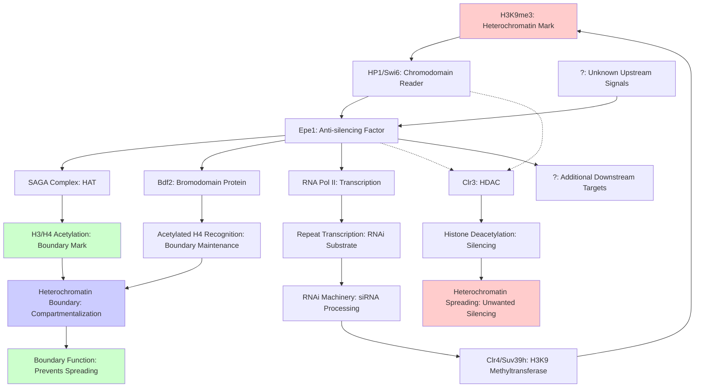

# Pathway Summary for Epe1

## Overview

Epe1 is a non-enzymatic anti-silencing factor that plays a central role in heterochromatin boundary formation and maintenance in S. pombe. Despite containing a JmjC domain typically associated with histone demethylases, Epe1 lacks catalytic activity and functions through protein-protein interactions to establish boundaries that prevent heterochromatin spreading [PMID:12773576]. The protein operates within an intricate network of chromatin regulators, recruiting histone acetyltransferases, binding HP1/Swi6, and paradoxically enabling RNAi-mediated silencing by promoting transcription of repetitive elements.

## Heterochromatin Boundary Formation Pathway

Epe1 functions as the master regulator of heterochromatin boundaries through a multi-step mechanism. It binds directly to HP1/Swi6 at H3K9-methylated nucleosomes via its C-terminal domain [PMID:16762840]. Once localized, Epe1 recruits the SAGA histone acetyltransferase complex, leading to histone H3 acetylation that antagonizes the spread of H3K9 methylation [PMID:17449867]. Additionally, Epe1 recruits the Bdf2 bromodomain protein to heterochromatin boundaries, particularly at inverted repeat centromeric (IRC) elements, where Bdf2 recognizes acetylated histones and prevents Sir2-mediated deacetylation [PMID:24013502]. This creates stable boundaries that compartmentalize heterochromatin from euchromatin at centromeres, telomeres, and the mating-type locus.

## RNAi-Mediated Heterochromatin Formation Pathway

Paradoxically, while Epe1 antagonizes heterochromatin maintenance, it promotes RNAi-dependent heterochromatin establishment by enabling transcription of repetitive elements [PMID:36617881]. At pericentromeric dg/dh repeats, Epe1 promotes RNA polymerase II occupancy and transcript production, generating the non-coding RNAs required for RNAi processing. These transcripts are processed by the RNAi machinery to produce siRNAs that guide H3K9 methylation and heterochromatin assembly. This dual role allows Epe1 to both establish heterochromatin where needed while preventing its excessive spread.

## Competitive HP1/Swi6 Binding Network

Epe1 participates in a competitive binding network at HP1/Swi6 sites, where it competes with the histone deacetylase Clr3 for access to chromatin [PMID:16762840]. When Epe1 binding predominates, it leads to SAGA recruitment and histone acetylation, promoting an open chromatin state. Conversely, when Clr3 binding is favored, it results in deacetylation and heterochromatin maintenance. This competition creates a dynamic equilibrium that fine-tunes heterochromatin boundaries based on local chromatin context and regulatory signals.

## Pathway Diagram

## Cross-pathway Integration and Regulation

Epe1 integrates multiple chromatin regulatory pathways through its protein interaction network. Its recruitment of SAGA links heterochromatin boundaries to the transcriptional co-activation machinery, while its interaction with Bdf2 connects to BET bromodomain signaling pathways [PMID:24013502]. The protein also interfaces with the ubiquitin-proteasome system through its regulation by the Cul4-Ddb1(Cdt2) ubiquitin ligase, which prevents Epe1 invasion into heterochromatin domains [PMID:21215368]. Furthermore, Epe1's role in promoting repeat transcription links it to RNA processing pathways and the RNAi machinery, creating a feedback loop that maintains heterochromatin homeostasis.

## Cellular Significance in S. pombe

Epe1's pathway functions are critical for maintaining genome stability and proper gene expression in fission yeast. Loss of Epe1 leads to uncontrolled heterochromatin spreading, gene silencing, and accumulation of aberrant H3K9me islands across euchromatic regions [PMID:31206516]. The protein is essential for preventing position effect variegation and maintaining the boundaries of specialized chromatin domains at centromeres, telomeres, and the silent mating-type locus. Its dual role in both antagonizing and promoting heterochromatin formation makes it a key regulator of epigenetic inheritance and chromatin organization in S. pombe.