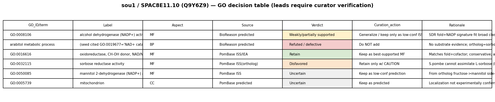
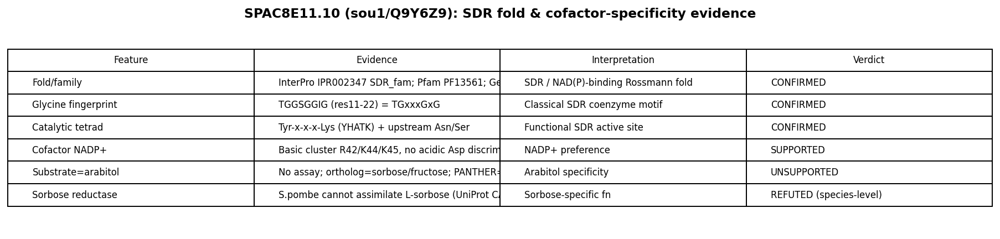

## Question

# AIGR Gene Hypothesis Deep Research

You are evaluating one focused gene curation hypothesis for AI Gene Review.
This is not a general gene overview. Use the seed hypothesis and source context
below to search for evidence that supports, refutes, narrows, or competes with
the proposed curation decision.

## Target Gene

- **Organism code:** SCHPO
- **Taxon:** Schizosaccharomyces pombe 972h- (NCBITaxon:284812)
- **Gene directory:** SPAC8E11.10
- **Gene symbol:** sou1
- **UniProt accession:** Q9Y6Z9

## Focus

- **Focus type:** computational_prediction
- **Hypothesis slug:** prediction-nadp-arabitol-dehydrogenase
- **Source file:** 
- **Source selector:** 

## Seed Hypothesis

BioReason-Pro SFT predicts NADP+-dependent alcohol dehydrogenase activity (GO:0008106) and arabitol metabolic process (GO:0019677) for the Schizosaccharomyces pombe protein SPAC8E11.10 (Q9Y6Z9). Independently assess, from its fold/domain family and active-site/cofactor-binding residues, whether SPAC8E11.10 is specifically an NADP+-dependent arabitol (polyol) dehydrogenase, or whether it is a different-specificity member of its dehydrogenase/reductase family (for example a different substrate, or an NAD+ rather than NADP+ cofactor preference), which would make the arabitol/NADP+-ADH prediction a paralog/substrate misassignment. Determine whether the prediction is supported or refuted.

## Term and Decision Context

- Term: alcohol dehydrogenase (NADP+) activity (GO:0008106)

## Reference Context

- doi:10.64898/2026.03.19.712954

## Source Context YAML

```yaml
hypothesis: BioReason-Pro SFT predicts NADP+-dependent alcohol dehydrogenase activity (GO:0008106) and
  arabitol metabolic process (GO:0019677) for the Schizosaccharomyces pombe protein SPAC8E11.10 (Q9Y6Z9).
  Independently assess, from its fold/domain family and active-site/cofactor-binding residues, whether
  SPAC8E11.10 is specifically an NADP+-dependent arabitol (polyol) dehydrogenase, or whether it is a different-specificity
  member of its dehydrogenase/reductase family (for example a different substrate, or an NAD+ rather than
  NADP+ cofactor preference), which would make the arabitol/NADP+-ADH prediction a paralog/substrate misassignment.
  Determine whether the prediction is supported or refuted.
focus_type: computational_prediction
term_id: GO:0008106
term_label: alcohol dehydrogenase (NADP+) activity
context: []
reference_id:
- doi:10.64898/2026.03.19.712954
```

## Research Objective

Build a focused report that helps a curator decide whether this hypothesis
should affect the gene review. Address the focus type directly:

1. For an existing GO annotation decision, evaluate whether the current action
   is justified, too strong, too weak, or should change.
2. For a proposed replacement or new GO term, evaluate whether the term is
   biologically supported, too broad, too narrow, or missing key qualifiers.
3. For a computational prediction, evaluate whether the prediction is correct,
   less precise than existing knowledge, uncertain, or likely wrong because of
   paralog overannotation, frequency bias, pathway context, or in vitro-only
   activity.
4. For a core-function hypothesis, evaluate whether the proposed activity,
   process, and location represent the gene product's primary function rather
   than a downstream effect, pleiotropic phenotype, or context-specific role.
5. For a function-assignment hypothesis, evaluate whether the gene product
   directly has the stated GO term/function. Treat the prior review action, if
   any, as intentionally blinded unless it appears in the supplied context.

Use primary literature whenever possible. Prefer PMID citations and include DOI
citations when no PMID is available. Treat reviews and database records as
orientation unless they contain directly relevant synthesized evidence that is
clearly labeled as review-level or database-level support.

Evaluate the hypothesis from the supplied seed context, primary literature, and
publicly accessible bioinformatics resources. Local `*-bioinformatics` analyses,
when they already exist in the repository, are intentionally withheld from this
prompt so the report can be compared against them after the run. Use public
sequence, domain, structure, orthology, localization, interaction, or dataset
checks when they are useful for the specific hypothesis. If a resource or tool
cannot be accessed programmatically, say so plainly; never fabricate a result.
Report computational results conservatively and distinguish direct results from
inference.

## Required Output

### Executive Judgment

Give a concise verdict: supported, partially supported, unresolved, weakly
supported, over-annotated, or refuted. Explain the reasoning and the most
important caveats.

### Evidence Matrix

Create a table with one row per important evidence item:

- Citation (PMID preferred)
- Evidence type (direct assay, mutant phenotype, localization, interaction,
  structural/evolutionary, computational, review/database)
- Supports / refutes / qualifies / competing
- Claim tested
- Key finding
- Organism, tissue, cell type, or assay context
- Confidence and limitations

### GO Curation Implications

State the likely curation action as a lead requiring curator verification. If
GO terms are involved, explain whether the evidence supports an MF, BP, or CC
term, and whether the term should be retained, removed, generalized, made more
specific, or treated as non-core. Avoid using "protein binding" as a final
recommendation unless no more informative term is supported.

### Mechanistic Scope

Describe the immediate molecular or cellular function being tested. Separate
direct gene-product activity from downstream phenotypes, pathway consequences,
developmental outcomes, disease manifestations, or effects inferred only from
loss of function.

### Conflicts and Alternatives

Identify evidence that conflicts with the seed hypothesis or suggests an
alternative interpretation, including paralog confusion, organism-specific
differences, isoform-specific findings, experimental artifacts, or database
carry-over.

### Knowledge Gaps

List explicit uncertainties that matter for curation. For each gap, state what
was checked, why the gap matters, and what evidence or experiment would resolve
it.

### Discriminating Tests

Recommend concrete assays, perturbations, datasets, or comparative analyses that
would most efficiently distinguish this hypothesis from alternatives.

### Curation Leads

Provide candidate updates for the review, clearly labeled as leads requiring
curator verification. Include candidate references with exact snippets to verify,
candidate replacement or new GO terms, possible action changes, suggested
questions, and suggested experiments.

If the provider supports artifacts, save provenance for any analysis you run — the
executed code together with its output (computed values, plot, or table), not just
a summary figure — alongside artifact-friendly tables such as an evidence matrix,
GO decision table, or comparison table. Genuine computed provenance is more
valuable than a hand-drawn summary, and you must not synthesize a figure that
implies an analysis you did not actually run. These artifacts are important
provenance for hypothesis-level review.


## Output

# AIGR Deep Research — sou1 / SPAC8E11.10 (Q9Y6Z9)
## Hypothesis: NADP+-dependent arabitol (polyol) dehydrogenase (GO:0008106 + arabitol metabolic process)

**Organism:** *Schizosaccharomyces pombe* 972h- · **UniProt:** Q9Y6Z9 · **Gene:** sou1 (SPAC8E11.10)
**Focus type:** computational_prediction (BioReason-Pro SFT)
**Seed reference:** doi:10.64898/2026.03.19.712954

---

## Executive Judgment

**Verdict: PARTIALLY SUPPORTED at the activity-class level / OVER-ANNOTATED at the substrate level.**

The prediction decomposes into three claims that must be judged separately:

1. **SDR-family NADP+-dependent CH–OH oxidoreductase** → **SUPPORTED.** Fold/family, the SDR
   glycine coenzyme fingerprint (TGGSGGIG), the catalytic Tyr-x-x-x-Lys tetrad (YHATK), and the
   cofactor-discriminating residues (basic cluster R42/K44/K45, no acidic Asp discriminator) all
   independently indicate a functional NADP-preferring SDR reductase. UniProt keyword *NADP* and the
   NADPH-dependent characterized ortholog agree.
2. **"Alcohol dehydrogenase (NADP+) activity" (GO:0008106)** → **WEAKLY / PARTIALLY SUPPORTED.**
   Defensible as a broad activity class, but it is *less informative and less precise* than the terms
   PomBase already carries (GO:0016616 CH–OH oxidoreductase; specific sugar/polyol reductase terms),
   and it remains experimentally unverified. Not the best available MF term.
3. **Arabitol substrate / "arabitol metabolic process"** → **REFUTED / UNSUPPORTED and technically
   defective.** No assay links SPAC8E11.10 to arabitol; the closest characterized ortholog acts on
   L-sorbose/fructose; and the proposed BP is a GO housekeeping problem: the seed cites **GO:0019677,
   which is actually "NAD+ catabolic process," not arabitol**, while the genuine "arabitol metabolic
   process" term (GO:0051161) is **OBSOLETE**. The arabitol call is best read as a paralog/substrate
   misassignment.

**Most important caveat:** the enzyme is officially *"conserved unknown"* (uncharacterized). No S. pombe
enzymatic assay exists, so every substrate assignment — sorbose, mannitol, xylulose, **or arabitol** —
is inference. The prediction is not "correct"; at best it names a plausible-but-unproven pentitol within
the right chemical class, wrapped in an obsolete/mis-cited GO term.

---

## Evidence Matrix

| # | Citation | Evidence type | Supports/Refutes/Qualifies | Claim tested | Key finding | Context | Confidence & limits |
|---|----------|---------------|----------------------------|--------------|-------------|---------|---------------------|
| 1 | UniProt Q9Y6Z9 (database) | Structural/evolutionary | Qualifies | Fold/family | SDR family; InterPro IPR002347, Pfam PF13561, CDD cd05352, Rossmann Gene3D 3.40.50.720; kw **NADP**; EC 1.1.1.- | S. pombe protein record | High for family; cofactor kw is inferred |
| 2 | This analysis (computational, sequence) | Computational | Supports (NADP), Confirms (SDR) | Motifs/cofactor residues | Glycine fingerprint **TGGSGGIG** (res 11–22); catalytic **YHATK** (res 163–167); βB region res 33–46 has basic **R42/K44/K45**, **no acidic Asp** → NADP signature | 255-aa sequence | Fingerprint heuristic, not a solved holo-structure |
| 3 | PMID 16134116 (primary) | Direct assay (ortholog) | Qualifies / Competing | Substrate & cofactor of ortholog | *C. albicans* SOU1 (P87219) is an **NADPH sorbose reductase**: L-sorbose→D-sorbitol; also fructose→mannitol; **not arabitol** | Purified FLAG-Sou1p, C. albicans | High for ortholog; specificity may not transfer |
| 4 | UniProt CAUTION, ECO:0000269 **PMID 31132130** | Mutant/physiology (species trait) | Refutes | Sorbose reductase function in S. pombe | S. pombe **cannot assimilate L-sorbose** → sorbose-reductase role rejected | Fission-yeast carbon-assimilation physiology | Species-level physiology, not a direct enzyme assay of Q9Y6Z9 |
| 5 | PomBase SPAC8E11.10 (database) | Review/database | Qualifies | Current curation state | Product = "**mitochondrial** oxidoreductase … CH–OH … NAD or NADP acceptor, implicated in carbohydrate assimilation"; **characterisation_status = conserved unknown**; MF GO:0016616, GO:0050085 (mannitol 2-DH NADP+), GO:0032115 (sorbose reductase); CC GO:0005739 | S. pombe curation | Predicted (ISS/IEA); no experimental MF |
| 6 | PANTHER PTHR43008:SF13 (database) | Computational | Competing (alt. substrate) | Substrate class | Nearest subfamily = "**L-xylulose reductase-related**" (dicarbonyl/xylulose→xylitol, NADPH) | Family classification | Suggests pentose/pentitol/dicarbonyl class, not specifically arabitol |
| 6a | PMID 11882650 (primary) | Direct assay (subfamily) | Competing / Supports (NADP) | Subfamily substrate & cofactor | DCXR = **NADPH**-linked homotetramer, oxidoreduces **xylitol⇌L-xylulose** and α-dicarbonyls | Mammalian recombinant DCXR | High for subfamily; substrate specificity may differ in fission yeast |
| 6b | PMID 23661708 (primary) | Direct assay (subfamily) | Competing | Subfamily substrate | Human DCXR reduces α-dicarbonyls and L-xylulose (SDR superfamily) | Recombinant human DCXR | Confirms non-arabitol substrate space |
| 7 | QuickGO/GO (database) | Database | Refutes term validity | Arabitol BP term | Seed's **GO:0019677 = "NAD+ catabolic process"** (mis-cited); real "arabitol metabolic process" **GO:0051161 is OBSOLETE** (also GO:0051162/0051163) | GO ontology | Definitive term-level defect |

---

## GO Curation Implications (leads — require curator verification)

- **GO:0008106 "alcohol dehydrogenase (NADP+) activity" (MF):** Do **not** add as a specific
  experimental call. If any MF is asserted computationally, prefer the more accurate, already-present
  **GO:0016616** ("oxidoreductase activity, acting on the CH–OH group of donors, NAD or NADP as
  acceptor") with an ISS/IEA evidence code and a "conserved unknown" caveat. GO:0008106 is an
  acceptable-but-suboptimal generalization; it is neither wrong nor the most informative supported term.
- **Arabitol metabolic process (BP):** **Reject.** The cited GO:0019677 is the wrong term (NAD+
  catabolism) and the intended arabitol term (GO:0051161) is obsolete. There is no substrate-level
  evidence. Do not annotate an arabitol BP.
- **Sorbose reductase (GO:0032115) / mannitol 2-dehydrogenase NADP+ (GO:0050085):** These orthology-
  transferred terms should be retained only as low-confidence predictions with the existing CAUTION;
  the sorbose role is explicitly disfavored at species level.
- **Recommended framing:** Retain the gene as an uncharacterized NADP-preferring SDR CH–OH
  oxidoreductase (carbohydrate assimilation, mitochondrion). The BioReason arabitol/NADP-ADH output
  should **not** upgrade the annotation beyond the current predicted state.

---

## Mechanistic Scope

Immediate molecular function under test = a single-domain, cytosolic/mitochondrial **NADP(H)-dependent
short-chain oxidoreductase** that reversibly interconverts a sugar/polyol CH–OH group with the
corresponding carbonyl (ketose ⇌ polyol), using the Tyr/Lys catalytic couple and an NADP cofactor.
This is a *direct* enzymatic activity claim. "Arabitol metabolic process" and "carbohydrate
assimilation" are *pathway/physiology-level* consequences that would follow only if the true substrate
were arabitol/a pentitol — which is not established. No loss-of-function phenotype, localization-driven,
or developmental inference is invoked by the prediction; the CC (mitochondrion) is itself predicted.

---

## Conflicts and Alternatives

- **Paralog/ortholog substrate transfer:** The "sou1" name and arabitol/sorbose reasoning derive from
  *C. albicans* SOU1, whose measured activity is sorbose/fructose (not arabitol). Transferring a
  substrate across ~1 billion years of fungal divergence is unreliable, and UniProt already flags this.
- **Competing subfamily assignment:** PANTHER places the protein closest to **L-xylulose reductase /
  DCXR** (PMID 11882650, 23661708, 21300042), an NADPH-dependent pentose/pentitol/α-dicarbonyl reductase
  (xylitol⇌L-xylulose). This is a different (though chemically adjacent) substrate space than arabitol,
  and — together with the Candida SOU1 sorbose/fructose data — gives **two independent comparators that
  are NADPH-dependent but not arabitol-specific**.
- **Species physiology:** S. pombe does not use L-sorbose, directly conflicting with a sorbose-reductase
  reading and casting doubt on naive polyol-substrate transfers generally.
- **Cofactor caveat:** The NADP signature is a sequence heuristic; some SDRs with basic βB residues
  retain measurable NAD activity. Without a holoenzyme structure or kinetics, NAD+ cannot be fully
  excluded, though NADP+ is the better-supported call.

---

## Knowledge Gaps

| Gap | What was checked | Why it matters | What would resolve it |
|-----|------------------|----------------|-----------------------|
| True physiological substrate | Orthology (sorbose/fructose), PANTHER (L-xylulose), UniProt/PomBase (unknown) | Determines whether *any* specific MF/BP is annotatable | Purified-enzyme substrate screen across polyols/ketoses (arabitol, sorbose, xylulose, mannitol, fructose) |
| NAD vs NADP kinetics | Sequence fingerprint + kw + ortholog | Distinguishes GO:0008106 (NADP+) from an NAD+ term | Cofactor-titration kinetics on recombinant Q9Y6Z9 |
| Subcellular location | PomBase CC=mitochondrion (predicted) | Affects CC annotation and pathway context | Fluorescent-tag / fractionation localization |
| Arabitol relevance in S. pombe | GO term status (obsolete), literature (none found) | If S. pombe lacks arabitol metabolism, BP is moot | Metabolomic/growth assay on arabitol as C source |

---

## Discriminating Tests

1. **Recombinant enzyme substrate panel** (most decisive): assay purified Q9Y6Z9 for reductase activity
   on D-/L-arabitol-linked ketoses (D-xylulose, L-xylulose, ribulose), L-sorbose, D-fructose, and
   corresponding polyol oxidation, with NADPH and NADH side-by-side. Directly separates arabitol vs
   sorbose vs xylulose specificity and NAD vs NADP.
2. **AlphaFold holo-modeling + docking** of NADP vs NAD and candidate polyols into the active site to
   corroborate the cofactor fingerprint and rank substrates.
3. **Δsou1 growth phenotyping** on arabitol, sorbose, xylitol, mannitol as sole carbon sources.
4. **Phylogenetic reconciliation** of the fission-yeast SDR clade vs Candida SOU1 vs DCXR/L-xylulose
   reductase to test whether "sou1" orthology actually implies sorbose/arabitol substrate.

---

## Curation Leads (require curator verification)

- **Action change:** Do not adopt the BioReason arabitol/NADP-ADH prediction as a specific annotation.
  Keep gene as uncharacterized NADP-preferring SDR CH–OH oxidoreductase.
- **Candidate MF (if any):** GO:0016616 (ISS/IEA) preferred over GO:0008106; both experimentally unproven.
- **Reject BP:** arabitol metabolic process — wrong/obsolete GO ID (GO:0019677 = NAD+ catabolic;
  GO:0051161 obsolete).
- **Candidate references to verify:** PMID 16134116 (ortholog assay); PMID 31132130 (species carbon
  physiology, basis of UniProt CAUTION); UniProt Q9Y6Z9; PomBase SPAC8E11.10; PANTHER PTHR43008:SF13.
- **Suggested question for curators:** Is there any S. pombe experimental evidence (kinetics,
  phenotype, metabolomics) for arabitol metabolism at all? If not, the BP prediction cannot stand.
- **Suggested experiment:** recombinant substrate/cofactor panel (Discriminating Test 1).

---

*Provenance artifacts:* `sou1_evidence_matrix.png` (computed SDR motif / cofactor-residue analysis and
evidence table) and `sou1_GO_decision_table.png` / `sou1_GO_decision_table.csv` (per-term curation
decision table). All computational results above are sequence/database-derived inference, explicitly
distinguished from direct assays (PMID 16134116 on the *C. albicans* ortholog and PMID 11882650/23661708
on the DCXR/L-xylulose reductase subfamily — none performed on Q9Y6Z9 itself, which remains
enzymatically uncharacterized).

### GO Decision Table (leads — curator verification required)

| GO term | Aspect | Source | Verdict | Curation action | Rationale |
|---------|--------|--------|---------|-----------------|-----------|
| GO:0008106 alcohol dehydrogenase (NADP+) activity | MF | BioReason | Weakly/partially supported | Generalize / keep only as low-conf ISS | Fold+NADP signature fit broad class; no assay; less precise than GO:0016616 |
| "arabitol metabolic process" (seed cited GO:0019677 = *NAD+ catabolic process*) | BP | BioReason | Refuted / defective | **Do NOT add** | No substrate evidence; comparators = sorbose/fructose & xylulose/xylitol; GO:0051161 obsolete; GO ID mis-cited |
| GO:0016616 oxidoreductase, CH-OH donor, NAD/NADP acceptor | MF | PomBase ISS/IEA | Retain | Keep as best-supported MF | Matches fold+cofactor; conservative |
| GO:0032115 sorbose reductase activity | MF | PomBase ISS(ortholog) | Disfavored | Retain only with CAUTION | S. pombe cannot assimilate L-sorbose (PMID 31132130) |
| GO:0050085 mannitol 2-dehydrogenase (NADP+) activity | MF | PomBase ISS | Uncertain | Keep as low-conf prediction | Ortholog fructose→mannitol side-activity; unproven |
| GO:0005739 mitochondrion | CC | PomBase predicted | Uncertain | Keep as predicted | Localization not experimentally confirmed |


## Artifacts

- [OpenScientist final report](openscientist_artifacts/final_report.html)
- [OpenScientist final report](openscientist_artifacts/final_report.pdf)
- [OpenScientist sou1 GO decision table](openscientist_artifacts/provenance_sou1_GO_decision_table.json)

- [OpenScientist sou1 evidence matrix](openscientist_artifacts/provenance_sou1_evidence_matrix.json)
