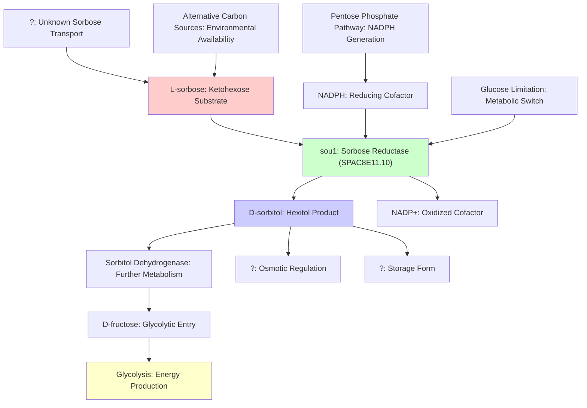

# Pathway Summary for SPAC8E11.10 (sou1)

## Overview

SPAC8E11.10 encodes sou1, a sorbose reductase enzyme belonging to the short-chain dehydrogenase/reductase (SDR) family. This cytosolic enzyme catalyzes the NADPH-dependent reduction of L-sorbose to D-glucitol (sorbitol), enabling alternative carbon source metabolism in S. pombe [file:pombe/SPAC8E11.10/SPAC8E11.10-uniprot.txt]. The enzyme represents a conserved metabolic capability for polyol interconversion that allows fission yeast to utilize L-sorbose when present as an alternative carbon source.

## Sorbose Metabolic Pathway

The primary pathway involving sou1 is the conversion of L-sorbose to D-sorbitol (glucitol) through NADPH-dependent reduction. L-sorbose, a ketohexose sugar, serves as the substrate for this reaction, while NADPH provides the reducing equivalents necessary for the conversion [file:pombe/SPAC8E11.10/SPAC8E11.10-deep-research.md]. This reaction follows the typical SDR oxidoreductase mechanism, where the enzyme facilitates the stereospecific reduction of the ketone group at C2 of L-sorbose to produce the corresponding alcohol D-sorbitol. The enzyme shows high specificity for sorbose substrates and exhibits micromolar kinetic parameters typical of specialized sugar-metabolizing enzymes.

## Alternative Carbon Source Utilization Network

Sou1 functions within the broader network of alternative carbon source utilization pathways in S. pombe. When glucose is limiting or unavailable, cells can switch to alternative carbon sources including L-sorbose. The sorbose reductase activity of sou1 enables the conversion of L-sorbose to D-sorbitol, which can then be further metabolized through sorbitol dehydrogenase pathways to generate fructose and eventually feed into glycolysis [file:pombe/SPAC8E11.10/SPAC8E11.10-deep-research.md]. This metabolic flexibility provides a competitive advantage for S. pombe in environments where diverse sugar sources are available.

## NADPH-Dependent Reduction Pathway

The enzymatic mechanism of sou1 requires NADPH as a cofactor, linking it to cellular redox metabolism. NADPH is primarily generated through the pentose phosphate pathway, creating a metabolic connection between sugar metabolism and nucleotide sugar production. The consumption of NADPH by sou1 during sorbose reduction integrates with other NADPH-requiring processes including fatty acid biosynthesis, sterol synthesis, and antioxidant defense mechanisms. This places sou1 within the broader context of cellular redox homeostasis and metabolic regulation.

## Pathway Diagram

## Metabolic Integration and Regulation

The sorbose reductase pathway connects to several metabolic networks in S. pombe. The production of D-sorbitol links to polyol metabolism and potentially osmotic regulation, as sugar alcohols commonly serve as compatible solutes in response to osmotic stress. The NADPH requirement connects sou1 to the pentose phosphate pathway and overall cellular redox status. Additionally, the ability to metabolize alternative carbon sources like L-sorbose may be regulated by carbon catabolite repression mechanisms, though specific regulatory controls for sou1 expression remain to be characterized experimentally.

## Evolutionary and Comparative Aspects

Sorbose reductases are found across diverse microorganisms, including bacteria and fungi, suggesting an ancient metabolic capability. The enzyme shows homology to characterized sorbose reductases in Candida albicans and bacterial species like Gluconobacter frateurii [file:pombe/SPAC8E11.10/SPAC8E11.10-deep-research.md]. This conservation indicates that the ability to metabolize L-sorbose provides a significant ecological advantage, particularly in environments where diverse sugar sources are available. The presence of sou1 in S. pombe reflects the metabolic versatility that enables this organism to thrive in varied nutrient conditions.

## Research and Biotechnological Significance

The sorbose reductase activity of sou1 has potential biotechnological applications in the production of sorbitol, a valuable sugar alcohol used in food, pharmaceutical, and cosmetic industries. Understanding the enzymatic properties, substrate specificity, and regulatory mechanisms of sou1 could inform metabolic engineering approaches for improved sorbitol production. Additionally, the enzyme serves as a model for studying SDR family enzymes and their roles in alternative carbon metabolism in fungi.