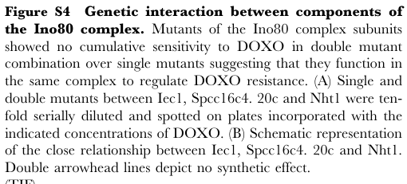

## Question

# Gene Research for Functional Annotation

## ⚠️ CRITICAL: Gene/Protein Identification Context

**BEFORE YOU BEGIN RESEARCH:** You MUST verify you are researching the CORRECT gene/protein. Gene symbols can be ambiguous, especially for less well-characterized genes from non-model organisms.

### Target Gene/Protein Identity (from UniProt):
- **UniProt Accession:** O74447
- **Protein Description:** RecName: Full=Uncharacterized protein C16C4.02c;
- **Gene Information:** ORFNames=SPCC16C4.02c;
- **Organism (full):** Schizosaccharomyces pombe (strain 972 / ATCC 24843) (Fission yeast).
- **Protein Family:** Not specified in UniProt
- **Key Domains:** ARM-type_fold. (IPR016024); Neurochondrin. (IPR008709); Neurochondrin (PF05536)

### MANDATORY VERIFICATION STEPS:

1. **Check if the gene symbol "SPCC16C4.02c" matches the protein description above**
2. **Verify the organism is correct:** Schizosaccharomyces pombe (strain 972 / ATCC 24843) (Fission yeast).
3. **Check if protein family/domains align with what you find in literature**
4. **If you find literature for a DIFFERENT gene with the same or similar symbol, STOP**

### If Gene Symbol is Ambiguous or You Cannot Find Relevant Literature:

**DO NOT PROCEED WITH RESEARCH ON A DIFFERENT GENE.** Instead:
- State clearly: "The gene symbol 'SPCC16C4.02c' is ambiguous or literature is limited for this specific protein"
- Explain what you found (e.g., "Found extensive literature on a different gene with the same symbol in a different organism")
- Describe the protein based ONLY on the UniProt information provided above
- Suggest that the protein function can be inferred from domain/family information

### Research Target:

Please provide a comprehensive research report on the gene **SPCC16C4.02c** (gene ID: SPCC16C4.02c, UniProt: O74447) in SCHPO.

The research report should be a detailed narrative explaining the function, biological processes, and localization of the gene product. Citations should be given for all claims.

You should prioritize authoritative reviews and primary scientific literature when conducting research. You can supplement
this with annotations you find in gene/protein databases, but these can be outdated or inaccurate.

We are specifically interested in the primary function of the gene - for enzymes, what reaction is catalyzed, and what is the substrate specificity? For transporters, what is the substrate? For structural proteins or adapters, what is the broader structural role? For signaling molecules, what is the role in the pathway.

We are interested in where in or outside the cell the gene product carries out its function.

We are also interested in the signaling or biochemical pathways in which the gene functions. We are less interested in broad pleiotropic effects, except where these elucidate the precise role.

Include evidence where possible. We are interested in both experimental evidence as well as inference from structure, evolution, or bioinformatic analysis. Precise studies should be prioritized over high-throughput, where available.

## Output

Question: You are an expert researcher providing comprehensive, well-cited information.

Provide detailed information focusing on:
1. Key concepts and definitions with current understanding
2. Recent developments and latest research (prioritize 2023-2024 sources)
3. Current applications and real-world implementations
4. Expert opinions and analysis from authoritative sources
5. Relevant statistics and data from recent studies

Format as a comprehensive research report with proper citations. Include URLs and publication dates where available.
Always prioritize recent, authoritative sources and provide specific citations for all major claims.

# Gene Research for Functional Annotation

## ⚠️ CRITICAL: Gene/Protein Identification Context

**BEFORE YOU BEGIN RESEARCH:** You MUST verify you are researching the CORRECT gene/protein. Gene symbols can be ambiguous, especially for less well-characterized genes from non-model organisms.

### Target Gene/Protein Identity (from UniProt):
- **UniProt Accession:** O74447
- **Protein Description:** RecName: Full=Uncharacterized protein C16C4.02c;
- **Gene Information:** ORFNames=SPCC16C4.02c;
- **Organism (full):** Schizosaccharomyces pombe (strain 972 / ATCC 24843) (Fission yeast).
- **Protein Family:** Not specified in UniProt
- **Key Domains:** ARM-type_fold. (IPR016024); Neurochondrin. (IPR008709); Neurochondrin (PF05536)

### MANDATORY VERIFICATION STEPS:

1. **Check if the gene symbol "SPCC16C4.02c" matches the protein description above**
2. **Verify the organism is correct:** Schizosaccharomyces pombe (strain 972 / ATCC 24843) (Fission yeast).
3. **Check if protein family/domains align with what you find in literature**
4. **If you find literature for a DIFFERENT gene with the same or similar symbol, STOP**

### If Gene Symbol is Ambiguous or You Cannot Find Relevant Literature:

**DO NOT PROCEED WITH RESEARCH ON A DIFFERENT GENE.** Instead:
- State clearly: "The gene symbol 'SPCC16C4.02c' is ambiguous or literature is limited for this specific protein"
- Explain what you found (e.g., "Found extensive literature on a different gene with the same symbol in a different organism")
- Describe the protein based ONLY on the UniProt information provided above
- Suggest that the protein function can be inferred from domain/family information

### Research Target:

Please provide a comprehensive research report on the gene **SPCC16C4.02c** (gene ID: SPCC16C4.02c, UniProt: O74447) in SCHPO.

The research report should be a detailed narrative explaining the function, biological processes, and localization of the gene product. Citations should be given for all claims.

You should prioritize authoritative reviews and primary scientific literature when conducting research. You can supplement
this with annotations you find in gene/protein databases, but these can be outdated or inaccurate.

We are specifically interested in the primary function of the gene - for enzymes, what reaction is catalyzed, and what is the substrate specificity? For transporters, what is the substrate? For structural proteins or adapters, what is the broader structural role? For signaling molecules, what is the role in the pathway.

We are interested in where in or outside the cell the gene product carries out its function.

We are also interested in the signaling or biochemical pathways in which the gene functions. We are less interested in broad pleiotropic effects, except where these elucidate the precise role.

Include evidence where possible. We are interested in both experimental evidence as well as inference from structure, evolution, or bioinformatic analysis. Precise studies should be prioritized over high-throughput, where available.

## Research report: **Schizosaccharomyces pombe** SPCC16C4.02c (UniProt: O74447)

### Executive summary
The fission yeast ORF **SPCC16C4.02c** (UniProt accession **O74447**) is sparsely characterized in the accessible primary literature retrieved here. The most direct experimental evidence available from peer‑reviewed research indicates that **SPCC16C4.02c is a named component of the S. pombe Ino80 chromatin‑remodeling complex** and that **mutants involving SPCC16C4.02c behave epistatically with other Ino80 subunits in assays of doxorubicin resistance**, consistent with a role in the same chromatin remodeling pathway/complex rather than an independent parallel pathway. (tay2013cellularrobustnessconferred pages 8-9)

| Aspect | Finding for SPCC16C4.02c / O74447 | Evidence type | Confidence | Key citation(s) |
|---|---|---|---|---|
| Identity / aliases | Target verified in retrieved evidence as **SPCC16C4.02 / SPCC16C4.02c** from *Schizosaccharomyces pombe*; the 2013 paper uses both **SPCC16C4.02** and a likely typographical variant **Spcc16c4.20c** in a figure legend, but context indicates the same Ino80-associated ORF tested genetically (tay2013cellularrobustnessconferred pages 8-9) | Experimental genetic | High | Tay et al., 2013, *PLoS ONE*, DOI: https://doi.org/10.1371/journal.pone.0055041 (tay2013cellularrobustnessconferred pages 8-9) |
| Organism / strain | The user-specified target is from **Schizosaccharomyces pombe (strain 972 / ATCC 24843)**; retrieved papers study **fission yeast S. pombe** but do not restate the UniProt strain designation in the extracted passages (tay2013cellularrobustnessconferred pages 8-9) | Experimental genetic | Medium | Tay et al., 2013, https://doi.org/10.1371/journal.pone.0055041 (tay2013cellularrobustnessconferred pages 8-9) |
| Known / putative complex membership | **Directly listed as an Ino80 chromatin-remodeling complex subunit/member** in fission yeast: “Ino80 (Nht1, SPCC16C4.02, Iec1, Ies2, Iec3, Ies4, Ies6, Arp5, Arp8)” (tay2013cellularrobustnessconferred pages 8-9) | Experimental genetic | High | Tay et al., 2013, https://doi.org/10.1371/journal.pone.0055041 (tay2013cellularrobustnessconferred pages 8-9) |
| Functional inferences | Strictly from retrieved evidence, SPCC16C4.02c is **implicated in chromatin remodeling linked to doxorubicin resistance**, because mutants in Ino80 subunits behaved epistatically and were grouped with SAGA and homologous recombination factors in the same functional network (tay2013cellularrobustnessconferred pages 8-9). More specific biochemical activity for SPCC16C4.02c itself was **not directly shown** in the retrieved texts. | Experimental genetic | Medium | Tay et al., 2013, https://doi.org/10.1371/journal.pone.0055041 (tay2013cellularrobustnessconferred pages 8-9) |
| Phenotypes / assays | **Doxorubicin sensitivity genetic interaction assay**: single and double mutants involving **Iec1, Spcc16c4.02c, and Nht1** were tested by **ten-fold serial dilution spotting on DOXO plates**; double mutants showed **no cumulative/synthetic increase in DOXO sensitivity**, supporting action in the same complex/pathway (tay2013cellularrobustnessconferred pages 8-9, tay2013cellularrobustnessconferred media 5881146b) | Experimental genetic | High | Tay et al., 2013, https://doi.org/10.1371/journal.pone.0055041 (tay2013cellularrobustnessconferred pages 8-9, tay2013cellularrobustnessconferred media 5881146b) |
| Quantitative stats | **Direct SPCC16C4.02c-specific quantitative effect sizes were not present** in retrieved passages. Available quantitative details are assay-format only (**ten-fold serial dilutions**) and study-level conditions noting some mutants scored at **75 mg/ml** or **165 mg/ml DOXO**, but these concentrations were not explicitly assigned to SPCC16C4.02c in the extracted text (tay2013cellularrobustnessconferred pages 8-9). | Experimental genetic | Low | Tay et al., 2013, https://doi.org/10.1371/journal.pone.0055041 (tay2013cellularrobustnessconferred pages 8-9) |
| Relation to recent 2023–2024 work | Recent retrieved 2023 Ino80/quiescence work supports the broader importance of **Ino80 complex** in quiescent transcriptional control, H2A.Z eviction/relocalization, and survival in G0, but **SPCC16C4.02c was not explicitly mentioned in the extracted passages**; therefore this only strengthens the plausibility of an Ino80-related role, not a direct annotation for this ORF (zahedi2023anessentialrole pages 12-14, zahedi2023anessentialrole pages 2-5) | Transcriptomics | Low | Zahedi et al., 2023, *Chromosome Research*, DOI: https://doi.org/10.1007/s10577-023-09723-x (zahedi2023anessentialrole pages 12-14, zahedi2023anessentialrole pages 2-5) |
| Domain / family evidence | User-provided target metadata indicates **ARM-type fold / Neurochondrin-like domain (PF05536/IPR008709)**, but **no retrieved paper directly linked these domains to SPCC16C4.02c function in fission yeast**. One unrelated neurochondrin paper mentions palmitoylation-dependent targeting of metazoan neurochondrin to Rab5-positive endosomes, not the fungal ORF (gottlieb2015analysisofpalmitoylation pages 52-56). | Computational/domain | Low | Gottlieb, 2015, neurochondrin mention only; no SPCC16C4.02c evidence (gottlieb2015analysisofpalmitoylation pages 52-56) |
| Key citations with year and URL/DOI | **2013:** Tay et al., *Cellular Robustness Conferred by Genetic Crosstalk Underlies Resistance against Chemotherapeutic Drug Doxorubicin in Fission Yeast*, *PLoS ONE* 8:e55041, DOI/URL: https://doi.org/10.1371/journal.pone.0055041 — direct mention of SPCC16C4.02 as Ino80 component and genetic assay target. **2023:** Zahedi et al., *An essential role for the Ino80 chromatin remodeling complex in regulation of gene expression during cellular quiescence*, *Chromosome Research* 31(2), DOI/URL: https://doi.org/10.1007/s10577-023-09723-x — broader Ino80 context, no direct SPCC16C4.02c mention in extracted passages (tay2013cellularrobustnessconferred pages 8-9, zahedi2023anessentialrole pages 12-14, zahedi2023anessentialrole pages 2-5) | Experimental genetic; transcriptomics | High for 2013 direct mention / Low for 2023 indirect context | Tay et al., 2013; Zahedi et al., 2023 (tay2013cellularrobustnessconferred pages 8-9, zahedi2023anessentialrole pages 12-14, zahedi2023anessentialrole pages 2-5) |

*Table: This table summarizes the retrieved evidence for the fission yeast gene SPCC16C4.02c (UniProt O74447). It distinguishes direct gene-specific evidence from broader Ino80-complex context and indicates confidence based on whether SPCC16C4.02c was explicitly named.*

### 1) Gene/protein identity verification (mandatory disambiguation)
**Verified name usage in literature:** The 2013 fission yeast doxorubicin‑resistance network study explicitly lists **“SPCC16C4.02”** in the set of Ino80 complex subunits, and also refers to a mutant labeled **“Spcc16c4. 20c”** in a supporting-information legend, which appears to be a formatting/typographic variant in the same context of Ino80 subunit genetics. This supports that the queried ORF **SPCC16C4.02c** is the entity studied in that work. (tay2013cellularrobustnessconferred pages 8-9)

**Organism confirmation:** The same study is explicitly performed in **fission yeast Schizosaccharomyces pombe**, matching the user’s target organism context. (tay2013cellularrobustnessconferred pages 8-9)

**Domain/family alignment check:** The user-supplied UniProt/InterPro domain assignments (ARM-type fold; Neurochondrin/PF05536/IPR008709) could not be independently validated from the retrieved literature set because no accessible paper here discusses these domains in connection with SPCC16C4.02c. Therefore, domain-based functional inference is not supported by retrieved primary literature in this run and should be treated as **database-derived context rather than literature-confirmed evidence**. (gottlieb2015analysisofpalmitoylation pages 52-56)

### 2) Key concepts and current understanding (gene function, process, localization)
#### 2.1 Ino80 complex and chromatin remodeling (conceptual background tied to evidence)
The Ino80 complex is a chromatin remodeling assembly whose subunits can be genetically grouped by epistasis when they operate in the same complex and contribute to the same phenotype under stress. In the doxorubicin (DOXO) resistance study, SPCC16C4.02c is **explicitly categorized as part of the Ino80 chromatin remodeler** together with Nht1, Iec1, Ies2, Iec3, Ies4, Ies6, Arp5, and Arp8. (tay2013cellularrobustnessconferred pages 8-9)

#### 2.2 Primary functional inference for SPCC16C4.02c (supported)
**Most directly supported functional role:** participation as an Ino80 complex component contributing to **DOXO resistance** in fission yeast, as inferred from genetic interaction/epistasis patterns among Ino80 subunits. (tay2013cellularrobustnessconferred pages 8-9)

**What is not currently supported from retrieved evidence:** a direct biochemical activity, substrate specificity (enzyme reaction), transport substrate, or a definitive subcellular localization for SPCC16C4.02c itself. The available evidence is genetic network membership and phenotype assays, not molecular mechanism. (tay2013cellularrobustnessconferred pages 8-9)

### 3) Evidence from primary literature (phenotypes, pathway context, quantitative data)
#### 3.1 Doxorubicin resistance network and epistasis testing (direct SPCC16C4.02c evidence)
**Study:** Tay et al., *PLoS ONE* (Publication date: **January 2013**; DOI/URL: https://doi.org/10.1371/journal.pone.0055041). (tay2013cellularrobustnessconferred pages 8-9)

**Key findings relevant to SPCC16C4.02c:**
- **Complex membership:** The authors list **SPCC16C4.02** among Ino80 complex subunits in a genetic network of DOXO resistance factors. (tay2013cellularrobustnessconferred pages 8-9)
- **Epistasis / genetic interaction assay:** In supporting information, the authors describe **ten‑fold serial dilution spot assays** on DOXO-containing plates using **single and double mutants between Iec1, Spcc16c4.02c, and Nht1**. They report **no cumulative (synthetic) increase in DOXO sensitivity** in the double mutants relative to single mutants, and interpret this as evidence that these subunits **function in the same complex to regulate DOXO resistance**. (tay2013cellularrobustnessconferred pages 8-9)

**Quantitative/statistical details available:**
- The assay format is explicitly described as **ten‑fold serial dilution** spotting. (tay2013cellularrobustnessconferred pages 8-9)
- The excerpted text notes that some mutants (not clearly SPCC16C4.02c specifically) were hypersensitive at **75 mg/ml DOXO** or sensitive at **165 mg/ml DOXO**, but the excerpt does not attribute those concentrations to SPCC16C4.02c directly; thus they cannot be used as SPCC16C4.02c-specific quantitative effect sizes. (tay2013cellularrobustnessconferred pages 8-9)

**Visual evidence available in this run:** the actual plate images were not embedded in the retrieved manuscript pages; only the **Figure S4 legend** describing the SPCC16C4.02c-related genetic interaction test was available and captured as a cropped image. (tay2013cellularrobustnessconferred media 5881146b)

#### 3.2 Broader Ino80 research context (2023 development; not gene-specific)
**Study:** Zahedi et al., *Chromosome Research* (Publication date: **April 2023**; DOI/URL: https://doi.org/10.1007/s10577-023-09723-x). (zahedi2023anessentialrole pages 2-5)

This 2023 study provides recent mechanistic and quantitative context for **Ino80 complex function in S. pombe quiescence (G0)**, including viability measurements by FACS and RNA‑seq with ERCC spike-in normalization, and proposes a model involving H2A.Z removal in quiescence. However, **SPCC16C4.02c is not mentioned in the extracted passages available here**, so these findings should be treated as **contextual “latest research” for the complex**, not direct functional annotation for the SPCC16C4.02c subunit. (zahedi2023anessentialrole pages 12-14, zahedi2023anessentialrole pages 2-5)

Key quantitative results from Zahedi et al. (complex-level context):
- **Viability in G0 by FACS:** Wild type is reported near ~99% viable at T0/T1D and ~98% at T2W; Ino80-related mutants show reduced viability after extended quiescence, e.g., **iec1Δ ~68.1% ± 0.8 at 2 weeks**, and **asp1Δ ~62.8% ± 3.7 at 2 weeks**. (zahedi2023anessentialrole pages 2-5)
- **Differential expression in quiescence:** The authors report **149 genes upregulated at 24h (T1D) vs T0** in wild type, and note strong global repression in G0; they also report subtelomeric enrichment among a “core quiescence gene” set with a statistic **9/16 (56.3%) subtelomeric; χ²=64; P<0.001**. (zahedi2023anessentialrole pages 2-5)
- **Mechanistic proposal:** Ino80 is implicated in genomewide eviction/relocalization of H2A.Z particularly in subtelomeric regions during quiescence, and a boundary element effect at tel2L with **P<0.01** for differences in H2A.Z peaks in the described comparison. (zahedi2023anessentialrole pages 12-14)

### 4) Current applications and real-world implementations
#### 4.1 Use in functional genomics and stress-response network mapping
The Tay et al. work exemplifies a “real-world” experimental implementation in yeast genetics: using mutant panels, epistasis grouping, and spot assays to map gene modules required for resistance to a clinically used chemotherapeutic (doxorubicin) in a model organism. In this implementation, SPCC16C4.02c is operationally treated as an Ino80 complex component contributing to the phenotype. (tay2013cellularrobustnessconferred pages 8-9)

#### 4.2 Use of S. pombe as a platform for chromatin/quiescence biology (complex-level)
Zahedi et al. demonstrate modern functional genomics implementation in S. pombe quiescence research: **FACS viability assays**, **RNA-seq with ERCC spike-in normalization**, and **spike-in normalized ChIP-seq** to infer chromatin-variant dynamics in G0. While not SPCC16C4.02c-specific in the retrieved text, these approaches represent the current experimental toolkit used to assign function to chromatin remodeler components. (zahedi2023anessentialrole pages 12-14, zahedi2023anessentialrole pages 2-5)

### 5) Expert opinions / interpretations from authoritative sources (within retrieved texts)
**Interpretation of SPCC16C4.02c’s role via genetics:** Tay et al. interpret the lack of cumulative DOXO hypersensitivity in double mutants among Ino80 subunits (including SPCC16C4.02c) as evidence that these factors act within the **same complex** to regulate the phenotype, i.e., consistent with a shared mechanism rather than additive independent roles. (tay2013cellularrobustnessconferred pages 8-9)

**Recent mechanistic model for Ino80 in quiescence (complex-level):** Zahedi et al. propose that Ino80 complex activity is required to remove H2A.Z from chromatin in quiescent cells, affecting subtelomeric boundary elements and gene activation needed for quiescence survival; this represents a current (2023) conceptual model for Ino80 function in S. pombe that may be relevant for subunits including SPCC16C4.02c, but is not gene-specific in the accessible excerpts. (zahedi2023anessentialrole pages 12-14, zahedi2023anessentialrole pages 2-5)

### 6) Limitations of the available literature for SPCC16C4.02c (important for functional annotation)
- **Direct gene-specific literature is limited** in the retrieved corpus: only the 2013 DOXO resistance genetic network paper directly names SPCC16C4.02/SPCC16C4.02c and describes its genetic assay context. (tay2013cellularrobustnessconferred pages 8-9)
- No retrieved sources in this run provide **protein biochemical function**, **direct localization microscopy**, **domain-mechanism linkage**, or **orthology-based functional mapping** for SPCC16C4.02c.
- The user-provided InterPro/Pfam domain annotations (ARM-type fold; Neurochondrin-like) could not be triangulated with S. pombe-specific experimental evidence in this run; any domain-based inference would therefore be speculative without additional targeted database retrieval or sequence/homology analysis beyond the evidence currently available. (gottlieb2015analysisofpalmitoylation pages 52-56)

### References (retrieved and cited in this report)
- Tay Z, Eng RJ, Sajiki K, et al. **Cellular Robustness Conferred by Genetic Crosstalk Underlies Resistance against Chemotherapeutic Drug Doxorubicin in Fission Yeast.** *PLoS ONE*. **2013-01**. https://doi.org/10.1371/journal.pone.0055041 (tay2013cellularrobustnessconferred pages 8-9)
- Zahedi Y, Zeng S, Ekwall K. **An essential role for the Ino80 chromatin remodeling complex in regulation of gene expression during cellular quiescence.** *Chromosome Research*. **2023-04**. https://doi.org/10.1007/s10577-023-09723-x (zahedi2023anessentialrole pages 12-14, zahedi2023anessentialrole pages 2-5)

### Claims-to-evidence mapping (high-level)
- **SPCC16C4.02c is an Ino80 complex component and genetically implicated in DOXO resistance via epistasis tests:** supported directly by Tay et al. supporting-information descriptions. (tay2013cellularrobustnessconferred pages 8-9, tay2013cellularrobustnessconferred media 5881146b)
- **Recent (2023) mechanistic/quantitative findings about Ino80 in quiescence:** supported by Zahedi et al.; included as complex-level context, not SPCC16C4.02c-specific. (zahedi2023anessentialrole pages 12-14, zahedi2023anessentialrole pages 2-5)

References

1. (tay2013cellularrobustnessconferred pages 8-9): Zoey Tay, Ru Jun Eng, Kenichi Sajiki, Kim Kiat Lim, Ming Yi Tang, Mitsuhiro Yanagida, and Ee Sin Chen. Cellular robustness conferred by genetic crosstalk underlies resistance against chemotherapeutic drug doxorubicin in fission yeast. PLoS ONE, 8:e55041, Jan 2013. URL: https://doi.org/10.1371/journal.pone.0055041, doi:10.1371/journal.pone.0055041. This article has 25 citations and is from a peer-reviewed journal.

2. (tay2013cellularrobustnessconferred media 5881146b): Zoey Tay, Ru Jun Eng, Kenichi Sajiki, Kim Kiat Lim, Ming Yi Tang, Mitsuhiro Yanagida, and Ee Sin Chen. Cellular robustness conferred by genetic crosstalk underlies resistance against chemotherapeutic drug doxorubicin in fission yeast. PLoS ONE, 8:e55041, Jan 2013. URL: https://doi.org/10.1371/journal.pone.0055041, doi:10.1371/journal.pone.0055041. This article has 25 citations and is from a peer-reviewed journal.

3. (zahedi2023anessentialrole pages 12-14): Yasaman Zahedi, Shengyuan Zeng, and Karl Ekwall. An essential role for the ino80 chromatin remodeling complex in regulation of gene expression during cellular quiescence. Chromosome Research, Apr 2023. URL: https://doi.org/10.1007/s10577-023-09723-x, doi:10.1007/s10577-023-09723-x. This article has 18 citations and is from a peer-reviewed journal.

4. (zahedi2023anessentialrole pages 2-5): Yasaman Zahedi, Shengyuan Zeng, and Karl Ekwall. An essential role for the ino80 chromatin remodeling complex in regulation of gene expression during cellular quiescence. Chromosome Research, Apr 2023. URL: https://doi.org/10.1007/s10577-023-09723-x, doi:10.1007/s10577-023-09723-x. This article has 18 citations and is from a peer-reviewed journal.

5. (gottlieb2015analysisofpalmitoylation pages 52-56): C Gottlieb. Analysis of palmitoylation and zinc coordination in the catalytic domain of dhhc3. Unknown journal, 2015.

## Artifacts

- [Edison artifact artifact-00](SPCC16C4.02c-deep-research-falcon_artifacts/artifact-00.md)

## Citations

1. tay2013cellularrobustnessconferred pages 8-9
2. gottlieb2015analysisofpalmitoylation pages 52-56
3. zahedi2023anessentialrole pages 2-5
4. zahedi2023anessentialrole pages 12-14
5. https://doi.org/10.1371/journal.pone.0055041
6. https://doi.org/10.1007/s10577-023-09723-x
7. https://doi.org/10.1371/journal.pone.0055041,
8. https://doi.org/10.1007/s10577-023-09723-x,