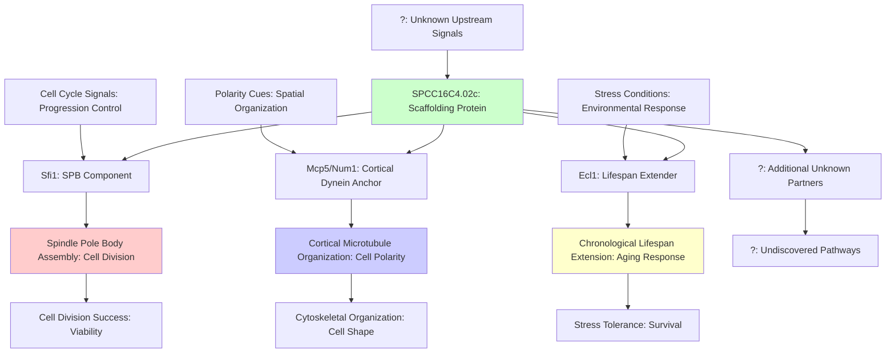

# Pathway Summary for SPCC16C4.02c

## Overview

SPCC16C4.02c encodes an uncharacterized protein that functions as a molecular scaffolding factor, orthologous to human neurochondrin (NCDN). This protein contains a DUF1941 domain and serves as a hub for multiple protein-protein interactions, connecting diverse cellular processes including spindle pole body organization, cortical microtubule anchoring, and cellular aging regulation [file:pombe/SPCC16C4.02c/SPCC16C4.02c-deep-research.md]. While non-essential for viability under standard laboratory conditions, its interaction network suggests important roles in organizing cellular structures and coordinating multiple cellular pathways.

## Spindle Pole Body Organization Pathway

SPCC16C4.02c participates in spindle pole body (SPB) organization through its interaction with Sfi1, a core SPB component involved in SPB duplication and structure. This interaction suggests that SPCC16C4.02c may function as a scaffolding protein that helps organize or regulate SPB components during cell division [file:pombe/SPCC16C4.02c/SPCC16C4.02c-deep-research.md]. The protein may provide structural support or serve as a platform for recruiting additional factors necessary for proper SPB assembly and function. This role would be particularly important during cell cycle progression when SPB duplication and separation are critical for accurate chromosome segregation.

## Cortical Microtubule Anchoring Network

Through its interaction with Mcp5/Num1, SPCC16C4.02c connects to the cortical dynein anchoring system. Mcp5/Num1 functions as a cortical anchor for dynein motors, facilitating proper microtubule organization and potentially nuclear positioning [file:pombe/SPCC16C4.02c/SPCC16C4.02c-deep-research.md]. The interaction with SPCC16C4.02c may help coordinate cortical microtubule anchoring with other cellular processes, providing a link between cytoskeletal organization and cellular signaling pathways. This scaffolding function could be important for maintaining proper cell polarity and organizing the cytoplasmic microtubule network.

## Cellular Aging and Lifespan Regulation

SPCC16C4.02c interacts with Ecl1, a protein involved in extending chronological lifespan in S. pombe. This connection suggests that SPCC16C4.02c may play a role in cellular aging processes and stress response pathways [file:pombe/SPCC16C4.02c/SPCC16C4.02c-deep-research.md]. The protein may function as a coordinator of cellular aging responses, potentially linking metabolic status, stress signaling, and cellular maintenance pathways. This role would be consistent with the function of scaffolding proteins in integrating multiple cellular processes.

## Pathway Diagram

## Integration with Cell Cycle and Cytoskeletal Pathways

As a scaffolding protein, SPCC16C4.02c likely functions at the intersection of multiple cellular pathways. Its interaction with Sfi1 places it within the cell cycle machinery, potentially coordinating SPB organization with other cell division events. The connection to Mcp5/Num1 links it to cytoskeletal organization and nuclear positioning pathways. These diverse interactions suggest that SPCC16C4.02c may serve as a coordination hub that helps synchronize different aspects of cellular organization during cell division and growth.

## Potential Regulatory Mechanisms

While specific regulatory mechanisms for SPCC16C4.02c remain unknown, its function as a scaffolding protein suggests it may be regulated through post-translational modifications, subcellular localization changes, or cell cycle-dependent expression. The protein's interactions with components involved in cell division and aging suggest it may be subject to cell cycle checkpoints or stress response pathways. Future research is needed to identify the signals that control SPCC16C4.02c function and localization.

## Evolutionary Conservation and Functional Implications

The orthology to human neurochondrin indicates that SPCC16C4.02c represents a conserved scaffolding function that has been maintained across eukaryotic evolution. However, the absence of this protein in S. cerevisiae suggests that its function may have been replaced by other scaffolding proteins or may represent a specialized adaptation in certain eukaryotic lineages [file:pombe/SPCC16C4.02c/SPCC16C4.02c-deep-research.md]. This evolutionary pattern indicates that while the protein may not be universally essential, it provides important organizational functions in the organisms that retain it.

## Research Significance and Future Directions

SPCC16C4.02c represents an excellent model for studying how scaffolding proteins coordinate multiple cellular processes. Its interaction network suggests it may be important for understanding how cells integrate signals from different pathways to maintain proper organization and function. Further research is needed to determine the molecular mechanisms by which SPCC16C4.02c coordinates its various protein interactions and to identify additional binding partners that may expand our understanding of its cellular roles.