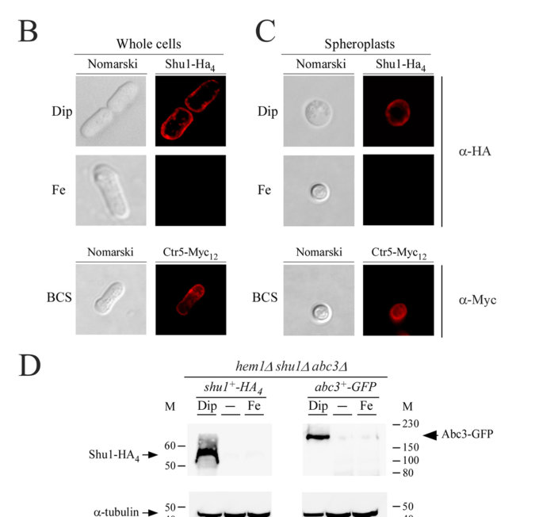

## Question

# Gene Research for Functional Annotation

## ⚠️ CRITICAL: Gene/Protein Identification Context

**BEFORE YOU BEGIN RESEARCH:** You MUST verify you are researching the CORRECT gene/protein. Gene symbols can be ambiguous, especially for less well-characterized genes from non-model organisms.

### Target Gene/Protein Identity (from UniProt):
- **UniProt Accession:** Q92340
- **Protein Description:** RecName: Full=High affinity heme transporter {ECO:0000305}; Flags: Precursor;
- **Gene Information:** Name=shu1 {ECO:0000303|PubMed:25733668}; ORFNames=SPAC1F8.02c {ECO:0000312|PomBase:SPAC1F8.02c};
- **Organism (full):** Schizosaccharomyces pombe (strain 972 / ATCC 24843) (Fission yeast).
- **Protein Family:** Not specified in UniProt
- **Key Domains:** Not specified in UniProt

### MANDATORY VERIFICATION STEPS:

1. **Check if the gene symbol "shu1" matches the protein description above**
2. **Verify the organism is correct:** Schizosaccharomyces pombe (strain 972 / ATCC 24843) (Fission yeast).
3. **Check if protein family/domains align with what you find in literature**
4. **If you find literature for a DIFFERENT gene with the same or similar symbol, STOP**

### If Gene Symbol is Ambiguous or You Cannot Find Relevant Literature:

**DO NOT PROCEED WITH RESEARCH ON A DIFFERENT GENE.** Instead:
- State clearly: "The gene symbol 'shu1' is ambiguous or literature is limited for this specific protein"
- Explain what you found (e.g., "Found extensive literature on a different gene with the same symbol in a different organism")
- Describe the protein based ONLY on the UniProt information provided above
- Suggest that the protein function can be inferred from domain/family information

### Research Target:

Please provide a comprehensive research report on the gene **shu1** (gene ID: Shu1, UniProt: Q92340) in SCHPO.

The research report should be a detailed narrative explaining the function, biological processes, and localization of the gene product. Citations should be given for all claims.

You should prioritize authoritative reviews and primary scientific literature when conducting research. You can supplement
this with annotations you find in gene/protein databases, but these can be outdated or inaccurate.

We are specifically interested in the primary function of the gene - for enzymes, what reaction is catalyzed, and what is the substrate specificity? For transporters, what is the substrate? For structural proteins or adapters, what is the broader structural role? For signaling molecules, what is the role in the pathway.

We are interested in where in or outside the cell the gene product carries out its function.

We are also interested in the signaling or biochemical pathways in which the gene functions. We are less interested in broad pleiotropic effects, except where these elucidate the precise role.

Include evidence where possible. We are interested in both experimental evidence as well as inference from structure, evolution, or bioinformatic analysis. Precise studies should be prioritized over high-throughput, where available.

## Output

Question: You are an expert researcher providing comprehensive, well-cited information.

Provide detailed information focusing on:
1. Key concepts and definitions with current understanding
2. Recent developments and latest research (prioritize 2023-2024 sources)
3. Current applications and real-world implementations
4. Expert opinions and analysis from authoritative sources
5. Relevant statistics and data from recent studies

Format as a comprehensive research report with proper citations. Include URLs and publication dates where available.
Always prioritize recent, authoritative sources and provide specific citations for all major claims.

# Gene Research for Functional Annotation

## ⚠️ CRITICAL: Gene/Protein Identification Context

**BEFORE YOU BEGIN RESEARCH:** You MUST verify you are researching the CORRECT gene/protein. Gene symbols can be ambiguous, especially for less well-characterized genes from non-model organisms.

### Target Gene/Protein Identity (from UniProt):
- **UniProt Accession:** Q92340
- **Protein Description:** RecName: Full=High affinity heme transporter {ECO:0000305}; Flags: Precursor;
- **Gene Information:** Name=shu1 {ECO:0000303|PubMed:25733668}; ORFNames=SPAC1F8.02c {ECO:0000312|PomBase:SPAC1F8.02c};
- **Organism (full):** Schizosaccharomyces pombe (strain 972 / ATCC 24843) (Fission yeast).
- **Protein Family:** Not specified in UniProt
- **Key Domains:** Not specified in UniProt

### MANDATORY VERIFICATION STEPS:

1. **Check if the gene symbol "shu1" matches the protein description above**
2. **Verify the organism is correct:** Schizosaccharomyces pombe (strain 972 / ATCC 24843) (Fission yeast).
3. **Check if protein family/domains align with what you find in literature**
4. **If you find literature for a DIFFERENT gene with the same or similar symbol, STOP**

### If Gene Symbol is Ambiguous or You Cannot Find Relevant Literature:

**DO NOT PROCEED WITH RESEARCH ON A DIFFERENT GENE.** Instead:
- State clearly: "The gene symbol 'shu1' is ambiguous or literature is limited for this specific protein"
- Explain what you found (e.g., "Found extensive literature on a different gene with the same symbol in a different organism")
- Describe the protein based ONLY on the UniProt information provided above
- Suggest that the protein function can be inferred from domain/family information

### Research Target:

Please provide a comprehensive research report on the gene **shu1** (gene ID: Shu1, UniProt: Q92340) in SCHPO.

The research report should be a detailed narrative explaining the function, biological processes, and localization of the gene product. Citations should be given for all claims.

You should prioritize authoritative reviews and primary scientific literature when conducting research. You can supplement
this with annotations you find in gene/protein databases, but these can be outdated or inaccurate.

We are specifically interested in the primary function of the gene - for enzymes, what reaction is catalyzed, and what is the substrate specificity? For transporters, what is the substrate? For structural proteins or adapters, what is the broader structural role? For signaling molecules, what is the role in the pathway.

We are interested in where in or outside the cell the gene product carries out its function.

We are also interested in the signaling or biochemical pathways in which the gene functions. We are less interested in broad pleiotropic effects, except where these elucidate the precise role.

Include evidence where possible. We are interested in both experimental evidence as well as inference from structure, evolution, or bioinformatic analysis. Precise studies should be prioritized over high-throughput, where available.

## Research report: Functional annotation of *Schizosaccharomyces pombe* shu1 (UniProt Q92340; ORF SPAC1F8.02c)

### Executive summary
*Schizosaccharomyces pombe* **Shu1** (UniProt **Q92340**; gene **shu1+**; ORF **SPAC1F8.02c**) is an **iron-regulated, cell-surface heme-binding protein** required for **assimilation of exogenous hemin/heme and heme analogs** when endogenous heme biosynthesis is compromised. Direct biochemical evidence shows Shu1 binds hemin with **micromolar affinity (~2.2 µM)** and genetic evidence shows shu1 deletion prevents **hemin-dependent growth** in *hem1Δ* strains and dramatically reduces uptake of the fluorescent heme analog **zinc mesoporphyrin (ZnMP)**. Shu1 localizes to the **plasma membrane under iron starvation** and is proposed (in later mechanistic synthesis) to traffic to the **vacuole** upon hemin exposure, consistent with an endocytic/vacuolar route for heme handling in fission yeast. (mourer2015shu1isa pages 1-2, mourer2015shu1isa pages 11-13, mourer2015shu1isa pages 2-3, ping2024theflavohemoglobinyhb1 pages 1-5)

### 1) Key concepts and definitions (current understanding)

#### 1.1 Heme as an iron source and why uptake systems exist
Heme (iron–protoporphyrin IX) is abundant in animals and can serve as an iron reservoir for microbes, but it is hydrophobic and potentially toxic; therefore, microbes often use dedicated acquisition and trafficking systems. In fungi, heme acquisition is best characterized in pathogenic yeasts such as *Candida albicans*, which use specialized cell-surface receptors—often **CFEM-domain proteins**—to bind host heme/hemoglobin and promote internalization. (mourer2015shu1isa pages 11-13)

#### 1.2 What Shu1 is (definition for annotation purposes)
Based on experimental genetics, microscopy, and biochemistry, Shu1 is best defined as a **cell-surface, high-affinity hemin/heme-binding factor enabling utilization of extracellular heme as an iron source** in *S. pombe*. Mourer et al. explicitly describe Shu1 as a **cell-surface protein involved in iron acquisition from heme**, and demonstrate that Shu1 directly interacts with hemin. (mourer2015shu1isa pages 1-2, mourer2015shu1isa pages 11-13)

#### 1.3 Relationship to CFEM heme receptors
Shu1 shows **sequence similarity** to some *Candida* heme receptors (e.g., Rbt5/Pga7) and contains a cysteine-rich region important for hemin binding, but its cysteine arrangement is described as **non-canonical/partial relative to typical CFEM motifs**, suggesting Shu1 represents a **divergent or distinct fungal heme-binding strategy** compared with canonical CFEM relay systems. (mourer2015shu1isa pages 8-9, mourer2015shu1isa pages 11-13, mourer2019étudedumécanisme pages 93-96)

### 2) Shu1 function: substrate specificity, mechanism, and pathway placement

#### 2.1 Primary function and substrate
**Primary function:** facilitate assimilation of **exogenous hemin/heme** for **iron acquisition**.

**Substrate evidence:**
- *hem1Δ* strains (blocked in first step of heme biosynthesis) can be used to force dependence on exogenous hemin; under these conditions, growth on hemin and uptake of ZnMP depend on **shu1+**. (mourer2015shu1isa pages 1-2, mourer2015shu1isa pages 2-3)
- Shu1 does not simply substitute for elemental iron uptake; functional assays indicate specificity for heme/porphyrin assimilation rather than FeCl3 uptake alone. (mourer2019étudedumécanisme pages 84-89)

#### 2.2 Direct hemin binding (biochemical definition)
Purified Shu1(21–200) binds hemin directly:
- Spectral titration shows a **Soret shift** from **~388–391 nm** (hemin alone) to **~407 nm** upon Shu1 addition, supporting direct coordination/binding. (mourer2015shu1isa pages 11-13, mourer2019étudedumécanisme pages 89-93)
- Binding analysis yields **K\_D ≈ 2.2 × 10⁻⁶ M (≈2.2 µM)**. (mourer2015shu1isa pages 11-13, mourer2019étudedumécanisme pages 89-93)
- Hemin-agarose pulldown experiments show Shu1 is retained on hemin-agarose, supporting specific hemin interaction. (mourer2015shu1isa pages 11-13, mourer2019étudedumécanisme pages 89-93)

Cysteine-dependence:
- Mutation of **C72/C87/C92/C101 → Ala** strongly reduces hemin-agarose retention and eliminates high-affinity binding behavior, indicating these residues (or a subset) are crucial for heme coordination. (mourer2015shu1isa pages 11-13, mourer2019étudedumécanisme pages 89-93, mourer2019étudedumécanisme pages 93-96)

#### 2.3 Pathway context in *S. pombe*: two heme-uptake routes and downstream handling
A key 2024 development is the explicit framing of **two distinct exogenous heme uptake pathways** in *S. pombe*: **Shu1** (cell-surface/GPI-anchored route) and **Str3** (a distinct MFS transporter route). (ping2024theflavohemoglobinyhb1 pages 13-17, ping2024theflavohemoglobinyhb1 pages 10-13)

In that 2024 synthesis, Shu1 is described as:
- a **cell-surface GPI-anchored heme receptor** that binds hemin or ZnMP, and
- a component of a pathway in which cargo is delivered to the **vacuole**, followed by redistribution to the cytoplasm via the vacuolar **ABC transporter Abc3** (a model consistent with vacuolar involvement in heme/iron handling). (ping2024theflavohemoglobinyhb1 pages 1-5)

This places Shu1 in an iron-acquisition network alongside reductive iron assimilation and siderophore transport but functioning specifically for heme assimilation. (mourer2015shu1isa pages 13-14)

### 3) Cellular localization and trafficking

#### 3.1 Plasma membrane / cell-surface localization under low iron
Mourer et al. used HA-tagged Shu1 and found peripheral staining consistent with cell-surface localization under iron starvation; spheroplast experiments support a **plasma membrane** location rather than exclusive cell wall retention. (mourer2015shu1isa pages 8-9)

The requested visual evidence is present in the 2015 paper figures (immunofluorescence and biochemical fractionation; hemin-binding assays; growth assays). (mourer2015shu1isa media ac014ef9)

#### 3.2 Hemin-dependent trafficking to the vacuole (proposed/extended model)
A later mechanistic synthesis (2024 preprint) describes Shu1 as being **rapidly internalized to the vacuolar membrane** after binding hemin/ZnMP, consistent with an endocytic/vacuolar delivery route for porphyrin handling. (ping2024theflavohemoglobinyhb1 pages 1-5)

### 4) Regulation: iron-responsive expression and transcriptional control

#### 4.1 Fep1-mediated iron repression and iron-starvation induction
Shu1 is strongly iron-regulated:
- shu1+ transcription is induced by low iron and repressed by iron repletion in a mechanism involving the GATA-type repressor **Fep1**. (mourer2015shu1isa pages 1-2, mourer2015shu1isa pages 2-3)
- In 2015, shu1 induction under iron starvation is reported with delayed kinetics: detectable at **~90 min** and maximal by **~4 h**, slower than some other iron-uptake genes. (mourer2015shu1isa pages 13-14)

#### 4.2 Quantitative regulatory evidence in 2024
In Ping et al. (2024), the shu1+ promoter is used as a positive control for Fep1 ChIP and shows iron-dependent promoter occupancy: **~7.3-fold enrichment under iron-replete vs ~1.2-fold under low iron**. (ping2024theflavohemoglobinyhb1 pages 10-13)

### 5) Key experimental evidence and statistics (with conditions)

#### 5.1 Genetic requirement for hemin-supported growth
Using *hem1Δ* strains (blocked heme biosynthesis, requiring exogenous heme/ALA), deletion of shu1 compromises hemin utilization:
- A hem1Δ shu1Δ strain shows **~6–8-fold less growth after 68 h** than shu1+ controls under hemin-supported conditions (hemin **0.075 µM**). (mourer2019étudedumécanisme pages 84-89)

#### 5.2 ZnMP uptake assays (porphyrin uptake proxy)
ZnMP uptake is Shu1-dependent:
- Typical assay conditions include iron manipulation by **Dip 250 µM** or **FeCl3 100 µM** for **3 h**, followed by incubation with **ZnMP 2 µM** for **90 min**; deletion of shu1 dramatically reduces cellular ZnMP signal. (mourer2015shu1isa pages 10-11, mourer2019étudedumécanisme pages 84-89)

#### 5.3 Hemin-binding statistics
- Hemin-binding **K\_D ≈ 2.2 × 10⁻⁶ M** (≈2.2 µM). (mourer2015shu1isa pages 11-13, mourer2019étudedumécanisme pages 89-93)
- Spectroscopic signature: Soret peak shift **~388–391 nm → ~407 nm** upon Shu1 binding. (mourer2015shu1isa pages 11-13, mourer2019étudedumécanisme pages 89-93)

### 6) Recent developments (prioritizing 2023–2024)

#### 6.1 2024: Integration with Str3/Yhb1 and stress biology
Ping et al. (bioRxiv, **2024-03-03**) integrates Shu1 into a broader physiological context in which exogenous heme uptake supports heme-dependent processes such as nitrosative stress defense (via Yhb1) when cells rely on external hemin. While their main focus is Str3–Yhb1 interaction, they explicitly treat Shu1 and Str3 as the **two distinct heme uptake pathways** in fission yeast and provide updated regulatory and trafficking context for Shu1. (ping2024theflavohemoglobinyhb1 pages 1-5, ping2024theflavohemoglobinyhb1 pages 10-13, ping2024theflavohemoglobinyhb1 pages 13-17)

#### 6.2 2023: Broader iron-acquisition expert context (scope limitation)
A 2023 review on fungal siderophore metabolism emphasizes that high-affinity iron uptake in many fungi is dominated by reductive iron assimilation and siderophore systems, and notes that some fungi (e.g., *Aspergillus fumigatus*) appear to **lack efficient use of heme as an iron source**—highlighting lineage diversity and why a dedicated heme uptake factor like Shu1 may be more relevant in some fungi than others. This review does not discuss Shu1 or CFEM heme receptors directly, so its relevance is contextual rather than Shu1-specific. (happacher2023fungalsiderophoremetabolism pages 1-3)

### 7) Current applications and real-world implementations

#### 7.1 In-lab applications (real-world use in research workflows)
Shu1 provides a tractable model for:
- **Studying fungal heme uptake mechanisms** in a genetically manipulable yeast, including cell-surface binding, endocytic routing, and vacuolar redistribution models. (mourer2015shu1isa pages 1-2, ping2024theflavohemoglobinyhb1 pages 1-5)
- **Chemical biology/transport assays** using fluorescent heme analogs (ZnMP) to quantify uptake dependence on surface factors and iron regulation. (mourer2015shu1isa pages 10-11)

#### 7.2 Translational relevance (indirect)
While *S. pombe* is not a major pathogen, Shu1-like heme acquisition principles connect to heme uptake in pathogenic fungi where cell-surface heme receptors contribute to iron acquisition in host environments. The *S. pombe* Shu1 system broadens comparative understanding of fungal heme uptake beyond the well-studied *Candida* CFEM relay. (mourer2015shu1isa pages 11-13, mourer2015shu1isa pages 13-14)

### 8) Expert interpretation and limitations of current evidence

1. **Strongest claims supported by direct evidence**: cell-surface localization under low iron; requirement for hemin/ZnMP assimilation in *hem1Δ* backgrounds; direct hemin binding with micromolar affinity; iron/Fep1 transcriptional regulation. (mourer2015shu1isa pages 8-9, mourer2015shu1isa pages 2-3, mourer2015shu1isa pages 11-13, ping2024theflavohemoglobinyhb1 pages 10-13)
2. **Mechanistic steps after binding** (endocytosis, vacuolar routing, Abc3-dependent redistribution) are supported as an integrated model in later synthesis; however, some aspects (e.g., exact internalization machinery for Shu1 specifically) should be treated as **model-level** unless corroborated in peer-reviewed primary studies beyond the preprint. (ping2024theflavohemoglobinyhb1 pages 1-5)
3. **Domain/family classification** remains non-canonical relative to classic CFEM receptors; Shu1 has partial similarity and cysteine dependence but may represent a distinct evolutionary solution for heme binding in fungi. (mourer2015shu1isa pages 11-13, mourer2019étudedumécanisme pages 93-96)

### Evidence summary table
| Category | Key findings | Evidence type | Primary source(s) with publication date and URL |
|---|---|---|---|
| identity/structure | **shu1 = SPAC1F8.02c = UniProt Q92340** in *Schizosaccharomyces pombe*; encodes a **226 aa precursor/cell-surface heme-binding protein** with **N-terminal signal peptide**, **predicted GPI-anchor attachment near Ser199**, short C-terminal hydrophobic segment/pro-peptide, and a **partial CFEM-like cysteine-rich region** including **C72/C87/C92/C101** important for heme interaction (mourer2015shu1isa pages 1-2, mourer2019étudedumécanisme pages 61-65, mourer2015shu1isa pages 13-14) | Sequence analysis, genetics, biochemistry | Mourer T, Jacques J-F, Brault A, Bisaillon M, Labbé S. **2015-04**. *Shu1 Is a Cell-surface Protein Involved in Iron Acquisition from Heme in Schizosaccharomyces pombe*. J Biol Chem. https://doi.org/10.1074/jbc.m115.642058 ; Mourer T. **2019**. *Étude du mécanisme d'acquisition de l'hème par le récepteur Shu1 chez Schizosaccharomyces pombe* (thesis/monograph record) (mourer2015shu1isa pages 1-2, mourer2019étudedumécanisme pages 61-65, mourer2015shu1isa pages 13-14) |
| substrate specificity | Shu1 is required for utilization of **exogenous hemin/heme** and uptake of the fluorescent heme analog **ZnMP** when endogenous heme synthesis is blocked (*hem1Δ* background). Available evidence supports **heme/porphyrin uptake specificity**, not general ferric iron uptake; Shu1 does **not** substitute for the high-affinity elemental iron uptake system and cannot mediate growth on exogenous **FeCl3** alone (mourer2019étudedumécanisme pages 84-89, mourer2015shu1isa pages 2-3, mourer2019étudedumécanisme pages 61-65) | Genetics, uptake assay | Mourer et al., **2015-04**, https://doi.org/10.1074/jbc.m115.642058 ; Mourer, **2019** (mourer2019étudedumécanisme pages 84-89, mourer2015shu1isa pages 2-3, mourer2019étudedumécanisme pages 61-65) |
| binding affinity | Purified Shu1(21–200) binds hemin directly in vitro. **Spectral titration** of **10 µM hemin** with **0–7 µM Shu1** shifted the Soret peak from **~388–391 nm to ~407 nm** and gave an apparent **K_D ≈ 2.2 × 10^-6 M (2.2 µM)**. The **C72A/C87A/C92A/C101A** mutant greatly reduced hemin-agarose retention and failed to yield a measurable high-affinity interaction (mourer2015shu1isa pages 1-2, mourer2019étudedumécanisme pages 89-93, mourer2015shu1isa pages 11-13) | Biochemistry | Mourer et al., **2015-04**, https://doi.org/10.1074/jbc.m115.642058 ; Mourer, **2019** (mourer2015shu1isa pages 1-2, mourer2019étudedumécanisme pages 89-93, mourer2015shu1isa pages 11-13) |
| localization | HA-tagged Shu1 localizes to the **cell periphery/plasma membrane** under **low-iron** conditions; localization remains membrane-associated after **cell wall digestion** (spheroplasts), supporting plasma membrane rather than wall-only localization. Later work indicates Shu1 is **hemin-responsive**: at low hemin it is at the plasma membrane, while at higher extracellular hemin it is **internalized to the vacuole/vacuolar membrane** (mourer2015shu1isa pages 8-9, mourer2019étudedumécanisme pages 106-109, mourer2019étudedumécanisme pages 132-135, mourer2015shu1isa media ac014ef9) | Microscopy, membrane fractionation | Mourer et al., **2015-04**, https://doi.org/10.1074/jbc.m115.642058 ; Mourer, **2019** (mourer2015shu1isa pages 8-9, mourer2019étudedumécanisme pages 106-109, mourer2019étudedumécanisme pages 132-135, mourer2015shu1isa media ac014ef9) |
| regulation | **Iron starvation induces shu1+**, whereas iron repletion represses it through the GATA-type repressor **Fep1**. In the 2015 study, induction was detectable after **~90 min** of iron starvation and reached maximal levels by **~4 h**. Typical assay conditions included **Dip 250 µM** or **FeCl3 100 µM** for **3 h**. A 2024 study used the **shu1+ promoter** as a Fep1 ChIP positive control and reported **~7.3-fold** Fep1 enrichment at the promoter under iron-replete conditions versus **~1.2-fold** under low iron (mourer2015shu1isa pages 1-2, mourer2015shu1isa pages 13-14, mourer2019étudedumécanisme pages 84-89, mourer2019étudedumécanisme pages 80-84, ping2024theflavohemoglobinyhb1 pages 10-13) | Regulatory, ChIP, expression analysis | Mourer et al., **2015-04**, https://doi.org/10.1074/jbc.m115.642058 ; Ping FLY et al. **2024-03**. *The flavohemoglobin Yhb1 is a new interacting partner of the heme transporter Str3* (preprint). https://doi.org/10.1101/2024.03.03.583214 (mourer2015shu1isa pages 1-2, mourer2015shu1isa pages 13-14, ping2024theflavohemoglobinyhb1 pages 10-13) |
| pathway/model | Best-supported model: Shu1 is a **cell-surface GPI-anchored heme receptor/transporter** that captures extracellular heme/ZnMP for iron acquisition. Shu1-mediated heme use is **independent of Fio1/Fip1** oxidase-permease-mediated elemental iron uptake. Later mechanistic work proposes that Shu1-bound heme is trafficked via **endocytosis to the vacuole**, followed by export to the cytoplasm through the vacuolar **ABC transporter Abc3**; this is distinct from the parallel **Str3** pathway (mourer2015shu1isa pages 13-14, mourer2019étudedumécanisme pages 106-109, ping2024theflavohemoglobinyhb1 pages 1-5) | Genetics, cell biology, pathway inference | Mourer et al., **2015-04**, https://doi.org/10.1074/jbc.m115.642058 ; Ping et al., **2024-03**, https://doi.org/10.1101/2024.03.03.583214 ; Mourer, **2019** (mourer2015shu1isa pages 13-14, mourer2019étudedumécanisme pages 106-109, ping2024theflavohemoglobinyhb1 pages 1-5) |
| key assays & phenotypes | In *hem1Δ* cells (heme biosynthesis blocked), exogenous **ALA 200 µM** rescues viability and enables heme-uptake assays. In hemin-supported growth conditions (**hemin 0.075 µM**), **hem1Δ shu1Δ** cells show severe growth defects; one study reports **~6–8-fold less growth after 68 h** than **shu1+** controls/complemented strains. **ZnMP uptake assays** used **2 µM ZnMP** after **3 h** iron manipulation and **90 min** uptake; loss of shu1 **dramatically lowered ZnMP fluorescence**. Hemin-agarose pull-down and spectral titration support direct binding, while the cysteine-quartet mutant loses function without obvious mislocalization (mourer2019étudedumécanisme pages 84-89, mourer2015shu1isa pages 2-3, mourer2015shu1isa pages 10-11, mourer2015shu1isa media ac014ef9) | Genetics, fluorescence uptake assay, biochemistry, microscopy | Mourer et al., **2015-04**, https://doi.org/10.1074/jbc.m115.642058 ; Mourer, **2019** (mourer2019étudedumécanisme pages 84-89, mourer2015shu1isa pages 2-3, mourer2015shu1isa pages 10-11, mourer2015shu1isa media ac014ef9) |
| recent updates 2024 | A 2024 *S. pombe* preprint places Shu1 in a broader **dual heme-uptake network** with **Str3**. It describes Shu1 as the **high-affinity/cell-surface GPI-anchored route** for hemin/ZnMP uptake and notes mechanistic requirements for Shu1 trafficking/internalization involving **Ubi4-dependent ubiquitination, Ubc13, Nbr1, and ESCRT factors (Hse1, Sst6)**, whereas **Str3** is a separate 12-TM transporter route that remains at the plasma membrane and requires higher hemin concentrations than Shu1. This refines pathway context but does not overturn the core 2015 annotation (ping2024theflavohemoglobinyhb1 pages 1-5, ping2024theflavohemoglobinyhb1 pages 10-13, ping2024theflavohemoglobinyhb1 pages 13-17) | Recent mechanistic synthesis, genetics, trafficking model | Ping FLY et al. **2024-03**. *The flavohemoglobin Yhb1 is a new interacting partner of the heme transporter Str3* (preprint). https://doi.org/10.1101/2024.03.03.583214 (ping2024theflavohemoglobinyhb1 pages 1-5, ping2024theflavohemoglobinyhb1 pages 10-13, ping2024theflavohemoglobinyhb1 pages 13-17) |

*Table: This table summarizes experimentally supported functional annotation for fission yeast Shu1/Q92340, including structure, substrate, affinity, localization, regulation, and pathway context. It is designed as a compact evidence map linking each claim to primary sources and available quantitative data.*

### Figure-based evidence (visual confirmation)
The 2015 JBC paper includes figures showing: (i) Shu1 plasma membrane localization by immunofluorescence; (ii) hemin-dependent growth assays demonstrating Shu1 requirement; and (iii) hemin-agarose pulldown and spectral titration defining hemin binding (including the KD). (mourer2015shu1isa media ac014ef9)

### References (URLs and dates)
- Mourer T. et al. **2015-04**. *Shu1 Is a Cell-surface Protein Involved in Iron Acquisition from Heme in Schizosaccharomyces pombe*. **Journal of Biological Chemistry** 290:10176–10190. https://doi.org/10.1074/jbc.m115.642058 (mourer2015shu1isa pages 1-2)
- Ping F. Lo Ying et al. **2024-03-03**. *The flavohemoglobin Yhb1 is a new interacting partner of the heme transporter Str3*. **bioRxiv** (preprint). https://doi.org/10.1101/2024.03.03.583214 (ping2024theflavohemoglobinyhb1 pages 1-5)
- Happacher I. et al. **2023-09**. *Fungal siderophore metabolism with a focus on Aspergillus fumigatus: impact on biotic interactions and potential translational applications*. **Essays in Biochemistry** 67:829–842. https://doi.org/10.1042/EBC20220252 (happacher2023fungalsiderophoremetabolism pages 1-3)

References

1. (mourer2015shu1isa pages 1-2): Thierry Mourer, Jean-François Jacques, Ariane Brault, Martin Bisaillon, and Simon Labbé. Shu1 is a cell-surface protein involved in iron acquisition from heme in schizosaccharomyces pombe. Journal of Biological Chemistry, 290:10176-10190, Apr 2015. URL: https://doi.org/10.1074/jbc.m115.642058, doi:10.1074/jbc.m115.642058. This article has 49 citations and is from a domain leading peer-reviewed journal.

2. (mourer2015shu1isa pages 11-13): Thierry Mourer, Jean-François Jacques, Ariane Brault, Martin Bisaillon, and Simon Labbé. Shu1 is a cell-surface protein involved in iron acquisition from heme in schizosaccharomyces pombe. Journal of Biological Chemistry, 290:10176-10190, Apr 2015. URL: https://doi.org/10.1074/jbc.m115.642058, doi:10.1074/jbc.m115.642058. This article has 49 citations and is from a domain leading peer-reviewed journal.

3. (mourer2015shu1isa pages 2-3): Thierry Mourer, Jean-François Jacques, Ariane Brault, Martin Bisaillon, and Simon Labbé. Shu1 is a cell-surface protein involved in iron acquisition from heme in schizosaccharomyces pombe. Journal of Biological Chemistry, 290:10176-10190, Apr 2015. URL: https://doi.org/10.1074/jbc.m115.642058, doi:10.1074/jbc.m115.642058. This article has 49 citations and is from a domain leading peer-reviewed journal.

4. (ping2024theflavohemoglobinyhb1 pages 1-5): Florie Lo Ying Ping, Tobias Vahsen, Ariane Brault, Raphaël Néré, and Simon Labbé. The flavohemoglobin yhb1 is a new interacting partner of the heme transporter str3. BioRxiv, Mar 2024. URL: https://doi.org/10.1101/2024.03.03.583214, doi:10.1101/2024.03.03.583214. This article has 0 citations.

5. (mourer2015shu1isa pages 8-9): Thierry Mourer, Jean-François Jacques, Ariane Brault, Martin Bisaillon, and Simon Labbé. Shu1 is a cell-surface protein involved in iron acquisition from heme in schizosaccharomyces pombe. Journal of Biological Chemistry, 290:10176-10190, Apr 2015. URL: https://doi.org/10.1074/jbc.m115.642058, doi:10.1074/jbc.m115.642058. This article has 49 citations and is from a domain leading peer-reviewed journal.

6. (mourer2019étudedumécanisme pages 93-96): T Mourer. Étude du mécanisme d'acquisition de l'hème par le récepteur shu1 chez schizosaccharomyces pombe. Unknown journal, 2019.

7. (mourer2019étudedumécanisme pages 84-89): T Mourer. Étude du mécanisme d'acquisition de l'hème par le récepteur shu1 chez schizosaccharomyces pombe. Unknown journal, 2019.

8. (mourer2019étudedumécanisme pages 89-93): T Mourer. Étude du mécanisme d'acquisition de l'hème par le récepteur shu1 chez schizosaccharomyces pombe. Unknown journal, 2019.

9. (ping2024theflavohemoglobinyhb1 pages 13-17): Florie Lo Ying Ping, Tobias Vahsen, Ariane Brault, Raphaël Néré, and Simon Labbé. The flavohemoglobin yhb1 is a new interacting partner of the heme transporter str3. BioRxiv, Mar 2024. URL: https://doi.org/10.1101/2024.03.03.583214, doi:10.1101/2024.03.03.583214. This article has 0 citations.

10. (ping2024theflavohemoglobinyhb1 pages 10-13): Florie Lo Ying Ping, Tobias Vahsen, Ariane Brault, Raphaël Néré, and Simon Labbé. The flavohemoglobin yhb1 is a new interacting partner of the heme transporter str3. BioRxiv, Mar 2024. URL: https://doi.org/10.1101/2024.03.03.583214, doi:10.1101/2024.03.03.583214. This article has 0 citations.

11. (mourer2015shu1isa pages 13-14): Thierry Mourer, Jean-François Jacques, Ariane Brault, Martin Bisaillon, and Simon Labbé. Shu1 is a cell-surface protein involved in iron acquisition from heme in schizosaccharomyces pombe. Journal of Biological Chemistry, 290:10176-10190, Apr 2015. URL: https://doi.org/10.1074/jbc.m115.642058, doi:10.1074/jbc.m115.642058. This article has 49 citations and is from a domain leading peer-reviewed journal.

12. (mourer2015shu1isa media ac014ef9): Thierry Mourer, Jean-François Jacques, Ariane Brault, Martin Bisaillon, and Simon Labbé. Shu1 is a cell-surface protein involved in iron acquisition from heme in schizosaccharomyces pombe. Journal of Biological Chemistry, 290:10176-10190, Apr 2015. URL: https://doi.org/10.1074/jbc.m115.642058, doi:10.1074/jbc.m115.642058. This article has 49 citations and is from a domain leading peer-reviewed journal.

13. (mourer2015shu1isa pages 10-11): Thierry Mourer, Jean-François Jacques, Ariane Brault, Martin Bisaillon, and Simon Labbé. Shu1 is a cell-surface protein involved in iron acquisition from heme in schizosaccharomyces pombe. Journal of Biological Chemistry, 290:10176-10190, Apr 2015. URL: https://doi.org/10.1074/jbc.m115.642058, doi:10.1074/jbc.m115.642058. This article has 49 citations and is from a domain leading peer-reviewed journal.

14. (happacher2023fungalsiderophoremetabolism pages 1-3): Isidor Happacher, Mario Aguiar, Annie Yap, Clemens Decristoforo, and Hubertus Haas. Fungal siderophore metabolism with a focus on <i>aspergillus fumigatus</i>: impact on biotic interactions and potential translational applications. Essays in Biochemistry, 67:829-842, Sep 2023. URL: https://doi.org/10.1042/ebc20220252, doi:10.1042/ebc20220252. This article has 35 citations and is from a peer-reviewed journal.

15. (mourer2019étudedumécanisme pages 61-65): T Mourer. Étude du mécanisme d'acquisition de l'hème par le récepteur shu1 chez schizosaccharomyces pombe. Unknown journal, 2019.

16. (mourer2019étudedumécanisme pages 106-109): T Mourer. Étude du mécanisme d'acquisition de l'hème par le récepteur shu1 chez schizosaccharomyces pombe. Unknown journal, 2019.

17. (mourer2019étudedumécanisme pages 132-135): T Mourer. Étude du mécanisme d'acquisition de l'hème par le récepteur shu1 chez schizosaccharomyces pombe. Unknown journal, 2019.

18. (mourer2019étudedumécanisme pages 80-84): T Mourer. Étude du mécanisme d'acquisition de l'hème par le récepteur shu1 chez schizosaccharomyces pombe. Unknown journal, 2019.

## Artifacts

- [Edison artifact artifact-00](Shu1-deep-research-falcon_artifacts/artifact-00.md)

## Citations

1. happacher2023fungalsiderophoremetabolism pages 1-3
2. https://doi.org/10.1074/jbc.m115.642058
3. https://doi.org/10.1101/2024.03.03.583214
4. https://doi.org/10.1042/EBC20220252
5. https://doi.org/10.1074/jbc.m115.642058,
6. https://doi.org/10.1101/2024.03.03.583214,
7. https://doi.org/10.1042/ebc20220252,