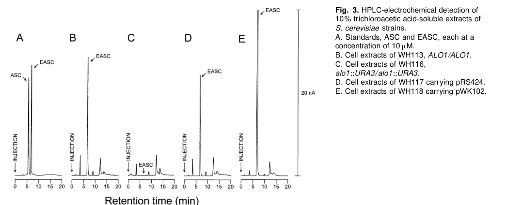

## Question

# Gene Research for Functional Annotation

## ⚠️ CRITICAL: Gene/Protein Identification Context

**BEFORE YOU BEGIN RESEARCH:** You MUST verify you are researching the CORRECT gene/protein. Gene symbols can be ambiguous, especially for less well-characterized genes from non-model organisms.

### Target Gene/Protein Identity (from UniProt):
- **UniProt Accession:** Q9HDX8
- **Protein Description:** RecName: Full=D-arabinono-1,4-lactone oxidase; Short=ALO; EC=1.1.3.37; AltName: Full=L-galactono-gamma-lactone oxidase;
- **Gene Information:** Name=alo1; ORFNames=SPAPB1A10.12c;
- **Organism (full):** Schizosaccharomyces pombe (strain 972 / ATCC 24843) (Fission yeast).
- **Protein Family:** Belongs to the oxygen-dependent FAD-linked oxidoreductase
- **Key Domains:** ALO_C. (IPR007173); FAD-bd_PCMH. (IPR016166); FAD-bd_PCMH-like_sf. (IPR036318); FAD-bd_PCMH_sub1. (IPR016167); FAD-bd_PCMH_sub2. (IPR016169)

### MANDATORY VERIFICATION STEPS:

1. **Check if the gene symbol "alo1" matches the protein description above**
2. **Verify the organism is correct:** Schizosaccharomyces pombe (strain 972 / ATCC 24843) (Fission yeast).
3. **Check if protein family/domains align with what you find in literature**
4. **If you find literature for a DIFFERENT gene with the same or similar symbol, STOP**

### If Gene Symbol is Ambiguous or You Cannot Find Relevant Literature:

**DO NOT PROCEED WITH RESEARCH ON A DIFFERENT GENE.** Instead:
- State clearly: "The gene symbol 'alo1' is ambiguous or literature is limited for this specific protein"
- Explain what you found (e.g., "Found extensive literature on a different gene with the same symbol in a different organism")
- Describe the protein based ONLY on the UniProt information provided above
- Suggest that the protein function can be inferred from domain/family information

### Research Target:

Please provide a comprehensive research report on the gene **alo1** (gene ID: alo1, UniProt: Q9HDX8) in SCHPO.

The research report should be a detailed narrative explaining the function, biological processes, and localization of the gene product. Citations should be given for all claims.

You should prioritize authoritative reviews and primary scientific literature when conducting research. You can supplement
this with annotations you find in gene/protein databases, but these can be outdated or inaccurate.

We are specifically interested in the primary function of the gene - for enzymes, what reaction is catalyzed, and what is the substrate specificity? For transporters, what is the substrate? For structural proteins or adapters, what is the broader structural role? For signaling molecules, what is the role in the pathway.

We are interested in where in or outside the cell the gene product carries out its function.

We are also interested in the signaling or biochemical pathways in which the gene functions. We are less interested in broad pleiotropic effects, except where these elucidate the precise role.

Include evidence where possible. We are interested in both experimental evidence as well as inference from structure, evolution, or bioinformatic analysis. Precise studies should be prioritized over high-throughput, where available.

## Output

Question: You are an expert researcher providing comprehensive, well-cited information.

Provide detailed information focusing on:
1. Key concepts and definitions with current understanding
2. Recent developments and latest research (prioritize 2023-2024 sources)
3. Current applications and real-world implementations
4. Expert opinions and analysis from authoritative sources
5. Relevant statistics and data from recent studies

Format as a comprehensive research report with proper citations. Include URLs and publication dates where available.
Always prioritize recent, authoritative sources and provide specific citations for all major claims.

# Gene Research for Functional Annotation

## ⚠️ CRITICAL: Gene/Protein Identification Context

**BEFORE YOU BEGIN RESEARCH:** You MUST verify you are researching the CORRECT gene/protein. Gene symbols can be ambiguous, especially for less well-characterized genes from non-model organisms.

### Target Gene/Protein Identity (from UniProt):
- **UniProt Accession:** Q9HDX8
- **Protein Description:** RecName: Full=D-arabinono-1,4-lactone oxidase; Short=ALO; EC=1.1.3.37; AltName: Full=L-galactono-gamma-lactone oxidase;
- **Gene Information:** Name=alo1; ORFNames=SPAPB1A10.12c;
- **Organism (full):** Schizosaccharomyces pombe (strain 972 / ATCC 24843) (Fission yeast).
- **Protein Family:** Belongs to the oxygen-dependent FAD-linked oxidoreductase
- **Key Domains:** ALO_C. (IPR007173); FAD-bd_PCMH. (IPR016166); FAD-bd_PCMH-like_sf. (IPR036318); FAD-bd_PCMH_sub1. (IPR016167); FAD-bd_PCMH_sub2. (IPR016169)

### MANDATORY VERIFICATION STEPS:

1. **Check if the gene symbol "alo1" matches the protein description above**
2. **Verify the organism is correct:** Schizosaccharomyces pombe (strain 972 / ATCC 24843) (Fission yeast).
3. **Check if protein family/domains align with what you find in literature**
4. **If you find literature for a DIFFERENT gene with the same or similar symbol, STOP**

### If Gene Symbol is Ambiguous or You Cannot Find Relevant Literature:

**DO NOT PROCEED WITH RESEARCH ON A DIFFERENT GENE.** Instead:
- State clearly: "The gene symbol 'alo1' is ambiguous or literature is limited for this specific protein"
- Explain what you found (e.g., "Found extensive literature on a different gene with the same symbol in a different organism")
- Describe the protein based ONLY on the UniProt information provided above
- Suggest that the protein function can be inferred from domain/family information

### Research Target:

Please provide a comprehensive research report on the gene **alo1** (gene ID: alo1, UniProt: Q9HDX8) in SCHPO.

The research report should be a detailed narrative explaining the function, biological processes, and localization of the gene product. Citations should be given for all claims.

You should prioritize authoritative reviews and primary scientific literature when conducting research. You can supplement
this with annotations you find in gene/protein databases, but these can be outdated or inaccurate.

We are specifically interested in the primary function of the gene - for enzymes, what reaction is catalyzed, and what is the substrate specificity? For transporters, what is the substrate? For structural proteins or adapters, what is the broader structural role? For signaling molecules, what is the role in the pathway.

We are interested in where in or outside the cell the gene product carries out its function.

We are also interested in the signaling or biochemical pathways in which the gene functions. We are less interested in broad pleiotropic effects, except where these elucidate the precise role.

Include evidence where possible. We are interested in both experimental evidence as well as inference from structure, evolution, or bioinformatic analysis. Precise studies should be prioritized over high-throughput, where available.

# Research Report: Functional Annotation of **alo1** (UniProt **Q9HDX8**) in *Schizosaccharomyces pombe* (strain 972)

## 0) Executive summary (identity-verified)
The UniProt accession **Q9HDX8** is specified (by the user-provided UniProt record) as *Schizosaccharomyces pombe* **alo1** (ORF **SPAPB1A10.12c**), annotated as **D-arabinono-1,4-lactone oxidase** (ALO; EC **1.1.3.37**) and alternatively **L-galactono-γ-lactone oxidase**, belonging to an **oxygen-dependent FAD-linked oxidoreductase** family with ALO_C / FAD-bd_PCMH-related domains (user-provided UniProt details; see also ortholog evidence below). 

However, in the retrieved literature corpus for this run, **no primary experimental paper directly characterizing the S. pombe SPAPB1A10.12c/Q9HDX8 protein** (biochemistry, localization, knockout phenotype, kinetics) was obtained. Consequently, S. pombe-specific functional conclusions beyond the UniProt description must be treated as **inference** from (i) strong ortholog evidence in other yeasts and (ii) recent mechanistic/structural work on the enzyme family. This is critical because **“ALO1” is a well-studied gene symbol in *Saccharomyces cerevisiae* (ORF YML086C)** and can be confused with *S. pombe* **alo1** (Q9HDX8). (huh1998d‐erythroascorbicacidis pages 1-2, huh1998d‐erythroascorbicacidis pages 2-3)

## 1) Key concepts and definitions (current understanding)

### 1.1 What reaction do aldonolactone oxidoreductases catalyze?
Aldonolactone oxidoreductases (including fungal/yeast **ALO**) catalyze the **terminal oxidation step** that generates vitamin C (L-ascorbate) or vitamin C analogs (e.g., **D-erythroascorbate**) by oxidizing an aldonolactone substrate at **C2** to form the characteristic **C2–C3 double bond** of ascorbate-like molecules. In a broad mechanistic framework, the substrate is oxidized by a **flavin (FAD)** cofactor via hydride transfer to the flavin, followed by reoxidation of reduced flavin by an electron acceptor. (boverio2024structuremechanismand pages 3-5, boverio2024structuremechanismand pages 1-2)

### 1.2 Oxidase vs dehydrogenase behavior: electron acceptors
A key definitional distinction is whether the enzyme behaves as an **oxidase** (uses **O2** as electron acceptor) or a **dehydrogenase** (uses **cytochrome c** or other acceptors). Recent structural/functional synthesis explicitly states that **“The reduced flavin will be re-oxidized by oxygen in GULO and ALO or cytochrome c in GalDH.”** (boverio2024structuremechanismand pages 3-5). 

Consistent with this, a yeast D-erythroascorbate biosynthetic pathway description specifies that the **mitochondrial D-arabinono-1,4-lactone oxidase uses oxygen as an electron acceptor**, producing D-erythroascorbate and hydrogen peroxide. (kim1998darabinosedehydrogenaseand pages 1-2)

### 1.3 D-erythroascorbate (EASC) in fungi/yeast
Yeasts often produce **D-erythroascorbate (EASC)**, a five-carbon ascorbate analog with antioxidant properties. In *S. cerevisiae*, EASC levels depend on genes encoding the terminal oxidase step (ALO1) and upstream dehydrogenase steps; disruption of these can abolish detectable EASC. (huh1998d‐erythroascorbicacidis pages 1-2, huh1998d‐erythroascorbicacidis pages 3-5)

## 2) Verified gene/protein identity and ambiguity resolution (mandatory)

### 2.1 Confirmed ambiguity: *S. cerevisiae* **ALO1** ≠ *S. pombe* **alo1 (Q9HDX8)**
The strongest direct experimental literature retrieved in this run concerns *S. cerevisiae* **ALO1**, experimentally identified as **ORF YML086C**, encoding a D-arabinono-1,4-lactone oxidase/lactone oxidase involved in EASC biosynthesis. (huh1998d‐erythroascorbicacidis pages 1-2, huh1998d‐erythroascorbicacidis pages 2-3)

This is **not** the same gene identifier as *S. pombe* **SPAPB1A10.12c / Q9HDX8**. Therefore, all *S. cerevisiae* “ALO1” evidence is used here **only as ortholog-based functional inference**, not as direct evidence for *S. pombe* Q9HDX8.

## 3) Functional annotation of *S. pombe* alo1 (Q9HDX8): best-supported model

### 3.1 Primary molecular function (supported by orthologs + enzyme-family mechanism)
Given UniProt’s enzyme name (D-arabinono-1,4-lactone oxidase; EC 1.1.3.37) and the strong biochemical definition of yeast ALO enzymes, the most defensible functional model for *S. pombe* **Alo1 (Q9HDX8)** is:

**A FAD-dependent aldonolactone oxidase that oxidizes D-arabinono-1,4-lactone to D-erythroascorbate, using O2 as the terminal electron acceptor** (oxidase), thereby contributing to an ascorbate-like antioxidant system. 

Ortholog evidence in *S. cerevisiae* shows that ALO1 encodes the terminal EASC biosynthetic oxidase, and that ALO activity is absent in alo1 mutants and increased upon ALO1 multicopy expression. (huh1998d‐erythroascorbicacidis pages 1-2, huh1998d‐erythroascorbicacidis pages 3-5)

A pathway-level description in yeast systems states: D-arabinose is converted (via a dehydrogenase) to D-arabinono lactones, culminating in **D-arabinono-1,4-lactone oxidase** catalyzing oxidation to **D-erythroascorbate** with **oxygen as electron acceptor** (and H2O2 production). (kim1998darabinosedehydrogenaseand pages 1-2)

### 3.2 Substrate specificity and breadth
Biochemical purification of the budding-yeast enzyme demonstrates that “ALO” can oxidize multiple related lactones: **L-gulono-1,4-lactone, D-arabinono-1,4-lactone, and L-galactono-1,4-lactone**. (huh1998d‐erythroascorbicacidis pages 2-3, huh1998d‐erythroascorbicacidis pages 1-2). This supports the plausibility of UniProt’s alternative name (“L-galactono-γ-lactone oxidase”) for Q9HDX8, but for *S. pombe* it remains **inferred** rather than experimentally demonstrated.

### 3.3 Cofactor and enzyme family features (FAD, covalent flavinylation)
The *S. cerevisiae* ALO enzyme sequence contains a **putative covalent FAD-binding site** (PROSITE motif PS00862) in residues ~23–56, and the paper proposes a specific histidine (His-56) as the covalent flavin attachment site; the enzyme is described as a flavoenzyme with covalently bound FAD in yeast. (huh1998d‐erythroascorbicacidis pages 2-3)

Recent mechanistic synthesis of aldonolactone oxidoreductases reinforces that fungal/animal oxidase-type enzymes (ALO/GULO) commonly feature a **covalent histidyl-FAD** and use **O2** as electron acceptor, in contrast to plant GalDH which uses cytochrome c and has dissociable flavin. (jamil2023biochemicalandstructurala pages 16-19)

### 3.4 Subcellular localization: mitochondria/membranes (inferred)
For *S. cerevisiae*, ALO was **purified from the mitochondrial fraction**, and hydropathy analysis predicted an **integral membrane protein** with a transmembrane segment (residues 172–188), consistent with a **mitochondrial membrane** association. (huh1998d‐erythroascorbicacidis pages 1-2, huh1998d‐erythroascorbicacidis pages 2-3)

While UniProt’s domain/family assignments for *S. pombe* Q9HDX8 are consistent with an oxidase-type aldonolactone oxidoreductase, **no direct localization data for the *S. pombe* protein were retrieved** in this run.

## 4) Biological roles and pathway context

### 4.1 Antioxidant role of the product (EASC) and oxidative stress phenotypes (ortholog evidence)
In *S. cerevisiae*, genetic disruption of ALO1 eliminated detectable EASC and ALO activity; these mutants displayed **increased sensitivity** to oxidative stressors (H2O2 and menadione), while ALO1 overexpression increased resistance. (huh1998d‐erythroascorbicacidis pages 3-5, huh1998d‐erythroascorbicacidis pages 5-6)

A fission-yeast oxidative stress paper uses this budding-yeast ALO1/EASC system as an example of a gene important for resistance to **acute** peroxide stress, noting it “apparently plays no role in the adaptive response to H2O2.” (quinn2002distinctregulatoryproteins pages 9-10)

For *S. pombe* specifically, Quinn et al. (2002) characterize Sty1/Pap1/Atf1 peroxide signaling but do **not** provide direct experimental data for *S. pombe* alo1; their ALO1 statement is explicitly about *S. cerevisiae* (quinn2002distinctregulatoryproteins pages 9-10).

## 5) Recent developments (prioritizing 2023–2024)

### 5.1 2024: Structure/mechanism/evolution of the last step in vitamin C biosynthesis
A 2024 Nature Communications study integrates molecular phylogeny, kinetics, mutagenesis, and crystallography to explain how aldonolactone oxidoreductases diversified across eukaryotes while maintaining an “overarching vitamin C-generating function.” It reports that a **single flavin-interacting amino acid** can modulate reactivity with electron acceptors (including oxygen), effectively distinguishing **oxidase** vs **dehydrogenase** behavior. It also shows that a small set of active-site side chains can switch substrate stereoselectivity and preference, and it explicitly notes that fungi produce **D-erythroascorbate** via oxidation of **D-arabinono-1,4-lactone** by ALO-type enzymes. (boverio2024structuremechanismand pages 1-2)

Quantitative data in this work include a reported **flavin re-oxidation rate** (kox) of ~**6.4 s−1** at atmospheric oxygen for a representative oxidase-type enzyme context and strong differences in substrate preference among clades (GalDH up to ~1000-fold preference; GULO ≤10-fold). (boverio2024structuremechanismand pages 5-7)

### 5.2 2023: Mechanistic synthesis of oxidase vs dehydrogenase distinctions
A 2023 synthesis focused on ancestral GalDH emphasizes that fungal/animal oxidase-type enzymes (ALO/GULO) use **molecular oxygen**, frequently have **covalent histidyl-FAD**, and contrasts these with plant GalDH’s **cytochrome c dependence** and lack of covalent flavin attachment. It also highlights candidate residues affecting oxygen diffusion and substrate specificity (e.g., a conserved Glu-Arg pair and residues modulating oxygen access). (jamil2023biochemicalandstructurala pages 16-19)

## 6) Current applications and real-world implementations

### 6.1 Metabolic engineering for vitamin C production in yeast (proof of real-world use)
A widely cited applied study (Applied and Environmental Microbiology; received 30 Dec 2003 / accepted 6 Jun 2004 / published Oct 2004) reports that although yeasts do not possess a native pathway to synthesize vitamin C from glucose, they can accumulate L-ascorbic acid intracellularly when incubated with pathway intermediates (e.g., L-galactose, L-galactono-1,4-lactone, L-gulono-1,4-lactone). Overexpression of *S. cerevisiae* enzymes including **D-arabinono-1,4-lactone oxidase** enhanced this ability, and strains overexpressing endogenous oxidase plus L-galactose dehydrogenase produced ~**100 mg/L** L-ascorbic acid converting ~**40% (wt/vol)** of starting L-galactose under the reported conditions. (sauer2004productionoflascorbic pages 1-2)

This demonstrates that ALO-class enzymes have practical utility as terminal oxidases in engineered biosynthetic routes, even though this application literature is primarily based on *S. cerevisiae* rather than *S. pombe*.

## 7) Relevant statistics and data (from retrieved studies)

1. **Genetic effect sizes in yeast EASC system (ortholog):** Multicopy ALO1 increased intracellular EASC ~**6.9-fold** and ALO activity ~**7.3-fold** relative to control in *S. cerevisiae*. (huh1998d‐erythroascorbicacidis pages 3-5)
2. **Bioprocess performance:** Engineered yeast strains produced ~**100 mg/L** L-ascorbic acid from L-galactose (reported as ~40% conversion in the described context). (sauer2004productionoflascorbic pages 1-2)
3. **Enzyme-family kinetics and specificity (2024):** oxidase-type flavin reoxidation rate reported as kox ~**6.4 s−1** at atmospheric oxygen (contextualized for oxidase-type enzymes), and substrate preference magnitudes can differ by up to ~**1000-fold** (GalDH) versus ≤**10-fold** (GULO). (boverio2024structuremechanismand pages 5-7)

## 8) Visual evidence from primary literature (ortholog-based)
The following figure crops show the experimentally measured dependence of EASC and ALO activity on the ALO1 gene in *S. cerevisiae* (HPLC-electrochemical detection and enzymatic activity assay), supporting the core functional model for yeast ALO enzymes that underpins ortholog-based inference for *S. pombe* Q9HDX8. (huh1998d‐erythroascorbicacidis media 89a6d51f, huh1998d‐erythroascorbicacidis media eca5982c)

## 9) Evidence limitations and what remains unknown for *S. pombe* Q9HDX8

### 9.1 Key limitation
Despite targeted searches (by UniProt accession, ORF name, and organism), **no direct S. pombe alo1/Q9HDX8 experimental characterization** was retrieved in this run. Therefore:
- Reaction, substrate breadth, kinetics, localization, and phenotypes are **not experimentally confirmed here for S. pombe**.
- The report provides a **cautious inferred annotation** anchored by: (i) UniProt-provided identity; (ii) strong primary evidence for yeast ALO orthologs; and (iii) 2023–2024 enzyme-family mechanistic research.

### 9.2 Practical next steps (not executed here)
To convert this inferred annotation into S. pombe-specific functional annotation, the most direct experiments would be: (i) purification/assay of S. pombe Alo1 with D-arabinono-1,4-lactone; (ii) gene deletion and measurement of intracellular D-erythroascorbate; and (iii) microscopy or fractionation for localization.

---

## Summary table of evidence and inference boundaries
| Claim | Species/gene | Evidence type | Key details/values | Source (URL, year) |
|---|---|---|---|---|
| **Target identity to research** | **Schizosaccharomyces pombe alo1 / SPAPB1A10.12c / UniProt Q9HDX8** | Database-defined target identity from prompt; direct primary-literature evidence not retrieved in available contexts | Target protein is specified as **D-arabinono-1,4-lactone oxidase** / **L-galactono-γ-lactone oxidase** (EC 1.1.3.37), distinct from budding-yeast **ALO1/YML086C**; available paper contexts did **not** provide a direct biochemical characterization for the S. pombe locus, so S. pombe-specific functional claims must be treated cautiously | UniProt accession supplied in user prompt; comparative caution supported by available literature context showing most direct biochemical data are from **S. cerevisiae** rather than **S. pombe** (huh1998d‐erythroascorbicacidis pages 1-2, huh1998d‐erythroascorbicacidis pages 2-3) |
| **Symbol ambiguity warning: “ALO1” is well characterized in budding yeast and can be confused with S. pombe alo1** | *Saccharomyces cerevisiae* **ALO1 / YML086C** vs. *S. pombe* **alo1 / SPAPB1A10.12c** | Direct experimental evidence for **S. cerevisiae**; cross-species comparison/inference for S. pombe | In **S. cerevisiae**, ALO1 was identified experimentally as ORF **YML086C** encoding the lactone oxidase; this is **not** the same locus designation as S. pombe **SPAPB1A10.12c**. Therefore, literature on YML086C should not be conflated with Q9HDX8 without explicit orthology support | Huh et al. identified **S. cerevisiae ALO1 = YML086C** (https://doi.org/10.1046/j.1365-2958.1998.01133.x, 1998) (huh1998d‐erythroascorbicacidis pages 1-2, huh1998d‐erythroascorbicacidis pages 2-3) |
| **Core enzymatic function of yeast ALO1 enzymes** | *S. cerevisiae* **ALO1**; inference to *S. pombe* **alo1/Q9HDX8** | Direct biochemical/genetic evidence in ortholog; inference to target based on annotation/name | ALO catalyzes the **terminal oxidation step** in **D-erythroascorbic acid (EASC)** biosynthesis: **D-arabinono-1,4-lactone → D-erythroascorbic acid** | https://doi.org/10.1046/j.1365-2958.1998.01133.x (1998); pathway context https://doi.org/10.1016/S0167-4838(98)00217-9 (1998) (huh1998d‐erythroascorbicacidis pages 1-2, kim1998darabinosedehydrogenaseand pages 1-2) |
| **Substrate range is broader than the canonical name implies** | *S. cerevisiae* **ALO1**; inference to *S. pombe* **alo1/Q9HDX8** | Direct enzymology in ortholog | Purified budding-yeast ALO oxidized **D-arabinono-1,4-lactone**, **L-gulono-1,4-lactone**, and **L-galactono-1,4-lactone**; this supports the alternate name **L-galactono-γ-lactone oxidase** and suggests relaxed substrate specificity within aldonolactones | https://doi.org/10.1046/j.1365-2958.1998.01133.x (1998) (huh1998d‐erythroascorbicacidis pages 2-3, huh1998d‐erythroascorbicacidis pages 1-2) |
| **Electron acceptor is molecular oxygen** | Yeast D-arabinono-1,4-lactone oxidase (directly discussed for yeast pathway; species example includes *S. cerevisiae*/*Candida*) | Direct pathway/biochemical evidence | Oxidase step uses **O2** as electron acceptor; pathway produces **D-erythroascorbic acid** from **D-arabinono-1,4-lactone** via an oxygen-dependent reaction | https://doi.org/10.1016/S0167-4838(98)00217-9 (1998) (kim1998darabinosedehydrogenaseand pages 1-2) |
| **Cofactor/family assignment** | *S. cerevisiae* **ALO1**; inference to *S. pombe* **alo1/Q9HDX8** | Direct sequence/biochemical evidence in ortholog; target-family inference from UniProt/domain naming | ALO is a **flavoenzyme** with **covalently bound FAD**; a putative covalent FAD-binding region was mapped to residues **23–56**, with **His56** proposed as the FAD-linked histidine. This is consistent with the oxygen-dependent FAD-linked oxidoreductase family assigned to Q9HDX8 | https://doi.org/10.1046/j.1365-2958.1998.01133.x (1998) (huh1998d‐erythroascorbicacidis pages 2-3, huh1998d‐erythroascorbicacidis pages 1-2) |
| **Subcellular localization** | *S. cerevisiae* **ALO1**; inference to *S. pombe* **alo1/Q9HDX8** | Direct biochemical/fractionation and sequence inference in ortholog | ALO was purified from the **mitochondrial fraction**; enzyme activity was assayed in **mitochondrial preparations**; sequence analysis predicted an **integral membrane protein** with a **transmembrane segment (aa 172–188)**, supporting a **mitochondrial membrane** localization in budding yeast | https://doi.org/10.1046/j.1365-2958.1998.01133.x (1998) (huh1998d‐erythroascorbicacidis pages 1-2, huh1998d‐erythroascorbicacidis pages 3-5, huh1998d‐erythroascorbicacidis pages 2-3) |
| **Genetic evidence linking ALO1 to EASC production** | *S. cerevisiae* **ALO1** | Direct gene disruption/overexpression evidence | **alo1 deletion** abolished detectable **EASC** and ALO activity; multicopy **ALO1** increased intracellular **EASC ~6.9-fold** and ALO activity **~7.3-fold** | https://doi.org/10.1046/j.1365-2958.1998.01133.x (1998) (huh1998d‐erythroascorbicacidis pages 3-5, huh1998d‐erythroascorbicacidis media 89a6d51f) |
| **Oxidative-stress phenotype** | *S. cerevisiae* **ALO1**; used comparatively in *S. pombe* stress literature | Direct phenotype in ortholog; comparative citation in fission-yeast paper | **alo1 mutants** were hypersensitive to **H2O2** and **menadione**; **ALO1 overexpression** increased survival. Quinn et al. cite budding-yeast **ALO1** as an example of a gene needed for **acute H2O2 resistance** but not apparently for adaptive response | https://doi.org/10.1046/j.1365-2958.1998.01133.x (1998); comparative mention in https://doi.org/10.1091/mbc.01-06-0288 (2002) (huh1998d‐erythroascorbicacidis pages 5-6, huh1998d‐erythroascorbicacidis pages 3-5, quinn2002distinctregulatoryproteins pages 9-10) |
| **Biotechnological application of ALO1 enzyme class** | *S. cerevisiae* **ALO1** | Direct application/engineering evidence | Overexpression of **S. cerevisiae ALO1** enhanced conversion of exogenous lactone precursors toward **L-ascorbic acid**; engineered yeast strains coexpressing pathway enzymes produced about **100 mg/L L-ascorbic acid** from **L-galactose**, illustrating real-world use of ALO enzymes in vitamin C bioproduction | https://doi.org/10.1128/AEM.70.10.6086-6091.2004 (2004) (sauer2004productionoflascorbic pages 1-2) |
| **What is directly evidenced for the S. pombe target in available sources** | *S. pombe* **alo1 / SPAPB1A10.12c / Q9HDX8** | Limited direct evidence in retrieved contexts | In the available paper contexts, **no direct biochemical characterization, localization experiment, knockout phenotype, or kinetic data** were retrieved specifically for **S. pombe SPAPB1A10.12c/Q9HDX8**. Therefore, specific functional annotation for the target relies mainly on **UniProt naming/domain assignment** plus **ortholog-based inference** from yeast ALO1 enzymes | Lack of direct target-specific evidence in retrieved contexts; contrast with direct **S. cerevisiae** evidence (huh1998d‐erythroascorbicacidis pages 1-2, huh1998d‐erythroascorbicacidis pages 2-3, quinn2002distinctregulatoryproteins pages 9-10) |
| **Best-supported annotation strategy for Q9HDX8** | *S. pombe* **alo1 / Q9HDX8** | Evidence synthesis | The most defensible annotation is: **probable mitochondrial, membrane-associated FAD-dependent aldonolactone oxidase** participating in **D-erythroascorbate/vitamin-C-like biosynthesis**, with likely activity on **D-arabinono-1,4-lactone** and possibly **L-galactono-/L-gulono-1,4-lactones**; however, these mechanistic details are **inferred from orthologs**, not directly demonstrated here for S. pombe | Supported by direct budding-yeast enzymology/genetics and comparative oxidative-stress literature: https://doi.org/10.1046/j.1365-2958.1998.01133.x (1998), https://doi.org/10.1016/S0167-4838(98)00217-9 (1998), https://doi.org/10.1128/AEM.70.10.6086-6091.2004 (2004), https://doi.org/10.1091/mbc.01-06-0288 (2002) (huh1998d‐erythroascorbicacidis pages 2-3, kim1998darabinosedehydrogenaseand pages 1-2, sauer2004productionoflascorbic pages 1-2, quinn2002distinctregulatoryproteins pages 9-10) |

*Table: This table separates what is directly demonstrated for yeast ALO1 enzymes from what can be cautiously inferred for the target S. pombe protein Q9HDX8. It is useful for avoiding symbol confusion and for tracing each functional claim to specific primary sources.*

References

1. (huh1998d‐erythroascorbicacidis pages 1-2): Won‐Ki Huh, Byung‐Hoon Lee, Seong‐Tae Kim, Yeon‐Ran Kim, Gi‐Eun Rhie, Yong‐Woon Baek, Cheol‐Sang Hwang, Jung‐Shin Lee, and Sa‐Ouk Kang. D‐erythroascorbic acid is an important antioxidant molecule in saccharomyces cerevisiae. Molecular Microbiology, 30:895-903, Nov 1998. URL: https://doi.org/10.1046/j.1365-2958.1998.01133.x, doi:10.1046/j.1365-2958.1998.01133.x. This article has 152 citations and is from a domain leading peer-reviewed journal.

2. (huh1998d‐erythroascorbicacidis pages 2-3): Won‐Ki Huh, Byung‐Hoon Lee, Seong‐Tae Kim, Yeon‐Ran Kim, Gi‐Eun Rhie, Yong‐Woon Baek, Cheol‐Sang Hwang, Jung‐Shin Lee, and Sa‐Ouk Kang. D‐erythroascorbic acid is an important antioxidant molecule in saccharomyces cerevisiae. Molecular Microbiology, 30:895-903, Nov 1998. URL: https://doi.org/10.1046/j.1365-2958.1998.01133.x, doi:10.1046/j.1365-2958.1998.01133.x. This article has 152 citations and is from a domain leading peer-reviewed journal.

3. (boverio2024structuremechanismand pages 3-5): Alessandro Boverio, Neelam Jamil, Barbara Mannucci, Maria Laura Mascotti, Marco W. Fraaije, and Andrea Mattevi. Structure, mechanism, and evolution of the last step in vitamin c biosynthesis. Nature Communications, May 2024. URL: https://doi.org/10.1038/s41467-024-48410-1, doi:10.1038/s41467-024-48410-1. This article has 16 citations and is from a highest quality peer-reviewed journal.

4. (boverio2024structuremechanismand pages 1-2): Alessandro Boverio, Neelam Jamil, Barbara Mannucci, Maria Laura Mascotti, Marco W. Fraaije, and Andrea Mattevi. Structure, mechanism, and evolution of the last step in vitamin c biosynthesis. Nature Communications, May 2024. URL: https://doi.org/10.1038/s41467-024-48410-1, doi:10.1038/s41467-024-48410-1. This article has 16 citations and is from a highest quality peer-reviewed journal.

5. (kim1998darabinosedehydrogenaseand pages 1-2): Seong-Tae Kim, Won-Ki Huh, Byung-Hoon Lee, and Sa-Ouk Kang. D-arabinose dehydrogenase and its gene from saccharomyces cerevisiae. Biochimica et biophysica acta, 1429 1:29-39, Dec 1998. URL: https://doi.org/10.1016/s0167-4838(98)00217-9, doi:10.1016/s0167-4838(98)00217-9. This article has 95 citations.

6. (huh1998d‐erythroascorbicacidis pages 3-5): Won‐Ki Huh, Byung‐Hoon Lee, Seong‐Tae Kim, Yeon‐Ran Kim, Gi‐Eun Rhie, Yong‐Woon Baek, Cheol‐Sang Hwang, Jung‐Shin Lee, and Sa‐Ouk Kang. D‐erythroascorbic acid is an important antioxidant molecule in saccharomyces cerevisiae. Molecular Microbiology, 30:895-903, Nov 1998. URL: https://doi.org/10.1046/j.1365-2958.1998.01133.x, doi:10.1046/j.1365-2958.1998.01133.x. This article has 152 citations and is from a domain leading peer-reviewed journal.

7. (jamil2023biochemicalandstructurala pages 16-19): N JAMIL. Biochemical and structural characterization of ancestral l-galactono-1, 4-lactone dehydrogenase. Unknown journal, 2023.

8. (huh1998d‐erythroascorbicacidis pages 5-6): Won‐Ki Huh, Byung‐Hoon Lee, Seong‐Tae Kim, Yeon‐Ran Kim, Gi‐Eun Rhie, Yong‐Woon Baek, Cheol‐Sang Hwang, Jung‐Shin Lee, and Sa‐Ouk Kang. D‐erythroascorbic acid is an important antioxidant molecule in saccharomyces cerevisiae. Molecular Microbiology, 30:895-903, Nov 1998. URL: https://doi.org/10.1046/j.1365-2958.1998.01133.x, doi:10.1046/j.1365-2958.1998.01133.x. This article has 152 citations and is from a domain leading peer-reviewed journal.

9. (quinn2002distinctregulatoryproteins pages 9-10): Janet Quinn, Victoria J. Findlay, Keren Dawson, Jonathan B.A. Millar, Nic Jones, Brian A. Morgan, and W. Mark Toone. Distinct regulatory proteins control the graded transcriptional response to increasing h(2)o(2) levels in fission yeast schizosaccharomyces pombe. Molecular biology of the cell, 13 3:805-16, Mar 2002. URL: https://doi.org/10.1091/mbc.01-06-0288, doi:10.1091/mbc.01-06-0288. This article has 168 citations and is from a domain leading peer-reviewed journal.

10. (boverio2024structuremechanismand pages 5-7): Alessandro Boverio, Neelam Jamil, Barbara Mannucci, Maria Laura Mascotti, Marco W. Fraaije, and Andrea Mattevi. Structure, mechanism, and evolution of the last step in vitamin c biosynthesis. Nature Communications, May 2024. URL: https://doi.org/10.1038/s41467-024-48410-1, doi:10.1038/s41467-024-48410-1. This article has 16 citations and is from a highest quality peer-reviewed journal.

11. (sauer2004productionoflascorbic pages 1-2): Michael Sauer, Paola Branduardi, Minoska Valli, and Danilo Porro. Production of l-ascorbic acid by metabolically engineered saccharomyces cerevisiae and zygosaccharomyces bailii. Applied and Environmental Microbiology, 70:6086-6091, Oct 2004. URL: https://doi.org/10.1128/aem.70.10.6086-6091.2004, doi:10.1128/aem.70.10.6086-6091.2004. This article has 134 citations and is from a peer-reviewed journal.

12. (huh1998d‐erythroascorbicacidis media 89a6d51f): Won‐Ki Huh, Byung‐Hoon Lee, Seong‐Tae Kim, Yeon‐Ran Kim, Gi‐Eun Rhie, Yong‐Woon Baek, Cheol‐Sang Hwang, Jung‐Shin Lee, and Sa‐Ouk Kang. D‐erythroascorbic acid is an important antioxidant molecule in saccharomyces cerevisiae. Molecular Microbiology, 30:895-903, Nov 1998. URL: https://doi.org/10.1046/j.1365-2958.1998.01133.x, doi:10.1046/j.1365-2958.1998.01133.x. This article has 152 citations and is from a domain leading peer-reviewed journal.

13. (huh1998d‐erythroascorbicacidis media eca5982c): Won‐Ki Huh, Byung‐Hoon Lee, Seong‐Tae Kim, Yeon‐Ran Kim, Gi‐Eun Rhie, Yong‐Woon Baek, Cheol‐Sang Hwang, Jung‐Shin Lee, and Sa‐Ouk Kang. D‐erythroascorbic acid is an important antioxidant molecule in saccharomyces cerevisiae. Molecular Microbiology, 30:895-903, Nov 1998. URL: https://doi.org/10.1046/j.1365-2958.1998.01133.x, doi:10.1046/j.1365-2958.1998.01133.x. This article has 152 citations and is from a domain leading peer-reviewed journal.

## Artifacts

- [Edison artifact artifact-00](alo1-deep-research-falcon_artifacts/artifact-00.md)

## Citations

1. boverio2024structuremechanismand pages 3-5
2. kim1998darabinosedehydrogenaseand pages 1-2
3. jamil2023biochemicalandstructurala pages 16-19
4. quinn2002distinctregulatoryproteins pages 9-10
5. boverio2024structuremechanismand pages 1-2
6. boverio2024structuremechanismand pages 5-7
7. sauer2004productionoflascorbic pages 1-2
8. https://doi.org/10.1046/j.1365-2958.1998.01133.x,
9. https://doi.org/10.1046/j.1365-2958.1998.01133.x
10. https://doi.org/10.1016/S0167-4838(98
11. https://doi.org/10.1091/mbc.01-06-0288
12. https://doi.org/10.1128/AEM.70.10.6086-6091.2004
13. https://doi.org/10.1038/s41467-024-48410-1,
14. https://doi.org/10.1016/s0167-4838(98
15. https://doi.org/10.1091/mbc.01-06-0288,
16. https://doi.org/10.1128/aem.70.10.6086-6091.2004,