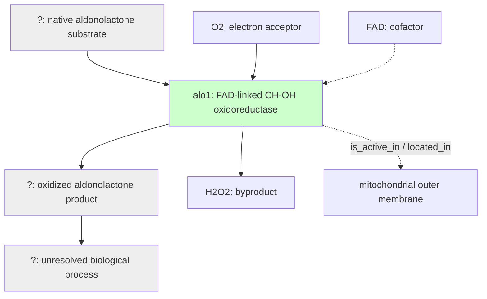

# Pathway Summary for alo1

## Overview

S. pombe alo1 is best treated as a predicted mitochondrial, FAD-linked
aldonolactone oxidoreductase whose exact substrate and pathway are unresolved.
The current positive molecular-function annotations support a broad
oxygen-dependent activity on CH-OH donors, while PomBase negates the exact
budding-yeast D-arabinono-1,4-lactone oxidase activity and the corresponding
D-erythroascorbate biosynthetic process.

## Predicted Aldonolactone Oxidation

The supported enzymatic model is FAD-dependent oxidation of an aldonolactone
substrate with oxygen as the electron acceptor. InterPro, ARBA, and PomBase all
support oxidoreductase activity, but the current annotations stop at either
`GO:0016491 oxidoreductase activity` or `GO:0016899 oxidoreductase activity,
acting on the CH-OH group of donors, oxygen as acceptor`. That scope should be
preserved until direct fission-yeast biochemistry identifies the native
substrate.

## Mitochondrial Membrane Context

alo1 is linked to mitochondria by two independent annotation paths. A PomBase HDA
row places alo1 in the fission-yeast mitochondrion from the ORFeome localization
study, and PomBase also transfers mitochondrial outer-membrane localization from
the budding-yeast ortholog. The cached ORFeome abstract describes localization
coverage for 4,431 proteins, approximately 90% of the fission-yeast proteome
[PMID:16823372].

## Pathway Diagram

```mermaid
graph TD
    A["?: native aldonolactone substrate"] --> B["alo1: FAD-linked CH-OH oxidoreductase"]
    C["O2: electron acceptor"] --> B
    D["FAD: cofactor"] -.-> B

    B --> E["?: oxidized aldonolactone product"]
    B --> F["H2O2: byproduct"]

    B -. "is_active_in / located_in" .-> G["mitochondrial outer membrane"]

    E --> H["?: unresolved biological process"]

    style B fill:#ccffcc
    style A fill:#eeeeee
    style E fill:#eeeeee
    style H fill:#eeeeee
```

## Open Pathway Questions

Direct S. pombe experiments are needed to identify the aldonolactone substrate,
the product, and the biological process in which alo1 acts. Current PAINT and
PomBase curation both argue against reusing the exact budding-yeast
D-erythroascorbate biosynthesis assertion for this target without such evidence.
