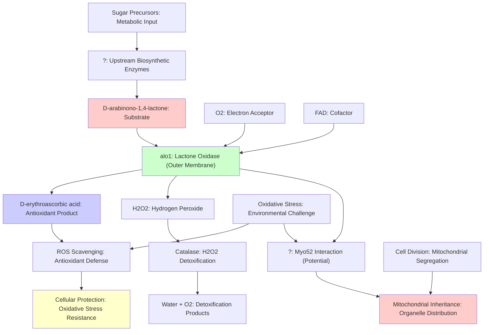

# Pathway Summary for alo1

## Overview

alo1 encodes a D-arabinono-1,4-lactone oxidase that catalyzes the terminal step in fungal D-erythroascorbic acid biosynthesis, a 5-carbon analog of vitamin C that serves as an important antioxidant in S. pombe. This mitochondrial outer membrane-anchored flavoprotein uses molecular oxygen to oxidize D-arabinono-1,4-lactone, producing D-erythroascorbic acid and hydrogen peroxide [file:pombe/alo1/alo1-deep-research.md]. The enzyme plays a critical role in cellular antioxidant defense, with deletion mutants showing hypersensitivity to oxidative stress, and recent evidence suggests potential moonlighting functions in mitochondrial inheritance during stress conditions.

## D-Erythroascorbic Acid Biosynthetic Pathway

The primary pathway mediated by alo1 is the terminal step of D-erythroascorbic acid (EASC) biosynthesis in fungi. Alo1 catalyzes the FAD-dependent oxidation of D-arabinono-1,4-lactone using molecular oxygen as the electron acceptor, producing D-erythroascorbic acid and hydrogen peroxide [file:pombe/alo1/alo1-deep-research.md]. This reaction represents the culmination of a multi-step biosynthetic pathway that converts simple sugar precursors into the fungal vitamin C analog. The enzyme contains a covalently bound FAD cofactor essential for its oxidase activity and shows high specificity for its arabinono-lactone substrate.

## Antioxidant Defense Network

D-erythroascorbic acid produced by alo1 functions as a key component of the cellular antioxidant defense system in S. pombe. This 5-carbon ascorbic acid analog serves as a reducing agent that can scavenge reactive oxygen species and protect cellular components from oxidative damage [PMID:10094636]. The antioxidant capacity of EASC is particularly important during oxidative stress conditions, where elevated ROS levels could damage proteins, lipids, and nucleic acids. The alo1 deletion mutants' hypersensitivity to oxidative stress demonstrates the critical role of this pathway in maintaining cellular redox homeostasis.

## Mitochondrial Outer Membrane Integration

alo1 is anchored to the mitochondrial outer membrane, positioning it at a strategic location for both EASC production and potential interactions with other mitochondrial processes [file:pombe/alo1/alo1-deep-research-alt.md]. This localization places the enzyme at the interface between cytoplasmic and mitochondrial metabolism, allowing it to contribute to both compartments' antioxidant defenses. The membrane association may also facilitate the enzyme's recently discovered potential moonlighting function in mitochondrial inheritance, similar to its S. cerevisiae ortholog's interaction with the myosin motor Myo2 [PMID:39775849].

## Potential Mitochondrial Inheritance Pathway

Recent studies in S. cerevisiae have revealed that ALO1 has a moonlighting function where it binds the myosin V motor Myo2 and aids in mitochondrial inheritance during cell division, particularly under oxidative stress conditions [PMID:39775849]. While this role remains to be confirmed in S. pombe, the conservation of alo1 function and mitochondrial localization suggests it may similarly interact with the S. pombe myosin V homolog Myo52 to facilitate proper mitochondrial distribution. This potential dual function would link antioxidant production with organelle inheritance mechanisms.

## Pathway Diagram

## Integration with Oxidative Stress Response

The alo1-mediated EASC biosynthetic pathway integrates with the broader oxidative stress response network in S. pombe. The antioxidant capacity provided by D-erythroascorbic acid complements other cellular antioxidant systems including glutathione, catalase, and superoxide dismutase. During oxidative stress conditions, the production of EASC by alo1 becomes particularly critical for cell survival, as evidenced by the oxidative stress sensitivity of alo1 deletion mutants. This positions alo1 as an essential component of the stress response machinery.

## Metabolic Connections and Regulation

The substrate for alo1, D-arabinono-1,4-lactone, is produced through a multi-step biosynthetic pathway that connects to central carbohydrate metabolism. The regulation of alo1 expression and activity may be linked to cellular energy status, oxidative stress levels, and metabolic demands for antioxidant production. The enzyme's requirement for molecular oxygen also creates a connection to cellular respiration and oxygen availability, potentially making it sensitive to hypoxic conditions.

## Evolutionary Conservation and Fungal-Specific Function

The alo1 enzyme and D-erythroascorbic acid biosynthetic pathway represent a fungal-specific adaptation for antioxidant defense that differs from the L-ascorbic acid (vitamin C) synthesis found in plants and some animals. This evolutionary divergence highlights how different organisms have evolved distinct strategies for producing reducing equivalents to combat oxidative stress. The conservation of alo1 across fungal species indicates the importance of this antioxidant system for fungal survival and success in diverse environments.

## Research and Biotechnological Implications

Understanding the alo1 pathway has implications for both basic research into antioxidant mechanisms and potential biotechnological applications. The enzyme's role in producing a vitamin C analog could be exploited for biotechnological production of antioxidant compounds. Additionally, the potential moonlighting function in mitochondrial inheritance opens new avenues for understanding how cells coordinate metabolic enzyme function with organelle distribution during cell division.