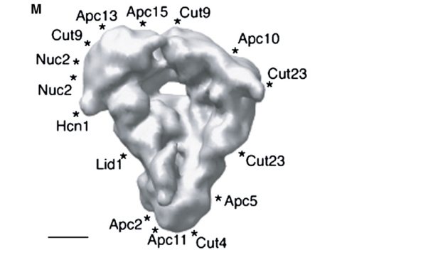

## Question

# Gene Research for Functional Annotation

## ⚠️ CRITICAL: Gene/Protein Identification Context

**BEFORE YOU BEGIN RESEARCH:** You MUST verify you are researching the CORRECT gene/protein. Gene symbols can be ambiguous, especially for less well-characterized genes from non-model organisms.

### Target Gene/Protein Identity (from UniProt):
- **UniProt Accession:** Q874R3
- **Protein Description:** RecName: Full=Anaphase-promoting complex subunit 2; AltName: Full=20S cyclosome/APC complex protein apc2;
- **Gene Information:** Name=apc2; ORFNames=SPBP23A10.04;
- **Organism (full):** Schizosaccharomyces pombe (strain 972 / ATCC 24843) (Fission yeast).
- **Protein Family:** Belongs to the cullin family. {ECO:0000255|PROSITE-
- **Key Domains:** ANAPC2. (IPR044554); ANAPC2_C. (IPR014786); Cullin-like_AB. (IPR059120); Cullin_homology. (IPR016158); Cullin_homology_sf. (IPR036317)

### MANDATORY VERIFICATION STEPS:

1. **Check if the gene symbol "apc2" matches the protein description above**
2. **Verify the organism is correct:** Schizosaccharomyces pombe (strain 972 / ATCC 24843) (Fission yeast).
3. **Check if protein family/domains align with what you find in literature**
4. **If you find literature for a DIFFERENT gene with the same or similar symbol, STOP**

### If Gene Symbol is Ambiguous or You Cannot Find Relevant Literature:

**DO NOT PROCEED WITH RESEARCH ON A DIFFERENT GENE.** Instead:
- State clearly: "The gene symbol 'apc2' is ambiguous or literature is limited for this specific protein"
- Explain what you found (e.g., "Found extensive literature on a different gene with the same symbol in a different organism")
- Describe the protein based ONLY on the UniProt information provided above
- Suggest that the protein function can be inferred from domain/family information

### Research Target:

Please provide a comprehensive research report on the gene **apc2** (gene ID: apc2, UniProt: Q874R3) in SCHPO.

The research report should be a detailed narrative explaining the function, biological processes, and localization of the gene product. Citations should be given for all claims.

You should prioritize authoritative reviews and primary scientific literature when conducting research. You can supplement
this with annotations you find in gene/protein databases, but these can be outdated or inaccurate.

We are specifically interested in the primary function of the gene - for enzymes, what reaction is catalyzed, and what is the substrate specificity? For transporters, what is the substrate? For structural proteins or adapters, what is the broader structural role? For signaling molecules, what is the role in the pathway.

We are interested in where in or outside the cell the gene product carries out its function.

We are also interested in the signaling or biochemical pathways in which the gene functions. We are less interested in broad pleiotropic effects, except where these elucidate the precise role.

Include evidence where possible. We are interested in both experimental evidence as well as inference from structure, evolution, or bioinformatic analysis. Precise studies should be prioritized over high-throughput, where available.

## Output

Question: You are an expert researcher providing comprehensive, well-cited information.

Provide detailed information focusing on:
1. Key concepts and definitions with current understanding
2. Recent developments and latest research (prioritize 2023-2024 sources)
3. Current applications and real-world implementations
4. Expert opinions and analysis from authoritative sources
5. Relevant statistics and data from recent studies

Format as a comprehensive research report with proper citations. Include URLs and publication dates where available.
Always prioritize recent, authoritative sources and provide specific citations for all major claims.

# Gene Research for Functional Annotation

## ⚠️ CRITICAL: Gene/Protein Identification Context

**BEFORE YOU BEGIN RESEARCH:** You MUST verify you are researching the CORRECT gene/protein. Gene symbols can be ambiguous, especially for less well-characterized genes from non-model organisms.

### Target Gene/Protein Identity (from UniProt):
- **UniProt Accession:** Q874R3
- **Protein Description:** RecName: Full=Anaphase-promoting complex subunit 2; AltName: Full=20S cyclosome/APC complex protein apc2;
- **Gene Information:** Name=apc2; ORFNames=SPBP23A10.04;
- **Organism (full):** Schizosaccharomyces pombe (strain 972 / ATCC 24843) (Fission yeast).
- **Protein Family:** Belongs to the cullin family. {ECO:0000255|PROSITE-
- **Key Domains:** ANAPC2. (IPR044554); ANAPC2_C. (IPR014786); Cullin-like_AB. (IPR059120); Cullin_homology. (IPR016158); Cullin_homology_sf. (IPR036317)

### MANDATORY VERIFICATION STEPS:

1. **Check if the gene symbol "apc2" matches the protein description above**
2. **Verify the organism is correct:** Schizosaccharomyces pombe (strain 972 / ATCC 24843) (Fission yeast).
3. **Check if protein family/domains align with what you find in literature**
4. **If you find literature for a DIFFERENT gene with the same or similar symbol, STOP**

### If Gene Symbol is Ambiguous or You Cannot Find Relevant Literature:

**DO NOT PROCEED WITH RESEARCH ON A DIFFERENT GENE.** Instead:
- State clearly: "The gene symbol 'apc2' is ambiguous or literature is limited for this specific protein"
- Explain what you found (e.g., "Found extensive literature on a different gene with the same symbol in a different organism")
- Describe the protein based ONLY on the UniProt information provided above
- Suggest that the protein function can be inferred from domain/family information

### Research Target:

Please provide a comprehensive research report on the gene **apc2** (gene ID: apc2, UniProt: Q874R3) in SCHPO.

The research report should be a detailed narrative explaining the function, biological processes, and localization of the gene product. Citations should be given for all claims.

You should prioritize authoritative reviews and primary scientific literature when conducting research. You can supplement
this with annotations you find in gene/protein databases, but these can be outdated or inaccurate.

We are specifically interested in the primary function of the gene - for enzymes, what reaction is catalyzed, and what is the substrate specificity? For transporters, what is the substrate? For structural proteins or adapters, what is the broader structural role? For signaling molecules, what is the role in the pathway.

We are interested in where in or outside the cell the gene product carries out its function.

We are also interested in the signaling or biochemical pathways in which the gene functions. We are less interested in broad pleiotropic effects, except where these elucidate the precise role.

Include evidence where possible. We are interested in both experimental evidence as well as inference from structure, evolution, or bioinformatic analysis. Precise studies should be prioritized over high-throughput, where available.

# Functional annotation report: *Schizosaccharomyces pombe apc2* (UniProt Q874R3)

## Executive summary

The requested target is correctly identified as **Apc2, the anaphase-promoting complex/cyclosome subunit 2 encoded by ORF SPBP23A10.04 in *Schizosaccharomyces pombe***. Genome homology originally identified SPBP23A10.04 as the fission-yeast Apc2 ortholog, and species-specific affinity-purification mass spectrometry recovered the approximately 81-kDa protein with 19 and 24 unique peptides in two independent APC/C preparations. This firmly distinguishes Q874R3 from unrelated proteins called “APC2” in other organisms or from the adenomatous-polyposis-coli gene nomenclature used in metazoans. (yoon2002proteomicsanalysisidentifies pages 2-4, yoon2002proteomicsanalysisidentifies pages 1-2)

Apc2 is **not a stand-alone enzyme or substrate receptor**. It is the cullin-family structural component of the APC/C catalytic module. Together with the RING-finger subunit Apc11, it organizes recruitment and positioning of ubiquitin-loaded E2 enzymes so that the complete APC/C can ubiquitylate cell-cycle regulators. Substrate selection and timing are supplied principally by the holoenzyme, its coactivators—Slp1/Cdc20 in mitosis and Ste9/Cdh1 in G1—and degron-bearing substrates, rather than by Apc2 itself. (ors2009thetranscriptionfactor pages 1-2, ohi2007structuralorganizationof pages 1-2, tang2001apc2cullinprotein pages 1-2)

The principal physiological outputs are APC/C-dependent ubiquitylation and proteasomal destruction of **securin and mitotic cyclin B**. Securin destruction activates separase and sister-chromatid separation; cyclin-B destruction lowers Cdk activity and permits mitotic exit. Thus, the most defensible primary annotation is: **a nonenzymatic cullin-like scaffold of the APC/C RING E3 ubiquitin ligase catalytic core, required for regulated proteolysis during the metaphase–anaphase transition and mitotic exit**. (ors2009thetranscriptionfactor pages 1-2, ohi2007structuralorganizationof pages 1-2, tang2001apc2cullinprotein pages 1-2)

## 1. Mandatory identity and domain verification

### Identity

- **Gene:** *apc2*
- **ORF:** SPBP23A10.04
- **UniProt:** Q874R3
- **Organism:** *Schizosaccharomyces pombe*, corresponding to the fission-yeast reference background specified by the user
- **Protein:** anaphase-promoting complex subunit 2; 20S cyclosome/APC component Apc2

The strongest direct identity evidence is the recovery of SPBP23A10.04/Apc2 from purified *S. pombe* APC/C. Apc2 yielded 19 unique tryptic peptides in a Lid1-TAP preparation and 24 in an independent Apc13-TAP preparation. These results verify both the protein assignment and physical membership in the fission-yeast APC/C. [Yoon et al., *Current Biology*, 10 December 2002, DOI/URL: https://doi.org/10.1016/S0960-9822(02)01331-3]. (yoon2002proteomicsanalysisidentifies pages 2-4)

### Family and domains

The literature identifies Apc2 as a **cullin-repeat/cullin-domain protein**, consistent with the supplied InterPro annotations ANAPC2, ANAPC2_C, Cullin-like_AB, Cullin_homology, and Cullin_homology_sf. The accompanying RING-finger protein is Apc11. This cullin–RING arrangement is analogous in general organization—not necessarily in every regulatory detail—to the cullin–RING catalytic architecture of SCF-family E3 ligases. (ors2009thetranscriptionfactor pages 1-2, ohi2007structuralorganizationof pages 1-2, tang2001apc2cullinprotein pages 1-2)

Accordingly, no conflicting family or domain evidence was found. Literature concerning plant, animal, budding-yeast, or parasite APC2 proteins was used only for explicitly labeled comparative inference and not as direct evidence about Q874R3.

| Annotation claim | Evidence type | Species | Key finding | Confidence / interpretation |
|---|---|---|---|---|
| **Identity: Apc2 = SPBP23A10.04; ~81 kDa** | Genome homology plus APC/C affinity purification–mass spectrometry | *S. pombe* | SPBP23A10.04 was identified as the Apc2 homolog; Apc2 was recovered from Lid1-TAP and Apc13-TAP APC/C preparations with **19 and 24 unique tryptic peptides**, respectively. (yoon2002proteomicsanalysisidentifies pages 2-4, yoon2002proteomicsanalysisidentifies pages 1-2) | **High—direct species-specific identity and complex-membership evidence.** The supplied UniProt accession Q874R3 is consistent with this target; this is not a same-symbol protein from another organism. |
| **One-copy core APC/C subunit** | Differential epitope tagging, co-immunoprecipitation, stoichiometric analysis, and cryo-EM sample composition | *S. pombe* | Apc2 did not self-co-immunoprecipitate in double-tagged strains, indicating **one Apc2 copy per APC/C particle**; all 13 core subunits were detected in purified mitotic APC/C. (ohi2007structuralorganizationof pages 4-6, ohi2007structuralorganizationof pages 1-2) | **High—direct species-specific biochemical evidence.** |
| **Cullin-domain component paired with Apc11 in the catalytic module** | Sequence/domain assignment and biochemical/structural organization | *S. pombe* plus conserved APC/C evidence | Apc2 is the cullin-repeat/domain subunit; Apc2, the RING-finger protein Apc11, and Apc10 form the catalytic-region subcomplex. The Apc2–Apc11 pair supplies ligase capacity, while full substrate specificity requires the larger APC/C and activators. (ors2009thetranscriptionfactor pages 1-2, ohi2007structuralorganizationof pages 1-2, ohi2007structuralorganizationof pages 10-12) | **High for cullin-family identity and APC/C structural role; moderate for molecular details inferred from conserved systems.** |
| **Position on the right/lower catalytic side near Apc11** | Single-particle cryo-EM, antibody labeling, mutant difference mapping | *S. pombe* | The **27 Å** APC/C–Slp1 map places the Apc2–Apc11–Apc10 catalytic region along the complex’s right/lower side; Apc11 and Slp1 lie near the cavity lip/horn. The particle measures about **19 × 17 × 15 nm**. (ohi2007structuralorganizationof pages 9-10, ohi2007structuralorganizationof pages 10-12, ohi2007structuralorganizationof pages 4-6, ohi2007structuralorganizationof media 0cf42430) | **Moderate-to-high—direct species-specific localization at subunit-region, not residue/atomic, resolution.** |
| **Pathway output: securin and cyclin-B ubiquitylation/degradation** | Functional assays of purified intact APC/C and established cell-cycle pathway evidence | *S. pombe* | Purified APC/C showed E1-, E2-, ATP-dependent ubiquitylation activity; intact APC/C targets securin and mitotic cyclin B, thereby enabling sister-chromatid separation and mitotic exit. Two fission-yeast E2s, Ubc4 and Ubc11, support different aspects of cyclin-B ubiquitylation. (yoon2002proteomicsanalysisidentifies pages 2-4, ors2009thetranscriptionfactor pages 1-2, ohi2007structuralorganizationof pages 2-4, ohi2007structuralorganizationof pages 1-2) | **High for the intact APC/C pathway; not evidence that isolated Apc2 recognizes substrates or catalyzes a stand-alone reaction.** |
| **APC2/APC11 is a minimal ubiquitin-ligase module** | Recombinant reconstitution, binding assays, truncation analysis, and ubiquitylation assays | Human proteins / *Xenopus* extracts | Recombinant APC2–APC11 ubiquitylated securin and cyclin B1 with Ubc4 or UbcH10 but lacked degron specificity. APC11 and UbcH10 bound the APC2 C-terminal cullin-homology region; APC2 residues 549–822 were sufficient for these interactions. (tang2001apc2cullinprotein pages 1-2, tang2001apc2cullinprotein pages 6-7) | **Strong conserved-mechanism inference, not direct Q874R3 biochemistry.** Supports Apc2 as a nonenzymatic cullin scaffold positioning Apc11/E2 rather than a substrate-selective enzyme. |
| **APC2 zinc-binding module reported in 2024** | High-resolution cryo-EM, PIXE metal analysis, mutagenesis, and stability assays | Human | Human APC2 has a zinc module coordinated by Cys221/Cys224/Cys231/Cys233; 2.9 Å and 3.2 Å structures and metal/stability experiments support a structural-stabilization role. The module was absent from budding-yeast APC2 in the reported comparison. (barford2023newstructuralfeatures pages 5-7, hofler2024newstructuralfeatures pages 17-19, hofler2024cryoemstructuresof pages 1-3) | **Not established in *S. pombe*.** It must not be assigned to Q874R3 without sequence conservation and species-specific structural or biochemical validation. |

*Table: Evidence supporting functional annotation of fission-yeast Apc2 (Q874R3), separated from conserved mechanistic inference and human-specific findings. Confidence reflects both experimental directness and species relevance.*

## 2. Molecular function and biochemical mechanism

### Primary structural role

Apc2 serves as the **cullin-like platform of the APC/C catalytic region**. Its role is to organize Apc11 and the E2–ubiquitin machinery relative to substrates recruited by other APC/C components. It should therefore be annotated as a structural/catalytic-core adaptor rather than as an enzyme with an independently measurable substrate-binding specificity. (ohi2007structuralorganizationof pages 1-2, ohi2007structuralorganizationof pages 10-12)

In purified mitotic *S. pombe* APC/C, Apc2 occurs at approximately **one copy per particle**: unlike the duplicated TPR proteins Cut9, Cut23, and Nuc2, differently tagged Apc2 molecules did not self-coimmunoprecipitate. The inferred holoenzyme contained two copies of each of those three TPR proteins but one copy of each remaining tested subunit, with a predicted mass of 986 kDa including Slp1, close to the STEM estimate of 890 ± 133 kDa. [Ohi et al., *Molecular Cell*, 14 December 2007, DOI/URL: https://doi.org/10.1016/j.molcel.2007.10.003]. (ohi2007structuralorganizationof pages 4-6)

### Reaction carried out by the APC/C

As part of the holoenzyme, Apc2 supports the RING-E3 reaction:

**E2–ubiquitin + substrate → E2 + ubiquitylated substrate**, followed through repeated cycles by formation of proteasome-directed ubiquitin chains.

Apc2 itself is not known to form a catalytic covalent intermediate. Apc11 supplies the RING element that activates or positions the E2–ubiquitin conjugate; Apc2 supplies the cullin-like scaffold. In fission yeast, Ubc4 and Ubc11 contribute to different aspects of cyclin-B ubiquitylation. Purified *S. pombe* APC/C displayed E1-, E2-, ATP-dependent ubiquitylation activity, establishing activity of the intact complex but not of isolated Q874R3. (yoon2002proteomicsanalysisidentifies pages 2-4, ohi2007structuralorganizationof pages 2-4, ohi2007structuralorganizationof pages 1-2)

### Conserved biochemical evidence—and its limits

Reconstitution with **human**, rather than fission-yeast, proteins showed that an APC2–APC11 heterodimer can ubiquitylate securin and cyclin B1 with Ubc4 or UbcH10. However, it also modified destruction-box-deleted substrates, demonstrating that the minimal module lacks physiological degron specificity. APC11 and UbcH10 associated with the APC2 C-terminal cullin-homology region; an APC2 fragment spanning residues 549–822 was sufficient for these interactions in that human system. [Tang et al., *Molecular Biology of the Cell*, December 2001, DOI/URL: https://doi.org/10.1091/mbc.12.12.3839]. (tang2001apc2cullinprotein pages 1-2, tang2001apc2cullinprotein pages 6-7)

This is strong support for the conserved mechanistic interpretation of Q874R3, but the human residue numbers and precise interfaces must not be transferred directly to *S. pombe* without alignment or species-specific structural validation.

### Substrate specificity

Apc2 has **no established autonomous substrate specificity**. Physiological specificity arises from the assembled APC/C and coactivators recognizing degrons such as destruction boxes and KEN boxes. Slp1/Cdc20 is the mitotic coactivator in *S. pombe*, whereas Ste9 is the Cdh1-related regulator important during G1 and mating-related arrest. (ohi2007structuralorganizationof pages 1-2)

The key physiological substrate classes are:

1. **Securin**, whose degradation releases separase and permits cohesin cleavage and sister-chromatid separation.
2. **Mitotic cyclin B**, whose degradation lowers cyclin-dependent kinase activity and enables mitotic exit.

These are substrates of APC/C–coactivator assemblies, not substrates recognized by isolated Apc2. (ors2009thetranscriptionfactor pages 1-2, ohi2007structuralorganizationof pages 1-2, tang2001apc2cullinprotein pages 1-2)

## 3. Structural organization and localization

### Position within the APC/C

Single-particle cryo-EM of active *S. pombe* APC/C–Slp1 produced a **27 Å** reconstruction of an asymmetric, tricorn-shaped particle approximately **19 × 17 × 15 nm**, with an **11.5 × 9.5 × 6.5 nm** central cavity. The reconstructed complex was contoured to approximately 980 kDa. Mapping placed the Apc2–Apc11–Apc10 catalytic region along the right/lower side of the complex, with Apc11 near the cavity lip and Slp1 near the lower horn-like region. (ohi2007structuralorganizationof pages 4-6, ohi2007structuralorganizationof pages 9-10, ohi2007structuralorganizationof pages 10-12)

The mapped cryo-EM model directly shows the Apc2 C-terminal position adjacent to Apc11 in the lower catalytic region. Because the map is low resolution, it establishes regional placement, not an atomic Apc2 fold or residue-level interface. (ohi2007structuralorganizationof media 0cf42430)

Slp1 was localized independently by difference mapping and antibody labeling near the lower corner and Apc11. Its proximity is consistent with a geometry in which activator-bound substrate is presented to the Apc2–Apc11/E2 catalytic machinery. (ohi2007structuralorganizationof pages 7-9, ohi2007structuralorganizationof media 9891b18a)

### Cellular localization

The strongest available localization evidence concerns Apc2’s **position inside the soluble macromolecular APC/C**, not a comprehensive microscopy-derived cellular localization map for Q874R3. The purified mitotic complex contains Slp1 and is active during chromosome segregation; APC/C function therefore occurs in the intracellular mitotic compartment where it encounters spindle/checkpoint-associated regulators and nuclear cell-cycle substrates. Nevertheless, a precise statement such as “exclusively nuclear,” “kinetochore-localized,” or “spindle-localized” is not justified for Apc2 itself from the retrieved species-specific evidence.

The conservative annotation is therefore: **intracellular APC/C component, functioning in the mitotic/nuclear cell-cycle environment; exact standalone Apc2 localization is insufficiently resolved**.

## 4. Biological processes and pathway placement

Apc2 belongs to the **ubiquitin–proteasome arm of cell-cycle control**. The pathway can be summarized as follows:

1. Chromosome attachment is monitored by the spindle-assembly checkpoint.
2. Once checkpoint conditions are satisfied, Slp1/Cdc20 activates and helps specify mitotic APC/C substrates.
3. The Apc2–Apc11 catalytic region engages E2–ubiquitin.
4. The holoenzyme polyubiquitylates securin and cyclin B.
5. The 26S proteasome degrades these substrates.
6. Separase activation initiates sister-chromatid separation, while cyclin-B loss promotes mitotic exit. (ohi2007structuralorganizationof pages 1-2, tang2001apc2cullinprotein pages 1-2)

The APC/C remains subject to spindle-checkpoint regulation through Slp1/Cdc20. Direct structural work found Slp1 near Apc11, while fission-yeast studies show that checkpoint proteins Mad2 and Mad3 stably interact with mitotic Cdc20–APC/C. This regulatory connection applies to the APC/C assembly; it does not imply that Apc2 is itself the checkpoint receptor. (ohi2007structuralorganizationof pages 7-9, ohi2007structuralorganizationof pages 1-2)

An additional fission-yeast regulatory observation is that Atf1 physically associates with APC/C and can stimulate APC/C-dependent cyclin-B and securin ubiquitylation in a cell-free system. This broadens regulation of the complex but does not change Apc2’s primary assignment as its cullin scaffold. [Ors et al., *Journal of Biological Chemistry*, 4 September 2009, DOI/URL: https://doi.org/10.1074/jbc.M109.018309]. (ors2009thetranscriptionfactor pages 1-2)

## 5. Recent developments, 2023–2024

No 2023–2024 study retrieved here directly re-characterized *S. pombe* Q874R3. Consequently, the best direct evidence remains the older fission-yeast proteomic and structural literature. Recent high-resolution work nevertheless refines the broader APC2 mechanistic framework.

Höfler and colleagues reported human apo-APC/C and APC/C–CDH1–EMI1 structures at **3.2 Å and 2.9 Å**, respectively. They resolved a previously unrecognized human APC2 zinc-binding module and experimentally confirmed zinc. Human residues Cys221, Cys224, Cys231, and Cys233 coordinate the ion, and mutational/stability experiments support a structural-stabilization role. [Höfler et al., *Nature Communications*, November 2024, DOI/URL: https://doi.org/10.1038/s41467-024-54398-5]. (barford2023newstructuralfeatures pages 5-7, hofler2024newstructuralfeatures pages 17-19, hofler2024cryoemstructuresof pages 1-3)

This is **not presently an annotation for Q874R3**. The reported conservation analysis was metazoan-focused, and the module was absent from budding-yeast APC2; no equivalent sequence, metal measurement, or structure was demonstrated for *S. pombe*. The appropriate conclusion is that a possible zinc-stabilized feature in fission-yeast Apc2 remains an open, testable hypothesis, not an established domain. (barford2023newstructuralfeatures pages 5-7, hofler2024cryoemstructuresof pages 1-3)

Recent APC/C research also emphasizes spatial regulation: a 2024 human-cell study found that APC/C and cyclin B1 interact primarily at the mitotic apparatus and that chromosome/nucleosome association accelerates cyclin-B1 degradation. This reinforces the concept that substrate encounter is organized by the holoenzyme and cellular context, but it must not be used to assign a specific localization mechanism to fission-yeast Apc2 without direct evidence. [Cirillo et al., *EMBO Journal*, August 2024, DOI/URL: https://doi.org/10.1038/s44318-024-00194-2].

## 6. Applications and real-world implementation

Apc2/Q874R3 has no known direct clinical, industrial, or transporter-like application. Its practical value is primarily as:

- a **model-system component** for dissecting cullin–RING E3-ligase architecture;
- an experimental handle for studying APC/C assembly, substrate ordering, checkpoint control, and irreversible cell-cycle transitions;
- a comparative model for understanding the homologous human APC/C, whose dysregulation is relevant to chromosome instability and cancer biology.

These translational links concern conserved APC/C biology rather than a validated application of the fission-yeast protein itself. Core-subunit perturbation is experimentally more informative than relying solely on Cdc20/Cdh1 perturbation because the coactivators can have APC/C-independent activities, as emphasized by recent mammalian work. [Day et al., *Frontiers in Molecular Neuroscience*, June 2024, DOI/URL: https://doi.org/10.3389/fnmol.2024.1352782].

## 7. Evidence-weighted annotation and knowledge gaps

### High-confidence annotation

**Apc2/Q874R3 is a one-copy, cullin-family core subunit of the *S. pombe* APC/C. It forms the structural platform of the Apc2–Apc11 catalytic region and enables E2-dependent ubiquitylation of cell-cycle regulators by the assembled complex. Through APC/C-mediated destruction of securin and mitotic cyclin B, it supports sister-chromatid separation and mitotic exit.** (yoon2002proteomicsanalysisidentifies pages 2-4, ors2009thetranscriptionfactor pages 1-2, ohi2007structuralorganizationof pages 9-10, ohi2007structuralorganizationof pages 1-2)

### Claims that should not be made

- Apc2 is not itself a demonstrated substrate-selective enzyme.
- No unique small-molecule or metabolite substrate applies.
- Human APC2 residue numbers, interaction surfaces, or the 2024 zinc-binding module should not be assigned directly to Q874R3.
- A precise exclusive cellular localization for Apc2 is not established by the retrieved evidence.
- APC/C-wide phenotypes should not automatically be attributed to a unique biochemical activity of Apc2.

### Priority experiments

The principal remaining needs are an endogenous fluorescent-localization analysis across the *S. pombe* cell cycle; conditional depletion or separation-of-function mutations of Q874R3; direct recombinant *S. pombe* Apc2–Apc11–E2 reconstitution; residue-level cryo-EM or AlphaFold-guided mutational validation; and explicit testing for conservation of the human APC2 zinc-binding module. These experiments would distinguish indispensable scaffolding contacts from regulatory or catalytic-interface contributions.

## Conclusion

The literature and supplied UniProt identity are concordant: **Q874R3 is the fission-yeast Apc2 cullin-like APC/C subunit encoded by SPBP23A10.04**. Its primary function is architectural and catalytic-core organization, not autonomous substrate recognition. It positions the Apc11 RING/E2 machinery within APC/C so that coactivator-selected substrates—especially securin and cyclin B—can be ubiquitylated and destroyed at the correct cell-cycle stage. Direct *S. pombe* proteomics, stoichiometry, enzymology, and cryo-EM strongly support this annotation; finer atomic mechanisms derive mainly from conserved human systems and must remain explicitly labeled as inference.

References

1. (yoon2002proteomicsanalysisidentifies pages 2-4): Hyun-Joo Yoon, Anna Feoktistova, Benjamin A. Wolfe, Jennifer L. Jennings, Andrew J. Link, and Kathleen L. Gould. Proteomics analysis identifies new components of the fission and budding yeast anaphase-promoting complexes. Current Biology, 12:2048-2054, Dec 2002. URL: https://doi.org/10.1016/s0960-9822(02)01331-3, doi:10.1016/s0960-9822(02)01331-3. This article has 137 citations and is from a highest quality peer-reviewed journal.

2. (yoon2002proteomicsanalysisidentifies pages 1-2): Hyun-Joo Yoon, Anna Feoktistova, Benjamin A. Wolfe, Jennifer L. Jennings, Andrew J. Link, and Kathleen L. Gould. Proteomics analysis identifies new components of the fission and budding yeast anaphase-promoting complexes. Current Biology, 12:2048-2054, Dec 2002. URL: https://doi.org/10.1016/s0960-9822(02)01331-3, doi:10.1016/s0960-9822(02)01331-3. This article has 137 citations and is from a highest quality peer-reviewed journal.

3. (ors2009thetranscriptionfactor pages 1-2): Aslihan Ors, Margaret Grimaldi, Yuu Kimata, Caroline R.M. Wilkinson, Nic Jones, and Hiroyuki Yamano. The transcription factor atf1 binds and activates the apc/c ubiquitin ligase in fission yeast. Journal of Biological Chemistry, 284:23989-23994, Sep 2009. URL: https://doi.org/10.1074/jbc.m109.018309, doi:10.1074/jbc.m109.018309. This article has 30 citations and is from a domain leading peer-reviewed journal.

4. (ohi2007structuralorganizationof pages 1-2): Melanie D. Ohi, Anna Feoktistova, Liping Ren, Calvin Yip, Yifan Cheng, Jun-Song Chen, Hyun-Joo Yoon, Joseph S. Wall, Zhong Huang, Pawel A. Penczek, Kathleen L. Gould, and Thomas Walz. Structural organization of the anaphase-promoting complex bound to the mitotic activator slp1. Molecular cell, 28 5:871-85, Dec 2007. URL: https://doi.org/10.1016/j.molcel.2007.10.003, doi:10.1016/j.molcel.2007.10.003. This article has 64 citations and is from a highest quality peer-reviewed journal.

5. (tang2001apc2cullinprotein pages 1-2): Zhanyun Tang, Bing Li, Rajnish Bharadwaj, Haizhen Zhu, Engin Özkan, Kevin Hakala, Johann Deisenhofer, and Hongtao Yu. Apc2 cullin protein and apc11 ring protein comprise the minimal ubiquitin ligase module of the anaphase-promoting complex. Molecular biology of the cell, 12 12:3839-51, Dec 2001. URL: https://doi.org/10.1091/mbc.12.12.3839, doi:10.1091/mbc.12.12.3839. This article has 253 citations and is from a domain leading peer-reviewed journal.

6. (ohi2007structuralorganizationof pages 4-6): Melanie D. Ohi, Anna Feoktistova, Liping Ren, Calvin Yip, Yifan Cheng, Jun-Song Chen, Hyun-Joo Yoon, Joseph S. Wall, Zhong Huang, Pawel A. Penczek, Kathleen L. Gould, and Thomas Walz. Structural organization of the anaphase-promoting complex bound to the mitotic activator slp1. Molecular cell, 28 5:871-85, Dec 2007. URL: https://doi.org/10.1016/j.molcel.2007.10.003, doi:10.1016/j.molcel.2007.10.003. This article has 64 citations and is from a highest quality peer-reviewed journal.

7. (ohi2007structuralorganizationof pages 10-12): Melanie D. Ohi, Anna Feoktistova, Liping Ren, Calvin Yip, Yifan Cheng, Jun-Song Chen, Hyun-Joo Yoon, Joseph S. Wall, Zhong Huang, Pawel A. Penczek, Kathleen L. Gould, and Thomas Walz. Structural organization of the anaphase-promoting complex bound to the mitotic activator slp1. Molecular cell, 28 5:871-85, Dec 2007. URL: https://doi.org/10.1016/j.molcel.2007.10.003, doi:10.1016/j.molcel.2007.10.003. This article has 64 citations and is from a highest quality peer-reviewed journal.

8. (ohi2007structuralorganizationof pages 9-10): Melanie D. Ohi, Anna Feoktistova, Liping Ren, Calvin Yip, Yifan Cheng, Jun-Song Chen, Hyun-Joo Yoon, Joseph S. Wall, Zhong Huang, Pawel A. Penczek, Kathleen L. Gould, and Thomas Walz. Structural organization of the anaphase-promoting complex bound to the mitotic activator slp1. Molecular cell, 28 5:871-85, Dec 2007. URL: https://doi.org/10.1016/j.molcel.2007.10.003, doi:10.1016/j.molcel.2007.10.003. This article has 64 citations and is from a highest quality peer-reviewed journal.

9. (ohi2007structuralorganizationof media 0cf42430): Melanie D. Ohi, Anna Feoktistova, Liping Ren, Calvin Yip, Yifan Cheng, Jun-Song Chen, Hyun-Joo Yoon, Joseph S. Wall, Zhong Huang, Pawel A. Penczek, Kathleen L. Gould, and Thomas Walz. Structural organization of the anaphase-promoting complex bound to the mitotic activator slp1. Molecular cell, 28 5:871-85, Dec 2007. URL: https://doi.org/10.1016/j.molcel.2007.10.003, doi:10.1016/j.molcel.2007.10.003. This article has 64 citations and is from a highest quality peer-reviewed journal.

10. (ohi2007structuralorganizationof pages 2-4): Melanie D. Ohi, Anna Feoktistova, Liping Ren, Calvin Yip, Yifan Cheng, Jun-Song Chen, Hyun-Joo Yoon, Joseph S. Wall, Zhong Huang, Pawel A. Penczek, Kathleen L. Gould, and Thomas Walz. Structural organization of the anaphase-promoting complex bound to the mitotic activator slp1. Molecular cell, 28 5:871-85, Dec 2007. URL: https://doi.org/10.1016/j.molcel.2007.10.003, doi:10.1016/j.molcel.2007.10.003. This article has 64 citations and is from a highest quality peer-reviewed journal.

11. (tang2001apc2cullinprotein pages 6-7): Zhanyun Tang, Bing Li, Rajnish Bharadwaj, Haizhen Zhu, Engin Özkan, Kevin Hakala, Johann Deisenhofer, and Hongtao Yu. Apc2 cullin protein and apc11 ring protein comprise the minimal ubiquitin ligase module of the anaphase-promoting complex. Molecular biology of the cell, 12 12:3839-51, Dec 2001. URL: https://doi.org/10.1091/mbc.12.12.3839, doi:10.1091/mbc.12.12.3839. This article has 253 citations and is from a domain leading peer-reviewed journal.

12. (barford2023newstructuralfeatures pages 5-7): David Barford, Anna Höfler, Jun Yu, Jing Yan, Ziguo Zhang, Leifu Chang, Geoffrey Grime, Elspeth Garman, and Andreas Boland. New structural features of the apc/c revealed by high resolution cryo-em structures of apo-apc/c and the apc/ccdh1:emi1 complex. Unknown journal, Sep 2023. URL: https://doi.org/10.21203/rs.3.rs-3312866/v1, doi:10.21203/rs.3.rs-3312866/v1.

13. (hofler2024newstructuralfeatures pages 17-19): Anna Höfler, Jun Yu, Jing Yang, Ziguo Zhang, L. Chang, Stephen H. McLaughlin, G. W. Grime, E. Garman, Andreas Boland, and David Barford. New structural features of the apc/c from high-resolution cryo-em structures of apo-apc/c and apc/ccdh1:emi1 complexes. bioRxiv, Nov 2024. URL: https://doi.org/10.1101/2023.08.31.555674, doi:10.1101/2023.08.31.555674. This article has 1 citations.

14. (hofler2024cryoemstructuresof pages 1-3): Anna Höfler, Jun Yu, Jing Yang, Ziguo Zhang, Leifu Chang, Stephen H. McLaughlin, Geoffrey W. Grime, Elspeth F. Garman, Andreas Boland, and David Barford. Cryo-em structures of apo-apc/c and apc/ccdh1:emi1 complexes provide insights into apc/c regulation. Nature Communications, Nov 2024. URL: https://doi.org/10.1038/s41467-024-54398-5, doi:10.1038/s41467-024-54398-5. This article has 13 citations and is from a highest quality peer-reviewed journal.

15. (ohi2007structuralorganizationof pages 7-9): Melanie D. Ohi, Anna Feoktistova, Liping Ren, Calvin Yip, Yifan Cheng, Jun-Song Chen, Hyun-Joo Yoon, Joseph S. Wall, Zhong Huang, Pawel A. Penczek, Kathleen L. Gould, and Thomas Walz. Structural organization of the anaphase-promoting complex bound to the mitotic activator slp1. Molecular cell, 28 5:871-85, Dec 2007. URL: https://doi.org/10.1016/j.molcel.2007.10.003, doi:10.1016/j.molcel.2007.10.003. This article has 64 citations and is from a highest quality peer-reviewed journal.

16. (ohi2007structuralorganizationof media 9891b18a): Melanie D. Ohi, Anna Feoktistova, Liping Ren, Calvin Yip, Yifan Cheng, Jun-Song Chen, Hyun-Joo Yoon, Joseph S. Wall, Zhong Huang, Pawel A. Penczek, Kathleen L. Gould, and Thomas Walz. Structural organization of the anaphase-promoting complex bound to the mitotic activator slp1. Molecular cell, 28 5:871-85, Dec 2007. URL: https://doi.org/10.1016/j.molcel.2007.10.003, doi:10.1016/j.molcel.2007.10.003. This article has 64 citations and is from a highest quality peer-reviewed journal.

## Artifacts

- [Edison artifact artifact-00](apc2-deep-research-falcon_artifacts/artifact-00.md)

## Citations

1. yoon2002proteomicsanalysisidentifies pages 2-4
2. ohi2007structuralorganizationof pages 4-6
3. ohi2007structuralorganizationof pages 1-2
4. ors2009thetranscriptionfactor pages 1-2
5. yoon2002proteomicsanalysisidentifies pages 1-2
6. ohi2007structuralorganizationof pages 10-12
7. ohi2007structuralorganizationof pages 9-10
8. ohi2007structuralorganizationof pages 2-4
9. barford2023newstructuralfeatures pages 5-7
10. hofler2024newstructuralfeatures pages 17-19
11. hofler2024cryoemstructuresof pages 1-3
12. ohi2007structuralorganizationof pages 7-9
13. Yoon et al., *Current Biology*, 10 December 2002, DOI/URL: https://doi.org/10.1016/S0960-9822(02)01331-3
14. Ohi et al., *Molecular Cell*, 14 December 2007, DOI/URL: https://doi.org/10.1016/j.molcel.2007.10.003
15. Tang et al., *Molecular Biology of the Cell*, December 2001, DOI/URL: https://doi.org/10.1091/mbc.12.12.3839
16. Ors et al., *Journal of Biological Chemistry*, 4 September 2009, DOI/URL: https://doi.org/10.1074/jbc.M109.018309
17. Höfler et al., *Nature Communications*, November 2024, DOI/URL: https://doi.org/10.1038/s41467-024-54398-5
18. Cirillo et al., *EMBO Journal*, August 2024, DOI/URL: https://doi.org/10.1038/s44318-024-00194-2
19. Day et al., *Frontiers in Molecular Neuroscience*, June 2024, DOI/URL: https://doi.org/10.3389/fnmol.2024.1352782
20. https://doi.org/10.1016/S0960-9822(02
21. https://doi.org/10.1016/j.molcel.2007.10.003].
22. https://doi.org/10.1091/mbc.12.12.3839].
23. https://doi.org/10.1074/jbc.M109.018309].
24. https://doi.org/10.1038/s41467-024-54398-5].
25. https://doi.org/10.1038/s44318-024-00194-2].
26. https://doi.org/10.3389/fnmol.2024.1352782].
27. https://doi.org/10.1016/s0960-9822(02
28. https://doi.org/10.1074/jbc.m109.018309,
29. https://doi.org/10.1016/j.molcel.2007.10.003,
30. https://doi.org/10.1091/mbc.12.12.3839,
31. https://doi.org/10.21203/rs.3.rs-3312866/v1,
32. https://doi.org/10.1101/2023.08.31.555674,
33. https://doi.org/10.1038/s41467-024-54398-5,