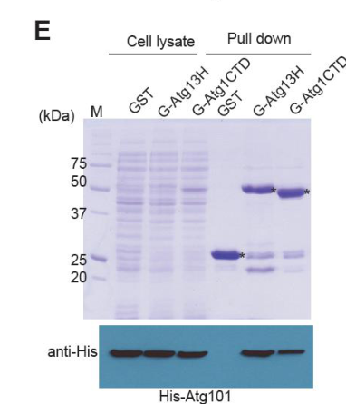

## Question

# Gene Research for Functional Annotation

## ⚠️ CRITICAL: Gene/Protein Identification Context

**BEFORE YOU BEGIN RESEARCH:** You MUST verify you are researching the CORRECT gene/protein. Gene symbols can be ambiguous, especially for less well-characterized genes from non-model organisms.

### Target Gene/Protein Identity (from UniProt):
- **UniProt Accession:** O13978
- **Protein Description:** RecName: Full=Autophagy-related protein 101 {ECO:0000303|PubMed:23950735}; AltName: Full=Meiotically up-regulated gene protein 66 {ECO:0000303|PubMed:16303567};
- **Gene Information:** Name=atg101 {ECO:0000303|PubMed:23950735}; Synonyms=mug66 {ECO:0000303|PubMed:16303567}; ORFNames=SPAC25H1.03;
- **Organism (full):** Schizosaccharomyces pombe (strain 972 / ATCC 24843) (Fission yeast).
- **Protein Family:** Belongs to the ATG101 family. .
- **Key Domains:** ATG101. (IPR012445); ATG101 (PF07855)

### MANDATORY VERIFICATION STEPS:

1. **Check if the gene symbol "atg101" matches the protein description above**
2. **Verify the organism is correct:** Schizosaccharomyces pombe (strain 972 / ATCC 24843) (Fission yeast).
3. **Check if protein family/domains align with what you find in literature**
4. **If you find literature for a DIFFERENT gene with the same or similar symbol, STOP**

### If Gene Symbol is Ambiguous or You Cannot Find Relevant Literature:

**DO NOT PROCEED WITH RESEARCH ON A DIFFERENT GENE.** Instead:
- State clearly: "The gene symbol 'atg101' is ambiguous or literature is limited for this specific protein"
- Explain what you found (e.g., "Found extensive literature on a different gene with the same symbol in a different organism")
- Describe the protein based ONLY on the UniProt information provided above
- Suggest that the protein function can be inferred from domain/family information

### Research Target:

Please provide a comprehensive research report on the gene **atg101** (gene ID: atg101, UniProt: O13978) in SCHPO.

The research report should be a detailed narrative explaining the function, biological processes, and localization of the gene product. Citations should be given for all claims.

You should prioritize authoritative reviews and primary scientific literature when conducting research. You can supplement
this with annotations you find in gene/protein databases, but these can be outdated or inaccurate.

We are specifically interested in the primary function of the gene - for enzymes, what reaction is catalyzed, and what is the substrate specificity? For transporters, what is the substrate? For structural proteins or adapters, what is the broader structural role? For signaling molecules, what is the role in the pathway.

We are interested in where in or outside the cell the gene product carries out its function.

We are also interested in the signaling or biochemical pathways in which the gene functions. We are less interested in broad pleiotropic effects, except where these elucidate the precise role.

Include evidence where possible. We are interested in both experimental evidence as well as inference from structure, evolution, or bioinformatic analysis. Precise studies should be prioritized over high-throughput, where available.

## Output

Question: You are an expert researcher providing comprehensive, well-cited information.

Provide detailed information focusing on:
1. Key concepts and definitions with current understanding
2. Recent developments and latest research (prioritize 2023-2024 sources)
3. Current applications and real-world implementations
4. Expert opinions and analysis from authoritative sources
5. Relevant statistics and data from recent studies

Format as a comprehensive research report with proper citations. Include URLs and publication dates where available.
Always prioritize recent, authoritative sources and provide specific citations for all major claims.

# Gene Research for Functional Annotation

## ⚠️ CRITICAL: Gene/Protein Identification Context

**BEFORE YOU BEGIN RESEARCH:** You MUST verify you are researching the CORRECT gene/protein. Gene symbols can be ambiguous, especially for less well-characterized genes from non-model organisms.

### Target Gene/Protein Identity (from UniProt):
- **UniProt Accession:** O13978
- **Protein Description:** RecName: Full=Autophagy-related protein 101 {ECO:0000303|PubMed:23950735}; AltName: Full=Meiotically up-regulated gene protein 66 {ECO:0000303|PubMed:16303567};
- **Gene Information:** Name=atg101 {ECO:0000303|PubMed:23950735}; Synonyms=mug66 {ECO:0000303|PubMed:16303567}; ORFNames=SPAC25H1.03;
- **Organism (full):** Schizosaccharomyces pombe (strain 972 / ATCC 24843) (Fission yeast).
- **Protein Family:** Belongs to the ATG101 family. .
- **Key Domains:** ATG101. (IPR012445); ATG101 (PF07855)

### MANDATORY VERIFICATION STEPS:

1. **Check if the gene symbol "atg101" matches the protein description above**
2. **Verify the organism is correct:** Schizosaccharomyces pombe (strain 972 / ATCC 24843) (Fission yeast).
3. **Check if protein family/domains align with what you find in literature**
4. **If you find literature for a DIFFERENT gene with the same or similar symbol, STOP**

### If Gene Symbol is Ambiguous or You Cannot Find Relevant Literature:

**DO NOT PROCEED WITH RESEARCH ON A DIFFERENT GENE.** Instead:
- State clearly: "The gene symbol 'atg101' is ambiguous or literature is limited for this specific protein"
- Explain what you found (e.g., "Found extensive literature on a different gene with the same symbol in a different organism")
- Describe the protein based ONLY on the UniProt information provided above
- Suggest that the protein function can be inferred from domain/family information

### Research Target:

Please provide a comprehensive research report on the gene **atg101** (gene ID: atg101, UniProt: O13978) in SCHPO.

The research report should be a detailed narrative explaining the function, biological processes, and localization of the gene product. Citations should be given for all claims.

You should prioritize authoritative reviews and primary scientific literature when conducting research. You can supplement
this with annotations you find in gene/protein databases, but these can be outdated or inaccurate.

We are specifically interested in the primary function of the gene - for enzymes, what reaction is catalyzed, and what is the substrate specificity? For transporters, what is the substrate? For structural proteins or adapters, what is the broader structural role? For signaling molecules, what is the role in the pathway.

We are interested in where in or outside the cell the gene product carries out its function.

We are also interested in the signaling or biochemical pathways in which the gene functions. We are less interested in broad pleiotropic effects, except where these elucidate the precise role.

Include evidence where possible. We are interested in both experimental evidence as well as inference from structure, evolution, or bioinformatic analysis. Precise studies should be prioritized over high-throughput, where available.

## Comprehensive research report: *Schizosaccharomyces pombe* **atg101** (UniProt O13978; synonym **mug66**; ORF **SPAC25H1.03**)

### Executive summary
*Schizosaccharomyces pombe* Atg101 (historically identified as Mug66) is an ATG101-family autophagy initiation factor that forms an obligate heterodimer with the N‑terminal HORMA domain of Atg13 and participates in the *S. pombe* Atg1 initiation complex (the functional analog of the mammalian ULK complex). The best-supported direct molecular function in fission yeast is scaffolding/stabilization within the Atg1 complex (especially stabilization of Atg13 HORMA), plus additional partner recruitment via a conserved “WF finger” surface inferred from interaction mapping and mutagenesis. Notably, *S. pombe* Atg101 is **dispensable for Atg1 kinase activation** in an in vitro kinase assay using immunopurified Atg1, highlighting an evolutionary difference from mammals where ATG101 is generally required for autophagy and ULK-complex integrity. Direct *S. pombe* subcellular localization of Atg101 was not found in the retrieved full texts; localization is therefore inferred from complex membership and by analogy to mammalian ATG101, which localizes to the isolation membrane/phagophore. 

### 0) Target verification and gene/protein disambiguation (mandatory)
The literature obtained directly matches the UniProt-provided identity and does **not** indicate confusion with a different gene:

* **Organism**: *Schizosaccharomyces pombe* (fission yeast). (nanji2017conservedandunique pages 1-5)
* **Gene symbol / synonym**: *S. pombe* Atg101 is explicitly described as homologous to **Mug66**. (hosokawa2009atg101anovel pages 5-7)
* **Protein family/domain logic**: Atg101 is described as a HORMA-fold protein forming a heterodimer with Atg13 HORMA, consistent with ATG101-family/HORMA-based initiation-complex architecture. (nanji2017conservedandunique pages 12-15)

### 1) Key concepts and definitions (current understanding)

#### 1.1 Macroautophagy initiation and the Atg1/ULK initiation complex
Macroautophagy begins with assembly/activation of an upstream kinase-containing initiation complex (Atg1 in fungi; ULK1/2 in mammals) that recruits downstream factors to establish the pre-autophagosomal structure (PAS) or autophagosome formation sites. Recent reviews emphasize that this initiation machinery is organized by multivalent interactions and intrinsically disordered regions (IDRs) that can promote mesoscale assemblies (including liquid–liquid phase separation, LLPS) to concentrate initiation factors. (wang2024ulkatg1phasingin pages 3-4, wei2024molecularmechanismsunderlying pages 2-4)

#### 1.2 ATG13 HORMA and ATG101 as a functional HORMA pair
In *S. pombe*, Atg13 contains an N‑terminal HORMA domain that binds Atg101, and Atg101 itself adopts a HORMA-domain fold. Their heterodimerization is obligate and stabilizes both partners, providing a structural module within the initiation complex. (nanji2017conservedandunique pages 12-15)

### 2) Molecular function of *S. pombe* Atg101 (mechanistic functional annotation)

#### 2.1 Complex membership and interaction wiring in *S. pombe*
A primary experimental anchor for functional annotation is that Atg101 is a subunit of the *S. pombe* Atg1 initiation complex with wiring that resembles the mammalian ULK complex more than the budding-yeast complex.

* Nanji et al. (2017, Autophagy; **published Nov 2017**; URL: https://doi.org/10.1080/15548627.2017.1382782) characterized the *S. pombe* Atg1 complex and showed that Atg101 does **not** bind Atg17, but **does** bind Atg13’s HORMA domain and can interact with the Atg1 C‑terminal domain (Atg1CTD), indicating incorporation into the complex via Atg13 and additional contacts. (nanji2017conservedandunique pages 5-8)
* Visual evidence: Figure panels in Nanji et al. show Atg13 HORMA–Atg101 co-precipitation and an interaction map of the *S. pombe* Atg1 complex. (nanji2017conservedandunique media 63c949d4, nanji2017conservedandunique media 688d5e64)

#### 2.2 Quantitative stability effect of Atg13HORMA–Atg101 heterodimerization (key statistic)
Nanji et al. provide quantitative biophysical evidence that Atg101 stabilizes Atg13 HORMA through heterodimerization:

* Differential scanning fluorimetry melting temperatures (Tm): **Atg13HORMA ~43°C**, **Atg101 ~48°C**, and **Atg13HORMA–Atg101 complex ~63°C**. (nanji2017conservedandunique pages 12-15)

This ~15–20°C increase in apparent melting temperature supports the interpretation that Atg101 functions as a stabilizing HORMA partner for Atg13 in *S. pombe*. (nanji2017conservedandunique pages 12-15)

#### 2.3 “WF finger” surface and separable functions beyond Atg13 binding
A detailed interaction-mapping and mutational analysis in a *S. pombe* Atg1-complex focused thesis (Nanji 2021; **published Jan 2021**; URL: https://doi.org/10.14288/1.0378352) supports a separable functional surface on Atg101:

* Atg101 binds Atg13HORMA via residues including F29/H30, while a protruding **WF finger** is positioned away from the Atg13 interface. (nanji2021characterizingtheassembly pages 104-108)
* A **WF-finger triple mutant (W110A, P111A, F112A)** retained Atg13 binding but **impaired autophagy**, indicating Atg101 has functional roles beyond stabilizing/binding Atg13. (nanji2021characterizingtheassembly pages 104-108)
* Atg101-GFP affinity purifications recovered peptides from Atg1 and Atg13 (and Atg4), consistent with association with core autophagy machinery under at least some growth conditions. (nanji2021characterizingtheassembly pages 104-108)

Taken together, the evidence supports annotating Atg101 as a non-enzymatic adaptor/scaffold protein in the initiation machinery, with at least two functional surfaces: (i) an Atg13HORMA-binding/stabilizing interface and (ii) a WF-finger-mediated interface implicated in recruitment or regulation of additional factors. (nanji2021characterizingtheassembly pages 104-108, nanji2017conservedandunique pages 12-15)

### 3) Pathway placement and signaling/biochemical pathway context

#### 3.1 Atg1 kinase activation can be Atg101-independent in *S. pombe*
Pan et al. (2020, eLife; **published Sep 2020**; URL: https://doi.org/10.7554/eLife.58073) performed in vitro kinase assays using immunopurified Atg1 from *S. pombe* and explicitly tested upstream complex dependencies:

* Atg1 purified from **atg101Δ** cells showed **autophosphorylation activity similar to wild type** under both nutrient-rich and nitrogen-starvation conditions. (pan2020atg1kinasein pages 2-4)
* Atg1 from **atg101Δ** also phosphorylated a designed peptide substrate comparably to wild type. (pan2020atg1kinasein pages 2-4)
* By contrast, Atg1 from **atg11Δ** was almost inactive, supporting a model in which Atg11-mediated dimerization enables Atg1 activation by cis-autophosphorylation. (pan2020atg1kinasein pages 2-4)

**Annotation implication**: In *S. pombe*, Atg101 is not required for Atg1 kinase catalytic activation in the tested assay, even though it is a physical subunit of the initiation complex; thus Atg101 likely contributes to complex assembly, stability, or recruitment events rather than directly controlling Atg1 enzymatic activation. (pan2020atg1kinasein pages 2-4, nanji2017conservedandunique pages 5-8)

#### 3.2 Evolutionary differences among fungi: *S. pombe* vs *S. cerevisiae*
Nanji et al. show that *S. pombe* Atg101 is not a functional analog of budding-yeast Atg29/Atg31:

* *S. pombe* Atg101 does **not** bind Atg17 and **cannot substitute** for *S. cerevisiae* Atg29/Atg31 in cross-species complementation assays. (nanji2017conservedandunique pages 12-15)

This supports the view that autophagy-initiation complexes have diverged in subunit composition and interaction wiring even among fungi, and functional annotation must be species-specific. (nanji2017conservedandunique pages 1-5, nanji2017conservedandunique pages 12-15)

### 4) Cellular localization (what is known and what remains uncertain)

*Direct evidence for *S. pombe* Atg101 localization (e.g., PAS puncta, cytosolic vs membrane recruitment) was not found in the retrieved full texts.*

What can be stated with evidence:

* Mammalian Atg101 localizes to the isolation membrane/phagophore and interacts with the ULK1–Atg13–FIP200 complex; these mammalian observations were part of the original ATG101 characterization. (Hosokawa et al., 2009; **published Oct 2009**; URL: https://doi.org/10.4161/auto.5.7.9296) (hosokawa2009atg101anovel pages 5-7)

What can be inferred cautiously:

* Because *S. pombe* Atg101 is a subunit of the Atg1 initiation complex (via Atg13HORMA and Atg1CTD contacts), its functional site is expected to be the *S. pombe* autophagy initiation site/PAS equivalent, but that inference should be validated experimentally (e.g., fluorescent tagging under starvation, co-localization with Atg8/Atg13). (nanji2017conservedandunique pages 5-8)

### 5) Phenotypes, biological processes, and organism-level roles

#### 5.1 Sporulation phenotype (mug66)
Hosokawa et al. (2009) notes that:

* The *S. pombe* Atg101 homolog **Mug66** has a reported mutant phenotype of being **defective in spore formation**. (hosokawa2009atg101anovel pages 5-7)
* Since autophagy is required for spore formation in both budding and fission yeast, the paper suggests the sporulation defect “may be due to a deficiency in autophagy.” (hosokawa2009atg101anovel pages 5-7)

This is supportive but indirect: it links mug66 to an autophagy-dependent biological process (sporulation), but does not itself provide a *S. pombe* autophagic flux readout for mug66/atg101 mutants. (hosokawa2009atg101anovel pages 5-7)

### 6) Recent developments (2023–2024 prioritized) relevant to ATG101 annotation

#### 6.1 LLPS/condensates as an emerging organizing principle for initiation complexes
A major 2024 conceptual development is increasing emphasis on biomolecular condensates/LLPS in organizing initiation complexes:

* Wang et al. (2024, Trends in Biochemical Sciences; **published Jun 2024**; URL: https://doi.org/10.1016/j.tibs.2024.03.004) summarize evidence that ULK/ATG13/FIP200 contain large IDRs and that FIP200 can form LLPS condensates on ER membranes that can partition autophagy proteins including **ATG101**, potentially concentrating the ULK kinase to drive phosphorylation and initiation. (wang2024ulkatg1phasingin pages 3-4)
* Wei et al. (2024, Biomolecules; **published Nov 2024**; URL: https://doi.org/10.3390/biom14121517) similarly discuss LLPS-mediated PAS assembly in yeast (Atg13–Atg17) and describe mammalian ER proteins ATL2/3 assisting ULK1 and **ATG101** in recruiting FIP200 and ATG13 to form initiation sites. (wei2024molecularmechanismsunderlying pages 2-4)

**Relevance to *S. pombe***: These 2024 reviews provide a modern mechanistic context in which *S. pombe* Atg101—through its Atg13HORMA interaction and WF-finger-mediated recruitment—could contribute to assembly or maturation of initiation sites (potentially condensate-like), although these specific LLPS mechanisms have not been directly demonstrated for *S. pombe* Atg101 in the retrieved sources. (wang2024ulkatg1phasingin pages 3-4, wei2024molecularmechanismsunderlying pages 2-4)

### 7) Applications and real-world implementations

#### 7.1 Functional annotation and comparative cell biology
The main “real-world” application of *S. pombe* atg101 research is in **mechanistic dissection of autophagy initiation** and **comparative evolution** of the Atg1/ULK complex. The *S. pombe* Atg13HORMA–Atg101 module is experimentally tractable and structurally informative for conserved initiation-complex principles, especially because budding yeast lacks ATG101. (nanji2017conservedandunique pages 1-5, nanji2017conservedandunique pages 12-15)

#### 7.2 Translational relevance (by conservation)
Although this report targets *S. pombe*, ATG101 is a conserved autophagy-initiation factor in metazoans; mechanistic principles (e.g., stable HORMA pairing and recruitment surfaces like the WF finger) are relevant to understanding autophagy dysfunction in disease contexts where ULK-complex regulation is implicated. The original mammalian study notes ATG101 is required for autophagy and localizes to the isolation membrane/phagophore. (hosokawa2009atg101anovel pages 5-7)

### 8) Expert synthesis / authoritative interpretation

**Most defensible primary functional annotation for *S. pombe* Atg101 (based on retrieved evidence):**

1. **Pathway**: Autophagy initiation (upstream Atg1 complex module). (nanji2017conservedandunique pages 5-8)
2. **Molecular function**: Non-enzymatic adaptor/scaffold that forms a HORMA heterodimer with Atg13HORMA and increases complex stability; likely contributes additional recruitment via the WF finger. (nanji2017conservedandunique pages 12-15, nanji2021characterizingtheassembly pages 104-108)
3. **Complex wiring**: Incorporated through Atg13 HORMA; does not bind Atg17; can contact Atg1CTD. (nanji2017conservedandunique pages 5-8)
4. **Catalysis**: Not an enzyme; no substrate specificity; instead modulates assembly and recruitment. (nanji2017conservedandunique pages 12-15)
5. **Regulatory nuance**: Unlike many mammalian models, *S. pombe* Atg101 is **not required** for Atg1 kinase activity in the immunopurification/in vitro assay context; this supports a species-specific separation between “complex assembly/stability” and “kinase activation,” with Atg11 playing a central activation role. (pan2020atg1kinasein pages 2-4)

### 9) Evidence-anchored summary table
| Function/role in pathway | Molecular interactions/complex membership | Localization | Key experimental evidence (assay type; quantitative where available) | Notes on conservation/differences vs mammals | Primary citations with year and URL |
|---|---|---|---|---|---|
| Upstream autophagy-initiation factor in the fission yeast Atg1 complex; best-supported direct role is to stabilize Atg13 HORMA and support Atg1-complex assembly rather than to activate Atg1 kinase directly (nanji2017conservedandunique pages 1-5, nanji2021characterizingtheassembly pages 52-55, pan2020atg1kinasein pages 2-4) | Core subunit of the S. pombe Atg1 complex; binds Atg13 HORMA, contacts Atg1 C-terminal domain, but does **not** bind Atg17 (nanji2017conservedandunique pages 8-12, nanji2017conservedandunique pages 5-8) | S. pombe-specific localization is not directly established in the retrieved primary evidence; by complex membership, function is inferred at the pre-autophagosomal/autophagosome-initiation site (nanji2017conservedandunique pages 1-5, nanji2017conservedandunique pages 8-12) | Affinity isolation/coprecipitation mapped Atg13–Atg101 and Atg1CTD–Atg101 interactions; crosslinking/biochemistry support Atg101 incorporation into the complex (nanji2017conservedandunique pages 8-12, nanji2017conservedandunique media 63c949d4) | Complex composition resembles mammalian ULK more than budding yeast because S. pombe contains Atg101; unlike mammals, S. pombe Atg101 is not required for Atg1 kinase activity in vitro (nanji2017conservedandunique pages 1-5, pan2020atg1kinasein pages 2-4) | Nanji et al., 2017, https://doi.org/10.1080/15548627.2017.1382782; Pan et al., 2020, https://doi.org/10.7554/eLife.58073 |
| Structural adaptor/stabilizer of Atg13 HORMA heterodimer | Obligatory heterodimer with Atg13 HORMA; Atg101 does not homodimerize; Atg13–Atg101 interaction enhances stability of both proteins (nanji2017conservedandunique pages 12-15) | Not directly measured here (nanji2017conservedandunique pages 12-15) | Differential scanning fluorimetry: Atg13HORMA Tm ~43°C, Atg101 Tm ~48°C, Atg13HORMA–Atg101 complex Tm ~63°C, showing strong stabilization upon heterodimerization (nanji2017conservedandunique pages 12-15) | S. pombe Atg101 adopts a HORMA-fold architecture similar to human ATG101; Atg13 resembles a complementary HORMA partner, consistent with conserved HORMA-pairing logic (nanji2017conservedandunique pages 5-8, nanji2017conservedandunique pages 12-15) | Nanji et al., 2017, https://doi.org/10.1080/15548627.2017.1382782 |
| Accessory factor with functions beyond Atg13 stabilization, likely helping recruit other partners/downstream factors through the WF finger (nanji2021characterizingtheassembly pages 104-108) | Atg101-GFP purifications recovered Atg1, Atg13, and Atg4 peptides; Atg101 also directly bound Fkh1 in thesis work; WF finger projects away from the Atg13-binding site (nanji2021characterizingtheassembly pages 104-108) | Atg101-GFP was expressed from a chromosomally tagged strain for proteomic analysis, but a discrete subcellular localization pattern was not reported in the retrieved excerpt (nanji2021characterizingtheassembly pages 81-84, nanji2021characterizingtheassembly pages 8-9) | IP-MS from Atg101-GFP identified 625 prey genes across conditions; WF-finger mutant W110A/P111A/F112A impaired autophagy while preserving Atg13 binding, arguing for separable functions (nanji2021characterizingtheassembly pages 104-108) | Mirrors mammalian models where the WF finger contributes to downstream factor recruitment, but the S. pombe thesis emphasizes additional context-dependent interactors and possible non-autophagy roles (nanji2021characterizingtheassembly pages 104-108) | Nanji, 2021 thesis, https://doi.org/10.14288/1.0378352 |
| Not required for Atg1 catalytic activation in the tested fission-yeast system | Atg1 kinase activation depends mainly on Atg11-mediated dimerization/cis-autophosphorylation, not on Atg101, Atg13, or Atg17 in the in vitro kinase assays reported (pan2020atg1kinasein pages 2-4) | Not addressed (pan2020atg1kinasein pages 2-4) | Immunopurified YFP-Atg1 from atg101Δ cells showed autophosphorylation and peptide-substrate phosphorylation similar to wild type under rich and nitrogen-starvation conditions; by contrast atg11Δ Atg1 was nearly inactive (pan2020atg1kinasein pages 2-4) | Important divergence from mammalian ATG101, which is generally considered essential for ULK-complex stability and autophagy; in S. pombe, Atg101 appears less central to Atg1 kinase activation itself (nanji2021characterizingtheassembly pages 104-108, pan2020atg1kinasein pages 2-4) | Pan et al., 2020, https://doi.org/10.7554/eLife.58073 |
| Gene originally identified as mug66, linked genetically to sporulation/meiosis-associated phenotypes and later recognized as the S. pombe Atg101 ortholog (hosokawa2009atg101anovel pages 5-7) | Homolog of mammalian Atg101/ATG101; supports assignment of mug66/SPAC25H1.03 to the ATG101 family (hosokawa2009atg101anovel pages 5-7) | Mammalian ATG101 localizes to the isolation membrane/phagophore, but equivalent S. pombe localization was not shown in the retrieved paper set (hosokawa2009atg101anovel pages 5-7) | Hosokawa et al. cite prior work that mug66 mutants are defective in spore formation; because autophagy is required for sporulation in yeasts, this phenotype is consistent with an autophagy-related role, but indirect for S. pombe Atg101 specifically (hosokawa2009atg101anovel pages 5-7) | Mammalian ATG101 is directly required for autophagy and for stability/phosphorylation of ATG13 and ULK1; S. pombe evidence is stronger for complex assembly/stability than for direct kinase activation control (hosokawa2009atg101anovel pages 5-7, pan2020atg1kinasein pages 2-4) | Hosokawa et al., 2009, https://doi.org/10.4161/auto.5.7.9296; Pan et al., 2020, https://doi.org/10.7554/eLife.58073 |
| Evolutionary note: S. pombe Atg101 is **not** a functional replacement for budding-yeast Atg29/Atg31 | Does not bind Atg17, and S. pombe Atg101 failed to rescue S. cerevisiae atg29Δ atg31Δ defects; co-expression with S. pombe Atg17 also failed to complement S. cerevisiae atg17Δ (nanji2017conservedandunique pages 5-8, nanji2017conservedandunique pages 12-15) | Not addressed (nanji2017conservedandunique pages 5-8) | Cross-species complementation assays negative; interaction maps show Atg17 scaffolding is conserved but Atg101 wiring is distinct (nanji2017conservedandunique pages 5-8, nanji2017conservedandunique media 63c949d4) | Places S. pombe between budding yeast and mammals: it has ATG101 like mammals, but Atg101 wiring and requirements are not identical to either system (nanji2017conservedandunique pages 1-5, nanji2017conservedandunique pages 12-15) | Nanji et al., 2017, https://doi.org/10.1080/15548627.2017.1382782 |

*Table: This table compacts the main functional-annotation evidence for Schizosaccharomyces pombe Atg101/Mug66, emphasizing pathway role, experimentally supported interactions, and key differences from mammalian ATG101. It is useful for distinguishing what is directly shown in fission yeast from what is inferred by conservation.*

### 10) Evidence gaps and recommended next steps (for annotation improvement)
The retrieved corpus leaves several annotation-relevant gaps:

* **Direct *S. pombe* Atg101 localization** (e.g., PAS puncta formation, membrane association): not found in retrieved evidence. (hosokawa2009atg101anovel pages 5-7)
* **Direct autophagic flux assays for atg101Δ/mug66 mutants** in *S. pombe* (e.g., Atg8 processing, GFP-Atg8 cleavage, Pho8Δ60-like assays): not found in retrieved evidence; sporulation defect is suggestive but indirect. (hosokawa2009atg101anovel pages 5-7)

These gaps could be addressed by targeted retrieval of fission-yeast autophagy assay papers or by direct experimental validation using Atg101-GFP strains under nitrogen starvation, with Atg8 markers.

### References (URLs and publication dates)
* Nanji T. et al. **Conserved and unique features of the fission yeast core Atg1 complex**. *Autophagy*. **2017-11**. https://doi.org/10.1080/15548627.2017.1382782 (nanji2017conservedandunique pages 5-8)
* Pan Z-Q. et al. **Atg1 kinase in fission yeast is activated by Atg11-mediated dimerization and cis-autophosphorylation**. *eLife*. **2020-09**. https://doi.org/10.7554/eLife.58073 (pan2020atg1kinasein pages 2-4)
* Nanji T. **Characterizing the assembly and molecular interactions of the fission yeast Atg1 autophagy regulatory complex**. **2021-01**. https://doi.org/10.14288/1.0378352 (nanji2021characterizingtheassembly pages 104-108)
* Hosokawa N. et al. **Atg101, a novel mammalian autophagy protein interacting with Atg13**. *Autophagy*. **2009-10**. https://doi.org/10.4161/auto.5.7.9296 (hosokawa2009atg101anovel pages 5-7)
* Wang B. et al. **ULK/Atg1: phasing in and out of autophagy**. *Trends in Biochemical Sciences*. **2024-06**. https://doi.org/10.1016/j.tibs.2024.03.004 (wang2024ulkatg1phasingin pages 3-4)
* Wei Z. et al. **Molecular Mechanisms Underlying Initiation and Activation of Autophagy**. *Biomolecules*. **2024-11**. https://doi.org/10.3390/biom14121517 (wei2024molecularmechanismsunderlying pages 2-4)

References

1. (nanji2017conservedandunique pages 1-5): Tamiza Nanji, Xu Liu, Leon H. Chew, Franco K. Li, Maitree Biswas, Zhong-Qiu Yu, Shan Lu, Meng-Qiu Dong, Li-Lin Du, Daniel J. Klionsky, and Calvin K. Yip. Conserved and unique features of the fission yeast core atg1 complex. Autophagy, 13:2018-2027, Nov 2017. URL: https://doi.org/10.1080/15548627.2017.1382782, doi:10.1080/15548627.2017.1382782. This article has 30 citations and is from a domain leading peer-reviewed journal.

2. (hosokawa2009atg101anovel pages 5-7): Nao Hosokawa, Takahiro Sasaki, Shun-ichiro Iemura, Tohru Natsume, Taichi Hara, and Noboru Mizushima. Atg101, a novel mammalian autophagy protein interacting with atg13. Autophagy, 5:973-979, Oct 2009. URL: https://doi.org/10.4161/auto.5.7.9296, doi:10.4161/auto.5.7.9296. This article has 635 citations and is from a domain leading peer-reviewed journal.

3. (nanji2017conservedandunique pages 12-15): Tamiza Nanji, Xu Liu, Leon H. Chew, Franco K. Li, Maitree Biswas, Zhong-Qiu Yu, Shan Lu, Meng-Qiu Dong, Li-Lin Du, Daniel J. Klionsky, and Calvin K. Yip. Conserved and unique features of the fission yeast core atg1 complex. Autophagy, 13:2018-2027, Nov 2017. URL: https://doi.org/10.1080/15548627.2017.1382782, doi:10.1080/15548627.2017.1382782. This article has 30 citations and is from a domain leading peer-reviewed journal.

4. (wang2024ulkatg1phasingin pages 3-4): Bo Wang, Gautam Pareek, and Mondira Kundu. Ulk/atg1: phasing in and out of autophagy. Trends in Biochemical Sciences, 49:494-505, Jun 2024. URL: https://doi.org/10.1016/j.tibs.2024.03.004, doi:10.1016/j.tibs.2024.03.004. This article has 29 citations and is from a domain leading peer-reviewed journal.

5. (wei2024molecularmechanismsunderlying pages 2-4): Zhixiao Wei, Xiao Hu, Yumeng Wu, Liming Zhou, Manhan Zhao, and Qiong Lin. Molecular mechanisms underlying initiation and activation of autophagy. Biomolecules, 14:1517, Nov 2024. URL: https://doi.org/10.3390/biom14121517, doi:10.3390/biom14121517. This article has 20 citations.

6. (nanji2017conservedandunique pages 5-8): Tamiza Nanji, Xu Liu, Leon H. Chew, Franco K. Li, Maitree Biswas, Zhong-Qiu Yu, Shan Lu, Meng-Qiu Dong, Li-Lin Du, Daniel J. Klionsky, and Calvin K. Yip. Conserved and unique features of the fission yeast core atg1 complex. Autophagy, 13:2018-2027, Nov 2017. URL: https://doi.org/10.1080/15548627.2017.1382782, doi:10.1080/15548627.2017.1382782. This article has 30 citations and is from a domain leading peer-reviewed journal.

7. (nanji2017conservedandunique media 63c949d4): Tamiza Nanji, Xu Liu, Leon H. Chew, Franco K. Li, Maitree Biswas, Zhong-Qiu Yu, Shan Lu, Meng-Qiu Dong, Li-Lin Du, Daniel J. Klionsky, and Calvin K. Yip. Conserved and unique features of the fission yeast core atg1 complex. Autophagy, 13:2018-2027, Nov 2017. URL: https://doi.org/10.1080/15548627.2017.1382782, doi:10.1080/15548627.2017.1382782. This article has 30 citations and is from a domain leading peer-reviewed journal.

8. (nanji2017conservedandunique media 688d5e64): Tamiza Nanji, Xu Liu, Leon H. Chew, Franco K. Li, Maitree Biswas, Zhong-Qiu Yu, Shan Lu, Meng-Qiu Dong, Li-Lin Du, Daniel J. Klionsky, and Calvin K. Yip. Conserved and unique features of the fission yeast core atg1 complex. Autophagy, 13:2018-2027, Nov 2017. URL: https://doi.org/10.1080/15548627.2017.1382782, doi:10.1080/15548627.2017.1382782. This article has 30 citations and is from a domain leading peer-reviewed journal.

9. (nanji2021characterizingtheassembly pages 104-108): Tamiza Nanji. Characterizing the assembly and molecular interactions of the fission yeast atg1 autophagy regulatory complex. Text, Jan 2021. URL: https://doi.org/10.14288/1.0378352, doi:10.14288/1.0378352. This article has 0 citations and is from a peer-reviewed journal.

10. (pan2020atg1kinasein pages 2-4): Zhao-Qian Pan, Guang-Can Shao, Xiao-Man Liu, Quan Chen, Meng-Qiu Dong, and Li-Lin Du. Atg1 kinase in fission yeast is activated by atg11-mediated dimerization and cis-autophosphorylation. eLife, Sep 2020. URL: https://doi.org/10.7554/elife.58073, doi:10.7554/elife.58073. This article has 34 citations and is from a domain leading peer-reviewed journal.

11. (nanji2021characterizingtheassembly pages 52-55): Tamiza Nanji. Characterizing the assembly and molecular interactions of the fission yeast atg1 autophagy regulatory complex. Text, Jan 2021. URL: https://doi.org/10.14288/1.0378352, doi:10.14288/1.0378352. This article has 0 citations and is from a peer-reviewed journal.

12. (nanji2017conservedandunique pages 8-12): Tamiza Nanji, Xu Liu, Leon H. Chew, Franco K. Li, Maitree Biswas, Zhong-Qiu Yu, Shan Lu, Meng-Qiu Dong, Li-Lin Du, Daniel J. Klionsky, and Calvin K. Yip. Conserved and unique features of the fission yeast core atg1 complex. Autophagy, 13:2018-2027, Nov 2017. URL: https://doi.org/10.1080/15548627.2017.1382782, doi:10.1080/15548627.2017.1382782. This article has 30 citations and is from a domain leading peer-reviewed journal.

13. (nanji2021characterizingtheassembly pages 81-84): Tamiza Nanji. Characterizing the assembly and molecular interactions of the fission yeast atg1 autophagy regulatory complex. Text, Jan 2021. URL: https://doi.org/10.14288/1.0378352, doi:10.14288/1.0378352. This article has 0 citations and is from a peer-reviewed journal.

14. (nanji2021characterizingtheassembly pages 8-9): Tamiza Nanji. Characterizing the assembly and molecular interactions of the fission yeast atg1 autophagy regulatory complex. Text, Jan 2021. URL: https://doi.org/10.14288/1.0378352, doi:10.14288/1.0378352. This article has 0 citations and is from a peer-reviewed journal.

## Artifacts

- [Edison artifact artifact-00](atg101-deep-research-falcon_artifacts/artifact-00.md)

## Citations

1. nanji2017conservedandunique pages 1-5
2. nanji2017conservedandunique pages 12-15
3. nanji2017conservedandunique pages 5-8
4. nanji2021characterizingtheassembly pages 104-108
5. wei2024molecularmechanismsunderlying pages 2-4
6. nanji2021characterizingtheassembly pages 52-55
7. nanji2017conservedandunique pages 8-12
8. nanji2021characterizingtheassembly pages 81-84
9. nanji2021characterizingtheassembly pages 8-9
10. https://doi.org/10.1080/15548627.2017.1382782
11. https://doi.org/10.14288/1.0378352
12. https://doi.org/10.7554/eLife.58073
13. https://doi.org/10.4161/auto.5.7.9296
14. https://doi.org/10.1016/j.tibs.2024.03.004
15. https://doi.org/10.3390/biom14121517
16. https://doi.org/10.1080/15548627.2017.1382782;
17. https://doi.org/10.4161/auto.5.7.9296;
18. https://doi.org/10.1080/15548627.2017.1382782,
19. https://doi.org/10.4161/auto.5.7.9296,
20. https://doi.org/10.1016/j.tibs.2024.03.004,
21. https://doi.org/10.3390/biom14121517,
22. https://doi.org/10.14288/1.0378352,
23. https://doi.org/10.7554/elife.58073,