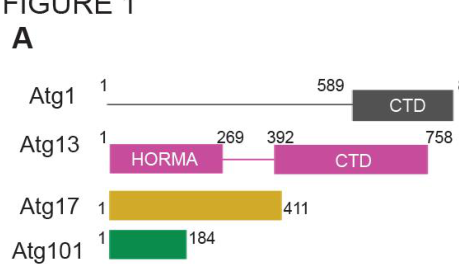

## Question

# Gene Research for Functional Annotation

## ⚠️ CRITICAL: Gene/Protein Identification Context

**BEFORE YOU BEGIN RESEARCH:** You MUST verify you are researching the CORRECT gene/protein. Gene symbols can be ambiguous, especially for less well-characterized genes from non-model organisms.

### Target Gene/Protein Identity (from UniProt):
- **UniProt Accession:** O36019
- **Protein Description:** RecName: Full=Autophagy protein 13; AltName: Full=Meiotically up-regulated gene 78 protein;
- **Gene Information:** Name=atg13; Synonyms=mug78; ORFNames=SPAC4F10.07c;
- **Organism (full):** Schizosaccharomyces pombe (strain 972 / ATCC 24843) (Fission yeast).
- **Protein Family:** Belongs to the ATG13 family. Fungi subfamily.
- **Key Domains:** ATG13. (IPR040182); Atg13_N. (IPR018731); HORMA_dom_sf. (IPR036570); ATG13 (PF10033)

### MANDATORY VERIFICATION STEPS:

1. **Check if the gene symbol "atg13" matches the protein description above**
2. **Verify the organism is correct:** Schizosaccharomyces pombe (strain 972 / ATCC 24843) (Fission yeast).
3. **Check if protein family/domains align with what you find in literature**
4. **If you find literature for a DIFFERENT gene with the same or similar symbol, STOP**

### If Gene Symbol is Ambiguous or You Cannot Find Relevant Literature:

**DO NOT PROCEED WITH RESEARCH ON A DIFFERENT GENE.** Instead:
- State clearly: "The gene symbol 'atg13' is ambiguous or literature is limited for this specific protein"
- Explain what you found (e.g., "Found extensive literature on a different gene with the same symbol in a different organism")
- Describe the protein based ONLY on the UniProt information provided above
- Suggest that the protein function can be inferred from domain/family information

### Research Target:

Please provide a comprehensive research report on the gene **atg13** (gene ID: atg13, UniProt: O36019) in SCHPO.

The research report should be a detailed narrative explaining the function, biological processes, and localization of the gene product. Citations should be given for all claims.

You should prioritize authoritative reviews and primary scientific literature when conducting research. You can supplement
this with annotations you find in gene/protein databases, but these can be outdated or inaccurate.

We are specifically interested in the primary function of the gene - for enzymes, what reaction is catalyzed, and what is the substrate specificity? For transporters, what is the substrate? For structural proteins or adapters, what is the broader structural role? For signaling molecules, what is the role in the pathway.

We are interested in where in or outside the cell the gene product carries out its function.

We are also interested in the signaling or biochemical pathways in which the gene functions. We are less interested in broad pleiotropic effects, except where these elucidate the precise role.

Include evidence where possible. We are interested in both experimental evidence as well as inference from structure, evolution, or bioinformatic analysis. Precise studies should be prioritized over high-throughput, where available.

## Output

Question: You are an expert researcher providing comprehensive, well-cited information.

Provide detailed information focusing on:
1. Key concepts and definitions with current understanding
2. Recent developments and latest research (prioritize 2023-2024 sources)
3. Current applications and real-world implementations
4. Expert opinions and analysis from authoritative sources
5. Relevant statistics and data from recent studies

Format as a comprehensive research report with proper citations. Include URLs and publication dates where available.
Always prioritize recent, authoritative sources and provide specific citations for all major claims.

# Gene Research for Functional Annotation

## ⚠️ CRITICAL: Gene/Protein Identification Context

**BEFORE YOU BEGIN RESEARCH:** You MUST verify you are researching the CORRECT gene/protein. Gene symbols can be ambiguous, especially for less well-characterized genes from non-model organisms.

### Target Gene/Protein Identity (from UniProt):
- **UniProt Accession:** O36019
- **Protein Description:** RecName: Full=Autophagy protein 13; AltName: Full=Meiotically up-regulated gene 78 protein;
- **Gene Information:** Name=atg13; Synonyms=mug78; ORFNames=SPAC4F10.07c;
- **Organism (full):** Schizosaccharomyces pombe (strain 972 / ATCC 24843) (Fission yeast).
- **Protein Family:** Belongs to the ATG13 family. Fungi subfamily.
- **Key Domains:** ATG13. (IPR040182); Atg13_N. (IPR018731); HORMA_dom_sf. (IPR036570); ATG13 (PF10033)

### MANDATORY VERIFICATION STEPS:

1. **Check if the gene symbol "atg13" matches the protein description above**
2. **Verify the organism is correct:** Schizosaccharomyces pombe (strain 972 / ATCC 24843) (Fission yeast).
3. **Check if protein family/domains align with what you find in literature**
4. **If you find literature for a DIFFERENT gene with the same or similar symbol, STOP**

### If Gene Symbol is Ambiguous or You Cannot Find Relevant Literature:

**DO NOT PROCEED WITH RESEARCH ON A DIFFERENT GENE.** Instead:
- State clearly: "The gene symbol 'atg13' is ambiguous or literature is limited for this specific protein"
- Explain what you found (e.g., "Found extensive literature on a different gene with the same symbol in a different organism")
- Describe the protein based ONLY on the UniProt information provided above
- Suggest that the protein function can be inferred from domain/family information

### Research Target:

Please provide a comprehensive research report on the gene **atg13** (gene ID: atg13, UniProt: O36019) in SCHPO.

The research report should be a detailed narrative explaining the function, biological processes, and localization of the gene product. Citations should be given for all claims.

You should prioritize authoritative reviews and primary scientific literature when conducting research. You can supplement
this with annotations you find in gene/protein databases, but these can be outdated or inaccurate.

We are specifically interested in the primary function of the gene - for enzymes, what reaction is catalyzed, and what is the substrate specificity? For transporters, what is the substrate? For structural proteins or adapters, what is the broader structural role? For signaling molecules, what is the role in the pathway.

We are interested in where in or outside the cell the gene product carries out its function.

We are also interested in the signaling or biochemical pathways in which the gene functions. We are less interested in broad pleiotropic effects, except where these elucidate the precise role.

Include evidence where possible. We are interested in both experimental evidence as well as inference from structure, evolution, or bioinformatic analysis. Precise studies should be prioritized over high-throughput, where available.

## Research Report: Functional Annotation of **atg13** (UniProt **O36019**) in *Schizosaccharomyces pombe* (strain 972)

### 0) Scope and identity verification (disambiguation)
The report concerns the **fission yeast** (*Schizosaccharomyces pombe*) gene **atg13** (synonym **mug78**; ORF **SPAC4F10.07c**) encoding **Autophagy protein 13** (UniProt **O36019**). All organism-specific claims below are taken from *S. pombe* autophagy literature that experimentally analyzes **the S. pombe Atg1 complex** and explicitly includes **Atg13** as a core subunit, with domain mapping and interaction data consistent with ATG13-family proteins (xu2022fissionyeastautophagy pages 5-7, nanji2017conservedandunique pages 5-8).

### 1) Key concepts and definitions (current understanding)

#### 1.1 Macroautophagy and the Atg1 initiation complex
Macroautophagy (hereafter “autophagy”) is a conserved catabolic pathway that delivers cytoplasmic material to the vacuole/lysosome for degradation and recycling. In *S. pombe*, autophagy supports survival under nutrient depletion and other stresses, and its core machinery has both conserved and divergent features relative to budding yeast (*S. cerevisiae*) (xu2022fissionyeastautophagy pages 5-7).

A central upstream control point is the **Atg1 protein kinase complex** (“Atg1 complex”), which functions in **autophagy initiation**. In *S. pombe*, the canonical core composition is described as **Atg1, Atg13, Atg17, and Atg11**, with **Atg101** as an additional Atg13-binding subunit that stabilizes Atg13 (xu2022fissionyeastautophagy pages 5-7).

#### 1.2 What Atg13 is (functional class)
Atg13 is not an enzyme; it is primarily a **scaffold/adaptor protein** within the Atg1 initiation machinery. In fission yeast, Atg13 is described as a subunit of the Atg1 kinase complex and directly interacts with Atg1 and Atg17, supporting assembly/organization of the initiation complex (xu2022fissionyeastautophagy pages 5-7).

### 2) Molecular architecture of *S. pombe* Atg13 (domains/regions)

Nanji et al. (2017) mapped **two major functional regions** in *S. pombe* Atg13:
- An **N-terminal HORMA domain** (Atg13^HORMA; residues **1–269**) that binds Atg101 (nanji2017conservedandunique pages 5-8).
- A **C-terminal region/CTD** (reported as residues **392–758**) that mediates interactions with Atg1 and Atg17 (nanji2017conservedandunique pages 5-8).

In pulldown-based mapping, Atg13^CTD binds strongly to the **Atg1 C-terminal domain (Atg1^CTD; residues 589–830)**, and Atg17 interacts with Atg13^CTD (but not with Atg1^CTD or Atg101), supporting a model in which Atg13 helps **anchor Atg1 to an Atg17 scaffold** (nanji2017conservedandunique pages 5-8). Importantly, sequences flanking a putative MIM-like region are required for stable Atg1 binding, consistent with a multi-element binding interface rather than a single short motif being sufficient (nanji2017conservedandunique pages 5-8, nanji2017conservedandunique pages 8-12).

**Visual support:** Nanji et al. (2017) provide a domain schematic and interaction mapping of Atg13 with Atg1/Atg17/Atg101 (nanji2017conservedandunique media 1c99dd13, nanji2017conservedandunique media 647db175).

### 3) Physical interactions and complex assembly

#### 3.1 Direct binding partners
Experimental mapping in *S. pombe* supports the following interaction network:
- **Atg13–Atg1:** Atg13 binds Atg1; Atg13^CTD binds Atg1^CTD strongly (xu2022fissionyeastautophagy pages 5-7, nanji2017conservedandunique pages 5-8).
- **Atg13–Atg17:** Atg13 binds Atg17; Atg17 interacts with Atg13^CTD (xu2022fissionyeastautophagy pages 5-7, nanji2017conservedandunique pages 5-8).
- **Atg13–Atg101:** Atg101 binds the Atg13 **HORMA** domain and stabilizes Atg13 (xu2022fissionyeastautophagy pages 5-7, nanji2017conservedandunique pages 12-15, nanji2017conservedandunique pages 5-8).
- **Atg11–Atg13:** Atg11 interacts **weakly** with Atg13 but **strongly** with Atg1 in *S. pombe* (xu2022fissionyeastautophagy pages 5-7).

These findings are consistent with a scaffold-centric role for Atg13 in organizing Atg1-complex subunits, while Atg11 serves a distinct key function in controlling Atg1 kinase activation (see below).

#### 3.2 Atg101 stabilizes Atg13 via HORMA–HORMA heterodimerization
A key quantitative biochemical result in *S. pombe* is that Atg101 forms an **obligate heterodimer** with Atg13^HORMA (nanji2017conservedandunique pages 12-15). Differential scanning fluorimetry (DSF) showed an estimated melting temperature (T_m) of approximately **43°C** for Atg13^HORMA alone, **48°C** for Atg101 alone, and **63°C** for the Atg101–Atg13^HORMA complex, implying large stabilization upon heterodimerization (nanji2017conservedandunique pages 12-15). Crosslinking-MS further supported the structural consistency of this heterodimer with known HORMA-domain architecture (nanji2017conservedandunique pages 12-15).

### 4) Primary biological function in *S. pombe*: autophagy initiation (mechanistic role)

#### 4.1 Role as a scaffold within the Atg1 initiation machinery
Across fission yeast autophagy synthesis and primary Atg1-complex biochemistry, Atg13 is positioned as a **core initiation-complex subunit** that directly binds Atg1 and Atg17 and recruits/stabilizes Atg101 through its HORMA domain (xu2022fissionyeastautophagy pages 5-7, nanji2017conservedandunique pages 5-8). This architecture supports Atg13’s primary function as an organizer of the initiation complex rather than a catalytic factor.

#### 4.2 Distinctive *S. pombe* feature: Atg13 is not required for Atg1 kinase autophosphorylation activity
A major divergence from *S. cerevisiae* is that in *S. pombe*, **Atg13 is not required for Atg1 kinase autophosphorylation** under the conditions tested. Pan et al. (2020) immunopurified YFP-Atg1 and measured thiophosphorylation-based autophosphorylation in vitro; **Atg1 from atg13Δ** (and atg17Δ or atg101Δ) showed **autophosphorylation similar to wild type** under both nutrient-rich conditions and after **1 hour nitrogen starvation** (pan2020atg1kinasein pages 2-4). In the same study and in fission yeast synthesis, **Atg11** (FIP200 ortholog) rather than Atg13 is emphasized as required for normal Atg1 kinase activity (pan2020atg1kinasein pages 2-4, xu2022fissionyeastautophagy pages 5-7).

This result refines functional annotation: in *S. pombe*, Atg13 contributes to **complex architecture/assembly**, but **Atg11-mediated dimerization/activation** is central for Atg1 kinase activation (pan2020atg1kinasein pages 2-4, xu2022fissionyeastautophagy pages 5-7).

### 5) Regulation and pathways (TORC1, nutrient signaling, stress signaling)

#### 5.1 TORC1 context and Atg13 phosphorylation (what is known vs unknown in *S. pombe*)
In fungi generally, TORC1 is a major upstream regulator of autophagy initiation, commonly conceptualized as inhibiting Atg1-complex assembly through phosphorylation of initiation machinery components including Atg13. In a fission-yeast-focused synthesis of stress adaptation/autophagy initiation, Atg13 is described as part of an initiation complex whose activity is linked to phosphorylation state and TORC1-dependent regulation, with nitrogen starvation rapidly reversing TORC1-dependent hyperphosphorylation to permit complex stabilization/activation (fernandez2025cellularadaptationto pages 30-35). 

However, a key limitation in current *S. pombe* residue-level understanding is highlighted by recent 2024 phosphoproteomics: although TORC1 was **proposed** to phosphorylate Atg13 in *S. pombe*, **specific Atg13 residues remain unknown** in the cited dataset/context (berard2024proteomicandphosphoproteomic pages 19-21).

#### 5.2 2023: PKA/SAPK transcriptional control of autophagy under glucose limitation (context for initiation)
While not mapping Atg13 directly, a 2023 *Autophagy* paper provides current mechanistic context for how nutrient/stress signals can control autophagy in *S. pombe* at the transcriptional level. Pérez-Díaz et al. showed autophagy in response to glucose limitation/starvation is regulated through cAMP-PKA and the Sty1 SAPK pathway via transcription factors Rst2 and Atf1, including large transcriptome shifts: **1106/5130 genes (~21%)** altered in a pka1−δ background (p < 0.05; FDR < 0.05; |log2FC| ≥ 3), with substantial Rst2- and Atf1-dependence among induced genes (perezdiaz2023campproteinkinasea pages 9-12). Functionally, combined loss of Sty1 or Atf1 in glucose-starved pka1−δ cells **completely abolished autophagic flux** under a glycerol condition used to support respiration-dependent autophagy (perezdiaz2023campproteinkinasea pages 9-12).

These results represent a 2023 advance: initiation/flux can be strongly tuned by upstream signaling through transcriptional programs, which likely interfaces with (but is distinct from) Atg13’s structural role in the Atg1 complex.

#### 5.3 2024: TORC1 reactivation during sexual differentiation is pheromone-driven and not dependent on autophagy
Bérard et al. (Dec 2024, *PLOS Biology*) used proteomic/phosphoproteomic approaches to show that during sexual reproduction, TORC1 is reactivated by pheromone signaling even though TORC1 inactivation is required to initiate differentiation. In this context, autophagy can promote TORC1 reactivation by increasing intracellular amino acids, but pheromone signaling can reactivate TORC1 **without increasing autophagy** (as assessed by CFP-Atg8 cleavage assay) (berard2024proteomicandphosphoproteomic pages 19-21). This provides a recent (2024) systems-level view of how TORC1 dynamics and autophagy can be decoupled depending on physiological context.

### 6) Subcellular localization (where Atg13 acts)
The evidence gathered here supports that Atg13 acts at the **autophagy initiation site** (often referred to as the phagophore assembly site, PAS) as a core component of the Atg1 complex architecture, based on its direct binding roles within the initiation complex (nanji2017conservedandunique pages 5-8, fernandez2025cellularadaptationto pages 30-35). 

**Evidence gap:** The retrieved excerpts do not contain a direct microscopy-based statement of Atg13 localization in *S. pombe* (e.g., Atg13 puncta at PAS under starvation), so localization should be treated as **inferred from complex role** rather than directly demonstrated by imaging in the provided sources.

### 7) Phenotypes, applications, and real-world implementations

#### 7.1 Phenotypes (experimental)
Two experimentally grounded phenotype-level conclusions for *S. pombe* Atg13 from the collected evidence are:
1) **Complex scaffolding/interaction phenotypes:** Atg13 physically links Atg1 and Atg17 via its C-terminal region and binds Atg101 via its HORMA domain, with Atg101 substantially stabilizing Atg13^HORMA (DSF T_m shift to ~63°C) (nanji2017conservedandunique pages 5-8, nanji2017conservedandunique pages 12-15).
2) **Kinase-activity phenotype:** Deleting atg13 does **not** measurably diminish Atg1 autophosphorylation activity in the Pan et al. assay conditions (pan2020atg1kinasein pages 2-4).

**Evidence gap (important):** The retrieved excerpts did not provide a quantitative bulk-autophagy flux defect for **atg13Δ** (e.g., percent free GFP accumulation from GFP-Atg8 processing, Pho8Δ60 activity values, autophagosome size/number). Therefore, claims about the magnitude of atg13Δ flux defects cannot be made here without additional primary data.

#### 7.2 Current applications and real-world implementations
Atg13 itself is principally used as a **genetic and biochemical handle** to interrogate autophagy initiation mechanisms in fission yeast, especially to understand how initiation-complex architecture differs from budding yeast and how TORC1 and other nutrient/stress pathways interface with autophagy (xu2022fissionyeastautophagy pages 5-7, pan2020atg1kinasein pages 2-4, perezdiaz2023campproteinkinasea pages 9-12). Fission yeast is also used as a eukaryotic model for nutrient signaling networks (e.g., TOR/PKA/SAPK) and for mapping conserved autophagy initiation principles that inform broader eukaryotic biology (xu2022fissionyeastautophagy pages 5-7, perezdiaz2023campproteinkinasea pages 9-12).

### 8) Expert synthesis and interpretation (authoritative analysis)

1) **Atg13 is best annotated in *S. pombe* as an initiation-complex scaffold rather than an obligate Atg1-kinase activator.** This interpretation is supported by domain-resolved interaction mapping (Atg13^CTD binding Atg1^CTD and Atg17; Atg13^HORMA binding Atg101) (nanji2017conservedandunique pages 5-8) together with the surprising kinase result that Atg1 autophosphorylation persists in atg13Δ (pan2020atg1kinasein pages 2-4). 

2) **Atg101–Atg13 HORMA heterodimerization appears to be a major structural “hub” in fission yeast initiation complex stability.** The DSF stabilization (T_m ~63°C for the complex vs ~43–48°C for components) is strong quantitative evidence that the heterodimer is more stable than either protein alone (nanji2017conservedandunique pages 12-15).

3) **Regulatory wiring is context dependent, and residue-level Atg13 regulation in *S. pombe* remains incomplete.** While TORC1→Atg13 regulation is a widely used conceptual framework and Atg13 is discussed as a TORC1 substrate in *S. pombe*, the 2024 phosphoproteomic work emphasizes that **specific Atg13 phosphorylation sites are not yet identified** in that context (berard2024proteomicandphosphoproteomic pages 19-21). Recent (2023–2024) advances instead emphasize broader pathway control (PKA/SAPK transcriptional control; pheromone-driven TORC1 reactivation) that sets the physiological context in which initiation complexes operate (perezdiaz2023campproteinkinasea pages 9-12, berard2024proteomicandphosphoproteomic pages 19-21).

### 9) Summary table of evidence
The following structured evidence summary can be used directly for functional annotation work:

| Aspect | Key findings (concise) | Evidence type | Best supporting sources (author year, journal) | URL/DOI | Notes/limitations |
|---|---|---|---|---|---|
| Identity | The target is the fission-yeast autophagy factor Atg13 encoded by atg13/mug78/SPAC4F10.07c (UniProt O36019), analyzed in S. pombe Atg1-complex studies rather than homologs from other organisms. It is treated as a core subunit of the S. pombe Atg1 initiation complex. (xu2022fissionyeastautophagy pages 5-7, nanji2017conservedandunique pages 1-5) | Review synthesis; organism-specific biochemistry | Xu & Du 2022, *Cells*; Nanji et al. 2017, *Autophagy* | https://doi.org/10.3390/cells11071086; https://doi.org/10.1080/15548627.2017.1382782 | Identity is well supported in S. pombe literature, but many broader Atg13 papers are from other organisms and should not be overgeneralized to SCHPO. |
| Domains | Atg13 has an N-terminal HORMA domain (Atg13HORMA, residues 1–269) that binds Atg101 and a C-terminal region/CTD (reported as residues 392–758) that mediates Atg1 and Atg17 binding. Additional sequences flanking the putative MIM are required for stable Atg1 binding. (nanji2017conservedandunique pages 12-15, nanji2017conservedandunique pages 5-8, nanji2017conservedandunique pages 8-12, nanji2017conservedandunique media 1c99dd13) | Biochemical; structural inference; domain mapping | Nanji et al. 2017, *Autophagy* | https://doi.org/10.1080/15548627.2017.1382782 | Domain boundaries come from recombinant-fragment studies, not a full-length S. pombe Atg13 structure. |
| Interactions | Direct interactions are reported between Atg13 and Atg1, Atg13 and Atg17, and Atg13 HORMA and Atg101. Atg11 interacts strongly with Atg1 and weakly with Atg13. Atg101 does not bind Atg17 but can contact Atg1 CTD. (xu2022fissionyeastautophagy pages 5-7, nanji2017conservedandunique pages 5-8, nanji2017conservedandunique pages 8-12, nanji2017conservedandunique pages 1-5, nanji2017conservedandunique media 1c99dd13) | Pairwise coprecipitation; pulldown; biochemical reconstitution; review | Nanji et al. 2017, *Autophagy*; Xu & Du 2022, *Cells* | https://doi.org/10.1080/15548627.2017.1382782; https://doi.org/10.3390/cells11071086 | Evidence is strong for physical association, but stoichiometry and dynamics in vivo are less completely resolved than in budding yeast or mammals. |
| Complex architecture/function | Atg13 functions as a scaffold/adaptor in the S. pombe Atg1 complex, helping anchor Atg1 to the Atg17 scaffold and coupling Atg101 into the initiation machinery; this places Atg13 upstream in autophagy initiation rather than acting as an enzyme. (fernandez2025cellularadaptationto pages 30-35, xu2022fissionyeastautophagy pages 5-7, nanji2017conservedandunique pages 5-8, nanji2017conservedandunique pages 1-5, nanji2017conservedandunique media 1c99dd13) | Biochemical; structural model; review | Nanji et al. 2017, *Autophagy*; Xu & Du 2022, *Cells* | https://doi.org/10.1080/15548627.2017.1382782; https://doi.org/10.3390/cells11071086 | The scaffold role is well supported; direct downstream substrates specifically controlled via Atg13 in S. pombe remain less defined. |
| Atg101 stabilization | Atg101 binds the Atg13 HORMA domain and stabilizes Atg13. DSF reported melting temperatures of ~43°C for Atg13HORMA, ~48°C for Atg101, and ~63°C for the heterodimer, indicating strong stabilization upon complex formation. (nanji2017conservedandunique pages 12-15, nanji2021characterizingtheassembly pages 55-59, nanji2017conservedandunique media 1c99dd13) | Biochemical; DSF; crosslinking-MS | Nanji et al. 2017, *Autophagy*; Nanji 2021 thesis | https://doi.org/10.1080/15548627.2017.1382782; https://doi.org/10.14288/1.0378352 | The quantitative stabilization result is robust, but functional consequences beyond stability are not fully quantified in the cited excerpts. |
| Requirement for Atg1 kinase activity | In S. pombe, Atg13 is not required for detectable Atg1 autophosphorylation activity; Atg1 from atg13Δ cells showed autophosphorylation similar to wild type under nutrient-rich and 1 h nitrogen-starved conditions. Atg11, not Atg13/Atg17/Atg101, is the key requirement for Atg1 kinase activation. (xu2022fissionyeastautophagy pages 5-7, pan2020atg1kinasein pages 2-4) | Genetic; in vitro kinase assay | Pan et al. 2020, *eLife*; Xu & Du 2022, *Cells* | https://doi.org/10.7554/elife.58073; https://doi.org/10.3390/cells11071086 | This is a major fission-yeast-specific divergence from the budding-yeast paradigm; lack of a kinase requirement does not mean Atg13 is dispensable for autophagy initiation complex assembly. |
| Regulation by TORC1 | The general fungal model is that TORC1-dependent hyperphosphorylation of Atg13 suppresses Atg1-complex assembly, and starvation-associated dephosphorylation promotes initiation. Reviews specific to S. pombe note Atg13 as a TORC1-dependent autophagy regulator/target, but specific S. pombe Atg13 phosphoresidues are still unknown in the cited 2024 phosphoproteomic work. (fernandez2025cellularadaptationto pages 30-35, berard2024proteomicandphosphoproteomic pages 19-21) | Review; pathway inference; phosphoproteomics context | Fernández 2025; Bérard et al. 2024, *PLOS Biology* | https://doi.org/10.1371/journal.pbio.3002963 | Scope caveat: the TORC1→Atg13 mechanism is strongly established broadly in yeasts/mammals, but residue-level regulation of S. pombe Atg13 remains incompletely mapped in the provided evidence. |
| Other signaling inputs (PKA/MAPK) | 2023 work showed glucose-limitation autophagy in S. pombe is strongly controlled transcriptionally by cAMP-PKA and Sty1-Atf1/Rst2 pathways. This study did not directly map Atg13 regulation, but it provides current context for how initiation is integrated with nutrient/stress signaling in S. pombe. pka1-δ altered ~21% of genes (1106/5130), with 65% of induced genes Rst2-dependent and 33% Atf1-dependent. (perezdiaz2023campproteinkinasea pages 9-12) | Genetics; transcriptomics; autophagic-flux assays | Pérez-Díaz et al. 2023, *Autophagy* | https://doi.org/10.1080/15548627.2022.2125204 | Important for pathway context, but evidence is indirect for Atg13 specifically. |
| Localization | The provided evidence places Atg13 function at the autophagy initiation site/PAS as part of the Atg1 complex architecture, but the gathered excerpts do not provide a direct microscopy-based localization result for S. pombe Atg13 itself. (fernandez2025cellularadaptationto pages 30-35, nanji2017conservedandunique media 1c99dd13) | Structural/functional inference | Nanji et al. 2017, *Autophagy*; Fernández 2025 | https://doi.org/10.1080/15548627.2017.1382782 | Localization should be stated cautiously: PAS association is inferred from complex role and architecture, not directly demonstrated in the extracted passages. |
| Phenotypes/autophagy role | Atg13 is a core initiation-complex component critical for autophagy initiation according to S. pombe autophagy machinery synthesis, but the specific excerpts available here do not provide a standalone numeric flux defect for atg13Δ. The strongest direct phenotype in the gathered primary data concerns kinase independence rather than flux magnitude. (xu2022fissionyeastautophagy pages 5-7, pan2020atg1kinasein pages 2-4) | Review; genetics; kinase assay | Xu & Du 2022, *Cells*; Pan et al. 2020, *eLife* | https://doi.org/10.3390/cells11071086; https://doi.org/10.7554/elife.58073 | Absence of quantitative atg13Δ flux data in the retrieved excerpts is a key limitation. |
| Assays used in Atg13 studies | Evidence for Atg13 function comes from pairwise coprecipitation/pulldown mapping, recombinant purification, DSF, crosslinking-MS, and Atg1 kinase assays. The Nanji thesis also lists CFP-Atg8 cleavage and Pho8Δ60 assays among methods relevant to Atg-complex function. (nanji2021characterizingtheassembly pages 8-9, nanji2017conservedandunique pages 12-15, pan2020atg1kinasein pages 2-4, nanji2021characterizingtheassembly pages 55-59, nanji2017conservedandunique media 1c99dd13) | Biochemical; structural; genetic; autophagy assay methods | Nanji et al. 2017, *Autophagy*; Nanji 2021 thesis; Pan et al. 2020, *eLife* | https://doi.org/10.1080/15548627.2017.1382782; https://doi.org/10.14288/1.0378352; https://doi.org/10.7554/elife.58073 | Some assays are documented as methods in the thesis without extracted Atg13-specific results in the available context. |
| Recent 2023–2024 developments | Recent S. pombe studies refined the signaling context of autophagy initiation rather than Atg13 biochemistry directly: (i) 2023 established major transcriptional control by PKA/SAPK during glucose limitation; (ii) 2024 phosphoproteomics showed TORC1 is reactivated during sexual differentiation by pheromone signaling, with Atg13 still discussed as a proposed TORC1 target but without mapped residues. In the 2024 study, Atg1 was not absolutely required for residual CFP-Atg8 cleavage in MSL medium, underscoring environmental dependence of autophagy readouts. (berard2024proteomicandphosphoproteomic pages 19-21, berard2024torc1reactivationby pages 9-11, perezdiaz2023campproteinkinasea pages 9-12) | Genetics; phosphoproteomics; autophagy flux | Pérez-Díaz et al. 2023, *Autophagy*; Bérard et al. 2024, *PLOS Biology* / bioRxiv | https://doi.org/10.1080/15548627.2022.2125204; https://doi.org/10.1371/journal.pbio.3002963; https://doi.org/10.1101/2024.06.04.597361 | Recent literature is valuable for pathway context, but there remains a gap in 2023–2024 residue-level or imaging-focused Atg13-specific data for S. pombe. |

*Table: This table summarizes the best available organism-specific evidence for Schizosaccharomyces pombe Atg13/O36019, including domain organization, interactions, signaling context, and assay support. It is useful for distinguishing directly demonstrated S. pombe findings from broader Atg13 models inferred from other systems.*

### 10) Key references (with dates and URLs)
- Nanji T. et al. **“Conserved and unique features of the fission yeast core Atg1 complex.”** *Autophagy* (Nov **2017**). https://doi.org/10.1080/15548627.2017.1382782 (nanji2017conservedandunique pages 5-8, nanji2017conservedandunique pages 12-15)
- Pan Z-Q. et al. **“Atg1 kinase in fission yeast is activated by Atg11-mediated dimerization and cis-autophosphorylation.”** *eLife* (Sep **2020**). https://doi.org/10.7554/elife.58073 (pan2020atg1kinasein pages 2-4)
- Xu D-D & Du L-L. **“Fission Yeast Autophagy Machinery.”** *Cells* (Mar **2022**). https://doi.org/10.3390/cells11071086 (xu2022fissionyeastautophagy pages 5-7)
- Pérez-Díaz A.J. et al. **“cAMP-Protein kinase A and stress-activated MAP kinase signaling mediate transcriptional control of autophagy in fission yeast during glucose limitation or starvation.”** *Autophagy* (Sep **2023**; volume 19). https://doi.org/10.1080/15548627.2022.2125204 (perezdiaz2023campproteinkinasea pages 9-12)
- Bérard M. et al. **“Proteomic and phosphoproteomic analyses reveal that TORC1 is reactivated by pheromone signaling during sexual reproduction in fission yeast.”** *PLOS Biology* (Dec **2024**). https://doi.org/10.1371/journal.pbio.3002963 (berard2024proteomicandphosphoproteomic pages 19-21)

### 11) Visual evidence cited
- Domain schematic and interaction mapping for the *S. pombe* Atg1 complex including Atg13, Atg101, and Atg17 (Nanji et al. 2017) (nanji2017conservedandunique media 1c99dd13, nanji2017conservedandunique media 647db175).

### 12) Limitations and near-term research needs
- **Atg13 in vivo localization** (PAS puncta dynamics, starvation dependence) was not directly documented in the retrieved excerpts; microscopy-based primary sources should be incorporated for a stronger subcellular localization annotation.
- **Quantitative atg13Δ autophagic flux phenotypes** (GFP-Atg8 processing, Pho8Δ60 activity, autophagosome size) were not present in the extracted passages and remain a gap for this report.
- **Atg13 phosphosite mapping in *S. pombe*** remains incomplete; recent 2024 phosphoproteomics discusses Atg13 as a proposed TORC1 substrate but notes specific residues are unknown (berard2024proteomicandphosphoproteomic pages 19-21).

References

1. (xu2022fissionyeastautophagy pages 5-7): Dan-Dan Xu and Li-Lin Du. Fission yeast autophagy machinery. Cells, 11:1086, Mar 2022. URL: https://doi.org/10.3390/cells11071086, doi:10.3390/cells11071086. This article has 29 citations.

2. (nanji2017conservedandunique pages 5-8): Tamiza Nanji, Xu Liu, Leon H. Chew, Franco K. Li, Maitree Biswas, Zhong-Qiu Yu, Shan Lu, Meng-Qiu Dong, Li-Lin Du, Daniel J. Klionsky, and Calvin K. Yip. Conserved and unique features of the fission yeast core atg1 complex. Autophagy, 13:2018-2027, Nov 2017. URL: https://doi.org/10.1080/15548627.2017.1382782, doi:10.1080/15548627.2017.1382782. This article has 30 citations and is from a domain leading peer-reviewed journal.

3. (nanji2017conservedandunique pages 8-12): Tamiza Nanji, Xu Liu, Leon H. Chew, Franco K. Li, Maitree Biswas, Zhong-Qiu Yu, Shan Lu, Meng-Qiu Dong, Li-Lin Du, Daniel J. Klionsky, and Calvin K. Yip. Conserved and unique features of the fission yeast core atg1 complex. Autophagy, 13:2018-2027, Nov 2017. URL: https://doi.org/10.1080/15548627.2017.1382782, doi:10.1080/15548627.2017.1382782. This article has 30 citations and is from a domain leading peer-reviewed journal.

4. (nanji2017conservedandunique media 1c99dd13): Tamiza Nanji, Xu Liu, Leon H. Chew, Franco K. Li, Maitree Biswas, Zhong-Qiu Yu, Shan Lu, Meng-Qiu Dong, Li-Lin Du, Daniel J. Klionsky, and Calvin K. Yip. Conserved and unique features of the fission yeast core atg1 complex. Autophagy, 13:2018-2027, Nov 2017. URL: https://doi.org/10.1080/15548627.2017.1382782, doi:10.1080/15548627.2017.1382782. This article has 30 citations and is from a domain leading peer-reviewed journal.

5. (nanji2017conservedandunique media 647db175): Tamiza Nanji, Xu Liu, Leon H. Chew, Franco K. Li, Maitree Biswas, Zhong-Qiu Yu, Shan Lu, Meng-Qiu Dong, Li-Lin Du, Daniel J. Klionsky, and Calvin K. Yip. Conserved and unique features of the fission yeast core atg1 complex. Autophagy, 13:2018-2027, Nov 2017. URL: https://doi.org/10.1080/15548627.2017.1382782, doi:10.1080/15548627.2017.1382782. This article has 30 citations and is from a domain leading peer-reviewed journal.

6. (nanji2017conservedandunique pages 12-15): Tamiza Nanji, Xu Liu, Leon H. Chew, Franco K. Li, Maitree Biswas, Zhong-Qiu Yu, Shan Lu, Meng-Qiu Dong, Li-Lin Du, Daniel J. Klionsky, and Calvin K. Yip. Conserved and unique features of the fission yeast core atg1 complex. Autophagy, 13:2018-2027, Nov 2017. URL: https://doi.org/10.1080/15548627.2017.1382782, doi:10.1080/15548627.2017.1382782. This article has 30 citations and is from a domain leading peer-reviewed journal.

7. (pan2020atg1kinasein pages 2-4): Zhao-Qian Pan, Guang-Can Shao, Xiao-Man Liu, Quan Chen, Meng-Qiu Dong, and Li-Lin Du. Atg1 kinase in fission yeast is activated by atg11-mediated dimerization and cis-autophosphorylation. eLife, Sep 2020. URL: https://doi.org/10.7554/elife.58073, doi:10.7554/elife.58073. This article has 34 citations and is from a domain leading peer-reviewed journal.

8. (fernandez2025cellularadaptationto pages 30-35): R Barrios Fernández. Cellular adaptation to environmental stress in fission yeast: the roles of autophagy and chromatin remodeling. Unknown journal, 2025.

9. (berard2024proteomicandphosphoproteomic pages 19-21): Melvin Bérard, Laura Merlini, and Sophie G. Martin. Proteomic and phosphoproteomic analyses reveal that torc1 is reactivated by pheromone signaling during sexual reproduction in fission yeast. Dec 2024. URL: https://doi.org/10.1371/journal.pbio.3002963, doi:10.1371/journal.pbio.3002963. This article has 9 citations and is from a highest quality peer-reviewed journal.

10. (perezdiaz2023campproteinkinasea pages 9-12): Armando Jesús Pérez-Díaz, Beatriz Vázquez-Marín, Jero Vicente-Soler, Francisco Prieto-Ruiz, Teresa Soto, Alejandro Franco, José Cansado, and Marisa Madrid. Camp-protein kinase a and stress-activated map kinase signaling mediate transcriptional control of autophagy in fission yeast during glucose limitation or starvation. Autophagy, 19:1311-1331, Sep 2023. URL: https://doi.org/10.1080/15548627.2022.2125204, doi:10.1080/15548627.2022.2125204. This article has 21 citations and is from a domain leading peer-reviewed journal.

11. (nanji2017conservedandunique pages 1-5): Tamiza Nanji, Xu Liu, Leon H. Chew, Franco K. Li, Maitree Biswas, Zhong-Qiu Yu, Shan Lu, Meng-Qiu Dong, Li-Lin Du, Daniel J. Klionsky, and Calvin K. Yip. Conserved and unique features of the fission yeast core atg1 complex. Autophagy, 13:2018-2027, Nov 2017. URL: https://doi.org/10.1080/15548627.2017.1382782, doi:10.1080/15548627.2017.1382782. This article has 30 citations and is from a domain leading peer-reviewed journal.

12. (nanji2021characterizingtheassembly pages 55-59): Tamiza Nanji. Characterizing the assembly and molecular interactions of the fission yeast atg1 autophagy regulatory complex. Text, Jan 2021. URL: https://doi.org/10.14288/1.0378352, doi:10.14288/1.0378352. This article has 0 citations and is from a peer-reviewed journal.

13. (nanji2021characterizingtheassembly pages 8-9): Tamiza Nanji. Characterizing the assembly and molecular interactions of the fission yeast atg1 autophagy regulatory complex. Text, Jan 2021. URL: https://doi.org/10.14288/1.0378352, doi:10.14288/1.0378352. This article has 0 citations and is from a peer-reviewed journal.

14. (berard2024torc1reactivationby pages 9-11): Melvin Bérard, Laura Merlini, and Sophie G. Martin. Torc1 reactivation by pheromone signaling revealed by phosphoproteomics of fission yeast sexual reproduction. bioRxiv, Jun 2024. URL: https://doi.org/10.1101/2024.06.04.597361, doi:10.1101/2024.06.04.597361. This article has 0 citations.

## Artifacts

- [Edison artifact artifact-00](atg13-deep-research-falcon_artifacts/artifact-00.md)

## Citations

1. xu2022fissionyeastautophagy pages 5-7
2. nanji2017conservedandunique pages 5-8
3. nanji2017conservedandunique pages 12-15
4. fernandez2025cellularadaptationto pages 30-35
5. berard2024proteomicandphosphoproteomic pages 19-21
6. perezdiaz2023campproteinkinasea pages 9-12
7. nanji2017conservedandunique pages 8-12
8. nanji2017conservedandunique pages 1-5
9. nanji2021characterizingtheassembly pages 55-59
10. nanji2021characterizingtheassembly pages 8-9
11. https://doi.org/10.3390/cells11071086;
12. https://doi.org/10.1080/15548627.2017.1382782
13. https://doi.org/10.1080/15548627.2017.1382782;
14. https://doi.org/10.3390/cells11071086
15. https://doi.org/10.14288/1.0378352
16. https://doi.org/10.7554/elife.58073;
17. https://doi.org/10.1371/journal.pbio.3002963
18. https://doi.org/10.1080/15548627.2022.2125204
19. https://doi.org/10.7554/elife.58073
20. https://doi.org/10.14288/1.0378352;
21. https://doi.org/10.1080/15548627.2022.2125204;
22. https://doi.org/10.1371/journal.pbio.3002963;
23. https://doi.org/10.1101/2024.06.04.597361
24. https://doi.org/10.3390/cells11071086,
25. https://doi.org/10.1080/15548627.2017.1382782,
26. https://doi.org/10.7554/elife.58073,
27. https://doi.org/10.1371/journal.pbio.3002963,
28. https://doi.org/10.1080/15548627.2022.2125204,
29. https://doi.org/10.14288/1.0378352,
30. https://doi.org/10.1101/2024.06.04.597361,