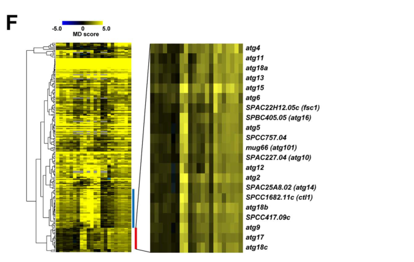

## Question

# Gene Research for Functional Annotation

## ⚠️ CRITICAL: Gene/Protein Identification Context

**BEFORE YOU BEGIN RESEARCH:** You MUST verify you are researching the CORRECT gene/protein. Gene symbols can be ambiguous, especially for less well-characterized genes from non-model organisms.

### Target Gene/Protein Identity (from UniProt):
- **UniProt Accession:** O94656
- **Protein Description:** RecName: Full=Autophagy protein 16;
- **Gene Information:** Name=atg16; ORFNames=SPBC405.05;
- **Organism (full):** Schizosaccharomyces pombe (strain 972 / ATCC 24843) (Fission yeast).
- **Protein Family:** Belongs to the ATG16 family. .
- **Key Domains:** Not specified in UniProt

### MANDATORY VERIFICATION STEPS:

1. **Check if the gene symbol "atg16" matches the protein description above**
2. **Verify the organism is correct:** Schizosaccharomyces pombe (strain 972 / ATCC 24843) (Fission yeast).
3. **Check if protein family/domains align with what you find in literature**
4. **If you find literature for a DIFFERENT gene with the same or similar symbol, STOP**

### If Gene Symbol is Ambiguous or You Cannot Find Relevant Literature:

**DO NOT PROCEED WITH RESEARCH ON A DIFFERENT GENE.** Instead:
- State clearly: "The gene symbol 'atg16' is ambiguous or literature is limited for this specific protein"
- Explain what you found (e.g., "Found extensive literature on a different gene with the same symbol in a different organism")
- Describe the protein based ONLY on the UniProt information provided above
- Suggest that the protein function can be inferred from domain/family information

### Research Target:

Please provide a comprehensive research report on the gene **atg16** (gene ID: atg16, UniProt: O94656) in SCHPO.

The research report should be a detailed narrative explaining the function, biological processes, and localization of the gene product. Citations should be given for all claims.

You should prioritize authoritative reviews and primary scientific literature when conducting research. You can supplement
this with annotations you find in gene/protein databases, but these can be outdated or inaccurate.

We are specifically interested in the primary function of the gene - for enzymes, what reaction is catalyzed, and what is the substrate specificity? For transporters, what is the substrate? For structural proteins or adapters, what is the broader structural role? For signaling molecules, what is the role in the pathway.

We are interested in where in or outside the cell the gene product carries out its function.

We are also interested in the signaling or biochemical pathways in which the gene functions. We are less interested in broad pleiotropic effects, except where these elucidate the precise role.

Include evidence where possible. We are interested in both experimental evidence as well as inference from structure, evolution, or bioinformatic analysis. Precise studies should be prioritized over high-throughput, where available.

## Output

Question: You are an expert researcher providing comprehensive, well-cited information.

Provide detailed information focusing on:
1. Key concepts and definitions with current understanding
2. Recent developments and latest research (prioritize 2023-2024 sources)
3. Current applications and real-world implementations
4. Expert opinions and analysis from authoritative sources
5. Relevant statistics and data from recent studies

Format as a comprehensive research report with proper citations. Include URLs and publication dates where available.
Always prioritize recent, authoritative sources and provide specific citations for all major claims.

# Gene Research for Functional Annotation

## ⚠️ CRITICAL: Gene/Protein Identification Context

**BEFORE YOU BEGIN RESEARCH:** You MUST verify you are researching the CORRECT gene/protein. Gene symbols can be ambiguous, especially for less well-characterized genes from non-model organisms.

### Target Gene/Protein Identity (from UniProt):
- **UniProt Accession:** O94656
- **Protein Description:** RecName: Full=Autophagy protein 16;
- **Gene Information:** Name=atg16; ORFNames=SPBC405.05;
- **Organism (full):** Schizosaccharomyces pombe (strain 972 / ATCC 24843) (Fission yeast).
- **Protein Family:** Belongs to the ATG16 family. .
- **Key Domains:** Not specified in UniProt

### MANDATORY VERIFICATION STEPS:

1. **Check if the gene symbol "atg16" matches the protein description above**
2. **Verify the organism is correct:** Schizosaccharomyces pombe (strain 972 / ATCC 24843) (Fission yeast).
3. **Check if protein family/domains align with what you find in literature**
4. **If you find literature for a DIFFERENT gene with the same or similar symbol, STOP**

### If Gene Symbol is Ambiguous or You Cannot Find Relevant Literature:

**DO NOT PROCEED WITH RESEARCH ON A DIFFERENT GENE.** Instead:
- State clearly: "The gene symbol 'atg16' is ambiguous or literature is limited for this specific protein"
- Explain what you found (e.g., "Found extensive literature on a different gene with the same symbol in a different organism")
- Describe the protein based ONLY on the UniProt information provided above
- Suggest that the protein function can be inferred from domain/family information

### Research Target:

Please provide a comprehensive research report on the gene **atg16** (gene ID: atg16, UniProt: O94656) in SCHPO.

The research report should be a detailed narrative explaining the function, biological processes, and localization of the gene product. Citations should be given for all claims.

You should prioritize authoritative reviews and primary scientific literature when conducting research. You can supplement
this with annotations you find in gene/protein databases, but these can be outdated or inaccurate.

We are specifically interested in the primary function of the gene - for enzymes, what reaction is catalyzed, and what is the substrate specificity? For transporters, what is the substrate? For structural proteins or adapters, what is the broader structural role? For signaling molecules, what is the role in the pathway.

We are interested in where in or outside the cell the gene product carries out its function.

We are also interested in the signaling or biochemical pathways in which the gene functions. We are less interested in broad pleiotropic effects, except where these elucidate the precise role.

Include evidence where possible. We are interested in both experimental evidence as well as inference from structure, evolution, or bioinformatic analysis. Precise studies should be prioritized over high-throughput, where available.

## Research Report: Functional Annotation of **atg16** (UniProt **O94656**; ORF **SPBC405.05**) in *Schizosaccharomyces pombe* (strain 972)

### 0) Executive summary (identity verified)
The target protein is **Atg16** from **fission yeast (*Schizosaccharomyces pombe* strain 972)**, encoded by **ORF SPBC405.05** and matching UniProt accession **O94656**. Primary S. pombe evidence explicitly assigns SPBC405.05 to **atg16** and shows it encodes an Atg16-family component of the autophagy conjugation machinery with a conserved **Atg5-binding N-terminus** and **C-terminal coiled-coil** typical of Atg16 proteins (https://doi.org/10.1371/journal.pgen.1003715; published 2013-08) (sun2013globalanalysisof pages 3-5, sun2013globalanalysisof pages 14-15).

### 1) Key concepts and definitions (current understanding)

#### 1.1 Macroautophagy and Atg8/LC3 lipidation
Macroautophagy (“autophagy”) is a conserved pathway in which cytoplasmic material is sequestered into a double-membrane autophagosome and delivered to the vacuole/lysosome for degradation. A central molecular hallmark is **lipidation of Atg8 (LC3/GABARAP in mammals)**, i.e., covalent conjugation of Atg8 to the membrane lipid **phosphatidylethanolamine (PE)**, generating **Atg8–PE** on forming autophagic membranes (xu2022fissionyeastautophagy pages 2-4, noda2023structuralbiologyof pages 1-4).

#### 1.2 The ATG12–ATG5–ATG16 “E3-like” complex
Atg8 lipidation proceeds via a ubiquitin-like cascade: **Atg7 (E1-like)** activates Atg8, transfers it to **Atg3 (E2-like)**, and an **E3-like complex**—the **Atg12–Atg5–Atg16 complex**—stimulates transfer of Atg8 onto PE and helps determine where lipidation occurs (xu2022fissionyeastautophagy pages 2-4, noda2023structuralbiologyof pages 8-12, noda2023structuralbiologyof pages 1-4). In this system, **Atg16 is not the catalytic enzyme**, but a scaffolding/targeting subunit critical for organizing the E3-like machinery on the correct membrane surface (noda2023structuralbiologyof pages 8-12, nishimura2020emergingrolesof pages 8-10).

### 2) Molecular function of *S. pombe* Atg16 (what it does)

#### 2.1 Primary functional role: enabling Atg8–PE formation at autophagic membranes
In *S. pombe*, Atg16 functions as a core component of the Atg12–Atg5–Atg16 module required for productive autophagy, as demonstrated by the **CFP-Atg8 processing assay**: **atg16Δ** cells are defective in CFP-Atg8 processing under nitrogen starvation (https://doi.org/10.1371/journal.pgen.1003715; 2013-08) (sun2013globalanalysisof pages 3-5, sun2013globalanalysisof media 4581e895). Because CFP/GFP fusions are relatively protease-resistant and release free fluorophore upon vacuolar delivery, this processing assay is widely used as a bulk-autophagy flux readout in fission yeast (xu2022fissionyeastautophagy pages 2-4).

#### 2.2 Protein–protein interactions: Atg16 binds Atg5 in vivo
A key biochemical feature of Atg16 is its association with Atg5. In *S. pombe*, **Atg16-YFP co-immunoprecipitates with Atg5-Myc** and this interaction is observed **both in wild-type and in atg12Δ cells**, supporting that Atg16 can bind Atg5 independently of Atg12 conjugation (https://doi.org/10.1371/journal.pgen.1003715; 2013-08) (sun2013globalanalysisof pages 3-5, sun2013globalanalysisof media 4581e895). This aligns with the conserved Atg16 architecture: an N-terminal Atg5-binding region and a coiled-coil region that supports higher-order assembly (noda2023structuralbiologyof pages 8-12, noda2023structuralbiologyof pages 1-4).

### 3) Subcellular localization and where Atg16 acts

#### 3.1 Localization to the PAS/pre-autophagosomal structure during starvation
Microscopy in *S. pombe* shows **Atg16-YFP colocalizing with CFP-Atg8** at punctate structures corresponding to the **PAS/pre-autophagosomal structure** during starvation (sun2013globalanalysisof media 4581e895). This supports that Atg16 acts at early autophagosome biogenesis sites, consistent with its role in organizing Atg8 lipidation machinery on the forming phagophore (xu2022fissionyeastautophagy pages 5-7, noda2023structuralbiologyof pages 1-4).

#### 3.2 Quantitative dynamics: PAS puncta lifetimes
Time-lapse analysis of Atg8 puncta in wild-type fission yeast indicates PAS structures are dynamic on the order of minutes, with puncta lifetimes reported **mostly ~100–200 seconds** in the cited study (sun2013globalanalysisof pages 3-5). This provides a useful temporal scale for Atg16-dependent recruitment and conjugation events.

### 4) Pathway placement and *S. pombe*-specific mechanistic features

#### 4.1 Atg18a-dependent recruitment of the Atg12–Atg5–Atg16 complex (distinctive feature)
A prominent *S. pombe* mechanistic detail is the non-redundant role of Atg18 paralogs in organizing the conjugation machinery: **Atg18a is uniquely required to target the Atg12–Atg5·Atg16 complex to the PAS**, supporting Atg8 conjugation to PE (sun2013globalanalysisof pages 10-11, xu2022fissionyeastautophagy pages 5-7). Consistent with this, microscopy shows Atg5/Atg16 puncta are lost in **atg18aΔ** cells, and Atg8 puncta formation is also impaired when either **atg16** or **atg18a** is deleted (sun2013globalanalysisof media 4581e895).

This Atg18a-dependent targeting was a central conclusion of the original S. pombe study that identified Atg16 as a core Atg factor (https://doi.org/10.1371/journal.pgen.1003715; 2013-08) (sun2013globalanalysisof pages 10-11, sun2013globalanalysisof media 4581e895).

#### 4.2 Conserved vs. divergent recruitment logic across eukaryotes
Recent mechanistic synthesis emphasizes that across eukaryotes, Atg16/ATG16L1 recruitment to PI3P-positive autophagic membranes often involves PI3P-binding **PROPPIN/WIPI proteins**. In budding yeast, Atg21 binds PI3P and engages the Atg16 coiled-coil; in mammals, WIPI2 similarly recruits ATG16L1 (noda2023structuralbiologyof pages 8-12, noda2023structuralbiologyof pages 15-17). A 2023 primary study further shows that **coiled-coil-mediated dimerization of Atg16 is required for binding Atg21**, highlighting the importance of the Atg16 coiled-coil oligomeric state for PROPPIN-mediated recruitment (https://doi.org/10.1098/rsob.230192; published 2023-11) (buenoarribas2023coiledcoilmediateddimerizationof pages 1-2).

While these PROPPIN/WIPI recruitment mechanisms were studied outside *S. pombe*, they provide a strong comparative framework: *S. pombe* uses an Atg18-family protein (**Atg18a**) as a critical determinant for recruiting/positioning the Atg12–Atg5–Atg16 complex at the PAS (sun2013globalanalysisof pages 10-11, xu2022fissionyeastautophagy pages 5-7).

### 5) Mutant phenotypes and experimental evidence (S. pombe)

#### 5.1 Autophagy flux defect (CFP-Atg8 processing)
Deletion of atg16 produces a **loss-of-function autophagy phenotype** as assessed by **CFP-Atg8 processing** after nitrogen starvation (samples taken before and **8 h after** shift to nitrogen-free medium in the cited work) (sun2013globalanalysisof pages 3-5). Figure panels retrieved from the primary paper visually document the processing defect and related localization phenotypes (sun2013globalanalysisof media 4581e895).

#### 5.2 PAS assembly phenotype (Atg8 puncta)
Microscopy evidence shows **atg16Δ** cells fail to generate normal **Atg8 puncta** at the PAS during starvation; similar absence of puncta is seen in **atg18aΔ**, consistent with Atg18a’s role in recruiting the Atg12–Atg5–Atg16 complex (sun2013globalanalysisof media 4581e895).

#### 5.3 Genetic/physiological context
Fission yeast core autophagy genes are important for survival during nitrogen starvation and for developmental programs (mating/sporulation). The fission-yeast autophagy machinery review summarizes that core atg deletions disrupt viability under starvation and cause mating/sporulation defects, consistent with atg16 being in the core set (xu2022fissionyeastautophagy pages 2-4).

### 6) Recent developments (prioritizing 2023–2024)

#### 6.1 2023 structural biology synthesis: architecture and recruitment interfaces
A 2023 review focused on structural biology of the Atg8/Atg12 conjugation systems highlights:
- Atg16 contains an **Atg5-binding N-terminus** and a **parallel coiled-coil** that mediates homodimerization; a structural length scale of the coiled-coil dimer is reported (~**13 nm**) (https://doi.org/10.1080/27694127.2023.2277582; published 2023-11) (noda2023structuralbiologyof pages 8-12).
- The Atg12–Atg5–Atg16 complex functions as an **E3-like scaffold** that can stimulate Atg8/LC3 lipidation, in part by engaging Atg3 and promoting lipidation at the correct membrane site (noda2023structuralbiologyof pages 8-12, noda2023structuralbiologyof pages 15-17).
- Recruitment to PI3P-positive membranes can be mediated by PROPPIN/WIPI family adaptors (noda2023structuralbiologyof pages 8-12, noda2023structuralbiologyof pages 15-17).

These developments provide an updated, expert-level mechanistic context for interpreting Atg16 function in yeast, including *S. pombe*, even when S. pombe-specific high-resolution structural data are limited (noda2023structuralbiologyof pages 8-12, noda2023structuralbiologyof pages 15-17).

#### 6.2 2024 literature in the retrieved set
Within the retrieved corpus, 2024 content was primarily broader autophagy reviews (e.g., microautophagy) rather than Atg16-specific S. pombe mechanistic work; thus, for Atg16 itself, the most directly relevant recent advances captured here are in 2023 structural/recruitment understanding (noda2023structuralbiologyof pages 8-12, buenoarribas2023coiledcoilmediateddimerizationof pages 1-2).

### 7) Current applications and real-world implementations

#### 7.1 Functional genomics discovery pipeline in S. pombe
Atg16 was discovered/validated in a large-scale, real-world functional-genomics workflow: a genome-wide **barcode sequencing mating-defect screen** in *S. pombe* that screened **2,915 deletion mutants** and generated **63,146 MD-score measurements** across **22 screens**, calling **206** hits at **FDR < 0.1** in all three standard-condition screens (https://doi.org/10.1371/journal.pgen.1003715; 2013-08) (sun2013globalanalysisof pages 2-3, sun2013globalanalysisof pages 1-2). This study expanded experimentally defined S. pombe autophagy factors from **14 to 23** (sun2013globalanalysisof pages 3-5).

These statistics are useful for interpreting confidence in atg16’s assignment as a core autophagy gene and for benchmarking future screens (sun2013globalanalysisof pages 2-3).

#### 7.2 Standard assays that operationalize Atg16 function
In fission yeast, Atg16 function is routinely operationalized via:
- **CFP/GFP/YFP-Atg8 processing assays** (bulk autophagy flux) (xu2022fissionyeastautophagy pages 2-4).
- PAS localization microscopy with fluorescently tagged Atg factors (Atg16-YFP with Atg8 puncta) (sun2013globalanalysisof media 4581e895).

These are “real-world” implementations in cell biology labs because Atg16 is a key node whose deletion produces clear readouts (flux and PAS-assembly defects) (sun2013globalanalysisof pages 3-5, sun2013globalanalysisof media 4581e895).

### 8) Expert opinions and authoritative analysis (from reviews)
The fission yeast autophagy machinery review (Cells, 2022-03; https://doi.org/10.3390/cells11071086) presents Atg16 as part of the core conjugation system and emphasizes that *S. pombe* has both conserved machinery and meaningful differences from *S. cerevisiae*, including differential roles among Atg18 paralogs and PAS recruitment logic for the Atg12–Atg5·Atg16 complex (xu2022fissionyeastautophagy pages 2-4, xu2022fissionyeastautophagy pages 5-7). The 2023 structural biology review frames Atg16 as a central E3-platform organizer and clarifies modern consensus on how recruitment interfaces (coiled-coil, PROPPIN/WIPI interactions) tune where Atg8 lipidation occurs (noda2023structuralbiologyof pages 8-12, noda2023structuralbiologyof pages 15-17).

### 9) Evidence-focused summary table
The following table consolidates the strongest annotation statements, evidence types, and quantitative/statistical data captured here.

| Category | Key findings (concise) | Evidence (study + year) | URL/DOI | Notes/quantitative data |
|---|---|---|---|---|
| Identity/domains | UniProt target O94656 matches **S. pombe** ORF **SPBC405.05**, named **atg16**; the protein is homologous to budding-yeast Atg16 and contains an **N-terminal Atg5-binding region** plus a **C-terminal coiled-coil domain**. (sun2013globalanalysisof pages 3-5, sun2013globalanalysisof pages 14-15) | Sun et al., 2013; Xu & Du, 2022 | https://doi.org/10.1371/journal.pgen.1003715; https://doi.org/10.3390/cells11071086 | Sequence/domain assignment is from the S. pombe primary paper; aligns with UniProt family call. |
| Molecular function | Atg16 is the scaffold subunit of the **Atg12–Atg5–Atg16** complex, which functions as the **E3-like factor for Atg8 conjugation to phosphatidylethanolamine (PE)** and helps determine where Atg8 lipidation occurs on autophagic membranes. (xu2022fissionyeastautophagy pages 2-4, xu2022fissionyeastautophagy pages 5-7, noda2023structuralbiologyof pages 8-12, noda2023structuralbiologyof pages 1-4) | Xu & Du, 2022; Noda, 2023 | https://doi.org/10.3390/cells11071086; https://doi.org/10.1080/27694127.2023.2277582 | Not an enzyme with its own catalytic active site; functions as an adaptor/scaffold within the E3-like complex. |
| Complex/partners | In **S. pombe**, Atg16 physically associates with **Atg5**; co-immunoprecipitation detected the Atg5–Atg16 interaction **both in wild type and atg12Δ cells**, indicating Atg5 binding does not strictly require Atg12. Atg18a also functionally/physically links to the complex for PAS targeting. (sun2013globalanalysisof pages 3-5, sun2013globalanalysisof pages 10-11, sun2013globalanalysisof pages 11-13) | Sun et al., 2013 | https://doi.org/10.1371/journal.pgen.1003715 | Co-IP inputs/IPs reported in the paper include **1% input / 20% IP** for one assay setup (sun2013globalanalysisof pages 3-5). |
| Localization | Atg16 localizes to the **PAS (phagophore assembly site / pre-autophagosomal structure)** during starvation and colocalizes with **CFP-Atg8**; proper PAS localization of the Atg12–Atg5–Atg16 complex requires **Atg18a**. (sun2013globalanalysisof pages 10-11, xu2022fissionyeastautophagy pages 5-7, sun2013globalanalysisof media 4581e895) | Sun et al., 2013; Xu & Du, 2022 | https://doi.org/10.1371/journal.pgen.1003715; https://doi.org/10.3390/cells11071086 | Microscopy figures show **Atg16-YFP**, **Atg5-YFP**, and **Atg18a-YFP** colocalizing with CFP-Atg8; in **atg18aΔ**, Atg5/Atg16 puncta are lost (sun2013globalanalysisof media 4581e895). |
| Phenotypes/assays | **atg16Δ** is defective in **CFP-Atg8 processing**, supporting a requirement for bulk autophagy; **atg16Δ** cells also fail to form normal **Atg8 puncta** at the PAS in the cited imaging analysis. (sun2013globalanalysisof pages 3-5, sun2013globalanalysisof media 4581e895) | Sun et al., 2013 | https://doi.org/10.1371/journal.pgen.1003715 | Time course for the CFP-Atg8 assay included samples **before and 8 h after nitrogen starvation**; the snippet is qualitative and does not report a numeric processing fraction for atg16Δ (sun2013globalanalysisof pages 3-5). |
| S. pombe-specific notes | A notable **fission-yeast-specific feature** is that **Atg18a** is uniquely required to recruit the **Atg12–Atg5–Atg16** complex to the PAS; the three Atg18/WIPI paralogs are not redundant, and Atg18a differs functionally from Atg18b/c. (sun2013globalanalysisof pages 10-11, xu2022fissionyeastautophagy pages 5-7, sun2013globalanalysisof pages 11-13) | Sun et al., 2013; Xu & Du, 2022 | https://doi.org/10.1371/journal.pgen.1003715; https://doi.org/10.3390/cells11071086 | In the cited phenotypes, **atg18aΔ abolishes Atg8 puncta**, whereas **atg18bΔ/atg18cΔ increase Atg8 puncta**, consistent with different pathway roles (sun2013globalanalysisof pages 10-11). |
| Recent (2023-2024) mechanistic context | Recent reviews/primary studies reinforce that Atg16/ATG16L1 has an **Atg5-binding N-terminus** and a **dimeric coiled-coil** that recruits the E3-like complex through **PROPPIN/WIPI proteins**; Atg16 dimerization is important for PROPPIN binding, and the coiled-coil has been described as about **13 nm** long in structural context. (noda2023structuralbiologyof pages 8-12, noda2023structuralbiologyof pages 15-17, buenoarribas2023coiledcoilmediateddimerizationof pages 1-2, nishimura2020emergingrolesof pages 8-10) | Noda, 2023; Bueno-Arribas et al., 2023 | https://doi.org/10.1080/27694127.2023.2277582; https://doi.org/10.1098/rsob.230192 | These recent papers are mostly broader mechanistic/structural context, not S. pombe-specific biochemistry for O94656 alone. |
| Applications/statistics | **S. pombe Atg16** was discovered/validated through a **genome-wide mating-phenotype barcode screen** and is now part of the tractable fission-yeast autophagy toolkit using **CFP/GFP-Atg8 processing** assays. The screen analyzed **2,915 deletion mutants**, generated **63,146 MD-score measurements** across **22 screens**, and called **206** hits at **FDR < 0.1** in all three standard screens; the study expanded the experimentally defined S. pombe autophagy factor set from **14 to 23** genes. (sun2013globalanalysisof pages 13-14, sun2013globalanalysisof pages 3-5, sun2013globalanalysisof pages 2-3, sun2013globalanalysisof pages 1-2, sun2013globalanalysisof pages 14-15) | Sun et al., 2013; Xu & Du, 2022 | https://doi.org/10.1371/journal.pgen.1003715; https://doi.org/10.3390/cells11071086 | Practical implementation details include **>99% spore purity**, barcode filters requiring **≥12 reads** and **≥1/40 upper-quartile** counts, and use of CFP/GFP-Atg8 processing as routine autophagy-flux assays (sun2013globalanalysisof pages 13-14, xu2022fissionyeastautophagy pages 2-4). |

*Table: This table summarizes the core functional annotation of Schizosaccharomyces pombe Atg16 (UniProt O94656 / SPBC405.05), including identity, molecular role, interaction partners, localization, phenotypes, and recent mechanistic context. It is useful as a compact evidence map tying S. pombe-specific findings to broader 2023–2024 autophagy research.*

### 10) Key figures (visual evidence)
The primary S. pombe study contains figure panels showing: defective CFP-Atg8 processing in atg16Δ, PAS colocalization of Atg16-YFP with CFP-Atg8, and Atg18a-dependent PAS targeting/co-IP evidence for recruitment logic (sun2013globalanalysisof media 4581e895).

### 11) Limitations and evidence gaps (for completeness)
- In the retrieved evidence, *S. pombe* Atg16 phenotypes are well supported qualitatively (flux defect, PAS localization) but **explicit numeric flux values (e.g., densitometry of free CFP/GFP)** and **autophagosome size measurements** for atg16Δ were not present in the provided text snippets; addressing these would require deeper extraction from full paper sections or additional S. pombe primary literature focused on ultrastructure/quantification.
- Most 2023–2024 advances in the retrieved set concern **general/conserved** conjugation-system mechanism and recruitment (structural biology and PROPPIN/WIPI interactions), rather than S. pombe–exclusive biochemical innovations.

References

1. (sun2013globalanalysisof pages 3-5): Ling-Ling Sun, Ming Li, Fang Suo, Xiao-Man Liu, En-Zhi Shen, Bing Yang, Meng-Qiu Dong, Wan-Zhong He, and Li-Lin Du. Global analysis of fission yeast mating genes reveals new autophagy factors. PLoS Genetics, 9:e1003715, Aug 2013. URL: https://doi.org/10.1371/journal.pgen.1003715, doi:10.1371/journal.pgen.1003715. This article has 123 citations and is from a domain leading peer-reviewed journal.

2. (sun2013globalanalysisof pages 14-15): Ling-Ling Sun, Ming Li, Fang Suo, Xiao-Man Liu, En-Zhi Shen, Bing Yang, Meng-Qiu Dong, Wan-Zhong He, and Li-Lin Du. Global analysis of fission yeast mating genes reveals new autophagy factors. PLoS Genetics, 9:e1003715, Aug 2013. URL: https://doi.org/10.1371/journal.pgen.1003715, doi:10.1371/journal.pgen.1003715. This article has 123 citations and is from a domain leading peer-reviewed journal.

3. (xu2022fissionyeastautophagy pages 2-4): Dan-Dan Xu and Li-Lin Du. Fission yeast autophagy machinery. Cells, 11:1086, Mar 2022. URL: https://doi.org/10.3390/cells11071086, doi:10.3390/cells11071086. This article has 29 citations.

4. (noda2023structuralbiologyof pages 1-4): Nobuo N. Noda. Structural biology of the atg8 and atg12 conjugation systems. Autophagy Reports, Nov 2023. URL: https://doi.org/10.1080/27694127.2023.2277582, doi:10.1080/27694127.2023.2277582. This article has 12 citations.

5. (noda2023structuralbiologyof pages 8-12): Nobuo N. Noda. Structural biology of the atg8 and atg12 conjugation systems. Autophagy Reports, Nov 2023. URL: https://doi.org/10.1080/27694127.2023.2277582, doi:10.1080/27694127.2023.2277582. This article has 12 citations.

6. (nishimura2020emergingrolesof pages 8-10): Taki Nishimura and Sharon A. Tooze. Emerging roles of atg proteins and membrane lipids in autophagosome formation. Cell Discovery, May 2020. URL: https://doi.org/10.1038/s41421-020-0161-3, doi:10.1038/s41421-020-0161-3. This article has 346 citations and is from a peer-reviewed journal.

7. (sun2013globalanalysisof media 4581e895): Ling-Ling Sun, Ming Li, Fang Suo, Xiao-Man Liu, En-Zhi Shen, Bing Yang, Meng-Qiu Dong, Wan-Zhong He, and Li-Lin Du. Global analysis of fission yeast mating genes reveals new autophagy factors. PLoS Genetics, 9:e1003715, Aug 2013. URL: https://doi.org/10.1371/journal.pgen.1003715, doi:10.1371/journal.pgen.1003715. This article has 123 citations and is from a domain leading peer-reviewed journal.

8. (xu2022fissionyeastautophagy pages 5-7): Dan-Dan Xu and Li-Lin Du. Fission yeast autophagy machinery. Cells, 11:1086, Mar 2022. URL: https://doi.org/10.3390/cells11071086, doi:10.3390/cells11071086. This article has 29 citations.

9. (sun2013globalanalysisof pages 10-11): Ling-Ling Sun, Ming Li, Fang Suo, Xiao-Man Liu, En-Zhi Shen, Bing Yang, Meng-Qiu Dong, Wan-Zhong He, and Li-Lin Du. Global analysis of fission yeast mating genes reveals new autophagy factors. PLoS Genetics, 9:e1003715, Aug 2013. URL: https://doi.org/10.1371/journal.pgen.1003715, doi:10.1371/journal.pgen.1003715. This article has 123 citations and is from a domain leading peer-reviewed journal.

10. (noda2023structuralbiologyof pages 15-17): Nobuo N. Noda. Structural biology of the atg8 and atg12 conjugation systems. Autophagy Reports, Nov 2023. URL: https://doi.org/10.1080/27694127.2023.2277582, doi:10.1080/27694127.2023.2277582. This article has 12 citations.

11. (buenoarribas2023coiledcoilmediateddimerizationof pages 1-2): Miranda Bueno-Arribas, Celia Cruz-Cuevas, María-Angeles Navas, Ricardo Escalante, and Olivier Vincent. Coiled-coil-mediated dimerization of atg16 is required for binding to the proppin atg21. Open Biology, Nov 2023. URL: https://doi.org/10.1098/rsob.230192, doi:10.1098/rsob.230192. This article has 5 citations and is from a peer-reviewed journal.

12. (sun2013globalanalysisof pages 2-3): Ling-Ling Sun, Ming Li, Fang Suo, Xiao-Man Liu, En-Zhi Shen, Bing Yang, Meng-Qiu Dong, Wan-Zhong He, and Li-Lin Du. Global analysis of fission yeast mating genes reveals new autophagy factors. PLoS Genetics, 9:e1003715, Aug 2013. URL: https://doi.org/10.1371/journal.pgen.1003715, doi:10.1371/journal.pgen.1003715. This article has 123 citations and is from a domain leading peer-reviewed journal.

13. (sun2013globalanalysisof pages 1-2): Ling-Ling Sun, Ming Li, Fang Suo, Xiao-Man Liu, En-Zhi Shen, Bing Yang, Meng-Qiu Dong, Wan-Zhong He, and Li-Lin Du. Global analysis of fission yeast mating genes reveals new autophagy factors. PLoS Genetics, 9:e1003715, Aug 2013. URL: https://doi.org/10.1371/journal.pgen.1003715, doi:10.1371/journal.pgen.1003715. This article has 123 citations and is from a domain leading peer-reviewed journal.

14. (sun2013globalanalysisof pages 11-13): Ling-Ling Sun, Ming Li, Fang Suo, Xiao-Man Liu, En-Zhi Shen, Bing Yang, Meng-Qiu Dong, Wan-Zhong He, and Li-Lin Du. Global analysis of fission yeast mating genes reveals new autophagy factors. PLoS Genetics, 9:e1003715, Aug 2013. URL: https://doi.org/10.1371/journal.pgen.1003715, doi:10.1371/journal.pgen.1003715. This article has 123 citations and is from a domain leading peer-reviewed journal.

15. (sun2013globalanalysisof pages 13-14): Ling-Ling Sun, Ming Li, Fang Suo, Xiao-Man Liu, En-Zhi Shen, Bing Yang, Meng-Qiu Dong, Wan-Zhong He, and Li-Lin Du. Global analysis of fission yeast mating genes reveals new autophagy factors. PLoS Genetics, 9:e1003715, Aug 2013. URL: https://doi.org/10.1371/journal.pgen.1003715, doi:10.1371/journal.pgen.1003715. This article has 123 citations and is from a domain leading peer-reviewed journal.

## Artifacts

- [Edison artifact artifact-00](atg16-deep-research-falcon_artifacts/artifact-00.md)

## Citations

1. xu2022fissionyeastautophagy pages 2-4
2. sun2013globalanalysisof pages 3-5
3. buenoarribas2023coiledcoilmediateddimerizationof pages 1-2
4. noda2023structuralbiologyof pages 8-12
5. sun2013globalanalysisof pages 2-3
6. sun2013globalanalysisof pages 10-11
7. sun2013globalanalysisof pages 14-15
8. noda2023structuralbiologyof pages 1-4
9. nishimura2020emergingrolesof pages 8-10
10. xu2022fissionyeastautophagy pages 5-7
11. noda2023structuralbiologyof pages 15-17
12. sun2013globalanalysisof pages 1-2
13. sun2013globalanalysisof pages 11-13
14. sun2013globalanalysisof pages 13-14
15. https://doi.org/10.1371/journal.pgen.1003715;
16. https://doi.org/10.1098/rsob.230192;
17. https://doi.org/10.1080/27694127.2023.2277582;
18. https://doi.org/10.3390/cells11071086
19. https://doi.org/10.3390/cells11071086;
20. https://doi.org/10.1080/27694127.2023.2277582
21. https://doi.org/10.1371/journal.pgen.1003715
22. https://doi.org/10.1098/rsob.230192
23. https://doi.org/10.1371/journal.pgen.1003715,
24. https://doi.org/10.3390/cells11071086,
25. https://doi.org/10.1080/27694127.2023.2277582,
26. https://doi.org/10.1038/s41421-020-0161-3,
27. https://doi.org/10.1098/rsob.230192,