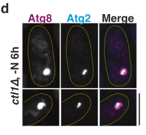

## Question

# Gene Research for Functional Annotation

## ⚠️ CRITICAL: Gene/Protein Identification Context

**BEFORE YOU BEGIN RESEARCH:** You MUST verify you are researching the CORRECT gene/protein. Gene symbols can be ambiguous, especially for less well-characterized genes from non-model organisms.

### Target Gene/Protein Identity (from UniProt):
- **UniProt Accession:** O94649
- **Protein Description:** RecName: Full=Autophagy-related protein 2; AltName: Full=Meiotically up-regulated gene 36 protein;
- **Gene Information:** Name=atg2; Synonyms=mug36; ORFNames=SPBC31E1.01c, SPBC660.18c;
- **Organism (full):** Schizosaccharomyces pombe (strain 972 / ATCC 24843) (Fission yeast).
- **Protein Family:** Belongs to the ATG2 family. .
- **Key Domains:** ATG2. (IPR026849); ATG2_CAD (PF13329)

### MANDATORY VERIFICATION STEPS:

1. **Check if the gene symbol "atg2" matches the protein description above**
2. **Verify the organism is correct:** Schizosaccharomyces pombe (strain 972 / ATCC 24843) (Fission yeast).
3. **Check if protein family/domains align with what you find in literature**
4. **If you find literature for a DIFFERENT gene with the same or similar symbol, STOP**

### If Gene Symbol is Ambiguous or You Cannot Find Relevant Literature:

**DO NOT PROCEED WITH RESEARCH ON A DIFFERENT GENE.** Instead:
- State clearly: "The gene symbol 'atg2' is ambiguous or literature is limited for this specific protein"
- Explain what you found (e.g., "Found extensive literature on a different gene with the same symbol in a different organism")
- Describe the protein based ONLY on the UniProt information provided above
- Suggest that the protein function can be inferred from domain/family information

### Research Target:

Please provide a comprehensive research report on the gene **atg2** (gene ID: atg2, UniProt: O94649) in SCHPO.

The research report should be a detailed narrative explaining the function, biological processes, and localization of the gene product. Citations should be given for all claims.

You should prioritize authoritative reviews and primary scientific literature when conducting research. You can supplement
this with annotations you find in gene/protein databases, but these can be outdated or inaccurate.

We are specifically interested in the primary function of the gene - for enzymes, what reaction is catalyzed, and what is the substrate specificity? For transporters, what is the substrate? For structural proteins or adapters, what is the broader structural role? For signaling molecules, what is the role in the pathway.

We are interested in where in or outside the cell the gene product carries out its function.

We are also interested in the signaling or biochemical pathways in which the gene functions. We are less interested in broad pleiotropic effects, except where these elucidate the precise role.

Include evidence where possible. We are interested in both experimental evidence as well as inference from structure, evolution, or bioinformatic analysis. Precise studies should be prioritized over high-throughput, where available.

## Output

Question: You are an expert researcher providing comprehensive, well-cited information.

Provide detailed information focusing on:
1. Key concepts and definitions with current understanding
2. Recent developments and latest research (prioritize 2023-2024 sources)
3. Current applications and real-world implementations
4. Expert opinions and analysis from authoritative sources
5. Relevant statistics and data from recent studies

Format as a comprehensive research report with proper citations. Include URLs and publication dates where available.
Always prioritize recent, authoritative sources and provide specific citations for all major claims.

# Gene Research for Functional Annotation

## ⚠️ CRITICAL: Gene/Protein Identification Context

**BEFORE YOU BEGIN RESEARCH:** You MUST verify you are researching the CORRECT gene/protein. Gene symbols can be ambiguous, especially for less well-characterized genes from non-model organisms.

### Target Gene/Protein Identity (from UniProt):
- **UniProt Accession:** O94649
- **Protein Description:** RecName: Full=Autophagy-related protein 2; AltName: Full=Meiotically up-regulated gene 36 protein;
- **Gene Information:** Name=atg2; Synonyms=mug36; ORFNames=SPBC31E1.01c, SPBC660.18c;
- **Organism (full):** Schizosaccharomyces pombe (strain 972 / ATCC 24843) (Fission yeast).
- **Protein Family:** Belongs to the ATG2 family. .
- **Key Domains:** ATG2. (IPR026849); ATG2_CAD (PF13329)

### MANDATORY VERIFICATION STEPS:

1. **Check if the gene symbol "atg2" matches the protein description above**
2. **Verify the organism is correct:** Schizosaccharomyces pombe (strain 972 / ATCC 24843) (Fission yeast).
3. **Check if protein family/domains align with what you find in literature**
4. **If you find literature for a DIFFERENT gene with the same or similar symbol, STOP**

### If Gene Symbol is Ambiguous or You Cannot Find Relevant Literature:

**DO NOT PROCEED WITH RESEARCH ON A DIFFERENT GENE.** Instead:
- State clearly: "The gene symbol 'atg2' is ambiguous or literature is limited for this specific protein"
- Explain what you found (e.g., "Found extensive literature on a different gene with the same symbol in a different organism")
- Describe the protein based ONLY on the UniProt information provided above
- Suggest that the protein function can be inferred from domain/family information

### Research Target:

Please provide a comprehensive research report on the gene **atg2** (gene ID: atg2, UniProt: O94649) in SCHPO.

The research report should be a detailed narrative explaining the function, biological processes, and localization of the gene product. Citations should be given for all claims.

You should prioritize authoritative reviews and primary scientific literature when conducting research. You can supplement
this with annotations you find in gene/protein databases, but these can be outdated or inaccurate.

We are specifically interested in the primary function of the gene - for enzymes, what reaction is catalyzed, and what is the substrate specificity? For transporters, what is the substrate? For structural proteins or adapters, what is the broader structural role? For signaling molecules, what is the role in the pathway.

We are interested in where in or outside the cell the gene product carries out its function.

We are also interested in the signaling or biochemical pathways in which the gene functions. We are less interested in broad pleiotropic effects, except where these elucidate the precise role.

Include evidence where possible. We are interested in both experimental evidence as well as inference from structure, evolution, or bioinformatic analysis. Precise studies should be prioritized over high-throughput, where available.

## Research report: Functional annotation of *Schizosaccharomyces pombe* Atg2 (mug36; UniProt O94649)

### 0) Target verification (mandatory)
The research target is **Atg2** from **fission yeast *Schizosaccharomyces pombe* strain 972**, also known as **mug36**, reported in the fission-yeast autophagy literature as **atg2Δ** and associated with the fission-yeast autophagy factor set (e.g., in systematic genetic/localization work). (sun2013globalanalysisof pages 3-5, sun2013globalanalysisof pages 7-10, xu2022fissionyeastautophagy pages 5-7)

**Important disambiguation:** “Atg2/ATG2” is a conserved autophagy gene family across eukaryotes; mechanistic work in budding yeast and mammals is used below only as **conserved background** and is labeled as such, while **S. pombe-specific claims** are supported by **S. pombe** studies. (kotani2018theatg2atg18complex pages 1-2, gomezsanchez2018atg9establishesatg2dependent pages 21-21, duarte2023theorganizationand pages 5-7)

### 1) Key concepts and definitions (current understanding)

#### 1.1 Macroautophagy, phagophore/PAS, and where Atg2 fits
Macroautophagy (“autophagy”) proceeds through assembly of a **phagophore** (isolation membrane) that expands and closes into a double-membrane autophagosome. In yeast, many autophagy factors concentrate at the **PAS (phagophore assembly site)**. In fission yeast, Atg2 is treated as part of the core autophagosome biogenesis machinery and is recruited to the PAS in an Atg18-family-dependent manner (review synthesis). (xu2022fissionyeastautophagy pages 4-5, xu2022fissionyeastautophagy pages 5-7)

#### 1.2 ATG2/Atg2 family: conserved functional model (lipid transfer + tethering)
A widely supported model (largely from budding yeast and mammalian systems) is that **ATG2/Atg2 is a rod-like, bridge-like lipid transfer protein** that operates at **phagophore–ER membrane contact sites**, providing lipid flux to support phagophore expansion; Atg2 also acts as a **tether** between membranes. (duarte2023theorganizationand pages 4-5, duarte2023theorganizationand pages 5-7, duarte2023theorganizationand pages 7-9)

A second core concept is **cooperation between ATG2 and ATG9**: ATG2 provides non-vesicular lipid transfer, while **ATG9 functions as a lipid scramblase** to equilibrate lipids across bilayer leaflets, enabling net membrane expansion. (duarte2023theorganizationand pages 13-14, choi2024emergingrolesof pages 7-8, duarte2023theorganizationand pages 4-5)

### 2) Organism-specific functional annotation: what is known in *S. pombe*

#### 2.1 Primary biological role
In *S. pombe*, **Atg2 is required for starvation-induced bulk autophagy** as measured by the standard **CFP-Atg8 processing assay**: **atg2Δ** mutants fail to show CFP-Atg8 processing under nitrogen starvation, indicating blocked autophagy flux. (sun2013globalanalysisof pages 3-5)

#### 2.2 Phenotypes and pathway position inferred from Atg8 dynamics
Live-cell imaging in *S. pombe* shows that **atg2Δ** mutants form **Atg8 puncta that are abnormally numerous and long-lived**, consistent with impaired progression/maturation of autophagic structures. (sun2013globalanalysisof pages 3-5)

These phenotypes position Atg2 as a factor required for normal phagophore/autophagosome biogenesis dynamics rather than merely for autophagosome-vacuole fusion. (sun2013globalanalysisof pages 3-5)

#### 2.3 Localization: PAS/phagophore rim (direct S. pombe evidence)
A key advance for *S. pombe* Atg2 localization comes from high-resolution imaging/EM in 2023. In *S. pombe*, Atg2 is described as residing at the **phagophore rim**, a highly curved region (reported rim diameter **~15–17 nm**), and Atg2 is among factors thought to localize to this rim. (wang2023aconservedmembrane pages 1-3)

Wang et al. (2023) directly support rim/tip localization in *S. pombe* using:
- **Fluorescence microscopy**: in **ctl1Δ** cells with enlarged phagophores, **Atg2 localizes to a sub-region** of the Atg8-positive structure (consistent with subdomain/rim restriction). (wang2023aconservedmembrane pages 8-10, wang2023aconservedmembrane media e70bb975)
- **APEX2 EM labeling**: **Atg2-APEX2 electron-dense precipitate concentrates at the tips/rims** of cup-shaped phagophores, whereas Atg5 shows more even distribution, supporting specific Atg2 enrichment at phagophore extremities. (wang2023aconservedmembrane pages 8-10, wang2023aconservedmembrane media e70bb975)

**Quantitative localization statistic:** Wang et al. quantify that **~80% of open phagophores exhibit rim labeling for Atg2** by APEX2 EM. (wang2023aconservedmembrane media e70bb975)

(Visual evidence is provided in cropped Figure 6 panels showing Atg2 subdomain localization and APEX2 EM rim labeling/quantification.) (wang2023aconservedmembrane media e70bb975, wang2023aconservedmembrane media 0cd67841, wang2023aconservedmembrane media fe55a58b)

#### 2.4 Interacting/functional partners and trafficking roles (Atg9, Ctl1, Atg18)
**Atg9 and Ctl1 recycling from the PAS depends on Atg2:** In starved *S. pombe* **atg2Δ** (and atg1Δ) cells, **Atg9 puncta almost completely overlap with Atg8 puncta**, leading to the conclusion that **Atg9 recycling from PAS requires Atg1 and Atg2**. (sun2013globalanalysisof pages 7-10)

Similarly, **Ctl1 becomes largely restricted to the PAS** in starved **atg2Δ** cells, indicating Atg2 is also required for Ctl1 recycling/retrograde trafficking away from the PAS. (sun2013globalanalysisof pages 7-10)

**Atg9–Ctl1 physical association:** Atg9 and Ctl1 **co-immunoprecipitate** in *S. pombe*, supporting that these proteins operate in a shared module whose correct cycling/localization requires Atg2. (sun2013globalanalysisof pages 7-10)

**Atg18-family linkage (review synthesis in S. pombe):** The fission-yeast review states that Atg2 is recruited to the PAS, and that **Atg18a promotes PAS targeting of Atg2** (noted as unpublished in the review). The review also states that deletion of **atg1 or atg2** restricts **Atg9 and Ctl1** to the PAS, reinforcing the primary-study findings. (xu2022fissionyeastautophagy pages 4-5, xu2022fissionyeastautophagy pages 5-7)

### 3) Mechanistic interpretation: what can be inferred from conserved ATG2 biology (clearly labeled as inference)

Although direct biochemical lipid-transfer measurements for *S. pombe* Atg2 were not found in the retrieved *S. pombe* texts, mechanistic work in other systems provides a coherent model consistent with *S. pombe* phenotypes and rim localization.

#### 3.1 Budding yeast Atg2 as ER–phagophore tether (conserved background)
In *S. cerevisiae*, Atg2 forms a complex with Atg18 and **tethers pre-autophagosomal membranes to the ER**, with distinct membrane-binding regions at the N- and C-termini; loss of Atg2–Atg18 blocks isolation membrane formation even when other Atg proteins accumulate at PAS. (kotani2018theatg2atg18complex pages 1-2)

#### 3.2 Phagophore–ER contact site organization (2023 review)
A 2023 review on phagophore–ER membrane contact sites summarizes that ATG2 proteins are rod-like (~20 nm) bridge-like factors with lipid-handling features (hydrophobic groove/RBG modules) and that Atg2/ATG2 has membrane-binding sites at both ends—an N-terminal ER-associated lipid-transfer module and a C-terminal region involved in phagophore association and interaction with Atg9 and Atg18/WIPI proteins. (duarte2023theorganizationand pages 4-5, duarte2023theorganizationand pages 5-7, duarte2023theorganizationand pages 7-9)

#### 3.3 ATG9–ATG2 cooperation and scramblase/bridge model (2023–2024 synthesis)
The same review emphasizes that ATG9/Atg9 is now strongly supported as a lipid scramblase and that ATG2 (and VPS13-family bridges) mediate lipid transfer to growing phagophores; together, these data support a model where ATG2 supplies lipids while ATG9 equilibrates lipids across leaflets to enable bilayer expansion. (duarte2023theorganizationand pages 13-14, duarte2023theorganizationand pages 4-5, duarte2023theorganizationand pages 1-2)

A 2024 review focused on ATG9/ATG9A similarly describes a cooperative model in which ATG9 and ATG2 function at ER–phagophore contact sites to drive phagophore expansion, while noting open questions such as how cells enforce directionality of lipid flow. (choi2024emergingrolesof pages 7-8)

### 4) Recent developments (prioritizing 2023–2024)

#### 4.1 *S. pombe* (2023): high-resolution localization at the phagophore rim
Wang et al. (Aug 2023, *Nature Communications*) provide a strong *S. pombe*-specific advance by placing Atg2 at the phagophore rim/tips via APEX2 EM and by quantifying rim labeling in ~80% of open phagophores, giving high-confidence spatial context for function. (wang2023aconservedmembrane media e70bb975, wang2023aconservedmembrane pages 8-10)

#### 4.2 Field-wide (2023): emphasis on phagophore–ER contact sites as functional units
Duarte & Reggiori (Jan 2023, *Contact*) highlight phagophore–ER membrane contact sites as organizational centers where ATG2, ATG9, and Atg18/WIPI accumulate and act, and summarize a shift from vesicle-fusion-only models toward a lipid-transfer/scrambling framework for membrane growth. (duarte2023theorganizationand pages 1-2, duarte2023theorganizationand pages 13-14)

#### 4.3 Mammalian (2024): alternative lipid sources and new bridging factors
Wei et al. (Apr 2024, *Cell Discovery*) identify **ANKFY1** as an ATG2A-binding FYVE-domain protein that binds PI3P and recruits/anchors ATG2A to PI3P-rich endosomal membranes; **ANKFY1 approximately doubles ATG2A-mediated lipid transfer** in an in vitro assay, and ANKFY1 depletion phenocopies ATG2A/B depletion (reduced autophagy flux, impaired autophagosome growth/closure). This expands the prevailing view that the ER is the only lipid donor by adding an endosomal lipid-transfer route to phagophores. (wei2024ankfy1bridgesatg2amediated pages 10-12, wei2024ankfy1bridgesatg2amediated pages 1-2, wei2024ankfy1bridgesatg2amediated pages 4-8)

### 5) Current applications and real-world implementations

#### 5.1 *S. pombe* Atg2 as a model for conserved autophagy membrane growth
Because ATG2 family proteins are central to autophagosome biogenesis, *S. pombe* Atg2 is practically used as a **genetically tractable model** to interrogate conserved principles of membrane growth and organelle contact-site biology. The combination of strong loss-of-function phenotypes (blocked CFP-Atg8 processing) and high-resolution localization (phagophore rim) provides an experimentally robust system for mechanistic dissection. (sun2013globalanalysisof pages 3-5, wang2023aconservedmembrane media e70bb975)

#### 5.2 Translational relevance: autophagy modulation in disease contexts (mechanistic bridge)
In mammals, ATG2-dependent lipid transfer and the ATG2–ATG9 partnership are active targets of mechanistic cell biology because autophagy influences neurodegeneration, infection biology, cancer, and metabolic disease; the 2024 ANKFY1 work illustrates that identifying **new regulators of ATG2-mediated lipid flux** can reveal new intervention points or biomarkers of autophagosome growth/closure. (wei2024ankfy1bridgesatg2amediated pages 10-12, wei2024ankfy1bridgesatg2amediated pages 4-8, choi2024emergingrolesof pages 7-8)

### 6) Expert opinions / authoritative synthesis (what experts emphasize)

Two authoritative recent reviews converge on the following expert consensus and open questions:
1) **Consensus:** phagophore growth is driven largely by **lipid transfer at membrane contact sites**, with ATG2/Atg2 as a key bridge-like lipid-transfer factor and ATG9 as a scramblase. (duarte2023theorganizationand pages 1-2, choi2024emergingrolesof pages 7-8)
2) **Open questions:** precise molecular coordination among ATG2, ATG9, and Atg18/WIPI (timing, directionality, and regulation of lipid flow) remains incompletely resolved. (duarte2023theorganizationand pages 1-2, choi2024emergingrolesof pages 7-8)

### 7) Key quantitative statistics and data (recent studies)

**In *S. pombe* (Wang et al., 2023):**
- **~80%** of open phagophores show **Atg2 rim labeling** by APEX2 EM. (wang2023aconservedmembrane media e70bb975)
- Following nitrogen starvation, **>80%** of phagophores marked by Atg8 or Atg2 contain **Rop1**, consistent with early co-recruitment. (wang2023aconservedmembrane pages 8-10)
- Phagophore rim diameter reported as **~15–17 nm** (provides scale for curvature at the Atg2-enriched rim). (wang2023aconservedmembrane pages 1-3)

**In mammalian mechanistic reconstitution (Wei et al., 2024):**
- **ANKFY1 approximately doubles ATG2A-mediated lipid transfer** in vitro in a FRET-based liposome assay; enhancement depends on PI3P and ANKFY1 FYVE domain integrity. (wei2024ankfy1bridgesatg2amediated pages 10-12)

### 8) Summary functional annotation for UniProt O94649 (Atg2/mug36) in *S. pombe*

**Primary function (cell biological):** Atg2 is an essential factor for starvation-induced macroautophagy in *S. pombe* and is required for normal phagophore/autophagosome biogenesis dynamics. (sun2013globalanalysisof pages 3-5)

**Likely mechanistic role in *S. pombe* (supported by localization + conserved model):** Atg2 localizes to the **phagophore rim/tips**, consistent with an organizational role at membrane contact sites that support phagophore expansion; its loss leads to accumulation of stalled Atg8 structures. (wang2023aconservedmembrane media e70bb975, sun2013globalanalysisof pages 3-5)

**Localization:** PAS/phagophore-associated, enriched at rims/tips of cup-shaped phagophores by APEX2 EM; subdomain localization on enlarged phagophores in ctl1Δ. (wang2023aconservedmembrane media e70bb975, wang2023aconservedmembrane pages 8-10)

**Pathway/module membership:** Functionally linked to the **Atg9/Ctl1** trafficking/cycling module; Atg2 is required for recycling of Atg9 and Ctl1 away from PAS under starvation; Ctl1 and Atg9 physically associate. (sun2013globalanalysisof pages 7-10)

### 9) Evidence table
| Aspect (function/localization/partner/phenotype/quant data) | Key finding | Experimental basis (assay) | Organism/system | Citation (author year journal) + URL | Context ID |
|---|---|---|---|---|---|
| function | **S. pombe-specific:** Atg2 is required for starvation-induced autophagy; atg2Δ lacked CFP-Atg8 processing, consistent with blocked autophagy flux. | CFP-Atg8 processing assay under nitrogen starvation | *Schizosaccharomyces pombe* | Sun et al. 2013, *PLoS Genetics* — https://doi.org/10.1371/journal.pgen.1003715 | (sun2013globalanalysisof pages 3-5) |
| phenotype | **S. pombe-specific:** atg2Δ cells showed Atg8 puncta that were more numerous than wild type and long-lived, indicating defective progression/maturation of autophagic structures. | Time-lapse fluorescence microscopy of Atg8 puncta | *Schizosaccharomyces pombe* | Sun et al. 2013, *PLoS Genetics* — https://doi.org/10.1371/journal.pgen.1003715 | (sun2013globalanalysisof pages 3-5) |
| partner/localization | **S. pombe-specific:** Atg2 is required for retrograde trafficking of Atg9 from the PAS; in starved atg2Δ cells, Atg9 puncta almost completely overlapped with Atg8 puncta, indicating PAS retention. | Fluorescent protein co-localization microscopy (Atg9 with Atg8) in mutants | *Schizosaccharomyces pombe* | Sun et al. 2013, *PLoS Genetics* — https://doi.org/10.1371/journal.pgen.1003715 | (sun2013globalanalysisof pages 7-10) |
| partner/localization | **S. pombe-specific:** Ctl1 became largely restricted to the PAS in starved atg2Δ cells, supporting an Atg2-dependent recycling step for Ctl1 as well as Atg9. | Fluorescent localization of YFP-Ctl1 with Atg8 in mutants | *Schizosaccharomyces pombe* | Sun et al. 2013, *PLoS Genetics* — https://doi.org/10.1371/journal.pgen.1003715 | (sun2013globalanalysisof pages 7-10) |
| partner | **S. pombe-specific:** Ctl1 physically interacts with Atg9; together with the atg2Δ localization phenotype, this places Atg2 in the Atg9/Ctl1 trafficking module at the PAS. | Co-immunoprecipitation plus localization genetics | *Schizosaccharomyces pombe* | Sun et al. 2013, *PLoS Genetics* — https://doi.org/10.1371/journal.pgen.1003715 | (sun2013globalanalysisof pages 7-10) |
| localization | **S. pombe-specific:** Atg2 localizes to a sub-region of enlarged Atg8-positive phagophores in ctl1Δ cells, consistent with phagophore rim/subdomain localization rather than uniform distribution. | Dual-color fluorescence microscopy (Atg2-tdT with Atg8 marker) | *Schizosaccharomyces pombe* | Wang et al. 2023, *Nature Communications* — https://doi.org/10.1038/s41467-023-40530-4 | (wang2023aconservedmembrane pages 8-10, wang2023aconservedmembrane media e70bb975) |
| localization | **S. pombe-specific:** APEX2 EM labeling placed Atg2 at the tips/rims of cup-shaped phagophores; unlike Atg5, labeling was not evenly distributed over the phagophore. | Correlative ultrastructure with APEX2 electron microscopy | *Schizosaccharomyces pombe* | Wang et al. 2023, *Nature Communications* — https://doi.org/10.1038/s41467-023-40530-4 | (wang2023aconservedmembrane pages 8-10, wang2023aconservedmembrane media e70bb975) |
| quant data | **S. pombe-specific:** In Wang et al., approximately **80%** of open phagophores showed rim labeling for Atg2 by APEX2 EM quantification. | Quantified APEX2 EM localization | *Schizosaccharomyces pombe* | Wang et al. 2023, *Nature Communications* — https://doi.org/10.1038/s41467-023-40530-4 | (wang2023aconservedmembrane media e70bb975) |
| quant data | **S. pombe-specific:** Following nitrogen starvation, **>80%** of Atg8- or Atg2-marked phagophores contained Rop1, supporting early co-recruitment of a curvature factor with Atg2 at forming phagophores. | Live-cell fluorescence microscopy and colocalization quantification | *Schizosaccharomyces pombe* | Wang et al. 2023, *Nature Communications* — https://doi.org/10.1038/s41467-023-40530-4 | (wang2023aconservedmembrane pages 8-10) |
| localization/quant data | **S. pombe-specific:** Wang et al. discuss Atg2 at the highly curved phagophore rim; the reported yeast phagophore rim diameter is about **15–17 nm**, consistent with Atg2 acting at extreme membrane curvature. | Ultrastructural interpretation integrated with localization data | *Schizosaccharomyces pombe* | Wang et al. 2023, *Nature Communications* — https://doi.org/10.1038/s41467-023-40530-4 | (wang2023aconservedmembrane pages 1-3) |
| localization/partner | **S. pombe-specific review:** Atg2 is recruited to the PAS, and Atg18a promotes PAS targeting of Atg2; deletion of atg1 or atg2 restricts Atg9 and Ctl1 localization to the PAS. | Review synthesis of fluorescence localization/genetic studies | *Schizosaccharomyces pombe* | Xu & Du 2022, *Cells* — https://doi.org/10.3390/cells11071086 | (xu2022fissionyeastautophagy pages 5-7, xu2022fissionyeastautophagy pages 7-8, xu2022fissionyeastautophagy pages 4-5) |
| function/localization | **Non-S. pombe / inferred:** Current consensus model is that ATG2/Atg2 is a rod-like lipid transfer protein and tether at phagophore-ER membrane contact sites, with an N-terminal ER-associated lipid-transfer module and C-terminal phagophore-binding region acting with Atg9 and Atg18/WIPI proteins. | Review of structural, biochemical, and cell-biological studies | Mainly budding yeast and mammalian systems; **inferred to S. pombe by conservation** | Duarte & Reggiori 2023, *Contact* — https://doi.org/10.1177/25152564231183898 | (duarte2023theorganizationand pages 4-5, duarte2023theorganizationand pages 5-7, duarte2023theorganizationand pages 7-9, duarte2023theorganizationand pages 1-2) |
| partner/function | **Non-S. pombe / inferred:** ATG2 works cooperatively with ATG9, which acts as a lipid scramblase; the combined model is that ATG2 transfers lipids into the phagophore while ATG9 equilibrates lipids across leaflets to support membrane expansion. | Review of recent cryo-EM, biochemical reconstitution, and genetics | Yeast and mammalian systems; **inferred to S. pombe by conservation** | Duarte & Reggiori 2023, *Contact* — https://doi.org/10.1177/25152564231183898; Choi et al. 2024, *Autophagy* — https://doi.org/10.1080/15548627.2024.2384349 | (duarte2023theorganizationand pages 13-14, duarte2023theorganizationand pages 4-5, choi2024emergingrolesof pages 7-8) |
| function/localization | **Non-S. pombe / inferred:** Budding-yeast Atg2-Atg18 tethers pre-autophagosomal membranes to the ER; Atg2 has membrane-binding regions at both ends, and loss of the complex blocks isolation membrane formation despite PAS accumulation of other Atg proteins. | Primary mechanistic study using mutagenesis, in vitro liposome tethering, PAS/ER localization assays | *Saccharomyces cerevisiae*; **mechanistic inference for S. pombe homolog** | Kotani et al. 2018, *PNAS* — https://doi.org/10.1073/pnas.1806727115 | (kotani2018theatg2atg18complex pages 1-2) |
| partner/localization | **Non-S. pombe / inferred:** Atg9 helps establish Atg2-dependent ER-phagophore contact sites and confines Atg2 to phagophore extremities; disrupting Atg2-Atg9 interaction causes abnormal Atg2/ER-contact distribution and severe autophagy defects. | Primary mechanistic study with Atg2 point mutants, localization analysis, and ultrastructure | *Saccharomyces cerevisiae*; **mechanistic inference for S. pombe homolog** | Gómez-Sánchez et al. 2018, *Journal of Cell Biology* — https://doi.org/10.1083/jcb.201710116 | (gomezsanchez2018atg9establishesatg2dependent pages 21-21) |

*Table: This table compiles organism-specific evidence for Schizosaccharomyces pombe Atg2/mug36 and separates it from mechanistic inferences drawn from conserved Atg2 studies in other systems. It is useful for distinguishing direct annotation evidence from broader family-level functional models.*

### 10) Key source list with URLs and publication dates
- Sun L-L et al. **(2013-08)**. *PLoS Genetics*. “Global Analysis of Fission Yeast Mating Genes Reveals New Autophagy Factors.” https://doi.org/10.1371/journal.pgen.1003715 (sun2013globalanalysisof pages 3-5, sun2013globalanalysisof pages 7-10)
- Xu D-D, Du L-L. **(2022-03)**. *Cells*. “Fission Yeast Autophagy Machinery.” https://doi.org/10.3390/cells11071086 (xu2022fissionyeastautophagy pages 5-7, xu2022fissionyeastautophagy pages 4-5)
- Wang N et al. **(2023-08)**. *Nature Communications*. “A conserved membrane curvature-generating protein is crucial for autophagosome formation in fission yeast.” https://doi.org/10.1038/s41467-023-40530-4 (wang2023aconservedmembrane media e70bb975, wang2023aconservedmembrane pages 8-10, wang2023aconservedmembrane pages 1-3)
- Duarte PV, Reggiori F. **(2023-01)**. *Contact*. “The Organization and Function of the Phagophore-ER Membrane Contact Sites.” https://doi.org/10.1177/25152564231183898 (duarte2023theorganizationand pages 1-2, duarte2023theorganizationand pages 5-7)
- Choi J et al. **(2024-08)**. *Autophagy*. “Emerging roles of ATG9/ATG9A in autophagy: implications for cell and neurobiology.” https://doi.org/10.1080/15548627.2024.2384349 (choi2024emergingrolesof pages 7-8)
- Wei B et al. **(2024-04)**. *Cell Discovery*. “ANKFY1 bridges ATG2A-mediated lipid transfer from endosomes to phagophores.” https://doi.org/10.1038/s41421-024-00659-y (wei2024ankfy1bridgesatg2amediated pages 10-12, wei2024ankfy1bridgesatg2amediated pages 4-8)

### Limitations of the current evidence set
Direct biochemical demonstration of **lipid-transfer activity for *S. pombe* Atg2 itself** (e.g., purified SpAtg2 lipid-transfer kinetics) was not located in the retrieved *S. pombe* texts; the lipid-transfer/tether model is therefore presented as **conserved mechanistic inference** supported by authoritative reviews and non-*S. pombe* primary studies, while the **core *S. pombe* phenotypes and localization** are directly evidenced as above. (duarte2023theorganizationand pages 5-7, kotani2018theatg2atg18complex pages 1-2, wang2023aconservedmembrane media e70bb975)

References

1. (sun2013globalanalysisof pages 3-5): Ling-Ling Sun, Ming Li, Fang Suo, Xiao-Man Liu, En-Zhi Shen, Bing Yang, Meng-Qiu Dong, Wan-Zhong He, and Li-Lin Du. Global analysis of fission yeast mating genes reveals new autophagy factors. PLoS Genetics, 9:e1003715, Aug 2013. URL: https://doi.org/10.1371/journal.pgen.1003715, doi:10.1371/journal.pgen.1003715. This article has 123 citations and is from a domain leading peer-reviewed journal.

2. (sun2013globalanalysisof pages 7-10): Ling-Ling Sun, Ming Li, Fang Suo, Xiao-Man Liu, En-Zhi Shen, Bing Yang, Meng-Qiu Dong, Wan-Zhong He, and Li-Lin Du. Global analysis of fission yeast mating genes reveals new autophagy factors. PLoS Genetics, 9:e1003715, Aug 2013. URL: https://doi.org/10.1371/journal.pgen.1003715, doi:10.1371/journal.pgen.1003715. This article has 123 citations and is from a domain leading peer-reviewed journal.

3. (xu2022fissionyeastautophagy pages 5-7): Dan-Dan Xu and Li-Lin Du. Fission yeast autophagy machinery. Cells, 11:1086, Mar 2022. URL: https://doi.org/10.3390/cells11071086, doi:10.3390/cells11071086. This article has 29 citations.

4. (kotani2018theatg2atg18complex pages 1-2): Tetsuya Kotani, Hiromi Kirisako, Michiko Koizumi, Yoshinori Ohsumi, and Hitoshi Nakatogawa. The atg2-atg18 complex tethers pre-autophagosomal membranes to the endoplasmic reticulum for autophagosome formation. Proceedings of the National Academy of Sciences, 115:10363-10368, Sep 2018. URL: https://doi.org/10.1073/pnas.1806727115, doi:10.1073/pnas.1806727115. This article has 328 citations and is from a highest quality peer-reviewed journal.

5. (gomezsanchez2018atg9establishesatg2dependent pages 21-21): Rubén Gómez-Sánchez, Jaqueline Rose, Rodrigo Guimarães, Muriel Mari, Daniel Papinski, Ester Rieter, Willie J. Geerts, Ralph Hardenberg, Claudine Kraft, Christian Ungermann, and Fulvio Reggiori. Atg9 establishes atg2-dependent contact sites between the endoplasmic reticulum and phagophores. The Journal of Cell Biology, 217:2743-2763, May 2018. URL: https://doi.org/10.1083/jcb.201710116, doi:10.1083/jcb.201710116. This article has 319 citations.

6. (duarte2023theorganizationand pages 5-7): Prado Vargas Duarte and Fulvio Reggiori. The organization and function of the phagophore-er membrane contact sites. Contact, Jan 2023. URL: https://doi.org/10.1177/25152564231183898, doi:10.1177/25152564231183898. This article has 14 citations.

7. (xu2022fissionyeastautophagy pages 4-5): Dan-Dan Xu and Li-Lin Du. Fission yeast autophagy machinery. Cells, 11:1086, Mar 2022. URL: https://doi.org/10.3390/cells11071086, doi:10.3390/cells11071086. This article has 29 citations.

8. (duarte2023theorganizationand pages 4-5): Prado Vargas Duarte and Fulvio Reggiori. The organization and function of the phagophore-er membrane contact sites. Contact, Jan 2023. URL: https://doi.org/10.1177/25152564231183898, doi:10.1177/25152564231183898. This article has 14 citations.

9. (duarte2023theorganizationand pages 7-9): Prado Vargas Duarte and Fulvio Reggiori. The organization and function of the phagophore-er membrane contact sites. Contact, Jan 2023. URL: https://doi.org/10.1177/25152564231183898, doi:10.1177/25152564231183898. This article has 14 citations.

10. (duarte2023theorganizationand pages 13-14): Prado Vargas Duarte and Fulvio Reggiori. The organization and function of the phagophore-er membrane contact sites. Contact, Jan 2023. URL: https://doi.org/10.1177/25152564231183898, doi:10.1177/25152564231183898. This article has 14 citations.

11. (choi2024emergingrolesof pages 7-8): Jiyoung Choi, Haeun Jang, Zhao Xuan, and Daehun Park. Emerging roles of atg9/atg9a in autophagy: implications for cell and neurobiology. Autophagy, 20:2373-2387, Aug 2024. URL: https://doi.org/10.1080/15548627.2024.2384349, doi:10.1080/15548627.2024.2384349. This article has 25 citations and is from a domain leading peer-reviewed journal.

12. (wang2023aconservedmembrane pages 1-3): Ning Wang, Yoko Shibata, Joao A. Paulo, Steven P. Gygi, and Tom A. Rapoport. A conserved membrane curvature-generating protein is crucial for autophagosome formation in fission yeast. Nature Communications, Aug 2023. URL: https://doi.org/10.1038/s41467-023-40530-4, doi:10.1038/s41467-023-40530-4. This article has 24 citations and is from a highest quality peer-reviewed journal.

13. (wang2023aconservedmembrane pages 8-10): Ning Wang, Yoko Shibata, Joao A. Paulo, Steven P. Gygi, and Tom A. Rapoport. A conserved membrane curvature-generating protein is crucial for autophagosome formation in fission yeast. Nature Communications, Aug 2023. URL: https://doi.org/10.1038/s41467-023-40530-4, doi:10.1038/s41467-023-40530-4. This article has 24 citations and is from a highest quality peer-reviewed journal.

14. (wang2023aconservedmembrane media e70bb975): Ning Wang, Yoko Shibata, Joao A. Paulo, Steven P. Gygi, and Tom A. Rapoport. A conserved membrane curvature-generating protein is crucial for autophagosome formation in fission yeast. Nature Communications, Aug 2023. URL: https://doi.org/10.1038/s41467-023-40530-4, doi:10.1038/s41467-023-40530-4. This article has 24 citations and is from a highest quality peer-reviewed journal.

15. (wang2023aconservedmembrane media 0cd67841): Ning Wang, Yoko Shibata, Joao A. Paulo, Steven P. Gygi, and Tom A. Rapoport. A conserved membrane curvature-generating protein is crucial for autophagosome formation in fission yeast. Nature Communications, Aug 2023. URL: https://doi.org/10.1038/s41467-023-40530-4, doi:10.1038/s41467-023-40530-4. This article has 24 citations and is from a highest quality peer-reviewed journal.

16. (wang2023aconservedmembrane media fe55a58b): Ning Wang, Yoko Shibata, Joao A. Paulo, Steven P. Gygi, and Tom A. Rapoport. A conserved membrane curvature-generating protein is crucial for autophagosome formation in fission yeast. Nature Communications, Aug 2023. URL: https://doi.org/10.1038/s41467-023-40530-4, doi:10.1038/s41467-023-40530-4. This article has 24 citations and is from a highest quality peer-reviewed journal.

17. (duarte2023theorganizationand pages 1-2): Prado Vargas Duarte and Fulvio Reggiori. The organization and function of the phagophore-er membrane contact sites. Contact, Jan 2023. URL: https://doi.org/10.1177/25152564231183898, doi:10.1177/25152564231183898. This article has 14 citations.

18. (wei2024ankfy1bridgesatg2amediated pages 10-12): Bin Wei, Yuhui Fu, Xiuzhi Li, Fang Chen, Yiqing Zhang, Hanmo Chen, Mindan Tong, Linsen Li, Yi Pan, Shen Zhang, She Chen, Xiaoxia Liu, and Qing Zhong. Ankfy1 bridges atg2a-mediated lipid transfer from endosomes to phagophores. Cell Discovery, Apr 2024. URL: https://doi.org/10.1038/s41421-024-00659-y, doi:10.1038/s41421-024-00659-y. This article has 13 citations and is from a peer-reviewed journal.

19. (wei2024ankfy1bridgesatg2amediated pages 1-2): Bin Wei, Yuhui Fu, Xiuzhi Li, Fang Chen, Yiqing Zhang, Hanmo Chen, Mindan Tong, Linsen Li, Yi Pan, Shen Zhang, She Chen, Xiaoxia Liu, and Qing Zhong. Ankfy1 bridges atg2a-mediated lipid transfer from endosomes to phagophores. Cell Discovery, Apr 2024. URL: https://doi.org/10.1038/s41421-024-00659-y, doi:10.1038/s41421-024-00659-y. This article has 13 citations and is from a peer-reviewed journal.

20. (wei2024ankfy1bridgesatg2amediated pages 4-8): Bin Wei, Yuhui Fu, Xiuzhi Li, Fang Chen, Yiqing Zhang, Hanmo Chen, Mindan Tong, Linsen Li, Yi Pan, Shen Zhang, She Chen, Xiaoxia Liu, and Qing Zhong. Ankfy1 bridges atg2a-mediated lipid transfer from endosomes to phagophores. Cell Discovery, Apr 2024. URL: https://doi.org/10.1038/s41421-024-00659-y, doi:10.1038/s41421-024-00659-y. This article has 13 citations and is from a peer-reviewed journal.

21. (xu2022fissionyeastautophagy pages 7-8): Dan-Dan Xu and Li-Lin Du. Fission yeast autophagy machinery. Cells, 11:1086, Mar 2022. URL: https://doi.org/10.3390/cells11071086, doi:10.3390/cells11071086. This article has 29 citations.

## Artifacts

- [Edison artifact artifact-00](atg2-deep-research-falcon_artifacts/artifact-00.md)

## Citations

1. sun2013globalanalysisof pages 3-5
2. wang2023aconservedmembrane pages 1-3
3. sun2013globalanalysisof pages 7-10
4. choi2024emergingrolesof pages 7-8
5. wang2023aconservedmembrane pages 8-10
6. xu2022fissionyeastautophagy pages 5-7
7. duarte2023theorganizationand pages 5-7
8. xu2022fissionyeastautophagy pages 4-5
9. duarte2023theorganizationand pages 4-5
10. duarte2023theorganizationand pages 7-9
11. duarte2023theorganizationand pages 13-14
12. duarte2023theorganizationand pages 1-2
13. xu2022fissionyeastautophagy pages 7-8
14. https://doi.org/10.1371/journal.pgen.1003715
15. https://doi.org/10.1038/s41467-023-40530-4
16. https://doi.org/10.3390/cells11071086
17. https://doi.org/10.1177/25152564231183898
18. https://doi.org/10.1177/25152564231183898;
19. https://doi.org/10.1080/15548627.2024.2384349
20. https://doi.org/10.1073/pnas.1806727115
21. https://doi.org/10.1083/jcb.201710116
22. https://doi.org/10.1038/s41421-024-00659-y
23. https://doi.org/10.1371/journal.pgen.1003715,
24. https://doi.org/10.3390/cells11071086,
25. https://doi.org/10.1073/pnas.1806727115,
26. https://doi.org/10.1083/jcb.201710116,
27. https://doi.org/10.1177/25152564231183898,
28. https://doi.org/10.1080/15548627.2024.2384349,
29. https://doi.org/10.1038/s41467-023-40530-4,
30. https://doi.org/10.1038/s41421-024-00659-y,