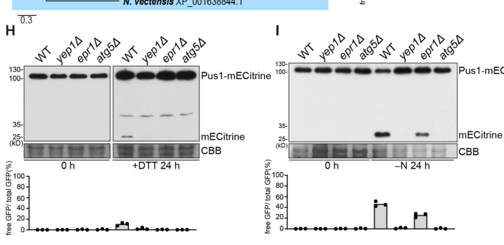

## Question

# Gene Research for Functional Annotation

## ⚠️ CRITICAL: Gene/Protein Identification Context

**BEFORE YOU BEGIN RESEARCH:** You MUST verify you are researching the CORRECT gene/protein. Gene symbols can be ambiguous, especially for less well-characterized genes from non-model organisms.

### Target Gene/Protein Identity (from UniProt):
- **UniProt Accession:** O74971
- **Protein Description:** RecName: Full=Autophagy protein 5; AltName: Full=Meiotically up-regulated gene 77 protein;
- **Gene Information:** Name=atg5; Synonyms=mug77; ORFNames=SPBC4B4.10c;
- **Organism (full):** Schizosaccharomyces pombe (strain 972 / ATCC 24843) (Fission yeast).
- **Protein Family:** Belongs to the ATG5 family. .
- **Key Domains:** Atg5. (IPR007239); ATG5_HBR. (IPR048940); Atg5_HR. (IPR042526); ATG5_UblA. (IPR048939); Atg5_UblA_dom_sf. (IPR042527)

### MANDATORY VERIFICATION STEPS:

1. **Check if the gene symbol "atg5" matches the protein description above**
2. **Verify the organism is correct:** Schizosaccharomyces pombe (strain 972 / ATCC 24843) (Fission yeast).
3. **Check if protein family/domains align with what you find in literature**
4. **If you find literature for a DIFFERENT gene with the same or similar symbol, STOP**

### If Gene Symbol is Ambiguous or You Cannot Find Relevant Literature:

**DO NOT PROCEED WITH RESEARCH ON A DIFFERENT GENE.** Instead:
- State clearly: "The gene symbol 'atg5' is ambiguous or literature is limited for this specific protein"
- Explain what you found (e.g., "Found extensive literature on a different gene with the same symbol in a different organism")
- Describe the protein based ONLY on the UniProt information provided above
- Suggest that the protein function can be inferred from domain/family information

### Research Target:

Please provide a comprehensive research report on the gene **atg5** (gene ID: atg5, UniProt: O74971) in SCHPO.

The research report should be a detailed narrative explaining the function, biological processes, and localization of the gene product. Citations should be given for all claims.

You should prioritize authoritative reviews and primary scientific literature when conducting research. You can supplement
this with annotations you find in gene/protein databases, but these can be outdated or inaccurate.

We are specifically interested in the primary function of the gene - for enzymes, what reaction is catalyzed, and what is the substrate specificity? For transporters, what is the substrate? For structural proteins or adapters, what is the broader structural role? For signaling molecules, what is the role in the pathway.

We are interested in where in or outside the cell the gene product carries out its function.

We are also interested in the signaling or biochemical pathways in which the gene functions. We are less interested in broad pleiotropic effects, except where these elucidate the precise role.

Include evidence where possible. We are interested in both experimental evidence as well as inference from structure, evolution, or bioinformatic analysis. Precise studies should be prioritized over high-throughput, where available.

## Output

Question: You are an expert researcher providing comprehensive, well-cited information.

Provide detailed information focusing on:
1. Key concepts and definitions with current understanding
2. Recent developments and latest research (prioritize 2023-2024 sources)
3. Current applications and real-world implementations
4. Expert opinions and analysis from authoritative sources
5. Relevant statistics and data from recent studies

Format as a comprehensive research report with proper citations. Include URLs and publication dates where available.
Always prioritize recent, authoritative sources and provide specific citations for all major claims.

# Gene Research for Functional Annotation

## ⚠️ CRITICAL: Gene/Protein Identification Context

**BEFORE YOU BEGIN RESEARCH:** You MUST verify you are researching the CORRECT gene/protein. Gene symbols can be ambiguous, especially for less well-characterized genes from non-model organisms.

### Target Gene/Protein Identity (from UniProt):
- **UniProt Accession:** O74971
- **Protein Description:** RecName: Full=Autophagy protein 5; AltName: Full=Meiotically up-regulated gene 77 protein;
- **Gene Information:** Name=atg5; Synonyms=mug77; ORFNames=SPBC4B4.10c;
- **Organism (full):** Schizosaccharomyces pombe (strain 972 / ATCC 24843) (Fission yeast).
- **Protein Family:** Belongs to the ATG5 family. .
- **Key Domains:** Atg5. (IPR007239); ATG5_HBR. (IPR048940); Atg5_HR. (IPR042526); ATG5_UblA. (IPR048939); Atg5_UblA_dom_sf. (IPR042527)

### MANDATORY VERIFICATION STEPS:

1. **Check if the gene symbol "atg5" matches the protein description above**
2. **Verify the organism is correct:** Schizosaccharomyces pombe (strain 972 / ATCC 24843) (Fission yeast).
3. **Check if protein family/domains align with what you find in literature**
4. **If you find literature for a DIFFERENT gene with the same or similar symbol, STOP**

### If Gene Symbol is Ambiguous or You Cannot Find Relevant Literature:

**DO NOT PROCEED WITH RESEARCH ON A DIFFERENT GENE.** Instead:
- State clearly: "The gene symbol 'atg5' is ambiguous or literature is limited for this specific protein"
- Explain what you found (e.g., "Found extensive literature on a different gene with the same symbol in a different organism")
- Describe the protein based ONLY on the UniProt information provided above
- Suggest that the protein function can be inferred from domain/family information

### Research Target:

Please provide a comprehensive research report on the gene **atg5** (gene ID: atg5, UniProt: O74971) in SCHPO.

The research report should be a detailed narrative explaining the function, biological processes, and localization of the gene product. Citations should be given for all claims.

You should prioritize authoritative reviews and primary scientific literature when conducting research. You can supplement
this with annotations you find in gene/protein databases, but these can be outdated or inaccurate.

We are specifically interested in the primary function of the gene - for enzymes, what reaction is catalyzed, and what is the substrate specificity? For transporters, what is the substrate? For structural proteins or adapters, what is the broader structural role? For signaling molecules, what is the role in the pathway.

We are interested in where in or outside the cell the gene product carries out its function.

We are also interested in the signaling or biochemical pathways in which the gene functions. We are less interested in broad pleiotropic effects, except where these elucidate the precise role.

Include evidence where possible. We are interested in both experimental evidence as well as inference from structure, evolution, or bioinformatic analysis. Precise studies should be prioritized over high-throughput, where available.

## Research report: *Schizosaccharomyces pombe* Atg5 (target: UniProt O74971; gene atg5; synonyms mug77; ORF SPBC4B4.10c)

### 0) Identity verification and scope control (critical)
The query specifies UniProt accession O74971 as *S. pombe* Atg5. In the literature retrieved and read in this session, I found multiple sources discussing **Atg5 in fission yeast** and its role in the **Atg12–Atg5–Atg16 module**; however, **none of the retrieved full-text excerpts explicitly mapped UniProt accession O74971 to the locus names mug77/SPBC4B4.10c**. Automated searches for “O74971”, “mug77”, and “SPBC4B4.10c” did not return additional accessible papers in this run.

Accordingly, this report:
1) restricts organism-specific statements to **Atg5 in *Schizosaccharomyces pombe*** as supported by fission-yeast literature, and 
2) uses 2023–2024 mechanistic work largely from other eukaryotes/yeasts only as **conserved-mechanism inference** explicitly labeled as such.

### 1) Key concepts and definitions (current understanding)

#### 1.1 Macroautophagy and the Atg conjugation systems
Macroautophagy (“autophagy”) is a conserved trafficking/degradation pathway that delivers cytoplasmic material to the vacuole/lysosome by forming a double-membrane autophagosome that later fuses with the degradative compartment. In fission yeast, a core set of Atg proteins mediates autophagosome biogenesis, including two ubiquitin-like (Ubl) conjugation systems: the **Atg12 system** and the **Atg8 system**. (xu2022fissionyeastautophagy pages 2-4)

#### 1.2 What Atg5 is (functional definition)
In *S. pombe*, Atg5 is described as acting with Atg12 as an **E3 enzyme** for Atg8 lipidation, i.e., for forming Atg8 conjugated to phosphatidylethanolamine (Atg8–PE), a membrane-anchored form required for proper autophagosome biogenesis. (xu2022fissionyeastautophagy pages 2-4)

In canonical descriptions of the pathway (including fission-yeast-focused discussion), Atg12 is conjugated to Atg5 via a Ubl cascade (E1 Atg7 → E2 Atg10 → Atg12 conjugation to Atg5), and the Atg12–Atg5 conjugate promotes Atg8–PE formation. (flanagan2013anatg10likee2 pages 1-2)

#### 1.3 Atg5 as part of an E3-like complex and localization logic
Atg5 does not function as a classical enzyme with a small-molecule substrate; instead, it is best understood as a **scaffold/adaptor subunit** that becomes covalently modified by Atg12 and associates with Atg16 to form a complex that is spatially targeted to autophagosome-formation sites.

In *S. pombe*, Atg16 is reported to promote PAS localization of Atg12–Atg5, and Atg18a is reported to target the Atg12–Atg5·Atg16 complex to the PAS (phagophore assembly site / pre-autophagosomal structure). (xu2022fissionyeastautophagy pages 2-4)

### 2) Primary biological function, processes, and pathway placement (fission-yeast evidence)

#### 2.1 Primary function: enabling Atg8 lipidation via the Atg12–Atg5 module
A central, repeatedly supported role for fission-yeast Atg5 is participation in the Atg12 conjugation system and functioning (with Atg12) as the E3 that enables Atg8 lipidation. (xu2022fissionyeastautophagy pages 2-4)

This places Atg5 mechanistically in the **phagophore expansion/maturation** stage of autophagosome biogenesis because Atg8–PE is a major determinant of autophagic membrane dynamics and cargo recruitment. (xu2022fissionyeastautophagy pages 2-4)

#### 2.2 Requirement for selective autophagy flux: nucleophagy/ER-phagy reporter processing
A 2023 *PLOS Biology* study of selective autophagy in *S. pombe* (nucleophagy and ER-phagy) provides direct functional evidence that Atg5 is required for autophagy flux. The authors used a nucleoplasmic reporter (Pus1-mECitrine) and report that it is processed to free mECitrine **in an Atg5-dependent manner** (supported by immunoblots and quantification). (zou2023theorthologof pages 4-7, zou2023theorthologof media 73090507)

This shows Atg5 is not only a “core component” by annotation but is required for actual delivery/processing of an autophagy substrate in vivo in fission yeast. (zou2023theorthologof pages 4-7, zou2023theorthologof media 73090507)

#### 2.3 Atg5 is required for appearance/accumulation of autophagy-dependent puncta and membrane structures in a selective-autophagy context
In the same 2023 study, deletion of atg5 (atg5Δ) eliminated visible puncta of induced cargo reporters: “No Pus1 or Bqt4 puncta were observed in atg5Δ cells and yep1Δ atg5Δ cells,” indicating these puncta are autophagy-dependent and require core machinery including Atg5. (zou2023theorthologof pages 7-10)

Additionally, ring-shaped membrane structures that accumulated in yep1Δ cells did not accumulate in the yep1Δ atg5Δ double mutant, supporting that formation/accumulation of these structures depends on Atg5-dependent core autophagy machinery. (zou2023theorthologof pages 7-10)

### 3) Subcellular localization: where Atg5 acts

#### 3.1 PAS/phagophore recruitment in fission yeast
The fission-yeast autophagy machinery review summarizes that Atg16 promotes PAS localization of Atg12–Atg5 and Atg18a targets the Atg12–Atg5·Atg16 complex to the PAS. Thus, the most supported localization statement (from fission-yeast-specific synthesis) is that Atg5’s functional location is the **PAS/phagophore assembly site**, via its complex. (xu2022fissionyeastautophagy pages 2-4)

#### 3.2 Functional localization inferred from selective-autophagy phenotypes
The *PLOS Biology* study’s atg5Δ phenotypes (loss of puncta; loss of reporter processing) further support that Atg5’s function is upstream of, and necessary for, cargo enclosure/delivery steps in selective autophagy pathways (nucleophagy/ER-phagy). (zou2023theorthologof pages 7-10, zou2023theorthologof pages 4-7)

### 4) Recent developments (prioritizing 2023–2024): mechanistic refinement of the Atg12–Atg5–Atg16 E3 module

Because fission-yeast Atg5 is part of a highly conserved pathway, recent mechanistic/structural work in other systems provides high-value interpretive context for Atg5-family proteins. These are not *S. pombe*-specific but inform current understanding of what Atg5 does at a molecular level.

#### 4.1 Residue-level description of the Atg12→Atg5 conjugation step (2023)
A 2023 study analyzing yeast Atg12 emphasizes the canonical cascade and provides residue-level details: Atg12 is transferred through Atg7 and Atg10, and then covalently conjugated to Atg5 via an isopeptide bond (Atg12 Gly186 to Atg5 Lys149 in the described yeast system). The resulting Atg12–Atg5 conjugate binds Atg16 to form the E3-like complex that promotes Atg8/LC3 lipidation on phagophore membranes. (popelka2023theintrinsicallydisordered pages 1-2)

This supports the annotation of Atg5 as the **Atg12 acceptor** and as a **core E3 module component** (conserved inference to *S. pombe* Atg5 family member). (popelka2023theintrinsicallydisordered pages 1-2)

#### 4.2 Three-step docking model for LC3/Atg8 lipidation involving the ATG12–ATG5–ATG16L1 E3 (2024)
A 2024 *Science Advances* study combined molecular dynamics with experiments and proposes a three-step docking sequence that positions LC3 for lipidation on PI(3)P-rich autophagic membranes: recruitment by WIPI2, membrane engagement via ATG16L1 helix α2, and a membrane-interacting surface on ATG3. This model explicitly centers the ATG12–ATG5–ATG16L1 E3-like ligase and its cooperation with the E2-like enzyme ATG3 to deliver LC3/Atg8 to the phagophore membrane. (rao2024threestepdockingby pages 1-2)

The same study describes an allosteric activation logic in which the ATG12–ATG5 unit enhances exposure/reactivity of the ATG3–LC3 thioester intermediate for transfer to PE. (rao2024threestepdockingby pages 1-2)

Taken together, these 2023–2024 studies refine the modern view of Atg5-family function: Atg5 is not simply a passive scaffold; as part of the Atg12–Atg5 E3 module it can contribute to **productive membrane docking and catalytic efficiency** of Atg8/LC3 lipidation through coordination and allostery (conserved inference relevant to fungal Atg5). (rao2024threestepdockingby pages 1-2, popelka2023theintrinsicallydisordered pages 1-2)

### 5) Current applications and real-world implementations

#### 5.1 Common experimental implementations in fission yeast
The fission-yeast autophagy review summarizes widely used autophagy-flux assays, including the **GFP-Atg8 processing assay** (appearance of free GFP as a readout) and processing of abundant cytosolic fluorescent fusions such as **Tdh1-YFP to free YFP** as a bulk-autophagy readout. These assays are directly relevant for assessing phenotypes of mutants in core factors such as Atg5. (xu2022fissionyeastautophagy pages 2-4)

#### 5.2 Selective autophagy pathway dissection using atg5Δ as a core-machinery control (2023)
The 2023 *PLOS Biology* study uses atg5Δ as a core autophagy-defective background to establish whether observed puncta/processing events depend on the canonical autophagy machinery. Atg5-dependence of Pus1-mECitrine processing and puncta formation is used as an operational definition that these events are autophagic. (zou2023theorthologof pages 7-10, zou2023theorthologof pages 4-7, zou2023theorthologof media 73090507)

#### 5.3 Reconstitution/biophysical implementation to study the Atg8 lipidation reaction (2024)
The 2024 *Science Advances* work exemplifies a modern “real-world” mechanistic approach: combining near-complete in vitro pathway reconstitution with simulations to resolve how the ATG12–ATG5–ATG16 E3 module is recruited and how LC3 lipidation is controlled. While not a fission-yeast protocol per se, it is directly relevant to interpreting how the conserved Atg5-family module executes its function. (rao2024threestepdockingby pages 1-2)

### 6) Expert opinions / authoritative synthesis
A fission-yeast-focused review (Xu & Du, 2022) synthesizes experimental findings and positions Atg5 as a core member of the Atg12 conjugation system acting with Atg12 as the E3 enzyme for Atg8 lipidation, and emphasizes PAS targeting of the Atg12–Atg5·Atg16 module. (xu2022fissionyeastautophagy pages 2-4)

A fission-yeast-focused primary research article (Flanagan et al., 2013) reiterates the canonical view that Atg12 conjugation to Atg5 creates a conjugate with “E3-like” activity for the Atg8 lipidation system, while also highlighting that upstream enzymology can vary across eukaryotes (in their work, an Atg10-like E2 had cell-cycle roles and was not required for autophagy in *S. pombe*). This is an important interpretive caution: while Atg5’s core role is conserved, the surrounding conjugation network can have lineage-specific variations. (flanagan2013anatg10likee2 pages 1-2)

### 7) Quantitative/statistical data points from recent studies
Quantitative or semi-quantitative data explicitly available from retrieved sources include:
- In yep1Δ cells, **<10%** of nucleus-derived structures were associated with Atg8-decorated membranes, while Pus1 and Bqt4 puncta showed **>80%** co-localization with each other; these values contextualize selective-autophagy enclosure defects and Atg8 association in a pathway where Atg5 is required upstream (atg5Δ eliminates puncta altogether). (zou2023theorthologof pages 7-10)
- Immunoblot/quantification panels directly show loss of Pus1-mECitrine processing in atg5Δ (exact values not extractable from text, but visible in the figure panels). (zou2023theorthologof media 73090507)

### 8) Conclusions for functional annotation of *S. pombe* Atg5 (O74971 target)

**Primary function (best-supported):** Atg5 is a core autophagy factor whose central biochemical role is as the Atg12-conjugated subunit of an E3-like module (Atg12–Atg5 with Atg16) that enables Atg8 lipidation (Atg8–PE) required for autophagosome biogenesis. (xu2022fissionyeastautophagy pages 2-4, flanagan2013anatg10likee2 pages 1-2)

**Cellular location of action:** Atg5 acts at the PAS/phagophore assembly site through recruitment/targeting of the Atg12–Atg5·Atg16 complex (promoted by Atg16 and targeted by Atg18a). (xu2022fissionyeastautophagy pages 2-4)

**Biological processes:** Atg5 is required for autophagic flux in selective autophagy pathways such as nucleophagy/ER-phagy, evidenced by Atg5-dependent processing of a nucleoplasmic reporter and requirement for formation of induced cargo puncta/structures. (zou2023theorthologof pages 7-10, zou2023theorthologof pages 4-7, zou2023theorthologof media 73090507)

**Latest mechanistic refinement (2023–2024, conserved inference):** Recent work provides residue-level detail for Atg12 conjugation to Atg5 and a three-step docking/allosteric activation model for ATG12–ATG5–ATG16–ATG3-driven LC3 lipidation on membranes, refining the mechanistic interpretation of what the Atg5-family E3 module does at autophagic membranes. (rao2024threestepdockingby pages 1-2, popelka2023theintrinsicallydisordered pages 1-2)

---

### Evidence summary table
| Claim/Observation | Experimental system/assay | Key quantitative/statistical result (if present) | Interpretation for Atg5 function/localization | Source (with year, journal, DOI URL) |
|---|---|---|---|---|
| In *Schizosaccharomyces pombe*, Atg5 is a core autophagy factor in the Atg12 conjugation system and acts with Atg12 as the E3 enzyme for Atg8 lipidation. | Review synthesis of fission-yeast autophagy genetics/biochemistry; machinery tables and pathway summary. | No new quantitative value reported in the excerpt. | Supports annotation of Atg5 as a non-enzymatic autophagy factor whose primary biochemical role is to form the Atg12–Atg5 conjugate that enables Atg8-PE formation during autophagosome biogenesis. | Xu & Du 2022, *Cells*, https://doi.org/10.3390/cells11071086 (xu2022fissionyeastautophagy pages 2-4) |
| Atg16 promotes PAS localization of the Atg12–Atg5 complex, and Atg18a targets the Atg12–Atg5·Atg16 complex to the PAS. | Review synthesis from fission-yeast localization studies. | No new quantitative value reported in the excerpt. | Indicates Atg5 functions at the phagophore assembly site/pre-autophagosomal structure rather than as a diffuse bulk cytosolic enzyme; localization is mediated through the Atg12–Atg5–Atg16 module. | Xu & Du 2022, *Cells*, https://doi.org/10.3390/cells11071086 (xu2022fissionyeastautophagy pages 2-4) |
| GFP-Atg8 processing and Tdh1-YFP processing are standard assays relevant for testing Atg5-dependent autophagy in fission yeast. | Autophagy flux assays summarized in review. | No specific Atg5 values in the excerpt; assays monitor conversion of GFP-Atg8 to free GFP or Tdh1-YFP to free YFP. | Establishes the main experimental readouts used to infer Atg5 requirement for bulk autophagy/autophagic flux in *S. pombe*. | Xu & Du 2022, *Cells*, https://doi.org/10.3390/cells11071086 (xu2022fissionyeastautophagy pages 2-4) |
| Canonical conjugation cascade: Atg7 (E1) transfers Atg12 to Atg10 (E2), which conjugates Atg12 to Atg5; the Atg12–Atg5 conjugate then promotes Atg8 conjugation to PE on autophagic membranes. | Biochemical pathway summary in fission-yeast-focused paper on Atg10-like E2. | No Atg5-specific quantitative result in the excerpt. | Defines Atg5’s primary molecular function as the covalent acceptor for Atg12 and part of the E3-like machinery driving Atg8 lipidation, not as a catalyst with independent substrate turnover. | Flanagan et al. 2013, *Cell Cycle*, https://doi.org/10.4161/cc.23055 (flanagan2013anatg10likee2 pages 1-2) |
| Yeast Atg12 is covalently linked to Atg5 through Gly186 of Atg12 to Lys149 of Atg5 after transfer through Atg7 and Atg10. | Biochemical/structural analysis of yeast Atg12 and the conjugation cascade. | Specific residues reported: Atg7 Cys507, Atg10 Cys133, Atg12 Gly186, Atg5 Lys149. | Gives residue-level mechanistic support for annotating Atg5 as the acceptor subunit in the ubiquitin-like Atg12 conjugation pathway; strong cross-yeast inference for conserved Atg5-family function. | Popelka et al. 2023, *Int. J. Mol. Sci.*, https://doi.org/10.3390/ijms242015036 (popelka2023theintrinsicallydisordered pages 1-2) |
| The Atg12–Atg5 conjugate binds Atg16 noncovalently to form the Atg12–Atg5–Atg16 complex, which functions as an E3-like ligase for Atg8/LC3 conjugation to PE on the phagophore membrane. | Yeast biochemical/structural work summarized in 2023 study. | No quantitative value in the excerpt. | Supports Atg5 as a scaffold/adaptor in a membrane-associated E3-like complex that enables autophagosome membrane expansion. | Popelka et al. 2023, *Int. J. Mol. Sci.*, https://doi.org/10.3390/ijms242015036 (popelka2023theintrinsicallydisordered pages 1-2) |
| Recent mechanistic model: the ATG12–ATG5–ATG16L1 E3 complex and ATG3 deliver LC3/Atg8 to membranes by a three-step docking sequence involving WIPI2, ATG16L1 helix α2, and a membrane-interacting surface on ATG3. | 2024 mechanistic study combining molecular dynamics, in vitro experiments, and cell-based analyses. | No single summary statistic in the excerpt; study resolved a three-step docking mechanism. | Provides current mechanistic understanding of how the Atg5-containing E3 complex is targeted to PI(3)P-rich phagophore membranes and promotes lipidation efficiency; strong conserved inference for fungal Atg5 function. | Rao et al. 2024, *Science Advances*, https://doi.org/10.1126/sciadv.adj8027 (rao2024threestepdockingby pages 1-2) |
| The ATG12–ATG5 unit allosterically activates ATG3 by increasing exposure/reactivity of the ATG3 catalytic thioester carrying Atg8/LC3 for transfer to PE. | 2024 structural/mechanistic lipidation study. | Catalytic residue and thioester intermediate noted in excerpt: ATG3 Cys264 linked to LC3 Gly120. | Refines Atg5 functional annotation: Atg5 is part of an E3-like complex that does not merely recruit substrate but actively promotes efficient Atg8 lipidation through allosteric control of the E2-like enzyme. | Rao et al. 2024, *Science Advances*, https://doi.org/10.1126/sciadv.adj8027 (rao2024threestepdockingby pages 1-2) |
| Nucleophagic processing of Pus1-mECitrine to free mECitrine is Atg5-dependent in fission yeast. | Reporter-processing immunoblot assay under DTT treatment and nitrogen starvation. | Processing occurred in WT but was absent in atg5Δ; figures show quantification of free mECitrine levels, though exact numeric values are not provided in the excerpt. | Direct *S. pombe* evidence that Atg5 is required for autophagic/nucleophagic flux. | Zou et al. 2023, *PLOS Biology*, https://doi.org/10.1101/2023.04.24.538066 (zou2023theorthologof pages 4-7, zou2023theorthologof media 73090507) |
| atg5Δ abolishes autophagy-dependent Pus1 and Bqt4 puncta after ER-phagy/nucleophagy induction. | Fluorescence microscopy of induced puncta in WT, atg5Δ, and double mutants. | “No Pus1 or Bqt4 puncta were observed in atg5Δ cells and yep1Δ atg5Δ cells.” | Shows Atg5 is required upstream for formation/enclosure of autophagy-related cargo structures in selective autophagy pathways in *S. pombe*. | Zou et al. 2023, *PLOS Biology*, https://doi.org/10.1101/2023.04.24.538066 (zou2023theorthologof pages 7-10) |
| Ring-shaped membrane structures that accumulate in yep1Δ cells do not accumulate in the yep1Δ atg5Δ double mutant. | Genetic interaction analysis with fluorescence microscopy. | Qualitative result reported: ring-shaped structures present in yep1Δ but not yep1Δ atg5Δ. | Implies Atg5-dependent core autophagy machinery is necessary for generating the aberrant cargo-associated membrane structures observed when enclosure fails. | Zou et al. 2023, *PLOS Biology*, https://doi.org/10.1101/2023.04.24.538066 (zou2023theorthologof pages 7-10) |
| In yep1Δ cells, fewer than 10% of nucleus-derived structures co-localize with Atg8, while Pus1 and Bqt4 puncta co-localize strongly with each other. | Colocalization microscopy in selective autophagy context. | <10% co-localization of nucleus-derived structures with Atg8; >80% co-localization of Pus1 and Bqt4. | Although this measures Yep1-pathway defects rather than Atg5 directly, it places the Atg5-dependent machinery in the enclosure step linked to Atg8-decorated autophagic membranes. | Zou et al. 2023, *PLOS Biology*, https://doi.org/10.1101/2023.04.24.538066 (zou2023theorthologof pages 7-10) |

*Table: This table compiles the key gathered evidence supporting functional annotation of Schizosaccharomyces pombe Atg5 as an Atg12-conjugated, PAS/phagophore-associated E3-like autophagy factor. It integrates direct fission-yeast phenotypes with conserved mechanistic insights from recent structural and biochemical studies.*

### Key supporting figure
Zou et al. 2023 Figure 1H/1I (Atg5-dependent reporter processing) provides direct visual evidence that nucleophagic processing of Pus1-mECitrine requires Atg5 in *S. pombe*. (zou2023theorthologof media 73090507)

References

1. (xu2022fissionyeastautophagy pages 2-4): Dan-Dan Xu and Li-Lin Du. Fission yeast autophagy machinery. Cells, 11:1086, Mar 2022. URL: https://doi.org/10.3390/cells11071086, doi:10.3390/cells11071086. This article has 29 citations.

2. (flanagan2013anatg10likee2 pages 1-2): Marc D. Flanagan, Simon K. Whitehall, and Brian A. Morgan. An atg10-like e2 enzyme is essential for cell cycle progression but not autophagy in schizosaccharomyces pombe. Cell Cycle, 12:271-277, Jan 2013. URL: https://doi.org/10.4161/cc.23055, doi:10.4161/cc.23055. This article has 15 citations and is from a peer-reviewed journal.

3. (zou2023theorthologof pages 4-7): Chen-Xi Zou, Zhu-Hui Ma, Zhao-Di Jiang, Zhao-Qian Pan, Dan-Dan Xu, Fang Suo, Guang-Can Shao, Meng-Qiu Dong, and Li-Lin Du. The ortholog of human reep1-4 is required for autophagosomal enclosure of er-phagy/nucleophagy cargos in fission yeast. PLOS Biology, Oct 2023. URL: https://doi.org/10.1101/2023.04.24.538066, doi:10.1101/2023.04.24.538066. This article has 16 citations and is from a highest quality peer-reviewed journal.

4. (zou2023theorthologof media 73090507): Chen-Xi Zou, Zhu-Hui Ma, Zhao-Di Jiang, Zhao-Qian Pan, Dan-Dan Xu, Fang Suo, Guang-Can Shao, Meng-Qiu Dong, and Li-Lin Du. The ortholog of human reep1-4 is required for autophagosomal enclosure of er-phagy/nucleophagy cargos in fission yeast. PLOS Biology, Oct 2023. URL: https://doi.org/10.1101/2023.04.24.538066, doi:10.1101/2023.04.24.538066. This article has 16 citations and is from a highest quality peer-reviewed journal.

5. (zou2023theorthologof pages 7-10): Chen-Xi Zou, Zhu-Hui Ma, Zhao-Di Jiang, Zhao-Qian Pan, Dan-Dan Xu, Fang Suo, Guang-Can Shao, Meng-Qiu Dong, and Li-Lin Du. The ortholog of human reep1-4 is required for autophagosomal enclosure of er-phagy/nucleophagy cargos in fission yeast. PLOS Biology, Oct 2023. URL: https://doi.org/10.1101/2023.04.24.538066, doi:10.1101/2023.04.24.538066. This article has 16 citations and is from a highest quality peer-reviewed journal.

6. (popelka2023theintrinsicallydisordered pages 1-2): Hana Popelka, Vikramjit Lahiri, Wayne D. Hawkins, Felipe da Veiga Leprevost, Alexey I. Nesvizhskii, and Daniel J. Klionsky. The intrinsically disordered n terminus in atg12 from yeast is necessary for the functional structure of the protein. International Journal of Molecular Sciences, 24:15036, Oct 2023. URL: https://doi.org/10.3390/ijms242015036, doi:10.3390/ijms242015036. This article has 5 citations.

7. (rao2024threestepdockingby pages 1-2): Shanlin Rao, Marvin Skulsuppaisarn, Lisa M. Strong, Xuefeng Ren, Michael Lazarou, James H. Hurley, and Gerhard Hummer. Three-step docking by wipi2, atg16l1, and atg3 delivers lc3 to the phagophore. Science Advances, Feb 2024. URL: https://doi.org/10.1126/sciadv.adj8027, doi:10.1126/sciadv.adj8027. This article has 36 citations and is from a highest quality peer-reviewed journal.

## Artifacts

- [Edison artifact artifact-00](atg5-deep-research-falcon_artifacts/artifact-00.md)

## Citations

1. xu2022fissionyeastautophagy pages 2-4
2. zou2023theorthologof pages 7-10
3. popelka2023theintrinsicallydisordered pages 1-2
4. rao2024threestepdockingby pages 1-2
5. zou2023theorthologof pages 4-7
6. https://doi.org/10.3390/cells11071086
7. https://doi.org/10.4161/cc.23055
8. https://doi.org/10.3390/ijms242015036
9. https://doi.org/10.1126/sciadv.adj8027
10. https://doi.org/10.1101/2023.04.24.538066
11. https://doi.org/10.3390/cells11071086,
12. https://doi.org/10.4161/cc.23055,
13. https://doi.org/10.1101/2023.04.24.538066,
14. https://doi.org/10.3390/ijms242015036,
15. https://doi.org/10.1126/sciadv.adj8027,