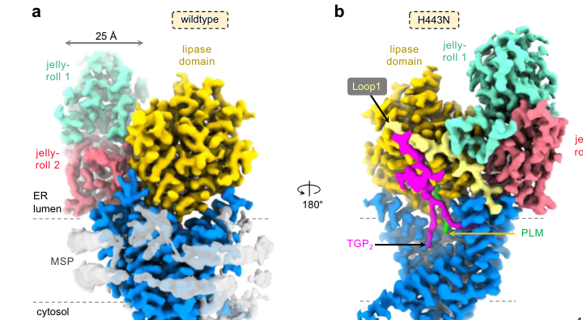

## Question

# Gene Research for Functional Annotation

## ⚠️ CRITICAL: Gene/Protein Identification Context

**BEFORE YOU BEGIN RESEARCH:** You MUST verify you are researching the CORRECT gene/protein. Gene symbols can be ambiguous, especially for less well-characterized genes from non-model organisms.

### Target Gene/Protein Identity (from UniProt):
- **UniProt Accession:** Q9UT41
- **Protein Description:** RecName: Full=GPI inositol-deacylase; EC=3.1.-.-;
- **Gene Information:** Name=bst1; ORFNames=SPAC824.02;
- **Organism (full):** Schizosaccharomyces pombe (strain 972 / ATCC 24843) (Fission yeast).
- **Protein Family:** Belongs to the GPI inositol-deacylase family.
- **Key Domains:** AB_hydrolase_fold. (IPR029058); PGAP1-ab_dom-like. (IPR012908); PGAP1/BST1. (IPR039529); PGAP1_TMD. (IPR056824); PGAP1 (PF07819)

### MANDATORY VERIFICATION STEPS:

1. **Check if the gene symbol "bst1" matches the protein description above**
2. **Verify the organism is correct:** Schizosaccharomyces pombe (strain 972 / ATCC 24843) (Fission yeast).
3. **Check if protein family/domains align with what you find in literature**
4. **If you find literature for a DIFFERENT gene with the same or similar symbol, STOP**

### If Gene Symbol is Ambiguous or You Cannot Find Relevant Literature:

**DO NOT PROCEED WITH RESEARCH ON A DIFFERENT GENE.** Instead:
- State clearly: "The gene symbol 'bst1' is ambiguous or literature is limited for this specific protein"
- Explain what you found (e.g., "Found extensive literature on a different gene with the same symbol in a different organism")
- Describe the protein based ONLY on the UniProt information provided above
- Suggest that the protein function can be inferred from domain/family information

### Research Target:

Please provide a comprehensive research report on the gene **bst1** (gene ID: bst1, UniProt: Q9UT41) in SCHPO.

The research report should be a detailed narrative explaining the function, biological processes, and localization of the gene product. Citations should be given for all claims.

You should prioritize authoritative reviews and primary scientific literature when conducting research. You can supplement
this with annotations you find in gene/protein databases, but these can be outdated or inaccurate.

We are specifically interested in the primary function of the gene - for enzymes, what reaction is catalyzed, and what is the substrate specificity? For transporters, what is the substrate? For structural proteins or adapters, what is the broader structural role? For signaling molecules, what is the role in the pathway.

We are interested in where in or outside the cell the gene product carries out its function.

We are also interested in the signaling or biochemical pathways in which the gene functions. We are less interested in broad pleiotropic effects, except where these elucidate the precise role.

Include evidence where possible. We are interested in both experimental evidence as well as inference from structure, evolution, or bioinformatic analysis. Precise studies should be prioritized over high-throughput, where available.

## Output

Question: You are an expert researcher providing comprehensive, well-cited information.

Provide detailed information focusing on:
1. Key concepts and definitions with current understanding
2. Recent developments and latest research (prioritize 2023-2024 sources)
3. Current applications and real-world implementations
4. Expert opinions and analysis from authoritative sources
5. Relevant statistics and data from recent studies

Format as a comprehensive research report with proper citations. Include URLs and publication dates where available.
Always prioritize recent, authoritative sources and provide specific citations for all major claims.

# Gene Research for Functional Annotation

## ⚠️ CRITICAL: Gene/Protein Identification Context

**BEFORE YOU BEGIN RESEARCH:** You MUST verify you are researching the CORRECT gene/protein. Gene symbols can be ambiguous, especially for less well-characterized genes from non-model organisms.

### Target Gene/Protein Identity (from UniProt):
- **UniProt Accession:** Q9UT41
- **Protein Description:** RecName: Full=GPI inositol-deacylase; EC=3.1.-.-;
- **Gene Information:** Name=bst1; ORFNames=SPAC824.02;
- **Organism (full):** Schizosaccharomyces pombe (strain 972 / ATCC 24843) (Fission yeast).
- **Protein Family:** Belongs to the GPI inositol-deacylase family.
- **Key Domains:** AB_hydrolase_fold. (IPR029058); PGAP1-ab_dom-like. (IPR012908); PGAP1/BST1. (IPR039529); PGAP1_TMD. (IPR056824); PGAP1 (PF07819)

### MANDATORY VERIFICATION STEPS:

1. **Check if the gene symbol "bst1" matches the protein description above**
2. **Verify the organism is correct:** Schizosaccharomyces pombe (strain 972 / ATCC 24843) (Fission yeast).
3. **Check if protein family/domains align with what you find in literature**
4. **If you find literature for a DIFFERENT gene with the same or similar symbol, STOP**

### If Gene Symbol is Ambiguous or You Cannot Find Relevant Literature:

**DO NOT PROCEED WITH RESEARCH ON A DIFFERENT GENE.** Instead:
- State clearly: "The gene symbol 'bst1' is ambiguous or literature is limited for this specific protein"
- Explain what you found (e.g., "Found extensive literature on a different gene with the same symbol in a different organism")
- Describe the protein based ONLY on the UniProt information provided above
- Suggest that the protein function can be inferred from domain/family information

### Research Target:

Please provide a comprehensive research report on the gene **bst1** (gene ID: bst1, UniProt: Q9UT41) in SCHPO.

The research report should be a detailed narrative explaining the function, biological processes, and localization of the gene product. Citations should be given for all claims.

You should prioritize authoritative reviews and primary scientific literature when conducting research. You can supplement
this with annotations you find in gene/protein databases, but these can be outdated or inaccurate.

We are specifically interested in the primary function of the gene - for enzymes, what reaction is catalyzed, and what is the substrate specificity? For transporters, what is the substrate? For structural proteins or adapters, what is the broader structural role? For signaling molecules, what is the role in the pathway.

We are interested in where in or outside the cell the gene product carries out its function.

We are also interested in the signaling or biochemical pathways in which the gene functions. We are less interested in broad pleiotropic effects, except where these elucidate the precise role.

Include evidence where possible. We are interested in both experimental evidence as well as inference from structure, evolution, or bioinformatic analysis. Precise studies should be prioritized over high-throughput, where available.

# Research Report: Functional Annotation of **bst1** (UniProt Q9UT41; ORF **SPAC824.02**) in *Schizosaccharomyces pombe* (strain 972)

## Executive summary
**bst1 (Q9UT41/SPAC824.02)** in fission yeast encodes an **ER/early-Golgi localized membrane hydrolase of the conserved PGAP1/BST1 family**, whose established family function is **GPI inositol-deacylation**—hydrolytic removal of the **inositol 2-O–linked acyl chain** on nascent GPI anchors **after GPI transfer to proteins** in the ER lumen. In *S. pombe*, bst1 loss-of-function causes **ER→Golgi trafficking defects**, impaired secretion, and **late cytokinesis/cell separation phenotypes** consistent with altered trafficking of septum-remodeling enzymes (notably glucanases). Family-level work (especially 2024 structural biology) provides a mechanistic basis for the enzyme’s substrate selectivity and catalysis, while translational studies highlight the broader importance of the pathway as an **antifungal drug target** (GWT1 inhibitors such as manogepix; Phase 3) and as a cause of **human/animal disease phenotypes** when PGAP1 is defective. (ye2025fissionyeastgpi pages 6-7, ye2025fissionyeastgpi pages 4-6, ye2025fissionyeastgpi pages 2-4, hong2024molecularbasisof pages 1-2, dai2024structuralinsightsinto pages 1-2)

## 1. Target verification (mandatory identity checks)
### 1.1 Gene/protein identity
- The target is **bst1** in *Schizosaccharomyces pombe* (strain 972), ORF **SPAC824.02**, UniProt **Q9UT41**, annotated as a **GPI inositol-deacylase** and belonging to the **PGAP1/BST1 family**. This identity is supported by *S. pombe*-specific experimental work describing Bst1 as a predicted GPI inositol deacylase with ER/early Golgi localization and secretion/cytokinesis phenotypes. (ye2025fissionyeastgpi pages 1-2, ye2025fissionyeastgpi pages 4-6)

### 1.2 Symbol ambiguity risk
- “BST1” is also used in other organisms (e.g., **budding yeast BST1**; **mammalian PGAP1** as the functional ortholog). These homologs were used **only** to support conserved biochemical mechanism, while *S. pombe* conclusions are anchored to *S. pombe* experimental evidence. (tanaka2004inositoldeacylationof pages 7-7, fujita2006inositoldeacylationby pages 1-2, hong2024molecularbasisof pages 1-2, ye2025fissionyeastgpi pages 4-6)

## 2. Key concepts and definitions (current understanding)
### 2.1 What is a GPI anchor?
Glycosylphosphatidylinositol (GPI) is a glycolipid that **covalently anchors proteins** to the outer leaflet of the plasma membrane. GPIs share a conserved glycan backbone and can carry different lipid moieties (diacyl-PI, 1-alkyl-2-acyl-PI, or inositol phosphoceramide). GPI anchoring confers unique trafficking and membrane organization properties (e.g., microdomain/raft association). (kinoshita2016biosynthesisofgpianchored pages 1-3)

Quantitative context:
- **>150 human proteins** are GPI-anchored. (kinoshita2016biosynthesisofgpianchored pages 1-3)
- **>60 GPI-anchored proteins** are present in budding yeast, and GPI is essential for yeast growth. (kinoshita2016biosynthesisofgpianchored pages 1-3)

### 2.2 Inositol acylation vs. inositol deacylation
**Inositol acylation**
- Early in GPI biosynthesis, the **inositol 2-position** of GlcN-PI is acylated (typically by **PIG-W** in mammals; **Gwt1p** in fungi/yeast), often using **palmitoyl-CoA** as donor, forming **GlcN-(acyl)PI**. This step supports efficient downstream glycan remodeling and correct GPI maturation. (kinoshita2016biosynthesisofgpianchored pages 9-11, guo2024recentresearchprogress pages 1-4)

**Inositol deacylation (Bst1/PGAP1 step)**
- After GPI is transferred to proteins (post-attachment), the inositol-linked acyl chain is typically removed in the **ER lumen** by **PGAP1 (mammals) / Bst1p (yeast)**, restoring the free 2-OH of inositol and enabling downstream trafficking/quality control. (tanaka2004inositoldeacylationof pages 7-7, kinoshita2016biosynthesisofgpianchored pages 58-60)

Functional consequence: ER export signal
- Deacylation is required for binding to **p24-family cargo receptors** and recruitment of GPI-APs into **COPII vesicles**, promoting efficient ER export and secretion. (hong2024molecularbasisof pages 1-2)

### 2.3 Enzymology (reaction and substrate specificity)
**Reaction** (family-established; applied to *S. pombe* Bst1 by orthology):
- Hydrolytic cleavage of the **ester-linked acyl chain** attached to the **2-hydroxyl of inositol** within the GPI anchor on a newly GPI-anchored protein (GPI-AP). (tanaka2004inositoldeacylationof pages 7-7, kinoshita2016biosynthesisofgpianchored pages 58-60)

**Substrate specificity**
- 2024 structural/biochemical work indicates PGAP1 achieves specificity by **binding the lipid and glycan features of GPI-AP substrates** within a specialized cavity, helping avoid indiscriminate hydrolysis of bulk membrane lipids. (hong2024molecularbasisof pages 1-2)

## 3. bst1 in *S. pombe*: molecular function, localization, and pathway role
### 3.1 Subcellular localization in *S. pombe*
Bst1 is experimentally localized to:
- **Endoplasmic reticulum (ER)** (cortical and nuclear envelope-associated ER) and
- **Cytoplasmic puncta associated with early/cis-Golgi/ER–Golgi interface**. (ye2025fissionyeastgpi pages 4-6)

Quantitative colocalization (Bst1 puncta):
- **66%** overlap with **Anp1-GFP** (cis-Golgi/ER–Golgi transport marker)
- **12%** overlap with **Sec72-GFP** (trans-Golgi marker) (ye2025fissionyeastgpi pages 6-7)

These data support Bst1 acting in the **early secretory pathway**, consistent with its conserved ER-resident deacylase role. (hong2024molecularbasisof pages 1-2, ye2025fissionyeastgpi pages 4-6)

### 3.2 Role in ER→Golgi trafficking and secretion
Loss of bst1 causes several markers of perturbed ER export:
- Increased numbers of **COPII subunit puncta** (Sec13, Sec24) (ye2025fissionyeastgpi pages 6-7)
- Altered distribution of **Anp1** (accumulation at nuclear ER), suggesting early ER transport defects (ye2025fissionyeastgpi pages 4-6)
- Increased tubular ER structures (ye2025fissionyeastgpi pages 6-7)
- Reduced secretion in an **acid phosphatase secretion assay** (qualitatively described as significantly decreased). (ye2025fissionyeastgpi pages 6-7)

Quantitative COPII phenotype:
- Sec13 puncta per focal plane: **2.1 ± 1.6 (WT)** → **8.5 ± 4.7 (bst1 mutant)** (p < 0.001)
- Sec24 puncta per focal plane: **2.8 ± 1.8 (WT)** → **6.2 ± 3.6 (bst1 mutant)** (p < 0.001) (ye2025fissionyeastgpi pages 6-7)

Interpretation:
- These phenotypes are consistent with the conserved model where **inositol deacylation by Bst1/PGAP1 is needed for efficient COPII-dependent ER export**, likely by enabling p24 recognition of remodeled GPI-APs. (hong2024molecularbasisof pages 1-2)

### 3.3 Cytokinesis and cell separation phenotypes
bst1 loss-of-function causes prominent **late cytokinesis** and **cell separation** defects in *S. pombe*:
- Increased septation and multi-septated cells (ye2025fissionyeastgpi pages 4-6)
- Slower contractile-ring constriction (ye2025fissionyeastgpi pages 4-6)
- Reduced division-site localization of secreted glucanases **Eng1** and **Agn1**, enzymes required for septum digestion and daughter separation. (ye2025fissionyeastgpi pages 6-7)

Quantitative cytokinesis/cell separation data:
- Cells with one septum: **~23% (WT)** vs **~52% (bst1-s27 or bst1Δ)**
- Cells with ≥2 septa: **~30% (bst1-s27 or bst1Δ)**
- Contractile-ring constriction time: **34.2 ± 3.5 min (WT)** vs **78.4 ± 31.5 min (bst1Δ)** (p < 0.001) (ye2025fissionyeastgpi pages 4-6)

Mechanistic interpretation:
- The working model is that bst1 affects cytokinesis indirectly through **secretory trafficking**, reducing delivery of glucanases to the septum and thereby delaying/altering cell separation. (ye2025fissionyeastgpi pages 6-7)

### 3.4 Genetic interactions
A key *S. pombe* genetic interaction is suppression of **ync13** defects:
- bst1 loss-of-function alleles (including truncation bst1-s27 and deletion) were isolated as suppressors of ync13 mutant phenotypes. (ye2025fissionyeastgpi pages 2-4)

Quantitative suppression:
- ync13 cell lysis decreased from **77%** to **15%** (bst1-s27) or **9%** (bst1Δ). (ye2025fissionyeastgpi pages 2-4)

This suppression is consistent with bst1-mediated reduction of glucanase secretion mitigating premature/defective septum digestion in ync13-compromised cells. (ye2025fissionyeastgpi pages 6-7, ye2025fissionyeastgpi pages 2-4)

## 4. Conserved mechanism of BST1/PGAP1 family enzymes (expert synthesis from authoritative sources)
### 4.1 Primary biochemical evidence (orthologs)
- Mammalian **PGAP1** and yeast **Bst1p** were experimentally shown to mediate inositol deacylation of GPI-APs, and loss of PGAP1 causes delayed ER→Golgi transport/maturation of GPI-APs (e.g., DAF in CHO cells); yeast BST1 complements in PGAP1-deficient cells and bst1Δ delays Gas1p maturation. (Tanaka et al., 2004-04; https://doi.org/10.1074/jbc.M313755200) (tanaka2004inositoldeacylationof pages 7-7)
- Budding-yeast bst1 disruption also affects quality control of misfolded GPI-APs retained in the ER (Gas1*p), consistent with a role in ER quality control/ERAD for GPI-APs. (Fujita et al., 2006-02; https://doi.org/10.1091/mbc.e05-05-0443) (fujita2006inositoldeacylationby pages 1-2)

### 4.2 Latest mechanistic/structural advance (2024)
A major 2024 advance is high-resolution structural elucidation of PGAP1:
- **Three PGAP1 structures** at **2.66–2.84 Å** reveal a **10-transmembrane architecture**, a specialized **“guitar-shaped” cavity** organizing acyl chains, and **serine hydrolase-type catalysis with atypical features**, explaining substrate fidelity and providing a framework for how inositol deacylation couples to sorting/quality control. (Hong et al., 2024-01; Nature Communications; https://doi.org/10.1038/s41467-023-44568-2) (hong2024molecularbasisof pages 1-2)

Visual evidence from the paper (structures/architecture/cavity) is captured in the extracted figure crops. (hong2024molecularbasisof media 4f394f47, hong2024molecularbasisof media 544f2062, hong2024molecularbasisof media 3efecb2e)

## 5. Recent developments (2023–2024) in the broader pathway relevant to bst1 functional interpretation
### 5.1 Updated conceptual framing and chemical biology (2024)
A 2024 Current Opinion review summarizes recent progress in:
- GPI-AP biosynthesis and membrane interactions
- Quality control links (including ubiquitin-associated components at GPI-T)
- Chemical/chemoenzymatic synthesis and metabolic labeling tools for GPI/GPI-APs (e.g., azide-functionalized PI derivatives for incorporation into GPIs). (Guo & Kundu, 2024-02; https://doi.org/10.1016/j.cbpa.2023.102421) (guo2024recentresearchprogress pages 4-5)

Relevance to bst1:
- These developments improve experimental ability to test Bst1-mediated remodeling effects (e.g., through lipid probes or synthetic substrates) and emphasize that lipid-remodeling steps act as **sorting signals** in secretory trafficking—consistent with *S. pombe* phenotypes. (ye2025fissionyeastgpi pages 6-7, guo2024recentresearchprogress pages 4-5)

### 5.2 Adjacent remodeling enzymes and comparative biology (2023)
- In *Trypanosoma brucei*, a 2023 study identified a GPI-specific phospholipase A2 (GPI-PLA2) involved in fatty-acid remodeling, illustrating ongoing discovery of remodeling enzymes and highlighting differences in where remodeling occurs (pre- vs post-transfer) across eukaryotes. (Ji et al., 2023-08; J Biol Chem; https://doi.org/10.1016/j.jbc.2023.105016) (ji2023identificationofthe pages 1-2)

## 6. Current applications and real-world implementations
### 6.1 Antifungal drug development targeting the pathway
Although bst1 itself is not the primary clinical target, the same pathway is actively exploited therapeutically.

**Manogepix targets fungal GWT1 (inositol acyltransferase), an upstream step complementary to Bst1/PGAP1 deacylation.**
- Manogepix has advanced to **Phase 3** and has **FDA orphan drug** designation. (Hong et al., 2024-01) (hong2024molecularbasisof pages 1-2)
- 2024 cryo-EM structures of yeast GWT1 bound to palmitoyl-CoA (3.3 Å) and manogepix (3.5 Å) show competitive inhibition by manogepix occupying the palmitoyl-CoA cavity and reveal a unique 13-TM architecture, enabling structure-guided antifungal optimization. (Dai et al., 2024-10; Nature Communications; https://doi.org/10.1038/s41467-024-53512-x) (dai2024structuralinsightsinto pages 1-2)

### 6.2 Antifungal stress physiology and combination strategies (2024)
In *Candida glabrata*, inhibition of GPI-anchor biosynthesis by manogepix triggers stress pathways:
- A 2024 genome-scale fitness study found **87 gene deficiencies** that depend on calcineurin signaling for viability under FK506, and reported that **~80%** of FK506-sensitive mutants were linked to vesicular trafficking processes; manogepix increased calcineurin signaling and calcineurin prevented cell death independent of Crz1, implying potential combination strategies to potentiate antifungal activity. (Pavesic et al., 2024-01; mSphere; https://doi.org/10.1128/msphere.00554-23) (pavesic2024calcineurindependentcontributionsto pages 1-2)

### 6.3 Human/animal physiology and disease relevance of PGAP1 (Bst1 ortholog)
- Review evidence indicates **human individuals with PGAP1 mutations** have forebrain abnormalities, and **male Pgap1-knockout mice** are infertile due to sperm migration/adhesion defects, linking inositol deacylation to organismal physiology. (Kinoshita & Fujita, 2016-01; https://doi.org/10.1194/jlr.R063313) (kinoshita2016biosynthesisofgpianchored pages 22-24)

These translational links support the general conclusion that the inositol deacylation step is physiologically critical, strengthening inference that *S. pombe* Bst1 is functionally important even if not essential for viability under all conditions. (ye2025fissionyeastgpi pages 6-7, kinoshita2016biosynthesisofgpianchored pages 22-24)

## 7. Statistics and data highlights (from included sources)
- *S. pombe* Bst1 puncta overlap with cis-Golgi marker Anp1: **66%**; with trans-Golgi marker Sec72: **12%** (ye2025fissionyeastgpi pages 6-7)
- COPII puncta increase in bst1 mutants: Sec13 **2.1 ± 1.6 → 8.5 ± 4.7**, Sec24 **2.8 ± 1.8 → 6.2 ± 3.6** (p < 0.001) (ye2025fissionyeastgpi pages 6-7)
- Cytokinesis phenotype: ring constriction time **34.2 ± 3.5 min (WT)** vs **78.4 ± 31.5 min (bst1Δ)** (p < 0.001) (ye2025fissionyeastgpi pages 4-6)
- Septation phenotype: **~23% WT** one septum vs **~52% bst1** one septum; **~30% bst1** with ≥2 septa (ye2025fissionyeastgpi pages 4-6)
- Genetic suppression: ync13 lysis **77% → 15% (bst1-s27)** or **9% (bst1Δ)** (ye2025fissionyeastgpi pages 2-4)
- Structural statistics (PGAP1): resolution **2.66–2.84 Å**, **10 TM** architecture (hong2024molecularbasisof pages 1-2)
- Structural statistics (GWT1): cryo-EM **3.3 Å** (substrate) and **3.5 Å** (manogepix), **13 TM** fold (dai2024structuralinsightsinto pages 1-2)
- GPI-AP prevalence: **>150 human** GPI-APs; **>60 budding yeast** GPI-APs (kinoshita2016biosynthesisofgpianchored pages 1-3); **~300 predicted plant GPI-APs (~10% of secreted proteins)** (bernatsilvestre2021atpgap1functionsas pages 1-2)
- Calcineurin fitness screen: **87 gene deficiencies**; **~80%** related to vesicular trafficking (pavesic2024calcineurindependentcontributionsto pages 1-2)

## 8. Consolidated functional annotation for *S. pombe* bst1 (Q9UT41)
### 8.1 Primary molecular function (most supported)
**Bst1 is best annotated as a GPI inositol-deacylase (post-attachment GPI lipid remodeling enzyme) in the ER lumen**, impacting ER export/secretory trafficking by enabling proper GPI-anchor remodeling and subsequent cargo-receptor/COPII-mediated transport. (tanaka2004inositoldeacylationof pages 7-7, hong2024molecularbasisof pages 1-2, ye2025fissionyeastgpi pages 6-7, ye2025fissionyeastgpi pages 4-6)

### 8.2 Cellular role and pathway placement
In fission yeast, the bst1 phenotype pattern supports a role in:
- **Early secretory pathway organization (ER/early Golgi)**
- **Secretion and targeting of enzymes required for septum digestion and cell separation**
- Coupling of GPI remodeling to cell-cycle–linked morphogenesis. (ye2025fissionyeastgpi pages 6-7, ye2025fissionyeastgpi pages 4-6)

## Summary table
The following table consolidates the best-supported annotation elements and their evidence.

| Aspect | Summary |
|---|---|
| Molecular function / reaction | **Bst1 is the Schizosaccharomyces pombe ortholog of the PGAP1/BST1 GPI inositol-deacylase family**, predicted to hydrolyze and remove the inositol-linked acyl chain from newly attached GPI anchors in the ER, initiating post-attachment GPI lipid remodeling; this chemistry is established directly for yeast/mammalian orthologs and is consistent with the S. pombe protein family assignment and phenotypes (ye2025fissionyeastgpi pages 1-2, tanaka2004inositoldeacylationof pages 7-7, fujita2006inositoldeacylationby pages 1-2, hong2024molecularbasisof pages 1-2, kinoshita2016biosynthesisofgpianchored pages 58-60). |
| Substrate | The immediate substrate is a **nascent triacylated GPI-anchored protein (GPI-AP3)** carrying an acyl chain on the inositol 2-position; deacylation yields a diacylated GPI-anchored protein (GPI-AP2). More generally, Bst1/PGAP1 acts on **newly GPI-anchored proteins in the ER lumen**, not bulk membrane phospholipids (hong2024molecularbasisof pages 1-2, kinoshita2016biosynthesisofgpianchored pages 11-13, bernatsilvestre2021functionofatpgap1ingpi pages 1-4, kinoshita2016biosynthesisofgpianchored pages 9-11). |
| Pathway step | Bst1 acts **after GPI attachment to protein and before efficient ER export**, as the first remodeling step in the post-attachment GPI lipid-remodeling pathway; upstream, Gwt1/PIG-W adds the inositol-linked acyl chain, and downstream remodeling includes Per1/Gup1/Cwh43-dependent lipid changes that promote secretion and membrane organization (kinoshita2016biosynthesisofgpianchored pages 11-13, kinoshita2016biosynthesisofgpianchored pages 9-11, kinoshita2016biosynthesisofgpianchored pages 58-60, tanaka2004inositoldeacylationof pages 7-7). |
| Localization | In **S. pombe**, functional Bst1 localizes to the **ER (cortical and nuclear-envelope-associated ER)** and **cytoplasmic puncta enriched for early/cis-Golgi association**; 66% of Bst1 puncta overlap with Anp1-GFP (cis-Golgi/ER-Golgi transport marker) versus 12% with Sec72-GFP (trans-Golgi) (ye2025fissionyeastgpi pages 4-6, ye2025fissionyeastgpi pages 6-7). |
| Key phenotypes | **bst1Δ and bst1-s27** mutants are **rounder/swollen, hyperseptated, defective in contractile-ring constriction, septation, and daughter-cell separation**, and show impaired secretion/targeting of septum-remodeling glucanases **Eng1** and **Agn1**; Bst1 loss also perturbs early secretory trafficking, with increased COPII puncta, altered Anp1 distribution, increased tubular ER, and reduced acid phosphatase secretion (ye2025fissionyeastgpi pages 2-4, ye2025fissionyeastgpi pages 4-6, ye2025fissionyeastgpi pages 6-7, ye2025fissionyeastgpi pages 7-11). |
| Quantitative data | In S. pombe, **~23% WT** cells had one septum versus **~52% bst1-s27/bst1Δ** cells with one septum and **~30%** with ≥2 septa; contractile-ring constriction increased from **34.2 ± 3.5 min (WT)** to **78.4 ± 31.5 min (bst1Δ)**; Bst1 puncta overlap was **66% with Anp1** and **12% with Sec72**; Sec13 puncta increased from **2.1 ± 1.6 to 8.5 ± 4.7** and Sec24 puncta from **2.8 ± 1.8 to 6.2 ± 3.6** per focal plane in bst1 mutants; ync13 lysis fell from **77%** to **15% (bst1-s27)** or **9% (bst1Δ)** in suppressor backgrounds (ye2025fissionyeastgpi pages 4-6, ye2025fissionyeastgpi pages 6-7, ye2025fissionyeastgpi pages 2-4). |
| Genetic interactions | **bst1-s27** was isolated as a **spontaneous suppressor of ync13**; bst1 loss suppresses ync13 colony-formation/lysis defects, likely by reducing secretion of glucanases that would otherwise promote premature cell separation on defective septa. In double mutants, Eng1 recruitment is further impaired, supporting a trafficking-based interaction rather than direct pathway identity with Ync13 (ye2025fissionyeastgpi pages 2-4, ye2025fissionyeastgpi pages 1-2, ye2025fissionyeastgpi pages 11-11, ye2025fissionyeastgpi pages 6-7). |
| Supporting evidence in other organisms | In **S. cerevisiae and mammals**, BST1/PGAP1 was shown experimentally to mediate **inositol deacylation**, and loss causes **delayed ER-to-Golgi transport** of GPI-anchored proteins such as Gas1/DAF and defects in GPI-AP quality control; a **2024 structure** resolved PGAP1 as a **10-TM enzyme** with a **guitar-shaped substrate cavity** and serine hydrolase-type catalysis, strongly supporting the inferred biochemical role of S. pombe Bst1 (tanaka2004inositoldeacylationof pages 7-7, fujita2006inositoldeacylationby pages 1-2, hong2024molecularbasisof pages 1-2, hong2024molecularbasisof media 4f394f47, hong2024molecularbasisof media 544f2062). |

*Table: This table summarizes the current functional annotation of Schizosaccharomyces pombe bst1 (SPAC824.02/Q9UT41), integrating direct fission-yeast evidence with conserved mechanistic evidence from BST1/PGAP1 family studies. It highlights the enzyme’s reaction, pathway role, localization, phenotypes, quantitative findings, and cross-species support.*

## Limitations of the current evidence base
- Direct biochemical demonstration of inositol deacylase activity for *S. pombe* Bst1 (e.g., in vitro enzymatic assay on purified protein or direct lipidomic confirmation of inositol deacylation state) was not present in the *S. pombe* evidence excerpts available here; the enzymatic reaction is inferred strongly from conserved family function and from the *S. pombe* localization/trafficking phenotypes. (ye2025fissionyeastgpi pages 4-6, tanaka2004inositoldeacylationof pages 7-7, hong2024molecularbasisof pages 1-2)

## Key cited sources (URLs and publication dates)
- Ye Y. et al. **“Fission yeast GPI inositol deacylase Bst1 regulates ER–Golgi transport and functions in late stages of cytokinesis.”** *Molecular Biology of the Cell* (published **2025-03**). https://doi.org/10.1091/mbc.e24-08-0375 (ye2025fissionyeastgpi pages 4-6)
- Hong J. et al. **“Molecular basis of the inositol deacylase PGAP1 involved in quality control of GPI-AP biogenesis.”** *Nature Communications* (published **2024-01**). https://doi.org/10.1038/s41467-023-44568-2 (hong2024molecularbasisof pages 1-2)
- Dai X. et al. **“Structural insights into the inhibition mechanism of fungal GWT1 by manogepix.”** *Nature Communications* (published **2024-10**). https://doi.org/10.1038/s41467-024-53512-x (dai2024structuralinsightsinto pages 1-2)
- Guo Z., Kundu S. **“Recent research progress in GPI-anchored protein biosynthesis…”** *Current Opinion in Chemical Biology* (published **2024-02**). https://doi.org/10.1016/j.cbpa.2023.102421 (guo2024recentresearchprogress pages 4-5)
- Tanaka S. et al. **“Inositol Deacylation … mediated by mammalian PGAP1 and yeast Bst1p.”** *J. Biol. Chem.* (published **2004-04**). https://doi.org/10.1074/jbc.M313755200 (tanaka2004inositoldeacylationof pages 7-7)
- Fujita M. et al. **“Inositol Deacylation by Bst1p is required for the quality control of GPI-APs.”** *Molecular Biology of the Cell* (published **2006-02**). https://doi.org/10.1091/mbc.e05-05-0443 (fujita2006inositoldeacylationby pages 1-2)
- Kinoshita T., Fujita M. **“Biosynthesis of GPI-anchored proteins: special emphasis on GPI lipid remodeling.”** *Journal of Lipid Research* (published **2016-01**). https://doi.org/10.1194/jlr.R063313 (kinoshita2016biosynthesisofgpianchored pages 1-3)
- Pavesic M.W. et al. **“Calcineurin-dependent contributions to fitness in Candida glabrata.”** *mSphere* (published **2024-01**). https://doi.org/10.1128/msphere.00554-23 (pavesic2024calcineurindependentcontributionsto pages 1-2)

References

1. (ye2025fissionyeastgpi pages 6-7): Yanfang Ye, Aysha H. Osmani, Zhen-Ru Liu, Addie Kern, and Jian-Qiu Wu. Fission yeast gpi inositol deacylase bst1 regulates er-golgi transport and functions in late stages of cytokinesis. Mar 2025. URL: https://doi.org/10.1091/mbc.e24-08-0375, doi:10.1091/mbc.e24-08-0375. This article has 6 citations and is from a domain leading peer-reviewed journal.

2. (ye2025fissionyeastgpi pages 4-6): Yanfang Ye, Aysha H. Osmani, Zhen-Ru Liu, Addie Kern, and Jian-Qiu Wu. Fission yeast gpi inositol deacylase bst1 regulates er-golgi transport and functions in late stages of cytokinesis. Mar 2025. URL: https://doi.org/10.1091/mbc.e24-08-0375, doi:10.1091/mbc.e24-08-0375. This article has 6 citations and is from a domain leading peer-reviewed journal.

3. (ye2025fissionyeastgpi pages 2-4): Yanfang Ye, Aysha H. Osmani, Zhen-Ru Liu, Addie Kern, and Jian-Qiu Wu. Fission yeast gpi inositol deacylase bst1 regulates er-golgi transport and functions in late stages of cytokinesis. Mar 2025. URL: https://doi.org/10.1091/mbc.e24-08-0375, doi:10.1091/mbc.e24-08-0375. This article has 6 citations and is from a domain leading peer-reviewed journal.

4. (hong2024molecularbasisof pages 1-2): Jingjing Hong, Tingting Li, Yulin Chao, Yidan Xu, Zhini Zhu, Zixuan Zhou, Weijie Gu, Qianhui Qu, and Dianfan Li. Molecular basis of the inositol deacylase pgap1 involved in quality control of gpi-ap biogenesis. Nature Communications, Jan 2024. URL: https://doi.org/10.1038/s41467-023-44568-2, doi:10.1038/s41467-023-44568-2. This article has 16 citations and is from a highest quality peer-reviewed journal.

5. (dai2024structuralinsightsinto pages 1-2): Xinli Dai, Xuanzhong Liu, Jialu Li, Hui Chen, Chuangye Yan, Yaozong Li, Hanmin Liu, Dong Deng, and Xiang Wang. Structural insights into the inhibition mechanism of fungal gwt1 by manogepix. Nature Communications, Oct 2024. URL: https://doi.org/10.1038/s41467-024-53512-x, doi:10.1038/s41467-024-53512-x. This article has 21 citations and is from a highest quality peer-reviewed journal.

6. (ye2025fissionyeastgpi pages 1-2): Yanfang Ye, Aysha H. Osmani, Zhen-Ru Liu, Addie Kern, and Jian-Qiu Wu. Fission yeast gpi inositol deacylase bst1 regulates er-golgi transport and functions in late stages of cytokinesis. Mar 2025. URL: https://doi.org/10.1091/mbc.e24-08-0375, doi:10.1091/mbc.e24-08-0375. This article has 6 citations and is from a domain leading peer-reviewed journal.

7. (tanaka2004inositoldeacylationof pages 7-7): Satoshi Tanaka, Yusuke Maeda, Yuko Tashima, and Taroh Kinoshita. Inositol deacylation of glycosylphosphatidylinositol-anchored proteins is mediated by mammalian pgap1 and yeast bst1p*. Journal of Biological Chemistry, 279:14256-14263, Apr 2004. URL: https://doi.org/10.1074/jbc.m313755200, doi:10.1074/jbc.m313755200. This article has 233 citations and is from a domain leading peer-reviewed journal.

8. (fujita2006inositoldeacylationby pages 1-2): Morihisa Fujita, Takehiko Yoko-o, and Yoshifumi Jigami. Inositol deacylation by bst1p is required for the quality control of glycosylphosphatidylinositol-anchored proteins. Feb 2006. URL: https://doi.org/10.1091/mbc.e05-05-0443, doi:10.1091/mbc.e05-05-0443. This article has 122 citations and is from a domain leading peer-reviewed journal.

9. (kinoshita2016biosynthesisofgpianchored pages 1-3): Taroh Kinoshita and Morihisa Fujita. Biosynthesis of gpi-anchored proteins: special emphasis on gpi lipid remodeling. Journal of Lipid Research, 57:24-6, Jan 2016. URL: https://doi.org/10.1194/jlr.r063313, doi:10.1194/jlr.r063313. This article has 307 citations and is from a peer-reviewed journal.

10. (kinoshita2016biosynthesisofgpianchored pages 9-11): Taroh Kinoshita and Morihisa Fujita. Biosynthesis of gpi-anchored proteins: special emphasis on gpi lipid remodeling. Journal of Lipid Research, 57:24-6, Jan 2016. URL: https://doi.org/10.1194/jlr.r063313, doi:10.1194/jlr.r063313. This article has 307 citations and is from a peer-reviewed journal.

11. (guo2024recentresearchprogress pages 1-4): Zhongwu Guo and Sayan Kundu. Recent research progress in glycosylphosphatidylinositol-anchored protein biosynthesis, chemical/chemoenzymatic synthesis, and interaction with the cell membrane. Current Opinion in Chemical Biology, 78:102421, Feb 2024. URL: https://doi.org/10.1016/j.cbpa.2023.102421, doi:10.1016/j.cbpa.2023.102421. This article has 10 citations and is from a peer-reviewed journal.

12. (kinoshita2016biosynthesisofgpianchored pages 58-60): Taroh Kinoshita and Morihisa Fujita. Biosynthesis of gpi-anchored proteins: special emphasis on gpi lipid remodeling. Journal of Lipid Research, 57:24-6, Jan 2016. URL: https://doi.org/10.1194/jlr.r063313, doi:10.1194/jlr.r063313. This article has 307 citations and is from a peer-reviewed journal.

13. (hong2024molecularbasisof media 4f394f47): Jingjing Hong, Tingting Li, Yulin Chao, Yidan Xu, Zhini Zhu, Zixuan Zhou, Weijie Gu, Qianhui Qu, and Dianfan Li. Molecular basis of the inositol deacylase pgap1 involved in quality control of gpi-ap biogenesis. Nature Communications, Jan 2024. URL: https://doi.org/10.1038/s41467-023-44568-2, doi:10.1038/s41467-023-44568-2. This article has 16 citations and is from a highest quality peer-reviewed journal.

14. (hong2024molecularbasisof media 544f2062): Jingjing Hong, Tingting Li, Yulin Chao, Yidan Xu, Zhini Zhu, Zixuan Zhou, Weijie Gu, Qianhui Qu, and Dianfan Li. Molecular basis of the inositol deacylase pgap1 involved in quality control of gpi-ap biogenesis. Nature Communications, Jan 2024. URL: https://doi.org/10.1038/s41467-023-44568-2, doi:10.1038/s41467-023-44568-2. This article has 16 citations and is from a highest quality peer-reviewed journal.

15. (hong2024molecularbasisof media 3efecb2e): Jingjing Hong, Tingting Li, Yulin Chao, Yidan Xu, Zhini Zhu, Zixuan Zhou, Weijie Gu, Qianhui Qu, and Dianfan Li. Molecular basis of the inositol deacylase pgap1 involved in quality control of gpi-ap biogenesis. Nature Communications, Jan 2024. URL: https://doi.org/10.1038/s41467-023-44568-2, doi:10.1038/s41467-023-44568-2. This article has 16 citations and is from a highest quality peer-reviewed journal.

16. (guo2024recentresearchprogress pages 4-5): Zhongwu Guo and Sayan Kundu. Recent research progress in glycosylphosphatidylinositol-anchored protein biosynthesis, chemical/chemoenzymatic synthesis, and interaction with the cell membrane. Current Opinion in Chemical Biology, 78:102421, Feb 2024. URL: https://doi.org/10.1016/j.cbpa.2023.102421, doi:10.1016/j.cbpa.2023.102421. This article has 10 citations and is from a peer-reviewed journal.

17. (ji2023identificationofthe pages 1-2): Zhe Ji, Rupa Nagar, Samuel M. Duncan, Maria Lucia Sampaio Guther, and Michael A.J. Ferguson. Identification of the glycosylphosphatidylinositol-specific phospholipase a2 (gpi-pla2) that mediates gpi fatty acid remodeling in trypanosoma brucei. Journal of Biological Chemistry, 299:105016, Aug 2023. URL: https://doi.org/10.1016/j.jbc.2023.105016, doi:10.1016/j.jbc.2023.105016. This article has 7 citations and is from a domain leading peer-reviewed journal.

18. (pavesic2024calcineurindependentcontributionsto pages 1-2): Matthew W. Pavesic, Andrew N. Gale, Timothy J. Nickels, Abigail A. Harrington, Maya Bussey, and Kyle W. Cunningham. Calcineurin-dependent contributions to fitness in the opportunistic pathogen <i>candida glabrata</i>. Jan 2024. URL: https://doi.org/10.1128/msphere.00554-23, doi:10.1128/msphere.00554-23. This article has 14 citations and is from a peer-reviewed journal.

19. (kinoshita2016biosynthesisofgpianchored pages 22-24): Taroh Kinoshita and Morihisa Fujita. Biosynthesis of gpi-anchored proteins: special emphasis on gpi lipid remodeling. Journal of Lipid Research, 57:24-6, Jan 2016. URL: https://doi.org/10.1194/jlr.r063313, doi:10.1194/jlr.r063313. This article has 307 citations and is from a peer-reviewed journal.

20. (bernatsilvestre2021atpgap1functionsas pages 1-2): César Bernat-Silvestre, Judit Sánchez-Simarro, Yingxuan Ma, Javier Montero-Pau, Kim Johnson, Fernando Aniento, and María Jesús Marcote. Atpgap1 functions as a gpi inositol-deacylase required for efficient transport of gpi-anchored proteins. Plant physiology, 187:2156-2173, Aug 2021. URL: https://doi.org/10.1093/plphys/kiab384, doi:10.1093/plphys/kiab384. This article has 21 citations and is from a highest quality peer-reviewed journal.

21. (kinoshita2016biosynthesisofgpianchored pages 11-13): Taroh Kinoshita and Morihisa Fujita. Biosynthesis of gpi-anchored proteins: special emphasis on gpi lipid remodeling. Journal of Lipid Research, 57:24-6, Jan 2016. URL: https://doi.org/10.1194/jlr.r063313, doi:10.1194/jlr.r063313. This article has 307 citations and is from a peer-reviewed journal.

22. (bernatsilvestre2021functionofatpgap1ingpi pages 1-4): César Bernat-Silvestre, Judit Sanchez-Simarro, Yingxuan Ma, Kim Johnson, Fernando Aniento, and María Jesús Marcote. Function of<i>atpgap1</i>in gpi anchor lipid remodeling and transport to the cell surface of gpi-anchored proteins. BioRxiv, Mar 2021. URL: https://doi.org/10.1101/2021.03.09.434604, doi:10.1101/2021.03.09.434604. This article has 0 citations.

23. (ye2025fissionyeastgpi pages 7-11): Yanfang Ye, Aysha H. Osmani, Zhen-Ru Liu, Addie Kern, and Jian-Qiu Wu. Fission yeast gpi inositol deacylase bst1 regulates er-golgi transport and functions in late stages of cytokinesis. Mar 2025. URL: https://doi.org/10.1091/mbc.e24-08-0375, doi:10.1091/mbc.e24-08-0375. This article has 6 citations and is from a domain leading peer-reviewed journal.

24. (ye2025fissionyeastgpi pages 11-11): Yanfang Ye, Aysha H. Osmani, Zhen-Ru Liu, Addie Kern, and Jian-Qiu Wu. Fission yeast gpi inositol deacylase bst1 regulates er-golgi transport and functions in late stages of cytokinesis. Mar 2025. URL: https://doi.org/10.1091/mbc.e24-08-0375, doi:10.1091/mbc.e24-08-0375. This article has 6 citations and is from a domain leading peer-reviewed journal.

## Artifacts

- [Edison artifact artifact-00](bst1-deep-research-falcon_artifacts/artifact-00.md)

## Citations

1. kinoshita2016biosynthesisofgpianchored pages 1-3
2. hong2024molecularbasisof pages 1-2
3. ye2025fissionyeastgpi pages 4-6
4. ye2025fissionyeastgpi pages 6-7
5. ye2025fissionyeastgpi pages 2-4
6. tanaka2004inositoldeacylationof pages 7-7
7. fujita2006inositoldeacylationby pages 1-2
8. guo2024recentresearchprogress pages 4-5
9. ji2023identificationofthe pages 1-2
10. dai2024structuralinsightsinto pages 1-2
11. pavesic2024calcineurindependentcontributionsto pages 1-2
12. kinoshita2016biosynthesisofgpianchored pages 22-24
13. ye2025fissionyeastgpi pages 1-2
14. kinoshita2016biosynthesisofgpianchored pages 9-11
15. guo2024recentresearchprogress pages 1-4
16. kinoshita2016biosynthesisofgpianchored pages 58-60
17. kinoshita2016biosynthesisofgpianchored pages 11-13
18. ye2025fissionyeastgpi pages 7-11
19. ye2025fissionyeastgpi pages 11-11
20. https://doi.org/10.1074/jbc.M313755200
21. https://doi.org/10.1091/mbc.e05-05-0443
22. https://doi.org/10.1038/s41467-023-44568-2
23. https://doi.org/10.1016/j.cbpa.2023.102421
24. https://doi.org/10.1016/j.jbc.2023.105016
25. https://doi.org/10.1038/s41467-024-53512-x
26. https://doi.org/10.1128/msphere.00554-23
27. https://doi.org/10.1194/jlr.R063313
28. https://doi.org/10.1091/mbc.e24-08-0375
29. https://doi.org/10.1091/mbc.e24-08-0375,
30. https://doi.org/10.1038/s41467-023-44568-2,
31. https://doi.org/10.1038/s41467-024-53512-x,
32. https://doi.org/10.1074/jbc.m313755200,
33. https://doi.org/10.1091/mbc.e05-05-0443,
34. https://doi.org/10.1194/jlr.r063313,
35. https://doi.org/10.1016/j.cbpa.2023.102421,
36. https://doi.org/10.1016/j.jbc.2023.105016,
37. https://doi.org/10.1128/msphere.00554-23,
38. https://doi.org/10.1093/plphys/kiab384,
39. https://doi.org/10.1101/2021.03.09.434604,