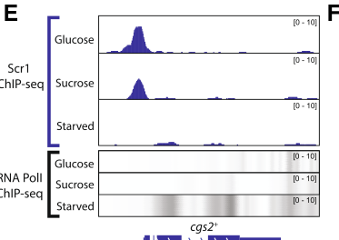

## Question

# Gene Research for Functional Annotation

## ⚠️ CRITICAL: Gene/Protein Identification Context

**BEFORE YOU BEGIN RESEARCH:** You MUST verify you are researching the CORRECT gene/protein. Gene symbols can be ambiguous, especially for less well-characterized genes from non-model organisms.

### Target Gene/Protein Identity (from UniProt):
- **UniProt Accession:** P36599
- **Protein Description:** RecName: Full=3',5'-cyclic-nucleotide phosphodiesterase; Short=PDEase; EC=3.1.4.17;
- **Gene Information:** Name=cgs2; Synonyms=pde1; ORFNames=SPCC285.09c;
- **Organism (full):** Schizosaccharomyces pombe (strain 972 / ATCC 24843) (Fission yeast).
- **Protein Family:** Belongs to the cyclic nucleotide phosphodiesterase class-II
- **Key Domains:** cAMP-PdiesteraseII_CS. (IPR024225); Pdiesterase2. (IPR000396); RibonucZ/Hydroxyglut_hydro. (IPR036866); PDEase_II (PF02112)

### MANDATORY VERIFICATION STEPS:

1. **Check if the gene symbol "cgs2" matches the protein description above**
2. **Verify the organism is correct:** Schizosaccharomyces pombe (strain 972 / ATCC 24843) (Fission yeast).
3. **Check if protein family/domains align with what you find in literature**
4. **If you find literature for a DIFFERENT gene with the same or similar symbol, STOP**

### If Gene Symbol is Ambiguous or You Cannot Find Relevant Literature:

**DO NOT PROCEED WITH RESEARCH ON A DIFFERENT GENE.** Instead:
- State clearly: "The gene symbol 'cgs2' is ambiguous or literature is limited for this specific protein"
- Explain what you found (e.g., "Found extensive literature on a different gene with the same symbol in a different organism")
- Describe the protein based ONLY on the UniProt information provided above
- Suggest that the protein function can be inferred from domain/family information

### Research Target:

Please provide a comprehensive research report on the gene **cgs2** (gene ID: cgs2, UniProt: P36599) in SCHPO.

The research report should be a detailed narrative explaining the function, biological processes, and localization of the gene product. Citations should be given for all claims.

You should prioritize authoritative reviews and primary scientific literature when conducting research. You can supplement
this with annotations you find in gene/protein databases, but these can be outdated or inaccurate.

We are specifically interested in the primary function of the gene - for enzymes, what reaction is catalyzed, and what is the substrate specificity? For transporters, what is the substrate? For structural proteins or adapters, what is the broader structural role? For signaling molecules, what is the role in the pathway.

We are interested in where in or outside the cell the gene product carries out its function.

We are also interested in the signaling or biochemical pathways in which the gene functions. We are less interested in broad pleiotropic effects, except where these elucidate the precise role.

Include evidence where possible. We are interested in both experimental evidence as well as inference from structure, evolution, or bioinformatic analysis. Precise studies should be prioritized over high-throughput, where available.

## Output

Question: You are an expert researcher providing comprehensive, well-cited information.

Provide detailed information focusing on:
1. Key concepts and definitions with current understanding
2. Recent developments and latest research (prioritize 2023-2024 sources)
3. Current applications and real-world implementations
4. Expert opinions and analysis from authoritative sources
5. Relevant statistics and data from recent studies

Format as a comprehensive research report with proper citations. Include URLs and publication dates where available.
Always prioritize recent, authoritative sources and provide specific citations for all major claims.

# Gene Research for Functional Annotation

## ⚠️ CRITICAL: Gene/Protein Identification Context

**BEFORE YOU BEGIN RESEARCH:** You MUST verify you are researching the CORRECT gene/protein. Gene symbols can be ambiguous, especially for less well-characterized genes from non-model organisms.

### Target Gene/Protein Identity (from UniProt):
- **UniProt Accession:** P36599
- **Protein Description:** RecName: Full=3',5'-cyclic-nucleotide phosphodiesterase; Short=PDEase; EC=3.1.4.17;
- **Gene Information:** Name=cgs2; Synonyms=pde1; ORFNames=SPCC285.09c;
- **Organism (full):** Schizosaccharomyces pombe (strain 972 / ATCC 24843) (Fission yeast).
- **Protein Family:** Belongs to the cyclic nucleotide phosphodiesterase class-II
- **Key Domains:** cAMP-PdiesteraseII_CS. (IPR024225); Pdiesterase2. (IPR000396); RibonucZ/Hydroxyglut_hydro. (IPR036866); PDEase_II (PF02112)

### MANDATORY VERIFICATION STEPS:

1. **Check if the gene symbol "cgs2" matches the protein description above**
2. **Verify the organism is correct:** Schizosaccharomyces pombe (strain 972 / ATCC 24843) (Fission yeast).
3. **Check if protein family/domains align with what you find in literature**
4. **If you find literature for a DIFFERENT gene with the same or similar symbol, STOP**

### If Gene Symbol is Ambiguous or You Cannot Find Relevant Literature:

**DO NOT PROCEED WITH RESEARCH ON A DIFFERENT GENE.** Instead:
- State clearly: "The gene symbol 'cgs2' is ambiguous or literature is limited for this specific protein"
- Explain what you found (e.g., "Found extensive literature on a different gene with the same symbol in a different organism")
- Describe the protein based ONLY on the UniProt information provided above
- Suggest that the protein function can be inferred from domain/family information

### Research Target:

Please provide a comprehensive research report on the gene **cgs2** (gene ID: cgs2, UniProt: P36599) in SCHPO.

The research report should be a detailed narrative explaining the function, biological processes, and localization of the gene product. Citations should be given for all claims.

You should prioritize authoritative reviews and primary scientific literature when conducting research. You can supplement
this with annotations you find in gene/protein databases, but these can be outdated or inaccurate.

We are specifically interested in the primary function of the gene - for enzymes, what reaction is catalyzed, and what is the substrate specificity? For transporters, what is the substrate? For structural proteins or adapters, what is the broader structural role? For signaling molecules, what is the role in the pathway.

We are interested in where in or outside the cell the gene product carries out its function.

We are also interested in the signaling or biochemical pathways in which the gene functions. We are less interested in broad pleiotropic effects, except where these elucidate the precise role.

Include evidence where possible. We are interested in both experimental evidence as well as inference from structure, evolution, or bioinformatic analysis. Precise studies should be prioritized over high-throughput, where available.

# Functional annotation of *Schizosaccharomyces pombe* **cgs2**

## Identity and principal function

The target is the fission-yeast **cgs2** gene, also called **pde1**, rather than the similarly named PKA regulatory-subunit gene **cgs1** or a *pde1* gene from another organism. A primary *S. pombe* transcriptomics study explicitly identifies **cgs2** as locus **SPCC285.09c** and its product as a cAMP-specific phosphodiesterase. The accession **P36599** and strain designation **972/ATCC 24843** are supplied by the target UniProt record; the retrieved experiments corroborate the organism, gene name, alias, locus and function, but did not independently establish the accession-to-strain mapping. (li1995thecyclicamp pages 23-28, xuefranzen2006genomewideidentificationof pages 4-6)

**The established reaction is 3′,5′-cAMP + H₂O → 5′-AMP.** Cgs2 removes an intracellular second messenger rather than producing one: in its absence, cAMP accumulates and PKA signaling increases. In an early functional experiment summarized by Li, expression of *S. pombe* Pde1 in budding-yeast cells lacking their own phosphodiesterases restored high cAMP-phosphodiesterase activity. In fission yeast, deletion increased intracellular cAMP, whereas overexpression decreased it. These complementary biochemical and genetic observations provide substantially stronger support for cAMP hydrolysis than sequence annotation alone. The original cloning paper is Matviw, Li and Young, published **1993**, https://doi.org/10.1006/bbrc.1993.1787; the accessible experimental account is Li, **1995**, https://doi.org/10.11575/prism/18829. (li1995thecyclicamp pages 23-28)

The UniProt information supplied for this task assigns Cgs2 to **cyclic-nucleotide phosphodiesterase class II** and lists **PDEase_II/PF02112**, **Pdiesterase2/IPR000396**, **cAMP-PdiesteraseII_CS/IPR024225** and **IPR036866**. This is consistent with the reported sequence similarity—approximately **24% identity**—to the low-affinity budding-yeast cAMP phosphodiesterase, but the domain identifiers themselves were not experimentally validated in the retrieved *S. pombe* studies. Crucially, the relevant comparison is to a class-II-type fungal enzyme, **not** to human PDE1 or the other mammalian class-I PDE families. (li1995thecyclicamp pages 23-28, hoffman2022useofa pages 1-2)

### Substrate specificity: what is and is not established

**cAMP is an experimentally supported substrate.** The retrieved Cgs2-specific literature did **not** establish a cGMP-hydrolysis rate, cAMP:cGMP preference, or purified-enzyme kinetic constants. Consequently, “cAMP-specific” is an appropriate description of its demonstrated physiological role, but neither absolute inability to hydrolyze cGMP nor dual specificity should be claimed from these data. Hydrolysis of cGMP by a different PDE expressed experimentally in fission yeast is **not** evidence that endogenous Cgs2 does so. (li1995thecyclicamp pages 23-28, xuefranzen2006genomewideidentificationof pages 4-6)

## Pathway and biological processes

In glucose-replete cells, the glucose-sensing receptor **Git3** signals through the **Gpa2–Git5–Git11** heterotrimeric G protein to stimulate **Cyr1** adenylyl cyclase, which synthesizes cAMP from ATP. cAMP binds the **Cgs1** regulatory subunit of PKA, releasing/activating the **Pka1** catalytic subunit. **Cgs2 opposes this sequence by hydrolyzing cAMP**, thereby limiting the amplitude or duration of PKA signaling. Pka1 inhibits **Rst2**; when cAMP–PKA signaling falls during nutrient limitation, Rst2 can promote **ste11** expression and the initiation of sexual differentiation. This places Cgs2 at the biochemical junction between glucose sensing and the starvation-responsive transcriptional program, rather than making it a receptor or a direct DNA-binding regulator. Kawamukai’s authoritative review was published **2024**, https://doi.org/10.1093/bbb/zbae019. (kawamukai2024regulationofsexual pages 4-5, kawamukai2024regulationofsexual pages 4-4, vassiliadis2019agenomewideanalysis media 75d0e7b4)

Genetics agrees with this placement. Loss of *pde1/cgs2* elevates cAMP and impairs mating and meiosis; it also compromises stationary-phase survival and glucose-starvation induction of the gluconeogenesis reporter **fbp1**. Overexpression lowers cAMP and alleviates inhibition of sexual development. Those developmental and reporter phenotypes are **downstream readouts of excessive cAMP–PKA activity**, not evidence that Cgs2 itself catalyzes a step in meiosis or gluconeogenesis. Hoffman’s expert synthesis, published **2022**, is at https://doi.org/10.3389/fphar.2021.833156. (li1995thecyclicamp pages 23-28, hoffman2022useofa pages 2-3)

Cgs2 is also subject to transcriptional and possible activity-level regulation. In a **2019** primary study, Scr1 chromatin immunoprecipitation identified binding at the **cgs2** promoter, while RNA-seq found significantly greater **cgs2** expression in **scr1Δ** cells under glucose-sufficient conditions. Thus, glucose-dependent Scr1 repression acts directly at the gene’s regulatory region; increased Cgs2 expression during nutrient limitation is a plausible contributor to reduced cAMP and PKA activity. The study’s promoter data and pathway model are illustrated in its Figure 3. Vassiliadis *et al.*, **2019**, https://doi.org/10.1186/s12864-019-5602-8. (vassiliadis2019agenomewideanalysis pages 3-7, vassiliadis2019agenomewideanalysis media 75d0e7b4)

A distinct **2006** pheromone-response experiment identified **cgs2/SPCC285.09c** among induced transcripts: **3.4-fold after M-factor** and **2.1-fold after P-factor** stimulation in the assayed backgrounds. This supports an additional transcriptional connection between the mating response and cAMP degradation; these are **mRNA fold changes**, not measurements of Cgs2 protein abundance or enzyme activity. Xue-Franzén *et al.*, **2006**, https://doi.org/10.1186/1471-2164-7-303. (xuefranzen2006genomewideidentificationof pages 3-4, xuefranzen2006genomewideidentificationof pages 4-6)

For post-stimulus feedback, a **cgs2-2** mutant has elevated basal cAMP yet retains an approximately wild-type glucose-induced *fold* response. Conversely, **cgs2-s1** has approximately normal basal cAMP but an enhanced glucose-triggered response. Together these allele-specific observations suggest that Cgs2 both helps set basal cAMP and restrains the induced cAMP pulse. Whether its proposed activation is mediated by direct PKA phosphorylation, cAMP-dependent allostery, or another mechanism **has not been resolved** by the available evidence; a mechanism established for a different organism’s Pde1 must not be transferred to Cgs2. Hoffman, **2005**, https://doi.org/10.1042/BST0330257; the pertinent primary genetics study is Wang *et al.*, **2005**, https://doi.org/10.1534/genetics.105.047233, which was not accessible in full in this search. (hoffman2005glucosesensingvia pages 2-3, hoffman2005glucosesensingvia pages 3-4)

## Site of action and recent direct observations

**Cgs2 acts on an intracellular cAMP pool**, as inferred from intracellular cAMP measurements and PKA-dependent phenotypes. Nevertheless, the retrieved studies did **not** directly establish where the **Cgs2 protein** resides within the cell. A precise assignment to cytosol, nucleus, plasma membrane, mitochondria or another compartment would therefore be unjustified. In particular, microscopy showing redistribution of **Rst2, Pka1 or a PKA reporter does not localize Cgs2**. No evidence reviewed here supports an extracellular catalytic role. (li1995thecyclicamp pages 23-28, sakai2024livecellfluorescenceimaging pages 9-11)

A **2024** live-cell study provides a useful modern functional test. Its Rst2-derived PKA translocation reporter was cytoplasmic in **cgs2Δ** cells grown with **2% glucose**, with a response comparable to or greater than wild type; by contrast, **cyr1Δ** and **pka1Δ** showed nuclear reporter accumulation. The study also observed a higher signal from an Epac-based cAMP sensor in **cgs2Δ**, although that sensor did not respond convincingly to loss of Cyr1 and was judged insufficiently sensitive for physiological cAMP measurements. Thus, the PKA reporter strengthens the conclusion that Cgs2 restrains signaling **in living cells**, without establishing its localization or a direct enzymatic rate. The work appeared as a February **2024** preprint, https://doi.org/10.1101/2024.01.14.575615; the subsequently published article is https://doi.org/10.1002/yea.3937. (sakai2024livecellfluorescenceimaging pages 7-9, sakai2024livecellfluorescenceimaging pages 9-11)

The broader physiological relevance of the pathway continues to develop: a separate **2024** study found that lowering glucose-linked Pka1 activity changes the requirement for septation-initiation-network signaling during cytokinesis. That study establishes a downstream **PKA-pathway** connection, **not** a direct catalytic or physical role for Cgs2 in the septation machinery. Özdemir *et al.*, **2024**, https://doi.org/10.1242/jcs.261488. (ozdemir2024arolefor pages 1-2, ozdemir2024arolefor pages 2-4)

## Research implementation and assessment

Cgs2’s status as the endogenous fission-yeast PDE has practical value in **cell-based PDE screening**. Researchers replaced its locus with mammalian PDE genes and used cAMP/PKA-dependent **fbp1** reporters to identify cellular PDE activity or inhibitors; native Cgs2 served as a comparator. In one assay, wild-type-Cgs2 reporter activity was **1,661 ± 121** units with vehicle and **1,807 ± 446** and **1,784 ± 429** with **50** and **100 μM rolipram**, respectively, whereas an inactive frameshifted **Cgs2-2** control gave **23 ± 10** vehicle units. This indicates **no detectable rolipram inhibition of Cgs2 in that cellular assay**, not an in-vitro IC₅₀ or proof of universal inhibitor resistance. Ivey *et al.*, **2008**, https://doi.org/10.1177/1087057107312127. (ivey2008developmentofa pages 2-4, ivey2008developmentofa pages 4-5)

The central functional annotation is consequently **intracellular cAMP turnover and attenuation of glucose–cAMP–PKA signaling**. The strongest direct evidence concerns cAMP hydrolysis and its genetic/signaling consequences; **Cgs2-specific cGMP kinetics, a definitive subcellular location, and the molecular mechanism of acute enzyme activation remain unresolved** in the sources reviewed. Those uncertainties are important distinctions when interpreting family annotations, pathway diagrams and experiments performed on other proteins. (li1995thecyclicamp pages 23-28, hoffman2005glucosesensingvia pages 3-4, sakai2024livecellfluorescenceimaging pages 9-11)

The following evidence matrix distinguishes direct observations from inference.

| Question | Evidence | Interpretation / limitations | References |
|---|---|---|---|
| Correct identity? | In *S. pombe*, **cgs2** is systematic locus **SPCC285.09c** and encodes a cAMP-specific phosphodiesterase. Its transcript was induced **3.4-fold by M-factor** and **2.1-fold by P-factor**. | Confirms the target is fission-yeast **Cgs2/Pde1**, not the PKA regulatory subunit **Cgs1** or a **PDE1** from another organism. P36599 was not independently established by this experiment. | Xue-Franzén et al. (2006), *BMC Genomics* 7:303, https://doi.org/10.1186/1471-2164-7-303 (xuefranzen2006genomewideidentificationof pages 4-6) |
| Primary reaction and cAMP evidence? | Cgs2/Pde1 catalyzes **cAMP + H₂O → 5′-AMP**. Expression in budding-yeast cells lacking endogenous PDE genes restored high cAMP-PDE activity; deletion in *S. pombe* elevated intracellular cAMP and impaired mating/meiosis, whereas overexpression reduced cAMP. | Complementation, intracellular cAMP measurements, and reciprocal loss-/gain-of-function phenotypes strongly establish cAMP hydrolysis. The retrieved account does not provide purified-enzyme kinetic constants. | Matviw, Li & Young (1993), *Biochem. Biophys. Res. Commun.* 194:79–82, https://doi.org/10.1006/bbrc.1993.1787; summarized in Li (1995), https://doi.org/10.11575/prism/18829 (li1995thecyclicamp pages 23-28) |
| Is cGMP a demonstrated substrate? | No retrieved study directly measured Cgs2-catalyzed cGMP hydrolysis or reported cAMP-versus-cGMP kinetic constants. | **cGMP specificity remains unverified.** Class-II PDE domain annotation or activity of other PDEs cannot substitute for a substrate assay of *S. pombe* Cgs2. | Evidence review of the original functional literature (li1995thecyclicamp pages 23-28) |
| Where does Cgs2 act? | Loss of Cgs2 elevates intracellular cAMP and activates the intracellular PKA pathway; no direct Cgs2-GFP, fractionation, secretion, or organelle-localization experiment was found. | Function is inferred to occur **inside the cell**, but cytosolic, nuclear, membrane-associated, or organellar localization cannot presently be assigned. Localization of Cgs1, Pka1, or Rst2 is not evidence for Cgs2 localization. | Li (1995), https://doi.org/10.11575/prism/18829 (li1995thecyclicamp pages 23-28); Sakai, Aoki & Goto (2024), https://doi.org/10.1002/yea.3937 (sakai2024livecellfluorescenceimaging pages 9-11) |
| Role in glucose-feedback control? | **cgs2-2** cells have elevated basal cAMP but retain a glucose-induced fold increase similar to wild type. **cgs2-s1** cells have approximately wild-type basal cAMP but an enhanced glucose response, consistent with failure to activate PDE appropriately after stimulation. | Cgs2 helps set basal cAMP and restrain/terminate the glucose-induced signal. Feedback may involve PKA or cAMP-dependent allostery, but **direct PKA phosphorylation of Cgs2 has not been demonstrated**. | Hoffman (2005), *Biochem. Soc. Trans.* 33:257–260, https://doi.org/10.1042/BST0330257 (hoffman2005glucosesensingvia pages 3-4) |
| Is cgs2 transcription glucose regulated? | Scr1 ChIP-seq detected Scr1 at the **cgs2** promoter, and RNA-seq showed significant cgs2 upregulation in **scr1Δ** cells under glucose-sufficient conditions. | Supports direct carbon-catabolite repression of cgs2 by Scr1. Increased Cgs2 provides a plausible route from nutrient limitation to lower cAMP, reduced PKA activity, and Rst2/Ste11 activation; downstream causality is partly inferred. | Vassiliadis et al. (2019), *BMC Genomics* 20:251, https://doi.org/10.1186/s12864-019-5602-8 (vassiliadis2019agenomewideanalysis pages 3-7) |
| What did 2024 live-cell work add? | In 2% glucose, an Rst2-derived PKA translocation reporter was cytoplasmic in **cgs2Δ** cells, with activity comparable to or above wild type. Deleting cgs2 also increased the CFP/FRET signal of an Epac cAMP sensor, although that sensor failed an important low-cAMP validation in **cyr1Δ** cells. | Provides single-cell evidence that Cgs2 restrains PKA activity. The PKA reporter is stronger evidence than the insufficiently sensitive Epac sensor; neither experiment localizes Cgs2 itself. | Sakai, Aoki & Goto (2024), *Yeast* 41:349–363, https://doi.org/10.1002/yea.3937; preprint https://doi.org/10.1101/2024.01.14.575615 (sakai2024livecellfluorescenceimaging pages 9-11) |
| Practical application in PDE screening? | Endogenous Cgs2 served as the reference PDE in a fission-yeast cell-based screen. Reporter activity was **1,661 ± 121** with vehicle, **1,807 ± 446** with 50 µM rolipram, and **1,784 ± 429** with 100 µM rolipram, indicating no detectable inhibition; inactive frameshifted Cgs2-2 gave **23 ± 10**. | Cgs2 is a useful endogenous activity/counter-screen comparator. Rolipram insensitivity at 50–100 µM is a cellular assay result, not a purified-enzyme IC₅₀ or proof of absolute resistance. | Ivey et al. (2008), *J. Biomol. Screen.* 13:62–71, https://doi.org/10.1177/1087057107312127 (ivey2008developmentofa pages 4-5) |

*Table: Compact evidence assessment for the correctly identified *S. pombe* Cgs2/Pde1 protein, separating established cAMP-PDE function from unresolved cGMP specificity and localization. It also summarizes regulatory, live-cell, and screening evidence without extrapolating from unrelated PDE1 proteins.*

References

1. (li1995thecyclicamp pages 23-28): Jiahua Li. The cyclic amp signal transduction pathway in fission yeast schizosaccharomyces pombe. Jan 1995. URL: https://doi.org/10.11575/prism/18829, doi:10.11575/prism/18829. This article has 0 citations.

2. (xuefranzen2006genomewideidentificationof pages 4-6): Yongtao Xue-Franzén, Søren Kjærulff, Christian Holmberg, Anthony Wright, and Olaf Nielsen. Genomewide identification of pheromone-targeted transcription in fission yeast. BMC Genomics, 7:303-303, Nov 2006. URL: https://doi.org/10.1186/1471-2164-7-303, doi:10.1186/1471-2164-7-303. This article has 80 citations and is from a peer-reviewed journal.

3. (hoffman2022useofa pages 1-2): Charles S. Hoffman. Use of a fission yeast platform to identify and characterize small molecule pde inhibitors. Frontiers in Pharmacology, Jan 2022. URL: https://doi.org/10.3389/fphar.2021.833156, doi:10.3389/fphar.2021.833156. This article has 4 citations.

4. (kawamukai2024regulationofsexual pages 4-5): Makoto Kawamukai. Regulation of sexual differentiation initiation in schizosaccharomyces pombe. Bioscience, biotechnology, and biochemistry, 88:475-492, Mar 2024. URL: https://doi.org/10.1093/bbb/zbae019, doi:10.1093/bbb/zbae019. This article has 17 citations.

5. (kawamukai2024regulationofsexual pages 4-4): Makoto Kawamukai. Regulation of sexual differentiation initiation in schizosaccharomyces pombe. Bioscience, biotechnology, and biochemistry, 88:475-492, Mar 2024. URL: https://doi.org/10.1093/bbb/zbae019, doi:10.1093/bbb/zbae019. This article has 17 citations.

6. (vassiliadis2019agenomewideanalysis media 75d0e7b4): Dane Vassiliadis, Koon Ho Wong, Alex Andrianopoulos, and Brendon J. Monahan. A genome-wide analysis of carbon catabolite repression in schizosaccharomyces pombe. BMC Genomics, Mar 2019. URL: https://doi.org/10.1186/s12864-019-5602-8, doi:10.1186/s12864-019-5602-8. This article has 33 citations and is from a peer-reviewed journal.

7. (hoffman2022useofa pages 2-3): Charles S. Hoffman. Use of a fission yeast platform to identify and characterize small molecule pde inhibitors. Frontiers in Pharmacology, Jan 2022. URL: https://doi.org/10.3389/fphar.2021.833156, doi:10.3389/fphar.2021.833156. This article has 4 citations.

8. (vassiliadis2019agenomewideanalysis pages 3-7): Dane Vassiliadis, Koon Ho Wong, Alex Andrianopoulos, and Brendon J. Monahan. A genome-wide analysis of carbon catabolite repression in schizosaccharomyces pombe. BMC Genomics, Mar 2019. URL: https://doi.org/10.1186/s12864-019-5602-8, doi:10.1186/s12864-019-5602-8. This article has 33 citations and is from a peer-reviewed journal.

9. (xuefranzen2006genomewideidentificationof pages 3-4): Yongtao Xue-Franzén, Søren Kjærulff, Christian Holmberg, Anthony Wright, and Olaf Nielsen. Genomewide identification of pheromone-targeted transcription in fission yeast. BMC Genomics, 7:303-303, Nov 2006. URL: https://doi.org/10.1186/1471-2164-7-303, doi:10.1186/1471-2164-7-303. This article has 80 citations and is from a peer-reviewed journal.

10. (hoffman2005glucosesensingvia pages 2-3): Charles S. Hoffman. Glucose sensing via the protein kinase a pathway in schizosaccharomyces pombe. Biochemical Society transactions, 33 Pt 1:257-60, Feb 2005. URL: https://doi.org/10.1042/bst0330257, doi:10.1042/bst0330257. This article has 155 citations and is from a peer-reviewed journal.

11. (hoffman2005glucosesensingvia pages 3-4): Charles S. Hoffman. Glucose sensing via the protein kinase a pathway in schizosaccharomyces pombe. Biochemical Society transactions, 33 Pt 1:257-60, Feb 2005. URL: https://doi.org/10.1042/bst0330257, doi:10.1042/bst0330257. This article has 155 citations and is from a peer-reviewed journal.

12. (sakai2024livecellfluorescenceimaging pages 9-11): Keiichiro Sakai, Kazuhiro Aoki, and Yuhei Goto. Live-cell fluorescence imaging and optogenetic control of pka kinase activity in fission yeast<i>schizosaccharomyces pombe</i>. BioRxiv, Jan 2024. URL: https://doi.org/10.1101/2024.01.14.575615, doi:10.1101/2024.01.14.575615. This article has 0 citations.

13. (sakai2024livecellfluorescenceimaging pages 7-9): Keiichiro Sakai, Kazuhiro Aoki, and Yuhei Goto. Live-cell fluorescence imaging and optogenetic control of pka kinase activity in fission yeast<i>schizosaccharomyces pombe</i>. BioRxiv, Jan 2024. URL: https://doi.org/10.1101/2024.01.14.575615, doi:10.1101/2024.01.14.575615. This article has 0 citations.

14. (ozdemir2024arolefor pages 1-2): Özge Uysal Özdemir, Andrea Krapp, Bastien Mangeat, Marc Spaltenstein, and Viesturs Simanis. A role for the carbon source of the cell and protein kinase a in regulating the s. pombe septation initiation network. Journal of Cell Science, Jan 2024. URL: https://doi.org/10.1242/jcs.261488, doi:10.1242/jcs.261488. This article has 3 citations and is from a domain leading peer-reviewed journal.

15. (ozdemir2024arolefor pages 2-4): Özge Uysal Özdemir, Andrea Krapp, Bastien Mangeat, Marc Spaltenstein, and Viesturs Simanis. A role for the carbon source of the cell and protein kinase a in regulating the s. pombe septation initiation network. Journal of Cell Science, Jan 2024. URL: https://doi.org/10.1242/jcs.261488, doi:10.1242/jcs.261488. This article has 3 citations and is from a domain leading peer-reviewed journal.

16. (ivey2008developmentofa pages 2-4): F. Douglas Ivey, Lili Wang, Didem Demirbas, Christina Allain, and Charles S. Hoffman. Development of a fission yeast-based high-throughput screen to identify chemical regulators of camp phosphodiesterases. Journal of Biomolecular Screening, 13:62-71, Jan 2008. URL: https://doi.org/10.1177/1087057107312127, doi:10.1177/1087057107312127. This article has 46 citations.

17. (ivey2008developmentofa pages 4-5): F. Douglas Ivey, Lili Wang, Didem Demirbas, Christina Allain, and Charles S. Hoffman. Development of a fission yeast-based high-throughput screen to identify chemical regulators of camp phosphodiesterases. Journal of Biomolecular Screening, 13:62-71, Jan 2008. URL: https://doi.org/10.1177/1087057107312127, doi:10.1177/1087057107312127. This article has 46 citations.

## Artifacts

- [Edison artifact artifact-00](cgs2-deep-research-falcon_artifacts/artifact-00.md)

## Citations

1. li1995thecyclicamp pages 23-28
2. xuefranzen2006genomewideidentificationof pages 4-6
3. sakai2024livecellfluorescenceimaging pages 9-11
4. hoffman2005glucosesensingvia pages 3-4
5. vassiliadis2019agenomewideanalysis pages 3-7
6. ivey2008developmentofa pages 4-5
7. hoffman2022useofa pages 1-2
8. kawamukai2024regulationofsexual pages 4-5
9. kawamukai2024regulationofsexual pages 4-4
10. hoffman2022useofa pages 2-3
11. xuefranzen2006genomewideidentificationof pages 3-4
12. hoffman2005glucosesensingvia pages 2-3
13. sakai2024livecellfluorescenceimaging pages 7-9
14. ozdemir2024arolefor pages 1-2
15. ozdemir2024arolefor pages 2-4
16. ivey2008developmentofa pages 2-4
17. https://doi.org/10.1006/bbrc.1993.1787;
18. https://doi.org/10.11575/prism/18829.
19. https://doi.org/10.1093/bbb/zbae019.
20. https://doi.org/10.3389/fphar.2021.833156.
21. https://doi.org/10.1186/s12864-019-5602-8.
22. https://doi.org/10.1186/1471-2164-7-303.
23. https://doi.org/10.1042/BST0330257;
24. https://doi.org/10.1534/genetics.105.047233,
25. https://doi.org/10.1101/2024.01.14.575615;
26. https://doi.org/10.1002/yea.3937.
27. https://doi.org/10.1242/jcs.261488.
28. https://doi.org/10.1177/1087057107312127.
29. https://doi.org/10.1186/1471-2164-7-303
30. https://doi.org/10.11575/prism/18829
31. https://doi.org/10.1002/yea.3937
32. https://doi.org/10.1042/BST0330257
33. https://doi.org/10.1186/s12864-019-5602-8
34. https://doi.org/10.1002/yea.3937;
35. https://doi.org/10.1101/2024.01.14.575615
36. https://doi.org/10.1177/1087057107312127
37. https://doi.org/10.11575/prism/18829,
38. https://doi.org/10.1186/1471-2164-7-303,
39. https://doi.org/10.3389/fphar.2021.833156,
40. https://doi.org/10.1093/bbb/zbae019,
41. https://doi.org/10.1186/s12864-019-5602-8,
42. https://doi.org/10.1042/bst0330257,
43. https://doi.org/10.1101/2024.01.14.575615,
44. https://doi.org/10.1242/jcs.261488,
45. https://doi.org/10.1177/1087057107312127,