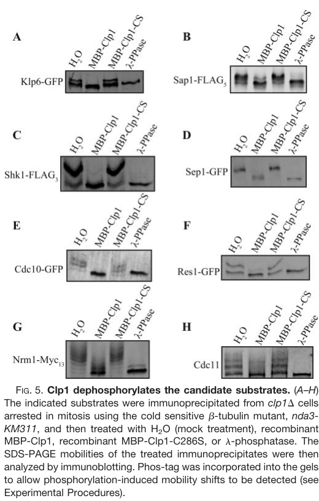

## Question

# Gene Research for Functional Annotation

## ⚠️ CRITICAL: Gene/Protein Identification Context

**BEFORE YOU BEGIN RESEARCH:** You MUST verify you are researching the CORRECT gene/protein. Gene symbols can be ambiguous, especially for less well-characterized genes from non-model organisms.

### Target Gene/Protein Identity (from UniProt):
- **UniProt Accession:** Q9P7H1
- **Protein Description:** RecName: Full=Tyrosine-protein phosphatase CDC14 homolog; EC=3.1.3.48; AltName: Full=CDC fourteen-like phosphatase 1;
- **Gene Information:** Name=clp1; Synonyms=flp1; ORFNames=SPAC1782.09c;
- **Organism (full):** Schizosaccharomyces pombe (strain 972 / ATCC 24843) (Fission yeast).
- **Protein Family:** Belongs to the protein-tyrosine phosphatase family. Non-
- **Key Domains:** CDC14_C. (IPR044506); DSPn. (IPR029260); Dual-sp_phosphatase_cat-dom. (IPR000340); Prot-tyrosine_phosphatase-like. (IPR029021); PTP. (IPR050561)

### MANDATORY VERIFICATION STEPS:

1. **Check if the gene symbol "clp1" matches the protein description above**
2. **Verify the organism is correct:** Schizosaccharomyces pombe (strain 972 / ATCC 24843) (Fission yeast).
3. **Check if protein family/domains align with what you find in literature**
4. **If you find literature for a DIFFERENT gene with the same or similar symbol, STOP**

### If Gene Symbol is Ambiguous or You Cannot Find Relevant Literature:

**DO NOT PROCEED WITH RESEARCH ON A DIFFERENT GENE.** Instead:
- State clearly: "The gene symbol 'clp1' is ambiguous or literature is limited for this specific protein"
- Explain what you found (e.g., "Found extensive literature on a different gene with the same symbol in a different organism")
- Describe the protein based ONLY on the UniProt information provided above
- Suggest that the protein function can be inferred from domain/family information

### Research Target:

Please provide a comprehensive research report on the gene **clp1** (gene ID: clp1, UniProt: Q9P7H1) in SCHPO.

The research report should be a detailed narrative explaining the function, biological processes, and localization of the gene product. Citations should be given for all claims.

You should prioritize authoritative reviews and primary scientific literature when conducting research. You can supplement
this with annotations you find in gene/protein databases, but these can be outdated or inaccurate.

We are specifically interested in the primary function of the gene - for enzymes, what reaction is catalyzed, and what is the substrate specificity? For transporters, what is the substrate? For structural proteins or adapters, what is the broader structural role? For signaling molecules, what is the role in the pathway.

We are interested in where in or outside the cell the gene product carries out its function.

We are also interested in the signaling or biochemical pathways in which the gene functions. We are less interested in broad pleiotropic effects, except where these elucidate the precise role.

Include evidence where possible. We are interested in both experimental evidence as well as inference from structure, evolution, or bioinformatic analysis. Precise studies should be prioritized over high-throughput, where available.

## Output

Question: You are an expert researcher providing comprehensive, well-cited information.

Provide detailed information focusing on:
1. Key concepts and definitions with current understanding
2. Recent developments and latest research (prioritize 2023-2024 sources)
3. Current applications and real-world implementations
4. Expert opinions and analysis from authoritative sources
5. Relevant statistics and data from recent studies

Format as a comprehensive research report with proper citations. Include URLs and publication dates where available.
Always prioritize recent, authoritative sources and provide specific citations for all major claims.

# Gene Research for Functional Annotation

## ⚠️ CRITICAL: Gene/Protein Identification Context

**BEFORE YOU BEGIN RESEARCH:** You MUST verify you are researching the CORRECT gene/protein. Gene symbols can be ambiguous, especially for less well-characterized genes from non-model organisms.

### Target Gene/Protein Identity (from UniProt):
- **UniProt Accession:** Q9P7H1
- **Protein Description:** RecName: Full=Tyrosine-protein phosphatase CDC14 homolog; EC=3.1.3.48; AltName: Full=CDC fourteen-like phosphatase 1;
- **Gene Information:** Name=clp1; Synonyms=flp1; ORFNames=SPAC1782.09c;
- **Organism (full):** Schizosaccharomyces pombe (strain 972 / ATCC 24843) (Fission yeast).
- **Protein Family:** Belongs to the protein-tyrosine phosphatase family. Non-
- **Key Domains:** CDC14_C. (IPR044506); DSPn. (IPR029260); Dual-sp_phosphatase_cat-dom. (IPR000340); Prot-tyrosine_phosphatase-like. (IPR029021); PTP. (IPR050561)

### MANDATORY VERIFICATION STEPS:

1. **Check if the gene symbol "clp1" matches the protein description above**
2. **Verify the organism is correct:** Schizosaccharomyces pombe (strain 972 / ATCC 24843) (Fission yeast).
3. **Check if protein family/domains align with what you find in literature**
4. **If you find literature for a DIFFERENT gene with the same or similar symbol, STOP**

### If Gene Symbol is Ambiguous or You Cannot Find Relevant Literature:

**DO NOT PROCEED WITH RESEARCH ON A DIFFERENT GENE.** Instead:
- State clearly: "The gene symbol 'clp1' is ambiguous or literature is limited for this specific protein"
- Explain what you found (e.g., "Found extensive literature on a different gene with the same symbol in a different organism")
- Describe the protein based ONLY on the UniProt information provided above
- Suggest that the protein function can be inferred from domain/family information

### Research Target:

Please provide a comprehensive research report on the gene **clp1** (gene ID: clp1, UniProt: Q9P7H1) in SCHPO.

The research report should be a detailed narrative explaining the function, biological processes, and localization of the gene product. Citations should be given for all claims.

You should prioritize authoritative reviews and primary scientific literature when conducting research. You can supplement
this with annotations you find in gene/protein databases, but these can be outdated or inaccurate.

We are specifically interested in the primary function of the gene - for enzymes, what reaction is catalyzed, and what is the substrate specificity? For transporters, what is the substrate? For structural proteins or adapters, what is the broader structural role? For signaling molecules, what is the role in the pathway.

We are interested in where in or outside the cell the gene product carries out its function.

We are also interested in the signaling or biochemical pathways in which the gene functions. We are less interested in broad pleiotropic effects, except where these elucidate the precise role.

Include evidence where possible. We are interested in both experimental evidence as well as inference from structure, evolution, or bioinformatic analysis. Precise studies should be prioritized over high-throughput, where available.

# Functional annotation report: *Schizosaccharomyces pombe clp1/flp1* (UniProt Q9P7H1)

## Executive conclusion

The requested protein is correctly identified. In the supplied UniProt record, **clp1** (synonym **flp1**; ORF **SPAC1782.09c**) from *Schizosaccharomyces pombe* strain 972 encodes the organism’s sole **Cdc14-family phosphoprotein phosphatase**, conventionally called Clp1 or Flp1. Organism-specific primary literature independently uses the same clp1/flp1 aliases and identifies the product as the fission-yeast Cdc14 homolog. Its catalytic Cys286, proline-directed phosphatase behavior, and Cdc14/dual-specificity phosphatase architecture agree with the supplied DSPn, dual-specificity phosphatase catalytic, PTP-like, PTP, and CDC14_C domain annotations. No findings about unrelated CLP1 genes in other organisms were used. The exact accession-to-ORF mapping is database metadata supplied in the question rather than independently demonstrated by these papers. (cuervo2011analysisofthe pages 24-27, chen2013comprehensiveproteomicsanalysis pages 1-2)

The primary molecular function is **phosphoprotein dephosphorylation**, principally reversal of proline-directed Cdk1 phosphorylation on mitotic substrates. Through this activity and tightly regulated redistribution between nucleolus, nucleus, spindle apparatus, spindle-pole bodies, and division site, Clp1 coordinates mitotic exit, chromosome segregation, septation-initiation-network signaling, and a cytokinesis checkpoint. Recent work adds a stress-dependent nuclear function: Clp1 directly dephosphorylates the Atf1/Pcr1 transcription factor Pcr1 and limits the magnitude and duration of the oxidative-stress transcriptional response. (wolfe2004fissionyeastclp1p pages 1-2, trautmann2005distinctnuclearand pages 2-3, canete2023fissionyeastcdc14like pages 2-3, canete2023fissionyeastcdc14like pages 8-9)

| Aspect | Best-supported conclusion | Evidence type / strength | Key quantitative result | Principal study, date, DOI URL |
|---|---|---|---|---|
| Identity and family | The supplied Q9P7H1 identity—**clp1**, synonym **flp1**, in *Schizosaccharomyces pombe*—matches the literature’s sole Cdc14-family phosphatase. Its proline-directed phosphatase activity and catalytic Cys286 agree with the supplied dual-specificity phosphatase/PTP-like and CDC14_C domain annotations. | Strong concordance among organism-specific primary studies, catalytic mutant data, and supplied UniProt metadata; the papers do not independently establish the accession-to-ORF mapping. (chen2013comprehensiveproteomicsanalysis pages 1-2) | One Cdc14-family member is reported in *S. pombe*; C286S is catalytically inactive/substrate trapping. | Chen et al., published online **2013-01-07**, [https://doi.org/10.1074/mcp.M112.025924](https://doi.org/10.1074/mcp.M112.025924) |
| Catalytic reaction and specificity | Clp1 hydrolyzes phosphomonoester bonds on phosphorylated proteins, yielding dephosphorylated protein plus inorganic phosphate. Functionally it preferentially reverses proline-directed Cdk1 phosphorylation, especially **pSer/pThr-Pro** sites; “dual-specificity phosphatase” denotes the catalytic family, but endogenous phosphotyrosine substrates have not been established here. | Strong biochemical and substrate-trapping evidence for Cdk1-phosphoprotein preference; no reported kinetic constants or proof that all Cdk1 sites—or physiological phosphotyrosine sites—are substrates. (chen2013comprehensiveproteomicsanalysis pages 7-8, chen2013comprehensiveproteomicsanalysis pages 1-2) | More than 100 interactors; more than 70 enriched with C286S; **44/73** candidate substrates carried detected Cdk1-consensus phosphosites. | Chen et al., **2013-05**, [https://doi.org/10.1074/mcp.M112.025924](https://doi.org/10.1074/mcp.M112.025924) |
| Cdc25 substrate | Clp1 dephosphorylates and inactivates Cdc25 during mitotic exit, promoting Cdc25 destabilization/APC-C–dependent turnover. This weakens the Cdc25–Cdc2 positive-feedback loop and favors inhibitory Cdc2 Tyr15 phosphorylation. | Strong genetic, phosphostate, activity, and cell-cycle evidence; the foundational result is mechanistically persuasive, although the extracted evidence provides no kinetic or residue-level specificity. (wolfe2004fissionyeastclp1p pages 1-2) | In block–release experiments, Cdc25 activity remained elevated throughout the sampled period in **clp1Δ**, unlike wild type; no numerical activity ratio was reported in the excerpt. | Wolfe & Gould, **2004-02**, [https://doi.org/10.1038/sj.emboj.7600103](https://doi.org/10.1038/sj.emboj.7600103) |
| Cdc11 substrate | The SIN scaffold Cdc11 is directly dephosphorylated by recombinant Clp1, with cellular evidence indicating preferential removal of its eight Cdk1 sites. Persistent phosphomimetic modification impairs SIN signaling. | Strong in-vitro dephosphorylation, phosphosite-mutant, phosphostate, and genetic evidence; strongest for direct biochemical substrate status and physiological Cdk-site regulation. (chen2013comprehensiveproteomicsanalysis pages 7-8, chen2013comprehensiveproteomicsanalysis media d83de936) | Cdc11 contains **8** mapped Cdk1 sites. Cytokinesis failure was **3%** in clp1Δ, **18%** in csc1Δ, and **35%** in the double mutant at 36°C. | Chen et al., **2013-05**, [https://doi.org/10.1074/mcp.M112.025924](https://doi.org/10.1074/mcp.M112.025924) |
| Pcr1 substrate | Under oxidative stress, Clp1 associates with the Atf1/Pcr1 transcription-factor complex and directly dephosphorylates Pcr1 in vitro, thereby helping limit the magnitude and duration of stress-induced transcription. | Strong biochemical evidence for direct substrate status plus co-immunoprecipitation and cellular phosphostate evidence; the target residue(s), kinetics, and full in-vivo causal chain remain unresolved. (canete2023fissionyeastcdc14like pages 8-9, canete2023fissionyeastcdc14like pages 6-8) | Pcr1 dephosphorylation assay: **4 independent experiments**, phospho/dephospho ratio **P < 0.005**; substrate was obtained after **1 mM H₂O₂ for 10 min**. | Canete et al., **2023-09**, [https://doi.org/10.1038/s41598-023-41869-w](https://doi.org/10.1038/s41598-023-41869-w) |
| Other biochemically validated proteins | Recombinant Clp1 reduced phosphorylation-dependent mobility shifts of Klp6, Sap1, Shk1, Sep1, Cdc10, Res1, Nrm1, and Cdc11 isolated from mitotic cells. These are validated **in-vitro substrates/candidates**, but the assays do not by themselves prove that each is a direct, physiologically consequential in-vivo target. | Moderate-to-strong biochemical evidence; direct cellular function and relevant target sites remain incompletely validated for most proteins. (chen2013comprehensiveproteomicsanalysis pages 7-8, chen2013comprehensiveproteomicsanalysis media d83de936) | **8 proteins** were tested in the displayed phosphatase panel; wild-type Clp1, but not C286S, reduced or abolished mobility shifts. | Chen et al., **2013-05**, [https://doi.org/10.1074/mcp.M112.025924](https://doi.org/10.1074/mcp.M112.025924) |
| Dynamic localization | In interphase, Clp1 occupies the nucleolus and spindle-pole body. At mitotic entry it redistributes to kinetochores, spindle, medial cortex/contractile ring, and nucleoplasm/cytoplasm; it returns to the nucleolus after spindle breakdown and cytokinesis. Nuclear and cytoplasmic pools support chromosome segregation and cytokinesis-checkpoint functions, respectively. | Strong endogenous-promoter GFP imaging and forced NLS/NES localization evidence. (trautmann2005distinctnuclearand pages 1-2, trautmann2005distinctnuclearand pages 2-3) | Cytoplasmic ring recruitment appeared about **20 min** after release from a G2 block; samples were scored every **10 min**. Nuclear exclusion increased minichromosome loss **5.38-fold**, versus **28.2-fold** for clp1Δ and approximately **2-fold** for nuclear-biased Clp1. | Trautmann & McCollum, **2005-08-09**, [https://doi.org/10.1016/j.cub.2005.06.039](https://doi.org/10.1016/j.cub.2005.06.039) |
| SIN and cytokinesis checkpoint | Cytoplasmic Clp1 phosphatase activity helps maintain a SIN-dependent delay in further nuclear division when contractile-ring assembly or constriction is perturbed, allowing cytokinesis to finish and limiting polyploidization. Clp1 also supports cytokinetic-ring/SIN regulation through substrates including Cdc11 and previously implicated Cdc15. | Strong localization-restriction, catalytic-mutant, drug perturbation, temperature-sensitive mutant, and epistasis evidence. (trautmann2005distinctnuclearand pages 2-3, chen2013comprehensiveproteomicsanalysis pages 7-8) | C286S and nuclear-restricted Clp1 accumulated nuclei similarly to clp1Δ after low-dose latrunculin B or cdc3-124 checkpoint activation; the Cdc11/SIP double-mutant defect reached **35%**. | Trautmann & McCollum, **2005-08-09**, [https://doi.org/10.1016/j.cub.2005.06.039](https://doi.org/10.1016/j.cub.2005.06.039); Chen et al., **2013-05**, [https://doi.org/10.1074/mcp.M112.025924](https://doi.org/10.1074/mcp.M112.025924) |
| Nuclear import | Sal3 is the required importin-β3-family karyopherin for Clp1 nuclear entry. A basic C-terminal NLS is necessary and residues 476–537 are sufficient for Sal3-dependent nuclear accumulation. Cytoplasmic SPB/ring targeting remains intact when the NLS is disrupted. | Strong co-immunoprecipitation, systematic importin-mutant imaging, truncation, sufficiency, and point-mutant evidence. (chen2013comprehensiveproteomicsanalysis pages 8-11) | Nuclear Clp1 was absent in all scored sal3Δ cells and in Clp1(1–500): **n=186/32** interphase/mitotic sal3Δ cells and **n=134/42** truncation cells. Mutation of **R524, K527, K529, K532, R534** abolished nuclear localization (**n=117/38**). | Chen et al., **2013-05**, [https://doi.org/10.1074/mcp.M112.025924](https://doi.org/10.1074/mcp.M112.025924) |
| Oxidative-stress regulation | H₂O₂ induces phosphorylation-dependent release of Flp1/Clp1 from the nucleolus to the nucleoplasm. There it acts as a negative modulator of Atf1/Pcr1- and indirectly Pap1-linked transcription; deletion increases and prolongs stress-gene expression and can enhance acquired peroxide resistance. | Strong recent imaging, mutant, expression, survival, interaction, and biochemical evidence; exact kinase/site contributions remain partly disputed. (canete2023fissionyeastcdc14like pages 2-3, canete2023fissionyeastcdc14like pages 5-6, canete2023fissionyeastcdc14like pages 3-5) | Nine-site RxxS mutant remained nucleolar in **95%** of cells. After 0.2 mM H₂O₂ preconditioning and 25 mM challenge, 1-h survival was **53% wild type, 89% Δflp1, 93% flp1-9A**; after 2 h it was **5%, 71%, and 16%**, respectively. | Canete et al., **2023-09**, [https://doi.org/10.1038/s41598-023-41869-w](https://doi.org/10.1038/s41598-023-41869-w) |
| Key uncertainties | The complete physiological substrate set, residue-level determinants of selectivity, catalytic kinetics, and any endogenous phosphotyrosine targets remain unknown. Many C286S-enriched interactors are candidates rather than proven substrates. Oxidative-stress studies disagree over whether six RxxS plus three TP substitutions or nine RxxS substitutions best block release, possibly because mutant conformation alters kinase access. | Explicit limitations and conflicting mutant-localization results; candidate lists require target-by-target in-vivo validation. (chen2013comprehensiveproteomicsanalysis pages 4-7, canete2023fissionyeastcdc14like pages 9-10, canete2023fissionyeastcdc14like pages 8-9) | **44/73** trapped candidates had detected Cdk1 sites, meaning neither trapping nor a Cdk motif alone proves direct physiological dephosphorylation; no Km, kcat, or global in-vivo occupancy measurements are available. | Chen et al., **2013-05**, [https://doi.org/10.1074/mcp.M112.025924](https://doi.org/10.1074/mcp.M112.025924); Canete et al., **2023-09**, [https://doi.org/10.1038/s41598-023-41869-w](https://doi.org/10.1038/s41598-023-41869-w) |

*Table: Evidence-graded summary of the identity, enzymology, substrates, localization, pathway functions, stress biology, and unresolved questions for *S. pombe* Clp1/Flp1 (Q9P7H1). It distinguishes demonstrated biochemical substrates from candidates supported only by trapping, interaction, or genetic evidence.*

## 1. Enzymatic function and substrate specificity

Clp1 is a Cdc14-family, cysteine-dependent phosphatase. The generic reaction is:

**phosphoprotein + H₂O → dephosphorylated protein + inorganic phosphate.**

Although annotated as a protein-tyrosine/dual-specificity phosphatase by catalytic fold, the strongest physiological evidence in *S. pombe* concerns **phosphoserine/phosphothreonine followed by proline**, particularly Cdk1-generated S/T-P sites. Cdc14 enzymes are therefore often described functionally as proline-directed phosphatases. The available studies do not establish an endogenous phosphotyrosine substrate for Clp1, so “dual specificity” should not be interpreted as evidence that tyrosine dephosphorylation is a major physiological function. Nor are Km, kcat, or a complete residue-level specificity profile available. (chen2013comprehensiveproteomicsanalysis pages 7-8, chen2013comprehensiveproteomicsanalysis pages 1-2)

The catalytic substitution **C286S** abolishes effective phosphatase activity and traps substrates. In a 2013 2D-LC–MS/MS analysis, more than 100 proteins reproducibly associated with Clp1, more than 70 were enriched with Clp1-C286S, and 44 of 73 candidate substrates carried detected Cdk1-consensus phosphosites. This strongly supports preference for Cdk1-phosphorylated proteins, but substrate trapping and motif occurrence alone do not prove direct physiological dephosphorylation. (chen2013comprehensiveproteomicsanalysis pages 1-2, chen2013comprehensiveproteomicsanalysis pages 4-7)

### Best-supported substrates

**Cdc25 phosphatase.** Clp1 dephosphorylates, inactivates, and destabilizes Cdc25 during mitotic exit, promoting its recognition by the APC/C-dependent degradation machinery. Because Cdc25 activates Cdc2/Cdk1 by removing inhibitory Tyr15 phosphorylation, Clp1 indirectly suppresses mitotic Cdk activity and breaks the Cdc25–Cdc2 positive-feedback loop. In nda3 block–release experiments, Cdc25 remained hyperphosphorylated and active in *clp1Δ* cells while it was inactivated in wild type. This is the clearest mechanistic link between Clp1 and mitotic exit, although the extracted evidence contains no kinetic constants or definitive Clp1-sensitive Cdc25 residue map. (cuervo2011analysisofthe pages 24-27, wolfe2004fissionyeastclp1p pages 1-2)

**Cdc11 SIN scaffold.** Recombinant wild-type Clp1, but not C286S, removed phosphorylation-dependent mobility shifts from Cdc11. Cdc11 contains eight mapped Cdk1 sites; cellular phosphomutant analysis indicates that Clp1 preferentially removes this Cdk1-site set rather than the seven Sid2 sites. A phosphomimetic Cdc11-S8D allele weakened SIN signaling, consistent with dephosphorylation being functionally activating or permissive. Cytokinesis failure at 36°C rose from 3% in *clp1Δ* and 18% in *csc1Δ* to 35% in the double mutant, showing that Clp1 and the PP2A-family SIN-inhibitory phosphatase act through distinct, partially compensatory mechanisms. (chen2013comprehensiveproteomicsanalysis pages 7-8, chen2013comprehensiveproteomicsanalysis media ceda9eb8)

**Pcr1 transcription factor.** Following oxidative stress, Pcr1 co-immunoprecipitated with Flp1/Clp1. Pcr1 obtained after 1 mM H₂O₂ for 10 minutes was dephosphorylated by recombinant GST-Flp1 but not catalytic-dead Flp1-CS; quantification across four independent experiments gave P<0.005. Pcr1 is therefore a direct biochemical substrate, although its target residues and phosphatase kinetics remain unknown. In *flp1Δ* cells, Pcr1 remained more phosphorylated at later stress time points, supporting physiological relevance. (canete2023fissionyeastcdc14like pages 8-9, canete2023fissionyeastcdc14like pages 6-8)

**Other validated biochemical candidates.** Recombinant Clp1 reduced or abolished phosphorylation-associated mobility shifts of Klp6, Sap1, Shk1, Sep1, Cdc10, Res1, and Nrm1, in addition to Cdc11. This demonstrates susceptibility in the assay and is stronger than interaction evidence alone. Nevertheless, direct cellular dephosphorylation, responsible sites, and functional consequences remain incompletely established for most of these proteins. The experimental phosphatase panel visually shows activity of wild-type Clp1 but not C286S against all eight tested proteins. (chen2013comprehensiveproteomicsanalysis pages 7-8, chen2013comprehensiveproteomicsanalysis media d83de936)

## 2. Cellular localization and spatial control

Clp1 activity is controlled substantially by access to substrates rather than merely by abundance.

* During **interphase**, endogenous-promoter Clp1-GFP occupies the **nucleolus** and **spindle-pole body**. Nucleolar sequestration limits access to nucleoplasmic substrates.
* At **mitotic entry**, Clp1 is released from the nucleolus and appears in the nucleoplasm, at kinetochores, on the mitotic spindle, at spindle-pole bodies, and at the medial cortex/contractile ring.
* During **anaphase and cytokinesis**, the protein remains distributed between nuclear and cytoplasmic sites. After spindle breakdown and completion of ring constriction, it returns to the nucleolus/SPBs. (trautmann2005distinctnuclearand pages 1-2, chen2013comprehensiveproteomicsanalysis pages 1-2)

Forced localization demonstrates compartment-specific function. Cytoplasmic-biased NES-Clp1 moved from the SPB to medial cortical puncta approximately 20 minutes after release from a G2 block, assembled into the contractile ring, and returned to SPBs after constriction. Nuclear-biased NLS-Clp1 moved from the nucleolus to kinetochore-associated foci and then the anaphase spindle. Excluding Clp1 from the nucleus increased minichromosome loss 5.38-fold; complete deletion produced a 28.2-fold increase, while nuclear-biased Clp1 caused only an approximately twofold increase. Thus, nuclear Clp1 supports chromosome segregation, whereas cytoplasmic Clp1 supports cytokinesis-checkpoint activity. (trautmann2005distinctnuclearand pages 1-2, trautmann2005distinctnuclearand pages 2-3)

Nuclear entry requires **Sal3**, an importin-β3-family karyopherin. Clp1 was absent from nuclei in all scored *sal3Δ* cells, while SPB and contractile-ring localization remained intact. A C-terminal region spanning residues 476–537 was sufficient for Sal3-dependent nuclear accumulation; truncation at residue 500 or alanine substitution of R524, K527, K529, K532, and R534 abolished nuclear localization. The systematic counts included 186 interphase and 32 mitotic *sal3Δ* cells, 134 interphase and 42 mitotic truncation cells, and 117 interphase and 38 mitotic NLS-mutant cells. (chen2013comprehensiveproteomicsanalysis pages 8-11)

## 3. Pathway functions

### Mitotic entry and exit

Deletion causes precocious mitotic entry, whereas overexpression produces an approximately four-hour G2 delay during which wild-type cells complete two divisions. Clp1’s major mechanistic contribution is antagonism of Cdk1 signaling through Cdc25 dephosphorylation and turnover. Unlike budding-yeast Cdc14, fission-yeast Clp1 is nonessential and is not thought to drive mitotic exit primarily through Rum1 or Ste9/Cdh1. It is better regarded as a spatially regulated modulator that makes mitotic exit and the following interphase robust. (cuervo2011analysisofthe pages 24-27, trautmann2001fissionyeastclp1p pages 1-2, chen2013comprehensiveproteomicsanalysis pages 1-2)

### Chromosome segregation

Nuclear Clp1 localizes to kinetochores and the spindle and contributes to chromosome biorientation and spindle function. The chromosome-loss phenotypes produced by nuclear exclusion, together with synthetic interactions involving chromosome-segregation factors, provide strong functional evidence. Proteomic associations with kinesin-8 Klp5–Klp6 and DASH-complex components offer plausible substrate mechanisms, but most remain candidates rather than fully validated in-vivo targets. (chen2013comprehensiveproteomicsanalysis pages 1-2, trautmann2005distinctnuclearand pages 1-2, chen2013comprehensiveproteomicsanalysis pages 4-7)

### SIN, contractile ring, and cytokinesis checkpoint

The septation initiation network (SIN) maintains Clp1 outside the nucleolus during late mitosis and cytokinesis. When the actomyosin ring is mildly perturbed, cytoplasmic Clp1 phosphatase activity helps delay another nuclear division, allowing cytokinesis to finish and preventing polyploidization. Nuclear-restricted Clp1 and catalytic-dead C286S fail to maintain this checkpoint after low-dose latrunculin B treatment or disruption of profilin by *cdc3-124*. Cytoplasmic Clp1 alone cannot rescue a Sid2-defective SIN, indicating that Clp1 operates through or with the SIN rather than as a wholly parallel timer. Cdc11 dephosphorylation provides a direct molecular connection; Mid1-mediated recruitment also gives Clp1 access to the cytokinetic-ring substrate Cdc15. (trautmann2005distinctnuclearand pages 2-3, chen2013comprehensiveproteomicsanalysis pages 7-8)

### Oxidative-stress signaling: the principal recent development

The major recent mechanistic advance is the September 2023 *Scientific Reports* study showing that 1 mM H₂O₂ causes phosphorylation-dependent release of Flp1/Clp1 from the nucleolus into the nucleoplasm. Cds1/Chk1-associated RxxS sites and additional Pmk1/Cdk1-associated TP sites have been implicated. A nine-RxxS-site alanine mutant remained nucleolar in 95% of cells and reproduced much of the deletion strain’s transcriptional phenotype. Once released, Clp1 associates with Atf1/Pcr1 and directly dephosphorylates Pcr1, constraining transcription driven by Atf1/Pcr1 and, directly or indirectly, Pap1. (canete2023fissionyeastcdc14like pages 2-3, canete2023fissionyeastcdc14like pages 1-2, canete2023fissionyeastcdc14like pages 3-5)

After H₂O₂ exposure, wild-type *ctt1+*, *gpd1+*, *hsp9+*, and *pyp2+* transcripts peaked around 15–30 minutes and then declined. In *flp1Δ*, induction was stronger and persisted longer, while basal levels were largely unchanged. This establishes Clp1 as a **negative fine-tuner**, not a core activator, of oxidative-stress transcription. Atf1 and Pcr1 abundance increased in the mutant, Pcr1 remained hyperphosphorylated, and altered Atf1/Pcr1 signaling likely explains at least part of the effect. (canete2023fissionyeastcdc14like pages 9-10, canete2023fissionyeastcdc14like pages 2-3, canete2023fissionyeastcdc14like pages 3-5)

The physiological consequence is unusually clear. After preconditioning with 0.2 mM H₂O₂ for one hour and challenge with 25 mM H₂O₂, one-hour survival was 53% for wild type, 89% for *flp1Δ*, and 93% for the nucleolus-retained *flp1-9A-GFP* strain. After a two-hour challenge, survival was 5%, 71%, and 16%, respectively. Thus, loss of Clp1 can enhance acquired peroxide resistance by prolonging the adaptive transcriptional program, although it should not be interpreted as globally beneficial under all stress conditions. (canete2023fissionyeastcdc14like pages 5-6)

## 4. Current applications and expert interpretation

Clp1 has no direct clinical or industrial implementation established by these studies. Its present “real-world” application is as an experimentally tractable model for conserved Cdc14 biology, including phosphatase substrate trapping, spatial control of cell-cycle phosphatases, coupling of nuclear division to cytokinesis, and integration of cell-cycle and stress signaling. Because *clp1* is nonessential in fission yeast, catalytic, localization, and phosphosite mutants can be analyzed without conditional depletion, making the system particularly useful for distinguishing catalytic activity from compartment-specific substrate access. (chen2013comprehensiveproteomicsanalysis pages 8-11, chen2013comprehensiveproteomicsanalysis pages 1-2)

The most defensible expert synthesis is that Clp1 is **not a universal mitotic “off switch.”** It is a dynamically localized phosphatase that selectively reverses a subset of Cdk1-linked phosphorylation events and acts on additional stress-regulated targets. Its effect depends on location and timing: Cdc25 control reduces mitotic Cdk activity; Cdc11 and ring-associated targets coordinate SIN/cytokinesis; kinetochore/spindle access promotes chromosome fidelity; and stress-induced nucleoplasmic release restrains Atf1/Pcr1 transcription. The broad proteomic interaction network—mitosis, cytokinesis, transcription, trafficking, and ribosome biogenesis—should therefore be treated as a discovery framework, not as proof that every associated process is directly regulated by Clp1. (chen2013comprehensiveproteomicsanalysis pages 1-2, chen2013comprehensiveproteomicsanalysis pages 7-8)

## 5. Evidence limitations and unresolved questions

1. **Specificity is incompletely defined.** Proline-directed Cdk1 phosphosites are strongly enriched, but it remains unknown whether all relevant substrates require S/T-P motifs or whether endogenous phosphotyrosine substrates exist. No detailed kinetic profile is available. (chen2013comprehensiveproteomicsanalysis pages 1-2)
2. **Many proteomic hits remain candidates.** C286S enrichment, co-immunoprecipitation, or a Cdk1 motif is insufficient by itself; direct biochemical and in-vivo site validation is required for each target. (chen2013comprehensiveproteomicsanalysis pages 4-7)
3. **Stress-release phosphosite models are not fully reconciled.** Earlier six-RxxS plus three-TP mutants and the 2023 nine-RxxS mutant gave differing localization behavior. The later authors suggest that extensive alanine substitution may alter conformation and kinase access. (canete2023fissionyeastcdc14like pages 9-10, canete2023fissionyeastcdc14like pages 8-9)
4. **Pcr1 mechanism remains partial.** Direct dephosphorylation is established, but the responsible Pcr1 residues and how their modification changes DNA binding, dimerization, turnover, or transcriptional potency remain unresolved. Pap1 effects may be indirect. (canete2023fissionyeastcdc14like pages 9-10, canete2023fissionyeastcdc14like pages 6-8)
5. **The recent literature is sparse.** The 2023 oxidative-stress paper is the principal recent gene-specific mechanistic advance found. A 2024 global meiotic phosphoproteome mentions Clp1 but does not by itself define a new direct Clp1 mechanism; foundational 2001–2013 studies therefore remain the authoritative evidence for its core function.

## Overall functional annotation

**Clp1/Flp1 is a dynamically localized Cdc14-family phosphoprotein phosphatase whose principal established specificity is for proline-directed Cdk1-phosphorylated proteins. It dephosphorylates Cdc25 to suppress mitotic Cdk activity, dephosphorylates Cdc11 and ring-associated targets to coordinate SIN signaling and cytokinesis, acts from kinetochores/spindle to support chromosome segregation, and, following oxidative-stress-induced nucleolar release, directly dephosphorylates Pcr1 to limit stress-responsive transcription.** Its function is therefore defined as much by regulated localization and substrate access as by catalytic activity itself. (wolfe2004fissionyeastclp1p pages 1-2, trautmann2005distinctnuclearand pages 2-3, chen2013comprehensiveproteomicsanalysis pages 7-8, canete2023fissionyeastcdc14like pages 8-9)

References

1. (cuervo2011analysisofthe pages 24-27): Helena Díaz Cuervo. Analysis of the role of cdc14/flp1 in checkpoint response to genotoxic stress in "schizosaccharomyces pombe". ArXiv, Apr 2011. URL: https://doi.org/10.14201/gredos.22507, doi:10.14201/gredos.22507. This article has 1 citations.

2. (chen2013comprehensiveproteomicsanalysis pages 1-2): Jun-Song Chen, Matthew R. Broadus, Janel R. McLean, Anna Feoktistova, Liping Ren, and Kathleen L. Gould. Comprehensive proteomics analysis reveals new substrates and regulators of the fission yeast clp1/cdc14 phosphatase. Molecular &amp; Cellular Proteomics, 12:1074-1086, May 2013. URL: https://doi.org/10.1074/mcp.m112.025924, doi:10.1074/mcp.m112.025924. This article has 74 citations and is from a domain leading peer-reviewed journal.

3. (wolfe2004fissionyeastclp1p pages 1-2): Benjamin A Wolfe and Kathleen L Gould. Fission yeast clp1p phosphatase affects g2/m transition and mitotic exit through cdc25p inactivation. The EMBO Journal, 23:919-929, Feb 2004. URL: https://doi.org/10.1038/sj.emboj.7600103, doi:10.1038/sj.emboj.7600103. This article has 119 citations.

4. (trautmann2005distinctnuclearand pages 2-3): Susanne Trautmann and Dannel McCollum. Distinct nuclear and cytoplasmic functions of the s. pombe cdc14-like phosphatase clp1p/flp1p and a role for nuclear shuttling in its regulation. Current Biology, 15:1384-1389, Aug 2005. URL: https://doi.org/10.1016/j.cub.2005.06.039, doi:10.1016/j.cub.2005.06.039. This article has 41 citations and is from a highest quality peer-reviewed journal.

5. (canete2023fissionyeastcdc14like pages 2-3): Juan A. Canete, Sonia Andrés, Sofía Muñoz, Javier Zamarreño, Sergio Rodríguez, Helena Díaz-Cuervo, Avelino Bueno, and María P. Sacristán. Fission yeast cdc14-like phosphatase flp1/clp1 modulates the transcriptional response to oxidative stress. Scientific Reports, Sep 2023. URL: https://doi.org/10.1038/s41598-023-41869-w, doi:10.1038/s41598-023-41869-w. This article has 3 citations and is from a peer-reviewed journal.

6. (canete2023fissionyeastcdc14like pages 8-9): Juan A. Canete, Sonia Andrés, Sofía Muñoz, Javier Zamarreño, Sergio Rodríguez, Helena Díaz-Cuervo, Avelino Bueno, and María P. Sacristán. Fission yeast cdc14-like phosphatase flp1/clp1 modulates the transcriptional response to oxidative stress. Scientific Reports, Sep 2023. URL: https://doi.org/10.1038/s41598-023-41869-w, doi:10.1038/s41598-023-41869-w. This article has 3 citations and is from a peer-reviewed journal.

7. (chen2013comprehensiveproteomicsanalysis pages 7-8): Jun-Song Chen, Matthew R. Broadus, Janel R. McLean, Anna Feoktistova, Liping Ren, and Kathleen L. Gould. Comprehensive proteomics analysis reveals new substrates and regulators of the fission yeast clp1/cdc14 phosphatase. Molecular &amp; Cellular Proteomics, 12:1074-1086, May 2013. URL: https://doi.org/10.1074/mcp.m112.025924, doi:10.1074/mcp.m112.025924. This article has 74 citations and is from a domain leading peer-reviewed journal.

8. (chen2013comprehensiveproteomicsanalysis media d83de936): Jun-Song Chen, Matthew R. Broadus, Janel R. McLean, Anna Feoktistova, Liping Ren, and Kathleen L. Gould. Comprehensive proteomics analysis reveals new substrates and regulators of the fission yeast clp1/cdc14 phosphatase. Molecular &amp; Cellular Proteomics, 12:1074-1086, May 2013. URL: https://doi.org/10.1074/mcp.m112.025924, doi:10.1074/mcp.m112.025924. This article has 74 citations and is from a domain leading peer-reviewed journal.

9. (canete2023fissionyeastcdc14like pages 6-8): Juan A. Canete, Sonia Andrés, Sofía Muñoz, Javier Zamarreño, Sergio Rodríguez, Helena Díaz-Cuervo, Avelino Bueno, and María P. Sacristán. Fission yeast cdc14-like phosphatase flp1/clp1 modulates the transcriptional response to oxidative stress. Scientific Reports, Sep 2023. URL: https://doi.org/10.1038/s41598-023-41869-w, doi:10.1038/s41598-023-41869-w. This article has 3 citations and is from a peer-reviewed journal.

10. (trautmann2005distinctnuclearand pages 1-2): Susanne Trautmann and Dannel McCollum. Distinct nuclear and cytoplasmic functions of the s. pombe cdc14-like phosphatase clp1p/flp1p and a role for nuclear shuttling in its regulation. Current Biology, 15:1384-1389, Aug 2005. URL: https://doi.org/10.1016/j.cub.2005.06.039, doi:10.1016/j.cub.2005.06.039. This article has 41 citations and is from a highest quality peer-reviewed journal.

11. (chen2013comprehensiveproteomicsanalysis pages 8-11): Jun-Song Chen, Matthew R. Broadus, Janel R. McLean, Anna Feoktistova, Liping Ren, and Kathleen L. Gould. Comprehensive proteomics analysis reveals new substrates and regulators of the fission yeast clp1/cdc14 phosphatase. Molecular &amp; Cellular Proteomics, 12:1074-1086, May 2013. URL: https://doi.org/10.1074/mcp.m112.025924, doi:10.1074/mcp.m112.025924. This article has 74 citations and is from a domain leading peer-reviewed journal.

12. (canete2023fissionyeastcdc14like pages 5-6): Juan A. Canete, Sonia Andrés, Sofía Muñoz, Javier Zamarreño, Sergio Rodríguez, Helena Díaz-Cuervo, Avelino Bueno, and María P. Sacristán. Fission yeast cdc14-like phosphatase flp1/clp1 modulates the transcriptional response to oxidative stress. Scientific Reports, Sep 2023. URL: https://doi.org/10.1038/s41598-023-41869-w, doi:10.1038/s41598-023-41869-w. This article has 3 citations and is from a peer-reviewed journal.

13. (canete2023fissionyeastcdc14like pages 3-5): Juan A. Canete, Sonia Andrés, Sofía Muñoz, Javier Zamarreño, Sergio Rodríguez, Helena Díaz-Cuervo, Avelino Bueno, and María P. Sacristán. Fission yeast cdc14-like phosphatase flp1/clp1 modulates the transcriptional response to oxidative stress. Scientific Reports, Sep 2023. URL: https://doi.org/10.1038/s41598-023-41869-w, doi:10.1038/s41598-023-41869-w. This article has 3 citations and is from a peer-reviewed journal.

14. (chen2013comprehensiveproteomicsanalysis pages 4-7): Jun-Song Chen, Matthew R. Broadus, Janel R. McLean, Anna Feoktistova, Liping Ren, and Kathleen L. Gould. Comprehensive proteomics analysis reveals new substrates and regulators of the fission yeast clp1/cdc14 phosphatase. Molecular &amp; Cellular Proteomics, 12:1074-1086, May 2013. URL: https://doi.org/10.1074/mcp.m112.025924, doi:10.1074/mcp.m112.025924. This article has 74 citations and is from a domain leading peer-reviewed journal.

15. (canete2023fissionyeastcdc14like pages 9-10): Juan A. Canete, Sonia Andrés, Sofía Muñoz, Javier Zamarreño, Sergio Rodríguez, Helena Díaz-Cuervo, Avelino Bueno, and María P. Sacristán. Fission yeast cdc14-like phosphatase flp1/clp1 modulates the transcriptional response to oxidative stress. Scientific Reports, Sep 2023. URL: https://doi.org/10.1038/s41598-023-41869-w, doi:10.1038/s41598-023-41869-w. This article has 3 citations and is from a peer-reviewed journal.

16. (chen2013comprehensiveproteomicsanalysis media ceda9eb8): Jun-Song Chen, Matthew R. Broadus, Janel R. McLean, Anna Feoktistova, Liping Ren, and Kathleen L. Gould. Comprehensive proteomics analysis reveals new substrates and regulators of the fission yeast clp1/cdc14 phosphatase. Molecular &amp; Cellular Proteomics, 12:1074-1086, May 2013. URL: https://doi.org/10.1074/mcp.m112.025924, doi:10.1074/mcp.m112.025924. This article has 74 citations and is from a domain leading peer-reviewed journal.

17. (trautmann2001fissionyeastclp1p pages 1-2): Susanne Trautmann, Benjamin A. Wolfe, Paul Jorgensen, Mike Tyers, Kathleen L. Gould, and Dannel McCollum. Fission yeast clp1p phosphatase regulates g2/m transition and coordination of cytokinesis with cell cycle progression. Current Biology, 11:931-940, Jun 2001. URL: https://doi.org/10.1016/s0960-9822(01)00268-8, doi:10.1016/s0960-9822(01)00268-8. This article has 269 citations and is from a highest quality peer-reviewed journal.

18. (canete2023fissionyeastcdc14like pages 1-2): Juan A. Canete, Sonia Andrés, Sofía Muñoz, Javier Zamarreño, Sergio Rodríguez, Helena Díaz-Cuervo, Avelino Bueno, and María P. Sacristán. Fission yeast cdc14-like phosphatase flp1/clp1 modulates the transcriptional response to oxidative stress. Scientific Reports, Sep 2023. URL: https://doi.org/10.1038/s41598-023-41869-w, doi:10.1038/s41598-023-41869-w. This article has 3 citations and is from a peer-reviewed journal.

## Artifacts

- [Edison artifact artifact-00](clp1-deep-research-falcon_artifacts/artifact-00.md)

## Citations

1. chen2013comprehensiveproteomicsanalysis pages 1-2
2. chen2013comprehensiveproteomicsanalysis pages 8-11
3. chen2013comprehensiveproteomicsanalysis pages 4-7
4. cuervo2011analysisofthe pages 24-27
5. trautmann2005distinctnuclearand pages 2-3
6. chen2013comprehensiveproteomicsanalysis pages 7-8
7. trautmann2005distinctnuclearand pages 1-2
8. https://doi.org/10.1074/mcp.M112.025924
9. https://doi.org/10.1038/sj.emboj.7600103
10. https://doi.org/10.1038/s41598-023-41869-w
11. https://doi.org/10.1016/j.cub.2005.06.039
12. https://doi.org/10.1074/mcp.M112.025924](https://doi.org/10.1074/mcp.M112.025924
13. https://doi.org/10.1038/sj.emboj.7600103](https://doi.org/10.1038/sj.emboj.7600103
14. https://doi.org/10.1038/s41598-023-41869-w](https://doi.org/10.1038/s41598-023-41869-w
15. https://doi.org/10.1016/j.cub.2005.06.039](https://doi.org/10.1016/j.cub.2005.06.039
16. https://doi.org/10.14201/gredos.22507,
17. https://doi.org/10.1074/mcp.m112.025924,
18. https://doi.org/10.1038/sj.emboj.7600103,
19. https://doi.org/10.1016/j.cub.2005.06.039,
20. https://doi.org/10.1038/s41598-023-41869-w,
21. https://doi.org/10.1016/s0960-9822(01