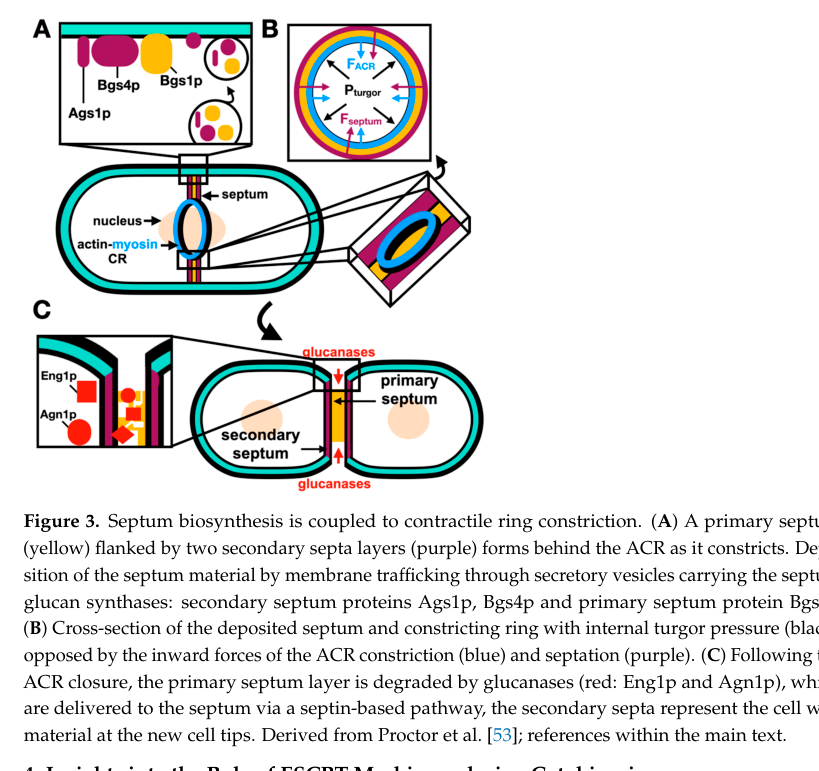

## Question

# Gene Research for Functional Annotation

## ⚠️ CRITICAL: Gene/Protein Identification Context

**BEFORE YOU BEGIN RESEARCH:** You MUST verify you are researching the CORRECT gene/protein. Gene symbols can be ambiguous, especially for less well-characterized genes from non-model organisms.

### Target Gene/Protein Identity (from UniProt):
- **UniProt Accession:** Q9C105
- **Protein Description:** RecName: Full=Chitinase-like protein PB1E7.04c; EC=3.2.1.-; Flags: Precursor;
- **Gene Information:** ORFNames=SPAPB1E7.04c;
- **Organism (full):** Schizosaccharomyces pombe (strain 972 / ATCC 24843) (Fission yeast).
- **Protein Family:** Belongs to the glycosyl hydrolase 18 family. Chitinase
- **Key Domains:** Cts1-like. (IPR045321); Glyco_hydro18_cat. (IPR001223); Glycoside_hydrolase_SF. (IPR017853); Glycosyl_Hydrlase18_Chitinase. (IPR050542)

### MANDATORY VERIFICATION STEPS:

1. **Check if the gene symbol "cts2" matches the protein description above**
2. **Verify the organism is correct:** Schizosaccharomyces pombe (strain 972 / ATCC 24843) (Fission yeast).
3. **Check if protein family/domains align with what you find in literature**
4. **If you find literature for a DIFFERENT gene with the same or similar symbol, STOP**

### If Gene Symbol is Ambiguous or You Cannot Find Relevant Literature:

**DO NOT PROCEED WITH RESEARCH ON A DIFFERENT GENE.** Instead:
- State clearly: "The gene symbol 'cts2' is ambiguous or literature is limited for this specific protein"
- Explain what you found (e.g., "Found extensive literature on a different gene with the same symbol in a different organism")
- Describe the protein based ONLY on the UniProt information provided above
- Suggest that the protein function can be inferred from domain/family information

### Research Target:

Please provide a comprehensive research report on the gene **cts2** (gene ID: cts2, UniProt: Q9C105) in SCHPO.

The research report should be a detailed narrative explaining the function, biological processes, and localization of the gene product. Citations should be given for all claims.

You should prioritize authoritative reviews and primary scientific literature when conducting research. You can supplement
this with annotations you find in gene/protein databases, but these can be outdated or inaccurate.

We are specifically interested in the primary function of the gene - for enzymes, what reaction is catalyzed, and what is the substrate specificity? For transporters, what is the substrate? For structural proteins or adapters, what is the broader structural role? For signaling molecules, what is the role in the pathway.

We are interested in where in or outside the cell the gene product carries out its function.

We are also interested in the signaling or biochemical pathways in which the gene functions. We are less interested in broad pleiotropic effects, except where these elucidate the precise role.

Include evidence where possible. We are interested in both experimental evidence as well as inference from structure, evolution, or bioinformatic analysis. Precise studies should be prioritized over high-throughput, where available.

## Output

Question: You are an expert researcher providing comprehensive, well-cited information.

Provide detailed information focusing on:
1. Key concepts and definitions with current understanding
2. Recent developments and latest research (prioritize 2023-2024 sources)
3. Current applications and real-world implementations
4. Expert opinions and analysis from authoritative sources
5. Relevant statistics and data from recent studies

Format as a comprehensive research report with proper citations. Include URLs and publication dates where available.
Always prioritize recent, authoritative sources and provide specific citations for all major claims.

# Gene Research for Functional Annotation

## ⚠️ CRITICAL: Gene/Protein Identification Context

**BEFORE YOU BEGIN RESEARCH:** You MUST verify you are researching the CORRECT gene/protein. Gene symbols can be ambiguous, especially for less well-characterized genes from non-model organisms.

### Target Gene/Protein Identity (from UniProt):
- **UniProt Accession:** Q9C105
- **Protein Description:** RecName: Full=Chitinase-like protein PB1E7.04c; EC=3.2.1.-; Flags: Precursor;
- **Gene Information:** ORFNames=SPAPB1E7.04c;
- **Organism (full):** Schizosaccharomyces pombe (strain 972 / ATCC 24843) (Fission yeast).
- **Protein Family:** Belongs to the glycosyl hydrolase 18 family. Chitinase
- **Key Domains:** Cts1-like. (IPR045321); Glyco_hydro18_cat. (IPR001223); Glycoside_hydrolase_SF. (IPR017853); Glycosyl_Hydrlase18_Chitinase. (IPR050542)

### MANDATORY VERIFICATION STEPS:

1. **Check if the gene symbol "cts2" matches the protein description above**
2. **Verify the organism is correct:** Schizosaccharomyces pombe (strain 972 / ATCC 24843) (Fission yeast).
3. **Check if protein family/domains align with what you find in literature**
4. **If you find literature for a DIFFERENT gene with the same or similar symbol, STOP**

### If Gene Symbol is Ambiguous or You Cannot Find Relevant Literature:

**DO NOT PROCEED WITH RESEARCH ON A DIFFERENT GENE.** Instead:
- State clearly: "The gene symbol 'cts2' is ambiguous or literature is limited for this specific protein"
- Explain what you found (e.g., "Found extensive literature on a different gene with the same symbol in a different organism")
- Describe the protein based ONLY on the UniProt information provided above
- Suggest that the protein function can be inferred from domain/family information

### Research Target:

Please provide a comprehensive research report on the gene **cts2** (gene ID: cts2, UniProt: Q9C105) in SCHPO.

The research report should be a detailed narrative explaining the function, biological processes, and localization of the gene product. Citations should be given for all claims.

You should prioritize authoritative reviews and primary scientific literature when conducting research. You can supplement
this with annotations you find in gene/protein databases, but these can be outdated or inaccurate.

We are specifically interested in the primary function of the gene - for enzymes, what reaction is catalyzed, and what is the substrate specificity? For transporters, what is the substrate? For structural proteins or adapters, what is the broader structural role? For signaling molecules, what is the role in the pathway.

We are interested in where in or outside the cell the gene product carries out its function.

We are also interested in the signaling or biochemical pathways in which the gene functions. We are less interested in broad pleiotropic effects, except where these elucidate the precise role.

Include evidence where possible. We are interested in both experimental evidence as well as inference from structure, evolution, or bioinformatic analysis. Precise studies should be prioritized over high-throughput, where available.

## Research report: **cts2 (UniProt Q9C105; ORF SPAPB1E7.04c)** in *Schizosaccharomyces pombe* (strain 972)

### 0) Executive summary (evidence-weighted)
The target protein specified by UniProt (Q9C105; SPAPB1E7.04c) is annotated as a **chitinase-like, GH18-family, Cts1-like precursor** (i.e., likely routed through secretion). In the tool-accessible literature corpus, **no primary study was retrieved that directly links the gene symbol *cts2* to systematic ORF SPAPB1E7.04c/Q9C105** or experimentally characterizes its enzymatic activity, substrate specificity, or cellular localization. Consequently, functional annotation for this protein can only be **inferred from GH18 chitinase biochemistry and from organism-level cell-wall context in *S. pombe***, while avoiding conflation with “cts” genes in other fungi/yeasts. Key bounds from authoritative sources include: (i) *S. pombe* appears to encode **only one GH18 chitinase**; (ii) **GH18 catalytic mechanism and motif constraints** strongly support chitin/chito-oligosaccharide hydrolysis capability; (iii) one review describes **vegetative *S. pombe* walls as lacking chitin**; and (iv) **cell separation during cytokinesis in *S. pombe* is driven primarily by glucanases (Eng1, Agn1) and glucan synthases**, not by a chitinase. (karlsson2008comparativeevolutionaryhistories pages 1-2, langner2016fungalchitinasesfunction pages 1-2, teparic2020evolutionaryoverviewof pages 1-3, rezig2024processescontrollingthe pages 10-12)

### 1) Identity verification and ambiguity control (critical)
**Target identity (must-match constraints):**
- UniProt accession: **Q9C105**
- ORF/systematic ID: **SPAPB1E7.04c**
- Description: **Chitinase-like protein PB1E7.04c; GH18; Cts1-like; precursor (secreted)**
- Organism: ***Schizosaccharomyces pombe* strain 972**

**Verification outcome (tool-limited):**
- The tool-accessible primary literature and reviews retrieved here did **not** contain an explicit mapping statement of the form “cts2 = SPAPB1E7.04c = Q9C105.” Therefore, the **gene symbol ‘cts2’ remains ambiguous in the retrieved evidence set** for this specific ORF/protein, and claims below are restricted to (a) UniProt-provided identity and (b) inference consistent with GH18 biology and *S. pombe* cell-wall composition. (karlsson2008comparativeevolutionaryhistories pages 1-2, langner2016fungalchitinasesfunction pages 1-2)

### 2) Key concepts and definitions (current understanding)
#### 2.1 GH18 chitinases: what they are
**Chitin** is a β-1,4-linked polymer of **N-acetylglucosamine (GlcNAc)**. **Chitinases (EC 3.2.1.14)** hydrolyze β-1,4 glycosidic bonds in chitin, releasing chito-oligosaccharides and/or GlcNAc units depending on enzyme mode of action. (karlsson2008comparativeevolutionaryhistories pages 1-2)

**Fungal chitinases** belong to glycoside hydrolase family **GH18**. They can be **endo-acting** (cleave internally) or more **processive/exo-acting** (cleave from polymer ends), with mode influenced by active-site architecture. (langner2016fungalchitinasesfunction pages 1-2, langner2016fungalchitinasesfunction pages 2-4)

#### 2.2 Canonical GH18 catalytic mechanism and motifs
GH18 chitinases employ a **substrate-assisted (neighboring group participation) retaining mechanism**, with a conserved catalytic glutamate acting as general acid/base. Reviews describe the hallmark **DxDxE**-type catalytic sequence context used to form and resolve an oxazolinium intermediate. This constrains what a GH18 “chitinase-like” protein can do biochemically and supports enzymatic hydrolysis activity for Q9C105 if the motif is intact. (langner2016fungalchitinasesfunction pages 2-4)

### 3) What is known about *S. pombe* chitin/chitinases (organism-level constraints)
#### 3.1 Copy number: *S. pombe* is chitinase-minimal
Comparative genomic/phylogenetic analysis of fungal GH18 repertoires reports that *S. pombe* is at the extreme low end, with **only one GH18 gene** (cluster B in that analysis) in its genome. (karlsson2008comparativeevolutionaryhistories pages 2-4)

A chitinase-focused review likewise states that fungal chitinase gene counts range widely and can be as low as **a single GH18 family member in *S. pombe***. (langner2016fungalchitinasesfunction pages 1-2)

**Annotation implication:** If UniProt Q9C105 is indeed a GH18/Cts1-like enzyme in *S. pombe*, it is plausibly **the** unique GH18 chitinase candidate in this organism’s genome; however, the explicit symbol-level mapping (*cts2* ↔ SPAPB1E7.04c) was not found in the retrieved evidence. (langner2016fungalchitinasesfunction pages 1-2, karlsson2008comparativeevolutionaryhistories pages 2-4)

#### 3.2 Cell-wall composition: reported lack of chitin in vegetative walls
A yeast cell wall review states that the *S. pombe* **vegetative cell wall lacks chitin**, while noting chitin has been found in the **conidial cell wall** (developmental context). (teparic2020evolutionaryoverviewof pages 1-3)

**Annotation implication:** A GH18 enzyme in *S. pombe* is unlikely to be a “bulk vegetative wall remodeling” chitinase; instead, plausible roles would be **stage-specific** (e.g., spore/conidial wall remodeling) or **specialized microdomain** remodeling if chitin-like substrates are present only transiently or in restricted structures. This inference is constrained by the review’s statement and by general chitinase functional diversity. (teparic2020evolutionaryoverviewof pages 1-3, langner2016fungalchitinasesfunction pages 1-2)

### 4) Pathways/processes where a GH18 enzyme would be expected to act in *S. pombe*
#### 4.1 Cytokinesis and cell separation in *S. pombe* are glucan-centric
Multiple sources emphasize that **primary septum formation and dissolution** in fission yeast are governed by **β-glucan synthases and β/α-glucanases**, particularly:
- **Bgs1** for primary septum synthesis and **Bgs4/Ags1** for secondary septum/cell wall material deposition (schematized in a 2024 review). (rezig2024processescontrollingthe media ae56d724)
- **Eng1** (endo-β-1,3-glucanase) required for dissolution of the primary septum during cell separation. (rezig2024processescontrollingthe pages 10-12)

Earlier review literature also highlights that failure of cell separation in *S. pombe* can stem from inability to degrade a **β-1,3-glucan-rich primary septum**, underscoring glucanase primacy rather than chitinase primacy for fission-yeast septum splitting. (adams2004fungalcellwall pages 2-3)

**Annotation implication for Q9C105:** Absent direct evidence, **cts2/Q9C105 should not be annotated as the principal septum-dissolving enzyme** in vegetative cytokinesis in *S. pombe*; the best-supported hydrolases for cell separation are glucanases. (rezig2024processescontrollingthe pages 10-12, adams2004fungalcellwall pages 2-3, rezig2024processescontrollingthe media ae56d724)

### 5) Proposed functional annotation for Q9C105 (evidence-bounded inference)
#### 5.1 Primary biochemical function (what reaction, what substrate?)
**Most likely reaction class:** hydrolysis of β-1,4 linkages in **chitin or chitin-like (GlcNAc) polymers/oligomers**, consistent with GH18 family biochemistry and catalytic mechanism. (karlsson2008comparativeevolutionaryhistories pages 1-2, langner2016fungalchitinasesfunction pages 2-4)

**Substrate specificity:** cannot be specified (endo vs exo preference; oligomer length preference; crystalline vs amorphous chitin) from retrieved evidence, because no direct enzymology for the *S. pombe* protein was found. The best-supported statement is that GH18 enzymes can span endo- and exo-acting modes depending on binding cleft architecture. (langner2016fungalchitinasesfunction pages 1-2)

#### 5.2 Cellular localization (where does it act?)
Given the UniProt designation as a **precursor** (typical of secreted proteins) and the general biology of fungal cell-wall chitinases as extracellular/periplasmic enzymes, the most plausible working localization is the **secretory pathway and cell surface/extracellular space**. This remains an inference in the present evidence set (no microscopy/localization assay for Q9C105 retrieved). (langner2016fungalchitinasesfunction pages 1-2, adams2004fungalcellwall pages 1-2)

#### 5.3 Biological process-level roles (what does it do in the organism?)
Given (i) a single GH18 chitinase gene in *S. pombe* and (ii) reports that vegetative walls lack chitin, the highest-plausibility biological roles are:
- **Developmental or specialized wall remodeling** where chitin is present (e.g., conidial/spore wall contexts), or
- **Nutrient acquisition / turnover of environmental chitin** (a common chitinase role across fungi), though specific evidence for *S. pombe* is not present in the retrieved set. (teparic2020evolutionaryoverviewof pages 1-3, langner2016fungalchitinasesfunction pages 1-2)

### 6) Recent developments (prioritizing 2023–2024)
#### 6.1 2024 synthesis of cytokinesis-linked wall remodeling in fission yeast
A 2024 review in *Journal of Fungi* integrates current understanding of contractile-ring coordination with **septum synthesis and cell separation**, and provides a schematic (Figure 3) explicitly showing **delivery of glucan synthases** and **degradation of the primary septum by glucanases Eng1 and Agn1**. This is a current, authoritative synthesis of the wall-remodeling framework in which any putative secreted hydrolase (including a GH18 enzyme) would have to fit. (rezig2024processescontrollingthe pages 10-12, rezig2024processescontrollingthe media ae56d724)

**Notably:** this 2024 review does **not** highlight a chitinase as a core player in vegetative cytokinesis/cell separation, reinforcing the glucan-centric model. (rezig2024processescontrollingthe media ae56d724)

#### 6.2 2023–2024 quantitative/statistical updates
Within the retrieved evidence set, no 2023–2024 paper provided **quantitative enzymatic activity data** or phenotype penetrance specifically for Q9C105/cts2. The most concrete “statistics-like” data available for the target’s biology are genomic copy-number statements (1 GH18 gene in *S. pombe*) and cell-wall composition percentages described in reviews (though not linked to Q9C105 directly). (karlsson2008comparativeevolutionaryhistories pages 2-4, teparic2020evolutionaryoverviewof pages 1-3)

### 7) Current applications / real-world implementations (how this knowledge is used)
Direct applications specific to *S. pombe* Q9C105 were not found. However, chitinases and chitinolytic systems are broadly highlighted as being of **biotechnological interest**, including for **biomass degradation/biofuels** and for broader mechanistic parallels to cellulose degradation systems. This reflects why functional characterization of fungal GH18 enzymes remains of applied interest even when a given organism has minimal chitinase repertoires. (langner2016fungalchitinasesfunction pages 1-2, langner2016fungalchitinasesfunction pages 2-4)

### 8) Expert opinion and authoritative interpretation (with explicit caveats)
1. **Most defensible annotation today**: Q9C105 is a **putative secreted GH18 chitinase** whose biochemical capability is supported by conserved GH18 mechanism literature, but whose *in vivo* role in *S. pombe* is **not experimentally established in the retrieved evidence**. (langner2016fungalchitinasesfunction pages 2-4, langner2016fungalchitinasesfunction pages 1-2)
2. **Avoid over-annotation to cytokinesis**: Because *S. pombe* septum dissolution is strongly attributed to **glucanases Eng1/Agn1** and a glucan-centric septum, assigning Q9C105 a primary role in vegetative cell separation would be speculative without direct data. (rezig2024processescontrollingthe media ae56d724, rezig2024processescontrollingthe pages 10-12)
3. **Most plausible biological niche**: If vegetative walls indeed lack chitin, the organism’s single GH18 enzyme is more plausibly involved in **developmental stages (e.g., spores/conidia) or environmental chitin processing** than in routine vegetative wall turnover. (teparic2020evolutionaryoverviewof pages 1-3, langner2016fungalchitinasesfunction pages 1-2)

### 9) Evidence table (quick reference)
| Claim | Details (quote-like paraphrase) | Source (with year, journal) | URL | Evidence context ID |
|---|---|---|---|---|
| *S. pombe* appears to have only one GH18 chitinase gene | “Comparative genome analysis places *Schizosaccharomyces pombe* at the extreme low end of fungal GH18 copy number, with 1 GH18 gene total.” | Karlsson & Stenlid 2008, *Evolutionary Bioinformatics* | https://doi.org/10.4137/ebo.s604 | (karlsson2008comparativeevolutionaryhistories pages 1-2, karlsson2008comparativeevolutionaryhistories pages 2-4) |
| Reviews also state that *S. pombe* encodes a single GH18 chitinase | “The number of fungal chitinases varies widely, from only one GH18 family member in the yeast *Schizosaccharomyces pombe* to >30 in some filamentous fungi.” | Langner & Göhre 2016, *Current Genetics* | https://doi.org/10.1007/s00294-015-0530-x | (langner2016fungalchitinasesfunction pages 1-2, langner2016fungalchitinasesfunction pages 2-4) |
| Vegetative *S. pombe* cell walls are generally described as lacking chitin | “The vegetative cell wall of fission yeast lacks chitin, although chitin has been detected in the conidial/spore wall.” | Teparić et al. 2020, *International Journal of Molecular Sciences* | https://doi.org/10.3390/ijms21238996 | (teparic2020evolutionaryoverviewof pages 1-3) |
| Therefore any *S. pombe* chitinase likely acts on restricted or stage-specific chitin-containing structures | “Because vegetative walls are described as chitin-poor/without chitin, a GH18 enzyme in *S. pombe* is unlikely to be a bulk wall-remodeling enzyme for general vegetative wall turnover.” | Inference from Teparić et al. 2020 plus fungal chitinase reviews | https://doi.org/10.3390/ijms21238996 | (teparic2020evolutionaryoverviewof pages 1-3, langner2016fungalchitinasesfunction pages 1-2) |
| Cell separation in *S. pombe* is known to rely primarily on glucanases, especially Eng1 | “In fission yeast, failure of cell separation is mainly linked to inability to degrade the β-1,3-glucan-rich primary septum; Eng1 is required for primary septum dissolution.” | Adams 2004, *Microbiology*; Roncero & Vázquez de Aldana 2019, book chapter | https://doi.org/10.1099/mic.0.26980-0 ; https://doi.org/10.1007/82_2019_185 | (adams2004fungalcellwall pages 2-3, roncero2019glucanasesandchitinases. pages 170-172) |
| This argues against assigning cts2/Q9C105 as the principal septum-dissolving enzyme in *S. pombe* without direct evidence | “Unlike budding yeast Cts1, the best-established fission-yeast cell-separation hydrolase is a glucanase, so a direct cytokinetic role for Q9C105 remains plausible but unproven.” | Synthesis from Adams 2004 and Roncero & Vázquez de Aldana 2019 | https://doi.org/10.1099/mic.0.26980-0 ; https://doi.org/10.1007/82_2019_185 | (adams2004fungalcellwall pages 2-3, roncero2019glucanasesandchitinases. pages 170-172) |
| GH18 chitinases hydrolyze β-1,4-linked GlcNAc polymers | “Chitinases (EC 3.2.1.14) hydrolyze bonds between N-acetylglucosamine residues in chitin/chito-oligosaccharides.” | Karlsson & Stenlid 2008, *Evolutionary Bioinformatics*; Langner & Göhre 2016, *Current Genetics* | https://doi.org/10.4137/ebo.s604 ; https://doi.org/10.1007/s00294-015-0530-x | (karlsson2008comparativeevolutionaryhistories pages 1-2, langner2016fungalchitinasesfunction pages 1-2) |
| GH18 enzymes can be endo-acting or exo-acting | “Family 18 chitinases share a common catalytic mechanism but may cleave internally in the polymer or processively from one end depending on active-site architecture.” | Langner & Göhre 2016, *Current Genetics* | https://doi.org/10.1007/s00294-015-0530-x | (langner2016fungalchitinasesfunction pages 1-2, langner2016fungalchitinasesfunction pages 2-4) |
| Canonical GH18 catalytic chemistry supports predicted hydrolase activity for Q9C105 | “GH18 chitinases use a neighboring-group participation mechanism; a conserved catalytic glutamate within a DxxDxDxE-type motif functions as general acid/base.” | Langner & Göhre 2016, *Current Genetics* | https://doi.org/10.1007/s00294-015-0530-x | (langner2016fungalchitinasesfunction pages 2-4) |
| Cell-wall-associated chitinases in fungi commonly function in remodeling during growth/division | “Across fungi, chitinases are implicated in cell wall plasticity, cell division, septum remodeling, morphogenesis, autolysis, and developmental transitions.” | Adams 2004, *Microbiology*; Langner & Göhre 2016, *Current Genetics* | https://doi.org/10.1099/mic.0.26980-0 ; https://doi.org/10.1007/s00294-015-0530-x | (adams2004fungalcellwall pages 1-2, langner2016fungalchitinasesfunction pages 1-2) |
| Likely localization for a precursor GH18 chitinase is the secretory pathway/extracellular cell surface | “Given the UniProt designation as a precursor and the known extracellular/cell-wall roles of fungal chitinases, the most likely working location is secreted/periplasmic/cell-wall associated rather than cytosolic.” | Inference from fungal chitinase biology in reviews | https://doi.org/10.1099/mic.0.26980-0 ; https://doi.org/10.1007/s00294-015-0530-x | (adams2004fungalcellwall pages 1-2, langner2016fungalchitinasesfunction pages 1-2) |
| Identity caveat: direct literature linking cts2 to Q9C105/SPAPB1E7.04c was not retrieved | “Available retrieved papers support the existence of a single *S. pombe* GH18 chitinase, but no primary paper in the current evidence set explicitly maps gene symbol cts2 to UniProt Q9C105/SPAPB1E7.04c.” | Current evidence synthesis from retrieved literature set | https://doi.org/10.4137/ebo.s604 ; https://doi.org/10.1007/s00294-015-0530-x | (karlsson2008comparativeevolutionaryhistories pages 1-2, langner2016fungalchitinasesfunction pages 1-2) |

*Table: This table summarizes the strongest evidence extracted so far that is relevant to annotating the fission-yeast protein Q9C105/cts2. It distinguishes direct organism-level facts from cautious functional inferences, which is especially important because explicit literature mapping of cts2 to Q9C105 was not retrieved.*

### 10) Key evidence figure (2024)
A schematic summary of septum synthesis and degradation in *S. pombe* cytokinesis, including Eng1/Agn1-mediated primary septum digestion, is available from Rezig et al. 2024 (Figure 3). (rezig2024processescontrollingthe media ae56d724)

### 11) URLs and publication dates of most relevant sources retrieved
- Rezig IM, Yaduma WG, McInerny CJ. **“Processes Controlling the Contractile Ring during Cytokinesis in Fission Yeast, Including the Role of ESCRT Proteins.”** *Journal of Fungi* (Feb **2024**). https://doi.org/10.3390/jof10020154 (rezig2024processescontrollingthe pages 10-12, rezig2024processescontrollingthe media ae56d724)
- Langner T, Göhre V. **“Fungal chitinases: function, regulation, and potential roles in plant/pathogen interactions.”** *Current Genetics* (published online Nov **2015**; journal year **2016**). https://doi.org/10.1007/s00294-015-0530-x (langner2016fungalchitinasesfunction pages 1-2, langner2016fungalchitinasesfunction pages 2-4)
- Teparić R, Lozančić M, Mrša V. **“Evolutionary Overview of Molecular Interactions and Enzymatic Activities in the Yeast Cell Walls.”** *International Journal of Molecular Sciences* (Nov **2020**). https://doi.org/10.3390/ijms21238996 (teparic2020evolutionaryoverviewof pages 1-3)
- Karlsson M, Stenlid J. **“Comparative Evolutionary Histories of the Fungal Chitinase Gene Family…”** *Evolutionary Bioinformatics* (Jan **2008**). https://doi.org/10.4137/ebo.s604 (karlsson2008comparativeevolutionaryhistories pages 1-2, karlsson2008comparativeevolutionaryhistories pages 2-4)
- Adams DJ. **“Fungal cell wall chitinases and glucanases.”** *Microbiology* (Jul **2004**). https://doi.org/10.1099/mic.0.26980-0 (adams2004fungalcellwall pages 1-2, adams2004fungalcellwall pages 2-3)

### 12) Gaps and recommended next steps (not performed here)
Because the tool-accessible corpus did not return any direct experimental characterization of SPAPB1E7.04c/Q9C105, the following would be required for high-confidence functional annotation:
- Direct retrieval of **PomBase** gene page for SPAPB1E7.04c / cts2 (if symbol is correct) and its curated literature links.
- Search of *S. pombe*-specific proteomics/cell-wall proteome datasets for SPAPB1E7.04c.
- Targeted search for **deletion phenotype** or **localization** studies for SPAPB1E7.04c/Q9C105.

(These steps are suggested solely to address evidence gaps; no claims depend on them.)

References

1. (karlsson2008comparativeevolutionaryhistories pages 1-2): Magnus Karlsson and Jan Stenlid. Comparative evolutionary histories of the fungal chitinase gene family reveal non-random size expansions and contractions due to adaptive natural selection. Evolutionary Bioinformatics Online, 4:47-60, Jan 2008. URL: https://doi.org/10.4137/ebo.s604, doi:10.4137/ebo.s604. This article has 110 citations.

2. (langner2016fungalchitinasesfunction pages 1-2): Thorsten Langner and Vera Göhre. Fungal chitinases: function, regulation, and potential roles in plant/pathogen interactions. Current Genetics, 62:243-254, May 2016. URL: https://doi.org/10.1007/s00294-015-0530-x, doi:10.1007/s00294-015-0530-x. This article has 250 citations and is from a peer-reviewed journal.

3. (teparic2020evolutionaryoverviewof pages 1-3): Renata Teparić, Mateja Lozančić, and Vladimir Mrša. Evolutionary overview of molecular interactions and enzymatic activities in the yeast cell walls. International Journal of Molecular Sciences, 21:8996, Nov 2020. URL: https://doi.org/10.3390/ijms21238996, doi:10.3390/ijms21238996. This article has 34 citations.

4. (rezig2024processescontrollingthe pages 10-12): Imane M. Rezig, Wandiahyel G. Yaduma, and Christopher J. McInerny. Processes controlling the contractile ring during cytokinesis in fission yeast, including the role of escrt proteins. Journal of Fungi, 10:154, Feb 2024. URL: https://doi.org/10.3390/jof10020154, doi:10.3390/jof10020154. This article has 2 citations.

5. (langner2016fungalchitinasesfunction pages 2-4): Thorsten Langner and Vera Göhre. Fungal chitinases: function, regulation, and potential roles in plant/pathogen interactions. Current Genetics, 62:243-254, May 2016. URL: https://doi.org/10.1007/s00294-015-0530-x, doi:10.1007/s00294-015-0530-x. This article has 250 citations and is from a peer-reviewed journal.

6. (karlsson2008comparativeevolutionaryhistories pages 2-4): Magnus Karlsson and Jan Stenlid. Comparative evolutionary histories of the fungal chitinase gene family reveal non-random size expansions and contractions due to adaptive natural selection. Evolutionary Bioinformatics Online, 4:47-60, Jan 2008. URL: https://doi.org/10.4137/ebo.s604, doi:10.4137/ebo.s604. This article has 110 citations.

7. (rezig2024processescontrollingthe media ae56d724): Imane M. Rezig, Wandiahyel G. Yaduma, and Christopher J. McInerny. Processes controlling the contractile ring during cytokinesis in fission yeast, including the role of escrt proteins. Journal of Fungi, 10:154, Feb 2024. URL: https://doi.org/10.3390/jof10020154, doi:10.3390/jof10020154. This article has 2 citations.

8. (adams2004fungalcellwall pages 2-3): David J. Adams. Fungal cell wall chitinases and glucanases. Microbiology, 150 Pt 7:2029-35, Jul 2004. URL: https://doi.org/10.1099/mic.0.26980-0, doi:10.1099/mic.0.26980-0. This article has 872 citations and is from a peer-reviewed journal.

9. (adams2004fungalcellwall pages 1-2): David J. Adams. Fungal cell wall chitinases and glucanases. Microbiology, 150 Pt 7:2029-35, Jul 2004. URL: https://doi.org/10.1099/mic.0.26980-0, doi:10.1099/mic.0.26980-0. This article has 872 citations and is from a peer-reviewed journal.

10. (roncero2019glucanasesandchitinases. pages 170-172): César Roncero and Carlos R. Vázquez de Aldana. Glucanases and chitinases. Current topics in microbiology and immunology, pages 131-166, Dec 2019. URL: https://doi.org/10.1007/82\_2019\_185, doi:10.1007/82\_2019\_185. This article has 49 citations and is from a peer-reviewed journal.

## Artifacts

- [Edison artifact artifact-00](cts2-deep-research-falcon_artifacts/artifact-00.md)

## Citations

1. karlsson2008comparativeevolutionaryhistories pages 1-2
2. langner2016fungalchitinasesfunction pages 2-4
3. karlsson2008comparativeevolutionaryhistories pages 2-4
4. langner2016fungalchitinasesfunction pages 1-2
5. teparic2020evolutionaryoverviewof pages 1-3
6. rezig2024processescontrollingthe pages 10-12
7. adams2004fungalcellwall pages 2-3
8. adams2004fungalcellwall pages 1-2
9. https://doi.org/10.4137/ebo.s604
10. https://doi.org/10.1007/s00294-015-0530-x
11. https://doi.org/10.3390/ijms21238996
12. https://doi.org/10.1099/mic.0.26980-0
13. https://doi.org/10.1007/82_2019_185
14. https://doi.org/10.3390/jof10020154
15. https://doi.org/10.4137/ebo.s604,
16. https://doi.org/10.1007/s00294-015-0530-x,
17. https://doi.org/10.3390/ijms21238996,
18. https://doi.org/10.3390/jof10020154,
19. https://doi.org/10.1099/mic.0.26980-0,
20. https://doi.org/10.1007/82\_2019\_185,