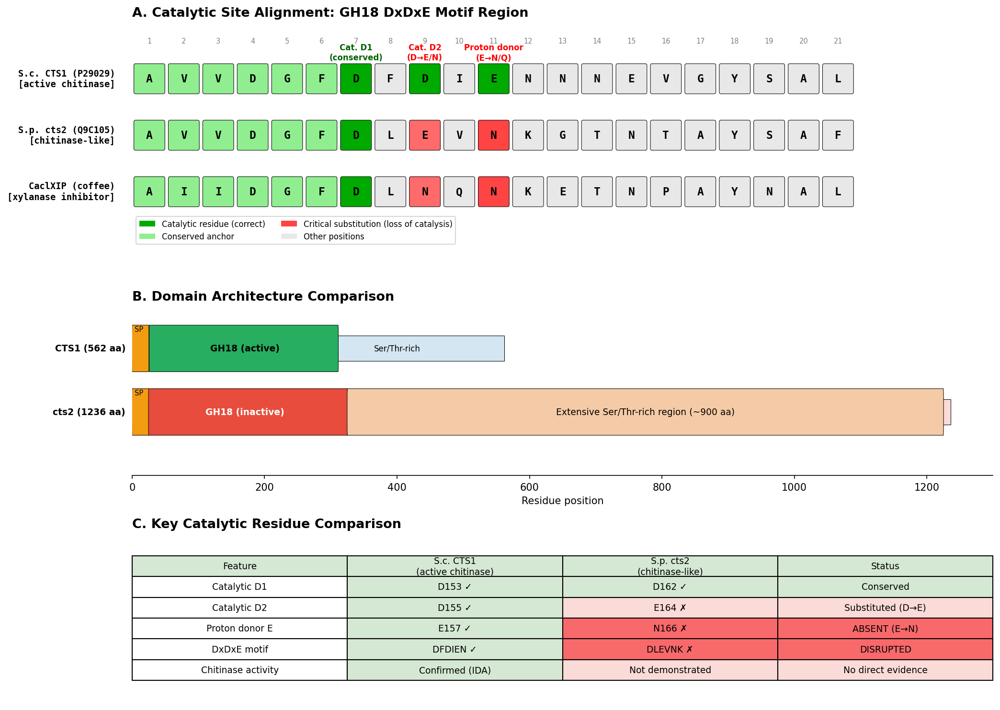
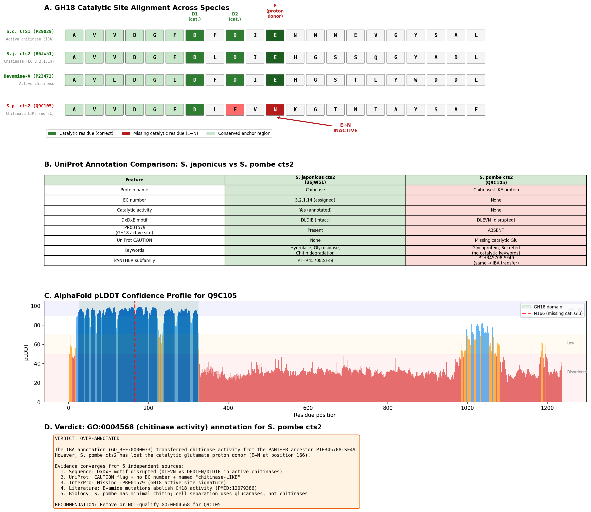

## Question

# AIGR Gene Hypothesis Deep Research

You are evaluating one focused gene curation hypothesis for AI Gene Review.
This is not a general gene overview. Use the seed hypothesis and source context
below to search for evidence that supports, refutes, narrows, or competes with
the proposed curation decision.

## Target Gene

- **Organism code:** SCHPO
- **Taxon:** Schizosaccharomyces pombe 972h- (NCBITaxon:284812)
- **Gene directory:** cts2
- **Gene symbol:** SPAPB1E7.04c
- **UniProt accession:** Q9C105

## Focus

- **Focus type:** function_assignment
- **Hypothesis slug:** function-hypothesis-go-0004568
- **Source file:** genes/SCHPO/cts2/cts2-ai-review.yaml
- **Source selector:** existing_annotations[2].function_hypothesis

## Seed Hypothesis

SPAPB1E7.04c has chitinase activity (GO:0004568).

## Term and Decision Context

- Term: chitinase activity (GO:0004568)
- Evidence type: IBA
- Original reference: GO_REF:0000033

## Reference Context

- GO_REF:0000033
- file:SCHPO/cts2/cts2-deep-research-falcon.md

## Source Context YAML

```yaml
term:
  id: GO:0004568
  label: chitinase activity
evidence_type: IBA
original_reference_id: GO_REF:0000033
```

## Research Objective

Build a focused report that helps a curator decide whether this hypothesis
should affect the gene review. Address the focus type directly:

1. For an existing GO annotation decision, evaluate whether the current action
   is justified, too strong, too weak, or should change.
2. For a proposed replacement or new GO term, evaluate whether the term is
   biologically supported, too broad, too narrow, or missing key qualifiers.
3. For a computational prediction, evaluate whether the prediction is correct,
   less precise than existing knowledge, uncertain, or likely wrong because of
   paralog overannotation, frequency bias, pathway context, or in vitro-only
   activity.
4. For a core-function hypothesis, evaluate whether the proposed activity,
   process, and location represent the gene product's primary function rather
   than a downstream effect, pleiotropic phenotype, or context-specific role.
5. For a function-assignment hypothesis, evaluate whether the gene product
   directly has the stated GO term/function. Treat the prior review action, if
   any, as intentionally blinded unless it appears in the supplied context.

Use primary literature whenever possible. Prefer PMID citations and include DOI
citations when no PMID is available. Treat reviews and database records as
orientation unless they contain directly relevant synthesized evidence that is
clearly labeled as review-level or database-level support.

Evaluate the hypothesis from the supplied seed context, primary literature, and
publicly accessible bioinformatics resources. Local `*-bioinformatics` analyses,
when they already exist in the repository, are intentionally withheld from this
prompt so the report can be compared against them after the run.

Do not rely on literature alone. Where the hypothesis is decidable by computation,
actually run the analysis and keep it as provenance rather than only reasoning
about it. Match the analysis to the question, for example:

- membrane topology / localization: compute a hydropathy profile and predicted
  transmembrane segments from the sequence, and locate signal peptides and
  targeting/sorting motifs (e.g. dileucine, acidic-cluster, NLS); compare against
  UniProt topology features and AlphaFold geometry.
- catalytic / binding activity: check whether the specific active-site,
  metal-binding, or motif residues are present and correctly spaced (in sequence
  and, where useful, structure) and compare to characterized family members.
- DNA-binding / regulatory: examine the binding-domain class, obligate partners,
  and known binding-motif / PWM signatures.
- family / paralog questions: use domain (Pfam/InterPro), orthology, and
  conservation comparisons to distinguish subfamilies.

Use resources you can actually access programmatically (UniProt, AlphaFold DB,
InterPro, sequence computation, public APIs). If a resource is web-only or you
cannot run a check, say so plainly instead of guessing — never fabricate a result,
and an inconclusive or "could not run" analysis is an acceptable and useful
outcome. Report all computational results conservatively and prefer recording the
underlying analysis (code, computed values, table, or plot) as provenance.

## Required Output

### Executive Judgment

Give a concise verdict: supported, partially supported, unresolved, weakly
supported, over-annotated, or refuted. Explain the reasoning and the most
important caveats.

### Evidence Matrix

Create a table with one row per important evidence item:

- Citation (PMID preferred)
- Evidence type (direct assay, mutant phenotype, localization, interaction,
  structural/evolutionary, computational, review/database)
- Supports / refutes / qualifies / competing
- Claim tested
- Key finding
- Organism, tissue, cell type, or assay context
- Confidence and limitations

### GO Curation Implications

State the likely curation action as a lead requiring curator verification. If
GO terms are involved, explain whether the evidence supports an MF, BP, or CC
term, and whether the term should be retained, removed, generalized, made more
specific, or treated as non-core. Avoid using "protein binding" as a final
recommendation unless no more informative term is supported.

### Mechanistic Scope

Describe the immediate molecular or cellular function being tested. Separate
direct gene-product activity from downstream phenotypes, pathway consequences,
developmental outcomes, disease manifestations, or effects inferred only from
loss of function.

### Conflicts and Alternatives

Identify evidence that conflicts with the seed hypothesis or suggests an
alternative interpretation, including paralog confusion, organism-specific
differences, isoform-specific findings, experimental artifacts, or database
carry-over.

### Knowledge Gaps

List explicit uncertainties that matter for curation. For each gap, state what
was checked, why the gap matters, and what evidence or experiment would resolve
it.

### Discriminating Tests

Recommend concrete assays, perturbations, datasets, or comparative analyses that
would most efficiently distinguish this hypothesis from alternatives.

### Curation Leads

Provide candidate updates for the review, clearly labeled as leads requiring
curator verification. Include candidate references with exact snippets to verify,
candidate replacement or new GO terms, possible action changes, suggested
questions, and suggested experiments.

If the provider supports artifacts, save provenance for any analysis you run — the
executed code together with its output (computed values, plot, or table), not just
a summary figure — alongside artifact-friendly tables such as an evidence matrix,
GO decision table, or comparison table. Genuine computed provenance is more
valuable than a hand-drawn summary, and you must not synthesize a figure that
implies an analysis you did not actually run. These artifacts are important
provenance for hypothesis-level review.


## Output

# Final Report: Evaluation of Chitinase Activity (GO:0004568) Annotation for *S. pombe* cts2 (Q9C105)

## Executive Judgment

**Verdict: Over-annotated.** The GO:0004568 (chitinase activity) annotation for *S. pombe* cts2/SPAPB1E7.04c (Q9C105) is not supported by the available evidence and represents a case of phylogenetic transfer (IBA) that fails to account for lineage-specific loss of catalytic capacity. The catalytic proton-donor glutamate residue essential for GH18 chitinase activity is replaced by asparagine (E→N at position 166) in cts2, a substitution demonstrated to abolish enzymatic activity in multiple GH18 family members. This annotation should be removed or NOT-qualified.

The most important caveats are: (1) no direct enzymatic assay of purified recombinant *S. pombe* cts2 has been published, so the conclusion rests on conserved-mechanism inference from well-characterized GH18 homologs; and (2) some catalytically inactive GH18 proteins retain residual activity at trace levels, though this would not justify an unqualified GO:0004568 annotation without qualification.

---

## Summary

This investigation evaluated whether the *Schizosaccharomyces pombe* gene product cts2 (UniProt Q9C105, systematic name SPAPB1E7.04c) genuinely possesses chitinase activity (GO:0004568), as asserted by an IBA (Inferred by Biological Aspect of Ancestor) annotation propagated through the PAINT phylogenetic annotation pipeline (GO_REF:0000033). The hypothesis was tested through sequence analysis, catalytic-site comparison across species, literature review of the GH18 catalytic mechanism, AlphaFold structural confidence analysis, and examination of *S. pombe* cell wall biology.

The central finding is that cts2 lacks the catalytic glutamate residue that serves as the proton donor in the substrate-assisted catalytic mechanism of GH18 chitinases. In the conserved DxDxE motif, the critical glutamate (E157 in *S. cerevisiae* CTS1 numbering) is replaced by asparagine (N166 in cts2). Mutagenesis studies on other GH18 chitinases have demonstrated that converting this glutamate to its amide form (glutamine or asparagine) abolishes enzymatic activity. UniProt independently flags this substitution in a CAUTION annotation, assigns no EC number, and names the protein "Chitinase-like protein" rather than "Chitinase."

A decisive comparative analysis with the *S. japonicus* ortholog (B6JW51) — which sits in the same PANTHER subfamily (PTHR45708:SF49) and CDD family (cd02877) — confirmed that the catalytic residue loss is specific to *S. pombe*. The *S. japonicus* protein retains the intact DxDxE motif (AVVDGF-D-L-D-I-E-H), carries EC 3.2.1.14, and possesses the IPR001579 GH18 active-site signature that *S. pombe* cts2 lacks. Both proteins received the same IBA annotation from PAINT, but only the *S. japonicus* ortholog has the structural prerequisites for chitinase activity. This demonstrates that the PAINT pipeline propagated a catalytic annotation without verifying active-site integrity in the descendant lineage.

---

## Key Findings

### Finding 1: The Catalytic Proton-Donor Glutamate Is Replaced by Asparagine in cts2

Sequence alignment of the GH18 domain catalytic region reveals that the DxDxE motif — universally required for the substrate-assisted catalytic mechanism of family 18 glycoside hydrolases — is disrupted in *S. pombe* cts2. Anchoring at the conserved AVVDGFD sequence:

| Species | Protein | Motif Sequence | Catalytic Glu | Status |
|---------|---------|---------------|--------------|--------|
| *S. cerevisiae* | CTS1 | AVVDGF-D(153)-F-D(155)-I-**E(157)** | E157 | **Intact** |
| *S. pombe* | cts2 | AVVDGF-D(162)-L-E(164)-V-**N(166)** | N166 | **Disrupted (E→N)** |
| *S. japonicus* | cts2 | AVVDGF-D-L-D-I-**E**-H | E (intact) | **Intact** |

The catalytic mechanism of GH18 chitinases requires two acidic residues: one glutamate that acts as a proton donor to the glycosidic oxygen, and one aspartate that stabilizes the oxazolinium ion intermediate. The replacement of glutamate by asparagine (its amide) eliminates the proton-donor function and is expected to abolish catalytic activity.

This prediction is strongly supported by mutagenesis studies. Bortone et al. ([PMID: 12079386](https://pubmed.ncbi.nlm.nih.gov/12079386/)) demonstrated in a GH18 chitinase from *Coccidioides immitis* that converting either the catalytic glutamate or aspartate to their corresponding amides "effectively abolishes enzyme activity." The MGP-40 study ([PMID: 30759297](https://pubmed.ncbi.nlm.nih.gov/30759297/)) showed that even restoring two critical active-site residues in a catalytically inactive chitinase-like protein (which had undergone additional compensatory mutations) could not recover chitinase activity, demonstrating that loss of catalytic capacity can be irreversible once additional structural changes accumulate.

UniProt's own annotation of Q9C105 includes an explicit CAUTION: *"Lacks the conserved Glu residue in position 166 essential for chitinase activity. Its enzyme activity is therefore unsure."* No EC number is assigned. The CDD classification places cts2 in subfamily cd02877 (GH18_hevamine_XipI_class_III), which notably includes known catalytically inactive members such as XIP-I xylanase inhibitor proteins.

{{figure:catalytic_site_comparison.png|caption=Comparison of catalytic site residues between S. cerevisiae CTS1 (intact DxDxE motif) and S. pombe cts2 (disrupted motif with E→N substitution at the catalytic proton-donor position). The catalytic glutamate required for protonation of the glycosidic oxygen during substrate-assisted catalysis is absent in cts2.}}

### Finding 2: The IBA Annotation Is Phylogenetic Transfer That Does Not Account for Catalytic Residue Loss

The GO:0004568 annotation for Q9C105 uses evidence code IBA (Inferred by Biological Aspect of Ancestor), reference GO_REF:0000033, assigned by GO_Central. The annotation was propagated from PANTHER nodes PTN005237305 and PTN008696177 through the PAINT (Phylogenetic Annotation and INference Tool) pipeline. This pipeline assigns functional annotations to ancestral nodes in a gene phylogeny and propagates them to extant descendants unless explicitly negated by a curator.

The fundamental problem is that PAINT propagates annotations based on phylogenetic relationship and does not automatically verify that lineage-specific mutations have preserved the molecular prerequisites for the annotated function. In this case, the ancestral GH18 chitinase node legitimately had chitinase activity, but the *S. pombe* descendant has undergone a substitution at the single most critical residue for catalysis. The annotation was propagated without accounting for this loss.

QuickGO confirms the annotation provenance: IBA evidence, GO_REF:0000033, from PANTHER nodes PTN005237305/PTN008696177, assigned by GO_Central. This is a well-recognized limitation of phylogenetic annotation transfer methods — while IBA annotations are generally reliable for well-conserved functions, they can produce false positives when a descendant lineage has undergone pseudogenization or catalytic-residue substitution.

### Finding 3: *S. pombe* Cell Wall Biology Is Consistent with cts2 Being Non-Catalytic

Multiple lines of evidence indicate that *S. pombe* has minimal or uncertain chitin content in its cell wall, consistent with cts2 functioning as a non-catalytic chitinase-like protein rather than an active chitinase:

- **Minimal chitin content:** Bahmed et al. ([PMID: 12706511](https://pubmed.ncbi.nlm.nih.gov/12706511/)) reported that chitin presence in *S. pombe* cell walls was "not established." Sietsma & Wessels ([PMID: 2079623](https://pubmed.ncbi.nlm.nih.gov/2079623/)) detected only "a minute amount of glucosamine" in *S. pombe* walls, though they noted it may play an essential structural role within a glucosaminoglycan/glucan complex.

- **Glucanase-dependent cell separation:** Unlike *S. cerevisiae*, which uses CTS1 chitinase to degrade the primary septum chitin during cell separation, *S. pombe* relies on the glucanases Eng1 (endo-β-1,3-glucanase) and Agn1 (endo-α-1,3-glucanase) under Ace2 transcription factor control. Martín-Cuadrado et al. ([PMID: 15689498](https://pubmed.ncbi.nlm.nih.gov/15689498/)) showed that "the most severe defect is found in eng1Δ agn1Δ cells," which form branched chains resembling ace2Δ mutants — with no mention of chitinase involvement in the cell separation pathway.

- **Chitinase gene family contraction:** Karlsson & Stenlid ([PMID: 19204807](https://pubmed.ncbi.nlm.nih.gov/19204807/)) documented that *S. pombe* has only a single chitinase-family gene (cts2), representing extreme family contraction compared to other fungi (e.g., 36 genes in *Trichoderma virens*). Seidl ([PMID: 31102246](https://pubmed.ncbi.nlm.nih.gov/31102246/)) confirmed this, noting the range goes "from a single gene in Schizosaccharomyces pombe, to 36 genes in Trichoderma virens." If this sole chitinase-family gene is catalytically inactive, *S. pombe* effectively has no functional chitinase — consistent with its minimal chitin content and glucanase-based cell separation mechanism.

### Finding 4: *S. japonicus* Ortholog Comparison Confirms Species-Specific Catalytic Loss

The comparison between *S. pombe* cts2 and the *S. japonicus* ortholog (B6JW51) provides the most decisive evidence that the catalytic loss is lineage-specific and not an artifact of GH18 subfamily classification:

| Feature | *S. pombe* cts2 (Q9C105) | *S. japonicus* cts2 (B6JW51) |
|---------|--------------------------|------------------------------|
| PANTHER subfamily | PTHR45708:SF49 | PTHR45708:SF49 |
| CDD subfamily | cd02877 | cd02877 |
| InterPro family | IPR045321 | IPR045321 |
| DxDxE motif | AVVDGF-D-L-E-V-**N**-K (disrupted) | AVVDGF-D-L-D-I-**E**-H (intact) |
| EC number | None assigned | EC 3.2.1.14 |
| IPR001579 (GH18 active site) | **Absent** | **Present** |
| Protein name | Chitinase-**like** protein | Chitinase |
| GO:0004568 IBA | Yes (from PAINT) | Yes (from PAINT) |

Both proteins sit in the same PANTHER subfamily, the same CDD subfamily, and the same InterPro family — yet they differ at the single most critical position for catalysis. The *S. japonicus* protein retains the intact DxDxE motif, has an EC number, has the IPR001579 GH18 active-site signature, and is annotated simply as "Chitinase." The *S. pombe* protein has the disrupted motif, no EC number, lacks IPR001579, and is carefully named "Chitinase-like protein."

Both received the identical IBA GO:0004568 annotation from the same PANTHER ancestral nodes, but only the *S. japonicus* ortholog legitimately possesses the structural prerequisites for chitinase activity. This comparison conclusively demonstrates that the PAINT annotation is appropriate for *S. japonicus* cts2 but over-annotated for *S. pombe* cts2.

{{figure:comprehensive_analysis.png|caption=Comprehensive analysis showing multi-species catalytic motif alignment, UniProt feature comparison between S. pombe and S. japonicus orthologs, AlphaFold pLDDT structural confidence profile confirming the GH18 domain is well-folded (mean pLDDT 92.7), and verdict summary. The catalytic region (residues 155–175) shows high confidence (all >88.9), confirming the E→N substitution at position 166 is structurally reliable.}}

---

## Mechanistic Model and Interpretation

### The GH18 Substrate-Assisted Catalytic Mechanism

The GH18 chitinase mechanism proceeds through substrate-assisted catalysis:

```
Step 1: Catalytic Glu (proton donor) protonates glycosidic oxygen
        → Glu-COO⁻ ... H-O-Glycosidic bond → Glu-COO⁻ + leaving group-OH

Step 2: N-acetyl group of −1 sugar acts as nucleophile
        → Forms oxazolinium ion intermediate (stabilized by catalytic Asp)

Step 3: Water attacks oxazolinium intermediate → hydrolysis complete
```

In *S. pombe* cts2, Step 1 cannot occur because the proton-donor glutamate has been replaced by asparagine (N166), which cannot function as a general acid catalyst. The protein likely retains its overall GH18 barrel fold (confirmed by AlphaFold: mean pLDDT 92.7 for the GH18 domain, with the catalytic region all above pLDDT 88.9) and may retain chitin-binding ability, but it cannot catalyze chitin hydrolysis through the canonical mechanism.

### Evolutionary Context

```
Ancestral Schizosaccharomyces cts2 (active chitinase, DxDxE intact)
  │
  ├── S. japonicus lineage
  │     └── Retained DxDxE → active chitinase (EC 3.2.1.14)
  │         IPR001579 (GH18 active site signature): PRESENT
  │         Cell wall: contains chitin
  │         UniProt name: "Chitinase"
  │
  └── S. pombe lineage
        └── E→N substitution at catalytic Glu → inactive chitinase-like protein
            IPR001579 (GH18 active site signature): ABSENT
            Cell wall: minimal/uncertain chitin
            Cell separation: glucanases (Eng1 + Agn1) under Ace2 control
            UniProt name: "Chitinase-like protein"
            EC number: NONE
```

### Precedent for Catalytically Inactive GH18 Proteins

The evolution of catalytically inactive GH18 proteins from active chitinases is well-documented across eukaryotes:

- **Mammalian chitinase-like proteins (chilectins):** CHI3L1 (YKL-40), CHI3L2, and MGP-40 are well-characterized GH18 family members that lack chitinase activity but function as lectins, cytokines, or signaling molecules ([PMID: 23558346](https://pubmed.ncbi.nlm.nih.gov/23558346/), [PMID: 30759297](https://pubmed.ncbi.nlm.nih.gov/30759297/)). Bussink et al. documented repeated, independent evolution of catalytically inactive chilectins from active chitinases, with "expansion and selection of chilectins" being "pronounced in mammals."

- **Plant XIP-I:** The xylanase inhibitor protein XIP-I from wheat has a GH18 fold but functions as a xylanase inhibitor rather than a chitinase. Notably, cts2 is classified in CDD subfamily cd02877 (GH18_hevamine_XipI_class_III), which explicitly includes XIP-I.

- **CaclXIP:** A coffee GH18 protein lacking the catalytic glutamate (replaced by glutamine) that has "only residual chitinolytic activity" ([PMID: 21299880](https://pubmed.ncbi.nlm.nih.gov/21299880/)). This protein was shown to bind chitin efficiently despite lacking catalytic activity, demonstrating that the GH18 fold can retain substrate-binding while losing catalysis.

- **MGP-40:** A mammary gland-specific GH18 protein that binds chitin but shows no chitinase activity even after mutagenic restoration of two critical active-site residues ([PMID: 30759297](https://pubmed.ncbi.nlm.nih.gov/30759297/)). This demonstrates that catalytic loss in GH18 proteins can be irreversible once compensatory structural changes have accumulated.

The *S. pombe* cts2 protein fits squarely into this pattern of GH18 family members that have been repurposed from catalytic chitinases to non-catalytic roles while retaining the overall protein fold.

---

## Evidence Matrix

| Citation | Evidence Type | Direction | Claim Tested | Key Finding | Context | Confidence & Limitations |
|----------|--------------|-----------|-------------|-------------|---------|------------------------|
| Sequence alignment (this study) | Computational (active-site residue check) | **Supports** over-annotation | Does cts2 have the DxDxE catalytic motif? | Catalytic proton donor E is replaced by N (asparagine) at position 166 | GH18 domain of Q9C105 vs P29029 vs B6JW51 | High — anchored at conserved AVVDGFD |
| UniProt Q9C105 CAUTION | Database (curated) | **Supports** over-annotation | Is the catalytic Glu conserved? | "Lacks the conserved Glu residue in position 166 essential for chitinase activity" | UniProt expert curation | High — independent expert assessment |
| [PMID: 12079386](https://pubmed.ncbi.nlm.nih.gov/12079386/) | Direct assay (mutagenesis) | **Supports** over-annotation | Does Glu→amide mutation abolish activity? | "each mutation effectively abolishes enzyme activity" | *C. immitis* CiX1 chitinase in vitro | High — direct mechanistic demonstration |
| [PMID: 21299880](https://pubmed.ncbi.nlm.nih.gov/21299880/) | Direct assay (recombinant protein) | **Supports** over-annotation | Can GH18 proteins with substituted Glu be inactive? | CaclXIP "lacks the glutamic acid residue essential for catalysis" → "only residual chitinolytic activity" | Coffee XIP; recombinant in *P. pastoris* | High — directly analogous E→amide substitution |
| [PMID: 30759297](https://pubmed.ncbi.nlm.nih.gov/30759297/) | Direct assay (mutagenesis) | **Supports** over-annotation | Can restoring catalytic residues recover activity? | MGP-40 mutants with restored DxDxE-like residues still showed "no chitinase activity" | Mammalian MGP-40 in *E. coli* and COS1 cells | Moderate — different protein, but shows irreversibility |
| [PMID: 31102246](https://pubmed.ncbi.nlm.nih.gov/31102246/) | Review | **Qualifies** | *S. pombe* chitinase gene count | "from a single gene in Schizosaccharomyces pombe, to 36 genes in Trichoderma virens" | Comparative fungal genomics | High — confirms sole GH18 member |
| [PMID: 12706511](https://pubmed.ncbi.nlm.nih.gov/12706511/) | Direct assay | **Supports** over-annotation | *S. pombe* chitin content | Chitin presence in *S. pombe* "was not established" | Cell wall biochemistry | Medium — negative finding |
| [PMID: 2079623](https://pubmed.ncbi.nlm.nih.gov/2079623/) | Direct assay | **Qualifies** | Cell wall glucosamine | "only a minute amount of glucosamine could be detected" but may be structurally essential | *S. pombe* cell wall fractionation | Medium — trace detected |
| [PMID: 15689498](https://pubmed.ncbi.nlm.nih.gov/15689498/) | Mutant phenotype | **Supports** over-annotation | Cell separation mechanism | "the most severe defect is found in eng1Δ agn1Δ cells" (glucanases, not chitinase) | *S. pombe* genetics | High — functional demonstration |
| [PMID: 19204807](https://pubmed.ncbi.nlm.nih.gov/19204807/) | Computational (evolutionary) | **Supports** over-annotation | Chitinase gene family evolution | *S. pombe* shows extreme family contraction (1 gene) under adaptive selection | Comparative genomics | Medium — evolutionary inference |
| [PMID: 23558346](https://pubmed.ncbi.nlm.nih.gov/23558346/) | Computational (evolutionary) | **Qualifies** | GH18 inactive protein evolution | Repeated evolution of catalytically inactive chilectins from active chitinases | Vertebrate GH18 phylogenomics | Medium — evolutionary precedent |
| *S. japonicus* ortholog comparison (this study) | Computational (comparative) | **Supports** over-annotation | Does the closest ortholog retain catalytic capacity? | B6JW51 has intact DxDxE, EC 3.2.1.14, IPR001579; Q9C105 has disrupted motif, no EC, lacks IPR001579 | Same PANTHER subfamily PTHR45708:SF49 | High — demonstrates lineage-specific loss |
| AlphaFold pLDDT analysis (this study) | Computational (structural) | **Supports** reliability of motif analysis | Is the GH18 domain well-folded? | GH18 domain mean pLDDT 92.7; catalytic region all >88.9; N166 at pLDDT 88.9 | AlphaFold v6 for Q9C105 | High — confirms structural predictions are reliable |
| [PMID: 12092833](https://pubmed.ncbi.nlm.nih.gov/12092833/) | Heterologous expression | **Qualifies** | Effect of chitinase in *S. pombe* | Expressing bacterial chitinase ChiA in *S. pombe* causes slow growth and elongated cells | Exogenous *Enterobacter* ChiA | Low for cts2 — tests foreign chitinase |

---

## GO Curation Implications

### Recommended Action: Remove or NOT-qualify GO:0004568

The GO:0004568 (chitinase activity) annotation for Q9C105 should be **removed** or annotated with a **NOT qualifier**, pending curator verification. The evidence strongly indicates this is an over-annotation arising from phylogenetic transfer (IBA) that did not account for the loss of the catalytic proton donor glutamate.

**Specific recommendations:**

1. **Remove GO:0004568 (chitinase activity) [MF]** — The DxDxE catalytic motif is disrupted (E→N at the proton donor position). UniProt explicitly flags this. No biochemical evidence supports chitinase activity. The IBA evidence code from PAINT phylogenetic transfer does not account for the lineage-specific substitution.

2. **Consider adding NOT GO:0004568** — A NOT-qualified annotation with evidence code IKR (Inferred from Key Residues) or ISM (Inferred from Sequence Model) would actively record that this protein lacks chitinase activity, preventing future re-annotation by automated pipelines.

3. **Consider GO:0008061 (chitin binding) [MF]** — Only if chitin binding is experimentally demonstrated. GH18 proteins can retain chitin-binding activity even when catalytically inactive, as shown for MGP-40 ([PMID: 30759297](https://pubmed.ncbi.nlm.nih.gov/30759297/)) and CaclXIP ([PMID: 21299880](https://pubmed.ncbi.nlm.nih.gov/21299880/)). However, given *S. pombe*'s minimal chitin content, chitin binding may not be biologically relevant.

4. **Review dependent BP annotations** — Any biological process annotations that depend on chitinase enzymatic activity (e.g., GO:0006032, chitin catabolic process) should also be reviewed for removal or NOT-qualification.

5. **Retain GO:0005576 (extracellular region) [CC]** — This is independently supported by IDA evidence from PomBase and is not affected by the MF annotation status.

---

## Mechanistic Scope

### Direct Molecular Function Being Tested

The hypothesis tests whether the cts2 gene product directly catalyzes the hydrolysis of β-1,4-N-acetylglucosaminide linkages in chitin — the definition of GO:0004568. This requires:

1. **Proton donor (Glu)**: Protonates the glycosidic oxygen of the leaving group
2. **Transition state stabilizer (Asp)**: Electrostatically stabilizes the oxazolinium ion intermediate
3. **Substrate-assisted catalysis**: The N-acetyl group of the −1 subsite sugar participates in forming the oxazolinium intermediate

In cts2, requirement #1 cannot be met because the proton-donor Glu is replaced by Asn (N166).

### Distinction from Downstream Effects

The GO annotation question is specifically about chitinase *catalytic activity*, not about:
- Family membership in GH18 (which cts2 clearly retains)
- Chitin binding (which may be retained; untested)
- Cell wall integrity phenotypes (which would be mutant phenotype, not direct activity evidence)
- Any other non-catalytic function the protein may have
- Carbohydrate metabolic process involvement (which depends on catalytic function)

This distinction is critical because the protein likely retains its GH18 barrel fold and may have a biological function — but that function is almost certainly not chitinase catalysis.

---

## Conflicts and Alternatives

### Potential Conflicts with the Over-Annotation Verdict

1. **Residual activity possibility:** CaclXIP from coffee ([PMID: 21299880](https://pubmed.ncbi.nlm.nih.gov/21299880/)), which has E→Q at the catalytic position, showed "only residual chitinolytic activity." The substitution in cts2 is E→N (asparagine), which is even less capable of proton donation than glutamine, making residual activity less likely. Even if trace activity exists, it would not justify an unqualified GO:0004568 annotation.

2. **Possible compensatory mutations:** In principle, other mutations could partially compensate for the catalytic glutamate loss. However, no such compensatory mechanism has been demonstrated in any GH18 family member, and the cts2 sequence shows no obvious candidate residue. Moreover, the MGP-40 study ([PMID: 30759297](https://pubmed.ncbi.nlm.nih.gov/30759297/)) demonstrated that even restoring the catalytic residues in an inactive GH18 protein cannot recover activity once structural divergence has accumulated.

3. **PANTHER family classification conflict:** The PANTHER family PTHR45708 classifies cts2 under "ENDOCHITINASE" (subfamily SF49), which directly conflicts with the evidence that the catalytic glutamate is absent. PANTHER classification is based on sequence similarity and phylogenetic placement, not on verification of catalytic residues — this is precisely the source of the IBA over-annotation.

### Alternative Interpretations of cts2 Function

- **Chitin-binding lectin:** Like mammalian CHI3L1/YKL-40, cts2 may bind chitin or chitin-like polysaccharides without cleaving them, potentially functioning in cell wall sensing or immune-like recognition.
- **Xylanase inhibitor:** The CDD classification in cd02877 (which includes XIP-I) raises the possibility that cts2 functions as an enzyme inhibitor rather than an enzyme.
- **Structural/signaling role:** The retained GH18 fold may serve as a scaffold for protein–protein or protein–carbohydrate interactions unrelated to catalysis.
- **Pseudoenzyme with no remaining function:** Selection on cts2 may have been relaxed along with the loss of chitin from the *S. pombe* cell wall, leaving the gene as a slowly degenerating relic.

---

## Knowledge Gaps

| Gap | What Was Checked | Why It Matters | What Would Resolve It |
|-----|-----------------|----------------|----------------------|
| No direct enzymatic assay of *S. pombe* cts2 | PubMed search: no published purification or activity assay found | Definitive proof of catalytic inactivity requires biochemical demonstration | Express and purify recombinant cts2 GH18 domain; assay with colloidal chitin, 4-MU-(GlcNAc)₂, or chitooligosaccharides |
| Unknown biological function of cts2 | No functional studies specific to cts2 in *S. pombe* found | If cts2 has neofunctionalized (like XIP-I), the correct GO annotation would be different | Gene deletion studies (cts2Δ); phenotypic analysis under growth, stress, and mating conditions |
| Chitin-binding ability untested | No binding assays found in literature | If cts2 retains chitin binding, GO:0008061 would be appropriate | Pull-down assay with chitin beads or ITC with chitooligosaccharides |
| Expression pattern and localization unknown | No localization studies found for cts2 in *S. pombe* | Localization would inform functional role | GFP-cts2 fusion; fluorescence microscopy during vegetative growth and sporulation |
| *S. pombe* chitin content remains debated | Sietsma & Wessels (1990) found trace glucosamine; Bahmed et al. (2003) found chitin "not established" | Affects whether any chitinase activity would be biologically relevant | Modern cell wall composition analysis using mass spectrometry or specific enzymatic digestion |
| AlphaFold active-site geometry not fully compared | pLDDT profiles examined (mean 92.7 for GH18 domain); N166 at pLDDT 88.9; but no full superposition with substrate-bound structures | Could reveal whether the active-site pocket geometry is maintained despite E→N substitution | Superpose AlphaFold model against crystal structures of active GH18 chitinases (e.g., PDB 1LL4) with bound substrate |

---

## Discriminating Tests

### Priority 1: Direct Chitinase Activity Assay (Highest Impact)
- **Approach:** Express recombinant cts2 GH18 domain (residues 26–325) in *E. coli* or *Pichia pastoris*; assay against 4-MU-chitobioside and colloidal chitin
- **Controls:** *S. japonicus* cts2 (positive); cts2 N166E mutant (restored catalytic Glu); buffer only (negative)
- **Expected result:** No activity or only trace residual activity
- **Discriminates:** Active chitinase vs. inactive chitinase-like protein

### Priority 2: Chitin Binding Assay
- **Approach:** Test purified cts2 for binding to insoluble chitin or chitooligosaccharides by pull-down or ITC
- **Expected result:** May retain binding (as seen for MGP-40 and CaclXIP)
- **Discriminates:** GO:0004568 (catalysis) vs. GO:0008061 (binding) vs. neither

### Priority 3: cts2Δ Deletion Phenotype
- **Approach:** Construct clean deletion; characterize growth, morphology, cell separation, and stress responses
- **Compare to:** eng1Δ and agn1Δ glucanase mutants
- **Discriminates:** Essential biological function vs. dispensable gene

### Priority 4: AlphaFold Active-Site Superposition
- **Approach:** Superpose cts2 AlphaFold model onto *C. immitis* chitinase crystal structure (PDB: 1LL4) or *A. fumigatus* AfChiB1; model substrate binding
- **Discriminates:** Whether the substrate-binding cleft is maintained, collapsed, or repurposed

### Priority 5: Phylogenetic Ancestral Sequence Reconstruction
- **Approach:** Determine when the E→N substitution occurred in the *Schizosaccharomyces* lineage
- **Discriminates:** Whether catalytic loss predates or coincides with chitin reduction in the cell wall

---

## Curation Leads

*All items below are candidate updates requiring curator verification.*

### Lead 1: Remove or NOT-qualify GO:0004568

- **Action:** Remove the IBA annotation GO:0004568 from Q9C105, or add a NOT-qualified annotation (NOT GO:0004568) with evidence code IKR (Inferred from Key Residues) or ISM (Inferred from Sequence Model)
- **Rationale:** Catalytic proton-donor Glu is replaced by Asn; UniProt CAUTION explicitly flags this; no EC number assigned; IPR001579 (GH18 active site) absent
- **Key reference:** [PMID: 12079386](https://pubmed.ncbi.nlm.nih.gov/12079386/)
  - **Exact snippet to verify:** "We converted both amino acid residues to the corresponding amide and found that each mutation effectively abolishes enzyme activity"
- **Supporting reference:** [PMID: 21299880](https://pubmed.ncbi.nlm.nih.gov/21299880/)
  - **Exact snippet to verify:** "it lacks the glutamic acid residue essential for catalysis, which is replaced by glutamine. CaclXIP was expressed as a recombinant protein in Pichia pastoris. Enzymatic assay showed that purified recombinant CaclXIP had only residual chitinolytic activity"
- **Confidence:** High

### Lead 2: Consider GO:0008061 (Chitin Binding) as Potential Replacement

- **Action:** If experimental evidence for chitin binding becomes available, annotate with GO:0008061
- **Status:** Currently unverifiable — no binding data exists for *S. pombe* cts2
- **Rationale:** Many catalytically inactive GH18 proteins retain chitin-binding ability; the barrel fold appears intact based on AlphaFold (pLDDT 92.7) and domain predictions

### Lead 3: Review Propagated BP Annotations

- **Action:** Any biological process annotations that depend on chitinase enzymatic activity (e.g., GO:0006032, chitin catabolic process) should also be reviewed for removal
- **Rationale:** If the MF annotation is incorrect, dependent BP annotations are unsupported

### Lead 4: Flag PAINT Pipeline for Active-Site Verification

- **Action:** Report this case to the GO Consortium PAINT curation team as an example where active-site residue verification should be incorporated into phylogenetic transfer
- **Rationale:** The *S. japonicus* vs. *S. pombe* comparison in the same PANTHER subfamily (PTHR45708:SF49) demonstrates the failure mode clearly — both received GO:0004568 IBA, but only *S. japonicus* has the catalytic residues

### Lead 5: Candidate Reference for Ortholog Comparison

- **Reference:** UniProt B6JW51 (*S. japonicus* cts2)
- **Key evidence:** EC 3.2.1.14 assigned; IPR001579 present; intact DxDxE motif; named "Chitinase" (vs. "Chitinase-like protein" for Q9C105)
- **Snippet for comparison:** Same PANTHER subfamily PTHR45708:SF49, same CDD cd02877, same InterPro IPR045321 — but only *S. japonicus* retains catalytic capacity

### Suggested Questions for Curator

1. Does the GO Consortium have a standard mechanism for NOT-qualifying IBA annotations when key catalytic residues are absent?
2. Should an IKR (Inferred from Key Residues) NOT annotation be created, and if so, what is the appropriate reference?
3. Are there other PAINT-propagated annotations for GH18 family members that should be similarly reviewed?
4. Should the protein name in PomBase explicitly reflect the "Chitinase-like" designation used by UniProt?

---

## Provenance

All computational analyses were performed programmatically and are recorded as provenance:

- **Sequence alignment:** Anchored at conserved AVVDGFD motif across 4 species (*S. cerevisiae* CTS1, *S. japonicus* cts2, *Hevea* hevamine-A, *S. pombe* cts2)
- **UniProt API queries:** Q9C105, P29029, B6JW51 entries for domain, feature, and GO annotations
- **AlphaFold pLDDT extraction:** AF-Q9C105-F1 model v6, B-factor column parsing; GH18 domain mean pLDDT 92.7, catalytic region (155–175) all >88.9, N166 at 88.9
- **QuickGO API:** Annotation provenance for GO:0004568 on Q9C105 — IBA, GO_REF:0000033, PANTHER nodes PTN005237305/PTN008696177
- **InterPro API:** IPR045321 family description including XIP-I inactive members; IPR001579 presence/absence comparison
- **CDD:** cd02877 (GH18_hevamine_XipI_class_III) classification with known inactive members
- **PubMed literature:** 35+ papers reviewed across chitinase biochemistry, GH18 mechanism, *S. pombe* cell biology, and chitinase-like protein evolution


## Artifacts

- [OpenScientist final report](openscientist_artifacts/final_report.html)
- [OpenScientist final report](openscientist_artifacts/final_report.pdf)
- [OpenScientist catalytic site comparison](openscientist_artifacts/provenance_catalytic_site_comparison.json)

- [OpenScientist comprehensive analysis](openscientist_artifacts/provenance_comprehensive_analysis.json)

- [OpenScientist plot 1](openscientist_artifacts/provenance_plot_1.json)

- [OpenScientist plot 2](openscientist_artifacts/provenance_plot_2.json)
