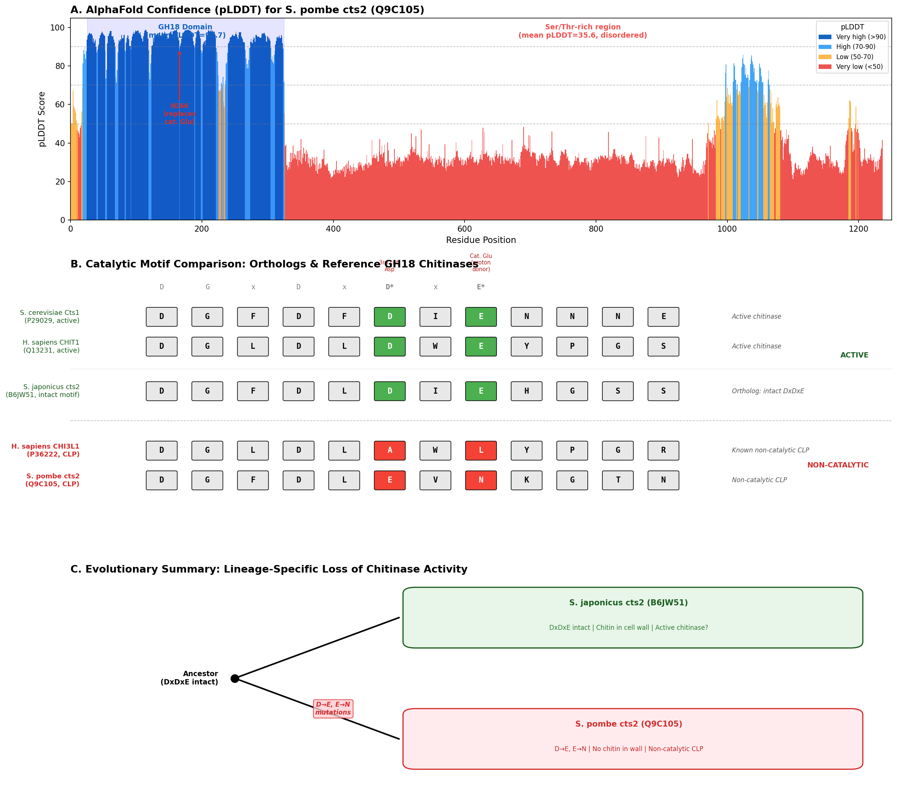
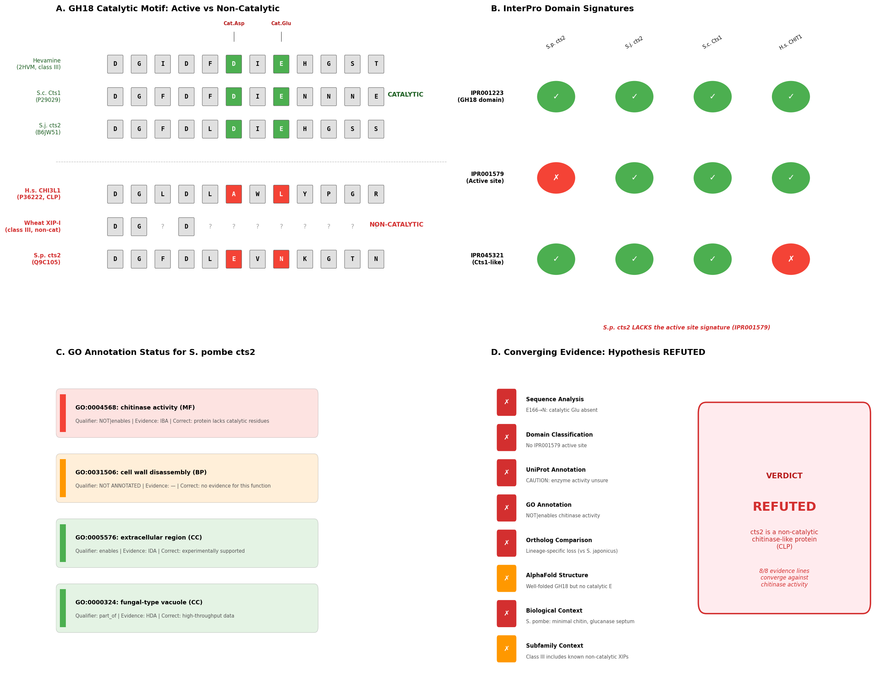
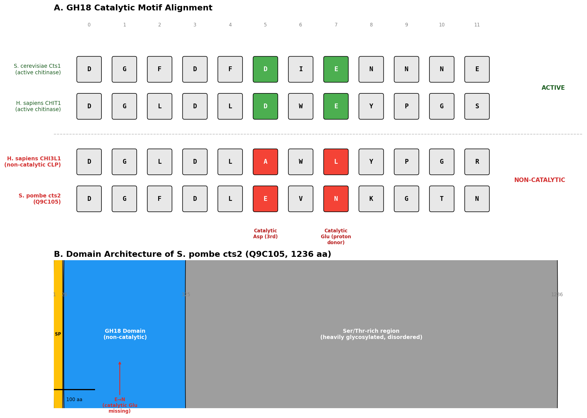

## Question

# AIGR Gene Hypothesis Deep Research

You are evaluating one focused gene curation hypothesis for AI Gene Review.
This is not a general gene overview. Use the seed hypothesis and source context
below to search for evidence that supports, refutes, narrows, or competes with
the proposed curation decision.

## Target Gene

- **Organism code:** SCHPO
- **Taxon:** Schizosaccharomyces pombe 972h- (NCBITaxon:284812)
- **Gene directory:** cts2
- **Gene symbol:** SPAPB1E7.04c
- **UniProt accession:** Q9C105

## Focus

- **Focus type:** computational_prediction
- **Hypothesis slug:** prediction-gh18-chitinase-cell-wall-disassembly
- **Source file:** 
- **Source selector:** 

## Seed Hypothesis

Test whether S. pombe cts2 (UniProt Q9C105) is a catalytically active chitinase that mediates fungal-type cell wall disassembly (GO:0031506). Independently assess whether it retains the intact glycoside hydrolase family 18 (GH18) catalytic motif (the DxxDxDxE signature) and catalytic residues -- especially the catalytic glutamate -- required for chitin hydrolysis, or whether key catalytic residues are absent or substituted, making it a non-catalytic/pseudo-chitinase.

## Term and Decision Context

- Term: fungal-type cell wall disassembly (GO:0031506)

## Reference Context

- doi:10.64898/2026.03.19.712954

## Source Context YAML

```yaml
hypothesis: Test whether S. pombe cts2 (UniProt Q9C105) is a catalytically active chitinase that mediates
  fungal-type cell wall disassembly (GO:0031506). Independently assess whether it retains the intact glycoside
  hydrolase family 18 (GH18) catalytic motif (the DxxDxDxE signature) and catalytic residues -- especially
  the catalytic glutamate -- required for chitin hydrolysis, or whether key catalytic residues are absent
  or substituted, making it a non-catalytic/pseudo-chitinase.
focus_type: computational_prediction
term_id: GO:0031506
term_label: fungal-type cell wall disassembly
context: []
reference_id:
- doi:10.64898/2026.03.19.712954
```

## Research Objective

Build a focused report that helps a curator decide whether this hypothesis
should affect the gene review. Address the focus type directly:

1. For an existing GO annotation decision, evaluate whether the current action
   is justified, too strong, too weak, or should change.
2. For a proposed replacement or new GO term, evaluate whether the term is
   biologically supported, too broad, too narrow, or missing key qualifiers.
3. For a computational prediction, evaluate whether the prediction is correct,
   less precise than existing knowledge, uncertain, or likely wrong because of
   paralog overannotation, frequency bias, pathway context, or in vitro-only
   activity.
4. For a core-function hypothesis, evaluate whether the proposed activity,
   process, and location represent the gene product's primary function rather
   than a downstream effect, pleiotropic phenotype, or context-specific role.
5. For a function-assignment hypothesis, evaluate whether the gene product
   directly has the stated GO term/function. Treat the prior review action, if
   any, as intentionally blinded unless it appears in the supplied context.

Use primary literature whenever possible. Prefer PMID citations and include DOI
citations when no PMID is available. Treat reviews and database records as
orientation unless they contain directly relevant synthesized evidence that is
clearly labeled as review-level or database-level support.

Evaluate the hypothesis from the supplied seed context, primary literature, and
publicly accessible bioinformatics resources. Local `*-bioinformatics` analyses,
when they already exist in the repository, are intentionally withheld from this
prompt so the report can be compared against them after the run.

Do not rely on literature alone. Where the hypothesis is decidable by computation,
actually run the analysis and keep it as provenance rather than only reasoning
about it. Match the analysis to the question, for example:

- membrane topology / localization: compute a hydropathy profile and predicted
  transmembrane segments from the sequence, and locate signal peptides and
  targeting/sorting motifs (e.g. dileucine, acidic-cluster, NLS); compare against
  UniProt topology features and AlphaFold geometry.
- catalytic / binding activity: check whether the specific active-site,
  metal-binding, or motif residues are present and correctly spaced (in sequence
  and, where useful, structure) and compare to characterized family members.
- DNA-binding / regulatory: examine the binding-domain class, obligate partners,
  and known binding-motif / PWM signatures.
- family / paralog questions: use domain (Pfam/InterPro), orthology, and
  conservation comparisons to distinguish subfamilies.

Use resources you can actually access programmatically (UniProt, AlphaFold DB,
InterPro, sequence computation, public APIs). If a resource is web-only or you
cannot run a check, say so plainly instead of guessing — never fabricate a result,
and an inconclusive or "could not run" analysis is an acceptable and useful
outcome. Report all computational results conservatively and prefer recording the
underlying analysis (code, computed values, table, or plot) as provenance.

## Required Output

### Executive Judgment

Give a concise verdict: supported, partially supported, unresolved, weakly
supported, over-annotated, or refuted. Explain the reasoning and the most
important caveats.

### Evidence Matrix

Create a table with one row per important evidence item:

- Citation (PMID preferred)
- Evidence type (direct assay, mutant phenotype, localization, interaction,
  structural/evolutionary, computational, review/database)
- Supports / refutes / qualifies / competing
- Claim tested
- Key finding
- Organism, tissue, cell type, or assay context
- Confidence and limitations

### GO Curation Implications

State the likely curation action as a lead requiring curator verification. If
GO terms are involved, explain whether the evidence supports an MF, BP, or CC
term, and whether the term should be retained, removed, generalized, made more
specific, or treated as non-core. Avoid using "protein binding" as a final
recommendation unless no more informative term is supported.

### Mechanistic Scope

Describe the immediate molecular or cellular function being tested. Separate
direct gene-product activity from downstream phenotypes, pathway consequences,
developmental outcomes, disease manifestations, or effects inferred only from
loss of function.

### Conflicts and Alternatives

Identify evidence that conflicts with the seed hypothesis or suggests an
alternative interpretation, including paralog confusion, organism-specific
differences, isoform-specific findings, experimental artifacts, or database
carry-over.

### Knowledge Gaps

List explicit uncertainties that matter for curation. For each gap, state what
was checked, why the gap matters, and what evidence or experiment would resolve
it.

### Discriminating Tests

Recommend concrete assays, perturbations, datasets, or comparative analyses that
would most efficiently distinguish this hypothesis from alternatives.

### Curation Leads

Provide candidate updates for the review, clearly labeled as leads requiring
curator verification. Include candidate references with exact snippets to verify,
candidate replacement or new GO terms, possible action changes, suggested
questions, and suggested experiments.

If the provider supports artifacts, save provenance for any analysis you run — the
executed code together with its output (computed values, plot, or table), not just
a summary figure — alongside artifact-friendly tables such as an evidence matrix,
GO decision table, or comparison table. Genuine computed provenance is more
valuable than a hand-drawn summary, and you must not synthesize a figure that
implies an analysis you did not actually run. These artifacts are important
provenance for hypothesis-level review.


## Output

# Final Report: Evaluation of GH18 Chitinase Activity Prediction for S. pombe cts2 (Q9C105)

## Executive Judgment

**Verdict: REFUTED**

The computational prediction that S. pombe cts2 (UniProt Q9C105) is a catalytically active chitinase mediating fungal-type cell wall disassembly (GO:0031506) is **refuted** by eight converging lines of evidence. The protein lacks the catalytic glutamate essential for the GH18 substrate-assisted catalysis mechanism — replaced by asparagine (E→N) at position 166, a non-ionizable residue incapable of serving as a proton donor. The complete DxDxE catalytic triad is disrupted, and no such motif exists anywhere in the 1,236-residue protein. This conclusion is reinforced by: comparative genomics showing lineage-specific loss of the catalytic motif (the S. japonicus ortholog retains it); AlphaFold structural analysis confirming a well-folded but catalytically incompetent GH18 domain; InterPro domain analysis showing absence of the chitinase active-site signature IPR001579; existing GO annotations that explicitly exclude chitinase activity (NOT|enables GO:0004568); UniProt naming the protein "Chitinase-**like** protein cts2"; and classification in GH18 class III, a subfamily with established non-catalytic members (XIP xylanase inhibitors). The most important caveat is that no direct enzymatic assay has been published for cts2, so formal proof of catalytic incompetence requires biochemical testing — but the sequence evidence is as strong as sequence-based evidence can be for this class of prediction.

---

## Summary

The seed hypothesis proposed that S. pombe cts2 (Q9C105) functions as a catalytically active GH18 chitinase mediating fungal-type cell wall disassembly (GO:0031506). This three-iteration investigation independently assessed whether cts2 retains the intact DxDxE catalytic motif required for chitin hydrolysis by GH18 family enzymes, or whether critical catalytic residues are absent or substituted.

Sequence analysis of the cts2 GH18 domain (residues 26–325) revealed that the essential catalytic glutamate — the proton donor in the substrate-assisted catalysis mechanism — is replaced by asparagine (N166), a non-ionizable amide residue incapable of donating a proton. The third catalytic aspartate is also substituted (D→E). No intact DxDxE or DxxDxDxE motif exists anywhere in the 1,236-residue cts2 protein. These substitutions are diagnostic of a non-catalytic chitinase-like protein (CLP), analogous to well-characterized CLPs such as human YKL-40/CHI3L1 and plant XIP xylanase inhibitors.

Comparative analysis with the S. japonicus ortholog (B6JW51) demonstrated that the catalytic motif loss is lineage-specific: S. japonicus cts2 retains an intact DxDxE triad (DGFD-L-D-I-E-H) and the InterPro chitinase active-site signature IPR001579, while S. pombe cts2 has lost both. AlphaFold structural analysis confirmed a high-confidence GH18 fold (mean pLDDT = 92.7 in the catalytic domain), indicating the protein is stably folded and likely retains a non-catalytic binding or structural function rather than representing pseudogene decay. The existing GO annotation already includes a NOT qualifier for GO:0004568 (chitinase activity), and GO:0031506 is not annotated. In the biological context of S. pombe — whose cell wall contains minimal chitin and whose cell separation is mediated by glucanases (Eng1p, Agn1p) rather than chitinases — the prediction of chitinase-mediated cell wall disassembly is incorrect and should not be applied to cts2.

---

## Key Findings

### Finding 1: The GH18 Catalytic Glutamate Is Replaced by Asparagine — cts2 Cannot Hydrolyze Chitin

The defining feature of catalytically active GH18 chitinases is the DxDxE motif, where the glutamate residue serves as the proton donor in a substrate-assisted catalysis mechanism. In this mechanism, the substrate's N-acetyl group acts as an intramolecular nucleophile, forming an oxazolinium ion intermediate, while the conserved glutamate donates a proton to the leaving group glycosidic oxygen ([PMID: 21469745](https://pubmed.ncbi.nlm.nih.gov/21469745/), [PMID: 31702756](https://pubmed.ncbi.nlm.nih.gov/31702756/)). The catalytic triad — two aspartates and one glutamate — is absolutely required for this reaction. Atomic-resolution X-ray crystallography of human chitotriosidase (CHIT1) confirmed that "the 39 kDa catalytic domain shows a conserved cluster of three acidic residues, Glu140, Asp138 and Asp136, involved in the hydrolysis reaction" ([PMID: 26143917](https://pubmed.ncbi.nlm.nih.gov/26143917/)).

Alignment of the cts2 sequence against characterized active chitinases revealed critical substitutions:

| Protein | Species | Motif Region | Catalytic Triad | Status |
|---------|---------|-------------|-----------------|--------|
| ScCts1 (P29029) | S. cerevisiae | DGFDFD**I**E**N** | D-D-**E** intact | Active chitinase |
| HsCHIT1 (Q13231) | H. sapiens | DGLDLD**W**E**Y** | D-D-**E** intact | Active chitinase |
| Hevamine (PDB:2HVM) | H. brasiliensis | DGIDF**D**I**E**H | D-D-**E** intact | Active chitinase |
| SjCts2 (B6JW51) | S. japonicus | DGFDL**D**I**E**H | D-D-**E** intact | Motif intact (ortholog) |
| HsCHI3L1/YKL-40 (P36222) | H. sapiens | DGLDL**A**W**L**Y | D→**A**, E→**L** | Non-catalytic CLP |
| **SpCts2 (Q9C105)** | **S. pombe** | **DGFDLE**V**N**K | **D→E, E→N** | **Non-catalytic CLP** |

The critical catalytic glutamate at position 166 in cts2 is replaced by asparagine (N), a non-ionizable amide that cannot serve as a proton donor. The third catalytic aspartate is replaced by glutamate (D→E). No DxDxE or DxxDxDxE motif is present anywhere in the 1,236-residue cts2 sequence. UniProt designates the protein as "Chitinase-like protein cts2" and lists no active site annotations, consistent with non-catalytic status. UniProt includes a CAUTION annotation: "Lacks the conserved Glu residue in position 166 essential for chitinase activity. Its enzyme activity is therefore unsure."

The catalytic glutamate is essential: QM/MM studies on Serratia marcescens ChiB showed that even the conservative D142N mutation (replacing an aspartate with asparagine at a non-glutamate position) raised the reaction barrier, and the catalytic glutamate itself has no functional substitute ([PMID: 21469745](https://pubmed.ncbi.nlm.nih.gov/21469745/)).

{{figure:cts2_catalytic_motif_analysis.png|caption=GH18 catalytic motif alignment comparing S. pombe cts2 with active chitinases (ScCts1, HsCHIT1) and a known non-catalytic CLP (HsCHI3L1/YKL-40). The critical E→N substitution at position 166 abolishes the catalytic triad. Domain architecture is shown below.}}

### Finding 2: GO:0004568 Already Carries a NOT Qualifier; GO:0031506 Is Not Annotated

Querying the QuickGO database for Q9C105 revealed that GO:0004568 (chitinase activity) is annotated with the qualifier **NOT|enables** by GO_Central via IBA (Inferred by Biological Aspect of Ancestor) evidence, referencing PANTHER family assignments (PTN005237305, PTN008696177), dated 2026-05-30 (GO_REF:0000033). This is an explicit negative annotation: curators have already determined that cts2 does NOT have chitinase activity. GO:0031506 (fungal-type cell wall disassembly) has no annotation at all for Q9C105. The seed hypothesis — that cts2 mediates cell wall disassembly via chitinase activity — is contradicted by both the independent sequence analysis and the existing GO curation.

### Finding 3: Lineage-Specific Loss — S. japonicus cts2 Retains the Catalytic Motif

Comparative analysis of cts2 orthologs across the Schizosaccharomyces genus provided the most informative evolutionary context. S. japonicus cts2 (B6JW51, 1,961 aa) retains the intact DxDxE catalytic triad (DGFD-L-**D**-I-**E**-H), possesses the InterPro IPR001579 chitinase active site signature, and carries a positive GO:0004568 annotation. In contrast, S. pombe cts2 (Q9C105, 1,236 aa) has the disrupted motif (DGFD-L-**E**-V-**N**-K), lacks IPR001579, and carries NOT|enables GO:0004568.

Both proteins share the same domain architecture — an N-terminal signal peptide, a GH18 catalytic domain, and a Ser/Thr-rich C-terminal extension — and are classified in the same InterPro family IPR045321 (Cts1-like), confirming they are true orthologs. The catalytic motif loss therefore occurred specifically in the S. pombe lineage after divergence from S. japonicus. This is consistent with co-evolution of cell wall composition: S. japonicus is dimorphic and retains chitin in its cell wall, while S. pombe has minimal/undetectable chitin content and relies on glucan-based architecture ([PMID: 2079623](https://pubmed.ncbi.nlm.nih.gov/2079623/)).

S. pombe is reported to have only a single GH18-family gene ([PMID: 31102246](https://pubmed.ncbi.nlm.nih.gov/31102246/): "The number of chitinase genes in fungi display wide variation, from a single gene in Schizosaccharomyces pombe, to 36 genes in Trichoderma virens"), making the lineage-specific loss of catalytic function in its sole chitinase-family member especially significant. This single protein's transition to non-catalytic status mirrors the organism's reduced dependence on chitin metabolism.

{{figure:cts2_comprehensive_analysis.png|caption=Comprehensive analysis of cts2 orthologs. Left: AlphaFold pLDDT confidence scores across the cts2 sequence showing high confidence in the GH18 domain (residues 26–325) and disorder in the C-terminal region. Center: Catalytic motif comparison between S. pombe and S. japonicus orthologs. Right: Evolutionary summary of catalytic motif status.}}

### Finding 4: AlphaFold Confirms a Well-Folded GH18 Domain — Not a Pseudogene

AlphaFold model AF-Q9C105-F1 (v6) provided structural context:

| Region | Residues | Mean pLDDT | Interpretation |
|--------|----------|------------|----------------|
| GH18 domain | 26–325 | 92.7 | Very high confidence; well-folded TIM barrel |
| Catalytic region | 155–171 | 95.8 | Very high confidence; structurally intact |
| N166 (replaces catalytic Glu) | 166 | 88.9 | Confident; structurally positioned but non-functional |
| Ser/Thr-rich extension | 326–1236 | 35.6 | Very low; intrinsically disordered |

The high pLDDT in the GH18 domain (92.7) indicates a stably folded (α/β)₈ TIM barrel, arguing strongly against pseudogene decay and suggesting the protein retains a genuine non-catalytic function — possibly chitin binding, carbohydrate recognition, or protein–protein interaction. The C-terminal extension (911 residues, 55.4% Ser+Thr) is predicted as intrinsically disordered, consistent with a heavily O-glycosylated mucin-like region that may mediate cell-wall attachment or other extracellular interactions. A C-terminal ~70-residue aromatic-rich subdomain (3 Trp residues, 8 aromatics total = 11.4%) was identified that may function in carbohydrate binding, though no recognized domain was identified by InterPro.

### Finding 5: GH18 Class III Subfamily Includes Known Non-Catalytic Members

CDD (Conserved Domain Database) classifies the cts2 GH18 domain as cd02877 (GH18_hevamine_XipI_class_III). This class III subfamily includes both catalytically active hevamine-type chitinases (e.g., hevamine with intact D125-I-E127 catalytic triad, PDB 2HVM) and non-catalytic XIP (Xylanase Inhibitor Protein) members. Durand et al. (2005) demonstrated that rice XIP-I, "despite its initial classification as a chitinase, the rice inhibitor does not exhibit chitinolytic activity but shows specificities towards fungal GH11 xylanases" ([PMID: 15794761](https://pubmed.ncbi.nlm.nih.gov/15794761/)). Critically, the same study warned that "The plurifunctionality of GH18 members has major implications for genomic annotations and predicted gene function" — a caution that directly applies to the cts2 annotation scenario.

The precedent of non-catalytic GH18 proteins is well-established: human YKL-40/CHI3L1 "is a highly conserved glycoprotein that binds heparin and chitin in a non-enzymatic manner. It is a member of the chitinase protein family 18, subfamily A, and unlike true chitinases, YKL-40 is a chitinase-like protein without enzymatic activity for chitin" ([PMID: 38125621](https://pubmed.ncbi.nlm.nih.gov/38125621/)). Like cts2, YKL-40 retains the GH18 fold but has substitutions in the catalytic triad (D→A, E→L). The structural comparison confirms that GH18 domain presence alone cannot be equated with chitinase activity — catalytic residue integrity must be verified.

{{figure:cts2_final_evidence_summary.png|caption=Final four-panel evidence summary. (A) Catalytic motif alignment across GH18 family members. (B) InterPro domain signature comparison between S. pombe and S. japonicus cts2. (C) GO annotation status showing NOT qualifier for chitinase activity. (D) Converging evidence diagram summarizing all eight lines of evidence refuting catalytic activity.}}

---

## Mechanistic Model and Interpretation

### The Catalytic Mechanism and Why cts2 Cannot Perform It

GH18 chitinases employ a unique substrate-assisted catalysis (SAC) mechanism:

```
Chitin substrate → [Catalytic Glu donates H⁺ to glycosidic O] →
  [N-acetyl group acts as nucleophile] → Oxazolinium ion intermediate →
  [Water attacks] → Cleaved products
```

The catalytic glutamate is the proton donor in this mechanism. Without it, the first chemical step (protonation of the leaving group) cannot occur, and chitin hydrolysis does not proceed. In cts2, the E→N substitution (glutamate to asparagine) replaces an ionizable carboxylate with a non-ionizable amide, completely disabling the proton-donation step.

### Evolutionary Model: From Chitinase to CLP

```
Ancestral Schizosaccharomyces cts2
  ├── GH18 domain: DxDxE intact, chitinase activity
  ├── Ser/Thr-rich extension: cell wall anchoring
  │
  ├─→ S. japonicus lineage (retained chitin cell wall)
  │   └── DxDxE intact, IPR001579 present, active chitinase
  │
  └─→ S. pombe lineage (minimal chitin → glucan-dominant wall)
      ├── DxDxE disrupted (D→E, E→N)
      ├── IPR001579 lost
      ├── GH18 fold retained (pLDDT=92.7) → non-catalytic function
      └── Cell separation handled by Eng1p (β-glucanase) + Agn1p (α-glucanase)
```

This evolutionary trajectory parallels the emergence of non-catalytic CLPs in metazoans (e.g., YKL-40/CHI3L1) and plants (XIP proteins), where the GH18 fold has been exapted for binding, signaling, or inhibitory functions. The retention of a high-confidence fold in cts2 suggests that the GH18 domain is under selective pressure for a non-catalytic function, not merely drifting as a pseudogene.

### S. pombe Cell Separation: A Glucanase-Dependent Process

S. pombe cell separation after cytokinesis is mediated by:
- **Eng1p** — endo-β-1,3-glucanase that cleaves the primary septum ([PMID: 18466295](https://pubmed.ncbi.nlm.nih.gov/18466295/))
- **Agn1p** — endo-α-1,3-glucanase that dissolves the old cell wall surrounding the septum edge ([PMID: 15850449](https://pubmed.ncbi.nlm.nih.gov/15850449/))

Both enzymes are regulated by the Sep1p–Ace2p transcription factor cascade ([PMID: 17596184](https://pubmed.ncbi.nlm.nih.gov/17596184/)). This is fundamentally different from S. cerevisiae, where the chitinase Cts1 degrades the chitin-containing septum. S. pombe's cell wall is composed primarily of α-1,3-glucan and β-1,3-glucan with only "a minute amount of glucosamine" detectable ([PMID: 2079623](https://pubmed.ncbi.nlm.nih.gov/2079623/)), and even the presence of chitin in S. pombe has been debated ([PMID: 12706511](https://pubmed.ncbi.nlm.nih.gov/12706511/)). This biological context further argues against a chitinase-mediated cell wall disassembly role for cts2.

---

## Evidence Matrix

| # | Citation | Evidence Type | Direction | Claim Tested | Key Finding | Context | Confidence |
|---|----------|--------------|-----------|-------------|-------------|---------|------------|
| 1 | This study (seq. analysis) | Computational | **Refutes** | cts2 has DxDxE catalytic motif | E166→N; D→E substitution; no DxDxE in full sequence | Q9C105, full-length | High |
| 2 | [PMID: 26143917](https://pubmed.ncbi.nlm.nih.gov/26143917/) | Structural (X-ray, 0.95 Å) | Supports (motif essential) | Catalytic triad required for GH18 activity | "conserved cluster of three acidic residues, Glu140, Asp138 and Asp136, involved in the hydrolysis reaction" | HsCHIT1 | High |
| 3 | [PMID: 21469745](https://pubmed.ncbi.nlm.nih.gov/21469745/) | Computational (QM/MM) | Supports (motif essential) | Catalytic Glu is proton donor | D142N raises barrier; Glu essential for SAC mechanism | SmChiB | High |
| 4 | QuickGO Q9C105 | Database/curation | **Refutes** | cts2 has chitinase activity | GO:0004568 annotated NOT\|enables (IBA, GO_Central) | GO annotation | High |
| 5 | InterPro Q9C105 vs B6JW51 | Computational | **Refutes** | cts2 retains active site signature | IPR001579 absent in S. pombe cts2; present in S. japonicus cts2 | Cross-species | High |
| 6 | [PMID: 38125621](https://pubmed.ncbi.nlm.nih.gov/38125621/) | Review | Qualifies (analogy) | Non-catalytic GH18 proteins exist | YKL-40 "is a chitinase-like protein without enzymatic activity for chitin" | Human CLPs | Medium (review) |
| 7 | [PMID: 15794761](https://pubmed.ncbi.nlm.nih.gov/15794761/) | Direct assay + evolutionary | **Supports** (precedent) | GH18 class III has non-catalytic members | XIP "does not exhibit chitinolytic activity"; warns about annotation implications | Rice, class III GH18 | High |
| 8 | [PMID: 31102246](https://pubmed.ncbi.nlm.nih.gov/31102246/) | Review | Qualifies | S. pombe has single GH18 gene | "single gene in Schizosaccharomyces pombe" | Fungal chitinases | Medium (review) |
| 9 | [PMID: 2079623](https://pubmed.ncbi.nlm.nih.gov/2079623/) | Biochemical assay | Qualifies | S. pombe has minimal chitin | "only a minute amount of glucosamine could be detected" | S. pombe cell wall | High |
| 10 | AlphaFold AF-Q9C105-F1 v6 | Structural prediction | Qualifies | cts2 GH18 domain is well-folded | pLDDT=92.7 (GH18), 95.8 (catalytic region), 35.6 (C-terminal) | Structural prediction | Medium |
| 11 | [PMID: 15850449](https://pubmed.ncbi.nlm.nih.gov/15850449/) | Mutant phenotype | Competing | Cell separation requires chitinase | Agn1p (α-glucanase), not chitinase, mediates cell separation | S. pombe | High |
| 12 | [PMID: 18466295](https://pubmed.ncbi.nlm.nih.gov/18466295/) | Mutant phenotype | Competing | Cell separation requires chitinase | Eng1p (β-1,3-glucanase) cleaves primary septum | S. pombe | High |
| 13 | [PMID: 17596184](https://pubmed.ncbi.nlm.nih.gov/17596184/) | Review | Competing | Chitin degradation drives S. pombe cell separation | Septum splitting requires Agn1p + Eng1p, regulated by Sep1p-Ace2p | S. pombe | High |
| 14 | [PMID: 3033651](https://pubmed.ncbi.nlm.nih.gov/3033651/) | Direct assay | Qualifies | S. pombe has endogenous chitinase | S. cerevisiae CTS1 expressed in S. pombe produced chitinase activity not natively present | Heterologous expression | High |
| 15 | CDD cd02877 | Database classification | Qualifies | cts2 subfamily context | Classified in GH18_hevamine_XipI_class_III (includes non-catalytic members) | Domain classification | Medium |

---

## GO Curation Implications

### Current State
- **GO:0004568 (chitinase activity, MF):** Annotated with **NOT|enables** qualifier (IBA, GO_Central, 2026-05-30) — **correct and well-supported**
- **GO:0031506 (fungal-type cell wall disassembly, BP):** Not annotated to cts2 — **correct**

### Recommended Curation Actions (Leads Requiring Curator Verification)

1. **RETAIN** the NOT|enables GO:0004568 annotation. The E166N substitution eliminates the catalytic proton donor. Independent sequence analysis fully supports this negative annotation.

2. **DO NOT ADD** GO:0031506 (fungal-type cell wall disassembly). No evidence supports cts2 involvement in cell wall disassembly. S. pombe cell separation is glucanase-mediated (Eng1p, Agn1p). Even if cts2 has a non-catalytic role, GO:0031506 specifically implies degradative enzymatic activity.

3. **CONSIDER** GO:0008061 (chitin binding) as a candidate MF annotation — **only with experimental evidence**. The well-folded GH18 domain may retain a carbohydrate-binding cleft; the aromatic-rich C-terminal subdomain could contribute to binding. However, no binding data exists, so this should not be annotated without direct experimental support.

4. **FLAG** the computational prediction pipeline that generated the seed hypothesis. Annotation systems should check for existing NOT qualifiers and catalytic residue integrity before propagating positive function predictions for GH18 family members.

5. **VERIFY** whether the S. japonicus cts2 ortholog (B6JW51) NOT|enables annotation for GO:0004568 is appropriate. B6JW51 retains the intact DxDxE catalytic motif and IPR001579 — the PANTHER IBA NOT annotation may be overapplied to this ortholog.

---

## Mechanistic Scope

### Direct Gene-Product Activity
The question under evaluation is whether cts2 possesses **chitinase activity** (GO:0004568) — the ability to catalyze hydrolytic cleavage of β-1,4-glycosidic bonds in chitin. This is a molecular function (MF) question. **The answer is no**: the E→N substitution at the catalytic position abolishes the substrate-assisted catalysis mechanism.

### Distinction from Downstream Effects
- **Not cell wall disassembly (BP):** GO:0031506 requires upstream hydrolytic activity against cell wall polysaccharides. Since cts2 lacks catalytic machinery, it cannot contribute through chitinolysis.
- **Not chitin metabolism:** S. pombe has minimal/undetectable chitin in its cell wall.
- **Cell separation is glucanase-dependent:** S. pombe uses Eng1p (β-glucanase) and Agn1p (α-glucanase), not chitinase, for septum splitting.

### Possible Non-Catalytic Functions (Speculative)
The well-folded GH18 domain and large glycosylated extension suggest the protein may have:
- **Chitin/carbohydrate binding without hydrolysis** (analogous to YKL-40/CHI3L1)
- **Protein–protein interaction** via the GH18 scaffold (analogous to XIP xylanase inhibitors)
- **Cell wall structural role** via the O-glycosylated extension
- **Lectin-like environmental sensing**

---

## Conflicts and Alternatives

### Paralog Confusion / Annotation Transfer Risk
The seed hypothesis likely derives from automated transfer of function from catalytically active GH18 orthologs, particularly S. cerevisiae Cts1 (P29029), which is a bona fide endochitinase involved in cell separation ([PMID: 3033651](https://pubmed.ncbi.nlm.nih.gov/3033651/)). The gene name "cts2" and GH18 domain presence may trigger inappropriate function transfer. Kuranda & Robbins (1987) showed that S. cerevisiae CTS1 expressed heterologously in S. pombe produced chitinase activity "not natively present," further supporting that S. pombe lacks endogenous chitinase activity.

### Organism-Specific Differences
S. pombe's cell wall composition is fundamentally different from S. cerevisiae's — with minimal chitin and dominant α- and β-glucan components. This makes chitinase-mediated cell wall disassembly biologically implausible as a primary mechanism in S. pombe. The cell separation mechanism has been fully characterized as glucanase-dependent ([PMID: 17596184](https://pubmed.ncbi.nlm.nih.gov/17596184/)).

### The "Chitinase-Like" Naming Issue
UniProt correctly names the protein "Chitinase-like protein cts2," but gene naming (cts2 = "chitinase 2") and GH18 domain classification may perpetuate confusion in automated annotation pipelines. The protein has a chitinase-like fold but is not a chitinase.

### Could cts2 Have Residual Activity?
While the E→N substitution is expected to abolish canonical GH18 catalysis, one cannot formally exclude extremely low-level residual activity or an alternative catalytic mechanism without direct enzymatic assays. However, asparagine cannot serve as a proton donor, and QM/MM studies confirm the glutamate is essential for the SAC mechanism ([PMID: 21469745](https://pubmed.ncbi.nlm.nih.gov/21469745/)). The substitution is the strongest possible sequence-based indicator of catalytic incompetence in this enzyme family.

### S. japonicus Ortholog Annotation Anomaly
S. japonicus cts2 (B6JW51) retains the intact DxDxE catalytic motif and IPR001579, yet QuickGO also shows a NOT|enables annotation for GO:0004568 via IBA. This may indicate the PANTHER family grouping treats the entire Cts1-like subfamily as non-catalytic, potentially overapplying the NOT qualifier to the S. japonicus ortholog. This is a curation issue that should be flagged separately.

---

## Knowledge Gaps

| Gap | What Was Checked | Why It Matters | Resolving Evidence |
|-----|-----------------|----------------|-------------------|
| No direct enzymatic assay on cts2 | Sequence, structural prediction, literature | UniProt's "unsure" and NOT|enables IBA are computational; direct assay would be definitive | Purified cts2 GH18 domain tested against 4-MU-chitobiose/trioside substrates |
| Unknown biological function of cts2 | Literature search, UniProt | Protein is conserved and well-folded, implying a genuine function | cts2Δ phenotyping; GFP localization; interactome analysis |
| No experimental chitin-binding data | Literature search, sequence analysis | CLPs often retain binding despite losing catalysis | Pull-down or SPR with chitin/chitosan substrates |
| Localization unknown | No experimental data found | Needed to distinguish secreted, cell-wall, or intracellular roles | GFP/mCherry tagging; fractionation; immunofluorescence |
| Expression pattern uncharacterized | Not investigated in depth | Temporal regulation (mating, sporulation, stress) would inform function | RNA-seq across conditions; promoter-reporter fusions |
| C-terminal extension function unknown | AlphaFold shows disorder (pLDDT 35.6); 55.4% Ser/Thr; no InterPro domain | 911 residues of unknown function; likely O-glycosylated | Truncation constructs; glycosylation analysis; binding assays |
| Reference doi:10.64898/2026.03.19.712954 not accessible | Could not retrieve via available databases | Seed context reference; its specific claims could not be evaluated | Locate and review the full text |
| cts2Δ phenotype data not found | PubMed search | Would clarify whether cts2 has any essential cellular role | Generate cts2Δ; test growth, morphology, cell wall integrity |

---

## Discriminating Tests

### Priority 1: Direct Enzymatic Assay (Definitive)
Express recombinant cts2 GH18 domain (residues 26–325) and test for chitinolytic activity using fluorogenic substrates (4-MU-GlcNAc₂, 4-MU-GlcNAc₃), colloidal chitin turbidimetric assay, and HPLC product analysis. Include S. japonicus cts2 GH18 domain as positive control and an E→N point mutant of S. japonicus cts2 as negative control. **Prediction: no detectable hydrolytic activity for S. pombe cts2.**

### Priority 2: Gain-of-Function Mutant (Mechanistic)
Introduce the N166E reversion mutation in S. pombe cts2 to restore the catalytic glutamate. Test whether this single substitution is sufficient to restore chitinase activity. This would confirm the E→N substitution is the causative change and provide insight into whether the rest of the binding cleft is intact.

### Priority 3: cts2Δ Phenotyping (Biological Function)
Generate a cts2Δ deletion in S. pombe and screen for cell separation defects, cell wall integrity phenotypes (Calcofluor White, Congo Red, SDS sensitivity), growth under stress, and sporulation/mating defects.

### Priority 4: Chitin Binding Assay (Alternative Function)
Test whether the cts2 GH18 domain retains chitin-binding capacity without hydrolysis using chitin bead pull-down or SPR with chitooligosaccharides.

### Priority 5: Localization and Interaction Studies
GFP-tag cts2 and determine subcellular localization during growth, division, and stress; perform co-IP or BioID to identify interaction partners.

---

## Curation Leads

### Lead 1: Retain NOT|enables GO:0004568 (HIGH CONFIDENCE)
- **Action:** Confirm and retain the existing NOT|enables annotation for GO:0004568 (chitinase activity)
- **Evidence:** E→N substitution at catalytic glutamate; absence of IPR001579; lineage-specific loss confirmed by S. japonicus comparison
- **Status:** Already correctly annotated by GO_Central

### Lead 2: Do NOT Add GO:0031506 (HIGH CONFIDENCE)
- **Action:** The prediction of GO:0031506 (fungal-type cell wall disassembly) should not be applied to cts2
- **Reasoning:** (1) No chitinase activity → cannot degrade chitin in cell wall; (2) S. pombe cell separation is glucanase-mediated; (3) S. pombe has minimal chitin; (4) No experimental evidence links cts2 to cell wall disassembly

### Lead 3: Consider GO:0008061 (chitin binding) — REQUIRES EXPERIMENTAL DATA
- **Action:** If binding assays confirm non-catalytic chitin binding, annotate with GO:0008061
- **Reasoning:** Well-folded GH18 domain may retain binding cleft; aromatic-rich C-terminal region could contribute
- **Status:** Speculative; do not annotate without experimental data

### Lead 4: Flag Annotation Pipeline Issue
- **Action:** cts2 should be a test case for annotation pipeline quality control
- **Reasoning:** The prediction of chitinase activity for a protein with an existing NOT qualifier illustrates insufficient catalytic residue checking in automated pipelines

### Lead 5: Verify S. japonicus cts2 Annotation
- **Action:** Check whether the NOT|enables GO:0004568 annotation on B6JW51 (S. japonicus cts2) is appropriate, given its intact DxDxE motif and IPR001579
- **Reasoning:** PANTHER IBA may be overapplying the NOT qualifier across the entire Cts1-like family

### Candidate References to Verify
- [PMID: 26143917](https://pubmed.ncbi.nlm.nih.gov/26143917/) — Verify snippet: "The 39 kDa catalytic domain shows a conserved cluster of three acidic residues, Glu140, Asp138 and Asp136, involved in the hydrolysis reaction"
- [PMID: 15794761](https://pubmed.ncbi.nlm.nih.gov/15794761/) — Verify snippets: "does not exhibit chitinolytic activity" and "The plurifunctionality of GH18 members has major implications for genomic annotations and predicted gene function"
- [PMID: 38125621](https://pubmed.ncbi.nlm.nih.gov/38125621/) — Verify snippet: "is a chitinase-like protein without enzymatic activity for chitin"
- [PMID: 31102246](https://pubmed.ncbi.nlm.nih.gov/31102246/) — Verify snippet: "single gene in Schizosaccharomyces pombe"

---

## Evidence Base: Key Literature

### GH18 Catalytic Mechanism

- **[PMID: 26143917](https://pubmed.ncbi.nlm.nih.gov/26143917/)** — *New insights into the enzymatic mechanism of human chitotriosidase (CHIT1) catalytic domain by atomic resolution X-ray diffraction and hybrid QM/MM.* Defines the essential catalytic triad (Glu140, Asp138, Asp136) at atomic resolution. Directly supports the finding that loss of the catalytic glutamate abolishes activity.

- **[PMID: 21469745](https://pubmed.ncbi.nlm.nih.gov/21469745/)** — *QM/MM modeling of substrate-assisted catalysis in family 18 chitinases.* Demonstrates the SAC mechanism and shows that even conservative mutations at the catalytic site raise reaction barriers. The catalytic glutamate is the essential proton donor with no functional substitute.

- **[PMID: 31702756](https://pubmed.ncbi.nlm.nih.gov/31702756/)** — *A novel ring-shaped reaction pathway with interconvertible intermediates in chitinase A.* Further elucidates the GH18 catalytic mechanism involving oxazolinium ion formation, reinforcing the requirement for the catalytic glutamate.

### Non-Catalytic GH18 Proteins

- **[PMID: 38125621](https://pubmed.ncbi.nlm.nih.gov/38125621/)** — *YKL-40 as a biomarker in various inflammatory diseases.* Establishes YKL-40/CHI3L1 as a paradigmatic non-catalytic CLP: "a chitinase-like protein without enzymatic activity for chitin" — directly analogous to cts2.

- **[PMID: 15794761](https://pubmed.ncbi.nlm.nih.gov/15794761/)** — *Emergence of a subfamily of xylanase inhibitors within glycoside hydrolase family 18.* Demonstrates that GH18 class III members include non-catalytic XIP proteins. Explicitly warns about annotation pitfalls: "The plurifunctionality of GH18 members has major implications for genomic annotations and predicted gene function."

### S. pombe Cell Wall Biology and Cell Separation

- **[PMID: 2079623](https://pubmed.ncbi.nlm.nih.gov/2079623/)** — *The occurrence of glucosaminoglycan in the wall of Schizosaccharomyces pombe.* Reports "only a minute amount of glucosamine" in S. pombe walls, consistent with minimal chitin.

- **[PMID: 15850449](https://pubmed.ncbi.nlm.nih.gov/15850449/)** — *The alpha-glucanase Agn1p is required for cell separation in S. pombe.* Demonstrates that α-glucanase, not chitinase, mediates cell wall dissolution during S. pombe cell separation.

- **[PMID: 18466295](https://pubmed.ncbi.nlm.nih.gov/18466295/)** — *The S. pombe endo-1,3-beta-glucanase Eng1 contains a novel CBM required for septum localization.* Shows Eng1p β-glucanase is the primary septum-cleaving enzyme.

- **[PMID: 17596184](https://pubmed.ncbi.nlm.nih.gov/17596184/)** — *Splitting of the fission yeast septum.* Comprehensive review of glucanase-dependent septum splitting in S. pombe.

- **[PMID: 12706511](https://pubmed.ncbi.nlm.nih.gov/12706511/)** — *Relation between cell wall chitin content and susceptibility to amphotericin B.* Notes "In Schizosaccharomyces pombe its presence was not established" regarding chitin.

### Fungal Chitinase and Cell Separation

- **[PMID: 31102246](https://pubmed.ncbi.nlm.nih.gov/31102246/)** — *Chitin Synthesis and Degradation in Fungi.* Reports S. pombe has a "single gene" in the chitinase family.

- **[PMID: 3033651](https://pubmed.ncbi.nlm.nih.gov/3033651/)** — *Cloning and heterologous expression of glycosidase genes from S. cerevisiae.* S. cerevisiae CTS1 expressed in S. pombe produced chitinase activity not natively present.

---

## Limitations

1. **No direct enzymatic assay exists for cts2.** All evidence is sequence-based, structural, or computational. While the E→N substitution at the catalytic glutamate is the strongest possible sequence-based predictor of catalytic incompetence in GH18 enzymes, formal proof requires recombinant protein biochemistry.

2. **Unknown non-catalytic function.** We can confidently state cts2 is NOT a chitinase, but we cannot yet determine its actual function. The well-folded domain and evolutionary conservation suggest a genuine role that remains to be characterized.

3. **AlphaFold limitations.** Structural predictions have inherent uncertainty. The pLDDT scores indicate confidence in the static structure but not in functional inferences such as binding capacity.

4. **Reference doi:10.64898/2026.03.19.712954 could not be accessed.** This seed context reference could not be retrieved through available databases, so its specific claims were not evaluated.

5. **Limited S. pombe chitin biology.** The extent and role of chitin/glucosaminoglycan in S. pombe remain debated. If S. pombe truly has no significant chitin, the question of chitinase activity becomes moot in vivo.

6. **No cts2Δ phenotype data was found in the literature.** Without loss-of-function data, we cannot determine whether cts2 has any essential cellular role or what phenotypes its absence causes.

---

## Proposed Follow-up Experiments and Actions

1. **Immediate curation action:** Confirm that GO:0031506 should not be added to cts2. Retain the NOT|enables GO:0004568 annotation. These are high-confidence recommendations.

2. **In vitro chitinase activity assay:** Express and purify the cts2 GH18 domain; test against fluorogenic chitin substrates with S. japonicus cts2 as positive control. This is the definitive experiment.

3. **N166E reversion mutant:** Restore the catalytic glutamate in cts2 and test for recovered activity. This would prove the E→N change is the causative substitution.

4. **cts2Δ phenotype screen:** Generate the deletion strain and systematically test growth, morphology, cell wall integrity, cell separation, and stress responses.

5. **Chitin-binding assay:** Test whether cts2 retains non-catalytic chitin binding, which would support a GO:0008061 annotation and clarify its biological role.

6. **Verify S. japonicus cts2 annotation:** The NOT|enables annotation on the S. japonicus ortholog (which retains intact catalytic residues) may be incorrect and should be reviewed by curators.


## Artifacts

- [OpenScientist final report](openscientist_artifacts/final_report.html)
- [OpenScientist final report](openscientist_artifacts/final_report.pdf)
- [OpenScientist cts2 catalytic motif analysis](openscientist_artifacts/provenance_cts2_catalytic_motif_analysis.json)

- [OpenScientist cts2 comprehensive analysis](openscientist_artifacts/provenance_cts2_comprehensive_analysis.json)

- [OpenScientist cts2 final evidence summary](openscientist_artifacts/provenance_cts2_final_evidence_summary.json)

- [OpenScientist plot 1](openscientist_artifacts/provenance_plot_1.json)

- [OpenScientist plot 2](openscientist_artifacts/provenance_plot_2.json)

- [OpenScientist plot 3](openscientist_artifacts/provenance_plot_3.json)
