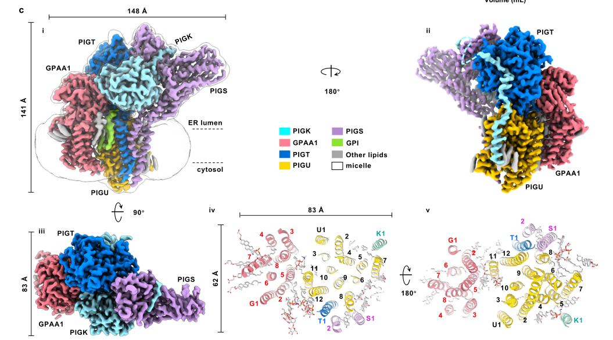

## Question

# Gene Research for Functional Annotation

## ⚠️ CRITICAL: Gene/Protein Identification Context

**BEFORE YOU BEGIN RESEARCH:** You MUST verify you are researching the CORRECT gene/protein. Gene symbols can be ambiguous, especially for less well-characterized genes from non-model organisms.

### Target Gene/Protein Identity (from UniProt):
- **UniProt Accession:** Q9US48
- **Protein Description:** RecName: Full=GPI transamidase component gaa1;
- **Gene Information:** Name=gaa1; ORFNames=SPAC1002.11;
- **Organism (full):** Schizosaccharomyces pombe (strain 972 / ATCC 24843) (Fission yeast).
- **Protein Family:** Not specified in UniProt
- **Key Domains:** Gaa1. (IPR007246); Gaa1 (PF04114)

### MANDATORY VERIFICATION STEPS:

1. **Check if the gene symbol "gaa1" matches the protein description above**
2. **Verify the organism is correct:** Schizosaccharomyces pombe (strain 972 / ATCC 24843) (Fission yeast).
3. **Check if protein family/domains align with what you find in literature**
4. **If you find literature for a DIFFERENT gene with the same or similar symbol, STOP**

### If Gene Symbol is Ambiguous or You Cannot Find Relevant Literature:

**DO NOT PROCEED WITH RESEARCH ON A DIFFERENT GENE.** Instead:
- State clearly: "The gene symbol 'gaa1' is ambiguous or literature is limited for this specific protein"
- Explain what you found (e.g., "Found extensive literature on a different gene with the same symbol in a different organism")
- Describe the protein based ONLY on the UniProt information provided above
- Suggest that the protein function can be inferred from domain/family information

### Research Target:

Please provide a comprehensive research report on the gene **gaa1** (gene ID: gaa1, UniProt: Q9US48) in SCHPO.

The research report should be a detailed narrative explaining the function, biological processes, and localization of the gene product. Citations should be given for all claims.

You should prioritize authoritative reviews and primary scientific literature when conducting research. You can supplement
this with annotations you find in gene/protein databases, but these can be outdated or inaccurate.

We are specifically interested in the primary function of the gene - for enzymes, what reaction is catalyzed, and what is the substrate specificity? For transporters, what is the substrate? For structural proteins or adapters, what is the broader structural role? For signaling molecules, what is the role in the pathway.

We are interested in where in or outside the cell the gene product carries out its function.

We are also interested in the signaling or biochemical pathways in which the gene functions. We are less interested in broad pleiotropic effects, except where these elucidate the precise role.

Include evidence where possible. We are interested in both experimental evidence as well as inference from structure, evolution, or bioinformatic analysis. Precise studies should be prioritized over high-throughput, where available.

## Output

Question: You are an expert researcher providing comprehensive, well-cited information.

Provide detailed information focusing on:
1. Key concepts and definitions with current understanding
2. Recent developments and latest research (prioritize 2023-2024 sources)
3. Current applications and real-world implementations
4. Expert opinions and analysis from authoritative sources
5. Relevant statistics and data from recent studies

Format as a comprehensive research report with proper citations. Include URLs and publication dates where available.
Always prioritize recent, authoritative sources and provide specific citations for all major claims.

# Gene Research for Functional Annotation

## ⚠️ CRITICAL: Gene/Protein Identification Context

**BEFORE YOU BEGIN RESEARCH:** You MUST verify you are researching the CORRECT gene/protein. Gene symbols can be ambiguous, especially for less well-characterized genes from non-model organisms.

### Target Gene/Protein Identity (from UniProt):
- **UniProt Accession:** Q9US48
- **Protein Description:** RecName: Full=GPI transamidase component gaa1;
- **Gene Information:** Name=gaa1; ORFNames=SPAC1002.11;
- **Organism (full):** Schizosaccharomyces pombe (strain 972 / ATCC 24843) (Fission yeast).
- **Protein Family:** Not specified in UniProt
- **Key Domains:** Gaa1. (IPR007246); Gaa1 (PF04114)

### MANDATORY VERIFICATION STEPS:

1. **Check if the gene symbol "gaa1" matches the protein description above**
2. **Verify the organism is correct:** Schizosaccharomyces pombe (strain 972 / ATCC 24843) (Fission yeast).
3. **Check if protein family/domains align with what you find in literature**
4. **If you find literature for a DIFFERENT gene with the same or similar symbol, STOP**

### If Gene Symbol is Ambiguous or You Cannot Find Relevant Literature:

**DO NOT PROCEED WITH RESEARCH ON A DIFFERENT GENE.** Instead:
- State clearly: "The gene symbol 'gaa1' is ambiguous or literature is limited for this specific protein"
- Explain what you found (e.g., "Found extensive literature on a different gene with the same symbol in a different organism")
- Describe the protein based ONLY on the UniProt information provided above
- Suggest that the protein function can be inferred from domain/family information

### Research Target:

Please provide a comprehensive research report on the gene **gaa1** (gene ID: gaa1, UniProt: Q9US48) in SCHPO.

The research report should be a detailed narrative explaining the function, biological processes, and localization of the gene product. Citations should be given for all claims.

You should prioritize authoritative reviews and primary scientific literature when conducting research. You can supplement
this with annotations you find in gene/protein databases, but these can be outdated or inaccurate.

We are specifically interested in the primary function of the gene - for enzymes, what reaction is catalyzed, and what is the substrate specificity? For transporters, what is the substrate? For structural proteins or adapters, what is the broader structural role? For signaling molecules, what is the role in the pathway.

We are interested in where in or outside the cell the gene product carries out its function.

We are also interested in the signaling or biochemical pathways in which the gene functions. We are less interested in broad pleiotropic effects, except where these elucidate the precise role.

Include evidence where possible. We are interested in both experimental evidence as well as inference from structure, evolution, or bioinformatic analysis. Precise studies should be prioritized over high-throughput, where available.

## Research report: *Schizosaccharomyces pombe* **gaa1** (UniProt Q9US48; ORF SPAC1002.11) — functional annotation and current evidence

### Executive summary (identity-verified)
The UniProt target **Q9US48 (gaa1; SPAC1002.11)** is annotated as “**GPI transamidase component Gaa1**” in *Schizosaccharomyces pombe* (strain 972). Direct *S. pombe*-specific biochemical/genetic literature for SPAC1002.11 was not retrieved in the accessible full-text corpus; therefore, species-specific functional statements are necessarily **inferred by orthology** to the conserved **Gaa1/GPAA1** family, with explicit supporting evidence that a *S. pombe* Gaa1 ortholog is recognized in cross-species comparisons of function-critical motifs. Specifically, a cross-species alignment of the last transmembrane helix of Gaa1 orthologs explicitly **includes *Schizosaccharomyces pombe*** and highlights a **conserved proline motif** required for GPI recognition in the transamidase complex. (vainauskas2004aconservedproline pages 4-5)

### 1) Key concepts and definitions (current understanding)

#### 1.1 Glycosylphosphatidylinositol (GPI) anchoring and “GPI transamidase”
GPI anchoring is a conserved eukaryotic post-translational modification that converts a secretory-pathway protein (a “preproprotein”) into a **membrane-tethered** protein by attaching a preassembled glycolipid (GPI) to the protein’s C-terminus. In the canonical reaction, **GPI transamidase (GPI-T/GPIT)** recognizes a C-terminal GPI signal sequence, cleaves the protein at the **ω-site** (the future C-terminus), and replaces the signal peptide with a GPI anchor, creating an **amide (peptide) bond** between the protein’s new C-terminal carboxyl at the ω-residue and an amine on the GPI anchor (commonly described as a terminal ethanolamine/phosphoethanolamine group). (vainauskas2002structuralrequirementsfor pages 1-1, gamage2013gpitransamidaseand pages 3-5, vainauskas2004aconservedproline pages 1-1)

This reaction occurs in the **endoplasmic reticulum (ER)** and is described as the final “commitment” step that produces a mature GPI-anchored protein. (vainauskas2002structuralrequirementsfor pages 1-1, gamage2013gpitransamidaseand pages 3-5)

#### 1.2 The Gaa1/GPAA1 subunit family
Gaa1 (yeast nomenclature) / GPAA1 (metazoan nomenclature) is a conserved, **multi-pass ER membrane** component of GPI transamidase. Structure-function analyses in mammalian systems characterize Gaa1 as an **ER-localized membrane glycoprotein** with cytosolic N-terminus and luminal C-terminus, and a large luminal region critical for association with other GPI-T subunits. (vainauskas2002structuralrequirementsfor pages 1-1)

A key functional theme for Gaa1/GPAA1 across systems is coupling **substrate recognition** and **GPI (lipid) recognition/presentation** to the catalytic reaction performed by the transamidase complex. (vainauskas2002structuralrequirementsfor pages 1-1, vainauskas2004aconservedproline pages 1-1)

#### 1.3 GPI signal sequence constraints (ω-site and downstream regions)
GPI transamidase recognizes a **C-terminal signal** with characteristic features: a short region surrounding the ω-site, a hydrophilic spacer, and a hydrophobic C-terminal tail. The ω-site (attachment residue) tends to be a small side chain; constraints at ω+1 and ω+2 are also strong (e.g., ω+2 often small), sometimes described as a “small amino acid domain.” (xu2022molecularinsightsinto pages 2-4, gamage2013gpitransamidaseand pages 3-5, vainauskas2004aconservedproline pages 1-1)

One mechanistic synthesis argues “only residues Ala, Asn, Asp, Cys, Gly, and Ser” are possible at the ω-site in typical substrates. (eisenhaber2014transamidasesubunitgaa1gpaa1 pages 2-4, eisenhaber2014transamidasesubunitgaa1gpaa1 pages 4-5)

### 2) Gene/protein-specific functional annotation for *S. pombe* gaa1 (Q9US48)

#### 2.1 What is the primary molecular function?
**Best-supported functional assignment (orthology-based):** gaa1 encodes a **GPI transamidase component** (Gaa1/GPAA1 family) required for efficient **attachment of GPI anchors** to secretory proteins in the ER.

**Evidence basis:**
- GPI transamidase chemistry and the role of Gaa1-family proteins in substrate interactions are experimentally supported in mammalian systems: proproteins can bind Gaa1 even when the catalytic subunit Gpi8/PIGK is absent, consistent with a **substrate-recruitment** role for Gaa1. (vainauskas2002structuralrequirementsfor pages 1-1)
- The last transmembrane segment of Gaa1 is implicated in **GPI recognition**: truncations and point mutations (including a conserved proline) disrupt GPI co-precipitation while preserving assembly and proprotein binding, indicating a role in binding/presenting the lipid substrate. (vainauskas2004aconservedproline pages 1-1)
- Cross-species sequence analysis explicitly includes **a *Schizosaccharomyces pombe* Gaa1 ortholog** and shows conservation of the function-critical proline motif in the last TM segment, supporting that *S. pombe* gaa1/Q9US48 is a true family member with conserved mechanistic features. (vainauskas2004aconservedproline pages 4-5)

**Important nuance / current uncertainty:** In the literature, the **precise catalytic assignment** for GPAA1/Gaa1 has evolved. A 2022 near-atomic cryo-EM structure of human GPI-T supports **PIGK** as the catalytic cysteine protease (with an essential catalytic dyad) and provides evidence that GPAA1’s luminal domain—despite a protease-like fold—may be more **structural/substrate-positioning** rather than the main catalytic center (based on mutagenesis and a cell-surface CD59 reporter assay). (xu2022molecularinsightsinto pages 2-4, xu2022molecularinsightsinto pages 7-9)

Accordingly, for *S. pombe* gaa1/Q9US48, the most conservative functional annotation is: **structural/recognition subunit of the ER GPI transamidase complex required for GPI-anchor attachment**, likely contributing to **substrate recruitment and/or GPI lipid engagement** rather than being the protease that cleaves the signal peptide. (vainauskas2002structuralrequirementsfor pages 1-1, vainauskas2004aconservedproline pages 1-1, xu2022molecularinsightsinto pages 7-9)

#### 2.2 What reaction is catalyzed and what is the substrate specificity?
The **GPI transamidase complex** catalyzes:
1) cleavage of the precursor’s C-terminal GPI signal peptide at the ω-site, forming an enzyme–substrate intermediate, and
2) nucleophilic attack by GPI to yield a product in which the ω-site residue becomes the C-terminal residue, linked by an amide bond to the GPI ethanolamine/phosphoethanolamine. (vainauskas2004aconservedproline pages 1-1, vainauskas2002structuralrequirementsfor pages 1-1)

Substrate constraints include a preference for small ω-site residues and strong constraints at ω+1/ω+2, plus a hydrophilic spacer and hydrophobic tail downstream. (xu2022molecularinsightsinto pages 2-4, gamage2013gpitransamidaseand pages 3-5, vainauskas2004aconservedproline pages 1-1)

For **Gaa1/GPAA1 specifically**, experimental and mechanistic studies support roles in **substrate recognition and GPI recognition** (see above), i.e., it contributes to the complex’s effective substrate processing and lipid engagement rather than defining a classic enzyme-substrate reaction on its own. (vainauskas2002structuralrequirementsfor pages 1-1, vainauskas2004aconservedproline pages 1-1)

#### 2.3 Subcellular localization and topology (where the gene product acts)
Across systems where it has been experimentally studied, Gaa1/GPAA1 is a **multi-pass ER membrane glycoprotein**. In a detailed mammalian analysis, Gaa1 is ER-localized, with a **cytosolic N-terminus** and **luminal C-terminus**, and with a large luminal region important for interactions with other GPI-T subunits. (vainauskas2002structuralrequirementsfor pages 1-1)

A 2022 cryo-EM structure of human GPI-T shows the complex partitioned into a luminal domain and a transmembrane domain, with GPAA1 contributing a substantial portion of the **membrane-embedded scaffold** (an eight-transmembrane-helix entity in the model). (xu2022molecularinsightsinto pages 2-4)

For *S. pombe* gaa1/Q9US48, the most defensible localization statement is **ER membrane**, inferred from conserved complex function and topology across eukaryotes. (vainauskas2002structuralrequirementsfor pages 1-1, xu2022molecularinsightsinto pages 2-4)

### 3) Recent developments and latest research (prioritized 2023–2024 when available)

#### 3.1 High-resolution architecture and refined mechanistic model (2022, still foundational for 2023–2024)
The major recent step-change for understanding GPI transamidase is the **2.53 Å cryo-EM structure** of the human GPI-T complex, revealing an equimolar heteropentameric organization and providing extensive mutational validation of catalytic and binding determinants. (xu2022molecularinsightsinto pages 2-4, xu2022molecularinsightsinto pages 1-2)

Key quantitative details from this work include: resolution **2.53 Å**, near-complete model (**2,393 residues, 94.4% complete**), and a transmembrane domain comprising **24 TM helices** with GPAA1 contributing an **eight-TMH** module; a ~**22 Å** elongated cavity spans from the membrane toward the catalytic dyad, supporting a geometry-based model for accommodating both amphipathic protein and lipid substrates. (xu2022molecularinsightsinto pages 2-4, xu2022molecularinsightsinto pages 1-2)

This structure also provided functional assay readouts (e.g., substitutions that abolish activity or reduce to ~10% for a key pocket mutation in the catalytic subunit) and suggested that GPAA1 is less likely to be the principal catalytic site in the human enzyme (based on mutational tolerance in the assay). (xu2022molecularinsightsinto pages 2-4, xu2022molecularinsightsinto pages 7-9)

#### 3.2 2024: ER quality control (ERAD) as a regulator of GPI transamidase output
A 2024 Nature Communications study links ER-associated degradation (ERAD) via the SEL1L–HRD1 complex to GPI-anchored protein biogenesis by identifying **PIGK** (the catalytic subunit of GPI-T) as a prominent ERAD substrate and showing that ERAD attenuates GPI-anchored protein production by targeting PIGK for proteasomal degradation. (wei2024proteomicscreensof pages 1-2)

Quantitative/statistical highlights from the 2024 work include:
- **>100** high-confidence ERAD substrates identified (after machine-learning filtering) across HEK293T cells and mouse brown adipose tissue, with ~**88%** being cell-type specific. (wei2024proteomicscreensof pages 1-2)
- In one dataset: **55** SEL1L interactors; among putative substrates, **61%** membrane proteins, **69%** glycosylated, and **31%** with disulfide bonds—consistent with surveillance of secretory-pathway proteins and complexes such as GPI-T. (wei2024proteomicscreensof pages 2-3)

While not *S. pombe*-specific, this work reframes GPI-anchor attachment as a pathway whose throughput can be controlled by protein quality-control systems acting on transamidase subunits; by orthology, similar logic may apply in fungi, although direct evidence would be required for *S. pombe*. (wei2024proteomicscreensof pages 1-2)

### 4) Current applications and real-world implementations

#### 4.1 Biomedical relevance of the pathway (context for GPAA1/Gaa1 family)
GPI anchoring is central to the cell-surface display of many proteins. For example, the 2024 ERAD study reiterates that there are **>150 human GPI-anchored proteins**, emphasizing the breadth of pathway impact. (wei2024proteomicscreensof pages 1-2)

In clinical genetics and cell biology, disruptions of GPI transamidase components and GPI biosynthesis are widely connected to human disease; the 2024 work notes that many genetic variants in transamidase components are associated with neurodevelopmental disorders and demonstrates ERAD handling of disease variants in PIGK. (wei2024proteomicscreensof pages 2-3, wei2024proteomicscreensof pages 1-2)

#### 4.2 Research and biotech implementations
In yeast and fungal systems, GPI anchoring is a major contributor to **cell wall protein display** and surface proteome composition. Therefore, GPI-transamidase components (including Gaa1 family proteins) are used implicitly in:
- engineered display of proteins on the cell surface (requiring functional GPI attachment machinery), and
- functional genomics screens of secretory pathway/cell wall integrity (GPI anchoring is a frequent node of sensitivity).

Although the accessible corpus here did not provide *S. pombe*-specific implementations for SPAC1002.11, the conserved essential role of the pathway in anchoring suggests that gaa1 disruption would be expected to broadly affect GPI-anchored protein maturation and downstream cell surface/cell wall processes (hypothesis; would require direct *S. pombe* validation). (vainauskas2002structuralrequirementsfor pages 1-1, gamage2013gpitransamidaseand pages 3-5)

### 5) Expert opinions and analysis (authoritative synthesis)

#### 5.1 Mechanistic role of Gaa1/GPAA1: evolving consensus
Older mechanistic syntheses and modeling papers proposed that GAA1/GPAA1 is the key enzymatic subunit catalyzing the peptide-bond formation between the ω-site and phosphoethanolamine and emphasized a metalloenzyme-like luminal domain. (eisenhaber2014transamidasesubunitgaa1gpaa1 pages 4-5, su2020structuralmodellingof pages 1-2)

In contrast, the near-atomic structure and mutagenesis from 2022 provide strong evidence placing proteolytic and transamidation catalysis at the PIGK active site (cysteine protease-like), while supporting GPAA1 as more of a **scaffold/substrate-positioning and membrane-embedded organizing unit**, with functional importance in building the composite substrate/lipid-binding environment. (xu2022molecularinsightsinto pages 2-4, xu2022molecularinsightsinto pages 7-9)

For functional annotation of *S. pombe* gaa1/Q9US48, the best practice is therefore to phrase Gaa1’s role as **required component of ER GPI transamidase**, likely contributing to **substrate recruitment and/or GPI recognition**, rather than asserting sole catalytic responsibility for peptide-bond formation. (vainauskas2002structuralrequirementsfor pages 1-1, vainauskas2004aconservedproline pages 1-1, xu2022molecularinsightsinto pages 7-9)

#### 5.2 What is most likely conserved in *S. pombe*?
The most defensible conserved features (supported by cross-species evidence and conserved complex biology) are:
- ER localization and multi-pass membrane nature of Gaa1-family proteins (vainauskas2002structuralrequirementsfor pages 1-1)
- involvement in GPI recognition/presentation via the last TM segment, including a conserved proline motif (vainauskas2004aconservedproline pages 1-1)
- existence of a *S. pombe* ortholog in the conserved family bearing the motif (vainauskas2004aconservedproline pages 4-5)

### Evidence summary table
The following table consolidates direct evidence and clearly marks where *S. pombe* claims are orthology-based.

| Claim/Topic | Organism/System | Key finding | Quantitative details | Evidence type | Citation (include DOI URL and publication date) |
|---|---|---|---|---|---|
| **S. pombe gaa1/Q9US48 identity** | *Schizosaccharomyces pombe* (in multispecies alignment) | A Gaa1 ortholog from *S. pombe* is explicitly included in cross-species alignment of the last TM segment; the family-defining conserved proline linked to GPI recognition is present, supporting that Q9US48/gaa1 belongs to the Gaa1/GPAA1 GPI-transamidase family. | Conserved proline in a GXXP/GXP-like motif in the last TM segment. | Comparative sequence conservation; family inference | Vainauskas & Menon, **2004-02**, JBC, DOI: https://doi.org/10.1074/jbc.M312191200 (vainauskas2004aconservedproline pages 4-5) |
| **S. pombe gaa1/Q9US48 function (inferred)** | *S. pombe* gaa1 / UniProt Q9US48 | Best-supported annotation is **GPI transamidase component Gaa1**, involved in attachment of a preassembled GPI anchor to precursor proteins after C-terminal signal processing. Direct *S. pombe*-specific biochemical evidence was not retrieved, so this is inferred from strong orthology/family conservation. | No direct *S. pombe* kinetic data retrieved. | Orthology-based functional inference from conserved GPIT subunit family | Conserved-family evidence summarized from Gaa1/GPAA1 studies (vainauskas2002structuralrequirementsfor pages 1-1, vainauskas2004aconservedproline pages 4-5, hong2003humanpiguand pages 9-10) |
| **S. pombe gaa1/Q9US48 localization (inferred)** | *S. pombe* gaa1 / eukaryotic Gaa1 family | Likely an **ER membrane** protein with a large luminal domain, because Gaa1/GPAA1 is ER-localized across experimentally studied systems and functions in the ER-resident GPI transamidase complex. | Human GPAA1/Gaa1 studied as multi-pass membrane glycoprotein; 7 TM spans in 2002 work, 8 TMHs in 2022 cryo-EM model. | Inference from conserved topology and complex localization | Vainauskas et al., **2002-08**, JBC, DOI: https://doi.org/10.1074/jbc.M205402200; Xu et al., **2022-05**, Nat Commun, DOI: https://doi.org/10.1038/s41467-022-30250-6 (vainauskas2002structuralrequirementsfor pages 1-1, xu2022molecularinsightsinto pages 2-4, xu2022molecularinsightsinto media f6d12197) |
| **S. pombe gaa1/Q9US48 complex membership (inferred)** | *S. pombe* gaa1 / eukaryotic GPIT | Likely a core subunit of the **five-subunit GPI transamidase (GPIT/GPI-T)** with orthologs of PIGK/Gpi8, PIGT/Gpi16, PIGS/Gpi17, and PIGU/Gab1/Cdc91. | Human structure resolved a 1:1:1:1:1 heteropentamer. | Orthology/family inference supported by conserved complex architecture | Ohishi et al., **2000-05**, Mol Biol Cell, DOI: https://doi.org/10.1091/mbc.11.5.1523; Xu et al., **2022-05**, Nat Commun, DOI: https://doi.org/10.1038/s41467-022-30250-6 (xu2022molecularinsightsinto pages 2-4, hong2003humanpiguand pages 9-10) |
| **2002 structural role of Gaa1** | Human Gaa1 in GPIT | Gaa1 is an **ER-localized membrane glycoprotein**; its **large luminal domain** mediates interaction with other GPIT subunits, while C-terminal TM segments are required for a **functional** complex. | Detergent-extracted Gaa1-containing complexes sedimented at ~**17 S**. | Primary experimental cell biology and structure-function analysis | Vainauskas et al., **2002-08**, JBC, DOI: https://doi.org/10.1074/jbc.M205402200 (vainauskas2002structuralrequirementsfor pages 1-1) |
| **2002 substrate-recognition role** | Human Gaa1/GPIT | Pro-protein substrates can bind **Gaa1 in the absence of Gpi8**, implying a key **substrate-recognition/recruitment** role for Gaa1 within GPIT. | No catalytic rate reported. | Primary experimental interaction analysis | Vainauskas et al., **2002-08**, JBC, DOI: https://doi.org/10.1074/jbc.M205402200 (vainauskas2002structuralrequirementsfor pages 1-1) |
| **2004 GPI recognition by Gaa1 TM segment** | Human Gaa1/GPIT with cross-species comparison | A conserved **proline in the last TM segment** is required for **GPI recognition** by GPIT; mutant complexes can assemble and bind proprotein yet fail to co-precipitate GPI efficiently. | Example: **P609L** lost H8/GPI co-precipitation, whereas **W611L** retained it. | Primary mutational/biochemical evidence | Vainauskas & Menon, **2004-02**, JBC, DOI: https://doi.org/10.1074/jbc.M312191200 (vainauskas2004aconservedproline pages 4-5, vainauskas2004aconservedproline pages 5-6) |
| **2022 GPIT architecture** | Human GPI transamidase cryo-EM | Near-atomic structure showed an **equimolar heteropentameric** complex with a luminal catalytic assembly and transmembrane core; GPAA1 forms a major membrane-embedded scaffold with a portico-like architecture. | **2.53 Å** resolution; **2,393 residues** modeled (**94.4%** complete); **24 TMHs** total; GPAA1 contributes **8 TMHs**. | Primary structural biology (cryo-EM) | Xu et al., **2022-05**, Nat Commun, DOI: https://doi.org/10.1038/s41467-022-30250-6 (xu2022molecularinsightsinto pages 2-4, xu2022molecularinsightsinto pages 1-2, xu2022molecularinsightsinto media f6d12197) |
| **2022 catalytic assignment revises GPAA1 role** | Human GPIT | Structure and mutagenesis support **PIGK** as the catalytic cysteine protease; GPAA1’s soluble domain resembles a Zn-protease fold but tested acidic/histidine residues were **not required** in the cell assay, arguing GPAA1 is more likely **structural/substrate-positioning** rather than the principal catalyst. | GPAA1 D/E/H substitutions did **not** reduce CD59 staining; PIGK **H164A** or **C206S** abolished activity; **R60E** left **9.8%** of WT activity. | Primary structural biology plus mutagenesis | Xu et al., **2022-05**, Nat Commun, DOI: https://doi.org/10.1038/s41467-022-30250-6 (xu2022molecularinsightsinto pages 7-9, xu2022molecularinsightsinto pages 2-4) |
| **2022 substrate selectivity model** | Human GPIT | The active site forms an elongated cavity spanning from the membrane toward the catalytic dyad, with the **distance to the membrane** proposed as a **molecular ruler** for selecting valid GPI-attachment signals. | Cavity extends ~**22 Å** from membrane toward catalytic dyad; **12/22** mapped pathogenic mutations clustered near catalytic/GPI-binding regions. | Primary structural/mechanistic inference | Xu et al., **2022-05**, Nat Commun, DOI: https://doi.org/10.1038/s41467-022-30250-6 (xu2022molecularinsightsinto pages 7-9, xu2022molecularinsightsinto pages 1-2) |
| **GAA1/GPAA1 catalytic hypothesis from modeling** | Human GPAA1 lumenal domain | Modeling work proposed GPAA1 as an **M28-family metallo-peptide synthetase** with likely **single-Zn** chemistry and dynamic flaps around the active site, offering a mechanistic explanation for peptide-bond formation to phosphoethanolamine. | Predicted one Zn favored over two; two flaps show anti-correlated “breathing” dynamics. | Computational structural inference | Su et al., **2020-09**, Biology Direct, DOI: https://doi.org/10.1186/s13062-020-00266-3 (su2020structuralmodellingof pages 1-2) |
| **ω-site specificity concept** | Eukaryotic GAA1/GPAA1 literature | Classical GPAA1-centered model proposes transfer to proteins bearing a GPI-attachment ω-site with limited residue tolerance. | Permissive ω-site residues summarized as **Ala, Asn, Asp, Cys, Gly, Ser**. | Review/synthesis of prior biochemical literature | Eisenhaber et al., **2014-04**, Cell Cycle, DOI: https://doi.org/10.4161/cc.28761 (eisenhaber2014transamidasesubunitgaa1gpaa1 pages 4-5) |
| **2024 ERAD regulation of GPI-T biogenesis** | Human HEK293T cells and mouse brown adipose tissue | SEL1L–HRD1 ERAD regulates GPI-anchored protein biogenesis by targeting **PIGK** for degradation, thereby indirectly controlling the function of the whole GPIT complex containing **GPAA1/GAA1**. | Screen identified **>100** high-confidence endogenous ERAD substrates, with ~**88%** cell-type specificity. | Primary proteomics and cell biology | Wei et al., **2024-01**, Nat Commun, DOI: https://doi.org/10.1038/s41467-024-44948-2 (wei2024proteomicscreensof pages 1-2) |
| **2024 quantitative screen characteristics** | Human ERAD interactome | In the SEL1L-centered interactome, many candidate substrates had features common to secretory-pathway proteins, consistent with surveillance of GPI-T/GPI-AP biogenesis. | **55** SEL1L interactors; **61%** membrane proteins, **69%** glycosylated, **31%** with disulfide bonds. | Primary proteomics dataset | Wei et al., **2024-01**, Nat Commun, DOI: https://doi.org/10.1038/s41467-024-44948-2 (wei2024proteomicscreensof pages 2-3) |
| **2024 relevance to disease and GPI-AP output** | Human GPI-T / ERAD | Several disease-associated **PIGK** variants are ERAD substrates; because GPIT has five core subunits including GPAA1, this work highlights post-translational quality control as an important regulator of the GPI-anchoring pathway. | Context includes **>150** human GPI-anchored proteins. | Primary mechanistic study with disease-variant analysis | Wei et al., **2024-01**, Nat Commun, DOI: https://doi.org/10.1038/s41467-024-44948-2 (wei2024proteomicscreensof pages 1-2, wei2024proteomicscreensof pages 2-3) |

*Table: This table summarizes what is directly known versus inferred for *S. pombe* gaa1/Q9US48, then places it in the broader mechanistic context of GAA1/GPAA1 research from landmark 2002, 2004, 2022, and 2024 studies. It is useful for separating species-specific evidence from orthology-based annotation and recent pathway-level advances.*

### Visual evidence (structure/topology)
Cropped figure regions from the 2022 cryo-EM study illustrate the location of GPAA1 within the heteropentamer and its multi-pass transmembrane arrangement, supporting claims about how Gaa1-family proteins can act as membrane scaffolds for the transamidase. (xu2022molecularinsightsinto media f6d12197, xu2022molecularinsightsinto media c4bf5218)

### Limitations and what would strengthen *S. pombe* annotation
- No accessible full-text primary studies explicitly characterizing **SPAC1002.11/Q9US48** (essentiality, localization by microscopy, mutant phenotypes) were retrieved. Thus, the report’s *S. pombe* statements are primarily **orthology-driven**.
- To convert inference into direct annotation, the most valuable missing evidence would be: (i) tagged-gaa1 localization in *S. pombe*, (ii) deletion/conditional depletion phenotypes, (iii) biochemical co-complex purification with *S. pombe* Gpi8/PIGK orthologs, and (iv) readouts of surface/cell-wall GPI-anchored protein maturation.

### Key references (publication date; URL)
- Vainauskas et al. 2002-08-??. *J Biol Chem.* https://doi.org/10.1074/jbc.M205402200 (vainauskas2002structuralrequirementsfor pages 1-1)
- Vainauskas & Menon 2004-02-??. *J Biol Chem.* https://doi.org/10.1074/jbc.M312191200 (vainauskas2004aconservedproline pages 1-1, vainauskas2004aconservedproline pages 4-5)
- Gamage & Hendrickson 2013-09-??. *Crit Rev Biochem Mol Biol.* https://doi.org/10.3109/10409238.2013.831024 (gamage2013gpitransamidaseand pages 3-5)
- Eisenhaber et al. 2014-04-??. *Cell Cycle.* https://doi.org/10.4161/cc.28761 (eisenhaber2014transamidasesubunitgaa1gpaa1 pages 4-5)
- Xu et al. 2022-05-??. *Nat Commun.* https://doi.org/10.1038/s41467-022-30250-6 (xu2022molecularinsightsinto pages 2-4, xu2022molecularinsightsinto pages 7-9, xu2022molecularinsightsinto media f6d12197)
- Wei et al. 2024-01-??. *Nat Commun.* https://doi.org/10.1038/s41467-024-44948-2 (wei2024proteomicscreensof pages 1-2, wei2024proteomicscreensof pages 2-3)

References

1. (vainauskas2004aconservedproline pages 4-5): Saulius Vainauskas and Anant K. Menon. A conserved proline in the last transmembrane segment of gaa1 is required for glycosylphosphatidylinositol (gpi) recognition by gpi transamidase*. Journal of Biological Chemistry, 279:6540-6545, Feb 2004. URL: https://doi.org/10.1074/jbc.m312191200, doi:10.1074/jbc.m312191200. This article has 47 citations and is from a domain leading peer-reviewed journal.

2. (vainauskas2002structuralrequirementsfor pages 1-1): Saulius Vainauskas, Yusuke Maeda, Henry Kurniawan, Taroh Kinoshita, and Anant K. Menon. Structural requirements for the recruitment of gaa1 into a functional glycosylphosphatidylinositol transamidase complex*. The Journal of Biological Chemistry, 277:30535-30542, Aug 2002. URL: https://doi.org/10.1074/jbc.m205402200, doi:10.1074/jbc.m205402200. This article has 57 citations.

3. (gamage2013gpitransamidaseand pages 3-5): Dilani G. Gamage and Tamara L. Hendrickson. Gpi transamidase and gpi anchored proteins: oncogenes and biomarkers for cancer. Critical Reviews in Biochemistry and Molecular Biology, 48:446-464, Sep 2013. URL: https://doi.org/10.3109/10409238.2013.831024, doi:10.3109/10409238.2013.831024. This article has 71 citations and is from a peer-reviewed journal.

4. (vainauskas2004aconservedproline pages 1-1): Saulius Vainauskas and Anant K. Menon. A conserved proline in the last transmembrane segment of gaa1 is required for glycosylphosphatidylinositol (gpi) recognition by gpi transamidase*. Journal of Biological Chemistry, 279:6540-6545, Feb 2004. URL: https://doi.org/10.1074/jbc.m312191200, doi:10.1074/jbc.m312191200. This article has 47 citations and is from a domain leading peer-reviewed journal.

5. (xu2022molecularinsightsinto pages 2-4): Yidan Xu, Guowen Jia, Tingting Li, Zixuan Zhou, Yitian Luo, Yulin Chao, Juan Bao, Zhaoming Su, Qianhui Qu, and Dianfan Li. Molecular insights into biogenesis of glycosylphosphatidylinositol anchor proteins. Nature Communications, May 2022. URL: https://doi.org/10.1038/s41467-022-30250-6, doi:10.1038/s41467-022-30250-6. This article has 39 citations and is from a highest quality peer-reviewed journal.

6. (eisenhaber2014transamidasesubunitgaa1gpaa1 pages 2-4): Birgit Eisenhaber, Stephan Eisenhaber, Toh Yew Kwang, Gerhard Grüber, and Frank Eisenhaber. Transamidase subunit gaa1/gpaa1 is a m28 family metallo-peptide-synthetase that catalyzes the peptide bond formation between the substrate protein’s omega-site and the gpi lipid anchor’s phosphoethanolamine. Cell Cycle, 13:1912-1917, Apr 2014. URL: https://doi.org/10.4161/cc.28761, doi:10.4161/cc.28761. This article has 64 citations and is from a peer-reviewed journal.

7. (eisenhaber2014transamidasesubunitgaa1gpaa1 pages 4-5): Birgit Eisenhaber, Stephan Eisenhaber, Toh Yew Kwang, Gerhard Grüber, and Frank Eisenhaber. Transamidase subunit gaa1/gpaa1 is a m28 family metallo-peptide-synthetase that catalyzes the peptide bond formation between the substrate protein’s omega-site and the gpi lipid anchor’s phosphoethanolamine. Cell Cycle, 13:1912-1917, Apr 2014. URL: https://doi.org/10.4161/cc.28761, doi:10.4161/cc.28761. This article has 64 citations and is from a peer-reviewed journal.

8. (xu2022molecularinsightsinto pages 7-9): Yidan Xu, Guowen Jia, Tingting Li, Zixuan Zhou, Yitian Luo, Yulin Chao, Juan Bao, Zhaoming Su, Qianhui Qu, and Dianfan Li. Molecular insights into biogenesis of glycosylphosphatidylinositol anchor proteins. Nature Communications, May 2022. URL: https://doi.org/10.1038/s41467-022-30250-6, doi:10.1038/s41467-022-30250-6. This article has 39 citations and is from a highest quality peer-reviewed journal.

9. (xu2022molecularinsightsinto pages 1-2): Yidan Xu, Guowen Jia, Tingting Li, Zixuan Zhou, Yitian Luo, Yulin Chao, Juan Bao, Zhaoming Su, Qianhui Qu, and Dianfan Li. Molecular insights into biogenesis of glycosylphosphatidylinositol anchor proteins. Nature Communications, May 2022. URL: https://doi.org/10.1038/s41467-022-30250-6, doi:10.1038/s41467-022-30250-6. This article has 39 citations and is from a highest quality peer-reviewed journal.

10. (wei2024proteomicscreensof pages 1-2): Xiaoqiong Wei, You Lu, Liangguang Leo Lin, Chengxin Zhang, Xinxin Chen, Siwen Wang, Shuangcheng Alivia Wu, Zexin Jason Li, Yujun Quan, Shengyi Sun, and Ling Qi. Proteomic screens of sel1l-hrd1 er-associated degradation substrates reveal its role in glycosylphosphatidylinositol-anchored protein biogenesis. Nature Communications, Jan 2024. URL: https://doi.org/10.1038/s41467-024-44948-2, doi:10.1038/s41467-024-44948-2. This article has 26 citations and is from a highest quality peer-reviewed journal.

11. (wei2024proteomicscreensof pages 2-3): Xiaoqiong Wei, You Lu, Liangguang Leo Lin, Chengxin Zhang, Xinxin Chen, Siwen Wang, Shuangcheng Alivia Wu, Zexin Jason Li, Yujun Quan, Shengyi Sun, and Ling Qi. Proteomic screens of sel1l-hrd1 er-associated degradation substrates reveal its role in glycosylphosphatidylinositol-anchored protein biogenesis. Nature Communications, Jan 2024. URL: https://doi.org/10.1038/s41467-024-44948-2, doi:10.1038/s41467-024-44948-2. This article has 26 citations and is from a highest quality peer-reviewed journal.

12. (su2020structuralmodellingof pages 1-2): Chinh Tran-To Su, Swati Sinha, Birgit Eisenhaber, and Frank Eisenhaber. Structural modelling of the lumenal domain of human gpaa1, the metallo-peptide synthetase subunit of the transamidase complex, reveals zinc-binding mode and two flaps surrounding the active site. Biology Direct, Sep 2020. URL: https://doi.org/10.1186/s13062-020-00266-3, doi:10.1186/s13062-020-00266-3. This article has 9 citations and is from a peer-reviewed journal.

13. (hong2003humanpiguand pages 9-10): Yeongjin Hong, Kazuhito Ohishi, Ji Young Kang, Satoshi Tanaka, Norimitsu Inoue, Jun-ichi Nishimura, Yusuke Maeda, and Taroh Kinoshita. Human pig-u and yeast cdc91p are the fifth subunit of gpi transamidase that attaches gpi-anchors to proteins. Molecular biology of the cell, 14 5:1780-9, May 2003. URL: https://doi.org/10.1091/mbc.e02-12-0794, doi:10.1091/mbc.e02-12-0794. This article has 163 citations and is from a domain leading peer-reviewed journal.

14. (xu2022molecularinsightsinto media f6d12197): Yidan Xu, Guowen Jia, Tingting Li, Zixuan Zhou, Yitian Luo, Yulin Chao, Juan Bao, Zhaoming Su, Qianhui Qu, and Dianfan Li. Molecular insights into biogenesis of glycosylphosphatidylinositol anchor proteins. Nature Communications, May 2022. URL: https://doi.org/10.1038/s41467-022-30250-6, doi:10.1038/s41467-022-30250-6. This article has 39 citations and is from a highest quality peer-reviewed journal.

15. (vainauskas2004aconservedproline pages 5-6): Saulius Vainauskas and Anant K. Menon. A conserved proline in the last transmembrane segment of gaa1 is required for glycosylphosphatidylinositol (gpi) recognition by gpi transamidase*. Journal of Biological Chemistry, 279:6540-6545, Feb 2004. URL: https://doi.org/10.1074/jbc.m312191200, doi:10.1074/jbc.m312191200. This article has 47 citations and is from a domain leading peer-reviewed journal.

16. (xu2022molecularinsightsinto media c4bf5218): Yidan Xu, Guowen Jia, Tingting Li, Zixuan Zhou, Yitian Luo, Yulin Chao, Juan Bao, Zhaoming Su, Qianhui Qu, and Dianfan Li. Molecular insights into biogenesis of glycosylphosphatidylinositol anchor proteins. Nature Communications, May 2022. URL: https://doi.org/10.1038/s41467-022-30250-6, doi:10.1038/s41467-022-30250-6. This article has 39 citations and is from a highest quality peer-reviewed journal.

## Artifacts

- [Edison artifact artifact-00](gaa1-deep-research-falcon_artifacts/artifact-00.md)

## Citations

1. vainauskas2004aconservedproline pages 4-5
2. vainauskas2002structuralrequirementsfor pages 1-1
3. vainauskas2004aconservedproline pages 1-1
4. xu2022molecularinsightsinto pages 2-4
5. wei2024proteomicscreensof pages 1-2
6. wei2024proteomicscreensof pages 2-3
7. su2020structuralmodellingof pages 1-2
8. gamage2013gpitransamidaseand pages 3-5
9. xu2022molecularinsightsinto pages 7-9
10. xu2022molecularinsightsinto pages 1-2
11. hong2003humanpiguand pages 9-10
12. vainauskas2004aconservedproline pages 5-6
13. https://doi.org/10.1074/jbc.M312191200
14. https://doi.org/10.1074/jbc.M205402200;
15. https://doi.org/10.1038/s41467-022-30250-6
16. https://doi.org/10.1091/mbc.11.5.1523;
17. https://doi.org/10.1074/jbc.M205402200
18. https://doi.org/10.1186/s13062-020-00266-3
19. https://doi.org/10.4161/cc.28761
20. https://doi.org/10.1038/s41467-024-44948-2
21. https://doi.org/10.3109/10409238.2013.831024
22. https://doi.org/10.1074/jbc.m312191200,
23. https://doi.org/10.1074/jbc.m205402200,
24. https://doi.org/10.3109/10409238.2013.831024,
25. https://doi.org/10.1038/s41467-022-30250-6,
26. https://doi.org/10.4161/cc.28761,
27. https://doi.org/10.1038/s41467-024-44948-2,
28. https://doi.org/10.1186/s13062-020-00266-3,
29. https://doi.org/10.1091/mbc.e02-12-0794,