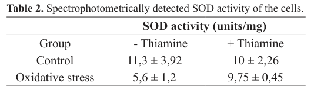

## Question

# Gene Research for Functional Annotation

## ⚠️ CRITICAL: Gene/Protein Identification Context

**BEFORE YOU BEGIN RESEARCH:** You MUST verify you are researching the CORRECT gene/protein. Gene symbols can be ambiguous, especially for less well-characterized genes from non-model organisms.

### Target Gene/Protein Identity (from UniProt):
- **UniProt Accession:** O43026
- **Protein Description:** RecName: Full=Glyceraldehyde-3-phosphate dehydrogenase 2; Short=GAPDH 2; EC=1.2.1.12;
- **Gene Information:** Name=gpd3; ORFNames=SPBC354.12;
- **Organism (full):** Schizosaccharomyces pombe (strain 972 / ATCC 24843) (Fission yeast).
- **Protein Family:** Belongs to the glyceraldehyde-3-phosphate dehydrogenase
- **Key Domains:** GlycerAld/Erythrose_P_DH. (IPR020831); GlycerAld_3-P_DH_AS. (IPR020830); GlycerAld_3-P_DH_cat. (IPR020829); GlycerAld_3-P_DH_NAD(P)-bd. (IPR020828); Glyceraldehyde-3-P_DH_1. (IPR006424)

### MANDATORY VERIFICATION STEPS:

1. **Check if the gene symbol "gpd3" matches the protein description above**
2. **Verify the organism is correct:** Schizosaccharomyces pombe (strain 972 / ATCC 24843) (Fission yeast).
3. **Check if protein family/domains align with what you find in literature**
4. **If you find literature for a DIFFERENT gene with the same or similar symbol, STOP**

### If Gene Symbol is Ambiguous or You Cannot Find Relevant Literature:

**DO NOT PROCEED WITH RESEARCH ON A DIFFERENT GENE.** Instead:
- State clearly: "The gene symbol 'gpd3' is ambiguous or literature is limited for this specific protein"
- Explain what you found (e.g., "Found extensive literature on a different gene with the same symbol in a different organism")
- Describe the protein based ONLY on the UniProt information provided above
- Suggest that the protein function can be inferred from domain/family information

### Research Target:

Please provide a comprehensive research report on the gene **gpd3** (gene ID: gpd3, UniProt: O43026) in SCHPO.

The research report should be a detailed narrative explaining the function, biological processes, and localization of the gene product. Citations should be given for all claims.

You should prioritize authoritative reviews and primary scientific literature when conducting research. You can supplement
this with annotations you find in gene/protein databases, but these can be outdated or inaccurate.

We are specifically interested in the primary function of the gene - for enzymes, what reaction is catalyzed, and what is the substrate specificity? For transporters, what is the substrate? For structural proteins or adapters, what is the broader structural role? For signaling molecules, what is the role in the pathway.

We are interested in where in or outside the cell the gene product carries out its function.

We are also interested in the signaling or biochemical pathways in which the gene functions. We are less interested in broad pleiotropic effects, except where these elucidate the precise role.

Include evidence where possible. We are interested in both experimental evidence as well as inference from structure, evolution, or bioinformatic analysis. Precise studies should be prioritized over high-throughput, where available.

## Output

Question: You are an expert researcher providing comprehensive, well-cited information.

Provide detailed information focusing on:
1. Key concepts and definitions with current understanding
2. Recent developments and latest research (prioritize 2023-2024 sources)
3. Current applications and real-world implementations
4. Expert opinions and analysis from authoritative sources
5. Relevant statistics and data from recent studies

Format as a comprehensive research report with proper citations. Include URLs and publication dates where available.
Always prioritize recent, authoritative sources and provide specific citations for all major claims.

# Gene Research for Functional Annotation

## ⚠️ CRITICAL: Gene/Protein Identification Context

**BEFORE YOU BEGIN RESEARCH:** You MUST verify you are researching the CORRECT gene/protein. Gene symbols can be ambiguous, especially for less well-characterized genes from non-model organisms.

### Target Gene/Protein Identity (from UniProt):
- **UniProt Accession:** O43026
- **Protein Description:** RecName: Full=Glyceraldehyde-3-phosphate dehydrogenase 2; Short=GAPDH 2; EC=1.2.1.12;
- **Gene Information:** Name=gpd3; ORFNames=SPBC354.12;
- **Organism (full):** Schizosaccharomyces pombe (strain 972 / ATCC 24843) (Fission yeast).
- **Protein Family:** Belongs to the glyceraldehyde-3-phosphate dehydrogenase
- **Key Domains:** GlycerAld/Erythrose_P_DH. (IPR020831); GlycerAld_3-P_DH_AS. (IPR020830); GlycerAld_3-P_DH_cat. (IPR020829); GlycerAld_3-P_DH_NAD(P)-bd. (IPR020828); Glyceraldehyde-3-P_DH_1. (IPR006424)

### MANDATORY VERIFICATION STEPS:

1. **Check if the gene symbol "gpd3" matches the protein description above**
2. **Verify the organism is correct:** Schizosaccharomyces pombe (strain 972 / ATCC 24843) (Fission yeast).
3. **Check if protein family/domains align with what you find in literature**
4. **If you find literature for a DIFFERENT gene with the same or similar symbol, STOP**

### If Gene Symbol is Ambiguous or You Cannot Find Relevant Literature:

**DO NOT PROCEED WITH RESEARCH ON A DIFFERENT GENE.** Instead:
- State clearly: "The gene symbol 'gpd3' is ambiguous or literature is limited for this specific protein"
- Explain what you found (e.g., "Found extensive literature on a different gene with the same symbol in a different organism")
- Describe the protein based ONLY on the UniProt information provided above
- Suggest that the protein function can be inferred from domain/family information

### Research Target:

Please provide a comprehensive research report on the gene **gpd3** (gene ID: gpd3, UniProt: O43026) in SCHPO.

The research report should be a detailed narrative explaining the function, biological processes, and localization of the gene product. Citations should be given for all claims.

You should prioritize authoritative reviews and primary scientific literature when conducting research. You can supplement
this with annotations you find in gene/protein databases, but these can be outdated or inaccurate.

We are specifically interested in the primary function of the gene - for enzymes, what reaction is catalyzed, and what is the substrate specificity? For transporters, what is the substrate? For structural proteins or adapters, what is the broader structural role? For signaling molecules, what is the role in the pathway.

We are interested in where in or outside the cell the gene product carries out its function.

We are also interested in the signaling or biochemical pathways in which the gene functions. We are less interested in broad pleiotropic effects, except where these elucidate the precise role.

Include evidence where possible. We are interested in both experimental evidence as well as inference from structure, evolution, or bioinformatic analysis. Precise studies should be prioritized over high-throughput, where available.

# Research report: *Schizosaccharomyces pombe* **gpd3** (UniProt O43026; GAPDH2; EC 1.2.1.12)

## 1) Gene/protein identity verification (critical disambiguation)
The target is **gpd3** from **fission yeast *Schizosaccharomyces pombe* strain 972**, encoding **glyceraldehyde-3-phosphate dehydrogenase 2 (GAPDH2)** (UniProt **O43026**; ORF **SPBC354.12** per user-provided UniProt context). In the retrieved fission-yeast literature, **gpd3** is explicitly treated as a GAPDH isoenzyme: Sanchez et al. discuss “**glyceraldehyde-3-phosphate dehydrogenase enzymes Gpd3 and Tdh1**” in *S. pombe* nutrient stress responses (https://doi.org/10.1128/mbio.00241-25; published Feb 2025) (sanchez2025fissionyeastmetabolome pages 5-9, sanchez2025fissionyeastmetabolome pages 16-18). Independent confirmation of the symbol’s use in *S. pombe* comes from RT-qPCR normalization “relative to **gpd3** gene” in *S. pombe* oxidative-stress experiments (Kartal & Palabiyik 2019, https://doi.org/10.14715/cmb/2019.65.1.13) (kartal2019thiamineleadsto pages 3-4, kartal2019thiamineleadsto media b422e265, kartal2019thiamineleadsto media 3f096954, kartal2019thiamineleadsto media 32efb055). 

**Conclusion:** The symbol **gpd3** in the organism of interest is consistent with a **GAPDH-family enzyme**, matching UniProt O43026.

## 2) Key concepts and definitions (current understanding)

### 2.1 Canonical biochemical function of GAPDH enzymes
UniProt annotates O43026 as **glyceraldehyde-3-phosphate dehydrogenase (GAPDH)** with **EC 1.2.1.12**, a core glycolytic enzyme that catalyzes the oxidative phosphorylation step converting **glyceraldehyde-3-phosphate (G3P)** to **1,3-bisphosphoglycerate**, typically using **NAD+** (and inorganic phosphate) to produce **NADH**.

In fission yeast, the GAPDH system is represented by at least two highly similar isoforms, **Tdh1** and **Gpd3**, which are reported to be **~93% identical** and to share conserved cysteines important for redox sensitivity (latimer2017mechanismsofh₂o₂induced pages 185-190). A mechanistic synthesis from oxidative-stress work frames GAPDH as a redox-sensitive node that can connect peroxide exposure to MAPK signaling and metabolic rerouting (e.g., toward the pentose phosphate pathway to support NADPH generation) (latimer2017mechanismsofh₂o₂induced pages 180-185).

### 2.2 “Moonlighting” GAPDH (non-glycolytic functions)
A major contemporary concept is that GAPDH proteins can be **“moonlighting” enzymes**: proteins with additional non-canonical functions distinct from glycolysis and often coupled to altered **subcellular localization** and **post-translational modifications**. A 2020 authoritative review summarizes diverse GAPDH activities beyond energy production, including functions in transcriptional regulation and interactions with RNA polymerase II complexes (https://doi.org/10.1080/10409238.2020.1787325; published Jul 2020) (sirover2020moonlightingglyceraldehyde3phosphatedehydrogenase pages 3-4). 

Consistent with this concept, a fungal GAPDH-focused study (citing *S. pombe* work) describes two-hybrid evidence that **GAPDH interacts with the Rpb7 subunit of RNA polymerase II**, implying potential transcriptional roles tied to cellular metabolic state and stress (broetto2006isolamentoecaracterização pages 14-17).

## 3) Recent developments and latest research (prioritizing 2023–2024)

### 3.1 Nutrient stress (phosphate starvation) and strong **gpd3** induction
A key recent peer-reviewed source is **Garg et al. (J Biol Chem)** on phosphate starvation response programs (published online Feb 2, 2024; https://doi.org/10.1016/j.jbc.2024.105718) (garg2024factorsgoverningthe pages 1-2). While this paper focuses on regulatory arms (Pho7, autophagy, Ecl family) rather than a deep dive on gpd3, it anchors the modern context: phosphate starvation causes coordinated transcriptome remodeling that supports survival and quiescence programs (garg2024factorsgoverningthe pages 1-2, garg2024factorsgoverningthe pages 8-10).

In the same research line, Sanchez et al. integrate metabolomics with prior transcriptome/proteome observations during phosphate starvation (mBio; published Feb 2025; https://doi.org/10.1128/mbio.00241-25). They report very large transcriptional upregulation of glycolytic enzymes during prolonged phosphate starvation, including **gpd3 mRNA ~75-fold** and **tdh1 mRNA ~10-fold**, alongside a **~12-fold increase** in intracellular **Gpd3 protein** abundance in proteomics (sanchez2025fissionyeastmetabolome pages 5-9, sanchez2025fissionyeastmetabolome pages 16-18). The authors emphasize that this occurs even as glycolytic intermediates become depleted, interpreting enzyme induction as a compensatory attempt to sustain glycolytic flux/ATP production and preserve pyruvate levels under phosphate limitation (sanchez2025fissionyeastmetabolome pages 5-9, sanchez2025fissionyeastmetabolome pages 16-18).

**Why this matters for functional annotation:** The dataset supports that *S. pombe* gpd3 is not merely constitutive housekeeping; it is **strongly regulated by nutrient stress** and can be part of the adaptive metabolic program to phosphate depletion (sanchez2025fissionyeastmetabolome pages 5-9, sanchez2025fissionyeastmetabolome pages 16-18).

### 3.2 Oxidative-stress signaling: isoform-specific redox behavior and pathway coupling
Mechanistic peroxide signaling in fission yeast heavily implicates the major GAPDH isoform **Tdh1**, but it provides direct comparative insights into **Gpd3** as well. A detailed synthesis (Latimer 2017 dissertation) reports that fission yeast has two GAPDH isoforms (**Tdh1 and Gpd3**), with **Tdh1 >200-fold more abundant than Gpd3** and providing **>90% of total GAPDH activity** (latimer2017mechanismsofh₂o₂induced pages 185-190). Both isoforms undergo H2O2-dependent oxidation detectable by thiol-labeling and anti-hyperoxidation antibodies at sufficiently high peroxide (thresholds reported ≥1 mM; many assays used 6 mM H2O2) (latimer2017mechanismsofh₂o₂induced pages 215-220, latimer2017mechanismsofh₂o₂induced pages 185-190, latimer2017mechanismsofh₂o₂induced pages 9-12).

Notably, at **6.0 mM H2O2**, both Tdh1 and Gpd3 become oxidized, but **Gpd3 appears relatively resistant to hyperoxidation** compared with Tdh1, implying potentially different redox cycling or protective properties (latimer2017mechanismsofh₂o₂induced pages 220-224, latimer2017mechanismsofh₂o₂induced pages 215-220). This fits a broader expert model that GAPDH oxidation can reprogram carbon flux and contribute to oxidative-stress resistance and/or signaling to the **Sty1 MAPK** cascade via protein–protein interactions (latimer2017mechanismsofh₂o₂induced pages 180-185).

## 4) Functional narrative: pathways, mechanisms, and localization

### 4.1 Primary pathway: glycolysis and central carbon metabolism
**Primary role (inferred from UniProt and conserved enzymology):** Gpd3 is a **GAPDH-family dehydrogenase** acting in the **glycolytic pathway**, catalyzing the NAD+-linked oxidation of glyceraldehyde-3-phosphate with inorganic phosphate to form 1,3-bisphosphoglycerate (EC 1.2.1.12; UniProt context). 

**Pathway-level evidence in *S. pombe* stress programs:** During phosphate starvation, the cell’s transcriptional program upregulates glycolytic enzymes broadly and includes very strong induction of **gpd3** (mRNA ~75-fold), with increased Gpd3 protein abundance (~12-fold) (sanchez2025fissionyeastmetabolome pages 5-9, sanchez2025fissionyeastmetabolome pages 16-18). This supports a functional role in maintaining glycolytic capacity under nutrient stress.

### 4.2 Stress signaling interface: peroxide sensing and Sty1 MAPK activation
A mechanistic model from oxidative-stress work describes that peroxide-sensitive oxidation of the **catalytic cysteine** in GAPDH can promote association with components of a multistep phosphorelay and MAPK activation (e.g., Sty1), thereby linking metabolism to stress signaling (latimer2017mechanismsofh₂o₂induced pages 180-185). The Latimer work adds isoform-specific context: **Tdh1** is dominant for activity/abundance, yet **Gpd3** can also undergo oxidation and shows distinctive hyperoxidation resistance (latimer2017mechanismsofh₂o₂induced pages 220-224, latimer2017mechanismsofh₂o₂induced pages 215-220, latimer2017mechanismsofh₂o₂induced pages 185-190).

Quantitative example: deletion of **tdh1** did not affect Sty1 phosphorylation at low H2O2 (0.2–1.0 mM), but reduced Sty1 phosphorylation at **6.0 mM H2O2**; however, an oxidation-insensitive Tdh1 mutant still supported Sty1 activation, indicating that presence of GAPDH protein (and broader network effects) can matter beyond its oxidized state (latimer2017mechanismsofh₂o₂induced pages 215-220, latimer2017mechanismsofh₂o₂induced pages 196-202).

### 4.3 Subcellular localization and moonlighting roles
**Direct localization evidence for Gpd3 itself** was limited in the retrieved corpus. However, the moonlighting-GAPDH literature emphasizes that non-glycolytic functions generally require dynamic localization changes and/or participation in nuclear or membrane-associated complexes (sirover2020moonlightingglyceraldehyde3phosphatedehydrogenase pages 3-4). A fungal GAPDH study (citing *S. pombe* evidence) reports that **GAPDH interacts with RNA polymerase II subunit Rpb7**, suggesting a plausible route for nuclear association and transcriptional regulation in *S. pombe* (broetto2006isolamentoecaracterização pages 14-17). 

Because the specific *S. pombe* primary paper (Mitsuzawa et al. 2005) was not retrievable in this run, the **most conservative annotation** is: *S. pombe* GAPDH proteins (including the Gpd3/Tdh1 system) have evidence consistent with **non-glycolytic involvement in transcriptional machinery**, but direct Gpd3-specific localization requires additional primary-source confirmation.

## 5) Current applications and real-world implementations

### 5.1 **gpd3 as a reference gene** in expression studies
A concrete implementation is that **gpd3** is used as a normalization (“housekeeping”) control for RT-qPCR in *S. pombe*. Kartal & Palabiyik (2019) state that relative expression (Pfaffl method) was **normalized relative to gpd3 gene** in both control and oxidative-stress conditions (https://doi.org/10.14715/cmb/2019.65.1.13; published Jan 2019) (kartal2019thiamineleadsto pages 3-4, kartal2019thiamineleadsto media b422e265, kartal2019thiamineleadsto media 3f096954, kartal2019thiamineleadsto media 32efb055). This demonstrates widespread practical use of gpd3 in stress-physiology experiments.

### 5.2 GAPDH isoforms as tools for redox biology and signaling studies
Mechanistic oxidative-stress work uses **GAPDH oxidation states** (e.g., AMS mobility shifts, anti-GAPDH-SO3 detection) as **readouts of intracellular redox chemistry** and to interrogate coupling to the **Tpx1–Sty1** signaling axis at different peroxide doses (latimer2017mechanismsofh₂o₂induced pages 215-220, latimer2017mechanismsofh₂o₂induced pages 220-224, latimer2017mechanismsofh₂o₂induced pages 196-202). While much of this work focuses on Tdh1, the inclusion of Gpd3 measurements means the gpd3 product is part of the experimental toolkit for dissecting redox-sensitive signaling.

## 6) Statistics and data highlights from recent/authoritative studies

A compact summary of quantitative datapoints and implementations is provided below.

| Biological context/condition | Measurement | Quantitative result | Experimental method | Interpretation | Reference (with DOI/URL when available) |
|---|---|---|---|---|---|
| Phosphate starvation in *S. pombe* | **gpd3 mRNA induction** | **~75-fold upregulation** during phosphate starvation; study also notes **tdh1 ~10-fold** upregulation | Time-resolved transcriptome analysis integrated with metabolomics/proteomics | Strong induction of GAPDH isoenzymes suggests a compensatory attempt to maintain glycolytic flux/pyruvate production despite depletion of upstream glycolytic intermediates during phosphate starvation (sanchez2025fissionyeastmetabolome pages 5-9, sanchez2025fissionyeastmetabolome pages 16-18) | Sanchez et al., *mBio* (2025), DOI: 10.1128/mbio.00241-25, https://doi.org/10.1128/mbio.00241-25 (sanchez2025fissionyeastmetabolome pages 5-9, sanchez2025fissionyeastmetabolome pages 16-18) |
| Phosphate starvation in *S. pombe* | **Gpd3 protein abundance** | **~12-fold increase** in intracellular Gpd3 protein | Proteomics coupled to time-resolved metabolome analysis | Proteomic increase supports that the transcript-level response for **gpd3** is translated into higher Gpd3 abundance under phosphate starvation (sanchez2025fissionyeastmetabolome pages 5-9) | Sanchez et al., *mBio* (2025), DOI: 10.1128/mbio.00241-25, https://doi.org/10.1128/mbio.00241-25 (sanchez2025fissionyeastmetabolome pages 5-9) |
| Oxidative stress signaling / peroxide response | **H2O2 threshold for GAPDH oxidation/inactivation** | Tdh1/Gpd3 oxidation and GAPDH inhibition reported at **≥1.0 mM H2O2**; many mechanistic assays used **6.0 mM H2O2** | AMS mobility-shift assays, anti-GAPDH-SO3 immunoblotting, GAPDH activity assays | Fission yeast GAPDH is peroxide-sensitive; oxidation links redox state to metabolism and stress signaling (latimer2017mechanismsofh₂o₂induced pages 215-220, latimer2017mechanismsofh₂o₂induced pages 185-190, latimer2017mechanismsofh₂o₂induced pages 9-12) | Latimer (2017) thesis/dissertation (URL not available in retrieved context) (latimer2017mechanismsofh₂o₂induced pages 215-220, latimer2017mechanismsofh₂o₂induced pages 185-190, latimer2017mechanismsofh₂o₂induced pages 9-12) |
| Oxidative stress signaling / isoform behavior | **Relative abundance of isoforms** | **Tdh1 >200-fold more abundant than Gpd3** and provides **>90% of total GAPDH activity** | Comparative analysis of tagged isoforms and GAPDH activity measurements | Indicates Gpd3 is the minor GAPDH isoform under tested conditions, though still responsive to oxidative and nutrient stress (latimer2017mechanismsofh₂o₂induced pages 185-190) | Latimer (2017) thesis/dissertation (URL not available in retrieved context) (latimer2017mechanismsofh₂o₂induced pages 185-190) |
| Oxidative stress signaling / oxidation chemistry | **Oxidation and hyperoxidation of Gpd3/Tdh1** | At **6.0 mM H2O2**, both isoforms became rapidly oxidized to AMS-resistant forms; **Gpd3 appeared relatively resistant to hyperoxidation** compared with Tdh1 | Anti-GAPDH-SO3 antibody detection, AMS thiol-labeling assays | Suggests isoform-specific redox behavior; Gpd3 may favor more reversible oxidation states than Tdh1 under acute peroxide stress (latimer2017mechanismsofh₂o₂induced pages 220-224, latimer2017mechanismsofh₂o₂induced pages 215-220) | Latimer (2017) thesis/dissertation (URL not available in retrieved context) (latimer2017mechanismsofh₂o₂induced pages 220-224, latimer2017mechanismsofh₂o₂induced pages 215-220) |
| Oxidative stress signaling / Sty1 MAPK activation | **Sty1 phosphorylation dependence on GAPDH** | Loss of **tdh1+** did **not** impair Sty1 phosphorylation at **0.2-1.0 mM H2O2**, but **did reduce** phosphorylation at **6.0 mM H2O2**; oxidation-insensitive **Tdh1 C156S** still showed near-WT Sty1 activation | Sty1 phosphorylation assays after H2O2 exposure | Presence of Tdh1 protein contributes to high-dose peroxide signaling, but Tdh1 oxidation itself is not strictly required for Sty1 activation in the tested conditions (latimer2017mechanismsofh₂o₂induced pages 215-220, latimer2017mechanismsofh₂o₂induced pages 9-12, latimer2017mechanismsofh₂o₂induced pages 196-202) | Latimer (2017) thesis/dissertation (URL not available in retrieved context) (latimer2017mechanismsofh₂o₂induced pages 215-220, latimer2017mechanismsofh₂o₂induced pages 9-12, latimer2017mechanismsofh₂o₂induced pages 196-202) |
| Oxidative stress survival | **Acute high-dose H2O2 survival** | After **25.0 mM H2O2 for 60 min**, **Tdh1C156S** cells showed **22.0% survival**; **Tdh1C156S Δgpd3** showed **14.3% survival**; WT-like **Tdh1Pk Δgpd3** viability began to fall only after **180 min** | Survival/viability assays after acute peroxide treatment | GAPDH oxidation competence promotes survival during acute oxidative stress; Gpd3 provides limited backup when Tdh1 redox function is impaired (latimer2017mechanismsofh₂o₂induced pages 196-202) | Latimer (2017) thesis/dissertation (URL not available in retrieved context) (latimer2017mechanismsofh₂o₂induced pages 196-202) |
| qPCR normalization / gene-expression studies | **Use of gpd3 as reference gene** | Relative expression calculated by the **Pfaffl method** and normalized to **gpd3**; oxidative-stress experiments reported **n = 3-5** biological replicates; example SOD activity values included **5.6 ± 1.2** vs **9.75 ± 0.45 units/mg** under oxidative stress without vs with thiamine | RT-qPCR normalization to **gpd3**; spectrophotometric enzyme assays in the same study | Demonstrates a real-world implementation of **gpd3** as a stable housekeeping/reference gene for *S. pombe* expression analysis under stress and nutrient-modulation experiments (kartal2019thiamineleadsto pages 3-4, kartal2019thiamineleadsto media b422e265, kartal2019thiamineleadsto media 3f096954, kartal2019thiamineleadsto media 32efb055) | Kartal & Palabiyik, *Cellular and Molecular Biology* (2019), DOI: 10.14715/cmb/2019.65.1.13, https://doi.org/10.14715/cmb/2019.65.1.13 (kartal2019thiamineleadsto pages 3-4, kartal2019thiamineleadsto media b422e265, kartal2019thiamineleadsto media 3f096954, kartal2019thiamineleadsto media 32efb055) |

*Table: This table compiles key quantitative findings and practical uses of *Schizosaccharomyces pombe* gpd3/Gpd3 from the gathered evidence, spanning phosphate starvation, oxidative stress signaling, and use as a qPCR normalization gene. It is useful as a compact evidence map linking measurements, methods, and biological interpretation.*

Additionally, Kartal & Palabiyik report spectrophotometric SOD activity values (units/mg) under oxidative stress of **5.6 ± 1.2** (−thiamine) vs **9.75 ± 0.45** (+thiamine), and indicate **n = 3–5** replicates for expression/assay measures; these panels explicitly note normalization to **gpd3** for expression analyses (kartal2019thiamineleadsto pages 3-4, kartal2019thiamineleadsto media b422e265, kartal2019thiamineleadsto media 3f096954, kartal2019thiamineleadsto media 32efb055).

## 7) Expert synthesis and assessment of evidence gaps

### 7.1 Best-supported functional annotation (high confidence)
- **Protein type:** GAPDH-family enzyme (glyceraldehyde-3-phosphate dehydrogenase 2) in *S. pombe*; paralogous system with Tdh1 (sanchez2025fissionyeastmetabolome pages 5-9, latimer2017mechanismsofh₂o₂induced pages 185-190).
- **Primary pathway role:** glycolysis/central carbon metabolism; highly responsive to nutrient stress at the transcript/protein level (phosphate starvation) (sanchez2025fissionyeastmetabolome pages 5-9, sanchez2025fissionyeastmetabolome pages 16-18).

### 7.2 Stress-response integration (moderate-to-high confidence)
- GAPDH isoforms participate in **peroxide-dependent redox chemistry**; Gpd3 can be oxidized and shows distinct resistance to hyperoxidation relative to Tdh1 under strong H2O2 stress (latimer2017mechanismsofh₂o₂induced pages 220-224, latimer2017mechanismsofh₂o₂induced pages 215-220).
- GAPDH redox state is tied to models of **Sty1 MAPK activation** and metabolic rerouting (PPP/NADPH) in oxidative stress (latimer2017mechanismsofh₂o₂induced pages 180-185, latimer2017mechanismsofh₂o₂induced pages 215-220).

### 7.3 Moonlighting/transcriptional roles (suggestive; needs direct Gpd3-specific confirmation)
- Authoritative review literature and secondary reporting of *S. pombe* findings support **RNA polymerase II association** of GAPDH as a moonlighting function (sirover2020moonlightingglyceraldehyde3phosphatedehydrogenase pages 3-4, broetto2006isolamentoecaracterização pages 14-17). However, in this run we could not retrieve the original *S. pombe* primary paper(s) to assign this unambiguously to Gpd3 vs Tdh1.

### 7.4 Explicit limitations of this report
- Direct retrieval of curated database pages (UniProt/PomBase/InterPro) and certain key primary papers (e.g., Mitsuzawa et al. 2005 FEBS Letters; Morigasaki et al. 2008 Mol Cell) was not possible with available tool access in this run; some mechanistic claims are therefore grounded through the Latimer synthesis and a 2020 review rather than the original articles (sirover2020moonlightingglyceraldehyde3phosphatedehydrogenase pages 3-4, latimer2017mechanismsofh₂o₂induced pages 180-185).

## 8) Key source list (URLs and publication dates when available)
- Garg A, Sanchez AM, Schwer B, Shuman S. **Factors governing the transcriptome changes and chronological lifespan of fission yeast during phosphate starvation.** *Journal of Biological Chemistry* (Papers in Press). **Published online Feb 2, 2024**. https://doi.org/10.1016/j.jbc.2024.105718 (garg2024factorsgoverningthe pages 1-2, garg2024factorsgoverningthe pages 8-10)
- Sanchez AM, Kyaw AK, Violante SN, Garg A, Cross JR, Shuman S. **Fission yeast metabolome dynamics during phosphate starvation and replenishment.** *mBio*. **Feb 2025**. https://doi.org/10.1128/mbio.00241-25 (sanchez2025fissionyeastmetabolome pages 5-9, sanchez2025fissionyeastmetabolome pages 16-18, sanchez2025fissionyeastmetabolome pages 9-13)
- Kartal B, Palabiyik B. **Thiamine leads to oxidative stress resistance via regulation of the glucose metabolism.** *Cellular and Molecular Biology*. **Jan 2019**. https://doi.org/10.14715/cmb/2019.65.1.13 (kartal2019thiamineleadsto pages 3-4, kartal2019thiamineleadsto media b422e265, kartal2019thiamineleadsto media 3f096954, kartal2019thiamineleadsto media 32efb055)
- Sirover MA. **Moonlighting glyceraldehyde-3-phosphate dehydrogenase: posttranslational modification, protein and nucleic acid interactions in normal cells and in human pathology.** *Critical Reviews in Biochemistry and Molecular Biology*. **Jul 2020**. https://doi.org/10.1080/10409238.2020.1787325 (sirover2020moonlightingglyceraldehyde3phosphatedehydrogenase pages 3-4)
- Todd BL, Stewart EV, Burg JS, Hughes AL, Espenshade PJ. **Sterol Regulatory Element Binding Protein Is a Principal Regulator of Anaerobic Gene Expression in Fission Yeast.** *Molecular and Cellular Biology*. **Apr 2006**. https://doi.org/10.1128/mcb.26.7.2817-2831.2006 (context on metabolic gene regulation under anaerobiosis; GAPDH paralogs mentioned in broader study) (todd2006sterolregulatoryelement pages 1-2, todd2006sterolregulatoryelement pages 6-7)
- Latimer HR. **Mechanisms of H2O2-induced signal transduction.** (2017 dissertation/thesis; URL not available in retrieved context). Provides detailed experimental summaries on Tdh1/Gpd3 oxidation, isoform abundance, and Sty1 signaling at varying H2O2 doses (latimer2017mechanismsofh₂o₂induced pages 220-224, latimer2017mechanismsofh₂o₂induced pages 215-220, latimer2017mechanismsofh₂o₂induced pages 185-190, latimer2017mechanismsofh₂o₂induced pages 196-202)

References

1. (sanchez2025fissionyeastmetabolome pages 5-9): Ana M. Sanchez, Aye K. Kyaw, Sara Nunes Violante, Angad Garg, Justin R. Cross, and Stewart Shuman. Fission yeast metabolome dynamics during phosphate starvation and replenishment. mBio, Feb 2025. URL: https://doi.org/10.1128/mbio.00241-25, doi:10.1128/mbio.00241-25. This article has 3 citations and is from a domain leading peer-reviewed journal.

2. (sanchez2025fissionyeastmetabolome pages 16-18): Ana M. Sanchez, Aye K. Kyaw, Sara Nunes Violante, Angad Garg, Justin R. Cross, and Stewart Shuman. Fission yeast metabolome dynamics during phosphate starvation and replenishment. mBio, Feb 2025. URL: https://doi.org/10.1128/mbio.00241-25, doi:10.1128/mbio.00241-25. This article has 3 citations and is from a domain leading peer-reviewed journal.

3. (kartal2019thiamineleadsto pages 3-4): Burcu Kartal and Bedia Palabiyik. Thiamine leads to oxidative stress resistance via regulation of the glucose metabolism. Cellular and molecular biology, 65 1:73-77, Jan 2019. URL: https://doi.org/10.14715/cmb/2019.65.1.13, doi:10.14715/cmb/2019.65.1.13. This article has 26 citations.

4. (kartal2019thiamineleadsto media b422e265): Burcu Kartal and Bedia Palabiyik. Thiamine leads to oxidative stress resistance via regulation of the glucose metabolism. Cellular and molecular biology, 65 1:73-77, Jan 2019. URL: https://doi.org/10.14715/cmb/2019.65.1.13, doi:10.14715/cmb/2019.65.1.13. This article has 26 citations.

5. (kartal2019thiamineleadsto media 3f096954): Burcu Kartal and Bedia Palabiyik. Thiamine leads to oxidative stress resistance via regulation of the glucose metabolism. Cellular and molecular biology, 65 1:73-77, Jan 2019. URL: https://doi.org/10.14715/cmb/2019.65.1.13, doi:10.14715/cmb/2019.65.1.13. This article has 26 citations.

6. (kartal2019thiamineleadsto media 32efb055): Burcu Kartal and Bedia Palabiyik. Thiamine leads to oxidative stress resistance via regulation of the glucose metabolism. Cellular and molecular biology, 65 1:73-77, Jan 2019. URL: https://doi.org/10.14715/cmb/2019.65.1.13, doi:10.14715/cmb/2019.65.1.13. This article has 26 citations.

7. (latimer2017mechanismsofh₂o₂induced pages 185-190): HR Latimer. Mechanisms of h₂o₂-induced signal transduction. Unknown journal, 2017.

8. (latimer2017mechanismsofh₂o₂induced pages 180-185): HR Latimer. Mechanisms of h₂o₂-induced signal transduction. Unknown journal, 2017.

9. (sirover2020moonlightingglyceraldehyde3phosphatedehydrogenase pages 3-4): Michael A. Sirover. Moonlighting glyceraldehyde-3-phosphate dehydrogenase: posttranslational modification, protein and nucleic acid interactions in normal cells and in human pathology. Critical Reviews in Biochemistry and Molecular Biology, 55:354-371, Jul 2020. URL: https://doi.org/10.1080/10409238.2020.1787325, doi:10.1080/10409238.2020.1787325. This article has 43 citations and is from a peer-reviewed journal.

10. (broetto2006isolamentoecaracterização pages 14-17): L Broetto. Isolamento e caracterização do gene que codifica a proteína gliceraldeído-3-fosfato desidrogenase do fungo metarhizium anisopliae. Unknown journal, 2006.

11. (garg2024factorsgoverningthe pages 1-2): Angad Garg, Ana M. Sanchez, Beate Schwer, and Stewart Shuman. Factors governing the transcriptome changes and chronological lifespan of fission yeast during phosphate starvation. Journal of Biological Chemistry, 300:105718, Mar 2024. URL: https://doi.org/10.1016/j.jbc.2024.105718, doi:10.1016/j.jbc.2024.105718. This article has 12 citations and is from a domain leading peer-reviewed journal.

12. (garg2024factorsgoverningthe pages 8-10): Angad Garg, Ana M. Sanchez, Beate Schwer, and Stewart Shuman. Factors governing the transcriptome changes and chronological lifespan of fission yeast during phosphate starvation. Journal of Biological Chemistry, 300:105718, Mar 2024. URL: https://doi.org/10.1016/j.jbc.2024.105718, doi:10.1016/j.jbc.2024.105718. This article has 12 citations and is from a domain leading peer-reviewed journal.

13. (latimer2017mechanismsofh₂o₂induced pages 215-220): HR Latimer. Mechanisms of h₂o₂-induced signal transduction. Unknown journal, 2017.

14. (latimer2017mechanismsofh₂o₂induced pages 9-12): HR Latimer. Mechanisms of h₂o₂-induced signal transduction. Unknown journal, 2017.

15. (latimer2017mechanismsofh₂o₂induced pages 220-224): HR Latimer. Mechanisms of h₂o₂-induced signal transduction. Unknown journal, 2017.

16. (latimer2017mechanismsofh₂o₂induced pages 196-202): HR Latimer. Mechanisms of h₂o₂-induced signal transduction. Unknown journal, 2017.

17. (sanchez2025fissionyeastmetabolome pages 9-13): Ana M. Sanchez, Aye K. Kyaw, Sara Nunes Violante, Angad Garg, Justin R. Cross, and Stewart Shuman. Fission yeast metabolome dynamics during phosphate starvation and replenishment. mBio, Feb 2025. URL: https://doi.org/10.1128/mbio.00241-25, doi:10.1128/mbio.00241-25. This article has 3 citations and is from a domain leading peer-reviewed journal.

18. (todd2006sterolregulatoryelement pages 1-2): Bridget L. Todd, Emerson V. Stewart, John S. Burg, Adam L. Hughes, and Peter J. Espenshade. Sterol regulatory element binding protein is a principal regulator of anaerobic gene expression in fission yeast. Molecular and Cellular Biology, 26:2817-2831, Apr 2006. URL: https://doi.org/10.1128/mcb.26.7.2817-2831.2006, doi:10.1128/mcb.26.7.2817-2831.2006. This article has 218 citations and is from a domain leading peer-reviewed journal.

19. (todd2006sterolregulatoryelement pages 6-7): Bridget L. Todd, Emerson V. Stewart, John S. Burg, Adam L. Hughes, and Peter J. Espenshade. Sterol regulatory element binding protein is a principal regulator of anaerobic gene expression in fission yeast. Molecular and Cellular Biology, 26:2817-2831, Apr 2006. URL: https://doi.org/10.1128/mcb.26.7.2817-2831.2006, doi:10.1128/mcb.26.7.2817-2831.2006. This article has 218 citations and is from a domain leading peer-reviewed journal.

## Artifacts

- [Edison artifact artifact-00](gpd3-deep-research-falcon_artifacts/artifact-00.md)

## Citations

1. garg2024factorsgoverningthe pages 1-2
2. sanchez2025fissionyeastmetabolome pages 5-9
3. sanchez2025fissionyeastmetabolome pages 16-18
4. kartal2019thiamineleadsto pages 3-4
5. garg2024factorsgoverningthe pages 8-10
6. sanchez2025fissionyeastmetabolome pages 9-13
7. todd2006sterolregulatoryelement pages 1-2
8. todd2006sterolregulatoryelement pages 6-7
9. https://doi.org/10.1128/mbio.00241-25;
10. https://doi.org/10.14715/cmb/2019.65.1.13
11. https://doi.org/10.1080/10409238.2020.1787325;
12. https://doi.org/10.1016/j.jbc.2024.105718
13. https://doi.org/10.1128/mbio.00241-25
14. https://doi.org/10.14715/cmb/2019.65.1.13;
15. https://doi.org/10.1080/10409238.2020.1787325
16. https://doi.org/10.1128/mcb.26.7.2817-2831.2006
17. https://doi.org/10.1128/mbio.00241-25,
18. https://doi.org/10.14715/cmb/2019.65.1.13,
19. https://doi.org/10.1080/10409238.2020.1787325,
20. https://doi.org/10.1016/j.jbc.2024.105718,
21. https://doi.org/10.1128/mcb.26.7.2817-2831.2006,