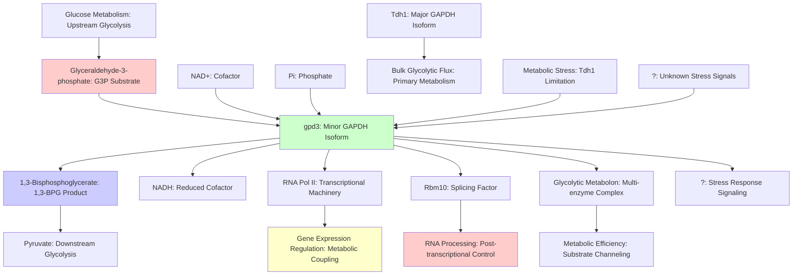

# Pathway Summary for gpd3

## Overview

gpd3 encodes the minor isoform of glyceraldehyde-3-phosphate dehydrogenase in S. pombe, catalyzing the reversible NAD+-dependent oxidation of glyceraldehyde-3-phosphate to 1,3-bisphosphoglycerate in glycolysis. While its paralog Tdh1 handles the bulk of glycolytic flux, Gpd3 shows evidence of moonlighting functions including stress response signaling, transcriptional regulation through RNA polymerase II interaction, and RNA processing via splicing factor association [PMID:15620689, PMID:18406331]. The protein is extensively post-translationally modified and functions within a stable glycolytic metabolon, providing both metabolic backup and specialized regulatory functions.

## Glycolytic Pathway Function

The primary pathway role of gpd3 is in glycolysis, where it catalyzes the sixth step of the pathway - the NAD+-dependent phosphorylating oxidation of glyceraldehyde-3-phosphate to 1,3-bisphosphoglycerate. This reaction is energetically coupled to NADH production and represents a key regulatory point in glycolysis. While Gpd3 normally serves as a minor contributor to total GAPDH activity, it becomes essential when the major isoform Tdh1 is absent or inactivated, demonstrating functional redundancy within the glycolytic system [PMID:18406331]. The enzyme also functions in the reverse direction during gluconeogenesis, converting 1,3-bisphosphoglycerate back to glyceraldehyde-3-phosphate.

## Glycolytic Metabolon Assembly

Gpd3 participates in the formation of glycolytic metabolons - multi-enzyme complexes that organize consecutive glycolytic enzymes for efficient metabolic flux. The protein shows high-confidence interactions with other glycolytic enzymes, forming a stable complex that facilitates substrate channeling and metabolic efficiency. This organization allows for coordinated regulation of glycolytic flux and enables rapid responses to changing cellular energy demands. The metabolon structure also provides a platform for integrating glycolytic activity with other cellular processes through protein-protein interactions.

## RNA Polymerase II Interaction Network

Beyond its metabolic function, Gpd3 exhibits moonlighting activity through its interaction with RNA polymerase II, specifically with the Rpb7 subunit [PMID:15620689]. This interaction suggests that Gpd3 may play a role in transcriptional regulation, potentially linking cellular metabolic status to gene expression programs. The association with RNA Pol II could allow Gpd3 to influence transcription of specific genes or to couple transcriptional activity with glycolytic flux. This moonlighting function represents an important regulatory mechanism that integrates metabolism with gene expression.

## Splicing Factor Association and RNA Processing

Gpd3 shows interactions with RNA processing factors, including co-purification with the splicing factor Rbm10. This association suggests a potential role in RNA metabolism and splicing regulation, expanding the protein's function beyond traditional glycolytic activity. The connection to RNA processing could provide a mechanism for post-transcriptional regulation that responds to metabolic conditions, allowing cells to coordinate RNA maturation with cellular energy status.

## Pathway Diagram

## Integration with Stress Response Pathways

Evidence from the paralogous Tdh1 suggests that GAPDH enzymes can participate in oxidative stress response signaling through multistep phosphorelay to MAPK cascades [PMID:18406331]. While this function has not been directly demonstrated for Gpd3, the sequence similarity and shared enzymatic properties suggest it may have similar stress-sensing capabilities. This potential role would position Gpd3 as a metabolic sensor that can transmit stress signals to downstream regulatory pathways, linking cellular energy status with stress response activation.

## Metabolic Flexibility and Backup Function

Gpd3 provides metabolic flexibility by serving as a backup to the major GAPDH isoform Tdh1. This redundancy ensures continued glycolytic flux when Tdh1 activity is compromised by stress, post-translational modifications, or other regulatory mechanisms. The differential regulation and moonlighting functions of the two GAPDH isoforms allow for specialized responses to different cellular conditions while maintaining core metabolic activity. This functional specialization represents an important evolutionary adaptation for metabolic resilience.

## Post-translational Modification Networks

GAPDH enzymes, including Gpd3, are subject to extensive post-translational modifications that can modulate their activity, localization, and protein interactions. These modifications may regulate the balance between metabolic function and moonlighting activities, allowing cells to fine-tune the protein's diverse roles based on cellular conditions. The modification networks provide additional layers of regulation that extend beyond simple transcriptional control.

## Evolutionary Significance and Moonlighting Evolution

The evolution of moonlighting functions in GAPDH enzymes represents an important example of how metabolic enzymes can acquire additional cellular roles while maintaining their core catalytic function. The diversification of GAPDH isoforms in S. pombe (Gpd3 and Tdh1) may reflect evolutionary pressure to separate core metabolic functions from regulatory moonlighting activities. This functional specialization allows for more sophisticated cellular regulation while preserving essential metabolic capacity.

## Research Implications and Future Directions

Understanding the multiple functions of Gpd3 has important implications for metabolic regulation, gene expression control, and stress response mechanisms. The protein serves as a model for studying how metabolic enzymes can integrate multiple cellular processes through protein-protein interactions. Further research is needed to fully characterize the moonlighting functions and to determine how these activities are regulated in response to cellular conditions. The complex regulatory networks involving Gpd3 highlight the sophisticated mechanisms by which cells coordinate metabolism with other essential cellular processes.