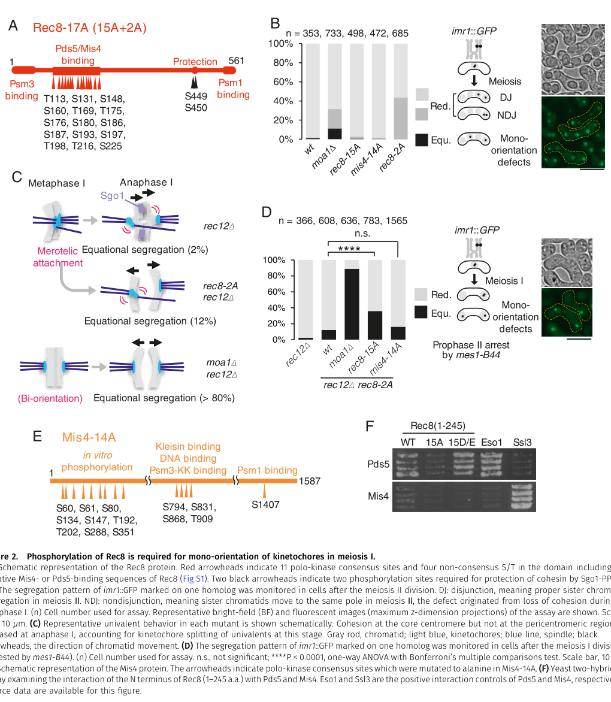

## Question

# Gene Research for Functional Annotation

## ⚠️ CRITICAL: Gene/Protein Identification Context

**BEFORE YOU BEGIN RESEARCH:** You MUST verify you are researching the CORRECT gene/protein. Gene symbols can be ambiguous, especially for less well-characterized genes from non-model organisms.

### Target Gene/Protein Identity (from UniProt):
- **UniProt Accession:** P50528
- **Protein Description:** RecName: Full=Serine/threonine-protein kinase plo1; EC=2.7.11.21 {ECO:0000250|UniProtKB:P32562}; AltName: Full=Polo kinase plo1 {ECO:0000312|PomBase:SPAC23C11.16};
- **Gene Information:** Name=plo1 {ECO:0000312|PomBase:SPAC23C11.16}; ORFNames=SPAC23C11.16 {ECO:0000312|PomBase:SPAC23C11.16};
- **Organism (full):** Schizosaccharomyces pombe (strain 972 / ATCC 24843) (Fission yeast).
- **Protein Family:** Belongs to the protein kinase superfamily. Ser/Thr protein
- **Key Domains:** Kinase-like_dom_sf. (IPR011009); POLO_box_1. (IPR033701); POLO_box_2. (IPR033695); POLO_box_dom. (IPR000959); POLO_box_dom_sf. (IPR036947)

### MANDATORY VERIFICATION STEPS:

1. **Check if the gene symbol "plo1" matches the protein description above**
2. **Verify the organism is correct:** Schizosaccharomyces pombe (strain 972 / ATCC 24843) (Fission yeast).
3. **Check if protein family/domains align with what you find in literature**
4. **If you find literature for a DIFFERENT gene with the same or similar symbol, STOP**

### If Gene Symbol is Ambiguous or You Cannot Find Relevant Literature:

**DO NOT PROCEED WITH RESEARCH ON A DIFFERENT GENE.** Instead:
- State clearly: "The gene symbol 'plo1' is ambiguous or literature is limited for this specific protein"
- Explain what you found (e.g., "Found extensive literature on a different gene with the same symbol in a different organism")
- Describe the protein based ONLY on the UniProt information provided above
- Suggest that the protein function can be inferred from domain/family information

### Research Target:

Please provide a comprehensive research report on the gene **plo1** (gene ID: plo1, UniProt: P50528) in SCHPO.

The research report should be a detailed narrative explaining the function, biological processes, and localization of the gene product. Citations should be given for all claims.

You should prioritize authoritative reviews and primary scientific literature when conducting research. You can supplement
this with annotations you find in gene/protein databases, but these can be outdated or inaccurate.

We are specifically interested in the primary function of the gene - for enzymes, what reaction is catalyzed, and what is the substrate specificity? For transporters, what is the substrate? For structural proteins or adapters, what is the broader structural role? For signaling molecules, what is the role in the pathway.

We are interested in where in or outside the cell the gene product carries out its function.

We are also interested in the signaling or biochemical pathways in which the gene functions. We are less interested in broad pleiotropic effects, except where these elucidate the precise role.

Include evidence where possible. We are interested in both experimental evidence as well as inference from structure, evolution, or bioinformatic analysis. Precise studies should be prioritized over high-throughput, where available.

## Output

Question: You are an expert researcher providing comprehensive, well-cited information.

Provide detailed information focusing on:
1. Key concepts and definitions with current understanding
2. Recent developments and latest research (prioritize 2023-2024 sources)
3. Current applications and real-world implementations
4. Expert opinions and analysis from authoritative sources
5. Relevant statistics and data from recent studies

Format as a comprehensive research report with proper citations. Include URLs and publication dates where available.
Always prioritize recent, authoritative sources and provide specific citations for all major claims.

# Gene Research for Functional Annotation

## ⚠️ CRITICAL: Gene/Protein Identification Context

**BEFORE YOU BEGIN RESEARCH:** You MUST verify you are researching the CORRECT gene/protein. Gene symbols can be ambiguous, especially for less well-characterized genes from non-model organisms.

### Target Gene/Protein Identity (from UniProt):
- **UniProt Accession:** P50528
- **Protein Description:** RecName: Full=Serine/threonine-protein kinase plo1; EC=2.7.11.21 {ECO:0000250|UniProtKB:P32562}; AltName: Full=Polo kinase plo1 {ECO:0000312|PomBase:SPAC23C11.16};
- **Gene Information:** Name=plo1 {ECO:0000312|PomBase:SPAC23C11.16}; ORFNames=SPAC23C11.16 {ECO:0000312|PomBase:SPAC23C11.16};
- **Organism (full):** Schizosaccharomyces pombe (strain 972 / ATCC 24843) (Fission yeast).
- **Protein Family:** Belongs to the protein kinase superfamily. Ser/Thr protein
- **Key Domains:** Kinase-like_dom_sf. (IPR011009); POLO_box_1. (IPR033701); POLO_box_2. (IPR033695); POLO_box_dom. (IPR000959); POLO_box_dom_sf. (IPR036947)

### MANDATORY VERIFICATION STEPS:

1. **Check if the gene symbol "plo1" matches the protein description above**
2. **Verify the organism is correct:** Schizosaccharomyces pombe (strain 972 / ATCC 24843) (Fission yeast).
3. **Check if protein family/domains align with what you find in literature**
4. **If you find literature for a DIFFERENT gene with the same or similar symbol, STOP**

### If Gene Symbol is Ambiguous or You Cannot Find Relevant Literature:

**DO NOT PROCEED WITH RESEARCH ON A DIFFERENT GENE.** Instead:
- State clearly: "The gene symbol 'plo1' is ambiguous or literature is limited for this specific protein"
- Explain what you found (e.g., "Found extensive literature on a different gene with the same symbol in a different organism")
- Describe the protein based ONLY on the UniProt information provided above
- Suggest that the protein function can be inferred from domain/family information

### Research Target:

Please provide a comprehensive research report on the gene **plo1** (gene ID: plo1, UniProt: P50528) in SCHPO.

The research report should be a detailed narrative explaining the function, biological processes, and localization of the gene product. Citations should be given for all claims.

You should prioritize authoritative reviews and primary scientific literature when conducting research. You can supplement
this with annotations you find in gene/protein databases, but these can be outdated or inaccurate.

We are specifically interested in the primary function of the gene - for enzymes, what reaction is catalyzed, and what is the substrate specificity? For transporters, what is the substrate? For structural proteins or adapters, what is the broader structural role? For signaling molecules, what is the role in the pathway.

We are interested in where in or outside the cell the gene product carries out its function.

We are also interested in the signaling or biochemical pathways in which the gene functions. We are less interested in broad pleiotropic effects, except where these elucidate the precise role.

Include evidence where possible. We are interested in both experimental evidence as well as inference from structure, evolution, or bioinformatic analysis. Precise studies should be prioritized over high-throughput, where available.

# Functional annotation report: *Schizosaccharomyces pombe plo1* (UniProt P50528)

## Executive summary

The requested protein is correctly identified. The gene **plo1** (ORF **SPAC23C11.16**) in *Schizosaccharomyces pombe* encodes Plo1, the fission-yeast Polo-family serine/threonine protein kinase—not a similarly named protein from another organism. The literature-derived identity, enzymatic class, and characteristic catalytic-domain/tandem-polo-box architecture agree with the supplied UniProt P50528 annotation. The tandem polo-box domain provides regulated localization and substrate recognition, while the kinase domain transfers phosphate from ATP to serine or threonine residues in protein substrates (grallert2013centrosomalmpftriggers pages 1-2, tanaka2001theroleof pages 1-2, bahler1998roleofpolo pages 2-2).

Plo1 is best understood as a **spatially targeted cell-division kinase**. Its primary biochemical function is protein phosphorylation rather than modification of one unique substrate. During vegetative growth, Plo1 acts principally at spindle pole bodies (SPBs), the mitotic spindle, and the medial cytokinetic apparatus. These pools coordinate mitotic commitment, localized nuclear-envelope breakdown and SPB insertion, bipolar-spindle assembly, division-site specification, actomyosin-ring assembly, and activation of the septation initiation network (SIN). In meiosis, kinetochore-associated Moa1 targets Plo1 to cohesin substrates at centromeres, where phosphorylation of Rec8 and Psm3 promotes sister-kinetochore mono-orientation in meiosis I (bahler1998roleofpolo pages 1-2, tanaka2001theroleof pages 1-2, liu2024phosphorylationofrec8 pages 1-2, bestul2021redistributionofcentrosomal pages 1-2).

## 1. Identity and molecular classification

### Verification

All target-specific papers retained for this report concern **Plo1 in fission yeast, *S. pombe***. Papers concerning budding-yeast Cdc5, metazoan PLK1–PLK5, or unrelated genes called PLO1 were not treated as direct evidence. Foundational *S. pombe* studies identify Plo1 as a conserved Polo-like Ser/Thr kinase required for bipolar-spindle formation, medial-ring organization, and septation; a later mechanistic study describes it as the sole identified Polo-like kinase in this organism (tanaka2001theroleof pages 1-2, bahler1998roleofpolo pages 2-2).

### Architecture and substrate specificity

Plo1 has the canonical Polo-kinase organization reflected in the supplied InterPro annotation: an N-terminal protein-kinase domain and a C-terminal polo-box domain comprising Polo boxes 1 and 2. The catalytic region recognizes protein Ser/Thr residues, whereas the polo-box domain controls docking to cellular structures and phosphoprotein substrates. Accordingly, Plo1 does not have the narrow small-molecule specificity expected of a metabolic enzyme: it phosphorylates multiple cell-cycle proteins, with specificity determined by a combination of sequence context, prior phosphorylation, docking interactions, and localization (grallert2013centrosomalmpftriggers pages 1-2).

The net reaction is:

**ATP + protein–Ser/Thr–OH → ADP + protein–Ser/Thr–OPO₃²⁻.**

Plo1-associated kinase activity against casein peaks during mitosis before septation. Analogue-sensitive **plo1.as8** experiments further establish that catalytic activity—not merely a scaffolding function—is needed for timely mitotic entry (grallert2013centrosomalmpftriggers pages 1-2, tanaka2001theroleof pages 1-2).

## 2. Localization and functional cycle

Plo1 localization is highly dynamic. During mitosis it accumulates at **SPBs**, associates with the **mitotic spindle**, and appears at the **medial actomyosin-ring region**. In meiosis, association with the meiosis-specific kinetochore factor Moa1 creates a functionally distinct centromeric pool. Thus, the sites where Plo1 acts are intracellular and predominantly associated with the microtubule-organizing center, spindle/kinetochore system, nuclear-envelope fenestra around the SPB, and medial cortex (bahler1998roleofpolo pages 1-2, liu2024phosphorylationofrec8 pages 1-2, bestul2021redistributionofcentrosomal pages 1-2).

The evidence-backed functional modules are summarized below.

| Functional module/location | Plo1 action or substrate | Evidence type | Key quantitative result | Confidence/caveat | Best source year and DOI URL |
|---|---|---|---|---|---|
| Identity / domain architecture | **S. pombe** plo1 encodes the organism’s Polo-family **Ser/Thr protein kinase**; conserved architecture is an N-terminal kinase domain plus C-terminal tandem polo boxes for phospho-dependent targeting/substrate recognition | Review + genetics + functional homology | Plo1 is described as the sole S. pombe Plk and required for spindle formation/cytokinesis; Polo-box architecture summarized as core feature of Plo1/Plks (tanaka2001theroleof pages 1-2, grallert2013centrosomalmpftriggers pages 1-2) | High confidence for identity/family; domain-function statement is family-level inference unless directly mapped in S. pombe structure studies | 2013, https://doi.org/10.1038/ncb2633 ; 2001, https://doi.org/10.1093/emboj/20.6.1259 |
| SPB / mitotic commitment | Plo1 activity at spindle pole bodies promotes mitotic commitment and morphogenetic switching; activated locally downstream of MPF/Cdk1 | Chemical genetics + cell biology | Inhibition of analogue-sensitive **plo1.as8** delayed histone H3 Ser10 phosphorylation/mitotic commitment by **~40 min** at **20 μM 3-BrB-PP1**; Plo1 recruitment to SPBs occurred **~30 min before mitosis** in wild type (grallert2013centrosomalmpftriggers pages 1-2) | Strong causal evidence for catalytic requirement, but histone H3 is used as a mitotic readout rather than a definitive direct Plo1 substrate in vivo | 2013, https://doi.org/10.1038/ncb2633 |
| SPB insertion / partial NEBD | Plo1 localizes near the centromere-linked SPB region and is required for maturation of the mitotic SPB ring, redistribution of Cut12/Kms2/Cut11, and complete partial NEBD for SPB insertion | Microscopy + chemical genetics | Upon acute Plo1 inhibition, **75.6%** of cells still formed Sad1 rings, but only **36%** were mature double rings versus **95–97%** in controls; controls re-entered mitosis within **30 min**, whereas inhibited **plo1.as8** cells arrested before entry (bestul2021redistributionofcentrosomal pages 9-10, bestul2021redistributionofcentrosomal pages 1-2) | High confidence for role in ring maturation/NEBD; paper explicitly states Plo1 is **not** required for initial Sad1 redistribution, only later maturation/completion | 2021, https://doi.org/10.1091/mbc.e21-05-0239 |
| Mid1 / contractile-ring positioning at cell middle | **Direct phosphorylation likely/partly established**: Plo1 promotes Mid1 nuclear export and cortical node/ring assembly, thereby positioning the division site and contractile ring | Genetics + microscopy + review | **190** cytokinesis nodes detected at the equator in early mitosis by later super-resolution work summarized in review; **85%** of Blt1p-mEGFP in nodes incorporated into the ACR; plo1 mutants misplace rings and Plo1 overexpression drives premature Mid1 nuclear exit (rezig2023theroleof pages 3-5, bahler1998roleofpolo pages 1-2) | Strong for pathway role; foundational 1998 paper inferred Mid1 phosphorylation from mobility/localization genetics. Later reviews state Mid1 is a direct target, but the strongest direct biochemical details are not all in the retrieved primary-text contexts | 2023, https://doi.org/10.1080/15384101.2022.2147655 ; 1998, https://doi.org/10.1083/jcb.143.6.1603 |
| SIN / septation pathway | Plo1 acts **upstream of SIN** to trigger septation; overexpression can induce ectopic septation and activated Spg1 can bypass some Plo1 septation defects | Genetics + kinase assay | Plo1-associated casein kinase activity peaked during mitosis before septation; **plo1.ts4** formed misshapen rings and rarely septated at **36°C**; activated Spg1 rescued plo1 septation defects but not **sid2** defects (tanaka2001theroleof pages 1-2) | High confidence for upstream SIN placement; direct SIN substrate(s) are not established in these contexts, so mechanistic edge remains partly inferential | 2001, https://doi.org/10.1093/emboj/20.6.1259 |
| Meiosis / centromere-localized Moa1-Plo1 control of cohesin | **Direct phosphorylation shown**: Moa1-associated Plo1 phosphorylates Rec8 and Psm3 to promote sister-kinetochore mono-orientation at core centromeres | Direct biochemistry + genetics + structure-guided mutagenesis | Rec8 carries **11** Polo-consensus + **4** non-consensus S/T sites in the relevant domain phosphorylated by Plo1 in vitro; non-phosphorylatable **rec8-15A** raised equational segregation to **36%** in **rec12Δ rec8-2A** versus **<2%** in rec12Δ rec8-2A and **>80%** in moa1Δ rec12Δ rec8-2A backgrounds; **psm3-2A** caused **20%** mono-orientation defects vs **12%** WT; **psm3-S110A** caused **50%** defects vs **12%** WT; phosphomimetic **psm3-ED** caused **>70%** equational segregation and loss of meiotic Rec8 localization (liu2024phosphorylationofrec8 pages 1-2, liu2024phosphorylationofrec8 pages 2-4, liu2024phosphorylationofrec8 pages 4-5, liu2024phosphorylationofrec8 pages 5-7, liu2024phosphorylationofrec8 media aca8da9a) | Very high confidence for direct phosphorylation of Rec8/Psm3 in meiosis I regulation; authors note some site-by-site mechanistic details still need finer dissection, especially for Mis4 contributions | 2024, https://doi.org/10.26508/lsa.202302556 |
| Global phosphoregulation / substrate discovery context | Cell-cycle phosphoproteomics places Plo1 within a broad phosphorylation network and provides candidate substrate timing, but does not by itself prove direct substrates | Quantitative phosphoproteomics | **10,095** phosphosites quantified overall; **7,298** high-localization sites retained; **47.1%** changed at least **2-fold** through the cell cycle; **976** sites showed classifiable periodic patterns (swaffer2018quantitativephosphoproteomicsreveals pages 3-5) | Useful for hypothesis generation and timing, but substrate assignment to Plo1 requires orthogonal genetics/biochemistry | 2018, https://doi.org/10.1016/j.celrep.2018.06.036 |

*Table: This table organizes the strongest evidence for S. pombe Plo1/P50528 by functional module, separating direct phosphorylation evidence from genetic and localization inference. It is useful for quickly identifying which functions are firmly established, which are mechanistically resolved, and where caveats remain.*

## 3. Mitotic commitment and morphogenetic control at the SPB

A key conceptual advance was the demonstration that Plo1 activity is regulated locally at the SPB rather than simply rising uniformly throughout the cell. Local mitosis-promoting factor—Cdc2/Cdk1–cyclin B—activity at G2 SPBs promotes Plo1 activity before global mitotic commitment. Plo1 recruitment was detectable approximately **30 minutes before mitosis**, and acute inhibition of analogue-sensitive Plo1 with **20 μM 3-BrB-PP1** delayed the mitotic phosphorylation readout, histone H3 Ser10 phosphorylation, by approximately **40 minutes**. Histone H3 phosphorylation in this experiment is best interpreted as a mitotic-state readout, not proof that histone H3 is a direct physiological Plo1 substrate (grallert2013centrosomalmpftriggers pages 1-2).

Artificial localization experiments supported causality: promoting MPF or Polo activity at interphase SPBs advanced mitotic and morphogenetic transitions. Both activities were required for new-end take-off (NETO), the G2 transition from monopolar to bipolar tip growth, and MPF-induced NETO required Plo1. Expert interpretation is therefore that the SPB functions as a signaling platform where localized Cdk1–Plo1 activity sets the timing of both mitotic commitment and a spatially remote change in polarized growth (grallert2013centrosomalmpftriggers pages 1-2).

## 4. Partial nuclear-envelope breakdown, SPB insertion, and spindle formation

Because *S. pombe* undergoes closed mitosis, its SPB begins on the cytoplasmic surface of the nuclear envelope and must be inserted through a localized nuclear-envelope fenestra so that spindle microtubules can contact chromosomes. High-resolution structured-illumination microscopy showed that Sad1 and other SPB/nuclear-envelope proteins form mitotic rings around the SPB before localized nuclear-envelope breakdown. Plo1 localizes to the centromere-linked SPB region and is required for redistribution or maturation of Kms2, Cut12, and Cut11-containing structures and for completion of nuclear-envelope breakdown that permits SPB insertion (bestul2021redistributionofcentrosomal pages 1-2).

The requirement is stage-specific rather than absolute for initial Sad1 movement. Under acute Plo1 inhibition, **75.6%** of cells still reorganized Sad1 into a ring, but only **36%** formed mature double rings, compared with **95–97%** of controls. Controls resumed mitosis within **30 minutes**, whereas inhibited **plo1.as8** cells failed to enter. These results support a model in which centromere–SPB linkage initiates Sad1 redistribution, followed by Plo1-dependent ring maturation, localized envelope opening, SPB insertion, and bipolar-spindle formation (bestul2021redistributionofcentrosomal pages 9-10, bestul2021redistributionofcentrosomal pages 5-6).

This refines older descriptions that simply classified Plo1 as required for spindle formation: Plo1 is not only a spindle kinase but an organizer of the SPB–nuclear-envelope transition that makes intranuclear spindle assembly possible (bahler1998roleofpolo pages 2-2, bestul2021redistributionofcentrosomal pages 1-2).

## 5. Division-site positioning and actomyosin-ring assembly

Plo1 coordinates cytokinesis with mitosis through the anillin-like scaffold Mid1. Foundational experiments showed that **plo1** temperature-sensitive mutants phenocopy key **mid1** defects: contractile-ring assembly frequently begins away from the cell middle, and medial rings and septa are defective. Plo1 is required for Mid1 to leave the nucleus and form a medial cortical band/ring. Conversely, Plo1 overexpression causes premature Mid1 nuclear exit, a mobility shift consistent with hyperphosphorylation, and ectopic septation in interphase (bahler1998roleofpolo pages 1-2, bahler1998roleofpolo pages 2-2).

The current model is that Plo1-dependent phosphorylation promotes Mid1 nuclear export and availability at the medial cortex, where Mid1 scaffolds type-I nodes. These combine with type-II nodes and recruit myosin-II, Cdc15, Rng2, and the formin Cdc12; node condensation then produces the actomyosin contractile ring. Recent reviews describe Mid1 as a Plo1 substrate, but an evidence distinction is important: the 1998 work established pathway order, interaction, altered phosphorylation state, and localization dependence more firmly than it established individual direct phosphorylation events (bahler1998roleofpolo pages 1-2, rezig2023theroleof pages 3-5).

Modern imaging has revised the quantitative description of this machinery. A 2023 review reports approximately **190 cytokinesis nodes** at the equator in early mitosis, with about **85% of Blt1-mEGFP** in nodes incorporated into the ring. These numbers describe the downstream assembly system rather than Plo1 stoichiometry, but they provide current cellular context for the structure that Plo1 helps initiate through Mid1 (rezig2023theroleof pages 3-5).

## 6. Septation initiation network

Plo1 also controls the temporal arm of cytokinesis through the Hippo-related **septation initiation network**. Plo1-associated kinase activity peaks before septation; loss-of-function cells fail to septate, whereas overexpression can induce ectopic septa. At **36°C**, **plo1.ts4** cells formed misshapen actin rings but rarely septated. Forced activation of the upstream SIN GTPase Spg1 bypassed the septation defect of **plo1.ts4**, whereas it did not bypass loss of the terminal SIN kinase Sid2. This genetic epistasis places Plo1 upstream of SIN execution rather than downstream of Sid2 (tanaka2001theroleof pages 1-2).

Accordingly, Plo1 coordinates two separable cytokinetic problems: Mid1 regulation helps specify **where** the ring forms, while SIN activation helps determine **when** ring constriction and septation proceed. The exact direct Plo1 substrate that accounts for SIN activation is less firmly established by the retrieved evidence than the pathway position itself. It should therefore be annotated as a strongly supported regulatory role with partially unresolved biochemical edges, not as a single proven Plo1→SIN-substrate reaction (tanaka2001theroleof pages 1-2).

## 7. Recent development: direct meiotic cohesin substrates

The strongest target-specific development from 2023–2024 is the 2024 Life Science Alliance study by Liu and colleagues, submitted in December 2023 and published online **6 March 2024**. It showed that the meiotic kinetochore protein Moa1 associates with Plo1 and directs phosphorylation of cohesin components needed for sister-kinetochore mono-orientation. Previous work had established Plo1 phosphorylation of **Rec8-S450** in cohesion protection; the 2024 study expanded the mechanism to core-centromere cohesion and mono-orientation (liu2024phosphorylationofrec8 pages 1-2).

### Rec8

Within Rec8 residues 111–225, corresponding to a proposed Mis4/Pds5-binding surface, investigators identified **11 Polo-consensus sites and four non-consensus Ser/Thr sites** phosphorylated by Plo1 in vitro, with some also detected in vivo. Conversion of all 15 residues to alanine reduced Rec8–Pds5 interaction relative to wild type, whereas phosphomimetic Rec8-15D/E retained robust interaction. In a sensitized **rec12Δ rec8-2A** background, **rec8-15A** increased equational segregation to **36%**, compared with **12%** for rec12Δ rec8-2A alone and more than **80%** after loss of Moa1. This supports, but does not by itself prove at single-site resolution, a model in which Moa1–Plo1 phosphorylation promotes conversion toward a Pds5-associated cohesin state and core-centromere cohesion (liu2024phosphorylationofrec8 pages 2-4, liu2024phosphorylationofrec8 media aca8da9a).

### Psm3

Direct in-vitro assays identified **Psm3-T182 and Psm3-S1001** at the Rec8–Psm3 entry/exit gate and **Psm3-S110** adjacent to the K105/K106 acetylation loop. Non-phosphorylatable **psm3-2A** produced mono-orientation defects in **20%** of cells versus **12%** in wild type. The **S110A** mutation produced approximately **50%** defects, while combined phosphomimetic T182E/S1001D caused equational segregation in more than **70%** of cells and destabilized meiotic Rec8 localization. Both S110A and S110D were defective, suggesting that phosphorylation at this site must be transient rather than constitutive (liu2024phosphorylationofrec8 pages 4-5).

Combined Rec8 and Psm3 non-phosphorylatable mutations were more severe than either class alone, and deleting the cohesin-release factor **wpl1** suppressed defects associated with Psm3-site mutants. The authors therefore propose that Moa1-localized Plo1 phosphorylates multiple surfaces around the Rec8–Psm3 gate to tune cohesin establishment/release at the core centromere. This is direct biochemical and genetic evidence, although the relative contribution and in-vivo occupancy of every Rec8 site remain unresolved (liu2024phosphorylationofrec8 pages 5-7).

## 8. Systems-level evidence and current applications

High-resolution fission-yeast phosphoproteomics quantified **10,095 phosphosites**, retaining **7,298 sites on 1,578 proteins** at localization probability greater than 0.9. Of these, **3,439/7,298 (47.1%)** changed at least twofold through the cell cycle, and 976 sites could be assigned to periodic clusters. These datasets are valuable for discovering candidate Plo1 substrates and ordering kinase activity, but temporal covariance or a Polo consensus motif alone does not prove direct phosphorylation (swaffer2018quantitativephosphoproteomicsreveals pages 3-5).

Plo1 itself has no clinical or industrial implementation comparable to human PLK1 inhibitors. Its principal real-world application is as an experimentally tractable model for conserved Polo-kinase biology. Analogue-sensitive alleles permit minute-scale inhibition; temperature-sensitive alleles separate spindle, ring, and septation phenotypes; and super-resolution microscopy resolves SPB-envelope remodeling. This system has yielded mechanistic principles relevant to centrosome-driven mitotic entry, localized nuclear-envelope breakdown, anillin-regulated cytokinesis, Hippo-related cytokinetic signaling, and meiotic kinetochore organization (grallert2013centrosomalmpftriggers pages 1-2, bestul2021redistributionofcentrosomal pages 9-10, bestul2021redistributionofcentrosomal pages 1-2).

## 9. Confidence assessment and unresolved questions

**Highest-confidence direct functions** are ATP-dependent Ser/Thr phosphorylation, the catalytic requirement for mitotic commitment, Plo1-dependent maturation of SPB-envelope structures, and Moa1-directed phosphorylation of Rec8/Psm3 in meiosis. The quantitative chemical-genetic, microscopy, in-vitro kinase, and phosphosite-mutant evidence is mutually reinforcing (grallert2013centrosomalmpftriggers pages 1-2, liu2024phosphorylationofrec8 pages 4-5, bestul2021redistributionofcentrosomal pages 9-10).

**Strong pathway-level functions with less complete substrate resolution** include Mid1-dependent division-site positioning and activation of the SIN. Genetics and localization clearly place Plo1 in these pathways, but not every causal phosphorylation site or immediate SIN substrate has been established in the retrieved primary evidence (bahler1998roleofpolo pages 1-2, tanaka2001theroleof pages 1-2).

The principal open questions are how individual polo-box interactions partition Plo1 among SPB, spindle, kinetochore, and medial-ring pools; which direct substrates execute SPB insertion and SIN activation; and how multisite phosphorylation of Rec8/Psm3 is timed and reversed in vivo. Recent 2024 work substantially advances the meiotic substrate map, whereas the core mitotic model still depends heavily on foundational studies supplemented by newer imaging and systems-level data.

## Key references

- Liu Y. et al. **“Phosphorylation of Rec8 cohesin complexes regulates mono-orientation of kinetochores in meiosis I.”** *Life Science Alliance* 7, e202302556. Published online 6 March 2024. https://doi.org/10.26508/lsa.202302556 (liu2024phosphorylationofrec8 pages 1-2)
- Rezig I.M. et al. **“Processes Controlling the Contractile Ring during Cytokinesis in Fission Yeast, Including the Role of ESCRT Proteins.”** *Journal of Fungi* 10, 154. February 2024. https://doi.org/10.3390/jof10020154 (rezig2024processescontrollingthe pages 2-4)
- Rezig I.M. et al. **“The role of anillin/Mid1p during medial division and cytokinesis: from fission yeast to cancer cells.”** *Cell Cycle* 22, 633–644. 2023. https://doi.org/10.1080/15384101.2022.2147655 (rezig2023theroleof pages 3-5)
- Bestul A.J. et al. **“Redistribution of centrosomal proteins by centromeres and Polo kinase controls partial nuclear envelope breakdown in fission yeast.”** *Molecular Biology of the Cell* 32, 1487–1500. 1 August 2021. https://doi.org/10.1091/mbc.E21-05-0239 (bestul2021redistributionofcentrosomal pages 1-2)
- Swaffer M.P. et al. **“Quantitative Phosphoproteomics Reveals the Signaling Dynamics of Cell-Cycle Kinases in the Fission Yeast Schizosaccharomyces pombe.”** *Cell Reports* 24, 503–514. 10 July 2018. https://doi.org/10.1016/j.celrep.2018.06.036 (swaffer2018quantitativephosphoproteomicsreveals pages 3-5)
- Grallert A. et al. **“Centrosomal MPF triggers the mitotic and morphogenetic switches of fission yeast.”** *Nature Cell Biology* 15, 88–95. 2013. https://doi.org/10.1038/ncb2633 (grallert2013centrosomalmpftriggers pages 1-2)
- Tanaka K. et al. **“The role of Plo1 kinase in mitotic commitment and septation in Schizosaccharomyces pombe.”** *EMBO Journal* 20, 1259–1270. March 2001. https://doi.org/10.1093/emboj/20.6.1259 (tanaka2001theroleof pages 1-2)
- Bähler J. et al. **“Role of Polo Kinase and Mid1p in Determining the Site of Cell Division in Fission Yeast.”** *Journal of Cell Biology* 143, 1603–1616. December 1998. https://doi.org/10.1083/jcb.143.6.1603 (bahler1998roleofpolo pages 1-2)

References

1. (grallert2013centrosomalmpftriggers pages 1-2): Agnes Grallert, Avinash Patel, Victor A. Tallada, Kuan Yoow Chan, Steven Bagley, Andrea Krapp, Viesturs Simanis, and Iain M. Hagan. Centrosomal mpf triggers the mitotic and morphogenetic switches of fission yeast. Dec 2013. URL: https://doi.org/10.1038/ncb2633, doi:10.1038/ncb2633. This article has 98 citations and is from a highest quality peer-reviewed journal.

2. (tanaka2001theroleof pages 1-2): Kayoko Tanaka, Janni Petersen, Fiona MacIver, Daniel P. Mulvihill, David M. Glover, and Iain M. Hagan. The role of plo1 kinase in mitotic commitment and septation in schizosaccharomyces pombe. The EMBO Journal, 20:1259-1270, Mar 2001. URL: https://doi.org/10.1093/emboj/20.6.1259, doi:10.1093/emboj/20.6.1259. This article has 187 citations.

3. (bahler1998roleofpolo pages 2-2): Jürg Bähler, Alexander B. Steever, Sally Wheatley, Yu-li Wang, John R. Pringle, Kathleen L. Gould, and Dannel McCollum. Role of polo kinase and mid1p in determining the site of cell division in fission yeast. The Journal of Cell Biology, 143:1603-1616, Dec 1998. URL: https://doi.org/10.1083/jcb.143.6.1603, doi:10.1083/jcb.143.6.1603. This article has 396 citations.

4. (bahler1998roleofpolo pages 1-2): Jürg Bähler, Alexander B. Steever, Sally Wheatley, Yu-li Wang, John R. Pringle, Kathleen L. Gould, and Dannel McCollum. Role of polo kinase and mid1p in determining the site of cell division in fission yeast. The Journal of Cell Biology, 143:1603-1616, Dec 1998. URL: https://doi.org/10.1083/jcb.143.6.1603, doi:10.1083/jcb.143.6.1603. This article has 396 citations.

5. (liu2024phosphorylationofrec8 pages 1-2): Yu Liu, Yu Min, Yongxin Liu, and Yoshinori Watanabe. Phosphorylation of rec8 cohesin complexes regulates mono-orientation of kinetochores in meiosis i. Life Science Alliance, 7:e202302556, Mar 2024. URL: https://doi.org/10.26508/lsa.202302556, doi:10.26508/lsa.202302556. This article has 6 citations and is from a peer-reviewed journal.

6. (bestul2021redistributionofcentrosomal pages 1-2): Andrew J. Bestul, Zulin Yu, Jay R. Unruh, and Sue L. Jaspersen. Redistribution of centrosomal proteins by centromeres and polo kinase controls partial nuclear envelope breakdown in fission yeast. Aug 2021. URL: https://doi.org/10.1091/mbc.e21-05-0239, doi:10.1091/mbc.e21-05-0239. This article has 15 citations and is from a domain leading peer-reviewed journal.

7. (bestul2021redistributionofcentrosomal pages 9-10): Andrew J. Bestul, Zulin Yu, Jay R. Unruh, and Sue L. Jaspersen. Redistribution of centrosomal proteins by centromeres and polo kinase controls partial nuclear envelope breakdown in fission yeast. Aug 2021. URL: https://doi.org/10.1091/mbc.e21-05-0239, doi:10.1091/mbc.e21-05-0239. This article has 15 citations and is from a domain leading peer-reviewed journal.

8. (rezig2023theroleof pages 3-5): Imane M. Rezig, Wandiahyel G. Yaduma, Gwyn W. Gould, and Christopher J. McInerny. The role of anillin/mid1p during medial division and cytokinesis: from fission yeast to cancer cells. Cell Cycle, 22:633-644, Nov 2023. URL: https://doi.org/10.1080/15384101.2022.2147655, doi:10.1080/15384101.2022.2147655. This article has 11 citations and is from a peer-reviewed journal.

9. (liu2024phosphorylationofrec8 pages 2-4): Yu Liu, Yu Min, Yongxin Liu, and Yoshinori Watanabe. Phosphorylation of rec8 cohesin complexes regulates mono-orientation of kinetochores in meiosis i. Life Science Alliance, 7:e202302556, Mar 2024. URL: https://doi.org/10.26508/lsa.202302556, doi:10.26508/lsa.202302556. This article has 6 citations and is from a peer-reviewed journal.

10. (liu2024phosphorylationofrec8 pages 4-5): Yu Liu, Yu Min, Yongxin Liu, and Yoshinori Watanabe. Phosphorylation of rec8 cohesin complexes regulates mono-orientation of kinetochores in meiosis i. Life Science Alliance, 7:e202302556, Mar 2024. URL: https://doi.org/10.26508/lsa.202302556, doi:10.26508/lsa.202302556. This article has 6 citations and is from a peer-reviewed journal.

11. (liu2024phosphorylationofrec8 pages 5-7): Yu Liu, Yu Min, Yongxin Liu, and Yoshinori Watanabe. Phosphorylation of rec8 cohesin complexes regulates mono-orientation of kinetochores in meiosis i. Life Science Alliance, 7:e202302556, Mar 2024. URL: https://doi.org/10.26508/lsa.202302556, doi:10.26508/lsa.202302556. This article has 6 citations and is from a peer-reviewed journal.

12. (liu2024phosphorylationofrec8 media aca8da9a): Yu Liu, Yu Min, Yongxin Liu, and Yoshinori Watanabe. Phosphorylation of rec8 cohesin complexes regulates mono-orientation of kinetochores in meiosis i. Life Science Alliance, 7:e202302556, Mar 2024. URL: https://doi.org/10.26508/lsa.202302556, doi:10.26508/lsa.202302556. This article has 6 citations and is from a peer-reviewed journal.

13. (swaffer2018quantitativephosphoproteomicsreveals pages 3-5): Matthew P. Swaffer, Andrew W. Jones, Helen R. Flynn, Ambrosius P. Snijders, and Paul Nurse. Quantitative phosphoproteomics reveals the signaling dynamics of cell-cycle kinases in the fission yeast schizosaccharomyces pombe. Cell Reports, 24:503-514, Jul 2018. URL: https://doi.org/10.1016/j.celrep.2018.06.036, doi:10.1016/j.celrep.2018.06.036. This article has 96 citations and is from a highest quality peer-reviewed journal.

14. (bestul2021redistributionofcentrosomal pages 5-6): Andrew J. Bestul, Zulin Yu, Jay R. Unruh, and Sue L. Jaspersen. Redistribution of centrosomal proteins by centromeres and polo kinase controls partial nuclear envelope breakdown in fission yeast. Aug 2021. URL: https://doi.org/10.1091/mbc.e21-05-0239, doi:10.1091/mbc.e21-05-0239. This article has 15 citations and is from a domain leading peer-reviewed journal.

15. (rezig2024processescontrollingthe pages 2-4): Imane M. Rezig, Wandiahyel G. Yaduma, and Christopher J. McInerny. Processes controlling the contractile ring during cytokinesis in fission yeast, including the role of escrt proteins. Journal of Fungi, 10:154, Feb 2024. URL: https://doi.org/10.3390/jof10020154, doi:10.3390/jof10020154. This article has 2 citations.

## Artifacts

- [Edison artifact artifact-00](plo1-deep-research-falcon_artifacts/artifact-00.md)

## Citations

1. grallert2013centrosomalmpftriggers pages 1-2
2. tanaka2001theroleof pages 1-2
3. swaffer2018quantitativephosphoproteomicsreveals pages 3-5
4. bestul2021redistributionofcentrosomal pages 1-2
5. rezig2023theroleof pages 3-5
6. rezig2024processescontrollingthe pages 2-4
7. bahler1998roleofpolo pages 1-2
8. bahler1998roleofpolo pages 2-2
9. bestul2021redistributionofcentrosomal pages 9-10
10. bestul2021redistributionofcentrosomal pages 5-6
11. https://doi.org/10.1038/ncb2633
12. https://doi.org/10.1093/emboj/20.6.1259
13. https://doi.org/10.1091/mbc.e21-05-0239
14. https://doi.org/10.1080/15384101.2022.2147655
15. https://doi.org/10.1083/jcb.143.6.1603
16. https://doi.org/10.26508/lsa.202302556
17. https://doi.org/10.1016/j.celrep.2018.06.036
18. https://doi.org/10.3390/jof10020154
19. https://doi.org/10.1091/mbc.E21-05-0239
20. https://doi.org/10.1038/ncb2633,
21. https://doi.org/10.1093/emboj/20.6.1259,
22. https://doi.org/10.1083/jcb.143.6.1603,
23. https://doi.org/10.26508/lsa.202302556,
24. https://doi.org/10.1091/mbc.e21-05-0239,
25. https://doi.org/10.1080/15384101.2022.2147655,
26. https://doi.org/10.1016/j.celrep.2018.06.036,
27. https://doi.org/10.3390/jof10020154,