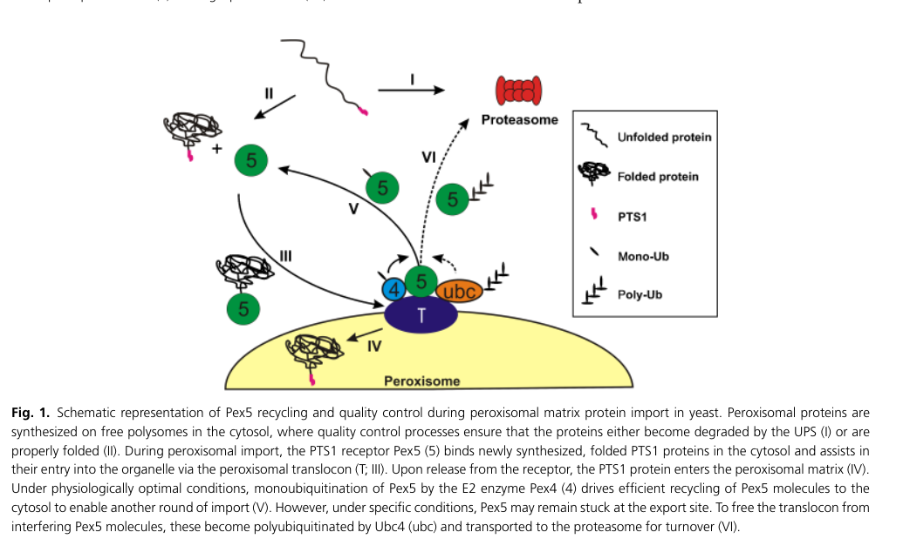

## Question

# Gene Research for Functional Annotation

## ⚠️ CRITICAL: Gene/Protein Identification Context

**BEFORE YOU BEGIN RESEARCH:** You MUST verify you are researching the CORRECT gene/protein. Gene symbols can be ambiguous, especially for less well-characterized genes from non-model organisms.

### Target Gene/Protein Identity (from UniProt):
- **UniProt Accession:** O14313
- **Protein Description:** RecName: Full=Peroxisomal membrane associated protein 20; AltName: Full=Peroxiredoxin homolog pmp20 {ECO:0000303|PubMed:20356456}; Short=Prx {ECO:0000303|PubMed:20356456};
- **Gene Information:** Name=pmp20 {ECO:0000303|PubMed:20356456}; ORFNames=SPCC330.06c {ECO:0000312|PomBase:SPCC330.06c};
- **Organism (full):** Schizosaccharomyces pombe (strain 972 / ATCC 24843) (Fission yeast).
- **Protein Family:** Belongs to the peroxiredoxin family. Prx5 subfamily.
- **Key Domains:** PRX5-like. (IPR037944); Redoxin. (IPR013740); Thioredoxin-like_sf. (IPR036249); Thioredoxin_domain. (IPR013766); Redoxin (PF08534)

### MANDATORY VERIFICATION STEPS:

1. **Check if the gene symbol "pmp20" matches the protein description above**
2. **Verify the organism is correct:** Schizosaccharomyces pombe (strain 972 / ATCC 24843) (Fission yeast).
3. **Check if protein family/domains align with what you find in literature**
4. **If you find literature for a DIFFERENT gene with the same or similar symbol, STOP**

### If Gene Symbol is Ambiguous or You Cannot Find Relevant Literature:

**DO NOT PROCEED WITH RESEARCH ON A DIFFERENT GENE.** Instead:
- State clearly: "The gene symbol 'pmp20' is ambiguous or literature is limited for this specific protein"
- Explain what you found (e.g., "Found extensive literature on a different gene with the same symbol in a different organism")
- Describe the protein based ONLY on the UniProt information provided above
- Suggest that the protein function can be inferred from domain/family information

### Research Target:

Please provide a comprehensive research report on the gene **pmp20** (gene ID: pmp20, UniProt: O14313) in SCHPO.

The research report should be a detailed narrative explaining the function, biological processes, and localization of the gene product. Citations should be given for all claims.

You should prioritize authoritative reviews and primary scientific literature when conducting research. You can supplement
this with annotations you find in gene/protein databases, but these can be outdated or inaccurate.

We are specifically interested in the primary function of the gene - for enzymes, what reaction is catalyzed, and what is the substrate specificity? For transporters, what is the substrate? For structural proteins or adapters, what is the broader structural role? For signaling molecules, what is the role in the pathway.

We are interested in where in or outside the cell the gene product carries out its function.

We are also interested in the signaling or biochemical pathways in which the gene functions. We are less interested in broad pleiotropic effects, except where these elucidate the precise role.

Include evidence where possible. We are interested in both experimental evidence as well as inference from structure, evolution, or bioinformatic analysis. Precise studies should be prioritized over high-throughput, where available.

## Output

Question: You are an expert researcher providing comprehensive, well-cited information.

Provide detailed information focusing on:
1. Key concepts and definitions with current understanding
2. Recent developments and latest research (prioritize 2023-2024 sources)
3. Current applications and real-world implementations
4. Expert opinions and analysis from authoritative sources
5. Relevant statistics and data from recent studies

Format as a comprehensive research report with proper citations. Include URLs and publication dates where available.
Always prioritize recent, authoritative sources and provide specific citations for all major claims.

# Gene Research for Functional Annotation

## ⚠️ CRITICAL: Gene/Protein Identification Context

**BEFORE YOU BEGIN RESEARCH:** You MUST verify you are researching the CORRECT gene/protein. Gene symbols can be ambiguous, especially for less well-characterized genes from non-model organisms.

### Target Gene/Protein Identity (from UniProt):
- **UniProt Accession:** O14313
- **Protein Description:** RecName: Full=Peroxisomal membrane associated protein 20; AltName: Full=Peroxiredoxin homolog pmp20 {ECO:0000303|PubMed:20356456}; Short=Prx {ECO:0000303|PubMed:20356456};
- **Gene Information:** Name=pmp20 {ECO:0000303|PubMed:20356456}; ORFNames=SPCC330.06c {ECO:0000312|PomBase:SPCC330.06c};
- **Organism (full):** Schizosaccharomyces pombe (strain 972 / ATCC 24843) (Fission yeast).
- **Protein Family:** Belongs to the peroxiredoxin family. Prx5 subfamily.
- **Key Domains:** PRX5-like. (IPR037944); Redoxin. (IPR013740); Thioredoxin-like_sf. (IPR036249); Thioredoxin_domain. (IPR013766); Redoxin (PF08534)

### MANDATORY VERIFICATION STEPS:

1. **Check if the gene symbol "pmp20" matches the protein description above**
2. **Verify the organism is correct:** Schizosaccharomyces pombe (strain 972 / ATCC 24843) (Fission yeast).
3. **Check if protein family/domains align with what you find in literature**
4. **If you find literature for a DIFFERENT gene with the same or similar symbol, STOP**

### If Gene Symbol is Ambiguous or You Cannot Find Relevant Literature:

**DO NOT PROCEED WITH RESEARCH ON A DIFFERENT GENE.** Instead:
- State clearly: "The gene symbol 'pmp20' is ambiguous or literature is limited for this specific protein"
- Explain what you found (e.g., "Found extensive literature on a different gene with the same symbol in a different organism")
- Describe the protein based ONLY on the UniProt information provided above
- Suggest that the protein function can be inferred from domain/family information

### Research Target:

Please provide a comprehensive research report on the gene **pmp20** (gene ID: pmp20, UniProt: O14313) in SCHPO.

The research report should be a detailed narrative explaining the function, biological processes, and localization of the gene product. Citations should be given for all claims.

You should prioritize authoritative reviews and primary scientific literature when conducting research. You can supplement
this with annotations you find in gene/protein databases, but these can be outdated or inaccurate.

We are specifically interested in the primary function of the gene - for enzymes, what reaction is catalyzed, and what is the substrate specificity? For transporters, what is the substrate? For structural proteins or adapters, what is the broader structural role? For signaling molecules, what is the role in the pathway.

We are interested in where in or outside the cell the gene product carries out its function.

We are also interested in the signaling or biochemical pathways in which the gene functions. We are less interested in broad pleiotropic effects, except where these elucidate the precise role.

Include evidence where possible. We are interested in both experimental evidence as well as inference from structure, evolution, or bioinformatic analysis. Precise studies should be prioritized over high-throughput, where available.

## Research Report: Functional Annotation of *Schizosaccharomyces pombe* **pmp20** (UniProt O14313)

### Executive summary
The *S. pombe* gene **pmp20** (UniProt **O14313**; ORF **SPCC330.06c**) encodes a **Prx5-subfamily peroxiredoxin (peroxiredoxin family; redoxin/thioredoxin-fold protein)** that is discussed in the yeast literature as a **peroxisomal reactive oxygen species (ROS) detoxification factor** and as a protein with **additional chaperone-like (“holdase”) activity** under heat stress. In the accessible literature corpus, the most direct *S. pombe* experimental claim is **in vitro inhibition of citrate synthase thermal aggregation at 43°C**, supporting a chaperone-like role in protein quality control. Broader biochemical mechanism (thiol-dependent peroxide reduction; likely preference for organic peroxides in some fungal homologs) and peroxisomal targeting logic are best supported by **orthology/structural homology to fungal PMP20/Ahp1 proteins** and by yeast peroxisome quality-control reviews. (manivannan2012theimpactof pages 2-3, beach2012integrationofperoxisomes pages 5-7, lee1999anewantioxidant pages 2-4)

### 1) Mandatory identity verification (disambiguation)
**Target confirmed:** the relevant “Pmp20” here is a fungal **peroxiredoxin-family** protein, not an unrelated peroxisomal membrane biogenesis protein.

* A foundational peroxiredoxin-family paper explicitly includes a **“Schizosaccharomyces pombe PMP20 homologue”** in an alignment of AhpC/TSA-related fungal proteins, supporting that the *S. pombe* protein belongs to the **peroxiredoxin/AhpC-TSA redoxin family** rather than an unrelated peroxisomal structural PMP. (Lee et al., 1999; published **1999-02-19**; https://doi.org/10.1074/jbc.274.8.4537) (lee1999anewantioxidant pages 2-4)
* Reviews discussing yeast peroxisomes and oxidative stress treat **Pmp20p in *S. pombe*** as a peroxisomal antioxidant/peroxiredoxin-like factor, consistent with UniProt’s Prx5-subfamily assignment. (Manivannan et al., 2012; published **2012-04-16**; https://doi.org/10.3389/fonc.2012.00050) (manivannan2012theimpactof pages 2-3)

### 2) Key concepts and definitions (current understanding)
#### 2.1 Peroxiredoxins (Prxs) and the Prx5 subfamily
Peroxiredoxins are **thiol-dependent, selenium- and heme-free peroxidases** that reduce peroxides using cysteine chemistry, typically coupled to cellular thiol electron-donor systems (thioredoxin, glutaredoxin, etc.). (lee1999anewantioxidant pages 1-2, chao2009characterizationofa pages 1-2)

Although the accessible *S. pombe*-specific texts do not provide catalytic constants for Pmp20, the family-level model is well established: a **peroxidatic cysteine** reacts with peroxide, then the enzyme is re-reduced by cellular thiols (often thioredoxin systems). (lee1999anewantioxidant pages 1-2, lee1999anewantioxidant pages 2-4)

#### 2.2 Peroxisomes as oxidative organelles and the need for antioxidant systems
Peroxisomes are organelles that harbor **H2O2-producing oxidases** and therefore require antioxidant capacity to prevent oxidative damage to proteins and membrane lipids. Reviews emphasize that peroxisomes produce significant ROS and integrate into aging/death pathways in yeast. (manivannan2012theimpactof pages 1-2, aksam2009preservingorganellevitality pages 1-2)

### 3) Gene product: function, reaction chemistry, and likely substrate preferences
#### 3.1 Primary biochemical role (best-supported interpretation)
The best-supported primary role for *S. pombe* Pmp20 is as a **peroxisomal peroxiredoxin-like peroxide detoxification enzyme** contributing to ROS homeostasis in the peroxisome. This is supported by multiple yeast peroxisome/aging reviews that group Pmp20p with peroxisomal ROS-scavenging enzymes and describe it as degrading hydrogen peroxide in peroxisomal antioxidant systems. (manivannan2012theimpactof pages 2-3, beach2012integrationofperoxisomes pages 5-7)

#### 3.2 Substrate specificity: evidence and inference
Direct substrate specificity for *S. pombe* Pmp20 was not found in accessible primary data. However:

* A closely related **yeast Ahp1p** (AhpC/TSA-related) is experimentally shown to be **specific for organic peroxides** (e.g., tert-butyl hydroperoxide) rather than H2O2, and its in vivo antioxidant function depends on the **thioredoxin system**. (Lee et al., 1999; **1999-02-19**; https://doi.org/10.1074/jbc.274.8.4537) (lee1999anewantioxidant pages 1-2, lee1999anewantioxidant pages 2-4)
* A yeast peroxisome quality-control review describes Pmp20 orthologs in methylotrophic yeasts as peroxisomal peroxiredoxins reacting with **alkyl hydroperoxides and H2O2**, including a statement that CbPmp20 shows **glutathione peroxidase activity**. (Aksam et al., 2009; **2009-09**; https://doi.org/10.1111/j.1567-1364.2009.00534.x) (aksam2009preservingorganellevitality pages 6-7)

Together, these data suggest that fungal “Pmp20/Ahp” family proteins can detoxify **organic and/or inorganic peroxides**, with the exact preference depending on the specific member and organism. For *S. pombe* Pmp20 (Prx5-like), organic hydroperoxides are a plausible physiological substrate class (inference from family), but this remains to be confirmed by *S. pombe*-specific enzymology. (lee1999anewantioxidant pages 2-4, aksam2009preservingorganellevitality pages 6-7)

### 4) Cellular localization and trafficking
#### 4.1 Peroxisomal localization
In the accessible literature, *S. pombe* Pmp20p is treated as **peroxisomal** in multiple yeast-focused reviews and models. (manivannan2012theimpactof pages 2-3, beach2012integrationofperoxisomes pages 5-7)

#### 4.2 Peroxisomal targeting logic (PTS1/Pex5) and how to interpret it for *S. pombe*
Peroxisomal matrix proteins are often imported via a **C-terminal peroxisomal targeting signal type 1 (PTS1)** recognized by the receptor **Pex5**, and a yeast peroxisome review includes a schematic of this pathway. (aksam2009preservingorganellevitality pages 2-3, aksam2009preservingorganellevitality media c5398a0b)

For Pmp20 orthologs in methylotrophic yeasts, the same review provides figure-based evidence of a conserved **PTS1 motif (-AKL-COOH)** in Pmp20 orthologs (alignment) and describes Pmp20 as a **PTS1 protein**. (aksam2009preservingorganellevitality pages 6-7, aksam2009preservingorganellevitality media c5398a0b)

Because UniProt describes *S. pombe* Pmp20 as “peroxisomal membrane associated” yet peroxiredoxins are frequently matrix-facing enzymes, the most conservative evidence-based statement from the available corpus is that *S. pombe* Pmp20p is **peroxisome-associated/peroxisomal** (compartment), while the precise topology (matrix vs membrane-facing association) is not resolved by the retrieved full texts. (manivannan2012theimpactof pages 2-3, beach2012integrationofperoxisomes pages 5-7, aksam2009preservingorganellevitality pages 6-7)

### 5) Biological processes and pathways
#### 5.1 Peroxisomal protein quality control and organelle homeostasis
A yeast peroxisome quality-control review frames Pmp20-family proteins as part of an organelle defense system counteracting ROS-induced damage. (aksam2009preservingorganellevitality pages 1-2, aksam2009preservingorganellevitality pages 6-7)

A broader yeast aging model explicitly names peroxiredoxin (**Pmp20p in yeast**) alongside catalase as a peroxisome-imported ROS scavenger helping minimize oxidative damage to peroxisomal proteins and membrane lipids. (Beach et al., 2012; **2012-07-31**; https://doi.org/10.3389/fphys.2012.00283) (beach2012integrationofperoxisomes pages 5-7)

#### 5.2 Connection to cell death pathways (context from authoritative yeast literature)
In methylotrophic yeasts, **absence of Pmp20** is reported to cause **peroxisomal protein leakage** and **necrotic cell death**, indicating that peroxisome redox failure can collapse organelle integrity and trigger regulated necrosis-like outcomes. (manivannan2012theimpactof pages 5-5, aksam2009preservingorganellevitality pages 6-7)

This specific phenotype is not shown for *S. pombe* in the accessible full texts; therefore it should be treated as **contextual mechanistic evidence from related yeasts**, not as a demonstrated *S. pombe* phenotype. (manivannan2012theimpactof pages 5-5, aksam2009preservingorganellevitality pages 6-7)

### 6) Experimental evidence and key data points (with statistics where available)
#### 6.1 *S. pombe* Pmp20p: chaperone-like anti-aggregation activity
A yeast peroxisome/aging review reports that in *S. pombe*, **Pmp20p inhibited thermal aggregation of citrate synthase in vitro at 43°C**, consistent with a “holdase” chaperone-like function. (manivannan2012theimpactof pages 2-3)

#### 6.2 Family-level oxidative stress assays (supports biochemical plausibility)
In *S. cerevisiae*, a related antioxidant peroxiredoxin-family member **Ahp1p** was identified via rescue of **tert-butyl hydroperoxide (t-BOOH) hypersensitivity**, including selection conditions described as **0.5 mM t-BOOH**, and genetic data supported organic-peroxide defense. (Lee et al., 1999; **1999-02-19**; https://doi.org/10.1074/jbc.274.8.4537) (lee1999anewantioxidant pages 1-2)

In methylotrophic yeasts, deletion of Pmp20 orthologs is linked to **increased ROS**, **lipid peroxidation**, **peroxisomal protein leakage**, and **necrotic cell death** under methanol growth (peroxisome-intensive oxidative metabolism). (Aksam et al., 2009; **2009-09**; https://doi.org/10.1111/j.1567-1364.2009.00534.x) (aksam2009preservingorganellevitality pages 6-7)

### 7) Current applications and real-world implementations
Although *S. pombe* pmp20 itself is not a direct industrial target in the accessible 2023–2024 literature, the **concept** of peroxisomal redox management by Pmp20-family peroxiredoxins is relevant to:

* **Methylotrophic yeast biotechnology** (e.g., *Pichia/Komagataella*, *Ogataea/Hansenula*), where peroxisome metabolism is central and oxidative stress management can influence growth and productivity. Pmp20 is repeatedly cited in the methylotrophic-yeast context as a peroxisomal ROS scavenger important for peroxisome function under methanol metabolism conditions (contextual). (aksam2009preservingorganellevitality pages 6-7)
* **Cellular aging and organelle quality control research**, where peroxisomal import of catalase/peroxiredoxin modules is used as a mechanistic element of models linking peroxisome function to longevity regulation. (beach2012integrationofperoxisomes pages 5-7)

### 8) Expert opinions and authoritative synthesis
Authoritative reviews converge on the idea that **peroxisomal antioxidant enzymes** (including peroxiredoxins such as Pmp20) are central to maintaining peroxisome integrity in ROS-generating metabolism and that peroxisome dysfunction can contribute to aging and cell death. (manivannan2012theimpactof pages 1-2, aksam2009preservingorganellevitality pages 1-2, beach2012integrationofperoxisomes pages 5-7)

For *S. pombe* specifically, expert synthesis further suggests Pmp20p may have a **dual function**: antioxidant defense plus **molecular chaperone-like activity**, potentially linking redox stress with protein quality control inside peroxisomes. (manivannan2012theimpactof pages 2-3)

### 9) Limitations of the current evidence base for *S. pombe pmp20* (transparent reporting)
* **Direct 2023–2024 *S. pombe pmp20* primary literature was not retrieved** in accessible full text during tool-based searches; the newest accessible sources are predominantly 2012 and earlier for yeast peroxisome biology, with recent work appearing mainly as contextual references. 
* **Enzyme kinetics, direct substrate profiling, and in vivo deletion phenotypes in *S. pombe*** were not available in the retrieved texts; claims about substrate preference (organic vs inorganic peroxides) are thus presented as **family-level inference** rather than definitive *S. pombe*-specific conclusions. (lee1999anewantioxidant pages 2-4, aksam2009preservingorganellevitality pages 6-7)

### Evidence summary table
| Evidence scope | Gene/protein identity / aliases | Organism | Localization evidence | Enzymatic function / substrate evidence | Physiological role / phenotype | Key reference(s) with year and URL/DOI |
|---|---|---|---|---|---|---|
| Verified target identity | **Pmp20 / Pmp20p**; UniProt **O14313**; peroxisomal membrane associated protein 20; peroxiredoxin homolog; member of the **peroxiredoxin family / Prx5-like subgroup**. A comparative sequence analysis of fungal PMP20 proteins explicitly includes an **S. pombe PMP20 homologue** among AhpC/TSA-related proteins, supporting that the SCHPO target belongs to the same redoxin/peroxiredoxin family as yeast alkyl-hydroperoxide reductases (lee1999anewantioxidant pages 2-4, lee1999anewantioxidant pages 6-7). | *Schizosaccharomyces pombe* | In aging/quality-control reviews, **Pmp20p is treated as a peroxisomal antioxidant enzyme in S. pombe**, grouped with catalase and glutathione peroxidase in peroxisomes (manivannan2012theimpactof pages 2-3, beach2012integrationofperoxisomes pages 5-7). | Family-level inference from AhpC/TSA/peroxiredoxin homology indicates thiol-dependent peroxide reduction chemistry (lee1999anewantioxidant pages 1-2, lee1999anewantioxidant pages 2-4, lee1999anewantioxidant pages 6-7). | Supports interpretation of SCHPO Pmp20 as a **peroxisomal redox-protective enzyme** rather than an unrelated PMP20 from another species (manivannan2012theimpactof pages 2-3). | Lee et al., 1999, *J Biol Chem*, https://doi.org/10.1074/jbc.274.8.4537; Manivannan et al., 2012, *Front Oncol*, https://doi.org/10.3389/fonc.2012.00050 |
| **S. pombe-specific** functional evidence | **Pmp20p** in fission yeast is discussed together with thioredoxin peroxidase and glutathione peroxidase as a peroxisomal oxidative-stress defense protein (manivannan2012theimpactof pages 2-3). | *S. pombe* | Review evidence places Pmp20p in the **peroxisome** of fission yeast (manivannan2012theimpactof pages 2-3, beach2012integrationofperoxisomes pages 5-7). | In vitro data summarized in review literature indicate that **Pmp20p inhibited thermal aggregation of citrate synthase at 43°C**, alongside other peroxide-detoxifying enzymes; this supports a **secondary chaperone-like activity** in addition to antioxidant/peroxidase function (manivannan2012theimpactof pages 2-3). | Proposed role in **organelle quality control** and stress protection within peroxisomes; evidence is direct for chaperone-like anti-aggregation activity but limited for a detailed substrate profile in *S. pombe* itself (manivannan2012theimpactof pages 2-3). | Han et al., 2015, *Mycobiology*, https://doi.org/10.5941/MYCO.2015.43.3.272; Manivannan et al., 2012, https://doi.org/10.3389/fonc.2012.00050 |
| **S. pombe-specific** pathway/role inference | Pmp20p is part of the **peroxisomal ROS-scavenging module** imported by Pex5-dependent pathways in yeast aging models (beach2012integrationofperoxisomes pages 5-7). | *S. pombe* | Peroxisomal compartment assignment is integrated into models where efficient import of catalase and **Pmp20p** minimizes oxidative damage to peroxisomal proteins and membrane lipids (beach2012integrationofperoxisomes pages 5-7). | Substrate not specified directly for *S. pombe* in the accessible excerpts, but the enzyme is treated as a **ROS scavenger / peroxiredoxin** acting on peroxides inside peroxisomes (manivannan2012theimpactof pages 2-3, beach2012integrationofperoxisomes pages 5-7). | Supports a role in **maintenance of peroxisomal integrity**, limiting oxidative injury and fitting into broader peroxisome quality-control and aging pathways (beach2012integrationofperoxisomes pages 5-7, manivannan2012theimpactof pages 5-6). | Beach et al., 2012, *Front Physiol*, https://doi.org/10.3389/fphys.2012.00283; Manivannan et al., 2012, https://doi.org/10.3389/fonc.2012.00050 |
| Closely related yeast evidence for catalytic inference | **Ahp1p** is a yeast AhpC/TSA-family antioxidant closely related to fungal PMP20 proteins; sequence comparison places **S. pombe PMP20** among these homologs (lee1999anewantioxidant pages 2-4, lee1999anewantioxidant pages 6-7). | *Saccharomyces cerevisiae* (inference to SCHPO family member) | Ahp1p contains a peroxisomal-like sorting signal, though some related proteins can vary in distribution; the broader family includes fungal peroxisomal proteins (lee1999anewantioxidant pages 1-2, lee1999anewantioxidant pages 6-7). | Direct experiments show **Ahp1p is specific for organic peroxides (e.g., tert-butyl hydroperoxide) rather than H2O2**, and requires the **thioredoxin/thioredoxin reductase system**, not glutathione, for antioxidant function (lee1999anewantioxidant pages 1-2, lee1999anewantioxidant pages 2-4). | Deletion causes **t-BOOH hypersensitivity**; overexpression increases resistance to organic peroxide stress, establishing the family as **alkyl-hydroperoxide defense proteins** (lee1999anewantioxidant pages 2-4). | Lee et al., 1999, *J Biol Chem*, https://doi.org/10.1074/jbc.274.8.4537 |
| Closely related yeast evidence for peroxisomal targeting | Fungal **Pmp20 orthologs** are described as **PTS1 proteins** with conserved C-terminal peroxisomal targeting signals; image/text evidence highlights the conserved **-AKL-COOH** motif in Pmp20 orthologs (aksam2009preservingorganellevitality pages 6-7, aksam2009preservingorganellevitality media c5398a0b). | Methylotrophic yeasts (*Candida boidinii*, *Hansenula/ Ogataea polymorpha*) | Direct evidence shows Pmp20 orthologs are **localized to peroxisomes** and imported as **Pex5-recognized PTS1 proteins** (aksam2009preservingorganellevitality pages 6-7, aksam2009preservingorganellevitality media c5398a0b). | These orthologs are peroxiredoxins with peroxide-detoxifying activity; in *C. boidinii*, CbPmp20 shows **glutathione peroxidase activity** and reacts with **alkyl hydroperoxides and H2O2** (aksam2009preservingorganellevitality pages 6-7). | Strongly supports the localization/function model for SCHPO Pmp20 as a **peroxisomal redoxin enzyme** rather than a structural membrane constituent (aksam2009preservingorganellevitality pages 6-7, aksam2009preservingorganellevitality media c5398a0b). | Aksam et al., 2009, *FEMS Yeast Res*, https://doi.org/10.1111/j.1567-1364.2009.00534.x |
| Closely related yeast evidence for peroxisomal integrity phenotype | Loss of **Pmp20/peroxiredoxin** in methylotrophic yeasts causes severe oxidative defects and **protein leakage from peroxisomes** (manivannan2012theimpactof pages 5-5, aksam2009preservingorganellevitality pages 6-7). | *Hansenula/ Ogataea polymorpha* | Because the protein is peroxisomal, its deletion specifically compromises **peroxisomal integrity** under ROS-generating growth conditions (manivannan2012theimpactof pages 5-5, aksam2009preservingorganellevitality pages 6-7). | Associated with increased ROS and lipid peroxidation when peroxisomal oxidative metabolism is active (aksam2009preservingorganellevitality pages 6-7). | Deletion causes **severe growth defects on methanol**, **peroxisomal protein leakage**, and **necrotic cell death**, showing that Pmp20-family peroxiredoxins can be essential for preserving organelle compartmentalization and viability (manivannan2012theimpactof pages 5-5, aksam2009preservingorganellevitality pages 6-7). | Aksam et al., 2009, *FEMS Yeast Res*, https://doi.org/10.1111/j.1567-1364.2009.00534.x; summarized in Manivannan et al., 2012, https://doi.org/10.3389/fonc.2012.00050 |
| Closely related yeast evidence for broader biological interpretation | Reviews of peroxisome biology and yeast PCD cite **absence of Pmp20 causing peroxisomal protein leakage and necrotic cell death**, placing Pmp20 among key **peroxisomal antioxidant/quality-control factors** (manivannan2012theimpactof pages 5-6, manivannan2012theimpactof pages 5-5, aksam2009preservingorganellevitality pages 6-7). | Yeasts, especially methylotrophs; applied as functional context for SCHPO | Peroxisomal antioxidant localization is central to interpretation (manivannan2012theimpactof pages 5-6, aksam2009preservingorganellevitality pages 6-7). | Reinforces peroxide-detoxification role of Pmp20-family proteins in organelles with high ROS burden (aksam2009preservingorganellevitality pages 6-7). | Supports expert interpretation that SCHPO Pmp20 most likely protects the **peroxisomal lumen/membrane from oxidative damage** and may secondarily contribute to **protein quality control** (manivannan2012theimpactof pages 2-3, manivannan2012theimpactof pages 5-6, aksam2009preservingorganellevitality pages 6-7). | Farrugia & Balzan, 2012, *Front Oncol*, https://doi.org/10.3389/fonc.2012.00064; Manivannan et al., 2012, https://doi.org/10.3389/fonc.2012.00050; Aksam et al., 2009, https://doi.org/10.1111/j.1567-1364.2009.00534.x |

*Table: This table summarizes direct and inferred evidence for the identity, localization, biochemical function, and biological roles of Schizosaccharomyces pombe Pmp20 (UniProt O14313). It separates S. pombe-specific findings from orthology-based inferences drawn from closely related yeast Pmp20/Ahp1 proteins.*

### Key figure evidence (peroxisomal import / PTS1 targeting)
Cropped figures from Aksam et al. (2009) show (i) a schematic of Pex5/PTS1-mediated peroxisomal matrix protein import and receptor recycling and (ii) a C-terminal alignment highlighting the conserved **PTS1 -AKL-COOH** motif in Pmp20 orthologs. (Aksam et al., 2009; https://doi.org/10.1111/j.1567-1364.2009.00534.x) (aksam2009preservingorganellevitality media c5398a0b)

### References (selected, with publication dates and URLs)
1. Lee J, Spector D, Godon C, Labarre J, Toledano MB. **A New Antioxidant with Alkyl Hydroperoxide Defense Properties in Yeast**. *J Biol Chem*. **1999-02-19**. https://doi.org/10.1074/jbc.274.8.4537 (lee1999anewantioxidant pages 1-2, lee1999anewantioxidant pages 2-4)
2. Aksam EB, de Vries B, van der Klei IJ, Kiel JAKW. **Preserving organelle vitality: peroxisomal quality control mechanisms in yeast**. *FEMS Yeast Res*. **2009-09**. https://doi.org/10.1111/j.1567-1364.2009.00534.x (aksam2009preservingorganellevitality pages 1-2, aksam2009preservingorganellevitality pages 6-7, aksam2009preservingorganellevitality media c5398a0b)
3. Manivannan S, Scheckhuber CQ, Veenhuis M, van der Klei IJ. **The impact of peroxisomes on cellular aging and death**. *Front Oncol*. **2012-04-16**. https://doi.org/10.3389/fonc.2012.00050 (manivannan2012theimpactof pages 1-2, manivannan2012theimpactof pages 2-3)
4. Beach A, Burstein MT, Richard VR, et al. **Integration of peroxisomes into an endomembrane system that governs cellular aging**. *Front Physiol*. **2012-07-31**. https://doi.org/10.3389/fphys.2012.00283 (beach2012integrationofperoxisomes pages 5-7)
5. Farrugia G, Balzan R. **Oxidative Stress and Programmed Cell Death in Yeast**. *Front Oncol*. **2012-06-12**. https://doi.org/10.3389/fonc.2012.00064 (farrugia2012oxidativestressand pages 7-8)
6. Chao H-f, Yen Y-f, Ku MSB. **Characterization of a salt-induced DhAHP…** (mentions S. pombe PMP20/UniProt O14313 as a homolog). *BMC Microbiol*. **2009-08-28**. https://doi.org/10.1186/1471-2180-9-182 (chao2009characterizationofa pages 2-4, chao2009characterizationofa pages 1-2)

References

1. (manivannan2012theimpactof pages 2-3): Selvambigai Manivannan, Christian Quintus Scheckhuber, Marten Veenhuis, and Ida Johanna van der Klei. The impact of peroxisomes on cellular aging and death. Frontiers in Oncology, Apr 2012. URL: https://doi.org/10.3389/fonc.2012.00050, doi:10.3389/fonc.2012.00050. This article has 53 citations.

2. (beach2012integrationofperoxisomes pages 5-7): Adam Beach, Michelle T. Burstein, Vincent R. Richard, Anna Leonov, Sean Levy, and Vladimir I. Titorenko. Integration of peroxisomes into an endomembrane system that governs cellular aging. Frontiers in Physiology, Jul 2012. URL: https://doi.org/10.3389/fphys.2012.00283, doi:10.3389/fphys.2012.00283. This article has 63 citations.

3. (lee1999anewantioxidant pages 2-4): Jaekwon Lee, Daniel Spector, Christian Godon, Jean Labarre, and Michel B. Toledano. A new antioxidant with alkyl hydroperoxide defense properties in yeast*. The Journal of Biological Chemistry, 274:4537-4544, Feb 1999. URL: https://doi.org/10.1074/jbc.274.8.4537, doi:10.1074/jbc.274.8.4537. This article has 230 citations.

4. (lee1999anewantioxidant pages 1-2): Jaekwon Lee, Daniel Spector, Christian Godon, Jean Labarre, and Michel B. Toledano. A new antioxidant with alkyl hydroperoxide defense properties in yeast*. The Journal of Biological Chemistry, 274:4537-4544, Feb 1999. URL: https://doi.org/10.1074/jbc.274.8.4537, doi:10.1074/jbc.274.8.4537. This article has 230 citations.

5. (chao2009characterizationofa pages 1-2): Hsiu-fung Chao, Yung-fu Yen, and Maurice SB Ku. Characterization of a salt-induced dhahp, a gene coding for alkyl hydroperoxide reductase, from the extremely halophilic yeast debaryomyces hansenii. BMC Microbiology, 9:182-182, Aug 2009. URL: https://doi.org/10.1186/1471-2180-9-182, doi:10.1186/1471-2180-9-182. This article has 22 citations and is from a peer-reviewed journal.

6. (manivannan2012theimpactof pages 1-2): Selvambigai Manivannan, Christian Quintus Scheckhuber, Marten Veenhuis, and Ida Johanna van der Klei. The impact of peroxisomes on cellular aging and death. Frontiers in Oncology, Apr 2012. URL: https://doi.org/10.3389/fonc.2012.00050, doi:10.3389/fonc.2012.00050. This article has 53 citations.

7. (aksam2009preservingorganellevitality pages 1-2): Eda Bener Aksam, Bart de Vries, Ida J. van der Klei, and Jan A.K.W. Kiel. Preserving organelle vitality: peroxisomal quality control mechanisms in yeast. FEMS yeast research, 9 6:808-20, Sep 2009. URL: https://doi.org/10.1111/j.1567-1364.2009.00534.x, doi:10.1111/j.1567-1364.2009.00534.x. This article has 40 citations and is from a peer-reviewed journal.

8. (aksam2009preservingorganellevitality pages 6-7): Eda Bener Aksam, Bart de Vries, Ida J. van der Klei, and Jan A.K.W. Kiel. Preserving organelle vitality: peroxisomal quality control mechanisms in yeast. FEMS yeast research, 9 6:808-20, Sep 2009. URL: https://doi.org/10.1111/j.1567-1364.2009.00534.x, doi:10.1111/j.1567-1364.2009.00534.x. This article has 40 citations and is from a peer-reviewed journal.

9. (aksam2009preservingorganellevitality pages 2-3): Eda Bener Aksam, Bart de Vries, Ida J. van der Klei, and Jan A.K.W. Kiel. Preserving organelle vitality: peroxisomal quality control mechanisms in yeast. FEMS yeast research, 9 6:808-20, Sep 2009. URL: https://doi.org/10.1111/j.1567-1364.2009.00534.x, doi:10.1111/j.1567-1364.2009.00534.x. This article has 40 citations and is from a peer-reviewed journal.

10. (aksam2009preservingorganellevitality media c5398a0b): Eda Bener Aksam, Bart de Vries, Ida J. van der Klei, and Jan A.K.W. Kiel. Preserving organelle vitality: peroxisomal quality control mechanisms in yeast. FEMS yeast research, 9 6:808-20, Sep 2009. URL: https://doi.org/10.1111/j.1567-1364.2009.00534.x, doi:10.1111/j.1567-1364.2009.00534.x. This article has 40 citations and is from a peer-reviewed journal.

11. (manivannan2012theimpactof pages 5-5): Selvambigai Manivannan, Christian Quintus Scheckhuber, Marten Veenhuis, and Ida Johanna van der Klei. The impact of peroxisomes on cellular aging and death. Frontiers in Oncology, Apr 2012. URL: https://doi.org/10.3389/fonc.2012.00050, doi:10.3389/fonc.2012.00050. This article has 53 citations.

12. (lee1999anewantioxidant pages 6-7): Jaekwon Lee, Daniel Spector, Christian Godon, Jean Labarre, and Michel B. Toledano. A new antioxidant with alkyl hydroperoxide defense properties in yeast*. The Journal of Biological Chemistry, 274:4537-4544, Feb 1999. URL: https://doi.org/10.1074/jbc.274.8.4537, doi:10.1074/jbc.274.8.4537. This article has 230 citations.

13. (manivannan2012theimpactof pages 5-6): Selvambigai Manivannan, Christian Quintus Scheckhuber, Marten Veenhuis, and Ida Johanna van der Klei. The impact of peroxisomes on cellular aging and death. Frontiers in Oncology, Apr 2012. URL: https://doi.org/10.3389/fonc.2012.00050, doi:10.3389/fonc.2012.00050. This article has 53 citations.

14. (farrugia2012oxidativestressand pages 7-8): Gianluca Farrugia and Rena Balzan. Oxidative stress and programmed cell death in yeast. Frontiers in Oncology, Jun 2012. URL: https://doi.org/10.3389/fonc.2012.00064, doi:10.3389/fonc.2012.00064. This article has 407 citations.

15. (chao2009characterizationofa pages 2-4): Hsiu-fung Chao, Yung-fu Yen, and Maurice SB Ku. Characterization of a salt-induced dhahp, a gene coding for alkyl hydroperoxide reductase, from the extremely halophilic yeast debaryomyces hansenii. BMC Microbiology, 9:182-182, Aug 2009. URL: https://doi.org/10.1186/1471-2180-9-182, doi:10.1186/1471-2180-9-182. This article has 22 citations and is from a peer-reviewed journal.

## Artifacts

- [Edison artifact artifact-00](pmp20-deep-research-falcon_artifacts/artifact-00.md)

## Citations

1. lee1999anewantioxidant pages 2-4
2. manivannan2012theimpactof pages 2-3
3. aksam2009preservingorganellevitality pages 6-7
4. beach2012integrationofperoxisomes pages 5-7
5. lee1999anewantioxidant pages 1-2
6. farrugia2012oxidativestressand pages 7-8
7. chao2009characterizationofa pages 1-2
8. manivannan2012theimpactof pages 1-2
9. aksam2009preservingorganellevitality pages 1-2
10. aksam2009preservingorganellevitality pages 2-3
11. manivannan2012theimpactof pages 5-5
12. lee1999anewantioxidant pages 6-7
13. manivannan2012theimpactof pages 5-6
14. chao2009characterizationofa pages 2-4
15. https://doi.org/10.1074/jbc.274.8.4537
16. https://doi.org/10.3389/fonc.2012.00050
17. https://doi.org/10.1111/j.1567-1364.2009.00534.x
18. https://doi.org/10.3389/fphys.2012.00283
19. https://doi.org/10.1074/jbc.274.8.4537;
20. https://doi.org/10.5941/MYCO.2015.43.3.272;
21. https://doi.org/10.3389/fphys.2012.00283;
22. https://doi.org/10.1111/j.1567-1364.2009.00534.x;
23. https://doi.org/10.3389/fonc.2012.00064;
24. https://doi.org/10.3389/fonc.2012.00050;
25. https://doi.org/10.3389/fonc.2012.00064
26. https://doi.org/10.1186/1471-2180-9-182
27. https://doi.org/10.3389/fonc.2012.00050,
28. https://doi.org/10.3389/fphys.2012.00283,
29. https://doi.org/10.1074/jbc.274.8.4537,
30. https://doi.org/10.1186/1471-2180-9-182,
31. https://doi.org/10.1111/j.1567-1364.2009.00534.x,
32. https://doi.org/10.3389/fonc.2012.00064,