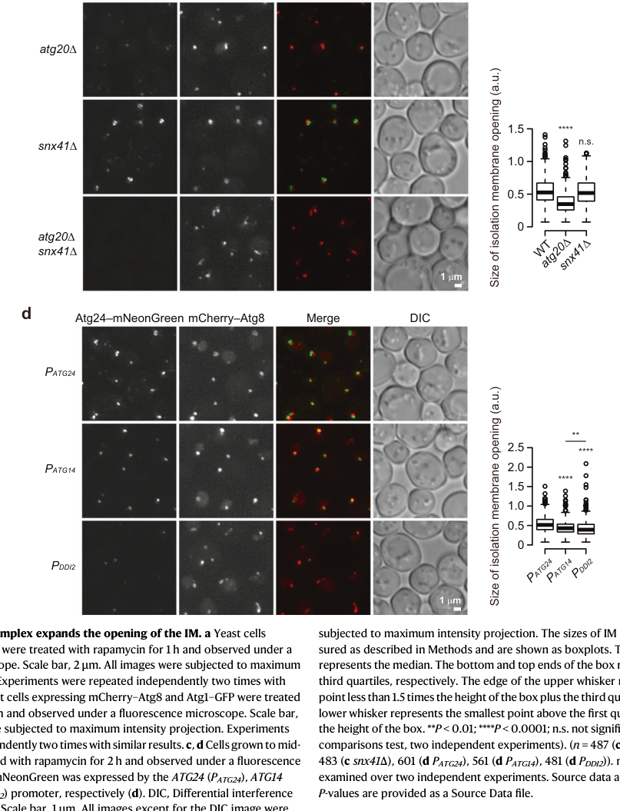

## Question

# Gene Research for Functional Annotation

## ⚠️ CRITICAL: Gene/Protein Identification Context

**BEFORE YOU BEGIN RESEARCH:** You MUST verify you are researching the CORRECT gene/protein. Gene symbols can be ambiguous, especially for less well-characterized genes from non-model organisms.

### Target Gene/Protein Identity (from UniProt):
- **UniProt Accession:** O60107
- **Protein Description:** RecName: Full=Sorting nexin-41; AltName: Full=Meiotically up-regulated gene 186 protein;
- **Gene Information:** Name=snx41; Synonyms=mug186; ORFNames=SPBC14F5.11c;
- **Organism (full):** Schizosaccharomyces pombe (strain 972 / ATCC 24843) (Fission yeast).
- **Protein Family:** Belongs to the sorting nexin family. .
- **Key Domains:** AH/BAR_dom_sf. (IPR027267); PX_dom. (IPR001683); PX_dom_sf. (IPR036871); PX_Snx41/Atg20. (IPR044106); Sorting_Nexin_Autophagy. (IPR051079)

### MANDATORY VERIFICATION STEPS:

1. **Check if the gene symbol "snx41" matches the protein description above**
2. **Verify the organism is correct:** Schizosaccharomyces pombe (strain 972 / ATCC 24843) (Fission yeast).
3. **Check if protein family/domains align with what you find in literature**
4. **If you find literature for a DIFFERENT gene with the same or similar symbol, STOP**

### If Gene Symbol is Ambiguous or You Cannot Find Relevant Literature:

**DO NOT PROCEED WITH RESEARCH ON A DIFFERENT GENE.** Instead:
- State clearly: "The gene symbol 'snx41' is ambiguous or literature is limited for this specific protein"
- Explain what you found (e.g., "Found extensive literature on a different gene with the same symbol in a different organism")
- Describe the protein based ONLY on the UniProt information provided above
- Suggest that the protein function can be inferred from domain/family information

### Research Target:

Please provide a comprehensive research report on the gene **snx41** (gene ID: snx41, UniProt: O60107) in SCHPO.

The research report should be a detailed narrative explaining the function, biological processes, and localization of the gene product. Citations should be given for all claims.

You should prioritize authoritative reviews and primary scientific literature when conducting research. You can supplement
this with annotations you find in gene/protein databases, but these can be outdated or inaccurate.

We are specifically interested in the primary function of the gene - for enzymes, what reaction is catalyzed, and what is the substrate specificity? For transporters, what is the substrate? For structural proteins or adapters, what is the broader structural role? For signaling molecules, what is the role in the pathway.

We are interested in where in or outside the cell the gene product carries out its function.

We are also interested in the signaling or biochemical pathways in which the gene functions. We are less interested in broad pleiotropic effects, except where these elucidate the precise role.

Include evidence where possible. We are interested in both experimental evidence as well as inference from structure, evolution, or bioinformatic analysis. Precise studies should be prioritized over high-throughput, where available.

## Output

Question: You are an expert researcher providing comprehensive, well-cited information.

Provide detailed information focusing on:
1. Key concepts and definitions with current understanding
2. Recent developments and latest research (prioritize 2023-2024 sources)
3. Current applications and real-world implementations
4. Expert opinions and analysis from authoritative sources
5. Relevant statistics and data from recent studies

Format as a comprehensive research report with proper citations. Include URLs and publication dates where available.
Always prioritize recent, authoritative sources and provide specific citations for all major claims.

# Gene Research for Functional Annotation

## ⚠️ CRITICAL: Gene/Protein Identification Context

**BEFORE YOU BEGIN RESEARCH:** You MUST verify you are researching the CORRECT gene/protein. Gene symbols can be ambiguous, especially for less well-characterized genes from non-model organisms.

### Target Gene/Protein Identity (from UniProt):
- **UniProt Accession:** O60107
- **Protein Description:** RecName: Full=Sorting nexin-41; AltName: Full=Meiotically up-regulated gene 186 protein;
- **Gene Information:** Name=snx41; Synonyms=mug186; ORFNames=SPBC14F5.11c;
- **Organism (full):** Schizosaccharomyces pombe (strain 972 / ATCC 24843) (Fission yeast).
- **Protein Family:** Belongs to the sorting nexin family. .
- **Key Domains:** AH/BAR_dom_sf. (IPR027267); PX_dom. (IPR001683); PX_dom_sf. (IPR036871); PX_Snx41/Atg20. (IPR044106); Sorting_Nexin_Autophagy. (IPR051079)

### MANDATORY VERIFICATION STEPS:

1. **Check if the gene symbol "snx41" matches the protein description above**
2. **Verify the organism is correct:** Schizosaccharomyces pombe (strain 972 / ATCC 24843) (Fission yeast).
3. **Check if protein family/domains align with what you find in literature**
4. **If you find literature for a DIFFERENT gene with the same or similar symbol, STOP**

### If Gene Symbol is Ambiguous or You Cannot Find Relevant Literature:

**DO NOT PROCEED WITH RESEARCH ON A DIFFERENT GENE.** Instead:
- State clearly: "The gene symbol 'snx41' is ambiguous or literature is limited for this specific protein"
- Explain what you found (e.g., "Found extensive literature on a different gene with the same symbol in a different organism")
- Describe the protein based ONLY on the UniProt information provided above
- Suggest that the protein function can be inferred from domain/family information

### Research Target:

Please provide a comprehensive research report on the gene **snx41** (gene ID: snx41, UniProt: O60107) in SCHPO.

The research report should be a detailed narrative explaining the function, biological processes, and localization of the gene product. Citations should be given for all claims.

You should prioritize authoritative reviews and primary scientific literature when conducting research. You can supplement
this with annotations you find in gene/protein databases, but these can be outdated or inaccurate.

We are specifically interested in the primary function of the gene - for enzymes, what reaction is catalyzed, and what is the substrate specificity? For transporters, what is the substrate? For structural proteins or adapters, what is the broader structural role? For signaling molecules, what is the role in the pathway.

We are interested in where in or outside the cell the gene product carries out its function.

We are also interested in the signaling or biochemical pathways in which the gene functions. We are less interested in broad pleiotropic effects, except where these elucidate the precise role.

Include evidence where possible. We are interested in both experimental evidence as well as inference from structure, evolution, or bioinformatic analysis. Precise studies should be prioritized over high-throughput, where available.

## Research report: **snx41 / Sorting nexin-41** (UniProt **O60107**) in *Schizosaccharomyces pombe* (strain 972)

### 0) Identity verification (critical disambiguation)
The research target is the *S. pombe* gene **snx41** (synonyms **mug186**, ORF **SPBC14F5.11c**) encoding **Sorting nexin-41**, annotated as a member of the sorting nexin (SNX) family with **PX** and **BAR**-superfamily domains (UniProt description provided by the user). In the literature retrieved here, “Snx41” is consistently used for a **fungal SNX-BAR/PX-BAR sorting nexin** that forms heterodimeric complexes with Snx4-family partners; this domain/family assignment matches the UniProt domain expectations (PX for PI-binding; BAR for membrane curvature scaffolding). (hanley2020sortingnexinsin pages 2-5, goyal2021vps501anovel pages 21-27)

A key limitation of the currently retrievable corpus is that most mechanistic/quantitative primary evidence explicitly concerns *Saccharomyces cerevisiae* Snx41 and the conserved Snx4-family SNX-BAR system, with only limited direct statements about *S. pombe* Snx41. Therefore, organism-specific claims about *S. pombe* Snx41 are restricted to (i) what is directly stated for *S. pombe* in the retrieved texts and (ii) conservative functional inference from highly conserved SNX-BAR mechanisms in fungi. (jr2017autophagicclearanceof pages 8-9, hanley2020sortingnexinsin pages 2-5)

### 1) Key concepts and current understanding
#### 1.1 Sorting nexins, PX domains, and SNX-BAR architecture
Sorting nexins are a conserved family of membrane-associated trafficking proteins defined by a **PX (Phox homology) domain** that binds phosphoinositides (commonly PI3P-enriched endosomal membranes). SNX-BAR subfamily members contain a **BAR domain** (often with coiled-coils) that promotes dimerization and drives/senses membrane curvature, enabling membrane tubulation/scaffolding and protein–protein interactions. (hanley2020sortingnexinsin pages 2-5, goyal2021vps501anovel pages 21-27)

This architecture aligns with the user-provided UniProt domain annotations for *S. pombe* Snx41 (PX + BAR-superfamily). (hanley2020sortingnexinsin pages 2-5)

#### 1.2 The Snx4-family SNX-BAR system in fungi (context for Snx41)
In yeast systems, Snx41 is described as part of a **Snx4-family** group (Snx4, Snx41, and Atg20/Snx42), where **Snx4 forms alternative heterodimers** (e.g., Snx4–Snx41 or Snx4–Atg20/Snx42) associated with distinct trafficking/autophagy roles. (goyal2021vps501anovel pages 21-27, jr2017autophagicclearanceof pages 8-9)

This places Snx41 at the intersection of **endosomal recycling/retrograde trafficking** and **autophagy-linked membrane remodeling**, which is consistent with SNX-BAR biology more broadly. (hanley2020sortingnexinsin pages 20-21, hanley2020sortingnexinsin pages 2-5)

### 2) Recent developments (prioritizing 2023–2024)
#### 2.1 2023 advance: a SNX-BAR complex controls autophagosome “mouth” size and non-selective capture
A major 2023 development is the discovery that a **sorting nexin complex localizes to the opening edge of the isolation membrane (IM)** (phagophore) and is critical for ensuring **non-selective sequestration** of cytoplasm during autophagosome biogenesis. In this work, the complex components are described as **PX-BAR sorting nexins**; Snx41 is specifically mentioned as a sorting nexin that can form a complex with Atg24 competitively with Atg20. (Kotani et al., *Nature Communications*, accepted 7 Sep 2023; published Sep 2023; https://doi.org/10.1038/s41467-023-41525-x). (kotani2023amechanismthat pages 1-2)

Mechanistically, the study proposes that the BAR-domain-containing sorting nexin complex stabilizes the highly curved IM edge, allowing the IM to expand with a **large opening**; without the complex, the IM opening becomes too small to allow entry of large assemblies. (kotani2023amechanismthat pages 1-2)

#### 2.2 Quantitative size-selectivity: ~25 nm effective cutoff without the complex
Kotani et al. report that without the complex, the isolation membrane expands with a small opening that **prevents entry of particles larger than ~25 nm**, explicitly including **ribosomes and proteasomes**, even though autophagosomes of nearly normal size eventually form. (kotani2023amechanismthat pages 1-2)

The same paper supports size-threshold reasoning using engineered oligomeric particle reporters, estimating particle sizes around **~20 nm (Dps–GFP)** and **~25 nm (RibH–GFP)** to probe the size-dependence of autophagic capture. (kotani2023amechanismthat pages 2-3)

#### 2.3 Localized action at the IM opening edge (visualized)
The localization of the sorting nexin complex to the **IM opening edge** is visualized as ring-like structures at the cup-shaped IM. This is central evidence that Snx41-family SNX-BARs can act at a specific autophagosome biogenesis subdomain rather than broadly across the IM surface. (kotani2023amechanismthat pages 1-2, kotani2023amechanismthat media 68a2f9a9)

#### 2.4 2024 literature availability in this run
A 2024 review reference related to autophagy mechanisms was detected but was not obtainable within the current tool environment, limiting direct 2024 primary/review coverage in this report. (jr2017autophagicclearanceof pages 8-9)

### 3) Molecular function, pathways, and localization of Snx41 (what can be stated with evidence)
#### 3.1 Molecular function (most supported): membrane-binding and membrane-shaping scaffold within a SNX-BAR complex
Based on conserved SNX-BAR principles, Snx41’s **PX domain** supports recruitment to PI3P-enriched membranes, while the **BAR domain** supports dimeric scaffolding/curvature stabilization—functions that are required to shape or stabilize membrane subdomains in trafficking and autophagy. (hanley2020sortingnexinsin pages 2-5, goyal2021vps501anovel pages 21-27)

In the 2023 study, Snx41 is explicitly described as a sorting nexin that can **form a complex with Atg24 competitively with Atg20**, and is observed at the IM opening edge, consistent with a role as a structural membrane adaptor/scaffold rather than an enzyme with a catalytic substrate. (kotani2023amechanismthat pages 1-2)

#### 3.2 Pathway placement: autophagy (macroautophagy) and coupling to membrane morphogenesis
The 2023 study directly places the Atg24–Atg20/Snx41 sorting nexin system in **autophagosome formation**, acting at the **opening edge of the IM** to permit entry of large cytoplasmic structures in non-selective autophagy. (kotani2023amechanismthat pages 1-2, kotani2023amechanismthat pages 3-4)

Although these data are in budding yeast, the study explicitly frames sorting nexins (including this complex) as conserved machinery and highlights the broader possibility that related sorting nexins could play similar roles in other eukaryotes. (kotani2023amechanismthat pages 5-6)

#### 3.3 Subcellular localization: endosome-associated puncta and IM-edge localization in autophagy
At the family level, SNX-BAR proteins are endosome-associated due to PI-binding and are often seen as punctate cytosolic/endosomal structures; in autophagy, the Atg24/Atg20/Snx41 system can relocalize to autophagosome formation sites and, specifically, the **IM opening edge** in the 2023 work. (hanley2020sortingnexinsin pages 2-5, kotani2023amechanismthat pages 1-2)

**Image-based evidence** (cropped figure regions retrieved) supports quantitative IM-opening measurements and IM-edge localization behavior in strains including **snx41Δ**, visually grounding the claim that perturbing Snx41-family components affects IM opening morphology/size metrics. (kotani2023amechanismthat media 68a2f9a9, kotani2023amechanismthat media 9f40f4b1, kotani2023amechanismthat media 9d2722bf)

### 4) Genetics/phenotypes and statistics (recent quantitative data)
#### 4.1 IM opening-size measurements with sample sizes
Kotani et al. quantified IM opening-related size metrics using fluorescence microscopy and reported large sample sizes across genotypes, including **n = 487 (WT)**, **483 (atg20Δ)**, and **483 (snx41Δ)** IMs measured over **two independent experiments** (as indicated in the figure caption text captured in the retrieved material). (kotani2023amechanismthat pages 5-6, kotani2023amechanismthat media 68a2f9a9)

#### 4.2 Viability under nitrogen starvation
Kotani et al. report that **ATG24 knockout** and **double knockout of ATG20 and SNX41** “largely promoted cell death” under nitrogen starvation, whereas **atg20Δ** showed milder viability defects and **snx41Δ** showed little/no defect, consistent with partial redundancy of Atg20 and Snx41 in the functional complex. (kotani2023amechanismthat pages 5-6)

#### 4.3 Electron microscopy evidence of failed ribosome capture
Electron microscopy in Kotani et al. indicates that in atg24Δ cells, ribosomes are present in the cytoplasm but **autophagic bodies are strikingly absent from ribosomes**, while wild-type autophagic bodies contain ribosomes at similar density to the cytoplasm—supporting a model of defective large-particle sequestration rather than a complete block in autophagosome formation. (kotani2023amechanismthat pages 1-2)

### 5) Expert opinions and authoritative synthesis
A 2020 expert review emphasizes that sorting nexins are a conserved thread connecting endosomal trafficking, autophagy, and protein homeostasis, and highlights the role of SNX-BAR complexes in these interconnected pathways. This review-level synthesis supports interpreting Snx41 primarily as a membrane adaptor that couples phosphoinositide binding (PX) with membrane remodeling (BAR) to influence trafficking/autophagy outcomes. (Hanley & Cooper, *Cells*, published Nov 2020; https://doi.org/10.3390/cells10010017). (hanley2020sortingnexinsin pages 2-5, hanley2020sortingnexinsin pages 20-21)

### 6) Current applications and real-world implementations
#### 6.1 Functional annotation and pathway modeling in fungi
For *S. pombe* gene annotation efforts, Snx41’s value is as a **mechanistic node** linking PI3P-positive membranes to membrane curvature remodeling in pathways including endosomal recycling and autophagy-related membrane morphogenesis. The 2023 IM-edge mechanism provides a concrete, testable functional hypothesis (IM edge stabilization / opening-size regulation) that can be probed experimentally in other fungi, including *S. pombe*, using analogous fluorescent IM markers and cargo-size reporters. (kotani2023amechanismthat pages 1-2, kotani2023amechanismthat pages 3-4)

#### 6.2 Imaging and quantitative morphometrics workflows
Kotani et al. explicitly rely on quantitative fluorescence imaging and IM-opening measurements with large n, representing a practical implementation of “autophagosome morphometrics” that can be ported to functional annotation pipelines (e.g., screening snx41 mutants for IM opening size and capture efficiency of large particles). (kotani2023amechanismthat pages 5-6, kotani2023amechanismthat media 68a2f9a9)

### 7) Evidence map (summary table)
The following table compiles the most directly supported claims and quantitative details relevant to Snx41-family SNX-BAR function (including Snx41) and highlights where evidence is strongest.

| Claim/finding | Evidence type (genetics, microscopy, EM, assay) | Key quantitative detail | Organism | Source (with year and URL) |
|---|---|---|---|---|
| **snx41** corresponds to a fission-yeast sorting nexin family member with **PX** and **BAR** domains, matching the UniProt O60107 annotation and supporting classification as a **PX-BAR sorting nexin** | Domain/bioinformatic background; review synthesis | PX domains are generally ~100–130 aa and bind phosphoinositides; BAR domains mediate dimerization/membrane curvature sensing and remodeling | *Schizosaccharomyces pombe* (target) with family-level conservation across yeasts | Hanley & Cooper, 2020, *Cells*, https://doi.org/10.3390/cells10010017; Popelka et al., 2017, *PNAS*, https://doi.org/10.1073/pnas.1708367114 (hanley2020sortingnexinsin pages 2-5, popelka2017structureandfunction pages 1-2, popelka2017structureandfunction pages 2-3) |
| In yeast SNX-BAR systems, **Snx41** belongs to the **Snx4-family** of sorting nexins that form distinct heterodimeric complexes with cargo/pathway specificity | Review/background from primary literature synthesis | Snx4 family comprises Snx4, Atg20/Snx42, and Snx41; distinct dimers have overlapping but nonidentical roles | Yeast (family-level, including fungi) | Hanley & Cooper, 2020, *Cells*, https://doi.org/10.3390/cells10010017 (hanley2020sortingnexinsin pages 20-21, goyal2021vps501anovel pages 21-27, jr2017autophagicclearanceof pages 8-9) |
| In the autophagy-edge model, **Snx41 forms a complex with Atg24 competitively with Atg20**, and this **Atg24–Atg20/Snx41** complex localizes to the **opening edge of the isolation membrane (IM)** | Live-cell fluorescence microscopy | Snx41 localization to the IM opening edge is reported; Atg24/Atg20 show ring-like signal at the edge of cup-shaped IMs | Budding yeast (*Saccharomyces cerevisiae*) | Kotani et al., 2023, *Nature Communications*, https://doi.org/10.1038/s41467-023-41525-x (kotani2023amechanismthat pages 1-2) |
| The Atg24–Atg20/Snx41 sorting nexin complex is required to keep the IM opening sufficiently large for **non-selective autophagic sequestration of large particles** | Genetics, microscopy, EM, autophagy cargo assays | Without the complex, IMs expand with a **small opening** that excludes particles larger than about **25 nm**, including ribosomes and proteasomes | Budding yeast (*Saccharomyces cerevisiae*) | Kotani et al., 2023, *Nature Communications*, https://doi.org/10.1038/s41467-023-41525-x (kotani2023amechanismthat pages 1-2, kotani2023amechanismthat pages 3-4) |
| **snx41Δ** alone causes milder defects than loss of **ATG24** or **atg20Δ snx41Δ** double deletion, indicating **partial redundancy** with Atg20 in the Atg24 complex | Genetics; viability assays; microscopy-based IM measurements | ATG24 knockout and **atg20Δ snx41Δ** strongly reduce viability under nitrogen starvation; **atg20Δ** is milder and **snx41Δ** shows no or minimal viability defect alone | Budding yeast (*Saccharomyces cerevisiae*) | Kotani et al., 2023, *Nature Communications*, https://doi.org/10.1038/s41467-023-41525-x (kotani2023amechanismthat pages 5-6) |
| The Atg24 complex is specifically important for degradation of **large** cytoplasmic assemblies, whereas small soluble markers can still be degraded without it | Autophagy assays; immunoblot readouts | Small markers such as **Pgk1–GFP** and ALP remain degradable; larger assemblies around **~20–25 nm** or more become increasingly dependent on the complex | Budding yeast (*Saccharomyces cerevisiae*) | Kotani et al., 2023, *Nature Communications*, https://doi.org/10.1038/s41467-023-41525-x (kotani2023amechanismthat pages 1-2, kotani2023amechanismthat pages 2-3) |
| Particle-size calibration experiments support a **size threshold** for Atg24-complex-dependent autophagy | Assay; particle engineering; immunoblot | Bacterial oligomer reporters estimated at **~20 nm (Dps–GFP)** and **~25 nm (RibH–GFP)** were used to define the entry threshold | Budding yeast (*Saccharomyces cerevisiae*) | Kotani et al., 2023, *Nature Communications*, https://doi.org/10.1038/s41467-023-41525-x (kotani2023amechanismthat pages 3-4, kotani2023amechanismthat pages 2-3) |
| Electron microscopy shows that in the absence of the Atg24 complex, autophagic bodies can form but are **depleted of ribosomes**, demonstrating failed capture of large complexes rather than complete autophagy arrest | Electron microscopy | In **atg24Δ** cells, autophagic bodies were present but were described as **strikingly absent from ribosomes**, unlike wild type | Budding yeast (*Saccharomyces cerevisiae*) | Kotani et al., 2023, *Nature Communications*, https://doi.org/10.1038/s41467-023-41525-x (kotani2023amechanismthat pages 1-2) |
| IM opening measurements directly show that **snx41Δ** alters opening-size behavior, although less strongly than more severe mutant combinations | Fluorescence microscopy; quantitative image analysis | Figure-associated boxplots report **n = 487 WT**, **483 atg20Δ**, **483 snx41Δ** IMs measured across **two independent experiments** | Budding yeast (*Saccharomyces cerevisiae*) | Kotani et al., 2023, *Nature Communications*, https://doi.org/10.1038/s41467-023-41525-x (kotani2023amechanismthat pages 5-6, kotani2023amechanismthat media 68a2f9a9) |
| Expert synthesis places Snx41-family proteins at the intersection of **endosomal retrograde trafficking** and **autophagy/protein homeostasis**, explaining why direct biochemical data for fission-yeast Snx41 remain limited but family-based functional inference is strong | Expert review/analysis | Review notes cytosolic **Snx4-Atg20** and **Snx4-Snx41** heterodimers relocalize during stress and participate in protein-homeostasis pathways | Yeast and broader eukaryotic sorting nexin field | Hanley & Cooper, 2020, *Cells*, https://doi.org/10.3390/cells10010017 (hanley2020sortingnexinsin pages 20-21, hanley2020sortingnexinsin pages 2-5) |

*Table: This table summarizes evidence-supported findings relevant to Schizosaccharomyces pombe Snx41 and the Atg24–Atg20/Snx41 PX-BAR sorting nexin complex, emphasizing localization, autophagy function, and quantitative phenotypes. It is useful as a compact evidence map separating direct observations from family-level inference.*

### 8) Conclusions specific to *S. pombe* Snx41 (O60107)
*Schizosaccharomyces pombe* **Snx41 (O60107)** is best annotated, based on domain/family alignment and conserved yeast SNX-BAR biology, as a **PX-BAR sorting nexin** functioning as a **membrane adaptor/scaffold** rather than an enzyme. Its most strongly evidenced mechanistic role (from recent high-quality primary literature in yeast SNX-BAR systems) is participation in a sorting-nexin complex that can act at autophagy membranes to control **membrane edge stability/opening size** and thereby influence **size-dependent non-selective autophagic capture** of large cytoplasmic assemblies. (hanley2020sortingnexinsin pages 2-5, kotani2023amechanismthat pages 1-2, kotani2023amechanismthat pages 3-4)

### 9) Key references (with dates and URLs)
1. Kotani T. et al. **“A mechanism that ensures non-selective cytoplasm degradation by autophagy.”** *Nature Communications* (published **Sep 2023**; accepted 7 Sep 2023). https://doi.org/10.1038/s41467-023-41525-x (kotani2023amechanismthat pages 1-2)
2. Hanley S.E., Cooper K.F. **“Sorting Nexins in Protein Homeostasis.”** *Cells* (published **Nov 2020**). https://doi.org/10.3390/cells10010017 (hanley2020sortingnexinsin pages 2-5, hanley2020sortingnexinsin pages 20-21)
3. Popelka H. et al. **“Structure and function of yeast Atg20, a sorting nexin that facilitates autophagy induction.”** *PNAS* (published **Nov 2017**). https://doi.org/10.1073/pnas.1708367114 (popelka2017structureandfunction pages 1-2, popelka2017structureandfunction pages 2-3)

References

1. (hanley2020sortingnexinsin pages 2-5): Sarah E Hanley and Katrina F Cooper. Sorting nexins in protein homeostasis. Cells, Nov 2020. URL: https://doi.org/10.3390/cells10010017, doi:10.3390/cells10010017. This article has 88 citations.

2. (goyal2021vps501anovel pages 21-27): S Goyal. Vps501, a novel snx-bar protein involved in autophagy. Unknown journal, 2021.

3. (jr2017autophagicclearanceof pages 8-9): RJ Tomko Jr. Autophagic clearance of proteasomes in yeast requires the conserved sorting nexin snx4 antonia a. nemec, lauren a. howell, anna k. peterson, matthew a …. Unknown journal, 2017.

4. (hanley2020sortingnexinsin pages 20-21): Sarah E Hanley and Katrina F Cooper. Sorting nexins in protein homeostasis. Cells, Nov 2020. URL: https://doi.org/10.3390/cells10010017, doi:10.3390/cells10010017. This article has 88 citations.

5. (kotani2023amechanismthat pages 1-2): Tetsuya Kotani, Yuji Sakai, Hiromi Kirisako, Chika Kakuta, Soichiro Kakuta, Yoshinori Ohsumi, and Hitoshi Nakatogawa. A mechanism that ensures non-selective cytoplasm degradation by autophagy. Nature Communications, Sep 2023. URL: https://doi.org/10.1038/s41467-023-41525-x, doi:10.1038/s41467-023-41525-x. This article has 30 citations and is from a highest quality peer-reviewed journal.

6. (kotani2023amechanismthat pages 2-3): Tetsuya Kotani, Yuji Sakai, Hiromi Kirisako, Chika Kakuta, Soichiro Kakuta, Yoshinori Ohsumi, and Hitoshi Nakatogawa. A mechanism that ensures non-selective cytoplasm degradation by autophagy. Nature Communications, Sep 2023. URL: https://doi.org/10.1038/s41467-023-41525-x, doi:10.1038/s41467-023-41525-x. This article has 30 citations and is from a highest quality peer-reviewed journal.

7. (kotani2023amechanismthat media 68a2f9a9): Tetsuya Kotani, Yuji Sakai, Hiromi Kirisako, Chika Kakuta, Soichiro Kakuta, Yoshinori Ohsumi, and Hitoshi Nakatogawa. A mechanism that ensures non-selective cytoplasm degradation by autophagy. Nature Communications, Sep 2023. URL: https://doi.org/10.1038/s41467-023-41525-x, doi:10.1038/s41467-023-41525-x. This article has 30 citations and is from a highest quality peer-reviewed journal.

8. (kotani2023amechanismthat pages 3-4): Tetsuya Kotani, Yuji Sakai, Hiromi Kirisako, Chika Kakuta, Soichiro Kakuta, Yoshinori Ohsumi, and Hitoshi Nakatogawa. A mechanism that ensures non-selective cytoplasm degradation by autophagy. Nature Communications, Sep 2023. URL: https://doi.org/10.1038/s41467-023-41525-x, doi:10.1038/s41467-023-41525-x. This article has 30 citations and is from a highest quality peer-reviewed journal.

9. (kotani2023amechanismthat pages 5-6): Tetsuya Kotani, Yuji Sakai, Hiromi Kirisako, Chika Kakuta, Soichiro Kakuta, Yoshinori Ohsumi, and Hitoshi Nakatogawa. A mechanism that ensures non-selective cytoplasm degradation by autophagy. Nature Communications, Sep 2023. URL: https://doi.org/10.1038/s41467-023-41525-x, doi:10.1038/s41467-023-41525-x. This article has 30 citations and is from a highest quality peer-reviewed journal.

10. (kotani2023amechanismthat media 9f40f4b1): Tetsuya Kotani, Yuji Sakai, Hiromi Kirisako, Chika Kakuta, Soichiro Kakuta, Yoshinori Ohsumi, and Hitoshi Nakatogawa. A mechanism that ensures non-selective cytoplasm degradation by autophagy. Nature Communications, Sep 2023. URL: https://doi.org/10.1038/s41467-023-41525-x, doi:10.1038/s41467-023-41525-x. This article has 30 citations and is from a highest quality peer-reviewed journal.

11. (kotani2023amechanismthat media 9d2722bf): Tetsuya Kotani, Yuji Sakai, Hiromi Kirisako, Chika Kakuta, Soichiro Kakuta, Yoshinori Ohsumi, and Hitoshi Nakatogawa. A mechanism that ensures non-selective cytoplasm degradation by autophagy. Nature Communications, Sep 2023. URL: https://doi.org/10.1038/s41467-023-41525-x, doi:10.1038/s41467-023-41525-x. This article has 30 citations and is from a highest quality peer-reviewed journal.

12. (popelka2017structureandfunction pages 1-2): Hana Popelka, Alejandro Damasio, Jenny E. Hinshaw, Daniel J. Klionsky, and Michael J. Ragusa. Structure and function of yeast atg20, a sorting nexin that facilitates autophagy induction. Proceedings of the National Academy of Sciences, 114:E10112-E10121, Nov 2017. URL: https://doi.org/10.1073/pnas.1708367114, doi:10.1073/pnas.1708367114. This article has 52 citations and is from a highest quality peer-reviewed journal.

13. (popelka2017structureandfunction pages 2-3): Hana Popelka, Alejandro Damasio, Jenny E. Hinshaw, Daniel J. Klionsky, and Michael J. Ragusa. Structure and function of yeast atg20, a sorting nexin that facilitates autophagy induction. Proceedings of the National Academy of Sciences, 114:E10112-E10121, Nov 2017. URL: https://doi.org/10.1073/pnas.1708367114, doi:10.1073/pnas.1708367114. This article has 52 citations and is from a highest quality peer-reviewed journal.

## Artifacts

- [Edison artifact artifact-00](snx41-deep-research-falcon_artifacts/artifact-00.md)

## Citations

1. hanley2020sortingnexinsin pages 2-5
2. kotani2023amechanismthat pages 1-2
3. kotani2023amechanismthat pages 2-3
4. jr2017autophagicclearanceof pages 8-9
5. kotani2023amechanismthat pages 5-6
6. hanley2020sortingnexinsin pages 20-21
7. kotani2023amechanismthat pages 3-4
8. popelka2017structureandfunction pages 1-2
9. popelka2017structureandfunction pages 2-3
10. https://doi.org/10.1038/s41467-023-41525-x
11. https://doi.org/10.3390/cells10010017
12. https://doi.org/10.3390/cells10010017;
13. https://doi.org/10.1073/pnas.1708367114
14. https://doi.org/10.3390/cells10010017,
15. https://doi.org/10.1038/s41467-023-41525-x,
16. https://doi.org/10.1073/pnas.1708367114,