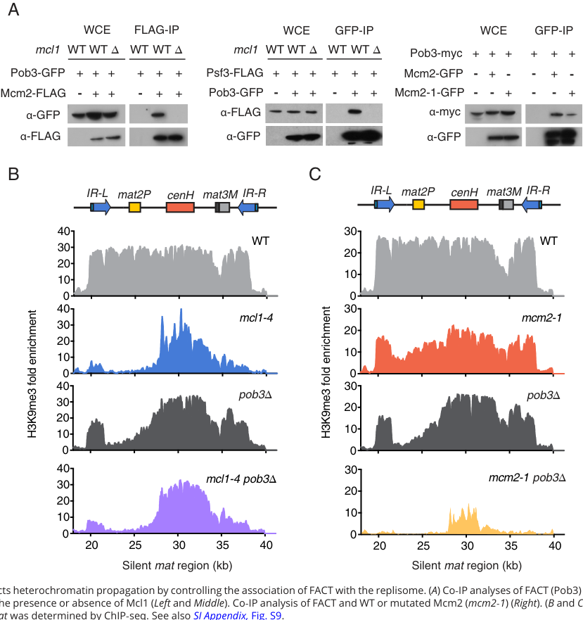

## Question

# Gene Research for Functional Annotation

## ⚠️ CRITICAL: Gene/Protein Identification Context

**BEFORE YOU BEGIN RESEARCH:** You MUST verify you are researching the CORRECT gene/protein. Gene symbols can be ambiguous, especially for less well-characterized genes from non-model organisms.

### Target Gene/Protein Identity (from UniProt):
- **UniProt Accession:** O94267
- **Protein Description:** RecName: Full=FACT complex subunit spt16; AltName: Full=Facilitates chromatin transcription complex subunit spt16;
- **Gene Information:** Name=spt16; ORFNames=SPBP8B7.19;
- **Organism (full):** Schizosaccharomyces pombe (strain 972 / ATCC 24843) (Fission yeast).
- **Protein Family:** Belongs to the peptidase M24 family. SPT16 subfamily.
- **Key Domains:** Creatin/AminoP/Spt16_N. (IPR029149); Creatinase/aminopeptidase-like. (IPR036005); FACT-SPT16_Nlobe. (IPR029148); Fact-SPT16_PH. (IPR056595); FACT_SPT16_C. (IPR048969)

### MANDATORY VERIFICATION STEPS:

1. **Check if the gene symbol "spt16" matches the protein description above**
2. **Verify the organism is correct:** Schizosaccharomyces pombe (strain 972 / ATCC 24843) (Fission yeast).
3. **Check if protein family/domains align with what you find in literature**
4. **If you find literature for a DIFFERENT gene with the same or similar symbol, STOP**

### If Gene Symbol is Ambiguous or You Cannot Find Relevant Literature:

**DO NOT PROCEED WITH RESEARCH ON A DIFFERENT GENE.** Instead:
- State clearly: "The gene symbol 'spt16' is ambiguous or literature is limited for this specific protein"
- Explain what you found (e.g., "Found extensive literature on a different gene with the same symbol in a different organism")
- Describe the protein based ONLY on the UniProt information provided above
- Suggest that the protein function can be inferred from domain/family information

### Research Target:

Please provide a comprehensive research report on the gene **spt16** (gene ID: spt16, UniProt: O94267) in SCHPO.

The research report should be a detailed narrative explaining the function, biological processes, and localization of the gene product. Citations should be given for all claims.

You should prioritize authoritative reviews and primary scientific literature when conducting research. You can supplement
this with annotations you find in gene/protein databases, but these can be outdated or inaccurate.

We are specifically interested in the primary function of the gene - for enzymes, what reaction is catalyzed, and what is the substrate specificity? For transporters, what is the substrate? For structural proteins or adapters, what is the broader structural role? For signaling molecules, what is the role in the pathway.

We are interested in where in or outside the cell the gene product carries out its function.

We are also interested in the signaling or biochemical pathways in which the gene functions. We are less interested in broad pleiotropic effects, except where these elucidate the precise role.

Include evidence where possible. We are interested in both experimental evidence as well as inference from structure, evolution, or bioinformatic analysis. Precise studies should be prioritized over high-throughput, where available.

## Output

Question: You are an expert researcher providing comprehensive, well-cited information.

Provide detailed information focusing on:
1. Key concepts and definitions with current understanding
2. Recent developments and latest research (prioritize 2023-2024 sources)
3. Current applications and real-world implementations
4. Expert opinions and analysis from authoritative sources
5. Relevant statistics and data from recent studies

Format as a comprehensive research report with proper citations. Include URLs and publication dates where available.
Always prioritize recent, authoritative sources and provide specific citations for all major claims.

# Gene Research for Functional Annotation

## ⚠️ CRITICAL: Gene/Protein Identification Context

**BEFORE YOU BEGIN RESEARCH:** You MUST verify you are researching the CORRECT gene/protein. Gene symbols can be ambiguous, especially for less well-characterized genes from non-model organisms.

### Target Gene/Protein Identity (from UniProt):
- **UniProt Accession:** O94267
- **Protein Description:** RecName: Full=FACT complex subunit spt16; AltName: Full=Facilitates chromatin transcription complex subunit spt16;
- **Gene Information:** Name=spt16; ORFNames=SPBP8B7.19;
- **Organism (full):** Schizosaccharomyces pombe (strain 972 / ATCC 24843) (Fission yeast).
- **Protein Family:** Belongs to the peptidase M24 family. SPT16 subfamily.
- **Key Domains:** Creatin/AminoP/Spt16_N. (IPR029149); Creatinase/aminopeptidase-like. (IPR036005); FACT-SPT16_Nlobe. (IPR029148); Fact-SPT16_PH. (IPR056595); FACT_SPT16_C. (IPR048969)

### MANDATORY VERIFICATION STEPS:

1. **Check if the gene symbol "spt16" matches the protein description above**
2. **Verify the organism is correct:** Schizosaccharomyces pombe (strain 972 / ATCC 24843) (Fission yeast).
3. **Check if protein family/domains align with what you find in literature**
4. **If you find literature for a DIFFERENT gene with the same or similar symbol, STOP**

### If Gene Symbol is Ambiguous or You Cannot Find Relevant Literature:

**DO NOT PROCEED WITH RESEARCH ON A DIFFERENT GENE.** Instead:
- State clearly: "The gene symbol 'spt16' is ambiguous or literature is limited for this specific protein"
- Explain what you found (e.g., "Found extensive literature on a different gene with the same symbol in a different organism")
- Describe the protein based ONLY on the UniProt information provided above
- Suggest that the protein function can be inferred from domain/family information

### Research Target:

Please provide a comprehensive research report on the gene **spt16** (gene ID: spt16, UniProt: O94267) in SCHPO.

The research report should be a detailed narrative explaining the function, biological processes, and localization of the gene product. Citations should be given for all claims.

You should prioritize authoritative reviews and primary scientific literature when conducting research. You can supplement
this with annotations you find in gene/protein databases, but these can be outdated or inaccurate.

We are specifically interested in the primary function of the gene - for enzymes, what reaction is catalyzed, and what is the substrate specificity? For transporters, what is the substrate? For structural proteins or adapters, what is the broader structural role? For signaling molecules, what is the role in the pathway.

We are interested in where in or outside the cell the gene product carries out its function.

We are also interested in the signaling or biochemical pathways in which the gene functions. We are less interested in broad pleiotropic effects, except where these elucidate the precise role.

Include evidence where possible. We are interested in both experimental evidence as well as inference from structure, evolution, or bioinformatic analysis. Precise studies should be prioritized over high-throughput, where available.

## Research report: Functional annotation of **spt16** (UniProt **O94267**) in *Schizosaccharomyces pombe* (strain 972)

### 0) Target verification (mandatory)
The target protein **Spt16** in *S. pombe* is the large, essential subunit of the conserved **FACT (FAcilitates Chromatin Transactions)** histone-chaperone complex. In yeasts, FACT is composed of an **Spt16/Pob3 heterodimer** with an HMGB accessory module (**Nhp6** in *S. pombe*), which matches the UniProt description for **O94267** (RecName: FACT complex subunit Spt16; gene: **spt16**, ORF: **SPBP8B7.19**). (takahata2023opposingrolesof pages 2-4, takahata2024thehmg‐boxmodule pages 1-2)

Recent fission-yeast FACT literature depicts Spt16 with a **peptidase-like (peptidase M24-like) fold** and **PH-domain** architecture (peptidase-like “PL” domain; tandem PH modules; acidic tail/cluster), consistent with the domain/family labels provided in UniProt/InterPro for O94267. (takahata2023opposingrolesof pages 2-4, takahata2024thehmg‐boxmodule pages 4-5)

**URLs / publication dates (key S. pombe-focused sources used here):**
- Takahata & Murakami, *Biomolecules* (review), **Feb 2023**. https://doi.org/10.3390/biom13020377 (takahata2023opposingrolesof pages 1-2)
- Takahata et al., *Genes to Cells* (primary), **Jun 2024**. https://doi.org/10.1111/gtc.13132 (takahata2024thehmg‐boxmodule pages 1-2)
- Nathanailidou et al., *PNAS* (primary), **Jan 2024**. https://doi.org/10.1073/pnas.2315596121 (nathanailidou2024specializedreplicationof pages 9-10)

### 1) Key concepts and definitions (current understanding)

#### 1.1 FACT and Spt16
**FACT** is a conserved, abundant chromatin factor initially identified as an **RNA polymerase II elongation factor** and now broadly understood as an **ATP-independent histone chaperone** that promotes transcription and other chromatin transactions by reorganizing nucleosomes while preserving chromatin integrity. (takahata2023opposingrolesof pages 1-2, takahata2023opposingrolesof pages 2-4)

In *S. pombe*, FACT includes **Spt16 (large subunit)** and **Pob3 (partner subunit)**; **Nhp6** provides an HMGB DNA-binding/bending activity as an accessory module. Importantly, in fission yeast **spt16+ is essential**, while **pob3+** and **nhp6+** are nonessential, allowing genetic dissection of submodules. (takahata2023opposingrolesof pages 2-4)

#### 1.2 Molecular function vs “peptidase family” annotation
Although Spt16 is classified in some annotations as **peptidase M24 family / peptidase-like**, the relevant fission-yeast literature describes this region primarily as a **peptidase-like fold used for protein/histone interactions**, not as a characterized protease that catalyzes peptide hydrolysis in vivo. (takahata2023opposingrolesof pages 2-4, jang2025abo1atpasefacilitates pages 1-5)

### 2) Domain architecture and mechanistic model (structure-to-function)
Spt16/FACT is modular and binds multiple nucleosomal components. In fission-yeast-focused summaries and schematics, Spt16 is described with:
- An **N-terminal peptidase-like (PL; peptidase-fold) domain** with **histone H3/H4-binding** capacity and (in *S. pombe*) specific interaction capacity with HP1/Swi6 (see below). (takahata2023opposingrolesof pages 2-4, takahata2023opposingrolesof pages 8-10)
- A central **tandem PH domain** in Spt16 associated with **H2A/H2B chaperone activity** (deposition/repositioning/removal). (takahata2023opposingrolesof pages 2-4, takahata2023opposingrolesof pages 8-10)
- **Dimerization domain(s)** that mediate the stable Spt16–Pob3 heterodimer. (takahata2023opposingrolesof pages 2-4, jang2025abo1atpasefacilitates pages 1-5)
- **Acidic tail/cluster(s)** that tether H2A/H2B and are described as phosphorylation-regulated for nucleosome binding in yeast FACT models. (takahata2023opposingrolesof pages 2-4)

A working model in yeasts is that FACT binds nucleosomes and can promote transient conversion among **octasome/hexasome/tetrasome**-like intermediates by controlling H2A/H2B association, aided by Nhp6 DNA binding and FACT conformational opening. (takahata2023opposingrolesof pages 2-4)

### 3) Biological roles and pathways in *S. pombe*

#### 3.1 Euchromatin: transcription elongation and chromatin integrity
FACT is widely described as a **transcription-stimulating factor** that relaxes chromatin through its H2A/H2B chaperone function, enabling polymerase progression through nucleosomes while helping restore/maintain nucleosome structure afterward. (takahata2023opposingrolesof pages 1-2, takahata2023opposingrolesof pages 2-4)

A 2024 *S. pombe* study analyzing the FACT HMGB module emphasizes that transcriptional perturbations in **pob3Δ** resemble those in **spt4Δ** (an elongation-related factor), whereas **nhp6Δ** shows comparatively minimal global expression change, supporting the view that the **Spt16/Pob3 core** is the principal transcription module, with Nhp6 tuning chromatin binding/engagement rather than driving transcriptional output alone. (takahata2024thehmg‐boxmodule pages 3-3, takahata2024thehmg‐boxmodule pages 4-5)

**Localization (inference from function):** These transcription-associated functions place Spt16 on **nuclear chromatin**, particularly at actively transcribed regions, consistent with FACT’s chromatin-binding roles. (takahata2023opposingrolesof pages 1-2)

#### 3.2 Heterochromatin: HP1/Swi6-dependent recruitment, condensation, and silencing
A distinctive and well-supported *S. pombe* role for FACT is in **constitutive heterochromatin**, where it contributes to higher-order chromatin structure and transcriptional repression by binding to **Swi6 (HP1 homolog)**. (takahata2023opposingrolesof pages 1-2, takahata2023opposingrolesof pages 8-10)

**Direct recruitment mechanism (key finding):**
- The **peptidase-like domain** of Spt16 **directly binds** the **dimerized chromo-shadow domain (CSD)** of **Swi6** (but not the related HP1-family protein Chp2), establishing a molecular recruitment route for FACT to heterochromatin. (takahata2023opposingrolesof pages 8-10)
- This interaction depends on a **charge-biased “RKDD” cluster** in the Swi6 CSD β1–β2 loop; mutating RKDD→AAAA (Swi6-4A) abolishes Spt16 binding in vitro and is associated with disordered heterochromatin in vivo. (takahata2023opposingrolesof pages 8-10)

**Proposed mechanistic consequence in heterochromatin:**
After Swi6-mediated recruitment, models propose a **scaffold shift** wherein the Spt16 peptidase-like domain transitions from recognizing Swi6-CSD to contacting **histone H3/H4**, enabling either (i) cooperative bridging/condensation of dinucleosomes with Swi6 or (ii) stable binding to mononucleosomes, followed by **H2A/H2B repositioning** via Spt16’s chaperone modules. (takahata2023opposingrolesof pages 8-10)

**Quantitative/phenotypic data point (recently summarized):** In **pob3Δ** strains, **Spt16 binding to heterochromatin is reduced to ~50% of wild type**, indicating that Pob3 supports—but is not strictly required for—Spt16 recruitment, consistent with additional Swi6-dependent recruitment routes. (takahata2023opposingrolesof pages 6-8)

#### 3.3 Replication-coupled chromatin inheritance: linking FACT to the replisome
A major 2024 development is direct integration of FACT into **replication-coupled parental histone recycling** mechanisms supporting **heterochromatin inheritance**.

Nathanailidou et al. (PNAS, Jan 2024) propose that replication proteins enriched across heterochromatin cooperate with FACT to retain parental histones and maintain H3K9 methylation patterns through S phase, and show that **Mcl1** (Ctf4 ortholog) is required to connect the replisome to FACT, implicating FACT as a histone-capture/redeposition factor at replication forks. (nathanailidou2024specializedreplicationof pages 9-10)

The paper’s **Figure 6/7** provides figure-backed evidence and a conceptual model: co-immunoprecipitation assays track association of FACT (via Pob3) with replisome components (e.g., MCM/GINS) and a model in which Swi6/HP1 creates a high-concentration microenvironment that helps retain FACT and parental histones near the replication fork to support epigenetic propagation. (nathanailidou2024specializedreplicationof media 4febe89e, nathanailidou2024specializedreplicationof media 040f23c1)

### 4) Recent developments and “latest research” emphasis (2023–2024)

1. **Mechanistic clarity of heterochromatin recruitment**: The 2023 synthesis highlights a specific Spt16–Swi6 CSD binding interface (RKDD loop dependence) and proposes how FACT could cooperate with HP1 bridging to compact and stabilize heterochromatin. (takahata2023opposingrolesof pages 8-10)
2. **Module dissection of FACT accessory HMG-box activity** (2024): Nhp6 is not simply redundant with Pob3; engineering a Pob3–Nhp6 fusion (SSRP1-like) increases chromatin binding and promotes heterochromatin formation and stability, suggesting tunable chromatin affinity/retention is a key variable controlling epigenetic “variegation.” (takahata2024thehmg‐boxmodule pages 1-2)
3. **Replication coupling** (2024): FACT is integrated into replisome-based models of parental histone recycling and heterochromatin propagation, linking transcription-coupled nucleosome handling to replication-associated epigenetic inheritance. (nathanailidou2024specializedreplicationof pages 9-10, nathanailidou2024specializedreplicationof media 4febe89e)

### 5) Current applications and real-world implementations

Although *S. pombe* Spt16 is not directly a therapeutic target, the **real-world implementation** of Spt16 biology is substantial in **experimental chromatin biology**, where FACT/Spt16 is used as:
- A mechanistic model to dissect **histone chaperone function**, nucleosome intermediate handling (hexasomes/tetrasomes), and the coupling of transcription/replication to chromatin restoration. (takahata2023opposingrolesof pages 2-4, jang2025abo1atpasefacilitates pages 1-5)
- A genetically tractable system to study **heterochromatin formation and epigenetic stability**, including how increased or decreased chromatin binding of a histone chaperone modulates silencing variegation. (takahata2024thehmg‐boxmodule pages 1-2)
- A component in models of **replication-coupled epigenetic inheritance**, relevant to broader eukaryotic chromatin replication principles. (nathanailidou2024specializedreplicationof pages 9-10)

### 6) Expert opinions and analysis (authoritative synthesis)
A 2023 peer-reviewed review emphasizes FACT’s “double-edged” roles: supporting **euchromatin accessibility/transcription** while also contributing to **heterochromatin repression/condensation** in fission yeast through partner-dependent targeting (e.g., transcription activators vs HP1/Swi6). (takahata2023opposingrolesof pages 1-2, takahata2023opposingrolesof pages 6-8)

This partner-dependent “context switching” provides a coherent explanation for how a single conserved histone chaperone complex can both promote transcription and stabilize repressed chromatin: the molecular outcome depends strongly on **recruitment interfaces** (Swi6-binding in heterochromatin) and on which nucleosomal intermediates are being stabilized. (takahata2023opposingrolesof pages 8-10, takahata2023opposingrolesof pages 2-4)

### 7) Relevant statistics and data highlights (recent studies)
- **Heterochromatin recruitment dependency:** In *S. pombe* **pob3Δ**, Spt16 binding at heterochromatin is reduced to approximately **50%** of wild-type levels, indicating partial Pob3 dependence and supporting an additional recruitment pathway (e.g., via Swi6). (takahata2023opposingrolesof pages 6-8)
- **Figure-backed replisome association:** Co-IP assays and model schematics in PNAS 2024 present evidence that FACT associates with replisome components in an **Mcl1-dependent** manner, supporting a replication-coupled histone recycling mechanism (qualitative/interaction data; see Figure 6/7). (nathanailidou2024specializedreplicationof media 4febe89e, nathanailidou2024specializedreplicationof media 040f23c1)

### 8) Summary of functional annotation (actionable narrative)
**Spt16 (UniProt O94267)** in *Schizosaccharomyces pombe* is the essential large subunit of the **FACT** histone chaperone complex. It is best annotated as a **chromatin-associated histone chaperone** whose principal biochemical “substrates” are nucleosomes and histone components (H2A/H2B and H3/H4), rather than a small-molecule enzymatic substrate. Spt16 uses a **peptidase-like fold** and **PH-domain modules** to engage histones and remodel nucleosome structure in an ATP-independent manner, enabling transcription through chromatin while preserving nucleosome integrity. In fission yeast it has a particularly prominent role in **constitutive heterochromatin**, where it is recruited via a **direct binding interaction between its peptidase-like domain and the Swi6/HP1 chromo-shadow domain**, supporting chromatin condensation, suppressed histone turnover, and silencing. Recent 2024 work further integrates FACT/Spt16 into **replication-coupled parental histone recycling** at heterochromatin domains by linking FACT to the replisome through factors such as **Mcl1** and **Mcm2**, providing a mechanistic route for epigenetic inheritance across cell divisions. (takahata2023opposingrolesof pages 2-4, takahata2023opposingrolesof pages 8-10, nathanailidou2024specializedreplicationof pages 9-10)

---

### Table summary (evidence-backed)
| Functional facet | Summary | Key domains / inferred activity | Major partners | Key evidence | Representative recent sources |
|---|---|---|---|---|---|
| Identity / verification | **UniProt O94267** matches **Schizosaccharomyces pombe spt16+**, the essential large subunit of the conserved **FACT** histone-chaperone complex; in fission yeast FACT is built from an **Spt16/Pob3 heterodimer** plus the HMGB protein **Nhp6**. This matches the user-provided protein description and excludes confusion with unrelated genes. (takahata2023opposingrolesof pages 2-4, takahata2023opposingrolesof pages 1-2, takahata2024thehmg‐boxmodule pages 1-2) | Conserved Spt16 architecture in yeast FACT; essential chromatin factor rather than enzyme with a small-molecule substrate. (takahata2023opposingrolesof pages 2-4, jang2025abo1atpasefacilitates pages 1-5) | Pob3, Nhp6 | “Spt16/Pob3 heterodimer”; “spt16+ is essential”; “Nhp6 accessory HMGB module”. (takahata2023opposingrolesof pages 2-4, takahata2024thehmg‐boxmodule pages 1-2) | Takahata & Murakami, **Feb 2023**, Biomolecules, DOI: https://doi.org/10.3390/biom13020377; Takahata et al., **Jun 2024**, Genes to Cells, DOI: https://doi.org/10.1111/gtc.13132 |
| Domain architecture | Recent fission-yeast literature depicts Spt16/FACT with a **peptidase-like N-terminal fold**, **dimerization domain**, **tandem PH domains**, and **acidic tail(s)**; these align well with UniProt/InterPro annotations for O94267. (takahata2023opposingrolesof pages 2-4, takahata2023opposingrolesof pages 1-2, takahata2024thehmg‐boxmodule pages 4-5) | **Peptidase-like/peptidase M24-like fold**: H3/H4 binding and protein interactions; **tandem PH domain(s)**: H2A/H2B chaperone function; **acidic tail**: H2A/H2B tethering, DNA-mimic-like behavior; **DD**: Spt16-Pob3 assembly. (takahata2023opposingrolesof pages 2-4, jang2025abo1atpasefacilitates pages 1-5, takahata2024thehmg‐boxmodule pages 4-5) | Pob3, core histones | “PL domain”; “PH1/PH2”; “acidic cluster”; “C-terminal acidic tail required for H2A/H2B binding”. (takahata2023opposingrolesof pages 2-4, takahata2024thehmg‐boxmodule pages 4-5) | Takahata & Murakami, **Feb 2023**, https://doi.org/10.3390/biom13020377; Takahata et al., **Jun 2024**, https://doi.org/10.1111/gtc.13132 |
| Core molecular function | Spt16 is best understood as a **histone chaperone/chromatin transaction factor**, not a peptidase enzyme: it promotes nucleosome reorganization, especially **H2A-H2B dimer handling** and stabilization of partially disrupted nucleosomes during transcription and replication. (takahata2023opposingrolesof pages 2-4, jang2025abo1atpasefacilitates pages 1-5) | H3/H4 engagement via N-terminal peptidase-like region; H2A/H2B deposition/removal via PH and acidic regions; ATP-independent chromatin remodeling support. (takahata2023opposingrolesof pages 2-4, jang2025abo1atpasefacilitates pages 1-5) | Histones H3/H4 and H2A/H2B | “histone H2A/H2B chaperone”; “displace H2A/H2B dimers”; “preserve nucleosome integrity”. (takahata2023opposingrolesof pages 2-4, jang2025abo1atpasefacilitates pages 1-5) | Takahata & Murakami, **Feb 2023**, https://doi.org/10.3390/biom13020377; Jang et al., preprint posted **Jun 2024**, later NAR, https://doi.org/10.1101/2024.06.17.599424 |
| Euchromatin / transcription role | In euchromatin, FACT/Spt16 supports **transcription elongation** by helping RNA polymerase traverse chromatin while maintaining nucleosome integrity; pob3Δ and spt4Δ show correlated transcriptional defects, whereas nhp6Δ is much milder, implying the Spt16/Pob3 core is the main transcriptional module. (takahata2023opposingrolesof pages 1-2, takahata2024thehmg‐boxmodule pages 3-3) | Nucleosome engagement and H2A/H2B exchange/repositioning during elongation. (takahata2023opposingrolesof pages 2-4, takahata2024thehmg‐boxmodule pages 3-3) | Pob3, Spt5/DSIF, RNAP-associated chromatin | “FACT functions as a transcription elongation factor”; “pob3Δ and spt4Δ transcriptomes correlated”; “Spt16/Pob3 interacts with Spt5”. (takahata2023opposingrolesof pages 1-2, takahata2024thehmg‐boxmodule pages 3-3) | Takahata & Murakami, **Feb 2023**, https://doi.org/10.3390/biom13020377; Takahata et al., **Jun 2024**, https://doi.org/10.1111/gtc.13132 |
| Heterochromatin role | In fission yeast heterochromatin, Spt16 has a prominent **silencing and chromatin-condensation** role: FACT is recruited to H3K9me/Swi6 chromatin, suppresses histone turnover, promotes proper H2A/H2B maintenance, and supports establishment/maintenance of silenced chromatin. (takahata2023opposingrolesof pages 8-10, takahata2023opposingrolesof pages 1-2, takahata2024thehmg‐boxmodule pages 2-2) | Peptidase-like domain recruitment to HP1/Swi6 followed by scaffold shift to histone H3/H4; H2A/H2B repositioning on heterochromatic nucleosomes. (takahata2023opposingrolesof pages 8-10) | Swi6/HP1, Pob3, histones | “FACT strongly suppresses histone turnover”; “critical role in establishment and maintenance of heterochromatin”. (takahata2023opposingrolesof pages 8-10, takahata2024thehmg‐boxmodule pages 2-2) | Takahata & Murakami, **Feb 2023**, https://doi.org/10.3390/biom13020377; Takahata et al., **Jun 2024**, https://doi.org/10.1111/gtc.13132 |
| Direct HP1/Swi6 interaction | A key S. pombe-specific finding is that the **peptidase-like domain of Spt16 directly binds the dimerized chromo-shadow domain of Swi6/HP1**, via an unusual interaction dependent on the **RKDD** loop in Swi6; mutating this loop abolishes Spt16 binding and perturbs heterochromatin. (takahata2023opposingrolesof pages 8-10) | Peptidase-like domain acts as a protein-interaction module in addition to histone binding. (takahata2023opposingrolesof pages 8-10) | Swi6/HP1 | “directly binds dimerized Swi6-CSD”; “Swi6-4A lost Spt16 binding”; “heterochromatin significantly disordered”. (takahata2023opposingrolesof pages 8-10) | Takahata & Murakami, **Feb 2023**, https://doi.org/10.3390/biom13020377 |
| Pob3 dependence / independence | Pob3 promotes Spt16 recruitment and function, but Spt16 also shows **Pob3-independent activity** in fission yeast. In **pob3Δ**, Spt16 occupancy at heterochromatin falls to about **50% of wild type**, indicating partial dependence but not full loss of recruitment. (takahata2023opposingrolesof pages 6-8) | DD-mediated core FACT assembly; Pob3 tandem PH contributes H3/H4 recognition in some models. (takahata2023opposingrolesof pages 8-10) | Pob3, Swi6 | “Spt16 binding reduced to ~50% in pob3Δ”; “additive defect in pob3Δ swi6Δ”. (takahata2023opposingrolesof pages 6-8) | Takahata & Murakami, **Feb 2023**, https://doi.org/10.3390/biom13020377 |
| Nhp6 / HMG-box module | Nhp6 provides an **HMGB DNA-binding/bending module** that enhances FACT chromatin engagement. In 2024 work, Nhp6 alone had minor expression effects, but fusing Nhp6 to Pob3 increased FACT chromatin binding and promoted heterochromatin formation, indicating the HMG module tunes chromatin affinity and epigenetic stability. (takahata2024thehmg‐boxmodule pages 1-2, takahata2024thehmg‐boxmodule pages 3-3) | HMGB-mediated DNA binding/bending; promotes FACT opening/nucleosome recognition. (takahata2023opposingrolesof pages 2-4, takahata2024thehmg‐boxmodule pages 1-2) | Pob3, DNA, nucleosomes | “Pob3-Nhp6 fusion increased chromatin binding”; “promoted heterochromatin”; “Nhp6 mutants had little effect alone”. (takahata2024thehmg‐boxmodule pages 1-2) | Takahata et al., **Jun 2024**, https://doi.org/10.1111/gtc.13132; Takahata & Murakami, **Feb 2023**, https://doi.org/10.3390/biom13020377 |
| Replication-coupled chromatin role | Beyond transcription, recent work places FACT/Spt16 at the **replisome**, where it helps retain/recycle parental histones during replication of heterochromatin. FACT associates with replisome components, and models propose it captures released histones and redeposits them on daughter strands to preserve H3K9me inheritance. (nathanailidou2024specializedreplicationof pages 9-10, nathanailidou2024specializedreplicationof media 4febe89e) | Histone-chaperone role during S phase; interfaces with replisome-linked histone recycling pathways. (nathanailidou2024specializedreplicationof pages 9-10, yu2024areplisomeassociatedhistone pages 10-11) | Mcl1/Ctf4 ortholog, Mcm2, GINS, Polα, Swi6/HP1 | “FACT association with the replisome”; “help retain parental histones”; “co-IP of FACT (Pob3) with Mcm2/Psf3 depends on Mcl1”. (nathanailidou2024specializedreplicationof pages 9-10, nathanailidou2024specializedreplicationof media 4febe89e) | Nathanailidou et al., **Jan 2024**, PNAS, https://doi.org/10.1073/pnas.2315596121 |
| Localization / cellular context | Functionally, Spt16 acts on **nuclear chromatin** in both **transcribed euchromatin** and **H3K9-methylated heterochromatin**, and during S phase it is also linked to **replication forks/replisome-enriched heterochromatin domains**. (takahata2023opposingrolesof pages 1-2, nathanailidou2024specializedreplicationof pages 9-10) | Chromatin-bound histone chaperone; no evidence here for extracellular or membrane localization. (takahata2023opposingrolesof pages 1-2, nathanailidou2024specializedreplicationof pages 9-10) | Chromatin, heterochromatin, replisome | “binds heterochromatic regions”; “enriched replisome components together with FACT”; “retains parental histones during DNA replication”. (nathanailidou2024specializedreplicationof pages 9-10, takahata2023opposingrolesof pages 6-8) | Takahata & Murakami, **Feb 2023**, https://doi.org/10.3390/biom13020377; Nathanailidou et al., **Jan 2024**, https://doi.org/10.1073/pnas.2315596121 |

*Table: This table verifies that UniProt O94267 corresponds to the Schizosaccharomyces pombe FACT subunit Spt16 and summarizes its domain organization, major partners, and experimentally supported roles in transcription, heterochromatin, and replication. It emphasizes recent 2023–2024 literature and short evidence phrases to support each functional facet.*

### Figure evidence cited
Replication-coupled association of FACT with replisome components and the proposed model for FACT-mediated parental histone recycling during heterochromatin replication are supported by extracted figure crops from Nathanailidou et al. (PNAS 2024). (nathanailidou2024specializedreplicationof media 4febe89e, nathanailidou2024specializedreplicationof media 040f23c1)

### Notes on evidence limits
This report was constrained to full-text evidence retrievable via the current toolchain. Some mechanistic details (e.g., precise numeric ChIP-seq fold-changes for H3K9me3 in specific mutants) appear primarily in figures/supplements beyond the extracted text snippets; where such details were not directly accessible as text, I cited the relevant figure evidence instead. (nathanailidou2024specializedreplicationof media 4febe89e, nathanailidou2024specializedreplicationof media 040f23c1)

References

1. (takahata2023opposingrolesof pages 2-4): Shinya Takahata and Yota Murakami. Opposing roles of fact for euchromatin and heterochromatin in yeast. Biomolecules, Feb 2023. URL: https://doi.org/10.3390/biom13020377, doi:10.3390/biom13020377. This article has 4 citations.

2. (takahata2024thehmg‐boxmodule pages 1-2): Shinya Takahata, Asahi Taguchi, Ayaka Takenaka, Miyuki Mori, Yuji Chikashige, Chihiro Tsutsumi, Yasushi Hiraoka, and Yota Murakami. The hmg‐box module in fact is critical for suppressing epigenetic variegation of heterochromatin in fission yeast. Genes to Cells, 29:567-583, Jun 2024. URL: https://doi.org/10.1111/gtc.13132, doi:10.1111/gtc.13132. This article has 2 citations and is from a peer-reviewed journal.

3. (takahata2024thehmg‐boxmodule pages 4-5): Shinya Takahata, Asahi Taguchi, Ayaka Takenaka, Miyuki Mori, Yuji Chikashige, Chihiro Tsutsumi, Yasushi Hiraoka, and Yota Murakami. The hmg‐box module in fact is critical for suppressing epigenetic variegation of heterochromatin in fission yeast. Genes to Cells, 29:567-583, Jun 2024. URL: https://doi.org/10.1111/gtc.13132, doi:10.1111/gtc.13132. This article has 2 citations and is from a peer-reviewed journal.

4. (takahata2023opposingrolesof pages 1-2): Shinya Takahata and Yota Murakami. Opposing roles of fact for euchromatin and heterochromatin in yeast. Biomolecules, Feb 2023. URL: https://doi.org/10.3390/biom13020377, doi:10.3390/biom13020377. This article has 4 citations.

5. (nathanailidou2024specializedreplicationof pages 9-10): Patroula Nathanailidou, Jothy Dhakshnamoorthy, Hua Xiao, Martin Zofall, Sahana Holla, Maura O’Neill, Thorkell Andresson, David Wheeler, and Shiv I. S. Grewal. Specialized replication of heterochromatin domains ensures self-templated chromatin assembly and epigenetic inheritance. Proceedings of the National Academy of Sciences of the United States of America, Jan 2024. URL: https://doi.org/10.1073/pnas.2315596121, doi:10.1073/pnas.2315596121. This article has 19 citations and is from a highest quality peer-reviewed journal.

6. (jang2025abo1atpasefacilitates pages 1-5): Juwon Jang, Yujin Kang, Martin Zofall, Carol Cho, Shiv Grewal, Ja Yil Lee, and Ji-Joon Song. Abo1 atpase facilitates the dissociation of fact from chromatin. Nucleic Acids Research, Jun 2025. URL: https://doi.org/10.1101/2024.06.17.599424, doi:10.1101/2024.06.17.599424. This article has 6 citations and is from a highest quality peer-reviewed journal.

7. (takahata2023opposingrolesof pages 8-10): Shinya Takahata and Yota Murakami. Opposing roles of fact for euchromatin and heterochromatin in yeast. Biomolecules, Feb 2023. URL: https://doi.org/10.3390/biom13020377, doi:10.3390/biom13020377. This article has 4 citations.

8. (takahata2024thehmg‐boxmodule pages 3-3): Shinya Takahata, Asahi Taguchi, Ayaka Takenaka, Miyuki Mori, Yuji Chikashige, Chihiro Tsutsumi, Yasushi Hiraoka, and Yota Murakami. The hmg‐box module in fact is critical for suppressing epigenetic variegation of heterochromatin in fission yeast. Genes to Cells, 29:567-583, Jun 2024. URL: https://doi.org/10.1111/gtc.13132, doi:10.1111/gtc.13132. This article has 2 citations and is from a peer-reviewed journal.

9. (takahata2023opposingrolesof pages 6-8): Shinya Takahata and Yota Murakami. Opposing roles of fact for euchromatin and heterochromatin in yeast. Biomolecules, Feb 2023. URL: https://doi.org/10.3390/biom13020377, doi:10.3390/biom13020377. This article has 4 citations.

10. (nathanailidou2024specializedreplicationof media 4febe89e): Patroula Nathanailidou, Jothy Dhakshnamoorthy, Hua Xiao, Martin Zofall, Sahana Holla, Maura O’Neill, Thorkell Andresson, David Wheeler, and Shiv I. S. Grewal. Specialized replication of heterochromatin domains ensures self-templated chromatin assembly and epigenetic inheritance. Proceedings of the National Academy of Sciences of the United States of America, Jan 2024. URL: https://doi.org/10.1073/pnas.2315596121, doi:10.1073/pnas.2315596121. This article has 19 citations and is from a highest quality peer-reviewed journal.

11. (nathanailidou2024specializedreplicationof media 040f23c1): Patroula Nathanailidou, Jothy Dhakshnamoorthy, Hua Xiao, Martin Zofall, Sahana Holla, Maura O’Neill, Thorkell Andresson, David Wheeler, and Shiv I. S. Grewal. Specialized replication of heterochromatin domains ensures self-templated chromatin assembly and epigenetic inheritance. Proceedings of the National Academy of Sciences of the United States of America, Jan 2024. URL: https://doi.org/10.1073/pnas.2315596121, doi:10.1073/pnas.2315596121. This article has 19 citations and is from a highest quality peer-reviewed journal.

12. (takahata2024thehmg‐boxmodule pages 2-2): Shinya Takahata, Asahi Taguchi, Ayaka Takenaka, Miyuki Mori, Yuji Chikashige, Chihiro Tsutsumi, Yasushi Hiraoka, and Yota Murakami. The hmg‐box module in fact is critical for suppressing epigenetic variegation of heterochromatin in fission yeast. Genes to Cells, 29:567-583, Jun 2024. URL: https://doi.org/10.1111/gtc.13132, doi:10.1111/gtc.13132. This article has 2 citations and is from a peer-reviewed journal.

13. (yu2024areplisomeassociatedhistone pages 10-11): Juntao Yu, Yujie Zhang, Yimeng Fang, Joao Paulo, Dadmehr Yaghoubi, Xu Hua, Gergana Shipkovenska, Takenori Toda, Zhiguo Zhang, Steven Gygi, Songtao Jia, Qing Li, and Danesh Moazed. A replisome-associated histone h3-h4 chaperone required for epigenetic inheritance. Jul 2024. URL: https://doi.org/10.17632/jhzmfr8bbs.1, doi:10.17632/jhzmfr8bbs.1. This article has 52 citations.

## Artifacts

- [Edison artifact artifact-00](spt16-deep-research-falcon_artifacts/artifact-00.md)

## Citations

1. takahata2023opposingrolesof pages 1-2
2. nathanailidou2024specializedreplicationof pages 9-10
3. takahata2023opposingrolesof pages 2-4
4. takahata2023opposingrolesof pages 8-10
5. takahata2023opposingrolesof pages 6-8
6. yu2024areplisomeassociatedhistone pages 10-11
7. https://doi.org/10.3390/biom13020377
8. https://doi.org/10.1111/gtc.13132
9. https://doi.org/10.1073/pnas.2315596121
10. https://doi.org/10.3390/biom13020377;
11. https://doi.org/10.1101/2024.06.17.599424
12. https://doi.org/10.1111/gtc.13132;
13. https://doi.org/10.3390/biom13020377,
14. https://doi.org/10.1111/gtc.13132,
15. https://doi.org/10.1073/pnas.2315596121,
16. https://doi.org/10.1101/2024.06.17.599424,
17. https://doi.org/10.17632/jhzmfr8bbs.1,