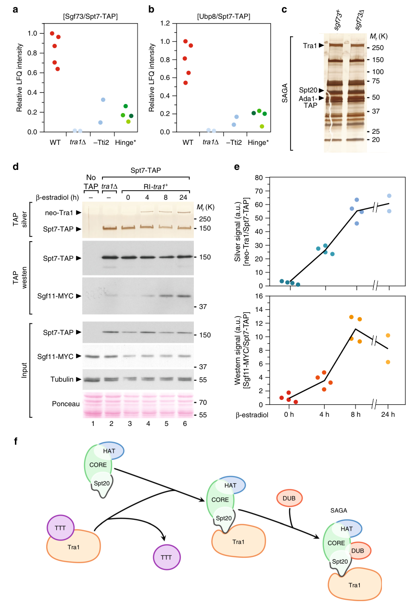

## Question

# Gene Research for Functional Annotation

## ⚠️ CRITICAL: Gene/Protein Identification Context

**BEFORE YOU BEGIN RESEARCH:** You MUST verify you are researching the CORRECT gene/protein. Gene symbols can be ambiguous, especially for less well-characterized genes from non-model organisms.

### Target Gene/Protein Identity (from UniProt):
- **UniProt Accession:** Q7LL15
- **Protein Description:** RecName: Full=SAGA complex subunit Sus1; AltName: Full=Transcription and mRNA export factor sus1 {ECO:0000255|HAMAP-Rule:MF_03046};
- **Gene Information:** Name=sus1; ORFNames=SPBC6B1.12c;
- **Organism (full):** Schizosaccharomyces pombe (strain 972 / ATCC 24843) (Fission yeast).
- **Protein Family:** Belongs to the ENY2 family. {ECO:0000255|HAMAP-
- **Key Domains:** TF_ENY2. (IPR018783); TF_EnY2_sf. (IPR038212); EnY2 (PF10163)

### MANDATORY VERIFICATION STEPS:

1. **Check if the gene symbol "sus1" matches the protein description above**
2. **Verify the organism is correct:** Schizosaccharomyces pombe (strain 972 / ATCC 24843) (Fission yeast).
3. **Check if protein family/domains align with what you find in literature**
4. **If you find literature for a DIFFERENT gene with the same or similar symbol, STOP**

### If Gene Symbol is Ambiguous or You Cannot Find Relevant Literature:

**DO NOT PROCEED WITH RESEARCH ON A DIFFERENT GENE.** Instead:
- State clearly: "The gene symbol 'sus1' is ambiguous or literature is limited for this specific protein"
- Explain what you found (e.g., "Found extensive literature on a different gene with the same symbol in a different organism")
- Describe the protein based ONLY on the UniProt information provided above
- Suggest that the protein function can be inferred from domain/family information

### Research Target:

Please provide a comprehensive research report on the gene **sus1** (gene ID: sus1, UniProt: Q7LL15) in SCHPO.

The research report should be a detailed narrative explaining the function, biological processes, and localization of the gene product. Citations should be given for all claims.

You should prioritize authoritative reviews and primary scientific literature when conducting research. You can supplement
this with annotations you find in gene/protein databases, but these can be outdated or inaccurate.

We are specifically interested in the primary function of the gene - for enzymes, what reaction is catalyzed, and what is the substrate specificity? For transporters, what is the substrate? For structural proteins or adapters, what is the broader structural role? For signaling molecules, what is the role in the pathway.

We are interested in where in or outside the cell the gene product carries out its function.

We are also interested in the signaling or biochemical pathways in which the gene functions. We are less interested in broad pleiotropic effects, except where these elucidate the precise role.

Include evidence where possible. We are interested in both experimental evidence as well as inference from structure, evolution, or bioinformatic analysis. Precise studies should be prioritized over high-throughput, where available.

## Output

Question: You are an expert researcher providing comprehensive, well-cited information.

Provide detailed information focusing on:
1. Key concepts and definitions with current understanding
2. Recent developments and latest research (prioritize 2023-2024 sources)
3. Current applications and real-world implementations
4. Expert opinions and analysis from authoritative sources
5. Relevant statistics and data from recent studies

Format as a comprehensive research report with proper citations. Include URLs and publication dates where available.
Always prioritize recent, authoritative sources and provide specific citations for all major claims.

# Gene Research for Functional Annotation

## ⚠️ CRITICAL: Gene/Protein Identification Context

**BEFORE YOU BEGIN RESEARCH:** You MUST verify you are researching the CORRECT gene/protein. Gene symbols can be ambiguous, especially for less well-characterized genes from non-model organisms.

### Target Gene/Protein Identity (from UniProt):
- **UniProt Accession:** Q7LL15
- **Protein Description:** RecName: Full=SAGA complex subunit Sus1; AltName: Full=Transcription and mRNA export factor sus1 {ECO:0000255|HAMAP-Rule:MF_03046};
- **Gene Information:** Name=sus1; ORFNames=SPBC6B1.12c;
- **Organism (full):** Schizosaccharomyces pombe (strain 972 / ATCC 24843) (Fission yeast).
- **Protein Family:** Belongs to the ENY2 family. {ECO:0000255|HAMAP-
- **Key Domains:** TF_ENY2. (IPR018783); TF_EnY2_sf. (IPR038212); EnY2 (PF10163)

### MANDATORY VERIFICATION STEPS:

1. **Check if the gene symbol "sus1" matches the protein description above**
2. **Verify the organism is correct:** Schizosaccharomyces pombe (strain 972 / ATCC 24843) (Fission yeast).
3. **Check if protein family/domains align with what you find in literature**
4. **If you find literature for a DIFFERENT gene with the same or similar symbol, STOP**

### If Gene Symbol is Ambiguous or You Cannot Find Relevant Literature:

**DO NOT PROCEED WITH RESEARCH ON A DIFFERENT GENE.** Instead:
- State clearly: "The gene symbol 'sus1' is ambiguous or literature is limited for this specific protein"
- Explain what you found (e.g., "Found extensive literature on a different gene with the same symbol in a different organism")
- Describe the protein based ONLY on the UniProt information provided above
- Suggest that the protein function can be inferred from domain/family information

### Research Target:

Please provide a comprehensive research report on the gene **sus1** (gene ID: sus1, UniProt: Q7LL15) in SCHPO.

The research report should be a detailed narrative explaining the function, biological processes, and localization of the gene product. Citations should be given for all claims.

You should prioritize authoritative reviews and primary scientific literature when conducting research. You can supplement
this with annotations you find in gene/protein databases, but these can be outdated or inaccurate.

We are specifically interested in the primary function of the gene - for enzymes, what reaction is catalyzed, and what is the substrate specificity? For transporters, what is the substrate? For structural proteins or adapters, what is the broader structural role? For signaling molecules, what is the role in the pathway.

We are interested in where in or outside the cell the gene product carries out its function.

We are also interested in the signaling or biochemical pathways in which the gene functions. We are less interested in broad pleiotropic effects, except where these elucidate the precise role.

Include evidence where possible. We are interested in both experimental evidence as well as inference from structure, evolution, or bioinformatic analysis. Precise studies should be prioritized over high-throughput, where available.

# Functional annotation report: *Schizosaccharomyces pombe sus1* (UniProt Q7LL15)

## Executive conclusion

The target is correctly identified as **Sus1, ORF SPBC6B1.12c, from *Schizosaccharomyces pombe***. An organism-specific study independently identifies the *S. pombe* Sus1 homolog as SPBC6B1.12c, consistent with the supplied UniProt accession Q7LL15, ENY2-family assignment, and TF_ENY2/EnY2 domains. This distinction is essential because most mechanistic “SUS1” literature concerns the budding-yeast *Saccharomyces cerevisiae* ortholog rather than Q7LL15 (윤진호2016분열효모에서trex2복합체의 pages 1-3).

The best-supported primary annotation is: **a small, non-catalytic nuclear adaptor/structural subunit of the SAGA histone-H2B deubiquitination module, with a probable conserved second role in TREX-2-mediated coupling of transcription to nuclear mRNA export**. In SAGA, Sus1 does not catalyze a reaction. Rather, it helps organize the DUB module containing Sgf73, Ubp8, Sgf11, and Sus1; **Ubp8 is the catalytic deubiquitinase** that removes monoubiquitin from histone H2B. Direct evidence for Q7LL15 in intact *S. pombe* TREX-2, at nuclear pores, or in a Sus1-specific export phenotype remains limited.

| Annotation claim | Direct S. pombe evidence | Conserved ortholog evidence | Confidence and caveat |
|---|---|---|---|
| **Identity: Sus1 = SPBC6B1.12c (Q7LL15)** | An S. pombe study explicitly identifies Sus1 as SPBC6B1.12c and constructed it for interaction testing (윤진호2016분열효모에서trex2복합체의 pages 1-3). | Sus1 and ENY2 homologs occur across fungi and metazoans, but ortholog studies do not independently verify accession Q7LL15. | **High:** Gene-to-ORF correspondence is independently supported; accession and strain assignment rely on the supplied UniProt record. |
| **ENY2-family small adaptor or structural subunit** | No direct structural or adaptor assay was found for Q7LL15. S. pombe SAGA proteomics and assembly experiments place Sus1 within the four-subunit DUB module (eliasvillalobos2019chaperonemediatedorderedassembly media a8392a6b). | Budding-yeast Sus1 forms a structural unit with Sgf11 and Ubp8; Sus1-Sgf11 remains associated under conditions that dissociate Ubp8, supporting a non-enzymatic assembly role (kohler2006themrnaexport pages 4-5, kohler2006themrnaexport pages 7-8). | **Moderate to high:** Family assignment and conserved architecture are strong, but no Q7LL15 structure or purified-protein binding assay was located. |
| **SAGA DUB-module member** | Affinity purification and quantitative mass spectrometry of S. pombe SAGA support a DUB module containing Sgf73, Ubp8, Sgf11, and Sus1; ordered-assembly experiments indicate that Tra1 promotes incorporation of this module (eliasvillalobos2019chaperonemediatedorderedassembly pages 1-2, eliasvillalobos2019chaperonemediatedorderedassembly media a8392a6b). | In S. cerevisiae, Sus1 copurifies and functionally associates with Ubp8 and Sgf11 in the SAGA DUB module (kohler2006themrnaexport pages 4-5, kohler2006themrnaexport pages 7-8). | **High:** This is the best-supported target-specific functional annotation. |
| **Non-catalytic role; Ubp8 supplies DUB activity** | S. pombe complex architecture includes Sus1 with Ubp8 in the DUB module, but no isolated Q7LL15 enzymatic assay was found (eliasvillalobos2019chaperonemediatedorderedassembly media a8392a6b). | Ubp8, not Sus1, is the catalytic H2B deubiquitinase; Sus1 supports DUB-module assembly, recruitment, and activity (calvo2017studyofthe pages 52-57, kohler2006themrnaexport pages 7-8, kohler2006themrnaexport pages 1-2). | **High:** Sus1 should not be annotated as an enzyme or assigned an independent reaction. Nucleosomal ubiquitinated H2B is the indirect substrate acted upon by Ubp8. |
| **TREX-2 component and transcription-export coupling** | SPBC6B1.12c was selected as the S. pombe Sus1 homolog in a TREX-2 study. However, the Sus1 two-hybrid construct autoactivated, so the study did not establish Cdc31-Sus1 binding or a complete Pci2-Sac3-Sus1-Cdc31 complex (윤진호2016분열효모에서trex2복합체의 pages 3-5, 윤진호2016분열효모에서trex2복합체의 pages 1-3). | S. cerevisiae Sus1 is shared by SAGA and TREX-2; SUS1 loss disrupts TREX-2 localization and mRNA export, supporting an adaptor role between transcription and export (calvo2017studyofthe pages 63-69, kramar2019decipheringmessengerribonucleoprotein pages 29-34). | **Moderate:** The conserved model is compelling, but direct biochemical evidence for Q7LL15 in intact S. pombe TREX-2 remains limited. |
| **Role in bulk nuclear mRNA export** | No Sus1-specific knockout, depletion, or rescue assay was found. Conditional repression of S. pombe cdc31 caused nuclear poly(A)-positive RNA accumulation, supporting the surrounding TREX-2 pathway but not proving Q7LL15 function (윤진호2016분열효모에서trex2복합체의 pages 3-5, 윤진호2016분열효모에서trex2복합체의 pages 1-3). | Budding-yeast Sus1 deficiency impairs poly(A)-positive mRNA export, and Sus1 associates with transcription and export machinery (calvo2017studyofthe pages 63-69, calvo2017studyofthe pages 57-63, rezano2024tumorigenesiscausedby pages 2-4). | **Moderate to low for direct evidence; moderate to high by orthology:** Annotate as inferred involvement in mRNA export, not as experimentally demonstrated for Q7LL15. |
| **Nuclear and potentially nuclear-pore-associated localization** | No direct Q7LL15 microscopy or fractionation evidence was found. Experimentally supported SAGA membership implies a nuclear chromatin-associated pool, but nuclear-pore residence was not demonstrated directly (eliasvillalobos2019chaperonemediatedorderedassembly media a8392a6b). | Budding-yeast Sus1 participates in nuclear-pore-associated TREX-2 and helps localize TREX-2 components and active genes at the nuclear periphery (calvo2017studyofthe pages 63-69, calvo2017studyofthe pages 201-210, capelson2023youarewho pages 18-19). | **Moderate for nuclear; low to moderate for nuclear-pore association:** Report potential nuclear-pore or nuclear-periphery localization through TREX-2 rather than definitive pore localization. |

*Table: Conservative annotation matrix separating direct Schizosaccharomyces pombe evidence from mechanistic inference based on Sus1 and ENY2 orthologs. It identifies both strongly supported functions and important target-specific evidence gaps.*

## 1. Identity verification and ambiguity control

- **Accession:** Q7LL15.
- **Gene/ORF:** *sus1* / SPBC6B1.12c.
- **Organism:** *Schizosaccharomyces pombe*, fission yeast; the supplied record specifies strain 972/ATCC 24843.
- **Protein class:** ENY2-family protein, carrying the TF_ENY2/EnY2 domain architecture supplied in the query.
- **Identity cross-check:** A 2016 *S. pombe* TREX-2 study identified Sus1 as SPBC6B1.12c and cloned it for yeast two-hybrid analysis, independently supporting the gene-to-protein correspondence (윤진호2016분열효모에서trex2복합체의 pages 1-3).

The symbol is nevertheless **literature-ambiguous across organisms**. Extensive work exists on *S. cerevisiae* Sus1 and mammalian ENY2, but those proteins are orthologs, not Q7LL15. Findings from them are used below only where explicitly labeled as conserved inference. Literature about budding-yeast *SUS1* RNA splicing is also not evidence about the intron structure or regulation of *S. pombe sus1*.

## 2. Primary molecular function

### 2.1 SAGA DUB-module adaptor

SAGA is a conserved, approximately 19-subunit transcriptional coactivator organized into functional modules for histone H3 acetylation, histone H2B deubiquitination, TBP loading, and structural scaffolding. A 2019 *S. pombe* study using affinity purification, silver staining, quantitative LC–MS/MS, conditional genetics, RNA-seq, and ChIP placed Sus1 in the SAGA DUB module with **Sgf73, Ubp8, and Sgf11** (publication: November 2019; DOI/URL: https://doi.org/10.1038/s41467-019-13243-w) (eliasvillalobos2019chaperonemediatedorderedassembly pages 1-2, eliasvillalobos2019chaperonemediatedorderedassembly media a8392a6b).

That work established an ordered assembly pathway: Hsp90–TTT assists maturation and incorporation of Tra1; Tra1 binds the SAGA core through Spt20; this promotes stable incorporation of the DUB module. Figure 8 shows reduced Sgf73 and Ubp8 recovery when Tra1 is deleted or its assembly is compromised, and kinetic experiments show newly synthesized Tra1 entering SAGA before stable accumulation of the DUB reporter Sgf11 (eliasvillalobos2019chaperonemediatedorderedassembly media a8392a6b). Thus, Q7LL15 is best regarded as a **structural/regulatory element of a chromatin-modifying module**, not as an autonomous enzyme.

### 2.2 Reaction and substrate specificity

Sus1 itself has **no established catalytic reaction or substrate specificity**. The associated enzymatic reaction belongs to Ubp8:

**monoubiquitinated nucleosomal histone H2B + H₂O → histone H2B + ubiquitin.**

Budding-yeast biochemical evidence shows Sus1 forming a structural unit with Sgf11 and Ubp8, supporting Ubp8 recruitment, DUB-module assembly, and promoter association. Ubp8 is explicitly the catalytic deubiquitinase, whereas Sus1 is an anchoring or regulatory protein (publication: October 2006; DOI/URL: https://doi.org/10.1091/mbc.e06-02-0098) (kohler2006themrnaexport pages 4-5, kohler2006themrnaexport pages 7-8, kohler2006themrnaexport pages 1-2). Because these detailed interaction experiments were performed in *S. cerevisiae*, the exact Q7LL15 interaction surfaces remain inferred, although their conservation is strongly consistent with its ENY2-family domains and direct placement in the *S. pombe* DUB module.

## 3. Biological processes and pathways

### 3.1 Chromatin regulation and RNA polymerase II transcription

Through SAGA, Sus1 participates in regulation of RNA polymerase II transcription. The immediate biochemical pathway is the dynamic control of histone H2B monoubiquitination, which influences transcription-associated chromatin states and cross-talk with other histone modifications. Sus1’s precise contribution is to stabilize or organize the Ubp8-containing DUB machinery, rather than recognize H2Bub or hydrolyze its isopeptide bond independently (calvo2017studyofthe pages 52-57, kohler2006themrnaexport pages 7-8).

The 2019 *S. pombe* study quantified the larger SAGA assembly pathway. Conditional Tti2 loss produced an approximately **tenfold reduction of Tra1 recovered with SAGA**, whereas Tra2 in NuA4 fell about twofold. RNA-seq at fold change ≥1.5 and *P*≤0.01 identified 184 differentially expressed genes after Tti2 depletion, 153 after Tra2 depletion, and 59 in *tra1Δ* cells. These measurements do not quantify Sus1 directly, but they show that assembly of the Tra1-dependent SAGA/DUB architecture containing Sus1 has measurable transcriptional consequences (eliasvillalobos2019chaperonemediatedorderedassembly pages 3-4, eliasvillalobos2019chaperonemediatedorderedassembly pages 2-3).

### 3.2 Probable TREX-2 role and transcription–export coupling

The conserved model assigns Sus1 a second role in TREX-2, a nuclear-pore-associated complex connecting transcription and messenger ribonucleoprotein biogenesis with export. In budding yeast, Sus1 is shared between SAGA and TREX-2; TREX-2 contains Sac3, Thp1, Sem1, Cdc31, and Sus1. Sus1 is recruited to activated promoters and coding regions, associates with transcription/export factors, and contributes to TREX-2 localization at nuclear pores. *SUS1* loss mislocalizes TREX-2 components and impairs poly(A)+ mRNA export and activated-gene positioning at the nuclear periphery (calvo2017studyofthe pages 63-69, kramar2019decipheringmessengerribonucleoprotein pages 29-34, calvo2017studyofthe pages 201-210).

For *S. pombe*, support is suggestive but incomplete. The 2016 study identified Pci2 as the Thp1 homolog, Sac3 as SPCC576.05, Dss1 as the Sem1 homolog, and Sus1 as SPBC6B1.12c. Conditional Cdc31 repression stopped growth and produced nuclear poly(A)+ RNA accumulation after **18 h at 30°C**, while Cdc31 overexpression did not create a bulk-export defect but increased cell length. Yeast two-hybrid assays supported Cdc31 interactions with Sac3 and Pci2 (윤진호2016분열효모에서trex2복합체의 pages 3-5, 윤진호2016분열효모에서trex2복합체의 pages 1-3).

Crucially, that experiment **did not directly prove a Cdc31–Sus1 interaction or complete Pci2–Sac3–Sus1–Cdc31 complex**: the Sus1 bait autoactivated the LacZ reporter, making the relevant result uninterpretable. Nor did it delete or deplete *sus1*. Therefore, “TREX-2 component involved in mRNA export” is a biologically plausible, conserved annotation for Q7LL15, but it is less directly supported than its SAGA DUB-module annotation (윤진호2016분열효모에서trex2복합체의 pages 3-5).

## 4. Cellular localization

The functionally relevant compartment is the **nucleus**.

1. **Chromatin-associated nuclear pool:** Direct *S. pombe* SAGA membership implies that Sus1 operates in the nucleus as part of a transcriptional chromatin-regulatory complex. SAGA is recruited to promoters and its DUB module acts on nucleosomal H2B (eliasvillalobos2019chaperonemediatedorderedassembly pages 1-2, eliasvillalobos2019chaperonemediatedorderedassembly media a8392a6b).
2. **Possible nuclear-pore/nuclear-periphery pool:** Ortholog evidence predicts a second Sus1 pool in TREX-2 at the nucleoplasmic face of nuclear pore complexes, where transcription and mRNP export are coupled. Budding-yeast Sus1 contributes to TREX-2 pore localization and active-gene tethering (calvo2017studyofthe pages 63-69, kramar2019decipheringmessengerribonucleoprotein pages 29-34).
3. **Evidence limitation:** No Q7LL15-specific fluorescence microscopy, fractionation, or nuclear-pore colocalization experiment was located. Consequently, “nuclear” is well supported, while “nuclear-pore-associated” should be annotated as inferred rather than experimentally demonstrated for this protein.

A September 2023 FEBS Letters review emphasizes the broader principle that nuclear-pore proteins and associated complexes can regulate chromatin both at pores and within the nuclear interior. Its discussion of Sus1/SAGA/export coupling is ortholog-based and does not supply new Q7LL15-specific localization data (DOI/URL: https://doi.org/10.1002/1873-3468.14728) (capelson2023youarewho pages 18-19).

## 5. Structural and evolutionary interpretation

The ENY2-family and TF_ENY2/EnY2 domain assignments agree with the expected role of a compact protein–protein interaction subunit. In budding yeast, Sus1 wraps around an N-terminal helix of Sgf11 and helps form the DUB-module structural entity; Sus1–Sgf11 remains associated under conditions that release Ubp8. These findings explain how a small ENY2-family protein can stabilize a multiprotein complex without possessing catalytic residues (calvo2017studyofthe pages 57-63, kohler2006themrnaexport pages 4-5, kohler2006themrnaexport pages 7-8).

Conservation across fungal Sus1 and metazoan ENY2 supports the inference that Q7LL15 uses the same general fold and adaptor logic. However, no purified Q7LL15 structure, direct binding constant, stoichiometric reconstitution, or target-specific mutational map was found. The domain/family evidence should therefore support—not replace—the direct *S. pombe* proteomic assignment.

## 6. Recent developments, applications, and expert assessment

### 6.1 Developments in 2023–2024

No 2023–2024 primary study specifically characterizing Q7LL15/SPBC6B1.12c was identified. Recent literature instead extends the significance of the conserved pathway:

- The 2023 nuclear-pore/chromatin review places Sus1-mediated SAGA–export coupling within a broader model in which pore-associated and intranuclear factors coordinate genome organization and transcription (capelson2023youarewho pages 18-19).
- A review published **19 December 2024** connects defective mammalian TREX-2 export with nuclear RNA accumulation, R-loop formation, transcription-coupled DNA damage, recombination, and genome instability. Mammalian TREX-2 contains ENY2, the Sus1-family ortholog, but the disease and therapeutic observations are not direct evidence about fission-yeast Q7LL15 (DOI/URL: https://doi.org/10.3390/ijms252413612) (rezano2024tumorigenesiscausedby pages 2-4, rezano2024tumorigenesiscausedby pages 1-2).

### 6.2 Current applications

Q7LL15 has no established clinical or industrial application. Its principal real-world value is as a **model-system component** for dissecting:

- modular assembly of transcriptional coactivators;
- coordination of histone ubiquitination with transcription;
- coupling of transcription, mRNP maturation, and nuclear export;
- how export defects can generate R-loops and genome instability.

The 2019 fission-yeast system—conditional assembly alleles, TAP purification, quantitative proteomics, RNA-seq, and ChIP—provides an experimentally tractable framework for testing Sus1 incorporation and function (eliasvillalobos2019chaperonemediatedorderedassembly pages 4-5, eliasvillalobos2019chaperonemediatedorderedassembly pages 5-6, eliasvillalobos2019chaperonemediatedorderedassembly pages 3-4). Mammalian TREX-2 components are being discussed as possible oncology targets because export disruption may sensitize cancer cells to chemotherapy, but this remains pathway-level translational reasoning and should not be interpreted as validation of Q7LL15 as a drug target (rezano2024tumorigenesiscausedby pages 2-4, rezano2024tumorigenesiscausedby pages 1-2).

## 7. Recommended functional annotation

**Primary annotation:**

> Sus1 is a small, non-catalytic ENY2-family adaptor/structural subunit of the *S. pombe* SAGA deubiquitination module. It helps assemble or stabilize the Sgf73–Ubp8–Sgf11–Sus1 module that regulates transcription-associated histone H2B deubiquitination; catalytic activity is supplied by Ubp8.

**Secondary annotation, with evidence qualifier:**

> By conservation with fungal Sus1 proteins and limited *S. pombe* TREX-2-pathway evidence, Sus1 probably also participates in nuclear TREX-2, coupling transcription/mRNP biogenesis to poly(A)+ mRNA export at the nuclear pore.

**Localization annotation:**

> Nuclear and chromatin-associated through SAGA; nuclear-pore/nuclear-periphery association through TREX-2 is probable but not directly demonstrated for Q7LL15.

## 8. Major evidence gaps

The most valuable next experiments would be endogenous Sus1 tagging followed by nuclear-pore colocalization, Sus1 affinity purification–mass spectrometry under SAGA- and TREX-2-selective conditions, *sus1* depletion with poly(A)+ RNA FISH and H2Bub immunoblotting, and rescue using interface mutants. These would distinguish Q7LL15’s SAGA and TREX-2 pools and determine whether its conserved export function is quantitatively important in fission yeast. At present, the **SAGA DUB-module annotation is high confidence**, whereas the **TREX-2/export and nuclear-pore annotations remain moderate-confidence orthology-based inferences**.

References

1. (윤진호2016분열효모에서trex2복합체의 pages 1-3): 고은진， 윤진호. 분열효모에서 trex-2 복합체의 구성요소인 cdc31 이 생장과 mrna export 에 미치는 영향. Unknown journal, 2016.

2. (eliasvillalobos2019chaperonemediatedorderedassembly media a8392a6b): Alberto Elías-Villalobos, Damien Toullec, Céline Faux, Martial Séveno, and Dominique Helmlinger. Chaperone-mediated ordered assembly of the saga and nua4 transcription co-activator complexes in yeast. Nov 2019. URL: https://doi.org/10.1038/s41467-019-13243-w, doi:10.1038/s41467-019-13243-w. This article has 38 citations and is from a highest quality peer-reviewed journal.

3. (kohler2006themrnaexport pages 4-5): Alwin Köhler, Pau Pascual-García, Ana Llopis, Meritxell Zapater, Francesc Posas, Ed Hurt, and Susana Rodríguez-Navarro. The mrna export factor sus1 is involved in spt/ada/gcn5 acetyltransferase-mediated h2b deubiquitinylation through its interaction with ubp8 and sgf11. Molecular biology of the cell, 17 10:4228-36, Oct 2006. URL: https://doi.org/10.1091/mbc.e06-02-0098, doi:10.1091/mbc.e06-02-0098. This article has 107 citations and is from a domain leading peer-reviewed journal.

4. (kohler2006themrnaexport pages 7-8): Alwin Köhler, Pau Pascual-García, Ana Llopis, Meritxell Zapater, Francesc Posas, Ed Hurt, and Susana Rodríguez-Navarro. The mrna export factor sus1 is involved in spt/ada/gcn5 acetyltransferase-mediated h2b deubiquitinylation through its interaction with ubp8 and sgf11. Molecular biology of the cell, 17 10:4228-36, Oct 2006. URL: https://doi.org/10.1091/mbc.e06-02-0098, doi:10.1091/mbc.e06-02-0098. This article has 107 citations and is from a domain leading peer-reviewed journal.

5. (eliasvillalobos2019chaperonemediatedorderedassembly pages 1-2): Alberto Elías-Villalobos, Damien Toullec, Céline Faux, Martial Séveno, and Dominique Helmlinger. Chaperone-mediated ordered assembly of the saga and nua4 transcription co-activator complexes in yeast. Nov 2019. URL: https://doi.org/10.1038/s41467-019-13243-w, doi:10.1038/s41467-019-13243-w. This article has 38 citations and is from a highest quality peer-reviewed journal.

6. (calvo2017studyofthe pages 52-57): PAULA OLIETE CALVO. Study of the saga deubiquitination module: identification of new modulators and its implication on spinocerebellar ataxia type 7. ArXiv, Sep 2017. URL: https://doi.org/10.4995/thesis/10251/86155, doi:10.4995/thesis/10251/86155. This article has 0 citations.

7. (kohler2006themrnaexport pages 1-2): Alwin Köhler, Pau Pascual-García, Ana Llopis, Meritxell Zapater, Francesc Posas, Ed Hurt, and Susana Rodríguez-Navarro. The mrna export factor sus1 is involved in spt/ada/gcn5 acetyltransferase-mediated h2b deubiquitinylation through its interaction with ubp8 and sgf11. Molecular biology of the cell, 17 10:4228-36, Oct 2006. URL: https://doi.org/10.1091/mbc.e06-02-0098, doi:10.1091/mbc.e06-02-0098. This article has 107 citations and is from a domain leading peer-reviewed journal.

8. (윤진호2016분열효모에서trex2복합체의 pages 3-5): 고은진， 윤진호. 분열효모에서 trex-2 복합체의 구성요소인 cdc31 이 생장과 mrna export 에 미치는 영향. Unknown journal, 2016.

9. (calvo2017studyofthe pages 63-69): PAULA OLIETE CALVO. Study of the saga deubiquitination module: identification of new modulators and its implication on spinocerebellar ataxia type 7. ArXiv, Sep 2017. URL: https://doi.org/10.4995/thesis/10251/86155, doi:10.4995/thesis/10251/86155. This article has 0 citations.

10. (kramar2019decipheringmessengerribonucleoprotein pages 29-34): M Kramar. Deciphering messenger ribonucleoprotein composition using single molecule resolution microscopy. Unknown journal, 2019.

11. (calvo2017studyofthe pages 57-63): PAULA OLIETE CALVO. Study of the saga deubiquitination module: identification of new modulators and its implication on spinocerebellar ataxia type 7. ArXiv, Sep 2017. URL: https://doi.org/10.4995/thesis/10251/86155, doi:10.4995/thesis/10251/86155. This article has 0 citations.

12. (rezano2024tumorigenesiscausedby pages 2-4): Andri Rezano, Naomi Gondo, Yasuhiro Sakai, Yuko Nakamura, Suchada Phimsen, Tokio Tani, Akihiko Ito, Seiji Okada, and Kazuhiko Kuwahara. Tumorigenesis caused by aberrant expression of ganp, a central component in the mammalian trex-2 complex—lessons from transcription-coupled dna damages. International Journal of Molecular Sciences, 25(24):13612, Dec 2024. URL: https://doi.org/10.3390/ijms252413612, doi:10.3390/ijms252413612. This article has 3 citations.

13. (calvo2017studyofthe pages 201-210): PAULA OLIETE CALVO. Study of the saga deubiquitination module: identification of new modulators and its implication on spinocerebellar ataxia type 7. ArXiv, Sep 2017. URL: https://doi.org/10.4995/thesis/10251/86155, doi:10.4995/thesis/10251/86155. This article has 0 citations.

14. (capelson2023youarewho pages 18-19): Maya Capelson. You are who your friends are—nuclear pore proteins as components of chromatin‐binding complexes. Sep 2023. URL: https://doi.org/10.1002/1873-3468.14728, doi:10.1002/1873-3468.14728. This article has 19 citations and is from a peer-reviewed journal.

15. (eliasvillalobos2019chaperonemediatedorderedassembly pages 3-4): Alberto Elías-Villalobos, Damien Toullec, Céline Faux, Martial Séveno, and Dominique Helmlinger. Chaperone-mediated ordered assembly of the saga and nua4 transcription co-activator complexes in yeast. Nov 2019. URL: https://doi.org/10.1038/s41467-019-13243-w, doi:10.1038/s41467-019-13243-w. This article has 38 citations and is from a highest quality peer-reviewed journal.

16. (eliasvillalobos2019chaperonemediatedorderedassembly pages 2-3): Alberto Elías-Villalobos, Damien Toullec, Céline Faux, Martial Séveno, and Dominique Helmlinger. Chaperone-mediated ordered assembly of the saga and nua4 transcription co-activator complexes in yeast. Nov 2019. URL: https://doi.org/10.1038/s41467-019-13243-w, doi:10.1038/s41467-019-13243-w. This article has 38 citations and is from a highest quality peer-reviewed journal.

17. (rezano2024tumorigenesiscausedby pages 1-2): Andri Rezano, Naomi Gondo, Yasuhiro Sakai, Yuko Nakamura, Suchada Phimsen, Tokio Tani, Akihiko Ito, Seiji Okada, and Kazuhiko Kuwahara. Tumorigenesis caused by aberrant expression of ganp, a central component in the mammalian trex-2 complex—lessons from transcription-coupled dna damages. International Journal of Molecular Sciences, 25(24):13612, Dec 2024. URL: https://doi.org/10.3390/ijms252413612, doi:10.3390/ijms252413612. This article has 3 citations.

18. (eliasvillalobos2019chaperonemediatedorderedassembly pages 4-5): Alberto Elías-Villalobos, Damien Toullec, Céline Faux, Martial Séveno, and Dominique Helmlinger. Chaperone-mediated ordered assembly of the saga and nua4 transcription co-activator complexes in yeast. Nov 2019. URL: https://doi.org/10.1038/s41467-019-13243-w, doi:10.1038/s41467-019-13243-w. This article has 38 citations and is from a highest quality peer-reviewed journal.

19. (eliasvillalobos2019chaperonemediatedorderedassembly pages 5-6): Alberto Elías-Villalobos, Damien Toullec, Céline Faux, Martial Séveno, and Dominique Helmlinger. Chaperone-mediated ordered assembly of the saga and nua4 transcription co-activator complexes in yeast. Nov 2019. URL: https://doi.org/10.1038/s41467-019-13243-w, doi:10.1038/s41467-019-13243-w. This article has 38 citations and is from a highest quality peer-reviewed journal.

## Artifacts

- [Edison artifact artifact-00](sus1-deep-research-falcon_artifacts/artifact-00.md)

## Citations

1. capelson2023youarewho pages 18-19
2. kohler2006themrnaexport pages 4-5
3. kohler2006themrnaexport pages 7-8
4. eliasvillalobos2019chaperonemediatedorderedassembly pages 1-2
5. calvo2017studyofthe pages 52-57
6. kohler2006themrnaexport pages 1-2
7. calvo2017studyofthe pages 63-69
8. kramar2019decipheringmessengerribonucleoprotein pages 29-34
9. calvo2017studyofthe pages 57-63
10. rezano2024tumorigenesiscausedby pages 2-4
11. calvo2017studyofthe pages 201-210
12. eliasvillalobos2019chaperonemediatedorderedassembly pages 3-4
13. eliasvillalobos2019chaperonemediatedorderedassembly pages 2-3
14. rezano2024tumorigenesiscausedby pages 1-2
15. eliasvillalobos2019chaperonemediatedorderedassembly pages 4-5
16. eliasvillalobos2019chaperonemediatedorderedassembly pages 5-6
17. https://doi.org/10.1038/s41467-019-13243-w
18. https://doi.org/10.1091/mbc.e06-02-0098
19. https://doi.org/10.1002/1873-3468.14728
20. https://doi.org/10.3390/ijms252413612
21. https://doi.org/10.1038/s41467-019-13243-w,
22. https://doi.org/10.1091/mbc.e06-02-0098,
23. https://doi.org/10.4995/thesis/10251/86155,
24. https://doi.org/10.3390/ijms252413612,
25. https://doi.org/10.1002/1873-3468.14728,