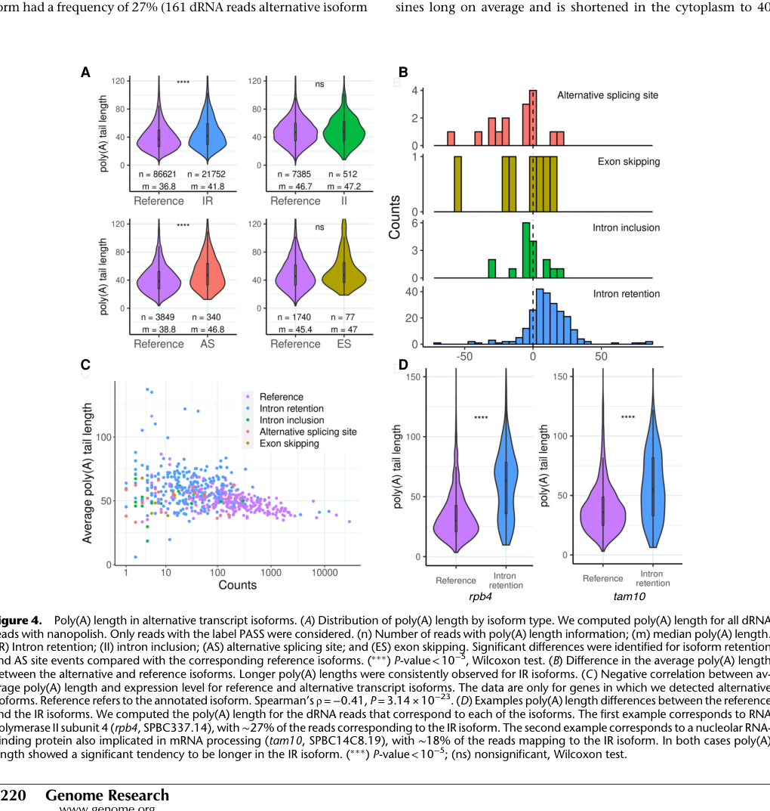

## Question

# Gene Research for Functional Annotation

## ⚠️ CRITICAL: Gene/Protein Identification Context

**BEFORE YOU BEGIN RESEARCH:** You MUST verify you are researching the CORRECT gene/protein. Gene symbols can be ambiguous, especially for less well-characterized genes from non-model organisms.

### Target Gene/Protein Identity (from UniProt):
- **UniProt Accession:** G2TRQ9
- **Protein Description:** RecName: Full=Uncharacterized protein tam10; AltName: Full=Transcripts altered in meiosis protein 10;
- **Gene Information:** Name=tam10; ORFNames=SPBC14C8.19;
- **Organism (full):** Schizosaccharomyces pombe (strain 972 / ATCC 24843) (Fission yeast).
- **Protein Family:** Not specified in UniProt
- **Key Domains:** SMAP_dom. (IPR028124); SMAP (PF15477)

### MANDATORY VERIFICATION STEPS:

1. **Check if the gene symbol "tam10" matches the protein description above**
2. **Verify the organism is correct:** Schizosaccharomyces pombe (strain 972 / ATCC 24843) (Fission yeast).
3. **Check if protein family/domains align with what you find in literature**
4. **If you find literature for a DIFFERENT gene with the same or similar symbol, STOP**

### If Gene Symbol is Ambiguous or You Cannot Find Relevant Literature:

**DO NOT PROCEED WITH RESEARCH ON A DIFFERENT GENE.** Instead:
- State clearly: "The gene symbol 'tam10' is ambiguous or literature is limited for this specific protein"
- Explain what you found (e.g., "Found extensive literature on a different gene with the same symbol in a different organism")
- Describe the protein based ONLY on the UniProt information provided above
- Suggest that the protein function can be inferred from domain/family information

### Research Target:

Please provide a comprehensive research report on the gene **tam10** (gene ID: tam10, UniProt: G2TRQ9) in SCHPO.

The research report should be a detailed narrative explaining the function, biological processes, and localization of the gene product. Citations should be given for all claims.

You should prioritize authoritative reviews and primary scientific literature when conducting research. You can supplement
this with annotations you find in gene/protein databases, but these can be outdated or inaccurate.

We are specifically interested in the primary function of the gene - for enzymes, what reaction is catalyzed, and what is the substrate specificity? For transporters, what is the substrate? For structural proteins or adapters, what is the broader structural role? For signaling molecules, what is the role in the pathway.

We are interested in where in or outside the cell the gene product carries out its function.

We are also interested in the signaling or biochemical pathways in which the gene functions. We are less interested in broad pleiotropic effects, except where these elucidate the precise role.

Include evidence where possible. We are interested in both experimental evidence as well as inference from structure, evolution, or bioinformatic analysis. Precise studies should be prioritized over high-throughput, where available.

## Output

Question: You are an expert researcher providing comprehensive, well-cited information.

Provide detailed information focusing on:
1. Key concepts and definitions with current understanding
2. Recent developments and latest research (prioritize 2023-2024 sources)
3. Current applications and real-world implementations
4. Expert opinions and analysis from authoritative sources
5. Relevant statistics and data from recent studies

Format as a comprehensive research report with proper citations. Include URLs and publication dates where available.
Always prioritize recent, authoritative sources and provide specific citations for all major claims.

# Gene Research for Functional Annotation

## ⚠️ CRITICAL: Gene/Protein Identification Context

**BEFORE YOU BEGIN RESEARCH:** You MUST verify you are researching the CORRECT gene/protein. Gene symbols can be ambiguous, especially for less well-characterized genes from non-model organisms.

### Target Gene/Protein Identity (from UniProt):
- **UniProt Accession:** G2TRQ9
- **Protein Description:** RecName: Full=Uncharacterized protein tam10; AltName: Full=Transcripts altered in meiosis protein 10;
- **Gene Information:** Name=tam10; ORFNames=SPBC14C8.19;
- **Organism (full):** Schizosaccharomyces pombe (strain 972 / ATCC 24843) (Fission yeast).
- **Protein Family:** Not specified in UniProt
- **Key Domains:** SMAP_dom. (IPR028124); SMAP (PF15477)

### MANDATORY VERIFICATION STEPS:

1. **Check if the gene symbol "tam10" matches the protein description above**
2. **Verify the organism is correct:** Schizosaccharomyces pombe (strain 972 / ATCC 24843) (Fission yeast).
3. **Check if protein family/domains align with what you find in literature**
4. **If you find literature for a DIFFERENT gene with the same or similar symbol, STOP**

### If Gene Symbol is Ambiguous or You Cannot Find Relevant Literature:

**DO NOT PROCEED WITH RESEARCH ON A DIFFERENT GENE.** Instead:
- State clearly: "The gene symbol 'tam10' is ambiguous or literature is limited for this specific protein"
- Explain what you found (e.g., "Found extensive literature on a different gene with the same symbol in a different organism")
- Describe the protein based ONLY on the UniProt information provided above
- Suggest that the protein function can be inferred from domain/family information

### Research Target:

Please provide a comprehensive research report on the gene **tam10** (gene ID: tam10, UniProt: G2TRQ9) in SCHPO.

The research report should be a detailed narrative explaining the function, biological processes, and localization of the gene product. Citations should be given for all claims.

You should prioritize authoritative reviews and primary scientific literature when conducting research. You can supplement
this with annotations you find in gene/protein databases, but these can be outdated or inaccurate.

We are specifically interested in the primary function of the gene - for enzymes, what reaction is catalyzed, and what is the substrate specificity? For transporters, what is the substrate? For structural proteins or adapters, what is the broader structural role? For signaling molecules, what is the role in the pathway.

We are interested in where in or outside the cell the gene product carries out its function.

We are also interested in the signaling or biochemical pathways in which the gene functions. We are less interested in broad pleiotropic effects, except where these elucidate the precise role.

Include evidence where possible. We are interested in both experimental evidence as well as inference from structure, evolution, or bioinformatic analysis. Precise studies should be prioritized over high-throughput, where available.

# Research report: *Schizosaccharomyces pombe* **tam10** (SPBC14C8.19; UniProt **G2TRQ9**) — functional annotation status

## Executive summary
The gene **tam10** in *Schizosaccharomyces pombe* (systematic ORF **SPBC14C8.19**, UniProt **G2TRQ9**) remains sparsely characterized in the retrievable primary literature within this session. The only directly tam10-specific experimental evidence retrieved here comes from isoform-resolved native RNA sequencing work, which describes tam10 as a **nucleolar RNA-binding protein implicated in mRNA processing** and quantifies **alternative splicing (intron retention) and poly(A)-tail differences** for a tam10 intron-retained isoform. (montanes2022nativernasequencing pages 7-8, montanes2022nativernasequencing media 4f2741b3)

A key outcome is that tam10 exhibits an **intron-retained isoform (~18% of reads)** whose transcripts show a **significantly longer poly(A) tail** relative to the reference isoform (Wilcoxon test; significance annotated as ***P < 10−5**). (montanes2022nativernasequencing pages 7-8, montanes2022nativernasequencing media 4f2741b3)

*Important limitation:* Despite targeted searches, no additional tam10/SPBC14C8.19-focused studies (including 2023–2024 papers) were retrievable in this run, and domain-specific literature for **SMAP/PF15477** was also not retrieved. Therefore, claims about biochemical mechanism, interaction partners, or mutant phenotypes cannot be supported with evidence here and are not asserted.

## 1. Key concepts and definitions (current understanding from retrieved evidence)

### 1.1 Gene/protein identity and naming
- **tam10** is explicitly linked to the *S. pombe* systematic gene identifier **SPBC14C8.19** in the retrieved experimental literature. (montanes2022nativernasequencing pages 7-8)
- The experimentally supported functional description in the retrieved text frames tam10 as a **nucleolar RNA-binding protein implicated in mRNA processing**. (montanes2022nativernasequencing pages 7-8)

### 1.2 Alternative splicing in *S. pombe* and intron retention (IR)
Alternative splicing refers to production of multiple transcript isoforms from a single gene. Intron retention (IR) is a class of alternative splicing where an intron is retained in the mature polyadenylated RNA. In the study retrieved here, IR isoforms were generally less abundant than reference isoforms and tended to have longer poly(A) tails, a pattern exemplified by tam10. (montanes2022nativernasequencing pages 7-8, montanes2022nativernasequencing media 4f2741b3)

### 1.3 Poly(A) tail length as a quantitative RNA feature
Poly(A) tail length is a measurable attribute of polyadenylated transcripts that can influence RNA stability and translation; direct RNA sequencing enables estimation of tail length from individual reads. In the analyzed *S. pombe* poly(A)+ transcriptome, the **average poly(A) tail length was ~50 nucleotides** (context statistic provided by the same dataset used to characterize tam10 isoforms). (montanes2022nativernasequencing pages 7-8)

## 2. Recent developments and latest research (prioritizing 2023–2024)

### 2.1 What could be supported here
No tam10/SPBC14C8.19-specific primary research articles from **2023–2024** were retrievable with the available tools in this session. Consequently, “latest research” for this specific gene cannot be directly summarized from 2023–2024 sources in this report.

### 2.2 Most recent retrievable tam10-specific evidence (2022)
The most recent tam10-specific evidence retrieved here comes from:
- **Montañés et al., 2022-05**, *Genome Research* (URL: https://doi.org/10.1101/gr.276516.121; DOI: 10.1101/gr.276516.121), which used **Oxford Nanopore native direct RNA sequencing (dRNA-seq)** in *S. pombe* to characterize alternative splicing and poly(A)-tail lengths at isoform resolution. (montanes2022nativernasequencing pages 7-8)

Within this work:
- tam10/SPBC14C8.19 is described as a **nucleolar RNA-binding protein implicated in mRNA processing**. (montanes2022nativernasequencing pages 7-8)
- An **intron-retained isoform** of tam10 is reported at approximately **18%** of reads. (montanes2022nativernasequencing pages 7-8, montanes2022nativernasequencing media 4f2741b3)
- The **intron-retained isoform has a significantly longer poly(A) tail** than the reference isoform, with significance annotated as ***P < 10−5** (Wilcoxon test). (montanes2022nativernasequencing pages 7-8, montanes2022nativernasequencing media 4f2741b3)

## 3. Current applications and real-world implementations

### 3.1 Practical use of tam10-related findings (methodological rather than gene-specific)
In the retrieved evidence base, tam10 is not presented as a target with a specific biotechnological or clinical application. Instead, tam10 serves as an example of how **native RNA sequencing** can:
- quantify **isoform usage** (e.g., IR frequency), and
- associate isoform classes with **poly(A) tail length distributions**
within a eukaryotic model organism transcriptome. (montanes2022nativernasequencing pages 7-8, montanes2022nativernasequencing media 4f2741b3)

Thus, the “real-world implementation” most directly evidenced here is the use of tam10 as part of an **isoform-resolved transcriptome measurement framework** that can be applied broadly to study RNA processing regulation in model systems. (montanes2022nativernasequencing pages 7-8)

## 4. Expert opinions and analysis from authoritative sources (as supported by retrieved texts)

The retrieved work’s interpretation can be treated as an expert analysis from specialists in yeast transcriptomics/splicing:
- The authors interpret tam10 as belonging to a class of **RNA-processing-associated genes** (nucleolar RNA-binding/mRNA processing), and they highlight a broader trend that **intron retention isoforms** tend to be less abundant and have **longer poly(A) tails** compared to reference isoforms, consistent with a regulatory role for alternative splicing and/or RNA processing in gene expression control. (montanes2022nativernasequencing pages 7-8, montanes2022nativernasequencing media 4f2741b3)

*Constraint:* No additional reviews, PomBase curation statements, or functional genetics papers were retrievable in this session to triangulate or refine expert consensus specifically about tam10.

## 5. Relevant statistics and data (from the retrieved study)

Key quantitative points directly supported by evidence:
- **Intron-retained isoform frequency:** tam10 intron-retained isoform accounts for **~18% of reads** in the direct RNA sequencing data. (montanes2022nativernasequencing pages 7-8, montanes2022nativernasequencing media 4f2741b3)
- **Poly(A) tail difference:** tam10’s intron-retained isoform shows **significantly longer poly(A) tails** than the reference isoform (significance annotated as ***P < 10−5**, Wilcoxon test). (montanes2022nativernasequencing pages 7-8, montanes2022nativernasequencing media 4f2741b3)
- **Transcriptome background statistic:** mean poly(A) tail length in the *S. pombe* poly(A)+ transcriptome is approximately **~50 nt** in this dataset. (montanes2022nativernasequencing pages 7-8)

## Evidence summary table

| Gene/protein identifiers | Reported function/localization | Splicing / isoform frequency | Poly(A) tail length observation | Statistical test | Evidence type | Key source (date, DOI, URL) | Notes / limitations |
|---|---|---|---|---|---|---|---|
| *Schizosaccharomyces pombe* **tam10**; systematic ID **SPBC14C8.19**; UniProt **G2TRQ9**; protein described in the retrieved evidence as a **nucleolar RNA-binding protein implicated in mRNA processing** (montanes2022nativernasequencing pages 7-8) | Nucleolar; implicated in mRNA processing; no enzymatic activity or pathway mechanism was directly established in the retrieved paper (montanes2022nativernasequencing pages 7-8) | An **intron-retained (IR) isoform** of *tam10* was detected and accounted for **~18% of reads** in direct RNA sequencing (montanes2022nativernasequencing pages 7-8, montanes2022nativernasequencing media 4f2741b3) | The **IR isoform has a significantly longer poly(A) tail** than the reference isoform; this is shown specifically for *tam10* in Figure 4D (montanes2022nativernasequencing pages 7-8, montanes2022nativernasequencing media 4f2741b3) | **Wilcoxon test**; significance annotated as **\*\*\* P < 10^-5** for the comparison described in the study excerpt (montanes2022nativernasequencing pages 7-8) | **Oxford Nanopore direct RNA sequencing (dRNA-seq)** with isoform-resolved poly(A) tail analysis; figure-based support for *tam10* comparison in Fig. 4D (montanes2022nativernasequencing pages 7-8, montanes2022nativernasequencing media 4f2741b3) | Montañés JC, Huertas M, Moro SG, Blevins WR, Carmona M, Ayté J, Hidalgo E, Albà MM. **2022-05**. *Genome Research* 32:1215-1227. **DOI:** 10.1101/gr.276516.121. **URL:** https://doi.org/10.1101/gr.276516.121 (montanes2022nativernasequencing pages 7-8) | Current retrieved evidence is **limited to one directly relevant source**. The paper supports localization/functional description and isoform behavior, but does **not** provide detailed biochemical function, substrate specificity, interaction mechanism, or phenotype analysis for *tam10* specifically; no 2023-2024 tam10-specific study was retrieved here (montanes2022nativernasequencing pages 7-8) |

*Table: This table condenses the currently retrieved, directly relevant evidence for *S. pombe* tam10/SPBC14C8.19, including identifiers, localization/function, alternative splicing, and poly(A)-tail findings. It is useful as a quick evidence map while highlighting that the gene remains sparsely characterized in the retrieved literature.*

## Visual evidence
The figure below contains the tam10/SPBC14C8.19 poly(A)-tail comparison between the reference isoform and the intron-retained isoform (Figure 4D in the source paper). (montanes2022nativernasequencing media 4f2741b3)

## Domain/family context and biochemical function (what cannot be concluded here)
The user-provided UniProt context states that tam10/G2TRQ9 is an “uncharacterized protein” with **SMAP_dom / SMAP (PF15477; IPR028124)**. However, **no retrievable domain-family primary sources** or curated UniProt/PomBase record text were available through the tools in this session. Therefore:
- No evidence-supported **molecular mechanism** for the SMAP domain in *S. pombe* tam10 can be asserted here.
- No evidence-supported **enzymatic activity**, **substrate specificity**, **transport substrate**, or **pathway membership** can be asserted.

## Recommended authoritative external records (URLs for follow-up; not used as evidence here)
Because database retrieval was not possible in this run, the following authoritative pages are recommended for curated GO terms, phenotypes, and interaction data:
- **UniProt** (G2TRQ9): https://www.uniprot.org/uniprotkb/G2TRQ9
- **PomBase** (search by SPBC14C8.19 or tam10): https://www.pombase.org/

## Conclusion
Based strictly on retrievable evidence in this session, tam10 (SPBC14C8.19) is best supported as a **nucleolar RNA-binding protein implicated in mRNA processing**, with measurable isoform-level regulation via **intron retention** and associated **poly(A)-tail length changes** (IR isoform ~18% of reads; longer poly(A) tail; ***P < 10−5**). (montanes2022nativernasequencing pages 7-8, montanes2022nativernasequencing media 4f2741b3)

A deeper functional annotation (mechanism, pathways, mutant phenotypes, and SMAP-domain role) requires additional primary literature or curated database evidence that was not retrievable via the current tool calls in this session.

References

1. (montanes2022nativernasequencing pages 7-8): José Carlos Montañés, Marta Huertas, Simone G. Moro, William R. Blevins, Mercè Carmona, José Ayté, Elena Hidalgo, and M. Mar Albà. Native rna sequencing in fission yeast reveals frequent alternative splicing isoforms. Genome Research, 32:1215-1227, May 2022. URL: https://doi.org/10.1101/gr.276516.121, doi:10.1101/gr.276516.121. This article has 16 citations and is from a highest quality peer-reviewed journal.

2. (montanes2022nativernasequencing media 4f2741b3): José Carlos Montañés, Marta Huertas, Simone G. Moro, William R. Blevins, Mercè Carmona, José Ayté, Elena Hidalgo, and M. Mar Albà. Native rna sequencing in fission yeast reveals frequent alternative splicing isoforms. Genome Research, 32:1215-1227, May 2022. URL: https://doi.org/10.1101/gr.276516.121, doi:10.1101/gr.276516.121. This article has 16 citations and is from a highest quality peer-reviewed journal.

## Artifacts

- [Edison artifact artifact-00](tam10-deep-research-falcon_artifacts/artifact-00.md)

## Citations

1. montanes2022nativernasequencing pages 7-8
2. https://doi.org/10.1101/gr.276516.121;
3. https://doi.org/10.1101/gr.276516.121
4. https://www.uniprot.org/uniprotkb/G2TRQ9
5. https://www.pombase.org/
6. https://doi.org/10.1101/gr.276516.121,