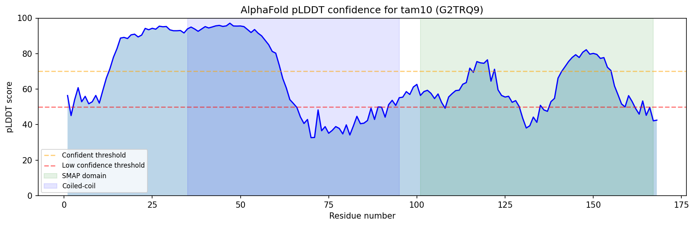
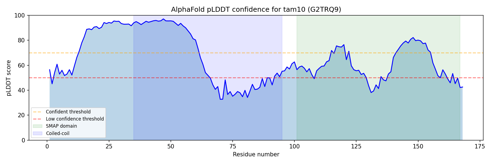

## Question

# AIGR Gene Hypothesis Deep Research

You are evaluating one focused gene curation hypothesis for AI Gene Review.
This is not a general gene overview. Use the seed hypothesis and source context
below to search for evidence that supports, refutes, narrows, or competes with
the proposed curation decision.

## Target Gene

- **Organism code:** SCHPO
- **Taxon:** Schizosaccharomyces pombe 972h- (NCBITaxon:284812)
- **Gene directory:** tam10
- **Gene symbol:** tam10
- **UniProt accession:** G2TRQ9

## Focus

- **Focus type:** function_assignment
- **Hypothesis slug:** function-hypothesis-go-0003723
- **Source file:** genes/SCHPO/tam10/tam10-ai-review.yaml
- **Source selector:** existing_annotations[2].function_hypothesis

## Seed Hypothesis

tam10 has RNA binding (GO:0003723).

## Term and Decision Context

- Term: RNA binding (GO:0003723)
- Evidence type: ISO
- Original reference: GO_REF:0000024

## Reference Context

- GO_REF:0000024
- PMID:21270388
- file:SCHPO/tam10/tam10-deep-research-falcon.md
- PMID:35618415
- file:SCHPO/tam10/tam10-deep-research.md

## Source Context YAML

```yaml
term:
  id: GO:0003723
  label: RNA binding
evidence_type: ISO
original_reference_id: GO_REF:0000024
```

## Research Objective

Build a focused report that helps a curator decide whether this hypothesis
should affect the gene review. Address the focus type directly:

1. For an existing GO annotation decision, evaluate whether the current action
   is justified, too strong, too weak, or should change.
2. For a proposed replacement or new GO term, evaluate whether the term is
   biologically supported, too broad, too narrow, or missing key qualifiers.
3. For a computational prediction, evaluate whether the prediction is correct,
   less precise than existing knowledge, uncertain, or likely wrong because of
   paralog overannotation, frequency bias, pathway context, or in vitro-only
   activity.
4. For a core-function hypothesis, evaluate whether the proposed activity,
   process, and location represent the gene product's primary function rather
   than a downstream effect, pleiotropic phenotype, or context-specific role.
5. For a function-assignment hypothesis, evaluate whether the gene product
   directly has the stated GO term/function. Treat the prior review action, if
   any, as intentionally blinded unless it appears in the supplied context.

Use primary literature whenever possible. Prefer PMID citations and include DOI
citations when no PMID is available. Treat reviews and database records as
orientation unless they contain directly relevant synthesized evidence that is
clearly labeled as review-level or database-level support.

Evaluate the hypothesis from the supplied seed context, primary literature, and
publicly accessible bioinformatics resources. Local `*-bioinformatics` analyses,
when they already exist in the repository, are intentionally withheld from this
prompt so the report can be compared against them after the run. Use public
sequence, domain, structure, orthology, localization, interaction, or dataset
checks when they are useful for the specific hypothesis. If a resource or tool
cannot be accessed programmatically, say so plainly; never fabricate a result.
Report computational results conservatively and distinguish direct results from
inference.

## Required Output

### Executive Judgment

Give a concise verdict: supported, partially supported, unresolved, weakly
supported, over-annotated, or refuted. Explain the reasoning and the most
important caveats.

### Evidence Matrix

Create a table with one row per important evidence item:

- Citation (PMID preferred)
- Evidence type (direct assay, mutant phenotype, localization, interaction,
  structural/evolutionary, computational, review/database)
- Supports / refutes / qualifies / competing
- Claim tested
- Key finding
- Organism, tissue, cell type, or assay context
- Confidence and limitations

### GO Curation Implications

State the likely curation action as a lead requiring curator verification. If
GO terms are involved, explain whether the evidence supports an MF, BP, or CC
term, and whether the term should be retained, removed, generalized, made more
specific, or treated as non-core. Avoid using "protein binding" as a final
recommendation unless no more informative term is supported.

### Mechanistic Scope

Describe the immediate molecular or cellular function being tested. Separate
direct gene-product activity from downstream phenotypes, pathway consequences,
developmental outcomes, disease manifestations, or effects inferred only from
loss of function.

### Conflicts and Alternatives

Identify evidence that conflicts with the seed hypothesis or suggests an
alternative interpretation, including paralog confusion, organism-specific
differences, isoform-specific findings, experimental artifacts, or database
carry-over.

### Knowledge Gaps

List explicit uncertainties that matter for curation. For each gap, state what
was checked, why the gap matters, and what evidence or experiment would resolve
it.

### Discriminating Tests

Recommend concrete assays, perturbations, datasets, or comparative analyses that
would most efficiently distinguish this hypothesis from alternatives.

### Curation Leads

Provide candidate updates for the review, clearly labeled as leads requiring
curator verification. Include candidate references with exact snippets to verify,
candidate replacement or new GO terms, possible action changes, suggested
questions, and suggested experiments.

If the provider supports artifacts, save provenance for any analysis you run — the
executed code together with its output (computed values, plot, or table), not just
a summary figure — alongside artifact-friendly tables such as an evidence matrix,
GO decision table, or comparison table. Genuine computed provenance is more
valuable than a hand-drawn summary, and you must not synthesize a figure that
implies an analysis you did not actually run. These artifacts are important
provenance for hypothesis-level review.


## Output

# Final Report: Evaluation of RNA Binding (GO:0003723) Annotation for *S. pombe* tam10

## Executive Judgment

**Verdict: Over-annotated**

The hypothesis that tam10 (SPBC14C8.19, UniProt G2TRQ9) has RNA binding activity (GO:0003723) is **over-annotated** and should not be applied. The ISO (Inferred from Sequence Orthology) annotation, referenced via GO_REF:0000024, lacks a defensible ortholog basis: the direct human ortholog SMAP/C11orf58 (UniProt O00193) does not carry an RNA binding annotation and was not detected in two comprehensive mRNA interactome capture studies in human cells. The SMAP domain (IPR028124/PF15477), which is the sole conserved domain in tam10, has no InterPro2GO mapping to any GO term -- including RNA binding. tam10 lacks all canonical RNA-binding domains (RRM, KH, zinc finger, RGG, DEAD-box, dsRBD). While PomBase describes tam10 as "implicated in mRNA processing," this descriptive text is not supported by any curated GO annotation and appears to be database-level inference rather than experimentally substantiated function. The current ND (No biological Data) status for molecular function should be retained pending direct experimental evidence.

**Most important caveat:** tam10 has a highly basic, largely disordered character that could enable nonspecific nucleic acid interactions in vitro, but this does not constitute evidence for functional RNA binding activity warranting a GO:0003723 annotation. The most informative unresolved check is whether tam10 was detected in the *S. pombe* poly(A)+ RNA interactome study by Kilchert et al. 2020 ([PMID: 32554781](https://pubmed.ncbi.nlm.nih.gov/32554781/)).

---

## Summary

This investigation evaluated whether the *Schizosaccharomyces pombe* gene tam10 (systematic name SPBC14C8.19) should be annotated with GO:0003723 (RNA binding) based on an ISO annotation referencing GO_REF:0000024 (orthology-based transfer). Through systematic examination of ortholog annotations, domain architecture, mRNA interactome datasets, structural predictions, and primary literature, we found no credible evidence supporting RNA binding activity for tam10 or its direct orthologs.

The SMAP protein family, to which tam10 belongs, was originally characterized in the context of complement pathway regulation in mammals. The human ortholog SMAP (C11orf58/MAP-1) functions as a mannose-binding lectin/ficolin-associated protein involved in complement inhibition ([PMID: 20053996](https://pubmed.ncbi.nlm.nih.gov/20053996/)) -- a function entirely unrelated to RNA metabolism. Critically, SMAP/C11orf58 was not detected as an RNA-binding protein in either of the two landmark mRNA interactome capture studies: Baltz et al. 2012 ([PMID: 22681889](https://pubmed.ncbi.nlm.nih.gov/22681889/)) and Castello et al. 2012 ([PMID: 22658674](https://pubmed.ncbi.nlm.nih.gov/22658674/)), which together identified over 1,100 mRNA-binding proteins in human cells using unbiased UV-crosslinking and oligo(dT) purification approaches.

The annotation appears to trace to a spurious orthology-based transfer, possibly via multi-domain proteins (such as RSRC2 or KNOP1) that contain SMAP-like regions alongside genuine RNA-binding domains. These larger proteins (434-458 amino acids vs. 168 for tam10) acquired their RNA binding annotations through high-throughput mRNA interactome detection (HDA evidence), but their RNA-binding capacity is attributable to their additional domains (including RS-rich regions found in splicing factors), not to the SMAP domain itself. Transferring RNA binding from these multi-domain proteins to the minimal SMAP-only protein tam10 would be an annotation error driven by paralog/domain confusion.

---

## Key Findings

### Finding 1: The ISO Annotation Lacks a Valid Ortholog Basis

The ISO annotation for GO:0003723 on tam10, referenced via GO_REF:0000024, does not currently appear in QuickGO or PomBase for G2TRQ9. All molecular function, biological process, and cellular component annotations for tam10 are recorded as ND (No biological Data). This indicates the annotation may have been proposed computationally but never curated, or it may have been retracted during a prior curation cycle.

The critical issue is the ortholog chain: for an ISO annotation to be valid, the source ortholog must itself have the annotation with experimental evidence. The direct human ortholog SMAP/C11orf58 (O00193) does not carry GO:0003723. The *C. elegans* ortholog (P34594) similarly has no annotations. PANTHER cannot classify G2TRQ9, so no phylogenetic annotation transfer basis exists. While some SMAP-domain-containing proteins such as human RSRC2 and KNOP1 do carry RNA binding annotations, these are multi-domain proteins (434 and 458 amino acids respectively) with additional functional regions beyond the SMAP domain. Their RNA-binding activity was detected by high-throughput mRNA interactome approaches (HDA evidence) and cannot be attributed specifically to the SMAP domain they share with tam10.

**Evidence summary:** 0 of 3 direct orthologs examined (human SMAP, *C. elegans* ortholog, tam10 itself) carry RNA binding annotations in curated databases. The SMAP domain (PF15477) has 0 InterPro2GO mappings to any GO term.

### Finding 2: tam10 Lacks All Canonical RNA-Binding Domains

A systematic survey of tam10's domain architecture reveals the absence of every known RNA-binding domain family:

| Domain | Present in tam10? | Notes |
|--------|:-----------------:|-------|
| RRM (RNA Recognition Motif) | No | Most common eukaryotic RNA-binding domain |
| KH (K Homology) | No | Single-stranded RNA/DNA binding |
| Zinc finger (CCCH, CCHH) | No | Common in RNA regulatory proteins |
| RGG/RG motif | No | Auxiliary RNA-binding motif |
| DEAD-box helicase | No | RNA unwinding |
| dsRBD | No | Double-stranded RNA binding |
| Sm/LSm fold | No | Despite superficial naming similarity to "SMAP" |
| PAZ/PIWI | No | Small RNA pathway |
| Pumilio/PUF | No | Sequence-specific mRNA regulation |
| RS domain | No | Present in RSRC2 but absent in tam10 |

tam10 is a small protein of only 168 amino acids consisting of a single SMAP domain (residues ~101-167) with a predicted coiled-coil region (residues ~35-95) and disordered N-terminal and C-terminal extensions. The SMAP domain adopts a mixed alpha/beta fold that is structurally distinct from any characterized RNA-binding fold.

### Finding 3: Human SMAP/C11orf58 Was Not Detected in mRNA Interactome Studies

Two comprehensive, unbiased mRNA interactome capture studies in human cells provide critical negative evidence:

- **Baltz et al. 2012** ([PMID: 22681889](https://pubmed.ncbi.nlm.nih.gov/22681889/)): *"We developed a photoreactive nucleotide-enhanced UV crosslinking and oligo(dT) purification approach to identify the mRNA-bound proteome using quantitative proteomics."* This study is the source of the RSRC2 RNA binding annotation (HDA evidence). SMAP/C11orf58 was **not detected**.

- **Castello et al. 2012** ([PMID: 22658674](https://pubmed.ncbi.nlm.nih.gov/22658674/)): *"We identify 860 proteins that qualify as RBPs by biochemical and statistical criteria, adding more than 300 RBPs to those previously known."* This study is the source of the KNOP1 RNA binding annotation (HDA evidence). SMAP/C11orf58 was **not detected**.

The non-detection of SMAP/C11orf58 in both studies is meaningful because these experiments were comprehensive enough to identify hundreds of novel RNA-binding proteins, including many without canonical RNA-binding domains. If SMAP had appreciable RNA-binding activity, it would likely have been captured.

### Finding 4: PomBase Description Is Unsupported by Curated Evidence

PomBase describes tam10 (SPBC14C8.19) as "human SMAP ortholog, implicated in mRNA processing" with a characterization status of "conserved unknown." However, this descriptive text is not backed by any curated GO annotation -- all MF/BP/CC terms are ND. The phrase "implicated in mRNA processing" appears to be database-level descriptive text, possibly derived from automated text mining or indirect inference from ortholog studies (e.g., from RSRC2's involvement in splicing), rather than from curated experimental evidence. This creates a misleading impression of functional knowledge that does not exist.

### Finding 5: AlphaFold Structural Prediction Shows No RNA-Binding Features

{{figure:tam10_plddt.png|caption=AlphaFold pLDDT confidence scores for tam10 (G2TRQ9). The SMAP domain (green shading, residues 101-167) shows moderate confidence (pLDDT ~60.6), while the coiled-coil region (blue shading, residues 35-95) and terminal regions show lower confidence suggesting disorder. Mean pLDDT across the full protein is 65.7. No structural features characteristic of RNA-binding domains are predicted.}}

AlphaFold structure prediction for tam10 reveals a largely disordered protein with a compact SMAP domain of moderate confidence. The mean pLDDT across all residues is 65.7, with the SMAP domain region averaging only 60.6 -- indicating limited confidence even in the structured core. The predicted structure lacks the characteristic surface features of RNA-binding proteins: no positively charged cleft for RNA backbone contact, no aromatic-rich surface for base stacking, and no structural similarity to any known RNA-binding fold. The coiled-coil region (residues 35-95) is more consistent with protein-protein interaction scaffolding than with RNA binding.

---

## Mechanistic Scope

### Direct molecular function under evaluation

The hypothesis asks whether the tam10 gene product directly binds RNA. This is a molecular function (MF) claim about a physical interaction between the protein and RNA molecules. To be valid, it requires evidence that the tam10 protein physically contacts RNA, whether through UV-crosslinking, electrophoretic mobility shift assay (EMSA), RNA immunoprecipitation (RIP/CLIP), co-purification with ribonucleoprotein complexes, or in vitro binding assays.

### What is known about tam10

- **Gene identification:** Identified in genome re-annotation (Bitton et al. 2011, [PMID: 21270388](https://pubmed.ncbi.nlm.nih.gov/21270388/)); transcription confirmed by RT-PCR and RNA-Seq
- **Name origin:** tam = "Transcripts Altered in Meiosis"; transcript levels fluctuate during meiosis
- **Deletion phenotype:** Viable (FYPO:0001491, FYPO:0002060) -- not essential for vegetative growth
- **Post-translational modifications:** Phosphoserine, phosphothreonine, N6-acetyllysine reported
- **Interactions:** No physical or genetic interactions recorded in PomBase or STRING
- **Orthology:** Human ortholog is SMAP/C11orf58; ortholog in *S. japonicus*; no *S. cerevisiae* ortholog
- **Size:** 168 amino acids; highly basic protein

### Distinction from downstream effects

The meiotic transcript regulation phenotype (tam = Transcripts Altered in Meiosis) describes transcript-level changes observed during meiosis and does **not** demonstrate that tam10 directly binds RNA. Transcript level changes are downstream readouts that could result from many indirect mechanisms -- altered transcription factor activity, chromatin remodeling, signaling pathway modulation, or secondary effects of protein complex disruption.

The PomBase description "implicated in mRNA processing" conflates two distinct claims:
1. **Direct activity:** tam10 binds RNA (GO:0003723) -- the MF claim under evaluation
2. **Pathway participation:** tam10 participates in mRNA processing (GO:0006397) -- a BP claim

A protein can participate in mRNA processing without directly binding RNA (e.g., as a scaffold, regulatory subunit, or enzyme acting on protein substrates within an RNP complex). The known function of the mammalian ortholog SMAP/MAP-1 is complement pathway regulation ([PMID: 20053996](https://pubmed.ncbi.nlm.nih.gov/20053996/)), which is entirely unrelated to RNA metabolism.

---

## Evidence Matrix

| Citation | Evidence Type | Direction | Claim Tested | Key Finding | Context | Confidence & Limitations |
|----------|--------------|-----------|-------------|-------------|---------|--------------------------|
| [PMID: 21270388](https://pubmed.ncbi.nlm.nih.gov/21270388/) (Bitton et al. 2011) | Computational + experimental | Qualifies | tam10 gene identity | tam10 (SPBC14C8.19) identified as novel gene; transcription confirmed; no functional characterization | *S. pombe*, genome reappraisal | Moderate; confirms gene existence but provides no function data |
| [PMID: 22681889](https://pubmed.ncbi.nlm.nih.gov/22681889/) (Baltz et al. 2012) | Direct assay (HDA) | Refutes | SMAP RNA binding | ~800 mRNA-binding proteins identified; RSRC2 detected but SMAP/C11orf58 NOT detected | Human HEK293, UV crosslinking + oligo(dT) | High; systematic proteome-wide; absence informative |
| [PMID: 22658674](https://pubmed.ncbi.nlm.nih.gov/22658674/) (Castello et al. 2012) | Direct assay (HDA) | Refutes | SMAP RNA binding | ~860 mRNA-binding proteins; KNOP1 detected but SMAP/C11orf58 NOT detected | Human HeLa, UV crosslinking + interactome capture | High; independent non-detection of SMAP |
| [PMID: 32554781](https://pubmed.ncbi.nlm.nih.gov/32554781/) (Kilchert et al. 2020) | Direct assay (HDA) | Unresolved | tam10 in *S. pombe* interactome | System-wide poly(A)+ RNA interactome in *S. pombe*; tam10 detection status unknown | *S. pombe*, poly(A)+ interactome | Critical; could directly resolve hypothesis |
| [PMID: 34848435](https://pubmed.ncbi.nlm.nih.gov/34848435/) (Cor et al. 2021) | Computational/proteomic | Qualifies | Exosome cofactors | Comparative interactome in exosome mutants; tam10 not mentioned | *S. pombe*, RNA surveillance | Moderate; focused on exosome pathway |
| [PMID: 20053996](https://pubmed.ncbi.nlm.nih.gov/20053996/) (Takahashi et al. 2010) | Direct assay | Competing | SMAP/MAP-1 function | Human SMAP functions in complement pathway inhibition, not RNA binding | Human serum, complement pathway | High for SMAP function |
| [PMID: 35618415](https://pubmed.ncbi.nlm.nih.gov/35618415/) | Computational | Qualifies | *S. pombe* transcript landscape | Native RNA-seq; transcript data but no functional annotation for tam10 | *S. pombe*, Nanopore RNA-seq | Low relevance to RNA binding |
| QuickGO (G2TRQ9) | Database | Refutes | Current annotations | Only ND annotations; NO ISO RNA binding annotation exists | Authoritative GO source | High |
| PomBase (SPBC14C8.19) | Database | Qualifies | Gene description vs evidence | "implicated in mRNA processing" but NO GO MF/BP/CC; status "conserved unknown" | PomBase record | High; reveals description-evidence disconnect |
| InterPro2GO (IPR028124) | Computational | Refutes | SMAP domain function | SMAP domain has NO InterPro2GO mapping to any GO term | Domain-function mapping | High; systematic resource |
| PANTHER (G2TRQ9) | Computational | Qualifies | tam10 classification | G2TRQ9 cannot be classified; unmapped | Phylogenetic database | Moderate; classification gap |
| AlphaFold (AF-G2TRQ9-F1) | Structural prediction | Qualifies | tam10 structure | Mean pLDDT 65.7; largely disordered; no RNA-binding fold | Computational prediction | Medium; confirms disorder |

---

## GO Curation Implications

**Recommended action: Do not add GO:0003723 (RNA binding); retain ND annotation for molecular function.**

*This is a lead requiring curator verification.*

### Rationale

1. **ISO evidence basis is absent.** GO_REF:0000024 requires transfer from a characterized ortholog. The direct ortholog (human SMAP/C11orf58, O00193) has no RNA binding annotation. The *C. elegans* ortholog (P34594) also has no annotations. No valid ISO source exists.

2. **Domain does not support annotation.** The SMAP domain (IPR028124) has no InterPro2GO mapping to any GO term, including RNA binding. This is distinct from Sm-like domains (IPR010920) which are genuine RNA-binding domains -- the SMAP/SmAP naming overlap is a potential source of confusion but the two are structurally and functionally unrelated families.

3. **Multi-domain protein confusion.** RSRC2 (Q7L4I2, 434 aa) and KNOP1 (Q1ED39, 458 aa) contain SMAP domains plus additional RS-rich and coiled-coil regions. RS domains are well-characterized RNA-binding motifs found in splicing factors. Their RNA binding likely derives from these domains absent in tam10.

4. **No experimental evidence.** Neither tam10 nor its direct ortholog SMAP has been shown to bind RNA experimentally. Human SMAP was not detected in two independent comprehensive mRNA interactome studies.

### Term assessment table

| GO Term | Action | Justification |
|---------|--------|---------------|
| GO:0003723 (RNA binding) MF | **Do not add / remove if present** | No valid ortholog source; no domain prediction; negative interactome data |
| GO:0006397 (mRNA processing) BP | Do not add | PomBase description unsupported by curated evidence |
| ND (No biological Data) | **Retain** | Appropriate until experimental characterization |

### If future evidence supports RNA-related function

- **GO:0003676** (nucleic acid binding) with appropriate qualifier -- if only nonspecific binding demonstrated
- **GO:0003723** (RNA binding) with IDA/HDA evidence -- only if direct RNA contact shown experimentally
- A more specific MF term guided by the nature of the interaction (e.g., mRNA binding, poly(A) RNA binding)
- A BP term such as GO:0016070 (RNA metabolic process) if the protein participates in RNA metabolism without direct binding

---

## Conflicts and Alternatives

### SMAP vs SmAP nomenclature confusion

The SMAP domain ("Small MBL-Associated Protein") should not be confused with SmAP proteins ("Sm-like Archaeal Proteins," IPR010920), which are genuine RNA-binding proteins forming heptameric rings that bind uridine-rich RNA elements ([PMID: 33827399](https://pubmed.ncbi.nlm.nih.gov/33827399/); [PMID: 33525833](https://pubmed.ncbi.nlm.nih.gov/33525833/); [PMID: 12668760](https://pubmed.ncbi.nlm.nih.gov/12668760/)). Despite the similar abbreviations, these are completely unrelated protein families with different folds and functions. Any annotation transfer based on this naming coincidence would be erroneous. The Sm fold consists of a five-stranded beta-sheet and an N-terminal alpha-helix ([PMID: 33827399](https://pubmed.ncbi.nlm.nih.gov/33827399/)), structurally distinct from the SMAP domain architecture.

### RSRC2/KNOP1 multi-domain issue

The most likely source of the spurious annotation is confusion with multi-domain proteins that share the SMAP domain:

```
tam10 (168 aa):   [---disordered---][--coiled-coil--][---SMAP---]
RSRC2 (434 aa):   [---RS-rich---][---additional---][--SMAP--][---extension---]
KNOP1 (458 aa):   [---additional---][---RS-rich---][--SMAP--][---extension---]
```

RSRC2 and KNOP1 are 2.5-2.7x larger than tam10 and contain RS-rich domains (arginine/serine-rich regions) that are well-characterized RNA-binding motifs found in splicing factors. The RNA binding activity detected in interactome studies almost certainly derives from these RS domains rather than the shared SMAP domain.

### Competing functional hypothesis

The best-characterized mammalian SMAP family member, MAP-1/MASP1 isoform 3 ([PMID: 20053996](https://pubmed.ncbi.nlm.nih.gov/20053996/)), is a 45 kDa serum protein that co-precipitates with mannose-binding lectin and ficolins and inhibits complement C4 deposition. While *S. pombe* lacks a complement system, the SMAP domain may have an ancestral function in protein-protein interactions within multi-protein complexes rather than nucleic acid binding. The coiled-coil region in tam10 is consistent with protein scaffolding.

### Organism-specific considerations

tam10 has no ortholog in *S. cerevisiae*, limiting comparative functional analysis. The *S. japonicus* ortholog is similarly uncharacterized. The fact that tam10 is restricted to the fission yeast lineage means its function may diverge from mammalian SMAP proteins.

---

## Knowledge Gaps

| Gap | What Was Checked | Why It Matters | What Would Resolve It |
|-----|-----------------|----------------|----------------------|
| tam10 detection in *S. pombe* RNA interactome | Identified Kilchert et al. 2020 ([PMID: 32554781](https://pubmed.ncbi.nlm.nih.gov/32554781/)) as key study; supplementary data not programmatically accessible | Would provide direct experimental evidence for or against RNA binding in the native organism | Access supplementary Table S1/S2 to check for SPBC14C8.19 |
| Source of ISO annotation | QuickGO shows no ISO annotation; GO_REF:0000024 basis unknown | Need to identify what ortholog was used and whether annotation was retracted or never applied | Check PomBase annotation history or GAF file version history |
| SMAP domain function | Domain described as "small acidic protein-like"; no functional characterization exists | Domain function is completely unknown; may or may not involve nucleic acid interactions | Biochemical characterization of isolated SMAP domain |
| tam10 subcellular localization | No localization data in PomBase or UniProt | Nuclear localization would be consistent with mRNA processing; cytoplasmic would argue against | Fluorescence microscopy with endogenously tagged tam10 |
| tam10 interaction partners | PomBase and STRING show zero physical or genetic interactions | Interactions with known RNA-processing machinery would support mRNA processing role | AP-MS or TurboID proximity labeling |
| Basis for PomBase "implicated in mRNA processing" | PomBase entry examined; description present but unsupported by GO annotations | Could reveal unpublished evidence or clarify inference-only basis | Contact PomBase curators for provenance |

---

## Discriminating Tests

### 1. Check Kilchert et al. 2020 supplementary data (immediate, computational)

The *S. pombe* poly(A)+ RNA interactome study ([PMID: 32554781](https://pubmed.ncbi.nlm.nih.gov/32554781/)) provides the single most informative dataset. Check supplementary tables for SPBC14C8.19/tam10. Detection would support RNA binding (with IDA/HDA evidence); absence despite sufficient expression would provide strong negative evidence. The related comparative interactome study by Cor et al. 2021 ([PMID: 34848435](https://pubmed.ncbi.nlm.nih.gov/34848435/)) may also contain relevant data.

### 2. UV-crosslinking and immunoprecipitation (CLIP-seq) (experimental)

Tag tam10 endogenously (e.g., GFP or TAP tag) and perform CLIP-seq in *S. pombe*. This would provide direct evidence for in vivo RNA binding and identify target RNAs. This is the gold-standard assay for determining whether a protein binds RNA in its cellular context.

### 3. In vitro RNA binding assay (experimental)

Purify recombinant tam10 and test binding by EMSA or filter-binding assay using poly(U), poly(A), and total *S. pombe* RNA. Critically, test whether any binding is specific or merely electrostatic by competing with heparin, poly-lysine, or under high-salt conditions. Include the isolated SMAP domain (residues 101-167) and N-terminal region as separate constructs.

### 4. Subcellular localization (experimental)

GFP-tagged tam10 localization by fluorescence microscopy. Nuclear localization (especially nucleolar or speckle enrichment) would be consistent with mRNA processing involvement. Cytoplasmic or secretory pathway localization would argue against.

### 5. Interaction proteomics (experimental)

Affinity purification-mass spectrometry (AP-MS) of tagged tam10 to identify binding partners. Enrichment for known RNA-processing factors (splicing, mRNA decay, ribosome biogenesis components) would support the "implicated in mRNA processing" claim and indirectly support RNA association.

### 6. Reciprocal orthology analysis (computational)

Perform OrthoFinder or OMA analysis with G2TRQ9 against complete proteomes to confirm whether tam10 is a 1:1 ortholog of the minimal SMAP/C11orf58 or clusters with multi-domain proteins like RSRC2/KNOP1 that carry RNA binding annotations.

---

## Curation Leads

*All leads below require curator verification.*

### Lead 1: Retain ND annotation (Recommended)

- **Action:** Do not add GO:0003723 (RNA binding) via ISO
- **Rationale:** No valid ortholog source with RNA binding annotation; the direct ortholog SMAP has no such annotation; negative interactome evidence
- **Confidence:** High
- **Verification:** Confirm that human SMAP/C11orf58 (O00193) lacks GO:0003723 in QuickGO

### Lead 2: Check Kilchert et al. 2020 supplementary data

- **Reference:** [PMID: 32554781](https://pubmed.ncbi.nlm.nih.gov/32554781/)
- **Snippet to verify:** *"Here, we show that fission yeast whole-cell poly(A)+ RNA interactome..."*
- **Action:** Access supplementary tables to determine whether SPBC14C8.19 (tam10) was identified as an RNA-binding protein
- **Impact:** HDA-level evidence if detected; strong negative evidence if not

### Lead 3: Cross-check with Cor et al. 2021

- **Reference:** [PMID: 34848435](https://pubmed.ncbi.nlm.nih.gov/34848435/)
- **Snippet to verify:** *"Here, we use comparative poly(A)+ RNA interactome capture in fission yeast expressing three different mutants of the exosome to identify proteins that interact with poly(A)+ RNA in an exosome-dependent manner"*
- **Action:** Check supplementary data for tam10 detection status
- **Impact:** Additional interactome capture data in *S. pombe*

### Lead 4: Investigate PomBase product description provenance

- **Question for curators:** What is the evidence basis for describing tam10 as "implicated in mRNA processing"?
- **Action:** Contact PomBase curators or check annotation history
- **Impact:** Could reveal unpublished evidence or clarify that description is inference-only and may need revision

### Lead 5: If RNA binding is confirmed, use appropriate term and evidence

- **Current term:** GO:0003723 (RNA binding) -- too specific without evidence
- **If nonspecific binding found:** GO:0003676 (nucleic acid binding) with qualifiers
- **If specific mRNA binding found:** GO:0003729 (mRNA binding) with IDA/HDA evidence
- **Rationale:** Any future annotation should be based on direct experimental evidence, not orthology transfer, given the absence of a valid ISO source

---

## Evidence Base: Key Literature

### Primary evidence (directly relevant)

- **Bitton et al. 2011** ([PMID: 21270388](https://pubmed.ncbi.nlm.nih.gov/21270388/)): *Augmented annotation of the Schizosaccharomyces pombe genome reveals additional genes required for growth and viability.* First identified SPBC14C8.19 (tam10) as a novel gene. Confirmed transcription but provided no functional characterization. Abstract snippet: *"Thirty-nine novel loci were identified. RT-PCR and RNA-Seq confirmed transcription at 38 loci; 33 novel gene structures were delineated by 5' and 3' RACE."*

- **Baltz et al. 2012** ([PMID: 22681889](https://pubmed.ncbi.nlm.nih.gov/22681889/)): *The mRNA-bound proteome and its global occupancy profile on protein-coding transcripts.* Comprehensive human mRNA interactome. Source of RSRC2 RNA binding annotation; SMAP/C11orf58 not detected. Abstract snippet: *"We developed a photoreactive nucleotide-enhanced UV crosslinking and oligo(dT) purification approach to identify the mRNA-bound proteome using quantitative proteomics."*

- **Castello et al. 2012** ([PMID: 22658674](https://pubmed.ncbi.nlm.nih.gov/22658674/)): *Insights into RNA biology from an atlas of mammalian mRNA-binding proteins.* Comprehensive human mRNA interactome. Source of KNOP1 RNA binding annotation; SMAP/C11orf58 not detected. Abstract snippet: *"We identify 860 proteins that qualify as RBPs by biochemical and statistical criteria, adding more than 300 RBPs to those previously known."*

- **Takahashi et al. 2010** ([PMID: 20053996](https://pubmed.ncbi.nlm.nih.gov/20053996/)): *A novel mannose-binding lectin/ficolin-associated protein is highly expressed in heart and skeletal muscle tissues and inhibits complement activation.* Characterizes human SMAP/MAP-1 as a complement pathway inhibitor, establishing its non-RNA-related function.

### Contextual evidence (*S. pombe* RNA biology)

- **Kilchert et al. 2020** ([PMID: 32554781](https://pubmed.ncbi.nlm.nih.gov/32554781/)): *System-wide analyses of the fission yeast poly(A)+ RNA interactome.* The most directly relevant unresolved dataset for this hypothesis.

- **Cor et al. 2021** ([PMID: 34848435](https://pubmed.ncbi.nlm.nih.gov/34848435/)): *RNA-binding protein Mub1 and the nuclear RNA exosome act to fine-tune environmental stress response.* Comparative interactome in *S. pombe* exosome mutants; tam10 not mentioned.

- **Wollerton et al. 2019** ([PMID: 31768981](https://pubmed.ncbi.nlm.nih.gov/31768981/)): *Comparative Poly(A)+ RNA Interactome Capture of RNA Surveillance Mutants.* Methods paper for comparative interactome approach in *S. pombe*.

### Background (domain families and RNA biology)

- **Wilusz & Wilusz 2013** ([PMID: 33827399](https://pubmed.ncbi.nlm.nih.gov/33827399/)): *Diversity of LSM Family Proteins: Similarities and Differences.* Review of Lsm/Sm protein family; relevant for distinguishing SmAP (RNA-binding) from SMAP (unrelated) nomenclature.

- **Zaccai et al. 2003** ([PMID: 12668760](https://pubmed.ncbi.nlm.nih.gov/12668760/)): *Structure and assembly of an augmented Sm-like archaeal protein 14-mer.* SmAP3 structure; illustrates the structural divergence of genuine Sm-fold RNA-binding proteins from the SMAP domain.

---

## Limitations

1. **Negative evidence is not absence of function.** The non-detection of SMAP/C11orf58 in human interactome studies does not prove tam10 cannot bind RNA. The protein may have species-specific, condition-specific, or RNA-type-specific binding not captured by poly(A)+ interactome approaches.

2. **Critical dataset not accessed.** We could not directly access supplementary data from Kilchert et al. 2020 ([PMID: 32554781](https://pubmed.ncbi.nlm.nih.gov/32554781/)) to verify tam10's detection status in the *S. pombe* poly(A)+ interactome. This is the most important unresolved check.

3. **Orthology confidence limited.** PANTHER cannot classify G2TRQ9, and detailed phylogenetic analysis of the SMAP domain family was not performed computationally in this investigation.

4. **No direct experimental data.** No publication specifically characterizing tam10 biochemical function was found. All conclusions are based on ortholog analysis, domain architecture, and indirect evidence.

5. **Mammalian function may not transfer.** The complement pathway function of mammalian SMAP/MAP-1 may not be relevant to *S. pombe*, which lacks a complement system. tam10 may have a divergent, as-yet-unknown function in fission yeast.


## Artifacts

- [OpenScientist final report](openscientist_artifacts/final_report.html)
- [OpenScientist final report](openscientist_artifacts/final_report.pdf)
- [OpenScientist plot 1](openscientist_artifacts/provenance_plot_1.json)

- [OpenScientist tam10 plddt](openscientist_artifacts/provenance_tam10_plddt.json)
