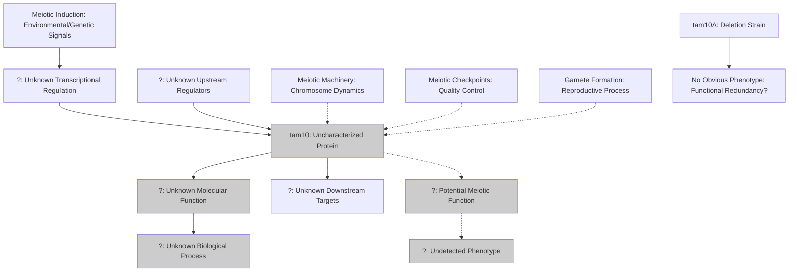

# Pathway Summary for tam10

## Overview

tam10 encodes an uncharacterized protein that represents a sequence orphan with no identifiable protein domains or orthologs outside the fission yeast lineage. Named for its altered transcript levels during meiosis, tam10 shows differential expression during meiotic progression but has no experimentally determined biological function [PMID:21270388]. Despite meiotic upregulation, deletion mutants show no detectable phenotype under standard laboratory conditions, suggesting either a subtle, condition-specific function or functional redundancy with other genes. The protein remains one of the most enigmatic factors in S. pombe biology.

## Unknown Meiotic Expression Pathway

The primary known characteristic of tam10 is its differential expression during meiotic progression, with transcript levels fluctuating significantly during synchronized meiotic time courses [PMID:21270388]. However, the functional significance of this meiotic expression pattern remains completely unknown. The upregulation during meiosis suggests tam10 may play a role in meiotic processes such as chromosome pairing, recombination, or gamete formation, but no specific meiotic function has been identified. The absence of any detectable meiotic defects in tam10Δ strains indicates that either the protein's function is redundant, highly specific to certain conditions, or too subtle to detect with standard assays.

## Sequence Orphan with No Pathway Context

tam10 exists as a sequence orphan with no identifiable homologs, conserved domains, or recognizable motifs that would suggest pathway involvement [file:pombe/tam10/tam10-deep-research.md]. This lack of sequence similarity to characterized proteins makes it impossible to predict functional pathways or molecular mechanisms through bioinformatics approaches. The protein appears to be specific to the Schizosaccharomyces lineage and may represent a lineage-specific innovation or a rapidly evolving protein that has lost similarity to ancestral forms.

## Potential Regulatory Network Integration

While tam10's specific function remains unknown, its meiotic expression pattern suggests it may integrate with meiotic regulatory networks. The protein could potentially function as a regulatory factor, scaffolding protein, or signaling molecule within meiotic pathways, though no specific interactions or targets have been identified. The lack of obvious phenotypes in deletion strains suggests that if tam10 does participate in regulatory networks, its role may be redundant with other factors or only apparent under specific environmental or genetic conditions.

## Pathway Diagram

## Hypothetical Pathway Connections

Given the complete lack of functional data for tam10, any pathway connections remain purely hypothetical. The meiotic expression suggests possible involvement in:

1. **Chromosome Dynamics**: tam10 could potentially participate in chromosome pairing, synapsis, or segregation processes during meiosis, though no evidence supports this hypothesis.

2. **Meiotic Quality Control**: The protein might function in meiotic checkpoints or quality control mechanisms that ensure proper chromosome behavior, but deletion strains show no checkpoint defects.

3. **Gamete Maturation**: tam10 could play a role in spore formation or maturation processes that occur late in meiosis, potentially explaining why defects might not be apparent in standard laboratory assays.

4. **Environmental Adaptation**: The protein might provide functions that are only important under specific environmental conditions not typically tested in laboratory settings.

## Functional Redundancy and Evolutionary Considerations

The lack of phenotypes in tam10Δ strains suggests potential functional redundancy with other proteins, though no obvious candidates have been identified. As a sequence orphan, tam10 may represent either a recent evolutionary innovation specific to fission yeast or a rapidly evolving protein that has lost sequence similarity to related factors in other organisms [file:pombe/tam10/tam10-deep-research.md]. The maintenance of this gene in S. pombe despite its apparent lack of essential function suggests it may provide subtle adaptive advantages under specific conditions.

## Research Challenges and Future Directions

tam10 represents a significant challenge for functional genomics, as traditional approaches based on sequence similarity, domain analysis, and standard phenotypic screens have failed to reveal its function. Future research may require:

1. **Comprehensive Phenotypic Screens**: Testing tam10Δ strains under diverse environmental conditions, stress treatments, and genetic backgrounds to identify subtle phenotypes.

2. **Proteomics Approaches**: Using advanced protein interaction methods to identify potential binding partners or associated complexes.

3. **Single-cell Analysis**: Examining tam10 function at the single-cell level during meiosis to detect subtle effects that might be masked in population-based assays.

4. **Comparative Genomics**: Studying tam10 across different Schizosaccharomyces species to understand its evolutionary conservation and potential functional constraints.

## Significance as a Model for Uncharacterized Proteins

tam10 serves as an important model for understanding how uncharacterized, lineage-specific proteins might contribute to cellular function. The protein highlights the limits of current functional annotation approaches and the challenges posed by sequence orphans in genomic studies. Understanding tam10's function could provide insights into the evolution of novel protein functions and the role of lineage-specific genes in cellular processes. The protein represents the frontier of functional genomics, where new experimental approaches and analytical methods are needed to uncover the functions of the most enigmatic genes in sequenced genomes.