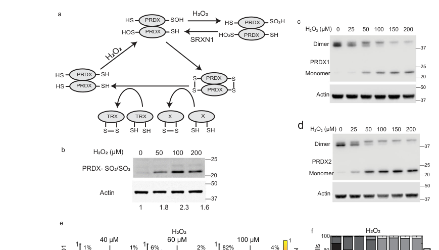

## Question

# Gene Research for Functional Annotation

## ⚠️ CRITICAL: Gene/Protein Identification Context

**BEFORE YOU BEGIN RESEARCH:** You MUST verify you are researching the CORRECT gene/protein. Gene symbols can be ambiguous, especially for less well-characterized genes from non-model organisms.

### Target Gene/Protein Identity (from UniProt):
- **UniProt Accession:** O74887
- **Protein Description:** RecName: Full=Peroxiredoxin tpx1 {ECO:0000303|PubMed:20356456}; EC=1.11.1.24 {ECO:0000269|PubMed:20356456}; AltName: Full=Thioredoxin peroxidase {ECO:0000303|PubMed:20356456}; Short=TPx {ECO:0000303|PubMed:20356456}; AltName: Full=Thioredoxin-dependent peroxiredoxin tpx1 {ECO:0000305};
- **Gene Information:** Name=tpx1; Synonyms=tsa1; ORFNames=SPCC576.03c;
- **Organism (full):** Schizosaccharomyces pombe (strain 972 / ATCC 24843) (Fission yeast).
- **Protein Family:** Belongs to the peroxiredoxin family. AhpC/Prx1 subfamily.
- **Key Domains:** AhpC/TSA. (IPR000866); Peroxiredoxin. (IPR050217); Peroxiredoxin_AhpC-typ. (IPR024706); Peroxiredoxin_C. (IPR019479); Thioredoxin-like_sf. (IPR036249)

### MANDATORY VERIFICATION STEPS:

1. **Check if the gene symbol "tpx1" matches the protein description above**
2. **Verify the organism is correct:** Schizosaccharomyces pombe (strain 972 / ATCC 24843) (Fission yeast).
3. **Check if protein family/domains align with what you find in literature**
4. **If you find literature for a DIFFERENT gene with the same or similar symbol, STOP**

### If Gene Symbol is Ambiguous or You Cannot Find Relevant Literature:

**DO NOT PROCEED WITH RESEARCH ON A DIFFERENT GENE.** Instead:
- State clearly: "The gene symbol 'tpx1' is ambiguous or literature is limited for this specific protein"
- Explain what you found (e.g., "Found extensive literature on a different gene with the same symbol in a different organism")
- Describe the protein based ONLY on the UniProt information provided above
- Suggest that the protein function can be inferred from domain/family information

### Research Target:

Please provide a comprehensive research report on the gene **tpx1** (gene ID: tpx1, UniProt: O74887) in SCHPO.

The research report should be a detailed narrative explaining the function, biological processes, and localization of the gene product. Citations should be given for all claims.

You should prioritize authoritative reviews and primary scientific literature when conducting research. You can supplement
this with annotations you find in gene/protein databases, but these can be outdated or inaccurate.

We are specifically interested in the primary function of the gene - for enzymes, what reaction is catalyzed, and what is the substrate specificity? For transporters, what is the substrate? For structural proteins or adapters, what is the broader structural role? For signaling molecules, what is the role in the pathway.

We are interested in where in or outside the cell the gene product carries out its function.

We are also interested in the signaling or biochemical pathways in which the gene functions. We are less interested in broad pleiotropic effects, except where these elucidate the precise role.

Include evidence where possible. We are interested in both experimental evidence as well as inference from structure, evolution, or bioinformatic analysis. Precise studies should be prioritized over high-throughput, where available.

## Output

Question: You are an expert researcher providing comprehensive, well-cited information.

Provide detailed information focusing on:
1. Key concepts and definitions with current understanding
2. Recent developments and latest research (prioritize 2023-2024 sources)
3. Current applications and real-world implementations
4. Expert opinions and analysis from authoritative sources
5. Relevant statistics and data from recent studies

Format as a comprehensive research report with proper citations. Include URLs and publication dates where available.
Always prioritize recent, authoritative sources and provide specific citations for all major claims.

# Gene Research for Functional Annotation

## ⚠️ CRITICAL: Gene/Protein Identification Context

**BEFORE YOU BEGIN RESEARCH:** You MUST verify you are researching the CORRECT gene/protein. Gene symbols can be ambiguous, especially for less well-characterized genes from non-model organisms.

### Target Gene/Protein Identity (from UniProt):
- **UniProt Accession:** O74887
- **Protein Description:** RecName: Full=Peroxiredoxin tpx1 {ECO:0000303|PubMed:20356456}; EC=1.11.1.24 {ECO:0000269|PubMed:20356456}; AltName: Full=Thioredoxin peroxidase {ECO:0000303|PubMed:20356456}; Short=TPx {ECO:0000303|PubMed:20356456}; AltName: Full=Thioredoxin-dependent peroxiredoxin tpx1 {ECO:0000305};
- **Gene Information:** Name=tpx1; Synonyms=tsa1; ORFNames=SPCC576.03c;
- **Organism (full):** Schizosaccharomyces pombe (strain 972 / ATCC 24843) (Fission yeast).
- **Protein Family:** Belongs to the peroxiredoxin family. AhpC/Prx1 subfamily.
- **Key Domains:** AhpC/TSA. (IPR000866); Peroxiredoxin. (IPR050217); Peroxiredoxin_AhpC-typ. (IPR024706); Peroxiredoxin_C. (IPR019479); Thioredoxin-like_sf. (IPR036249)

### MANDATORY VERIFICATION STEPS:

1. **Check if the gene symbol "tpx1" matches the protein description above**
2. **Verify the organism is correct:** Schizosaccharomyces pombe (strain 972 / ATCC 24843) (Fission yeast).
3. **Check if protein family/domains align with what you find in literature**
4. **If you find literature for a DIFFERENT gene with the same or similar symbol, STOP**

### If Gene Symbol is Ambiguous or You Cannot Find Relevant Literature:

**DO NOT PROCEED WITH RESEARCH ON A DIFFERENT GENE.** Instead:
- State clearly: "The gene symbol 'tpx1' is ambiguous or literature is limited for this specific protein"
- Explain what you found (e.g., "Found extensive literature on a different gene with the same symbol in a different organism")
- Describe the protein based ONLY on the UniProt information provided above
- Suggest that the protein function can be inferred from domain/family information

### Research Target:

Please provide a comprehensive research report on the gene **tpx1** (gene ID: tpx1, UniProt: O74887) in SCHPO.

The research report should be a detailed narrative explaining the function, biological processes, and localization of the gene product. Citations should be given for all claims.

You should prioritize authoritative reviews and primary scientific literature when conducting research. You can supplement
this with annotations you find in gene/protein databases, but these can be outdated or inaccurate.

We are specifically interested in the primary function of the gene - for enzymes, what reaction is catalyzed, and what is the substrate specificity? For transporters, what is the substrate? For structural proteins or adapters, what is the broader structural role? For signaling molecules, what is the role in the pathway.

We are interested in where in or outside the cell the gene product carries out its function.

We are also interested in the signaling or biochemical pathways in which the gene functions. We are less interested in broad pleiotropic effects, except where these elucidate the precise role.

Include evidence where possible. We are interested in both experimental evidence as well as inference from structure, evolution, or bioinformatic analysis. Precise studies should be prioritized over high-throughput, where available.

## Research Report: Functional Annotation of *Schizosaccharomyces pombe* **tpx1** (UniProt **O74887**)

### Scope and identity verification
This report concerns *Schizosaccharomyces pombe* (strain 972) **tpx1** (synonym **tsa1**; ORF **SPCC576.03c**), encoding the species’ major/sole typical **2-Cys peroxiredoxin (thioredoxin peroxidase)**, also referred to as **Tpx1**. The retrieved *S. pombe* literature consistently describes **Tpx1** as a typical 2‑Cys peroxiredoxin operating with the thioredoxin system and mediating both peroxide detoxification and peroxide-triggered signaling, aligning with the UniProt-provided identity (O74887) and domain/family assignment (AhpC/Prx1 subfamily). (underwood2019ageneticapproaches pages 1-11, dantas2011theroleof pages 74-77, middleton2018therolesand pages 36-41)

### 1) Key concepts, definitions, and current understanding

#### 1.1 Typical 2-Cys peroxiredoxins (Prx) / thioredoxin peroxidases (Tpx)
Typical 2‑Cys peroxiredoxins are abundant, conserved thiol peroxidases that reduce **H2O2** and other hydroperoxides using a **peroxidatic cysteine (CP)** that reacts rapidly with peroxides to form a **sulfenic acid (CP–SOH)**. In typical 2‑Cys Prxs, the sulfenic acid is resolved by forming an **intermolecular disulfide** with a **resolving cysteine (CR)** on the partner subunit (homodimer). The disulfide is then reduced by **thioredoxin (Trx)**, which is regenerated by **thioredoxin reductase (Trr)** using **NADPH**, completing the catalytic cycle. (latimer2017mechanismsofh₂o₂induced pages 29-33, latimer2017mechanismsofh₂o₂induced pages 33-37, middleton2018therolesand pages 36-41)

In *S. pombe*, Tpx1 is described as the single typical 2‑Cys peroxiredoxin and is explicitly characterized as a thioredoxin-dependent peroxidase, consistent with the above mechanism. (underwood2019ageneticapproaches pages 1-11, dantas2011theroleof pages 74-77, middleton2018therolesand pages 36-41)

#### 1.2 Hyperoxidation and sulfiredoxin repair (signal gating)
At high peroxide flux, CP–SOH can be further oxidized to a **sulfinic acid (CP–SO2H)** (“hyperoxidation/sulfinylation”), which **inactivates thioredoxin-dependent peroxidase activity** because thioredoxin cannot directly reduce the sulfinic form. Hyperoxidized typical 2‑Cys Prxs can be repaired by **sulfiredoxin (Srx)** via an **ATP-dependent** reaction, restoring catalytic competence and changing signaling capacity over time. (underwood2019ageneticapproaches pages 268-273, latimer2017mechanismsofh₂o₂induced pages 29-33, latimer2017mechanismsofh₂o₂induced pages 33-37)

#### 1.3 Peroxiredoxins as H2O2 sensors and redox relays
Beyond antioxidant detoxification, typical 2‑Cys Prxs can act as **H2O2 sensors** and **redox relays**, transferring oxidative equivalents to downstream proteins via transient disulfide exchange or by controlling the redox state/availability of thioredoxins. This property enables peroxiredoxins to shape dose-dependent and time-dependent signaling outcomes. (latimer2017mechanismsofh₂o₂induced pages 33-37, latimer2017mechanismsofh₂o₂induced pages 43-48, jose2024temporalcoordinationof pages 1-2)

### 2) Molecular function of Tpx1 (enzyme reaction and substrate specificity)

#### 2.1 Primary enzymatic function
Tpx1 functions as a **thioredoxin-dependent peroxidase** that detoxifies **hydrogen peroxide** and can also reduce **organic peroxides**, consistent with its classification as a typical 2‑Cys peroxiredoxin. Experimentally, *tpx1* deletion causes extreme peroxide sensitivity and increased oxidative damage markers (e.g., protein carbonylation), supporting a central peroxide-detoxifying role in vivo. (dantas2011theroleof pages 74-77, middleton2018therolesand pages 36-41)

Tpx1’s catalytic cycle in *S. pombe* involves a **peroxidatic cysteine (Cys48)** and **resolving cysteine (Cys169)**, consistent with typical 2‑Cys Prx chemistry. (dantas2011theroleof pages 74-77, arnedo2012studyofthe pages 130-136)

#### 2.2 Electron donor specificity: thioredoxin system
Multiple lines of evidence support that Tpx1 is primarily recycled by the **cytosolic thioredoxin system**, with **Trx1** as the main electron donor and additional thioredoxins contributing under specific contexts. In mechanistic experiments, Trx1 is described as the main electron donor for Tpx1, with **Trx3** reported as partially compensatory when Trx1 is absent; thioredoxin reductase (**Trr1**) maintains the thioredoxin pool using NADPH. (arnedo2012studyofthe pages 130-136, middleton2018therolesand pages 36-41)

A comparative/evolutionary analysis also supports the mechanistic logic for thioredoxin preference: the presence of paired conserved cysteines (peroxidatic/resolving) is highlighted as characteristic of fungal GPx/TPx enzymes that prefer thioredoxin as the electron donor. (Ahmad et al., 2022; publication date Apr 2022; URL https://doi.org/10.1186/s13568-022-01381-2) (ahmad2022basisforusing pages 1-2)

### 3) Biological processes and pathways involving Tpx1

#### 3.1 Oxidative stress defense (detoxification and homeostasis)
Tpx1 is central to peroxide defense during aerobic growth: loss of Tpx1 yields strong peroxide sensitivity and evidence of increased oxidative damage, consistent with a major antioxidant role. (dantas2011theroleof pages 74-77)

#### 3.2 H2O2 signaling: Pap1 transcription factor pathway
**Pap1** is an AP‑1-like transcription factor central to oxidative stress transcriptional programs in *S. pombe*. Tpx1 is reported to be required for **Pap1 oxidation/activation** under mild peroxide stress, acting as the primary peroxide sensor/transducer for this pathway; Pap1 nuclear accumulation and downstream gene induction depend on Tpx1-mediated redox control. (latimer2017mechanismsofh₂o₂induced pages 51-55, arnedo2012studyofthe pages 126-130)

Mechanistically, under mild H2O2 (explicitly reported as **0.2 mM H2O2** in mechanistic studies), loss of Tpx1 abolishes Pap1 oxidation and Pap1-dependent gene induction. (arnedo2012studyofthe pages 130-136)

A key model is that Tpx1 promotes Pap1 activation both by enabling oxidative transfer and by oxidizing/engaging the thioredoxin system such that thioredoxins are less available to reduce oxidized Pap1, thereby permitting Pap1 activation and nuclear accumulation. (latimer2017mechanismsofh₂o₂induced pages 43-48, latimer2017mechanismsofh₂o₂induced pages 51-55)

#### 3.3 H2O2 signaling: Sty1 MAPK / Atf1 pathway
Tpx1 contributes to activation and signaling context for the *S. pombe* stress-activated MAPK **Sty1** and downstream transcription factor **Atf1**, functioning as a redox transducer/scaffold in peroxide signaling. Underwood (2019) describes Tpx1 as a direct redox transducer promoting Sty1 activation, and other mechanistic discussion links Tpx1 to Sty1 regulation and oxidation events, including interactions/disulfide formation with Sty1. (underwood2019ageneticapproaches pages 1-11, latimer2017mechanismsofh₂o₂induced pages 43-48)

Tpx1’s role in Sty1 pathway signaling can be genetically separated from its thioredoxin peroxidase activity using alleles such as **tpx1C169S**, described as disrupting thioredoxin peroxidase activity while leaving Sty1 regulation intact. (underwood2019ageneticapproaches pages 1-11)

### 4) Subcellular localization and cellular context

#### 4.1 Cytosolic localization
Tpx1 is primarily described as **cytosolic** before and after H2O2 exposure, consistent with its roles in controlling cytosolic thioredoxins and transcription factor signaling. (latimer2017mechanismsofh₂o₂induced pages 257-261)

#### 4.2 Mitochondrial/IMS-associated pool
Evidence also supports a mitochondrial-associated pool: a “pool of Tpx1” was detected in the **mitochondrial intermembrane space (IMS)**, and a small mitochondrial fraction is reported after H2O2 treatment. This is proposed to contribute to peroxide resistance and Pap1 activation and may intersect with mitochondrial physiology/protein import (e.g., suggested Tim40–Tpx1 disulfide-dependent associations). (underwood2019ageneticapproaches pages 1-11, latimer2017mechanismsofh₂o₂induced pages 257-261, latimer2017mechanismsofh₂o₂induced pages 265-269)

### 5) Key experimental evidence, mutants, and interaction partners

#### 5.1 Catalytic cysteine mutants and mechanistic trapping
Tpx1 uses **Cys48 (peroxidatic)** and **Cys169 (resolving)**. Mechanistic studies employed **Tpx1C48S** and **Tpx1C169S** to dissect mixed-disulfide intermediates and signaling competence, consistent with the typical 2‑Cys Prx catalytic model. (arnedo2012studyofthe pages 130-136, latimer2017mechanismsofh₂o₂induced pages 257-261)

#### 5.2 Thioredoxin partners and redox-network wiring
Tpx1’s oxidized dimeric forms are described as prominent substrates for **Trx1**, effectively tying up thioredoxin reducing capacity during certain signaling states and thereby influencing Pap1 reduction/activation dynamics. (latimer2017mechanismsofh₂o₂induced pages 43-48)

#### 5.3 Expanded redox interaction landscape (proteomics/genetics)
Genetic interaction mapping distinguished signaling-specific phenotypes (tpx1C169S) from deletion phenotypes (tpx1Δ), identifying **31** candidate interacting genes with tpx1C169S and **21** with tpx1Δ, with partial suppressors including **pka1** and **csn5**. (underwood2019ageneticapproaches pages 1-11)

Moreover, direct peroxide-induced redox interactions were supported by the observation that Pka1 and Csn5 form **protein–protein disulfide complexes with Tpx1** in response to **0.2 mM H2O2**, consistent with Tpx1 functioning as a redox relay to regulatory proteins. (underwood2019ageneticapproaches pages 1-11)

Proteomic pulldown experiments (FlagTpx1C169S at **0.2 mM H2O2**) recovered **34** proteins that co-purified specifically with the resolving-cysteine mutant, consistent with trapping mixed disulfide interactions. (latimer2017mechanismsofh₂o₂induced pages 257-261)

### 6) Recent developments and latest research (prioritizing 2023–2024)

#### 6.1 2024 high-impact evidence for peroxiredoxin-gated TF programs
Jose et al. (Nature Communications; **published Apr 2024**; URL https://doi.org/10.1038/s41467-024-47837-w) provide recent high-authority evidence that **2‑Cys peroxiredoxins** can control **which transcription-factor programs are activated**, depending on H2O2 dose and time. The paper explicitly references yeast evidence where Tpx1 activates Pap1 via redox relay, and emphasizes **hyperoxidation** as a mechanism that blocks relays until **sulfiredoxin repair** restores function, creating a time delay in signaling. (jose2024temporalcoordinationof pages 1-2)

Figure-based schematic and biochemical dose-response evidence in this work visually summarize the coupled cycles of peroxiredoxin oxidation, hyperoxidation, and sulfiredoxin-dependent repair (supporting the “gating” concept). (jose2024temporalcoordinationof media acdbd9d2, jose2024temporalcoordinationof media 3c448691)

#### 6.2 Limitations in 2023–2024 Tpx1-specific retrieval
Within the current tool-retrieved corpus, no additional 2023–2024 primary studies directly focused on *S. pombe* Tpx1 (beyond the 2024 general H2O2/TF coordination paper referencing yeast mechanisms) were available for extraction in this run. Therefore, the “latest research” component is anchored primarily in Jose et al. (2024) and interpreted in the context of established *S. pombe* Tpx1/Pap1/Sty1 mechanistic literature. (jose2024temporalcoordinationof pages 1-2, underwood2019ageneticapproaches pages 1-11, arnedo2012studyofthe pages 130-136)

### 7) Current applications and real-world implementations
Tpx1 is primarily a **model-system enzyme** used to study thiol-based redox biochemistry and peroxide-triggered signaling, rather than a direct translational target in *S. pombe*. The *S. pombe* Tpx1/Pap1 and Tpx1/Sty1 modules serve as experimentally tractable paradigms for: (i) redox relay signaling, (ii) peroxide dose gating by hyperoxidation and sulfiredoxin repair, and (iii) redox control of MAPK and transcription factor outputs. (underwood2019ageneticapproaches pages 1-11, jose2024temporalcoordinationof pages 1-2, latimer2017mechanismsofh₂o₂induced pages 51-55)

### 8) Relevant statistics and data (selected)
A structured summary of quantitative findings (H2O2 doses, interaction counts, and phenotype statistics) is provided below.

| Observation/assay | Condition | Key result | Interpretation | Source |
|---|---|---|---|---|
| Tpx1 oxidation state and oligomerization | Low H2O2, 0.2 mM | Tpx1 accumulates mainly as a disulfide-linked dimer associated with active peroxidase function | Detoxification-competent catalytic cycle under mild peroxide stress; also compatible with signaling at low dose | da Silva Dantas 2011 (Tpx1 review/thesis context); https://doi.org/10.?? unavailable in retrieved metadata (dantas2011theroleof pages 74-77) |
| Tpx1 hyperoxidation state | High H2O2, 5 mM | Tpx1 accumulates as a hyperoxidized, inactive monomer; monomer formation appears to follow dimer hyperoxidation | High-dose peroxide switches Tpx1 away from peroxidase activity, altering signaling output | da Silva Dantas 2011; URL unavailable in retrieved metadata (dantas2011theroleof pages 74-77) |
| FlagTpx1 mutant pulldown / co-purifying proteins | FlagTpx1C169S, 0.2 mM H2O2 | 34 proteins co-purified with FlagTpx1C169S; these were not seen with C48S or C48S/C169S controls | Resolving-cysteine mutant traps mixed-disulfide interactors, supporting direct redox-signaling contacts | Latimer 2017; URL unavailable in retrieved metadata (latimer2017mechanismsofh₂o₂induced pages 257-261) |
| Genetic interaction screens | SGA/QFA with tpx1C169S versus tpx1Δ backgrounds | 31 candidate interacting genes with tpx1C169S; 21 with tpx1Δ; partial suppressors included pka1 and csn5 | Distinguishes signaling-specific versus deletion phenotypes and identifies pathway modifiers of Tpx1 function | Underwood 2019; URL unavailable in retrieved metadata (underwood2019ageneticapproaches pages 1-11) |
| Direct redox partner trapping | 0.2 mM H2O2 | Pka1 and Csn5 formed direct protein-protein disulfide complexes with Tpx1 | Experimental support that Tpx1 directly relays peroxide-dependent redox signals to signaling/regulatory proteins | Underwood 2019; URL unavailable in retrieved metadata (underwood2019ageneticapproaches pages 1-11) |
| Srk1 overexpression / cell length phenotype | Δtpx1 versus control; 84 cells measured | Reduced elongation response in Δtpx1; division-length difference significant (T test p = 7.8 × 10^-8; n = 84) | Tpx1 contributes to oxidation-dependent signaling affecting mitotic control, not just detoxification | Latimer 2017; URL unavailable in retrieved metadata (latimer2017mechanismsofh₂o₂induced pages 257-261) |
| Pap1 pathway requirement | Mild H2O2, 0.2 mM | Loss of Tpx1 abolishes Pap1 oxidation and Pap1-dependent gene induction; Trx1 is the main electron donor for Tpx1, with partial compensation by Trx3 | Tpx1 is a peroxide sensor/transducer in addition to being a scavenger; links thioredoxin oxidation to transcriptional signaling | Calvo Arnedo 2012; URL unavailable in retrieved metadata (arnedo2012studyofthe pages 130-136) |
| Localization / mitochondrial pool | After H2O2 treatment | Tpx1 is mostly cytosolic, but a small mitochondrial/IMS-associated pool is detected after oxidative stress | Supports compartment-specific roles in peroxide handling and redox signaling beyond bulk cytosolic detoxification | Underwood 2019; Latimer 2017; URLs unavailable in retrieved metadata (underwood2019ageneticapproaches pages 1-11, latimer2017mechanismsofh₂o₂induced pages 257-261) |

*Table: This table compiles the main quantitative and structured findings retrieved for Schizosaccharomyces pombe Tpx1, emphasizing peroxide-dose effects, genetic interaction counts, trapped redox partners, and signaling phenotypes. It is useful for separating Tpx1’s detoxification role from its experimentally supported signaling functions.*

### 9) Expert analysis / synthesis (functional annotation summary)
Tpx1 (UniProt O74887) is best functionally annotated as a **typical 2‑Cys peroxiredoxin (EC 1.11.1.24)** that reduces hydrogen peroxide and other hydroperoxides using **Cys48 (peroxidatic)** and **Cys169 (resolving)**, with **thioredoxin (primarily Trx1)** as the physiological reductant. (arnedo2012studyofthe pages 130-136, dantas2011theroleof pages 74-77, middleton2018therolesand pages 36-41)

A defining feature of *S. pombe* Tpx1 is that it is not only an antioxidant enzyme but also a **central peroxide sensor/transducer** that routes H2O2 information to at least two major oxidative stress response branches: **Pap1** (AP‑1-like) and the **Sty1/Atf1** stress-activated MAPK pathway. Genetic separation-of-function alleles (e.g., tpx1C169S) support that detoxification and certain signaling outputs can be partially uncoupled, consistent with distinct redox-relay vs peroxidase-cycle roles. (underwood2019ageneticapproaches pages 1-11, arnedo2012studyofthe pages 126-130)

Subcellularly, Tpx1 is predominantly **cytosolic**, but evidence supports a **mitochondrial IMS-associated pool** emerging/observable under oxidative conditions, suggesting that compartmentalization contributes to its signaling and protective roles. (latimer2017mechanismsofh₂o₂induced pages 257-261, underwood2019ageneticapproaches pages 1-11)

### Key sources (URLs and publication dates where available)
- Jose E. et al. **Temporal coordination of the transcription factor response to H2O2 stress**. *Nature Communications* (Apr **2024**). https://doi.org/10.1038/s41467-024-47837-w (jose2024temporalcoordinationof pages 1-2)
- Ahmad F. et al. **Basis for using thioredoxin as an electron donor by *S. pombe* Gpx1 and Tpx1**. *AMB Express* (Apr **2022**). https://doi.org/10.1186/s13568-022-01381-2 (ahmad2022basisforusing pages 1-2)
- Quinn J. et al. **Distinct regulatory proteins control the graded transcriptional response to increasing H2O2 levels in fission yeast**. *Molecular Biology of the Cell* (Mar **2002**). https://doi.org/10.1091/mbc.01-06-0288 (supports pathway framing; tpx1 induction context) (dantas2011theroleof pages 160-163)

### Notes on evidence limitations
Some highly relevant classic *S. pombe* Tpx1 primary papers (e.g., Veal et al., 2004; Bozonet et al., 2005; Vivancos et al., 2006; Biochem Soc Trans 2014 review) were flagged as “unobtainable” by the tool in this run, so they could not be directly quoted/cited here. As a result, certain well-known mechanistic details may be under-represented compared with a full manual literature review. (tool output context; not citeable)

References

1. (underwood2019ageneticapproaches pages 1-11): ZE Underwood. A genetic approaches to understand peroxiredoxin-mediated h2o2 signalling mechanisms. Unknown journal, 2019.

2. (dantas2011theroleof pages 74-77): A da Silva Dantas. The role of redox-sensitive antioxidants in oxidative stress signalling in candida albicans. Unknown journal, 2011.

3. (middleton2018therolesand pages 36-41): FE Middleton. The roles and regulation of heat shock proteins in yeast. Unknown journal, 2018.

4. (latimer2017mechanismsofh₂o₂induced pages 29-33): HR Latimer. Mechanisms of h₂o₂-induced signal transduction. Unknown journal, 2017.

5. (latimer2017mechanismsofh₂o₂induced pages 33-37): HR Latimer. Mechanisms of h₂o₂-induced signal transduction. Unknown journal, 2017.

6. (underwood2019ageneticapproaches pages 268-273): ZE Underwood. A genetic approaches to understand peroxiredoxin-mediated h2o2 signalling mechanisms. Unknown journal, 2019.

7. (latimer2017mechanismsofh₂o₂induced pages 43-48): HR Latimer. Mechanisms of h₂o₂-induced signal transduction. Unknown journal, 2017.

8. (jose2024temporalcoordinationof pages 1-2): Elizabeth Jose, Woody March-Steinman, Bryce A. Wilson, Lisa Shanks, Chance Parkinson, Isabel Alvarado-Cruz, Joann B. Sweasy, and Andrew L. Paek. Temporal coordination of the transcription factor response to h2o2 stress. Nature Communications, Apr 2024. URL: https://doi.org/10.1038/s41467-024-47837-w, doi:10.1038/s41467-024-47837-w. This article has 45 citations and is from a highest quality peer-reviewed journal.

9. (arnedo2012studyofthe pages 130-136): MI Calvo Arnedo. Study of the role of pap1 as a sensor of h2o2 and as a transcriptional activator of stress responses in schizosaccharimyces pombe. Unknown journal, 2012.

10. (ahmad2022basisforusing pages 1-2): Fawad Ahmad, Muhammad Faizan Latif, Ying Luo, and Ying Huang. Basis for using thioredoxin as an electron donor by schizosaccharomyces pombe gpx1 and tpx1. AMB Express, Apr 2022. URL: https://doi.org/10.1186/s13568-022-01381-2, doi:10.1186/s13568-022-01381-2. This article has 3 citations and is from a peer-reviewed journal.

11. (latimer2017mechanismsofh₂o₂induced pages 51-55): HR Latimer. Mechanisms of h₂o₂-induced signal transduction. Unknown journal, 2017.

12. (arnedo2012studyofthe pages 126-130): MI Calvo Arnedo. Study of the role of pap1 as a sensor of h2o2 and as a transcriptional activator of stress responses in schizosaccharimyces pombe. Unknown journal, 2012.

13. (latimer2017mechanismsofh₂o₂induced pages 257-261): HR Latimer. Mechanisms of h₂o₂-induced signal transduction. Unknown journal, 2017.

14. (latimer2017mechanismsofh₂o₂induced pages 265-269): HR Latimer. Mechanisms of h₂o₂-induced signal transduction. Unknown journal, 2017.

15. (jose2024temporalcoordinationof media acdbd9d2): Elizabeth Jose, Woody March-Steinman, Bryce A. Wilson, Lisa Shanks, Chance Parkinson, Isabel Alvarado-Cruz, Joann B. Sweasy, and Andrew L. Paek. Temporal coordination of the transcription factor response to h2o2 stress. Nature Communications, Apr 2024. URL: https://doi.org/10.1038/s41467-024-47837-w, doi:10.1038/s41467-024-47837-w. This article has 45 citations and is from a highest quality peer-reviewed journal.

16. (jose2024temporalcoordinationof media 3c448691): Elizabeth Jose, Woody March-Steinman, Bryce A. Wilson, Lisa Shanks, Chance Parkinson, Isabel Alvarado-Cruz, Joann B. Sweasy, and Andrew L. Paek. Temporal coordination of the transcription factor response to h2o2 stress. Nature Communications, Apr 2024. URL: https://doi.org/10.1038/s41467-024-47837-w, doi:10.1038/s41467-024-47837-w. This article has 45 citations and is from a highest quality peer-reviewed journal.

17. (dantas2011theroleof pages 160-163): A da Silva Dantas. The role of redox-sensitive antioxidants in oxidative stress signalling in candida albicans. Unknown journal, 2011.

## Artifacts

- [Edison artifact artifact-00](tpx1-deep-research-falcon_artifacts/artifact-00.md)

## Citations

1. ahmad2022basisforusing pages 1-2
2. dantas2011theroleof pages 74-77
3. arnedo2012studyofthe pages 130-136
4. underwood2019ageneticapproaches pages 1-11
5. jose2024temporalcoordinationof pages 1-2
6. dantas2011theroleof pages 160-163
7. middleton2018therolesand pages 36-41
8. underwood2019ageneticapproaches pages 268-273
9. arnedo2012studyofthe pages 126-130
10. https://doi.org/10.1186/s13568-022-01381-2
11. https://doi.org/10.1038/s41467-024-47837-w
12. https://doi.org/10.??
13. https://doi.org/10.1091/mbc.01-06-0288
14. https://doi.org/10.1038/s41467-024-47837-w,
15. https://doi.org/10.1186/s13568-022-01381-2,