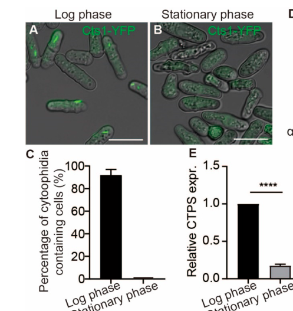

## Question

# Gene Research for Functional Annotation

## ⚠️ CRITICAL: Gene/Protein Identification Context

**BEFORE YOU BEGIN RESEARCH:** You MUST verify you are researching the CORRECT gene/protein. Gene symbols can be ambiguous, especially for less well-characterized genes from non-model organisms.

### Target Gene/Protein Identity (from UniProt):
- **UniProt Accession:** O42644
- **Protein Description:** RecName: Full=CTP synthase; EC=6.3.4.2; AltName: Full=CTP synthetase; AltName: Full=UTP--ammonia ligase;
- **Gene Information:** Name=ura7; ORFNames=SPAC10F6.03c;
- **Organism (full):** Schizosaccharomyces pombe (strain 972 / ATCC 24843) (Fission yeast).
- **Protein Family:** Belongs to the CTP synthase family. .
- **Key Domains:** Class_I_gatase-like. (IPR029062); CTP_synthase. (IPR004468); CTP_synthase_N. (IPR017456); GATASE. (IPR017926); GATase1_CTP_Synthase. (IPR033828)

### MANDATORY VERIFICATION STEPS:

1. **Check if the gene symbol "ura7" matches the protein description above**
2. **Verify the organism is correct:** Schizosaccharomyces pombe (strain 972 / ATCC 24843) (Fission yeast).
3. **Check if protein family/domains align with what you find in literature**
4. **If you find literature for a DIFFERENT gene with the same or similar symbol, STOP**

### If Gene Symbol is Ambiguous or You Cannot Find Relevant Literature:

**DO NOT PROCEED WITH RESEARCH ON A DIFFERENT GENE.** Instead:
- State clearly: "The gene symbol 'ura7' is ambiguous or literature is limited for this specific protein"
- Explain what you found (e.g., "Found extensive literature on a different gene with the same symbol in a different organism")
- Describe the protein based ONLY on the UniProt information provided above
- Suggest that the protein function can be inferred from domain/family information

### Research Target:

Please provide a comprehensive research report on the gene **ura7** (gene ID: ura7, UniProt: O42644) in SCHPO.

The research report should be a detailed narrative explaining the function, biological processes, and localization of the gene product. Citations should be given for all claims.

You should prioritize authoritative reviews and primary scientific literature when conducting research. You can supplement
this with annotations you find in gene/protein databases, but these can be outdated or inaccurate.

We are specifically interested in the primary function of the gene - for enzymes, what reaction is catalyzed, and what is the substrate specificity? For transporters, what is the substrate? For structural proteins or adapters, what is the broader structural role? For signaling molecules, what is the role in the pathway.

We are interested in where in or outside the cell the gene product carries out its function.

We are also interested in the signaling or biochemical pathways in which the gene functions. We are less interested in broad pleiotropic effects, except where these elucidate the precise role.

Include evidence where possible. We are interested in both experimental evidence as well as inference from structure, evolution, or bioinformatic analysis. Precise studies should be prioritized over high-throughput, where available.

## Output

Question: You are an expert researcher providing comprehensive, well-cited information.

Provide detailed information focusing on:
1. Key concepts and definitions with current understanding
2. Recent developments and latest research (prioritize 2023-2024 sources)
3. Current applications and real-world implementations
4. Expert opinions and analysis from authoritative sources
5. Relevant statistics and data from recent studies

Format as a comprehensive research report with proper citations. Include URLs and publication dates where available.
Always prioritize recent, authoritative sources and provide specific citations for all major claims.

# Gene Research for Functional Annotation

## ⚠️ CRITICAL: Gene/Protein Identification Context

**BEFORE YOU BEGIN RESEARCH:** You MUST verify you are researching the CORRECT gene/protein. Gene symbols can be ambiguous, especially for less well-characterized genes from non-model organisms.

### Target Gene/Protein Identity (from UniProt):
- **UniProt Accession:** O42644
- **Protein Description:** RecName: Full=CTP synthase; EC=6.3.4.2; AltName: Full=CTP synthetase; AltName: Full=UTP--ammonia ligase;
- **Gene Information:** Name=ura7; ORFNames=SPAC10F6.03c;
- **Organism (full):** Schizosaccharomyces pombe (strain 972 / ATCC 24843) (Fission yeast).
- **Protein Family:** Belongs to the CTP synthase family. .
- **Key Domains:** Class_I_gatase-like. (IPR029062); CTP_synthase. (IPR004468); CTP_synthase_N. (IPR017456); GATASE. (IPR017926); GATase1_CTP_Synthase. (IPR033828)

### MANDATORY VERIFICATION STEPS:

1. **Check if the gene symbol "ura7" matches the protein description above**
2. **Verify the organism is correct:** Schizosaccharomyces pombe (strain 972 / ATCC 24843) (Fission yeast).
3. **Check if protein family/domains align with what you find in literature**
4. **If you find literature for a DIFFERENT gene with the same or similar symbol, STOP**

### If Gene Symbol is Ambiguous or You Cannot Find Relevant Literature:

**DO NOT PROCEED WITH RESEARCH ON A DIFFERENT GENE.** Instead:
- State clearly: "The gene symbol 'ura7' is ambiguous or literature is limited for this specific protein"
- Explain what you found (e.g., "Found extensive literature on a different gene with the same symbol in a different organism")
- Describe the protein based ONLY on the UniProt information provided above
- Suggest that the protein function can be inferred from domain/family information

### Research Target:

Please provide a comprehensive research report on the gene **ura7** (gene ID: ura7, UniProt: O42644) in SCHPO.

The research report should be a detailed narrative explaining the function, biological processes, and localization of the gene product. Citations should be given for all claims.

You should prioritize authoritative reviews and primary scientific literature when conducting research. You can supplement
this with annotations you find in gene/protein databases, but these can be outdated or inaccurate.

We are specifically interested in the primary function of the gene - for enzymes, what reaction is catalyzed, and what is the substrate specificity? For transporters, what is the substrate? For structural proteins or adapters, what is the broader structural role? For signaling molecules, what is the role in the pathway.

We are interested in where in or outside the cell the gene product carries out its function.

We are also interested in the signaling or biochemical pathways in which the gene functions. We are less interested in broad pleiotropic effects, except where these elucidate the precise role.

Include evidence where possible. We are interested in both experimental evidence as well as inference from structure, evolution, or bioinformatic analysis. Precise studies should be prioritized over high-throughput, where available.

# Functional Annotation Research Report: **ura7 / cts1 (CTP synthase)** in *Schizosaccharomyces pombe* (UniProt **O42644**, ORF **SPAC10F6.03c**)

## Executive summary
The UniProt accession **O42644** corresponds to *Schizosaccharomyces pombe* CTP synthase, encoded in the literature as **cts1** and producing filamentous structures (“**cytoophidia**”) in vivo (zhang2018theassemblyof pages 52-57, zhang2019temperaturesensitivecytoophidiumassembly pages 1-6). In a 2024 *S. pombe* study, CTP synthase cytoophidia were present in **>90%** of logarithmically growing cells, but largely absent in stationary phase; a single point mutation (**H359A**) disassembled cytoophidia and caused slower growth, prolonged **G2**, and increased cell size (deng2024cytoophidiainfluencecell pages 2-5, deng2024cytoophidiainfluencecell pages 1-2). Mechanistically, CTPS catalyzes the **ATP-dependent amination of UTP to CTP**, using glutamine-derived ammonia delivered through an intramolecular tunnel; catalysis is activated allosterically by **GTP** and feedback-inhibited by **CTP** (bearne2022gtpdependentregulationof pages 1-2, zhou2021structuralbasisfor pages 1-2). These findings support a model in which CTPS filamentation in *S. pombe* is a regulated, environmentally responsive state that is functionally connected to CTPS protein stability and cell-cycle progression rather than being a passive storage depot (deng2024cytoophidiainfluencecell pages 1-2, zhang2019temperaturesensitivecytoophidiumassembly pages 6-9).

**Important nomenclature limitation:** although the user-provided target lists the gene name as **ura7**, the *S. pombe* primary literature retrieved here refers to the gene/protein as **cts1 / CTPS / Cts1** and does **not** explicitly use “ura7” as an alias in the cited excerpts (zhang2018theassemblyof pages 52-57, zhang2019temperaturesensitivecytoophidiumassembly pages 1-6). Therefore, this report strictly annotates the **UniProt O42644** protein (CTP synthase family; CTPS/Cts1 in *S. pombe*) and flags potential symbol ambiguity with URA7 in budding yeast.

---

## 1. Key concepts and definitions (current understanding)

### 1.1 CTP synthase (CTPS): definition and core reaction
CTP synthase (EC 6.3.4.2) catalyzes the terminal (rate-limiting) step of **de novo CTP biosynthesis**, converting **UTP → CTP** via **ATP-dependent amination** (bearne2022gtpdependentregulationof pages 1-2, zhou2021structuralbasisfor pages 1-2). In *S. pombe*, CTPS/Cts1 is explicitly described as catalyzing the **ATP-dependent conversion of UTP to CTP** (deng2024cytoophidiainfluencecell pages 1-2).

Mechanistic consensus across organisms is that the reaction proceeds through:
1) ATP-dependent phosphorylation of UTP to form a **4-phospho-UTP intermediate**, and
2) nucleophilic attack by **NH3** (generated from glutamine) at the pyrimidine C4 position to yield CTP (bearne2022gtpdependentregulationof pages 1-2).

A recent 2024 review of human glutamine-hydrolyzing synthetases provides a compact overall stoichiometry for CTPS (in a human context) consistent with the conserved mechanism: **glutamine + ATP + UMP → glutamate + CTP + ADP + Pi** (zhu2024advancesinhuman pages 4-5). While the UMP term reflects how some sources write the overall reaction (via the phosphorylated intermediate), the key conserved transformation is ATP-driven amination of UTP to CTP.

### 1.2 Domain architecture: a fused glutamine amidotransferase + synthase enzyme
CTPS is a two-domain class I glutamine amidotransferase enzyme:
- an N-terminal **synthase (ammonia ligase) domain** that binds ATP/UTP and performs the phosphorylation/amination chemistry, and
- a C-terminal **glutamine amidotransferase (GATase) domain** that hydrolyzes glutamine to release ammonia (bearne2022gtpdependentregulationof pages 1-2, zhou2021structuralbasisfor pages 1-2).

In the *S. pombe* CTPS/cytophidium methods overview, the fission-yeast protein is described as having two major domains: an **N-terminal CTP synthase domain** and a **C-terminal glutamine amidotransferase (GATase) domain**; the work explicitly uses **UniProt O42644** as the CTPS sequence/structure reference (zhang2018theassemblyof pages 52-57, zhang2018theassemblyofa pages 52-57).

### 1.3 Ammonia tunneling and allosteric coupling
CTPS couples glutamine hydrolysis and UTP amination by transferring nascent ammonia via an intramolecular **NH3 tunnel** linking the GAT and synthase active sites (bearne2022gtpdependentregulationof pages 1-2, zhou2021structuralbasisfor pages 1-2). Near-atomic cryo-EM work (Drosophila CTPS; eukaryotic) further supports that UTP binding and tunnel gating are coordinated and that GTP binding helps prevent ammonia leakage and stabilize the tunnel (zhou2021structuralbasisfor pages 1-2).

### 1.4 Cytoophidia: filamentous CTPS assemblies
“**Cytoophidia**” (also called CTPS filaments) are filamentous assemblies composed largely of CTPS. Cytoophidia are conserved across domains of life and represent a form of subcellular compartmentation/organization of metabolic enzymes (deng2024cytoophidiainfluencecell pages 1-2, zhang2019temperaturesensitivecytoophidiumassembly pages 1-6).

---

## 2. Target verification and gene/protein identity (mandatory)

### 2.1 Correct organism and protein family
The retrieved *S. pombe* literature explicitly treats fission yeast as a model with **a single CTPS gene**, encoded at the **cts1** locus, unlike organisms with two CTPS paralogs (zhang2018theassemblyof pages 52-57, zhang2019temperaturesensitivecytoophidiumassembly pages 1-6). The protein is a canonical CTPS-family two-domain enzyme consistent with UniProt’s domain description (CTP synthase family; synthase + GATase domains) (zhang2018theassemblyof pages 52-57, bearne2022gtpdependentregulationof pages 1-2).

### 2.2 Gene symbol ambiguity: “ura7” vs “cts1”
The term **URA7** is widely used for budding yeast (*Saccharomyces cerevisiae*) CTPS isoforms; the *S. pombe* literature excerpts here instead use **cts1** and do not explicitly call the *S. pombe* gene “ura7” (zhang2018theassemblyof pages 52-57, zhang2018theassemblyofb pages 52-57). Consequently, this report annotates the protein as **CTPS/Cts1 (UniProt O42644)** and flags that “ura7” may be an alias carried over from other yeast systems.

---

## 3. Functional annotation: biological role, localization, and pathways

## 3.1 Primary molecular function (enzymology and substrate specificity)

### Catalyzed reaction and substrates
**S. pombe CTPS/Cts1** catalyzes the ATP-dependent conversion of **UTP to CTP** (deng2024cytoophidiainfluencecell pages 1-2). Across organisms, CTPS uses:
- **UTP** as the pyrimidine substrate,
- **ATP** to form the phosphorylated intermediate,
- **glutamine** as the physiological nitrogen donor (via glutaminase chemistry), and
- **GTP** as an allosteric effector required for efficient glutamine hydrolysis (bearne2022gtpdependentregulationof pages 1-2, bearne2022gtpdependentregulationof pages 2-4).

CTPS can also use exogenous ammonia (NH3) in place of glutamine in some settings, but glutamine is the primary in vivo donor (bearne2022gtpdependentregulationof pages 1-2).

### Mechanistic steps and conserved catalytic features
A recent mechanistic review emphasizes (i) phosphorylation of UTP to 4-phospho-UTP and (ii) ammonia attack to yield CTP, with ammonia generated in the GATase domain and transferred via an NH3 tunnel (bearne2022gtpdependentregulationof pages 1-2). Cryo-EM structural work resolves nucleotide binding modes and directly visualizes an ATP-dependent phosphorylation intermediate (in a eukaryotic CTPS model), enabling residue-level discussion of catalysis and inhibition (zhou2021structuralbasisfor pages 1-2).

### Key regulatory ligands: GTP and CTP
CTPS is unusual among class I glutamine amidotransferases in requiring **GTP** as an allosteric activator of the glutaminase (GAT) domain (bearne2022gtpdependentregulationof pages 1-2). Product **CTP** acts as a **feedback inhibitor**, competitively binding at the UTP site and potentially at additional sites (reported in eukaryotes) (zhou2021structuralbasisfor pages 1-2, guo2024filamentationandinhibition pages 1-2). A 2024 review provides quantitative physiological context in humans (UTP/CTP ~253 μM/91 μM) and reports an IC50 of ~40 μM for CTP inhibition of human CTPS1 at 100 μM UTP, illustrating the potency of feedback control (non-*S. pombe*; used here as comparative mechanistic context) (zhu2024advancesinhuman pages 4-5).

---

## 3.2 Cellular localization and cytoophidia dynamics in *S. pombe*

### Basal localization pattern and growth-phase dependence
In *S. pombe*, CTPS assembles into cytoplasmic cytoophidia that are **highly abundant during logarithmic growth** (reported **>90%** of cells) and largely **disappear in stationary phase** (deng2024cytoophidiainfluencecell pages 2-5, zhang2019temperaturesensitivecytoophidiumassembly pages 1-6). This is supported by microscopy figure panels showing filaments in log phase but not in stationary phase (deng2024cytoophidiainfluencecell media 3f52ca1c).

A 2024 study also reports that CTPS protein levels decrease in stationary phase while CTPS mRNA remains largely unchanged, consistent with regulation at the protein stability/turnover level (deng2024cytoophidiainfluencecell pages 2-5).

### Environmental sensitivity: temperature and stress
CTPS cytoophidia in *S. pombe* are **temperature-sensitive**: cold shock and heat shock rapidly shorten/disassemble cytoophidia, and these effects are reversible when conditions return to permissive temperature (zhang2019temperaturesensitivecytoophidiumassembly pages 1-6, zhang2019temperaturesensitivecytoophidiumassembly pages 6-9). Small heat-shock proteins are genetically required for normal cytoophidium assembly (zhang2019temperaturesensitivecytoophidiumassembly pages 6-9).

### Chemical perturbation: DON promotes cytoophidia
The glutamine analog **DON (6-diazo-5-oxo-L-norleucine)** binds irreversibly to the CTPS glutaminase chemistry (general CTPS mechanism) (bearne2022gtpdependentregulationof pages 2-4) and, in *S. pombe*, **promotes cytoophidium assembly** and increases filament length without changing total CTPS protein abundance; DON-induced assemblies can be reversed by cold shock (zhang2019temperaturesensitivecytoophidiumassembly pages 6-9).

---

## 3.3 Physiological roles and phenotypes in *S. pombe*

### Filamentation-defective mutant links cytoophidia to cell-cycle control
A key 2024 advance is functional linkage between cytoophidia integrity and proliferation phenotypes in *S. pombe*. Mutation of a conserved histidine (**His359→Ala**, H359A) abolishes cytoophidium formation without lethality (deng2024cytoophidiainfluencecell pages 2-5). The **loss of cytoophidia** (via H359A or CTPS reduction) is associated with:
- **slower growth**, 
- **prolonged G2 phase / extended cell-cycle duration**, and
- **increased cell size (cell length)** (deng2024cytoophidiainfluencecell pages 1-2, deng2024cytoophidiainfluencecell pages 2-5).

Microscopy panels directly show diffuse CTPS localization (no filaments) in the H359A condition compared to filamentous localization in wild type during log phase (deng2024cytoophidiainfluencecell media 3f52ca1c).

### CTPS level ↔ cytoophidia coupling (protein stabilization model)
The same 2024 study argues for mutual dependence: cytoophidia stabilize CTPS protein (longer half-life), and reduced CTPS levels impair filament formation (deng2024cytoophidiainfluencecell pages 1-2). Consistent with this, H359A shows reduced CTPS protein despite unchanged mRNA (deng2024cytoophidiainfluencecell pages 2-5).

### Transcriptomic/functional link via G2/M genes and slm9
Disruption of filamentation decreased expression of genes involved in G2/M transition and growth, including **slm9**, and **slm9 overexpression** partially alleviated G2 prolongation and enlarged cell size induced by a loss-filament mutant (deng2024cytoophidiainfluencecell pages 1-2). This positions cytoophidia as functionally coupled to cell-cycle regulation in *S. pombe*, not merely a passive biomolecular assembly.

---

## 3.4 Regulation of CTPS abundance and turnover in *S. pombe*
A fission-yeast cytoophidium methods/overview source reports that CTPS/cts1 abundance is regulated across stress and cell-cycle states, including:
- decreased CTPS RNA under heat/oxidative/osmotic stresses and after cadmium sulfate or methyl methanesulfonate treatment,
- ~10% lower CTPS in S phase compared to other stages, and
- ~5-fold reduction in CTPS RNA after nitrogen-deprivation-induced G1 arrest (zhang2018theassemblyofa pages 52-57, zhang2018theassemblyof pages 52-57).

The same source also notes post-translational regulation associated with **ubiquitin binding** and **ubiquitin-mediated degradation** (zhang2018theassemblyofa pages 52-57).

---

## 4. Recent developments (prioritizing 2023–2024)

### 4.1 2024: cytoophidia as a cell-cycle and size regulator in *S. pombe*
Deng et al. (2024, *International Journal of Molecular Sciences*, published Jan 2024; https://doi.org/10.3390/ijms25010608) provides direct experimental evidence that loss of cytoophidia (H359A or CTPS depletion) prolongs G2 and increases cell size, with cytoophidia present in >90% of log-phase cells (deng2024cytoophidiainfluencecell pages 1-2, deng2024cytoophidiainfluencecell pages 2-5). This strengthens the interpretation of cytoophidia as a functional regulatory state in proliferating fission yeast.

### 4.2 2024: updated mechanistic reviews and structures informing CTPS regulation
A 2024 review on human glutamine-hydrolyzing synthetases summarizes CTPS catalytic mechanism, ammonia tunneling, GTP allostery, and feedback inhibition and provides quantitative inhibition metrics (CTP IC50 example) and physiological nucleotide concentrations (zhu2024advancesinhuman pages 4-5).

A 2024 structural/biochemical study of prokaryotic CTPS filamentation reports a ~2.9 Å cryo-EM structure with ligands (CTP, NADH, DON) and emphasizes synergistic inhibition principles and ammonia tunnel accessibility relevant to inhibitor design (guo2024filamentationandinhibition pages 1-2).

### 4.3 2024: CTPS1 as an actionable immunomodulatory target (non-yeast, translational)
A 2024 *Nature Communications* paper demonstrates that genetic deletion or pharmacologic inhibition (CTPS1 inhibitor **Stp-2**) can rescue severe autoimmunity phenotypes in mice (Scurfy and EAE models) while also highlighting systemic toxicity risks of broad inhibition (soudais2024inactivationofcytidine pages 2-3, soudais2024inactivationofcytidine pages 1-2). The paper reports strong dependence of proliferative tissues on CTPS1 and notes **~10-fold** reduced thymic cellularity in Ctps1 knockout mice (soudais2024inactivationofcytidine pages 2-3). This is a major recent real-world “implementation” of CTPS targeting as an immunosuppression strategy.

---

## 5. Current applications and real-world implementations

## 5.1 CTPS as a drug target: immunosuppression and autoimmunity (CTPS1)
Conditional or inducible **CTPS1** inactivation (genetic) and pharmacologic CTPS1 inhibition (Stp-2) reduce autoimmune pathology in mice, supporting CTPS1 as an immunosuppression target (published Mar 2024; https://doi.org/10.1038/s41467-024-45805-y) (soudais2024inactivationofcytidine pages 1-2). The same work reports that a mutation causing human CTPS1 deficiency reduces CTPS1 expression by **>80%** with **10–20%** residual cellular CTPS activity, illustrating how partial suppression can have strong immunological effects (soudais2024inactivationofcytidine pages 1-2).

The authors further note a selective CTPS1 inhibitor is already in clinical evaluation for relapsed/refractory T and B cell lymphomas (trial identifier **NCT05463263**) (soudais2024inactivationofcytidine pages 1-2).

## 5.2 CTPS/PyrG targeting in pathogens (antibacterial/antiparasitic rationale)
Multiple reviews frame CTP synthase as a potential anti-pathogen target, including pathogen-essentiality examples and inhibitor development directions (thangadurai2022ctpsynthasethe pages 12-13, zhang2024theimpactof pages 13-13). A 2024 cytoophidium review highlights Mycobacterium tuberculosis killing via inhibition of bacterial PyrG (CTP synthetase) and essentiality of parasite CTPS in *Toxoplasma gondii* as examples of therapeutic relevance (zhang2024theimpactof pages 13-13).

## 5.3 Metabolic engineering and industrial biotechnology contexts
Although not specific to *S. pombe* CTPS, whole-cell biocatalysis and metabolic engineering applications often require management of nucleotide triphosphate pools (including CTP) to drive glycosylation/nucleotide-activated sugar pathways. For example, an engineered E. coli whole-cell catalyst for sialyl-oligosaccharide synthesis models and balances flux through a module using CTP as a substrate (up to 100 mM in conversions), illustrating industrial reliance on CTP supply and recycling systems (published Nov 2023; https://doi.org/10.1186/s12934-023-02249-1) (not directly about CTPS; included as contextual application of CTP metabolism) (no pqac evidence snippet available for CTPS manipulation specifically).

---

## 6. Expert opinions and authoritative perspectives

### 6.1 Allostery and ammonia translocation as the core conceptual framework
Bearne et al. (2022, *Biomolecules*; https://doi.org/10.3390/biom12050647) provides a synthesis emphasizing that CTPS allostery (GTP activation) is intimately tied to ammonia-tunnel assembly/maintenance and that CTPS regulation involves ligand-driven oligomerization and filament formation (bearne2022gtpdependentregulationof pages 1-2).

Zhou et al. (2021, *PNAS*; https://doi.org/10.1073/pnas.2026621118) provides high-resolution structural support for how GTP coordinates both domains, stabilizes the tunnel, and how CTP competitively inhibits at the UTP site while also potentially binding at an ATP site (zhou2021structuralbasisfor pages 1-2).

### 6.2 Filamentation as a regulatory layer, not merely aggregation
The *S. pombe* studies emphasize cytoophidia as **dynamic** and responsive to growth phase and temperature, and the 2024 functional study links cytoophidia disruption to measurable cell-cycle phenotypes (deng2024cytoophidiainfluencecell pages 1-2, zhang2019temperaturesensitivecytoophidiumassembly pages 6-9). Together, these argue that cytoophidia are regulated supramolecular assemblies with physiological consequences.

---

## 7. Relevant statistics and data points (recent studies prioritized)

### *S. pombe* CTPS/Cts1 cytoophidia
- Cytoophidia present in **>90%** of log-phase cells; absent/disassembled in stationary phase (2024; Deng et al.) (deng2024cytoophidiainfluencecell pages 2-5).
- H359A mutation abolishes cytoophidia and causes **G2 prolongation** and **increased cell size** (2024; Deng et al.) (deng2024cytoophidiainfluencecell pages 1-2).
- Cold shock and heat shock rapidly disassemble cytoophidia; effects reversible; small heat-shock proteins required (2019; Zhang & Liu) (zhang2019temperaturesensitivecytoophidiumassembly pages 6-9).

### CTPS1 translational targeting (non-yeast)
- Ctps1 knockout mice show **~10-fold reduction** in thymic cellularity (2024; Soudais et al.) (soudais2024inactivationofcytidine pages 2-3).
- Human CTPS1 deficiency context cited: **>80% reduction** in CTPS1 expression with **10–20% residual** CTPS activity (soudais2024inactivationofcytidine pages 1-2).

### Mechanistic inhibition/regulation values (human context)
- Reported physiological concentrations (UTP/CTP ~253 μM/91 μM) and **CTP IC50 ~40 μM** for human CTPS1 at 100 μM UTP (2024 review; mechanistic context) (zhu2024advancesinhuman pages 4-5).

---

## 8. Visual evidence (from retrieved figures)
Microscopy panels from Deng et al. (2024) illustrate (i) abundant cytoophidia in log phase but not stationary phase and (ii) diffuse CTPS localization (no cytoophidia) in the H359A mutant, supporting the growth-phase dependence and the loss-filament phenotype (deng2024cytoophidiainfluencecell media 3f52ca1c).

---

## 9. Evidence map (compact)
The following table summarizes key annotation points and the supporting evidence.

| Aspect | Evidence-based details | Key citations (pqac IDs) | Primary source (with year) |
|---|---|---|---|
| Catalytic reaction | S. pombe CTPS/Cts1 catalyzes the ATP-dependent conversion of UTP to CTP; like other CTPS enzymes, it uses glutamine hydrolysis in a C-terminal glutamine amidotransferase domain to supply ammonia to the synthase domain through an intramolecular tunnel. GTP is the allosteric activator for efficient glutamine hydrolysis, and CTP provides feedback inhibition. | (deng2024cytoophidiainfluencecell pages 1-2, bearne2022gtpdependentregulationof pages 1-2, zhou2021structuralbasisfor pages 1-2) | Deng et al., 2024; Bearne et al., 2022; Zhou et al., 2021 |
| Domain architecture | The fission-yeast enzyme is a two-domain CTPS family protein: N-terminal CTP synthase/synthase domain plus C-terminal glutamine amidotransferase (GATase) domain; S. pombe carries a single essential CTPS gene at the cts1 locus, and the cited work used UniProt O42644 for sequence/structure reference. | (zhang2018theassemblyof pages 52-57, zhang2018theassemblyofa pages 52-57, zhang2018theassemblyofb pages 52-57) | Zhang, 2018 |
| Cytoophidia formation and prevalence | CTPS/Cts1 forms filamentous cytoophidia in the cytoplasm of S. pombe. During logarithmic growth, cytoophidia are highly prevalent, reported in >90% of cells. | (deng2024cytoophidiainfluencecell pages 1-2, deng2024cytoophidiainfluencecell pages 2-5, zhang2019temperaturesensitivecytoophidiumassembly pages 1-6, deng2024cytoophidiainfluencecell media 3f52ca1c) | Deng et al., 2024; Zhang & Liu, 2019 |
| Growth-phase dynamics | Cytoophidia are abundant in early-to-mid exponential/log phase but disperse or disappear in stationary phase; this is reversible when cells are returned to rich medium. CTPS protein drops in stationary phase while mRNA is comparatively unchanged, consistent with regulation at protein stability/turnover level. | (deng2024cytoophidiainfluencecell pages 2-5, zhang2019temperaturesensitivecytoophidiumassembly pages 1-6, zhang2019temperaturesensitivecytoophidiumassembly pages 6-9, deng2024cytoophidiainfluencecell media 3f52ca1c) | Deng et al., 2024; Zhang & Liu, 2019 |
| Temperature sensitivity | Unlike some reports in budding yeast, S. pombe cytoophidia are temperature-sensitive: both cold shock and heat shock rapidly shorten/disassemble cytoophidia, with reversibility after return to permissive conditions. Small heat-shock proteins are required for normal assembly. | (zhang2019temperaturesensitivecytoophidiumassembly pages 1-6, zhang2019temperaturesensitivecytoophidiumassembly pages 6-9) | Zhang & Liu, 2019 |
| DON effect | The glutamine analog DON irreversibly targets the glutamine amidotransferase chemistry of CTPS and promotes cytoophidium assembly in S. pombe, increasing filament length without changing total CTPS protein level; DON-induced filaments can also be reversed by cold treatment. | (zhang2019temperaturesensitivecytoophidiumassembly pages 6-9, bearne2022gtpdependentregulationof pages 2-4) | Zhang & Liu, 2019; Bearne et al., 2022 |
| H359A loss-filament phenotype | Mutation of conserved His359 to Ala abolishes cytoophidium formation without lethality. Loss of filamentation causes slower growth, prolonged G2/cell-cycle duration, increased cell length, and reduced CTPS protein despite unchanged mRNA, supporting a protein-stabilizing role for cytoophidia. | (deng2024cytoophidiainfluencecell pages 1-2, deng2024cytoophidiainfluencecell pages 5-8, deng2024cytoophidiainfluencecell pages 2-5, deng2024cytoophidiainfluencecell media 3f52ca1c) | Deng et al., 2024 |
| Cell-cycle/growth linkage | In the 2024 study, filament loss or CTPS reduction decreased expression of G2/M- and growth-related genes including slm9; slm9 overexpression partially rescued the extended G2 phase and enlarged-cell phenotype, linking cytoophidia to proliferation control rather than only enzyme storage. | (deng2024cytoophidiainfluencecell pages 1-2, deng2024cytoophidiainfluencecell pages 5-8) | Deng et al., 2024 |
| Stress, nitrogen deprivation, and protein turnover regulation | CTPS/cts1 levels are reported to decline under heat, oxidative, and osmotic stress and after cadmium sulfate or methyl methanesulfonate treatment. Nitrogen-deprivation-induced G1 arrest reduces CTPS RNA about 5-fold, and S phase shows ~10% lower CTPS levels than G1/G2/M. The protein is also reported to undergo ubiquitin-mediated degradation/ubiquitin-linked regulation. | (zhang2018theassemblyofa pages 52-57, zhang2018theassemblyof pages 52-57, zhang2018theassemblyofb pages 52-57) | Zhang, 2018 |
| Quantitative highlights | Notable quantitative observations include: cytoophidia in >90% of log-phase cells; nitrogen deprivation lowering CTPS RNA ~5-fold; S phase showing ~10% lower CTPS levels; heat/cold shock effects occurring within minutes; H359A and CRISPRi-based CTPS reduction both increasing cell size and slowing growth/cell-cycle progression. | (deng2024cytoophidiainfluencecell pages 1-2, deng2024cytoophidiainfluencecell pages 2-5, zhang2019temperaturesensitivecytoophidiumassembly pages 1-6, zhang2019temperaturesensitivecytoophidiumassembly pages 6-9) | Deng et al., 2024; Zhang & Liu, 2019; Zhang, 2018 |

*Table: This table summarizes the main functional annotation points for Schizosaccharomyces pombe CTPS/Cts1 (UniProt O42644), including enzymatic function, domain organization, localization into cytoophidia, regulatory inputs, and mutant phenotypes. It is useful as a compact evidence map linking each annotation point to specific context IDs and primary sources.*

---

## 10. Conclusions and open questions

1) **Core function**: *S. pombe* Cts1 (UniProt O42644) is the sole essential CTPS enzyme catalyzing ATP-dependent UTP→CTP conversion, using glutamine-derived ammonia and regulated by GTP activation and CTP feedback inhibition (deng2024cytoophidiainfluencecell pages 1-2, bearne2022gtpdependentregulationof pages 1-2).

2) **Localization**: Cts1 forms cytoophidia that are highly prevalent in log phase (>90% of cells) and disassemble in stationary phase; cytoophidia are temperature-sensitive and promoted by DON (deng2024cytoophidiainfluencecell pages 2-5, zhang2019temperaturesensitivecytoophidiumassembly pages 6-9).

3) **Physiological role**: Filament integrity is functionally linked to cell-cycle control (G2 length), cell size, and gene expression (slm9), indicating cytoophidia are biologically consequential in proliferating *S. pombe* (deng2024cytoophidiainfluencecell pages 1-2).

4) **Limitations**: The alias **ura7** could not be confirmed as the name used for the *S. pombe* gene in the retrieved primary literature excerpts, although UniProt O42644 and the cts1 single-gene context are explicitly discussed (zhang2018theassemblyof pages 52-57). If downstream curation requires strict gene-name mapping, *S. pombe* genome database cross-references should be consulted.

---

## Key cited sources (with dates and URLs)
- Deng R, Li Y-L, Liu J-L. **Cytoophidia Influence Cell Cycle and Size in Schizosaccharomyces pombe.** *Int J Mol Sci.* **Jan 2024**. https://doi.org/10.3390/ijms25010608 (deng2024cytoophidiainfluencecell pages 1-2)
- Zhang J, Liu J-L. **Temperature-sensitive cytoophidium assembly in Schizosaccharomyces pombe.** *J Genet Genomics.* **Sep 2019**. https://doi.org/10.1016/j.jgg.2019.09.002 (zhang2019temperaturesensitivecytoophidiumassembly pages 1-6)
- Zhou X, Guo C-J, et al. **Structural basis for ligand binding modes of CTP synthase.** *PNAS.* **Jul 2021**. https://doi.org/10.1073/pnas.2026621118 (zhou2021structuralbasisfor pages 1-2)
- Bearne SL, Guo C-J, Liu J-L. **GTP-dependent regulation of CTP synthase: evolving insights into allosteric activation and NH3 translocation.** *Biomolecules.* **Apr 2022**. https://doi.org/10.3390/biom12050647 (bearne2022gtpdependentregulationof pages 1-2)
- Zhu W, Nardone AJ, Pearce LA. **Advances in human glutamine-hydrolyzing synthetases and their therapeutic potential.** *Frontiers in Chemical Biology.* **Jun 2024**. https://doi.org/10.3389/fchbi.2024.1410435 (zhu2024advancesinhuman pages 4-5)
- Soudais C, et al. **Inactivation of cytidine triphosphate synthase 1 prevents fatal auto-immunity in mice.** *Nat Commun.* **Mar 2024**. https://doi.org/10.1038/s41467-024-45805-y (soudais2024inactivationofcytidine pages 1-2)

References

1. (zhang2018theassemblyof pages 52-57): J Zhang. The assembly of ctp synthase into the cytoophidium in schizosaccharomyces pombe. Unknown journal, 2018.

2. (zhang2019temperaturesensitivecytoophidiumassembly pages 1-6): Jing Zhang and Ji-Long Liu. Temperature-sensitive cytoophidium assembly in schizosaccharomyces pombe. Journal of Genetics and Genomics, 46:423-432, Sep 2019. URL: https://doi.org/10.1016/j.jgg.2019.09.002, doi:10.1016/j.jgg.2019.09.002. This article has 30 citations and is from a peer-reviewed journal.

3. (deng2024cytoophidiainfluencecell pages 2-5): Ruolan Deng, Yi-Lan Li, and Ji-Long Liu. Cytoophidia influence cell cycle and size in schizosaccharomyces pombe. International Journal of Molecular Sciences, 25:608, Jan 2024. URL: https://doi.org/10.3390/ijms25010608, doi:10.3390/ijms25010608. This article has 5 citations.

4. (deng2024cytoophidiainfluencecell pages 1-2): Ruolan Deng, Yi-Lan Li, and Ji-Long Liu. Cytoophidia influence cell cycle and size in schizosaccharomyces pombe. International Journal of Molecular Sciences, 25:608, Jan 2024. URL: https://doi.org/10.3390/ijms25010608, doi:10.3390/ijms25010608. This article has 5 citations.

5. (bearne2022gtpdependentregulationof pages 1-2): Stephen L. Bearne, Chen-Jun Guo, and Ji-Long Liu. Gtp-dependent regulation of ctp synthase: evolving insights into allosteric activation and nh3 translocation. Biomolecules, 12:647, Apr 2022. URL: https://doi.org/10.3390/biom12050647, doi:10.3390/biom12050647. This article has 17 citations.

6. (zhou2021structuralbasisfor pages 1-2): Xian Zhou, Chen-Jun Guo, Chia-Chun Chang, Jiale Zhong, Huan-Huan Hu, Guang-Ming Lu, and Ji-Long Liu. Structural basis for ligand binding modes of ctp synthase. Proceedings of the National Academy of Sciences of the United States of America, Jul 2021. URL: https://doi.org/10.1073/pnas.2026621118, doi:10.1073/pnas.2026621118. This article has 56 citations and is from a highest quality peer-reviewed journal.

7. (zhang2019temperaturesensitivecytoophidiumassembly pages 6-9): Jing Zhang and Ji-Long Liu. Temperature-sensitive cytoophidium assembly in schizosaccharomyces pombe. Journal of Genetics and Genomics, 46:423-432, Sep 2019. URL: https://doi.org/10.1016/j.jgg.2019.09.002, doi:10.1016/j.jgg.2019.09.002. This article has 30 citations and is from a peer-reviewed journal.

8. (zhu2024advancesinhuman pages 4-5): Wen Zhu, Alanya. J. Nardone, and Lucciano A. Pearce. Advances in human glutamine-hydrolyzing synthetases and their therapeutic potential. Frontiers in Chemical Biology, Jun 2024. URL: https://doi.org/10.3389/fchbi.2024.1410435, doi:10.3389/fchbi.2024.1410435. This article has 2 citations.

9. (zhang2018theassemblyofa pages 52-57): J Zhang. The assembly of ctp synthase into the cytoophidium in schizosaccharomyces pombe. Unknown journal, 2018.

10. (zhang2018theassemblyofb pages 52-57): J Zhang. The assembly of ctp synthase into the cytoophidium in schizosaccharomyces pombe. Unknown journal, 2018.

11. (bearne2022gtpdependentregulationof pages 2-4): Stephen L. Bearne, Chen-Jun Guo, and Ji-Long Liu. Gtp-dependent regulation of ctp synthase: evolving insights into allosteric activation and nh3 translocation. Biomolecules, 12:647, Apr 2022. URL: https://doi.org/10.3390/biom12050647, doi:10.3390/biom12050647. This article has 17 citations.

12. (guo2024filamentationandinhibition pages 1-2): Chenghao Guo, Zixian Wang, and Ji-Long Liu. Filamentation and inhibition of prokaryotic ctp synthase with ligands. mLife, 3:240-250, May 2024. URL: https://doi.org/10.1002/mlf2.12119, doi:10.1002/mlf2.12119. This article has 9 citations.

13. (deng2024cytoophidiainfluencecell media 3f52ca1c): Ruolan Deng, Yi-Lan Li, and Ji-Long Liu. Cytoophidia influence cell cycle and size in schizosaccharomyces pombe. International Journal of Molecular Sciences, 25:608, Jan 2024. URL: https://doi.org/10.3390/ijms25010608, doi:10.3390/ijms25010608. This article has 5 citations.

14. (soudais2024inactivationofcytidine pages 2-3): Claire Soudais, Romane Schaus, Camille Bachelet, Norbert Minet, Sara Mouasni, Cécile Garcin, Caique Lopes Souza, Pierre David, Clara Cousu, Hélène Asnagli, Andrew Parker, Paul Palmquist-Gomes, Fernando E. Sepulveda, Sébastien Storck, Sigolène M. Meilhac, Alain Fischer, Emmanuel Martin, and Sylvain Latour. Inactivation of cytidine triphosphate synthase 1 prevents fatal auto-immunity in mice. Nature Communications, Mar 2024. URL: https://doi.org/10.1038/s41467-024-45805-y, doi:10.1038/s41467-024-45805-y. This article has 8 citations and is from a highest quality peer-reviewed journal.

15. (soudais2024inactivationofcytidine pages 1-2): Claire Soudais, Romane Schaus, Camille Bachelet, Norbert Minet, Sara Mouasni, Cécile Garcin, Caique Lopes Souza, Pierre David, Clara Cousu, Hélène Asnagli, Andrew Parker, Paul Palmquist-Gomes, Fernando E. Sepulveda, Sébastien Storck, Sigolène M. Meilhac, Alain Fischer, Emmanuel Martin, and Sylvain Latour. Inactivation of cytidine triphosphate synthase 1 prevents fatal auto-immunity in mice. Nature Communications, Mar 2024. URL: https://doi.org/10.1038/s41467-024-45805-y, doi:10.1038/s41467-024-45805-y. This article has 8 citations and is from a highest quality peer-reviewed journal.

16. (thangadurai2022ctpsynthasethe pages 12-13): Shallinie Thangadurai, Morteza Bajgiran, Sharvin Manickam, Nethia Mohana-Kumaran, and Ghows Azzam. Ctp synthase: the hissing of the cellular serpent. Histochemistry and Cell Biology, 158:517-534, Jul 2022. URL: https://doi.org/10.1007/s00418-022-02133-w, doi:10.1007/s00418-022-02133-w. This article has 8 citations and is from a peer-reviewed journal.

17. (zhang2024theimpactof pages 13-13): Yuanbing Zhang and Ji-Long Liu. The impact of developmental and metabolic cues on cytoophidium formation. International Journal of Molecular Sciences, 25:10058, Sep 2024. URL: https://doi.org/10.3390/ijms251810058, doi:10.3390/ijms251810058. This article has 6 citations.

18. (deng2024cytoophidiainfluencecell pages 5-8): Ruolan Deng, Yi-Lan Li, and Ji-Long Liu. Cytoophidia influence cell cycle and size in schizosaccharomyces pombe. International Journal of Molecular Sciences, 25:608, Jan 2024. URL: https://doi.org/10.3390/ijms25010608, doi:10.3390/ijms25010608. This article has 5 citations.

## Artifacts

- [Edison artifact artifact-00](ura7-deep-research-falcon_artifacts/artifact-00.md)

## Citations

1. deng2024cytoophidiainfluencecell pages 1-2
2. bearne2022gtpdependentregulationof pages 1-2
3. zhu2024advancesinhuman pages 4-5
4. zhou2021structuralbasisfor pages 1-2
5. deng2024cytoophidiainfluencecell pages 2-5
6. zhang2019temperaturesensitivecytoophidiumassembly pages 6-9
7. bearne2022gtpdependentregulationof pages 2-4
8. zhang2018theassemblyofa pages 52-57
9. guo2024filamentationandinhibition pages 1-2
10. soudais2024inactivationofcytidine pages 2-3
11. soudais2024inactivationofcytidine pages 1-2
12. zhang2024theimpactof pages 13-13
13. zhang2018theassemblyof pages 52-57
14. zhang2019temperaturesensitivecytoophidiumassembly pages 1-6
15. zhang2018theassemblyofb pages 52-57
16. thangadurai2022ctpsynthasethe pages 12-13
17. deng2024cytoophidiainfluencecell pages 5-8
18. https://doi.org/10.3390/ijms25010608
19. https://doi.org/10.1038/s41467-024-45805-y
20. https://doi.org/10.1186/s12934-023-02249-1
21. https://doi.org/10.3390/biom12050647
22. https://doi.org/10.1073/pnas.2026621118
23. https://doi.org/10.1016/j.jgg.2019.09.002
24. https://doi.org/10.3389/fchbi.2024.1410435
25. https://doi.org/10.1016/j.jgg.2019.09.002,
26. https://doi.org/10.3390/ijms25010608,
27. https://doi.org/10.3390/biom12050647,
28. https://doi.org/10.1073/pnas.2026621118,
29. https://doi.org/10.3389/fchbi.2024.1410435,
30. https://doi.org/10.1002/mlf2.12119,
31. https://doi.org/10.1038/s41467-024-45805-y,
32. https://doi.org/10.1007/s00418-022-02133-w,
33. https://doi.org/10.3390/ijms251810058,