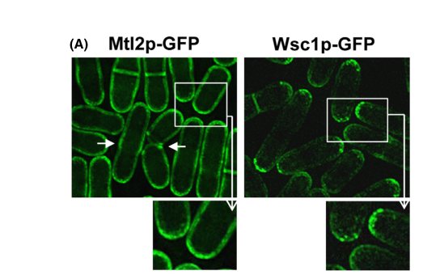

## Question

# Gene Research for Functional Annotation

## ⚠️ CRITICAL: Gene/Protein Identification Context

**BEFORE YOU BEGIN RESEARCH:** You MUST verify you are researching the CORRECT gene/protein. Gene symbols can be ambiguous, especially for less well-characterized genes from non-model organisms.

### Target Gene/Protein Identity (from UniProt):
- **UniProt Accession:** P87179
- **Protein Description:** RecName: Full=Cell wall integrity and stress response component 1; Flags: Precursor;
- **Gene Information:** Name=wsc1; ORFNames=SPBC30B4.01c, SPBC3D6.14c;
- **Organism (full):** Schizosaccharomyces pombe (strain 972 / ATCC 24843) (Fission yeast).
- **Protein Family:** Not specified in UniProt
- **Key Domains:** Kremen_rcpt. (IPR051836); WSC_carb-bd. (IPR002889); WSC (PF01822)

### MANDATORY VERIFICATION STEPS:

1. **Check if the gene symbol "wsc1" matches the protein description above**
2. **Verify the organism is correct:** Schizosaccharomyces pombe (strain 972 / ATCC 24843) (Fission yeast).
3. **Check if protein family/domains align with what you find in literature**
4. **If you find literature for a DIFFERENT gene with the same or similar symbol, STOP**

### If Gene Symbol is Ambiguous or You Cannot Find Relevant Literature:

**DO NOT PROCEED WITH RESEARCH ON A DIFFERENT GENE.** Instead:
- State clearly: "The gene symbol 'wsc1' is ambiguous or literature is limited for this specific protein"
- Explain what you found (e.g., "Found extensive literature on a different gene with the same symbol in a different organism")
- Describe the protein based ONLY on the UniProt information provided above
- Suggest that the protein function can be inferred from domain/family information

### Research Target:

Please provide a comprehensive research report on the gene **wsc1** (gene ID: wsc1, UniProt: P87179) in SCHPO.

The research report should be a detailed narrative explaining the function, biological processes, and localization of the gene product. Citations should be given for all claims.

You should prioritize authoritative reviews and primary scientific literature when conducting research. You can supplement
this with annotations you find in gene/protein databases, but these can be outdated or inaccurate.

We are specifically interested in the primary function of the gene - for enzymes, what reaction is catalyzed, and what is the substrate specificity? For transporters, what is the substrate? For structural proteins or adapters, what is the broader structural role? For signaling molecules, what is the role in the pathway.

We are interested in where in or outside the cell the gene product carries out its function.

We are also interested in the signaling or biochemical pathways in which the gene functions. We are less interested in broad pleiotropic effects, except where these elucidate the precise role.

Include evidence where possible. We are interested in both experimental evidence as well as inference from structure, evolution, or bioinformatic analysis. Precise studies should be prioritized over high-throughput, where available.

## Output

Question: You are an expert researcher providing comprehensive, well-cited information.

Provide detailed information focusing on:
1. Key concepts and definitions with current understanding
2. Recent developments and latest research (prioritize 2023-2024 sources)
3. Current applications and real-world implementations
4. Expert opinions and analysis from authoritative sources
5. Relevant statistics and data from recent studies

Format as a comprehensive research report with proper citations. Include URLs and publication dates where available.
Always prioritize recent, authoritative sources and provide specific citations for all major claims.

# Gene Research for Functional Annotation

## ⚠️ CRITICAL: Gene/Protein Identification Context

**BEFORE YOU BEGIN RESEARCH:** You MUST verify you are researching the CORRECT gene/protein. Gene symbols can be ambiguous, especially for less well-characterized genes from non-model organisms.

### Target Gene/Protein Identity (from UniProt):
- **UniProt Accession:** P87179
- **Protein Description:** RecName: Full=Cell wall integrity and stress response component 1; Flags: Precursor;
- **Gene Information:** Name=wsc1; ORFNames=SPBC30B4.01c, SPBC3D6.14c;
- **Organism (full):** Schizosaccharomyces pombe (strain 972 / ATCC 24843) (Fission yeast).
- **Protein Family:** Not specified in UniProt
- **Key Domains:** Kremen_rcpt. (IPR051836); WSC_carb-bd. (IPR002889); WSC (PF01822)

### MANDATORY VERIFICATION STEPS:

1. **Check if the gene symbol "wsc1" matches the protein description above**
2. **Verify the organism is correct:** Schizosaccharomyces pombe (strain 972 / ATCC 24843) (Fission yeast).
3. **Check if protein family/domains align with what you find in literature**
4. **If you find literature for a DIFFERENT gene with the same or similar symbol, STOP**

### If Gene Symbol is Ambiguous or You Cannot Find Relevant Literature:

**DO NOT PROCEED WITH RESEARCH ON A DIFFERENT GENE.** Instead:
- State clearly: "The gene symbol 'wsc1' is ambiguous or literature is limited for this specific protein"
- Explain what you found (e.g., "Found extensive literature on a different gene with the same symbol in a different organism")
- Describe the protein based ONLY on the UniProt information provided above
- Suggest that the protein function can be inferred from domain/family information

### Research Target:

Please provide a comprehensive research report on the gene **wsc1** (gene ID: wsc1, UniProt: P87179) in SCHPO.

The research report should be a detailed narrative explaining the function, biological processes, and localization of the gene product. Citations should be given for all claims.

You should prioritize authoritative reviews and primary scientific literature when conducting research. You can supplement
this with annotations you find in gene/protein databases, but these can be outdated or inaccurate.

We are specifically interested in the primary function of the gene - for enzymes, what reaction is catalyzed, and what is the substrate specificity? For transporters, what is the substrate? For structural proteins or adapters, what is the broader structural role? For signaling molecules, what is the role in the pathway.

We are interested in where in or outside the cell the gene product carries out its function.

We are also interested in the signaling or biochemical pathways in which the gene functions. We are less interested in broad pleiotropic effects, except where these elucidate the precise role.

Include evidence where possible. We are interested in both experimental evidence as well as inference from structure, evolution, or bioinformatic analysis. Precise studies should be prioritized over high-throughput, where available.

## Research report: Functional annotation of **wsc1** (UniProt **P87179**) in *Schizosaccharomyces pombe* (strain 972)

### 0) Identity verification (critical disambiguation)
The gene symbol **wsc1** is used in multiple fungi (e.g., *Saccharomyces cerevisiae* Wsc1), but the evidence summarized here is restricted to **fission yeast (*Schizosaccharomyces pombe*) Wsc1** consistent with the UniProt target description (“cell wall integrity and stress response component 1; precursor”) and with primary *S. pombe* experimentation explicitly on **SpWsc1p**. (cruz2013thefissionyeast pages 1-2, cansado2021thefissionyeast pages 2-3)

### 1) Key concepts and definitions (current understanding)

#### 1.1 What is Wsc1?
In *S. pombe*, **Wsc1 is a plasma-membrane/cell-surface, cell wall stress sensor-like protein** implicated in maintaining cell wall integrity under stress by coupling extracellular wall status to intracellular signaling. Primary work characterizes Wsc1 (together with Mtl2) as having “structural features indicative of plasma membrane-associated cell wall sensors” and shows it functions by **activating the GTPase Rho1**. (cruz2013thefissionyeast pages 1-2)

A later fission-yeast review describes Wsc1 more specifically as a **plasma membrane-associated, serine-rich cell wall “mechanosensor”**, localized at active growth sites and the division septum, proposed to detect mechanical stress associated with growth and wall remodeling. (cansado2021thefissionyeast pages 3-5)

#### 1.2 How are Wsc-family sensors typically built (domain/topology inference)?
Direct topology/domain mapping for *S. pombe* Wsc1 is not provided in the *S. pombe* primary evidence excerpted here; however, **Wsc-type fungal sensors are widely described as single-pass membrane proteins** with an N-terminal extracellular cysteine-rich/WSC domain, an extracellular Ser/Thr-rich region, a transmembrane helix, and a cytoplasmic tail that couples to downstream signaling. This architecture is detailed in fungal Wsc-family reviews and structural work (performed in *S. cerevisiae*), and is consistent with the UniProt-reported WSC-related domains for P87179. (schoppner2022structureofthe pages 1-2, yoshimi2022cellwallintegrity pages 2-4)

### 2) Molecular function and pathway role in *S. pombe*

#### 2.1 Primary function: activation of Rho1 to promote cell-wall biosynthesis
The strongest *S. pombe*-specific functional conclusion is that **Wsc1 acts upstream of Rho1** during cell-wall stress responses.

* Genetic evidence: **wsc1Δ** and **mtl2Δ** are individually viable, but **wsc1Δ mtl2Δ** is lethal; this lethality is **rescued by overexpression of Rho1 or its GEFs**, placing Wsc1/Mtl2 functionally upstream of Rho1 activation. (cruz2013thefissionyeast pages 1-2)
* Biochemical evidence: under cell-wall stress, **wsc1Δ and mtl2Δ show reduced levels of Rho1-GTP**, indicating impaired Rho1 activation in the absence of these sensors. (cruz2013thefissionyeast pages 1-2)
* Effector linkage: Wsc1 **interacts with the Rho-GEF Rgf2**, and **Wsc1 overexpression activates cell wall biosynthesis**, consistent with a Wsc1 → Rgf2 → Rho1 axis that stimulates wall-building enzymes such as glucan synthase. (cruz2013thefissionyeast pages 1-2)

#### 2.2 Relationship to the canonical Pmk1 cell integrity MAPK pathway (CIP)
A key nuance in *S. pombe* is that Wsc1’s major demonstrated role is **not** to serve as an essential upstream activator of the Pmk1 MAPK module.

Cruz et al. report that **Pmk1 phosphorylation/activation is not markedly affected** by deletion of **wsc1** (or **mtl2**) under multiple stress conditions; thus, Pmk1 signaling can remain active during cell-wall stress even when Wsc1/Mtl2 are absent. (cruz2013thefissionyeast pages 11-13)

The fission-yeast CIP review similarly notes that although Wsc1/Mtl2 contribute to maintaining physiological Rho1-GTP levels under stress, **CIP/Pmk1 activity is not markedly reduced in their absence**, supporting partially MAPK-independent roles for these sensors. (cansado2021thefissionyeast pages 2-3)

### 3) Subcellular localization and cellular context

#### 3.1 Localization pattern
Primary microscopy shows **Wsc1p-GFP concentrated in patches at the cell tips**, consistent with polarized growth-zone localization at the cortex/plasma membrane. (cruz2013thefissionyeast pages 1-2)

The fission-yeast review expands the localization description: **Wsc1 localizes at active growth sites and the division septum**, aligning with a role in sensing wall stress during tip growth and cytokinesis-associated wall remodeling. (cansado2021thefissionyeast pages 2-3, cansado2021thefissionyeast pages 3-5)

#### 3.2 Visual evidence (figures)
The Wsc1p-GFP **cell-tip patch localization** is supported by a cropped figure panel from the primary paper. (cruz2013thefissionyeast media f77ee088)

Stress-response spot assays (including caspofungin-related assays in the main figures) are also available as cropped figure evidence from the same study. (cruz2013thefissionyeast media 95773a2e, cruz2013thefissionyeast media 958fd2d6)

### 4) Phenotypes, assays, and quantitative details

#### 4.1 Redundancy with Mtl2 and stress sensitivity
Cruz et al. conclude that Wsc1 and Mtl2 contribute to stress adaptation with partial redundancy: **wsc1Δ** alone shows a mild phenotype under the tested conditions, whereas **mtl2Δ** is more stress-sensitive, and the **double deletion is lethal** unless Rho1/GEFs are overexpressed. (cruz2013thefissionyeast pages 1-2, cruz2013thefissionyeast pages 11-13)

#### 4.2 Quantitative assay conditions reported
The study’s stress phenotyping includes spot assays on YES plates with defined stressor concentrations; the excerpt provides the following explicit conditions: **caffeine 15 mmol/L**, **sodium orthovanadate 1.7 mmol/L**, **SDS 0.015%**, **H2O2 0.8 mmol/L**, and **NaCl 100 mmol/L**, with colonies scored after **3 days at 28°C**. (cruz2013thefissionyeast pages 17-17)

### 5) Recent developments and latest research (emphasis on 2023–2024)
Within the retrieved full-text evidence set, **no 2023–2024 primary studies were found that provide new *S. pombe*-specific experimental findings about Wsc1 (P87179)** beyond the established mechanistic framework (Wsc1/Mtl2 → Rho1 activation; partial independence from Pmk1 activation). This should be interpreted as a limitation of the currently retrieved corpus rather than definitive absence of recent work.

However, research developments in adjacent fungal systems strengthen mechanistic interpretation of Wsc-type sensors:

* **Structural/mechanistic basis of Wsc-family mechanosensing (2022)**: A crystal structure of the extracellular cysteine-rich domain of *S. cerevisiae* Wsc1 supports a model in which the Wsc domain (PAN/Apple fold) contributes to sensor function and may participate in stress-induced sensor clustering; this provides an interpretive framework for *S. pombe* Wsc1 as a mechanosensor, but it is **not direct *S. pombe* evidence**. Publication date: Apr 2022. URL: https://doi.org/10.3390/jof8040379 (schoppner2022structureofthe pages 1-2)

### 6) Current applications and real-world implementations

#### 6.1 Antifungal relevance of the fungal cell wall and CWI/CIP signaling
Across fungi, the cell wall is widely framed as an attractive antifungal target because humans lack a cell wall; this motivates targeting wall biosynthesis enzymes and wall-integrity signaling. (levin2005cellwallintegrity pages 1-2)

In filamentous fungi and pathogenic yeasts, applied work and reviews describe:
* **Clinically used echinocandins** (caspofungin, micafungin, anidulafungin) that inhibit **β-1,3-glucan synthase** (FKS1/FKS2), with mention of resistance mechanisms (e.g., Fks1-associated resistance). Publication date: Apr 2022. URL: https://doi.org/10.3390/jof8050435 (yoshimi2022cellwallintegrity pages 11-12)
* **Screening/assay reagents** used to probe cell wall integrity, such as cell-wall-binding dyes **Calcofluor white (CFW)** and **Congo red (CR)**, and enzymatic perturbation using **zymolyase**, which can activate CWI MAPK pathways and is used experimentally to trigger/measure responses. (yoshimi2022cellwallintegrity pages 11-12, yoshimi2022cellwallintegrity pages 20-21)

Although these application examples are not specific to *S. pombe* Wsc1, they show how **cell-wall stress sensors and their downstream Rho/PKC/MAPK modules are exploited in antifungal discovery and mechanistic screening**, and they contextualize why Wsc1-like sensors are of interest.

#### 6.2 Fission-yeast specific implementation: genetic screening via vic phenotype
The fission-yeast CIP review describes a concrete selection/screening paradigm tied to CIP activity: mutants **“viable in the presence of immunosuppressant and chloride ion” (vic phenotype)** were used to identify CIP components; pharmacological inhibition of calcineurin uses **FK506**, and absence of Pmk1 activity can suppress chloride sensitivity under calcineurin inhibition. This provides a practical implementation in *S. pombe* for mapping stress-response signaling genetically. (cansado2021thefissionyeast pages 2-3)

### 7) Expert opinions and synthesis (authoritative sources)

*Fission-yeast CIP experts (Cansado et al., Dec 2021/Jan 2022, J. Fungi; https://doi.org/10.3390/jof8010032)* describe Wsc1 as a **mechanosensing module** that can form **stable clusters** acting as signaling platforms at sites of mechanical stress, feeding into Rho1-centered control of cell wall homeostasis and interfacing with broader signaling (e.g., TOR/SAPK cross-talk at the pathway level). (cansado2021thefissionyeast pages 3-5)

*Primary experimental authors (Cruz et al., Jul 2013, MicrobiologyOpen; https://doi.org/10.1002/mbo3.113)* provide the core mechanistic conclusion that Wsc1 (with Mtl2) **activates Rho1** and that **Pmk1 activation persists** in wsc1Δ/mtl2Δ under stress, implying that the fission-yeast sensor-to-MAPK wiring differs from the classic budding-yeast CWI sensor architecture. (cruz2013thefissionyeast pages 1-2, cruz2013thefissionyeast pages 11-13)

### 8) Summary of evidence for functional annotation

> In *Schizosaccharomyces pombe*, Wsc1 (UniProt P87179) is experimentally supported as a plasma-membrane/cell wall stress sensor-like protein that helps maintain cell-wall integrity by activating the GTPase Rho1 rather than acting as a primary upstream activator of the canonical Pmk1 MAPK cascade; a later fission-yeast review further interprets Wsc1 as a mechanosensor that can cluster at sites of mechanical stress (Cruz et al., 2013, https://doi.org/10.1002/mbo3.113; Cansado et al., 2021, https://doi.org/10.3390/jof8010032) (cruz2013thefissionyeast pages 1-2, cansado2021thefissionyeast pages 2-3, cansado2021thefissionyeast pages 3-5).
>
> The key primary localization result is that Wsc1p-GFP concentrates in patches at cell tips, consistent with a polarized cell-surface sensor; review synthesis extends this localization to active growth sites and the division septum (2013, https://doi.org/10.1002/mbo3.113; 2021, https://doi.org/10.3390/jof8010032) (cruz2013thefissionyeast pages 1-2, cansado2021thefissionyeast pages 2-3).
>
> Genetically and biochemically, Wsc1 functions with the Rho1 pathway: Wsc1 interacts with the Rho-GEF Rgf2, overexpression of *wsc1+* activates cell-wall biosynthesis and causes abnormal wall accumulation/growth defects, and *wsc1Δ* cells show reduced Rho1-GTP under cell-wall stress (2013, https://doi.org/10.1002/mbo3.113) (cruz2013thefissionyeast pages 1-2, cruz2013thefissionyeast pages 11-13).
>
> Wsc1 is partially redundant with Mtl2: either single deletion is viable, but simultaneous loss of *wsc1* and *mtl2* is lethal, and this lethality is rescued by overexpression of Rho1 or its GEFs, placing both sensors upstream of Rho1 activation (2013, https://doi.org/10.1002/mbo3.113; 2021, https://doi.org/10.3390/jof8010032) (cruz2013thefissionyeast pages 1-2, cansado2021thefissionyeast pages 2-3).
>
> Importantly, Pmk1/CIP signaling remains active in *wsc1Δ* and *mtl2Δ* cells during cell-wall stress, so Wsc1 is best understood as a Rho1-linked cell-wall stress sensor/mechanosensory module whose major experimentally demonstrated role is to promote Rho1-dependent wall biosynthesis, largely independently of being an essential trigger for Pmk1 activation (2013, https://doi.org/10.1002/mbo3.113; 2021, https://doi.org/10.3390/jof8010032) (cruz2013thefissionyeast pages 11-13, cansado2021thefissionyeast pages 2-3).

*Blockquote: This blockquote summarizes the strongest experimentally supported conclusions about S. pombe Wsc1, focusing on localization, pathway placement, redundancy, and mechanistic interpretation. It is useful as a compact evidence-backed annotation statement for the gene/protein.*

A structured evidence table is provided below for quick curation.

| Evidence type | Key finding | Experimental system/condition | Quantitative details (concentrations, conditions) | Source (first author year) | DOI/URL | Citation ID |
|---|---|---|---|---|---|---|
| domain/topology | **Identity verified for the target protein**: S. pombe Wsc1 is described as a plasma-membrane-associated, serine-rich **cell wall mechanosensor/sensor-like protein**. Wsc-type sensors are characterized by an extracellular WSC/cysteine-rich domain, a long Ser/Thr-rich extracellular region, a single transmembrane segment, and a cytoplasmic tail; this architecture is consistent with the UniProt domain annotation for P87179, although the detailed domain structure is inferred from fungal Wsc-family literature rather than shown directly for S. pombe in the cited primary paper. | Review synthesis for **S. pombe** Wsc1; comparative structural review for fungal Wsc sensors | No direct quantitative measurement given in the cited snippets for S. pombe topology | Cansado 2021; Schöppner 2022 | https://doi.org/10.3390/jof8010032 ; https://doi.org/10.3390/jof8040379 | (cansado2021thefissionyeast pages 3-5, schoppner2022structureofthe pages 1-2) |
| localization | Wsc1 localizes to **active growth sites and the division septum** in S. pombe; primary localization study found **Wsc1p-GFP concentrated in patches at the cell tips**, supporting a polarized cell-surface sensor role. | Wsc1p-GFP localization microscopy in fission yeast | Cell-tip patch localization; review additionally places Wsc1 at growth sites and septum | Cruz 2013; Cansado 2021 | https://doi.org/10.1002/mbo3.113 ; https://doi.org/10.3390/jof8010032 | (cruz2013thefissionyeast pages 1-2, cansado2021thefissionyeast pages 2-3) |
| localization | Wsc1 cortical/cell-surface localization is **not altered by microtubule depolymerization**, indicating stable cortical association rather than microtubule-dependent delivery in that assay. | Fluorescence microscopy after microtubule depolymerization | Qualitative result only; no numeric values provided in snippet | Cruz 2013 | https://doi.org/10.1002/mbo3.113 | (cruz2013thefissionyeast pages 17-17) |
| genetic interaction | **wsc1Δ** and **mtl2Δ** single mutants are viable, but the **double deletion is lethal**; lethality is rescued by overexpression of **Rho1** or its **GEFs**, indicating Wsc1/Mtl2 act upstream of Rho1. | Single and double deletion genetics; suppression by overexpression | Double-mutant lethality; rescue by Rho1 or Rho1-GEF overexpression | Cruz 2013; Cansado 2021 | https://doi.org/10.1002/mbo3.113 ; https://doi.org/10.3390/jof8010032 | (cruz2013thefissionyeast pages 1-2, cansado2021thefissionyeast pages 2-3) |
| genetic interaction | Wsc1 **interacts with the Rho-GEF Rgf2p**, linking the sensor to a specific upstream activator of Rho1. | Interaction/functional analysis in S. pombe | Qualitative interaction reported; no affinity/stoichiometry in snippet | Cruz 2013 | https://doi.org/10.1002/mbo3.113 | (cruz2013thefissionyeast pages 1-2) |
| pathway placement | Wsc1 and Mtl2 **turn on the GTPase Rho1p** and are required to maintain physiological **Rho1-GTP** levels during cell-wall stress. | Stress-response signaling assays in deletion strains | In **wsc1Δ** and **mtl2Δ**, Rho1p-GTP is reduced under cell-wall stress (qualitative in snippet) | Cruz 2013; Cansado 2021 | https://doi.org/10.1002/mbo3.113 ; https://doi.org/10.3390/jof8010032 | (cruz2013thefissionyeast pages 1-2, cansado2021thefissionyeast pages 2-3) |
| pathway placement | Wsc1 signaling is consistent with a branch that acts through **Rgf2 → Rho1** to stimulate **glucan synthase / cell wall biosynthesis**, rather than serving as a main upstream activator of the canonical **Pmk1/CIP MAPK** cascade. | Overexpression, genetic interaction, and pathway assays | Overexpression activates cell-wall biosynthesis; no kinetic constants reported | Cruz 2013 | https://doi.org/10.1002/mbo3.113 | (cruz2013thefissionyeast pages 1-2, cruz2013thefissionyeast pages 11-13) |
| pathway placement | In S. pombe, **Pmk1/CIP activity remains active** in **wsc1Δ** and **mtl2Δ** under cell-wall stress, indicating Wsc1 is **not an essential authentic upstream component** of the canonical CIP/Pmk1 MAPK module. | Pmk1 phosphorylation/activation assays after multiple stresses in mutant backgrounds | Snippet states Pmk1 phosphorylation was not markedly affected; no fold-change values provided | Cruz 2013; Cansado 2021 | https://doi.org/10.1002/mbo3.113 ; https://doi.org/10.3390/jof8010032 | (cruz2013thefissionyeast pages 11-13, cansado2021thefissionyeast pages 2-3) |
| phenotype/assay | **Overproduction of wsc1+** causes **abnormal accumulation of cell-wall material**, **cell growth arrest**, and **morphological abnormalities**, consistent with a positive role in cell-wall biosynthesis signaling. | wsc1+ overexpression in S. pombe | Qualitative phenotype; figure referenced for glucan incorporation/cell-wall accumulation, but no numeric values in snippet | Cruz 2013 | https://doi.org/10.1002/mbo3.113 | (cruz2013thefissionyeast pages 11-13) |
| phenotype/assay | **wsc1Δ** displays only a **very mild phenotype** under tested conditions, whereas **mtl2Δ** is more stress-sensitive; this supports partial redundancy between Wsc1 and Mtl2. | Deletion mutants under stress assays | Qualitative “very mild vic phenotype” for wsc1Δ in snippet | Cruz 2013 | https://doi.org/10.1002/mbo3.113 | (cruz2013thefissionyeast pages 11-13) |
| phenotype/assay | Spot assays included cell-wall and stress agents; the study reports testing with **caffeine**, **sodium orthovanadate**, **SDS**, **H2O2**, and **NaCl**, providing an assay framework for Wsc1-related stress phenotyping. | YES plate spot assays with mutant strains | **15 mmol/L caffeine; 1.7 mmol/L sodium orthovanadate; 0.015% SDS; 0.8 mmol/L H2O2; 100 mmol/L NaCl; colonies scored after 3 days at 28°C** | Cruz 2013 | https://doi.org/10.1002/mbo3.113 | (cruz2013thefissionyeast pages 17-17) |
| applications | Because fungal cell wall integrity signaling controls adaptation to wall damage and the **fungal cell wall is absent in humans**, the Wsc/CWI axis is considered relevant to **antifungal strategy development**; reviews explicitly frame the cell wall/CWI system as an antifungal target area. | Review/translation context across fungi; not a direct Wsc1 intervention study in S. pombe | No S. pombe-specific application metric given in snippet | Cansado 2021; Levin 2005; Yoshimi 2022 | https://doi.org/10.3390/jof8010032 ; https://doi.org/10.1128/mmbr.69.2.262-291.2005 ; https://doi.org/10.3390/jof8050435 | (cansado2021thefissionyeast pages 2-3, levin2005cellwallintegrity pages 1-1, yoshimi2022cellwallintegrity pages 2-4) |
| applications | Wsc-family sensors in fungi are linked to sensitivity/resistance to **cell-wall-targeting agents** (e.g., **caspofungin**, **Congo red**, **Calcofluor white**) in other yeasts/fungi, supporting Wsc-type sensors as informative mechanistic nodes for antifungal screens and cell-wall engineering, though this evidence is not S. pombe-specific. | Comparative fungal structural/industrial reviews | Agents named in snippets: caspofungin, Congo red, Calcofluor white | Schöppner 2022; Yoshimi 2022 | https://doi.org/10.3390/jof8040379 ; https://doi.org/10.3390/jof8050435 | (schoppner2022structureofthe pages 1-2, yoshimi2022cellwallintegrity pages 2-4) |

*Table: This table summarizes experimentally supported and review-supported functional annotation evidence for Schizosaccharomyces pombe Wsc1 (UniProt P87179), covering identity, localization, genetic interactions, pathway placement, phenotypes, and translational relevance. It is useful for distinguishing direct S. pombe evidence from broader fungal Wsc-family inferences.*

### 9) Key takeaways for annotation (what to write in a database)
* **Molecular role**: Cell-surface/cortical sensor-like protein implicated in cell-wall stress responses primarily by promoting **Rho1 activation** (via interaction with **Rgf2**) and stimulating cell-wall biosynthesis. (cruz2013thefissionyeast pages 1-2, cruz2013thefissionyeast pages 11-13)
* **Localization**: Plasma-membrane/cortex at **cell tips (patches)**; review adds **growth sites and division septum**. (cruz2013thefissionyeast pages 1-2, cansado2021thefissionyeast pages 2-3, cruz2013thefissionyeast media f77ee088)
* **Genetic relationships**: **Redundant with Mtl2**; double deletion lethal and suppressible by **Rho1/GEF overexpression**. (cruz2013thefissionyeast pages 1-2, cansado2021thefissionyeast pages 2-3)
* **Pathway placement**: Acts upstream of **Rho1** and a glucan-synthesis branch; **not an essential upstream activator of Pmk1/CIP MAPK activation** under tested stressors. (cruz2013thefissionyeast pages 11-13, cansado2021thefissionyeast pages 2-3)

### References (URLs and publication dates)
* Cruz S. et al. **2013-07**. *MicrobiologyOpen*. “The fission yeast cell wall stress sensor-like proteins Mtl2 and Wsc1 act by turning on the GTPase Rho1p but act independently of the cell wall integrity pathway.” https://doi.org/10.1002/mbo3.113 (cruz2013thefissionyeast pages 1-2)
* Cansado J. et al. **2021-12** (J. Fungi issue 2022-01). *Journal of Fungi*. “The Fission Yeast Cell Integrity Pathway: A Functional Hub for Cell Survival upon Stress and Beyond.” https://doi.org/10.3390/jof8010032 (cansado2021thefissionyeast pages 3-5)
* Schöppner P. et al. **2022-04**. *Journal of Fungi*. “Structure of the Yeast Cell Wall Integrity Sensor Wsc1…” https://doi.org/10.3390/jof8040379 (schoppner2022structureofthe pages 1-2)
* Yoshimi A. et al. **2022-04**. *Journal of Fungi*. “Cell Wall Integrity and Its Industrial Applications in Filamentous Fungi.” https://doi.org/10.3390/jof8050435 (yoshimi2022cellwallintegrity pages 11-12)
* Levin D.E. **2005-06**. *Microbiology and Molecular Biology Reviews*. “Cell Wall Integrity Signaling in Saccharomyces cerevisiae.” https://doi.org/10.1128/mmbr.69.2.262-291.2005 (levin2005cellwallintegrity pages 1-2)

References

1. (cruz2013thefissionyeast pages 1-2): Sandra Cruz, Sofía Muñoz, Elvira Manjón, Patricia García, and Yolanda Sanchez. The fission yeast cell wall stress sensor-like proteins mtl2 and wsc1 act by turning on the gtpase rho1p but act independently of the cell wall integrity pathway. MicrobiologyOpen, 2:778-794, Jul 2013. URL: https://doi.org/10.1002/mbo3.113, doi:10.1002/mbo3.113. This article has 55 citations and is from a peer-reviewed journal.

2. (cansado2021thefissionyeast pages 2-3): José Cansado, Teresa Soto, Alejandro Franco, Jero Vicente-Soler, and Marisa Madrid. The fission yeast cell integrity pathway: a functional hub for cell survival upon stress and beyond. Journal of Fungi, 8:32, Dec 2021. URL: https://doi.org/10.3390/jof8010032, doi:10.3390/jof8010032. This article has 39 citations.

3. (cansado2021thefissionyeast pages 3-5): José Cansado, Teresa Soto, Alejandro Franco, Jero Vicente-Soler, and Marisa Madrid. The fission yeast cell integrity pathway: a functional hub for cell survival upon stress and beyond. Journal of Fungi, 8:32, Dec 2021. URL: https://doi.org/10.3390/jof8010032, doi:10.3390/jof8010032. This article has 39 citations.

4. (schoppner2022structureofthe pages 1-2): Philipp Schöppner, Anne Pia Lutz, Bernard Johannes Lutterbach, Stefan Brückner, Lars-Oliver Essen, and Hans-Ulrich Mösch. Structure of the yeast cell wall integrity sensor wsc1 reveals an essential role of surface-exposed aromatic clusters. Journal of Fungi, 8:379, Apr 2022. URL: https://doi.org/10.3390/jof8040379, doi:10.3390/jof8040379. This article has 18 citations.

5. (yoshimi2022cellwallintegrity pages 2-4): Akira Yoshimi, Ken Miyazawa, Moriyuki Kawauchi, and Keietsu Abe. Cell wall integrity and its industrial applications in filamentous fungi. Journal of Fungi, 8:435, Apr 2022. URL: https://doi.org/10.3390/jof8050435, doi:10.3390/jof8050435. This article has 45 citations.

6. (cruz2013thefissionyeast pages 11-13): Sandra Cruz, Sofía Muñoz, Elvira Manjón, Patricia García, and Yolanda Sanchez. The fission yeast cell wall stress sensor-like proteins mtl2 and wsc1 act by turning on the gtpase rho1p but act independently of the cell wall integrity pathway. MicrobiologyOpen, 2:778-794, Jul 2013. URL: https://doi.org/10.1002/mbo3.113, doi:10.1002/mbo3.113. This article has 55 citations and is from a peer-reviewed journal.

7. (cruz2013thefissionyeast media f77ee088): Sandra Cruz, Sofía Muñoz, Elvira Manjón, Patricia García, and Yolanda Sanchez. The fission yeast cell wall stress sensor-like proteins mtl2 and wsc1 act by turning on the gtpase rho1p but act independently of the cell wall integrity pathway. MicrobiologyOpen, 2:778-794, Jul 2013. URL: https://doi.org/10.1002/mbo3.113, doi:10.1002/mbo3.113. This article has 55 citations and is from a peer-reviewed journal.

8. (cruz2013thefissionyeast media 95773a2e): Sandra Cruz, Sofía Muñoz, Elvira Manjón, Patricia García, and Yolanda Sanchez. The fission yeast cell wall stress sensor-like proteins mtl2 and wsc1 act by turning on the gtpase rho1p but act independently of the cell wall integrity pathway. MicrobiologyOpen, 2:778-794, Jul 2013. URL: https://doi.org/10.1002/mbo3.113, doi:10.1002/mbo3.113. This article has 55 citations and is from a peer-reviewed journal.

9. (cruz2013thefissionyeast media 958fd2d6): Sandra Cruz, Sofía Muñoz, Elvira Manjón, Patricia García, and Yolanda Sanchez. The fission yeast cell wall stress sensor-like proteins mtl2 and wsc1 act by turning on the gtpase rho1p but act independently of the cell wall integrity pathway. MicrobiologyOpen, 2:778-794, Jul 2013. URL: https://doi.org/10.1002/mbo3.113, doi:10.1002/mbo3.113. This article has 55 citations and is from a peer-reviewed journal.

10. (cruz2013thefissionyeast pages 17-17): Sandra Cruz, Sofía Muñoz, Elvira Manjón, Patricia García, and Yolanda Sanchez. The fission yeast cell wall stress sensor-like proteins mtl2 and wsc1 act by turning on the gtpase rho1p but act independently of the cell wall integrity pathway. MicrobiologyOpen, 2:778-794, Jul 2013. URL: https://doi.org/10.1002/mbo3.113, doi:10.1002/mbo3.113. This article has 55 citations and is from a peer-reviewed journal.

11. (levin2005cellwallintegrity pages 1-2): David E. Levin. Cell wall integrity signaling in saccharomyces cerevisiae. Microbiology and Molecular Biology Reviews, 69:262-291, Jun 2005. URL: https://doi.org/10.1128/mmbr.69.2.262-291.2005, doi:10.1128/mmbr.69.2.262-291.2005. This article has 1470 citations and is from a domain leading peer-reviewed journal.

12. (yoshimi2022cellwallintegrity pages 11-12): Akira Yoshimi, Ken Miyazawa, Moriyuki Kawauchi, and Keietsu Abe. Cell wall integrity and its industrial applications in filamentous fungi. Journal of Fungi, 8:435, Apr 2022. URL: https://doi.org/10.3390/jof8050435, doi:10.3390/jof8050435. This article has 45 citations.

13. (yoshimi2022cellwallintegrity pages 20-21): Akira Yoshimi, Ken Miyazawa, Moriyuki Kawauchi, and Keietsu Abe. Cell wall integrity and its industrial applications in filamentous fungi. Journal of Fungi, 8:435, Apr 2022. URL: https://doi.org/10.3390/jof8050435, doi:10.3390/jof8050435. This article has 45 citations.

14. (levin2005cellwallintegrity pages 1-1): David E. Levin. Cell wall integrity signaling in saccharomyces cerevisiae. Microbiology and Molecular Biology Reviews, 69:262-291, Jun 2005. URL: https://doi.org/10.1128/mmbr.69.2.262-291.2005, doi:10.1128/mmbr.69.2.262-291.2005. This article has 1470 citations and is from a domain leading peer-reviewed journal.

## Artifacts

- [Edison artifact artifact-00](wsc1-deep-research-falcon_artifacts/artifact-00.md)
- [Edison artifact artifact-01](wsc1-deep-research-falcon_artifacts/artifact-01.md)

## Citations

1. cruz2013thefissionyeast pages 1-2
2. cansado2021thefissionyeast pages 3-5
3. cruz2013thefissionyeast pages 11-13
4. cansado2021thefissionyeast pages 2-3
5. cruz2013thefissionyeast pages 17-17
6. schoppner2022structureofthe pages 1-2
7. levin2005cellwallintegrity pages 1-2
8. yoshimi2022cellwallintegrity pages 11-12
9. yoshimi2022cellwallintegrity pages 2-4
10. yoshimi2022cellwallintegrity pages 20-21
11. levin2005cellwallintegrity pages 1-1
12. https://doi.org/10.3390/jof8040379
13. https://doi.org/10.3390/jof8050435
14. https://doi.org/10.3390/jof8010032
15. https://doi.org/10.1002/mbo3.113
16. https://doi.org/10.1002/mbo3.113;
17. https://doi.org/10.1128/mmbr.69.2.262-291.2005
18. https://doi.org/10.1002/mbo3.113,
19. https://doi.org/10.3390/jof8010032,
20. https://doi.org/10.3390/jof8040379,
21. https://doi.org/10.3390/jof8050435,
22. https://doi.org/10.1128/mmbr.69.2.262-291.2005,