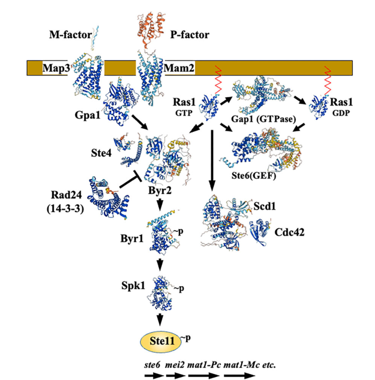

## Question

# Gene Research for Functional Annotation

## ⚠️ CRITICAL: Gene/Protein Identification Context

**BEFORE YOU BEGIN RESEARCH:** You MUST verify you are researching the CORRECT gene/protein. Gene symbols can be ambiguous, especially for less well-characterized genes from non-model organisms.

### Target Gene/Protein Identity (from UniProt):
- **UniProt Accession:** O14100
- **Protein Description:** RecName: Full=Protein zds1; AltName: Full=Meiotically up-regulated gene 88 protein;
- **Gene Information:** Name=zds1; Synonyms=mug88; ORFNames=SPAC31F12.01, SPAC637.14;
- **Organism (full):** Schizosaccharomyces pombe (strain 972 / ATCC 24843) (Fission yeast).
- **Protein Family:** Not specified in UniProt
- **Key Domains:** Zds1/2. (IPR040206); ZDS1_C. (IPR013941); Zds_C (PF08632)

### MANDATORY VERIFICATION STEPS:

1. **Check if the gene symbol "zds1" matches the protein description above**
2. **Verify the organism is correct:** Schizosaccharomyces pombe (strain 972 / ATCC 24843) (Fission yeast).
3. **Check if protein family/domains align with what you find in literature**
4. **If you find literature for a DIFFERENT gene with the same or similar symbol, STOP**

### If Gene Symbol is Ambiguous or You Cannot Find Relevant Literature:

**DO NOT PROCEED WITH RESEARCH ON A DIFFERENT GENE.** Instead:
- State clearly: "The gene symbol 'zds1' is ambiguous or literature is limited for this specific protein"
- Explain what you found (e.g., "Found extensive literature on a different gene with the same symbol in a different organism")
- Describe the protein based ONLY on the UniProt information provided above
- Suggest that the protein function can be inferred from domain/family information

### Research Target:

Please provide a comprehensive research report on the gene **zds1** (gene ID: zds1, UniProt: O14100) in SCHPO.

The research report should be a detailed narrative explaining the function, biological processes, and localization of the gene product. Citations should be given for all claims.

You should prioritize authoritative reviews and primary scientific literature when conducting research. You can supplement
this with annotations you find in gene/protein databases, but these can be outdated or inaccurate.

We are specifically interested in the primary function of the gene - for enzymes, what reaction is catalyzed, and what is the substrate specificity? For transporters, what is the substrate? For structural proteins or adapters, what is the broader structural role? For signaling molecules, what is the role in the pathway.

We are interested in where in or outside the cell the gene product carries out its function.

We are also interested in the signaling or biochemical pathways in which the gene functions. We are less interested in broad pleiotropic effects, except where these elucidate the precise role.

Include evidence where possible. We are interested in both experimental evidence as well as inference from structure, evolution, or bioinformatic analysis. Precise studies should be prioritized over high-throughput, where available.

## Output

Question: You are an expert researcher providing comprehensive, well-cited information.

Provide detailed information focusing on:
1. Key concepts and definitions with current understanding
2. Recent developments and latest research (prioritize 2023-2024 sources)
3. Current applications and real-world implementations
4. Expert opinions and analysis from authoritative sources
5. Relevant statistics and data from recent studies

Format as a comprehensive research report with proper citations. Include URLs and publication dates where available.
Always prioritize recent, authoritative sources and provide specific citations for all major claims.

# Gene Research for Functional Annotation

## ⚠️ CRITICAL: Gene/Protein Identification Context

**BEFORE YOU BEGIN RESEARCH:** You MUST verify you are researching the CORRECT gene/protein. Gene symbols can be ambiguous, especially for less well-characterized genes from non-model organisms.

### Target Gene/Protein Identity (from UniProt):
- **UniProt Accession:** O14100
- **Protein Description:** RecName: Full=Protein zds1; AltName: Full=Meiotically up-regulated gene 88 protein;
- **Gene Information:** Name=zds1; Synonyms=mug88; ORFNames=SPAC31F12.01, SPAC637.14;
- **Organism (full):** Schizosaccharomyces pombe (strain 972 / ATCC 24843) (Fission yeast).
- **Protein Family:** Not specified in UniProt
- **Key Domains:** Zds1/2. (IPR040206); ZDS1_C. (IPR013941); Zds_C (PF08632)

### MANDATORY VERIFICATION STEPS:

1. **Check if the gene symbol "zds1" matches the protein description above**
2. **Verify the organism is correct:** Schizosaccharomyces pombe (strain 972 / ATCC 24843) (Fission yeast).
3. **Check if protein family/domains align with what you find in literature**
4. **If you find literature for a DIFFERENT gene with the same or similar symbol, STOP**

### If Gene Symbol is Ambiguous or You Cannot Find Relevant Literature:

**DO NOT PROCEED WITH RESEARCH ON A DIFFERENT GENE.** Instead:
- State clearly: "The gene symbol 'zds1' is ambiguous or literature is limited for this specific protein"
- Explain what you found (e.g., "Found extensive literature on a different gene with the same symbol in a different organism")
- Describe the protein based ONLY on the UniProt information provided above
- Suggest that the protein function can be inferred from domain/family information

### Research Target:

Please provide a comprehensive research report on the gene **zds1** (gene ID: zds1, UniProt: O14100) in SCHPO.

The research report should be a detailed narrative explaining the function, biological processes, and localization of the gene product. Citations should be given for all claims.

You should prioritize authoritative reviews and primary scientific literature when conducting research. You can supplement
this with annotations you find in gene/protein databases, but these can be outdated or inaccurate.

We are specifically interested in the primary function of the gene - for enzymes, what reaction is catalyzed, and what is the substrate specificity? For transporters, what is the substrate? For structural proteins or adapters, what is the broader structural role? For signaling molecules, what is the role in the pathway.

We are interested in where in or outside the cell the gene product carries out its function.

We are also interested in the signaling or biochemical pathways in which the gene functions. We are less interested in broad pleiotropic effects, except where these elucidate the precise role.

Include evidence where possible. We are interested in both experimental evidence as well as inference from structure, evolution, or bioinformatic analysis. Precise studies should be prioritized over high-throughput, where available.

# Functional annotation report: *Schizosaccharomyces pombe* zds1 (UniProt O14100)

## Identity and principal conclusion

The target is **fission-yeast Zds1**, specified by UniProt O14100 in *Schizosaccharomyces pombe* strain 972/ATCC 24843; the supplied record also gives the names *mug88*, SPAC31F12.01 and SPAC637.14. The literature independently identifies *S. pombe* Zds1 as an ortholog of the **distinct** budding-yeast proteins Zds1 and Zds2. Their experimental mechanisms must not automatically be assigned to O14100. The record’s Zds1/2, ZDS1_C and Zds_C domain annotations are consistent with that orthology, although the retrieved studies did not independently verify the *mug88* synonym or establish a three-dimensional structure for O14100. (kawamukai2024regulationofsexual pages 8-8, kawamukai2024regulationofsexual pages 17-18)

**Best-supported functional description:** Zds1 is a **nonenzymatic-appearing regulatory protein** involved in sexual differentiation and in maintaining normal cell-wall organization and morphology. Genetic experiments connect its pro-sporulation activity to the Byr2–Byr1–Spk1 MAPK pathway, and microscopy places Zds1 in the cytosol, at the septum and at the cell cortex. A 2024 proteomics study additionally found it associated with material purified through a PP2A subunit. Neither a catalytic reaction nor a direct biochemical substrate, binding partner or precise signaling mechanism has been established for fission-yeast Zds1 by the evidence examined here. (kawamukai2024regulationofsexual pages 8-8, dedo2024thegreatwallendosulfinepp2ab55pathway pages 4-5)

The principal observations and their limits are summarized below.

| Finding | Evidence / quantitative data | Interpretation and limitation | Source/date and DOI URL |
|---|---|---|---|
| Promotion of sporulation in *ras1Δ* diploids | Baseline sporulation was **0.3%**; full-length Zds1 increased it to **11.2%**, and the Zds1 C-terminal region increased it to **21.9%**. | Strong genetic/overexpression evidence that Zds1 can bypass the requirement for Ras1 and promote sexual differentiation. It does not establish Zds1’s direct molecular target or precise pathway position. | Yakura et al., **February 2006**, as summarized by Kawamukai, **March 2024** (kawamukai2024regulationofsexual pages 8-8). [Original study](https://doi.org/10.1534/genetics.105.050906); [2024 review](https://doi.org/10.1093/bbb/zbae019). Original full text was unavailable for direct inspection. |
| MAPK dependence and meiotic entry | Zds1 expression did **not** induce sporulation in mutants of **Byr2, Byr1, or Spk1**. A genome-wide deletion analysis found homozygous *zds1Δ/zds1Δ* cells defective in meiotic entry. | Places Zds1 function genetically upstream of, parallel to, or convergent upon the Byr2–Byr1–Spk1 cascade downstream of Ras1; it does not prove direct binding or phosphorylation of any cascade component. | Kawamukai, **March 2024** (kawamukai2024regulationofsexual pages 8-8). [DOI](https://doi.org/10.1093/bbb/zbae019). |
| Subcellular localization | A Zds1–GFP fusion localized to the **cytosol, septum, and cell cortex**. | Supports a non-nuclear, spatial regulatory or scaffold/adaptor role associated with cortical growth and division sites. GFP localization alone does not demonstrate where each biological activity occurs or whether the tag fully preserves native behavior. | Yakura et al., **February 2006**, summarized by Kawamukai, **March 2024** (kawamukai2024regulationofsexual pages 8-8, kawamukai2024regulationofsexual pages 8-9). [Original study](https://doi.org/10.1534/genetics.105.050906); [2024 review](https://doi.org/10.1093/bbb/zbae019). |
| Cell-wall integrity, morphology, calcium/cold tolerance, and survival | *zds1Δ* cells were **round**, highly **zymolyase-sensitive**, and had **thicker cell walls** than wild type; they were also sensitive to **CaCl₂**, showed markedly inhibited growth at cold temperatures, and lost viability in stationary phase. | Convergent phenotypes support a role in cell-wall organization and stress adaptation. These are loss-of-function phenotypes and do not identify a direct biochemical substrate or distinguish primary defects from downstream consequences. | Yakura et al., **February 2006**, summarized by Kawamukai, **March 2024** (kawamukai2024regulationofsexual pages 8-8). [Original study](https://doi.org/10.1534/genetics.105.050906); [2024 review](https://doi.org/10.1093/bbb/zbae019). |
| Functional importance of the C terminus | Overexpression of the C-terminal region produced **multiple septa** and **abnormal zygotes**. The C terminus was assigned as the functional region, whereas the N terminus was described as negatively regulatory. | Domain perturbation links the conserved C-terminal region to septation, morphology, and sexual differentiation. Because the key evidence uses overexpression/truncation, nonphysiological dosage or dominant effects remain possible. | Yakura et al., **February 2006**, summarized by Kawamukai, **March 2024** (kawamukai2024regulationofsexual pages 8-8, kawamukai2024regulationofsexual pages 8-9). [Original study](https://doi.org/10.1534/genetics.105.050906); [2024 review](https://doi.org/10.1093/bbb/zbae019). |
| Association with a PP2A complex | After **1 hour of nitrogen starvation**, Paa1–YFP was immunopurified and associated proteins were identified by mass spectrometry; Zds1 was recovered among proteins classified as PP2A regulators. | Recent proteomic evidence places Zds1 in or near a PP2A-containing complex under nitrogen stress. This single affinity-MS result does **not** prove direct Zds1–Pab1 binding, stoichiometric complex membership, PP2A inhibition, substrate specificity, or enzymatic activity by Zds1. | del Dedo et al., **December 2024** (dedo2024thegreatwallendosulfinepp2ab55pathway pages 4-5). [DOI](https://doi.org/10.1038/s41467-024-55004-4). |

*Table: Gene-specific evidence for *Schizosaccharomyces pombe* Zds1/O14100, separating direct phenotypic and localization observations from pathway inference and proteomic association. Findings from budding-yeast Zds1/Zds2 were excluded.*

## Biological role and pathway position

The strongest pathway experiment tested whether Zds1 could restore sporulation to *ras1Δ* diploids. Sporulation rose from **0.3%** in the relevant baseline condition to **11.2%** with full-length Zds1, and to **21.9%** with its C-terminal region. Conversely, Zds1 expression did **not** induce sporulation in strains defective in *byr2*, *byr1* or *spk1*. These data support a regulatory contribution to sexual differentiation that can bypass a Ras1-dependent requirement but still requires a functional downstream MAPK cascade. They do **not** demonstrate that Zds1 directly activates Byr2, binds a pathway kinase or occupies a unique linear position between Ras1 and Byr2. Homozygous *zds1* deletion was also associated with defective meiotic entry in a genome-wide deletion analysis. (kawamukai2024regulationofsexual pages 8-8)

In the established fission-yeast pathway, Ras1 signals through the MAPKKK Byr2, MAPKK Byr1 and MAPK Spk1 toward sexual-differentiation gene expression. Ras1 also has a distinct Scd1–Cdc42 output relevant to cell shape; thus, Zds1’s effects on sporulation and morphology should not be assumed to share one direct target. The review’s pathway schematic depicts the Ras1–Byr2–Byr1–Spk1 sequence but **does not place Zds1 in the figure**; its position is inferred from the genetic experiments above. (kawamukai2024regulationofsexual pages 7-8, kawamukai2024regulationofsexual pages 6-7, kawamukai2024regulationofsexual media 478a2ffd, kawamukai2024regulationofsexual pages 8-8)

Loss of *zds1* produces **rounder cells, unusually high zymolyase sensitivity and a thicker cell wall** relative to wild type. Mutants are also sensitive to CaCl₂, grow poorly at low temperature and lose viability in stationary phase. Taken together, these findings support a role in cell-wall integrity and cortical morphogenesis, but they do not show that Zds1 itself synthesizes wall material or identify a direct wall-synthesis substrate. Overexpressing its C-terminal region causes **multiple septa and abnormal zygotes**, linking that region to division-site and mating morphology; overexpression effects should not be mistaken for proof of its normal physiological dosage or mechanism. (kawamukai2024regulationofsexual pages 8-8, kawamukai2024regulationofsexual pages 8-9)

## Molecular activity, domains and localization

The supplied UniProt annotations identify a conserved Zds1/2-related region and C-terminal ZDS1_C/Zds_C signatures. Consistent with a functional importance for the C terminus, C-terminal expression was more effective than full-length expression in the *ras1Δ* sporulation experiment; the 2024 review describes the N terminus as negatively regulatory. This supports a **regulatory/adaptor-like working hypothesis**, not a demonstrated enzymatic activity or a proven direct molecular interaction mediated by the domain in *S. pombe*. No reaction, substrate specificity or transport substrate can presently be assigned to O14100 from these experiments. (kawamukai2024regulationofsexual pages 8-8)

**Where it acts:** A Zds1–GFP fusion was observed in the **cytosol, septum and cell cortex**. Septal and cortical enrichment is consistent with its septation and cell-shape phenotypes, while cytosolic localization could permit a signaling role. Localization alone cannot determine where sporulation signaling is executed, and the retrieved evidence does not establish an extracellular, secreted or specific nuclear site of action. (kawamukai2024regulationofsexual pages 8-8, kawamukai2024regulationofsexual pages 8-9)

## Recent research and strength of the PP2A connection

In a **December 2024** fission-yeast study, del Dedo and colleagues immunopurified **Paa1–YFP after one hour of nitrogen starvation** and identified associated proteins by mass spectrometry. Zds1 was detected among proteins the authors classified as PP2A regulators. This is relevant, condition-specific **co-purification evidence** for proximity to a PP2A-containing assembly; it does not by itself establish direct binding to the B55 subunit Pab1, inhibition or activation of PP2A, a phosphatase substrate, or a causal explanation for Zds1’s mating and wall phenotypes. No Zds1-specific phosphatase or mutant-rescue experiment was identified in that study’s examined results. (dedo2024thegreatwallendosulfinepp2ab55pathway pages 4-5)

Mechanistic work in *Saccharomyces cerevisiae* shows that its Zds1 interacts with the PP2A regulatory subunit Cdc55 through a C-terminal motif and affects mitotic-exit regulation. **That finding concerns another organism and cannot be treated as direct evidence that O14100 has the same binding specificity, subcellular behavior or mitotic-exit function.** It provides a testable comparative hypothesis alongside the 2024 *S. pombe* proteomic observation. (calabria2012zds1regulatespp2acdc55 pages 7-8, calabria2012zds1regulatespp2acdc55 pages 1-2, dedo2024thegreatwallendosulfinepp2ab55pathway pages 4-5)

## Research use and remaining gaps

At present, *zds1* deletion and C-terminal-expression strains serve as **experimental probes** of fission-yeast mating, meiotic entry, septation, calcium/cold tolerance and cell-wall integrity; the evidence reviewed does not establish a clinical application. The most decisive missing experiments are endogenous-level interaction validation with PP2A components and MAPK regulators, domain-resolved rescue at physiological expression, and direct biochemical assays that distinguish PP2A regulation from indirect co-purification. The original detailed *S. pombe* characterization by Yakura and colleagues could not be retrieved in full through the available literature tools, so its quantitative and localization findings above are reported through Kawamukai’s 2024 review rather than claimed as independently rechecked against the original figures. (kawamukai2024regulationofsexual pages 8-8, dedo2024thegreatwallendosulfinepp2ab55pathway pages 4-5, kawamukai2024regulationofsexual pages 17-18)

### Principal sources

- **Yakura M et al.**, “Zds1, a novel gene encoding an ortholog of Zds1 and Zds2, controls sexual differentiation, cell wall integrity and cell morphology in fission yeast.” *Genetics* **172**, 811–825; **February 2006**. https://doi.org/10.1534/genetics.105.050906. Original-study identity and findings corroborated in the review below; full text not independently examined here. (kawamukai2024regulationofsexual pages 17-18, kawamukai2024regulationofsexual pages 8-8)
- **Kawamukai M.**, “Regulation of sexual differentiation initiation in *Schizosaccharomyces pombe*.” *Bioscience, Biotechnology, and Biochemistry* **88**, 475–492; **March 2024**. https://doi.org/10.1093/bbb/zbae019. Authoritative organism-specific synthesis and source of the reported Zds1 quantitative, phenotypic and localization details. (kawamukai2024regulationofsexual pages 8-8)
- **del Dedo JE et al.**, “The Greatwall–Endosulfine–PP2A/B55 pathway regulates entry into quiescence by enhancing translation of Elongator-tunable transcripts.” *Nature Communications* **15**; **December 2024**. https://doi.org/10.1038/s41467-024-55004-4. Source for nitrogen-starvation PP2A-associated proteomics; not a demonstration of Zds1’s direct biochemical mechanism. (dedo2024thegreatwallendosulfinepp2ab55pathway pages 4-5)

References

1. (kawamukai2024regulationofsexual pages 8-8): Makoto Kawamukai. Regulation of sexual differentiation initiation in schizosaccharomyces pombe. Bioscience, biotechnology, and biochemistry, 88:475-492, Mar 2024. URL: https://doi.org/10.1093/bbb/zbae019, doi:10.1093/bbb/zbae019. This article has 17 citations.

2. (kawamukai2024regulationofsexual pages 17-18): Makoto Kawamukai. Regulation of sexual differentiation initiation in schizosaccharomyces pombe. Bioscience, biotechnology, and biochemistry, 88:475-492, Mar 2024. URL: https://doi.org/10.1093/bbb/zbae019, doi:10.1093/bbb/zbae019. This article has 17 citations.

3. (dedo2024thegreatwallendosulfinepp2ab55pathway pages 4-5): Javier Encinar del Dedo, M. Belén Suárez, Rafael López-San Segundo, Alicia Vázquez-Bolado, Jingjing Sun, Natalia García-Blanco, Patricia García, Pauline Tricquet, Jun-Song Chen, Peter C. Dedon, Kathleen L. Gould, Elena Hidalgo, Damien Hermand, and Sergio Moreno. The greatwall-endosulfine-pp2a/b55 pathway regulates entry into quiescence by enhancing translation of elongator-tunable transcripts. Nature Communications, Dec 2024. URL: https://doi.org/10.1038/s41467-024-55004-4, doi:10.1038/s41467-024-55004-4. This article has 6 citations and is from a highest quality peer-reviewed journal.

4. (kawamukai2024regulationofsexual pages 8-9): Makoto Kawamukai. Regulation of sexual differentiation initiation in schizosaccharomyces pombe. Bioscience, biotechnology, and biochemistry, 88:475-492, Mar 2024. URL: https://doi.org/10.1093/bbb/zbae019, doi:10.1093/bbb/zbae019. This article has 17 citations.

5. (kawamukai2024regulationofsexual pages 7-8): Makoto Kawamukai. Regulation of sexual differentiation initiation in schizosaccharomyces pombe. Bioscience, biotechnology, and biochemistry, 88:475-492, Mar 2024. URL: https://doi.org/10.1093/bbb/zbae019, doi:10.1093/bbb/zbae019. This article has 17 citations.

6. (kawamukai2024regulationofsexual pages 6-7): Makoto Kawamukai. Regulation of sexual differentiation initiation in schizosaccharomyces pombe. Bioscience, biotechnology, and biochemistry, 88:475-492, Mar 2024. URL: https://doi.org/10.1093/bbb/zbae019, doi:10.1093/bbb/zbae019. This article has 17 citations.

7. (kawamukai2024regulationofsexual media 478a2ffd): Makoto Kawamukai. Regulation of sexual differentiation initiation in schizosaccharomyces pombe. Bioscience, biotechnology, and biochemistry, 88:475-492, Mar 2024. URL: https://doi.org/10.1093/bbb/zbae019, doi:10.1093/bbb/zbae019. This article has 17 citations.

8. (calabria2012zds1regulatespp2acdc55 pages 7-8): Ines Calabria, Barbara Baro, Jose-Antonio Rodriguez-Rodriguez, Nuria Russiñol, and Ethel Queralt. Zds1 regulates pp2acdc55 activity and cdc14 activation during mitotic exit through its zds_c motif. Journal of Cell Science, 125:2875-2884, Jun 2012. URL: https://doi.org/10.1242/jcs.097865, doi:10.1242/jcs.097865. This article has 26 citations and is from a domain leading peer-reviewed journal.

9. (calabria2012zds1regulatespp2acdc55 pages 1-2): Ines Calabria, Barbara Baro, Jose-Antonio Rodriguez-Rodriguez, Nuria Russiñol, and Ethel Queralt. Zds1 regulates pp2acdc55 activity and cdc14 activation during mitotic exit through its zds_c motif. Journal of Cell Science, 125:2875-2884, Jun 2012. URL: https://doi.org/10.1242/jcs.097865, doi:10.1242/jcs.097865. This article has 26 citations and is from a domain leading peer-reviewed journal.

## Artifacts

- [Edison artifact artifact-00](zds1-deep-research-falcon_artifacts/artifact-00.md)

## Citations

1. kawamukai2024regulationofsexual pages 8-8
2. kawamukai2024regulationofsexual pages 17-18
3. kawamukai2024regulationofsexual pages 8-9
4. kawamukai2024regulationofsexual pages 7-8
5. kawamukai2024regulationofsexual pages 6-7
6. Original study
7. 2024 review
8. DOI
9. https://doi.org/10.1534/genetics.105.050906
10. https://doi.org/10.1093/bbb/zbae019
11. https://doi.org/10.1038/s41467-024-55004-4
12. https://doi.org/10.1534/genetics.105.050906.
13. https://doi.org/10.1093/bbb/zbae019.
14. https://doi.org/10.1038/s41467-024-55004-4.
15. https://doi.org/10.1093/bbb/zbae019,
16. https://doi.org/10.1038/s41467-024-55004-4,
17. https://doi.org/10.1242/jcs.097865,