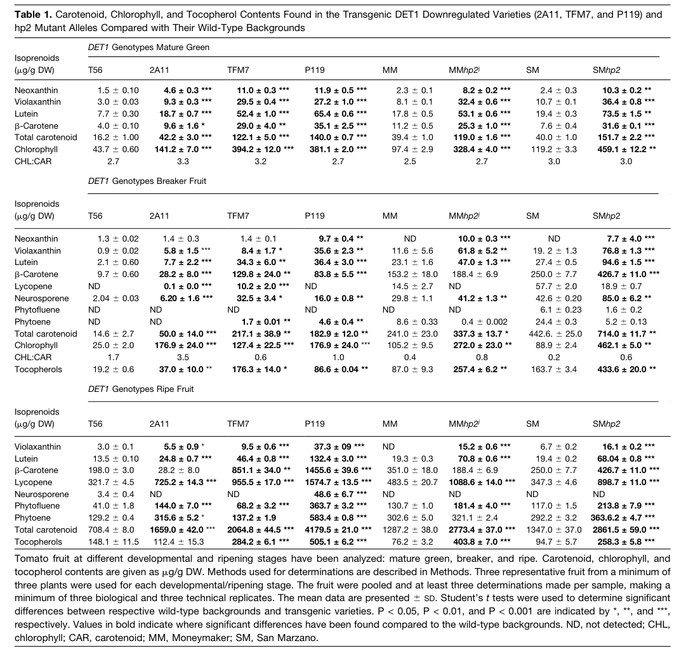

## Question

# Gene Research for Functional Annotation

## ⚠️ CRITICAL: Gene/Protein Identification Context

**BEFORE YOU BEGIN RESEARCH:** You MUST verify you are researching the CORRECT gene/protein. Gene symbols can be ambiguous, especially for less well-characterized genes from non-model organisms.

### Target Gene/Protein Identity (from UniProt):
- **UniProt Accession:** Q9ZNU6
- **Protein Description:** RecName: Full=Light-mediated development protein DET1; AltName: Full=Deetiolated1 homolog; AltName: Full=High pigmentation protein 2; AltName: Full=Protein dark green; AltName: Full=tDET1;
- **Gene Information:** Name=DET1; Synonyms=dg, hp2;
- **Organism (full):** Solanum lycopersicum (Tomato) (Lycopersicon esculentum).
- **Protein Family:** Belongs to the DET1 family. .
- **Key Domains:** 6-hairpin_glycosidase_sf. (IPR008928); De-etiolated_protein_1_Det1. (IPR019138); Det1 (PF09737)

### MANDATORY VERIFICATION STEPS:

1. **Check if the gene symbol "DET1" matches the protein description above**
2. **Verify the organism is correct:** Solanum lycopersicum (Tomato) (Lycopersicon esculentum).
3. **Check if protein family/domains align with what you find in literature**
4. **If you find literature for a DIFFERENT gene with the same or similar symbol, STOP**

### If Gene Symbol is Ambiguous or You Cannot Find Relevant Literature:

**DO NOT PROCEED WITH RESEARCH ON A DIFFERENT GENE.** Instead:
- State clearly: "The gene symbol 'DET1' is ambiguous or literature is limited for this specific protein"
- Explain what you found (e.g., "Found extensive literature on a different gene with the same symbol in a different organism")
- Describe the protein based ONLY on the UniProt information provided above
- Suggest that the protein function can be inferred from domain/family information

### Research Target:

Please provide a comprehensive research report on the gene **DET1** (gene ID: DET1, UniProt: Q9ZNU6) in SOLLC.

The research report should be a detailed narrative explaining the function, biological processes, and localization of the gene product. Citations should be given for all claims.

You should prioritize authoritative reviews and primary scientific literature when conducting research. You can supplement
this with annotations you find in gene/protein databases, but these can be outdated or inaccurate.

We are specifically interested in the primary function of the gene - for enzymes, what reaction is catalyzed, and what is the substrate specificity? For transporters, what is the substrate? For structural proteins or adapters, what is the broader structural role? For signaling molecules, what is the role in the pathway.

We are interested in where in or outside the cell the gene product carries out its function.

We are also interested in the signaling or biochemical pathways in which the gene functions. We are less interested in broad pleiotropic effects, except where these elucidate the precise role.

Include evidence where possible. We are interested in both experimental evidence as well as inference from structure, evolution, or bioinformatic analysis. Precise studies should be prioritized over high-throughput, where available.

## Output

Question: You are an expert researcher providing comprehensive, well-cited information.

Provide detailed information focusing on:
1. Key concepts and definitions with current understanding
2. Recent developments and latest research (prioritize 2023-2024 sources)
3. Current applications and real-world implementations
4. Expert opinions and analysis from authoritative sources
5. Relevant statistics and data from recent studies

Format as a comprehensive research report with proper citations. Include URLs and publication dates where available.
Always prioritize recent, authoritative sources and provide specific citations for all major claims.

# Gene Research for Functional Annotation

## ⚠️ CRITICAL: Gene/Protein Identification Context

**BEFORE YOU BEGIN RESEARCH:** You MUST verify you are researching the CORRECT gene/protein. Gene symbols can be ambiguous, especially for less well-characterized genes from non-model organisms.

### Target Gene/Protein Identity (from UniProt):
- **UniProt Accession:** Q9ZNU6
- **Protein Description:** RecName: Full=Light-mediated development protein DET1; AltName: Full=Deetiolated1 homolog; AltName: Full=High pigmentation protein 2; AltName: Full=Protein dark green; AltName: Full=tDET1;
- **Gene Information:** Name=DET1; Synonyms=dg, hp2;
- **Organism (full):** Solanum lycopersicum (Tomato) (Lycopersicon esculentum).
- **Protein Family:** Belongs to the DET1 family. .
- **Key Domains:** 6-hairpin_glycosidase_sf. (IPR008928); De-etiolated_protein_1_Det1. (IPR019138); Det1 (PF09737)

### MANDATORY VERIFICATION STEPS:

1. **Check if the gene symbol "DET1" matches the protein description above**
2. **Verify the organism is correct:** Solanum lycopersicum (Tomato) (Lycopersicon esculentum).
3. **Check if protein family/domains align with what you find in literature**
4. **If you find literature for a DIFFERENT gene with the same or similar symbol, STOP**

### If Gene Symbol is Ambiguous or You Cannot Find Relevant Literature:

**DO NOT PROCEED WITH RESEARCH ON A DIFFERENT GENE.** Instead:
- State clearly: "The gene symbol 'DET1' is ambiguous or literature is limited for this specific protein"
- Explain what you found (e.g., "Found extensive literature on a different gene with the same symbol in a different organism")
- Describe the protein based ONLY on the UniProt information provided above
- Suggest that the protein function can be inferred from domain/family information

### Research Target:

Please provide a comprehensive research report on the gene **DET1** (gene ID: DET1, UniProt: Q9ZNU6) in SOLLC.

The research report should be a detailed narrative explaining the function, biological processes, and localization of the gene product. Citations should be given for all claims.

You should prioritize authoritative reviews and primary scientific literature when conducting research. You can supplement
this with annotations you find in gene/protein databases, but these can be outdated or inaccurate.

We are specifically interested in the primary function of the gene - for enzymes, what reaction is catalyzed, and what is the substrate specificity? For transporters, what is the substrate? For structural proteins or adapters, what is the broader structural role? For signaling molecules, what is the role in the pathway.

We are interested in where in or outside the cell the gene product carries out its function.

We are also interested in the signaling or biochemical pathways in which the gene functions. We are less interested in broad pleiotropic effects, except where these elucidate the precise role.

Include evidence where possible. We are interested in both experimental evidence as well as inference from structure, evolution, or bioinformatic analysis. Precise studies should be prioritized over high-throughput, where available.

## Research report: Tomato DET1 (UniProt Q9ZNU6; gene DET1; synonyms hp2/dg)

### Scope and identity verification (mandatory disambiguation)
The symbol **DET1** is used across eukaryotes; here the evidence base is restricted to **tomato (Solanum lycopersicum) DET1**, genetically defined as the **HIGH PIGMENT 2 (hp2)** locus and including alleles such as **dark green (dg)**. Multiple sources explicitly connect hp2/dg to the tomato **DE-ETIOLATED 1 (DET1)** homolog and place it in the conserved photomorphogenesis repression machinery. Tang et al. state that molecular cloning revealed hp2 encodes **DE-ETIOLATED 1 (DET1)** and that DET1 is part of a **CUL4–DDB1–DET1 E3 ligase** system. (tang2016ubiquitinconjugateddegradationof pages 1-2). Pick et al. also explicitly notes tomato DET1 is “known as HP2” and describes it as a negative regulator of light responses in plants. (pick2007mammaliandet1regulates pages 1-2)

### 1) Key concepts and definitions (current understanding)

#### DET1 as a photomorphogenesis repressor integrated with ubiquitin-dependent proteolysis
In plants, DET1 is a central repressor of light-mediated development (photomorphogenesis). It functions in protein-complex assemblies connected to **CUL4–DDB1–RBX1 cullin-RING E3 ubiquitin ligases (CRL4s)**, which select substrates for **ubiquitin–26S proteasome** degradation. Tomato DET1/hp2 is part of this conserved architecture, and the tomato hp1/hp2 loci (DDB1/DET1) are described as core components of a **CUL4-type E3 ubiquitin ligase** controlling plastid levels and pigment accumulation in fruit. (jia2023theubiquitin–26sproteasome pages 9-10, tang2016ubiquitinconjugateddegradationof pages 1-2)

#### The CDD complex (COP10–DET1–DDB1)
DET1 also participates in the plant **CDD complex**, formed with **DDB1** and **COP10**. COP10 is described as a ubiquitin-conjugating **E2 variant** (UBC fold but lacking the catalytic cysteine), linking DET1 to regulation of ubiquitination reactions. (pick2007mammaliandet1regulates pages 1-2, nezames2012thecop9signalosome pages 3-5)

#### Chromatin association and transcriptional corepression (Arabidopsis evidence informing tomato annotation)
Arabidopsis DET1 has been described as a **nuclear-localized** protein that associates with **non-acetylated core histones**, consistent with chromatin-associated repression functions. (ganpudi2012…ofarabidopsis pages 51-58). A Plant Physiology review describes DET1 as being recruited to promoters in a transcription-factor-dependent manner (e.g., with clock components CCA1/LHY) and functioning as a **transcriptional corepressor**, indicating that DET1 can act directly at gene regulatory regions in addition to regulating protein stability. (nezames2012thecop9signalosome pages 3-5)

### 2) Molecular function and mechanism (tomato-focused, with supported inference)

#### Primary molecular function in tomato: adaptor/regulator within a CRL4 E3 ligase targeting transcription factors
A direct mechanistic study in tomato demonstrates that DET1 is a component of a **CUL4–DDB1–DET1 E3 ligase complex** that promotes **ubiquitin-mediated proteasomal degradation** of the transcription factor **GOLDEN2-LIKE 2 (SlGLK2)**. (tang2016ubiquitinconjugateddegradationof pages 7-8, tang2016ubiquitinconjugateddegradationof pages 1-2). This provides the most precise “primary function” evidence for tomato DET1: it is not an enzyme that catalyzes a small-molecule reaction, but a **regulatory scaffold/adaptor** that helps the E3 ligase recognize and destabilize specific protein substrates.

##### Evidence for SlGLK2 as a DET1-dependent substrate
Tang et al. provide multiple lines of evidence: SlGLK2 physically associates with SlDET1 (and SlDDB1/SlCUL4) in plant cells, SlGLK2 undergoes polyubiquitination, and its turnover is retarded when CUL4/DDB1/DET1 are genetically impaired; proteasome inhibition (MG132) stabilizes SlGLK2. (tang2016ubiquitinconjugateddegradationof pages 7-8, tang2016ubiquitinconjugateddegradationof pages 1-2). They also identify two ubiquitination-relevant lysines (**K11 and K253**) whose substitution stabilizes SlGLK2, supporting a direct ubiquitin-dependent degradation mechanism. (tang2016ubiquitinconjugateddegradationof pages 7-8)

##### Additional targets/partners summarized in 2023 review literature
A 2023 review on ubiquitin–proteasome roles in fleshy fruit ripening states that the **CUL4–DDB1–DET1** complex regulates plastid levels and pigment accumulation by targeting transcription factors **SlGLK2** and **SlBBX20**, and that **SlMBD5** interacts with the complex and synergistically influences pigment metabolism. (jia2023theubiquitin–26sproteasome pages 9-10)

#### How DET1 modulates ubiquitination chemistry (cross-species mechanistic context)
While tomato-specific biochemical reconstitution is limited in the retrieved texts, comparative mechanistic work indicates DET1-family complexes can modulate CUL4 activity and E2 behavior. Pick et al. report that mammalian DET1 assembles with DDB1 and DDA1 to recruit UBE2E E2 enzymes into stable complexes and that the DDD core inhibits Cul4A-dependent polyubiquitin chain assembly in vitro, illustrating a plausible regulatory mechanism whereby DET1-containing modules tune CRL4 output. (pick2007mammaliandet1regulates pages 1-2, pick2007mammaliandet1regulates pages 10-11). The same work notes Arabidopsis DET1 binds the N-terminal tail of histone H2B (nucleosome context), linking DET1-associated CRL4 function to chromatin-level regulation. (pick2007mammaliandet1regulates pages 10-11)

### 3) Subcellular localization and site of action

#### Tomato DET1 localization
A recent tomato gene-editing/characterization study used **YFP-tagged SlDET1** fusions and DAPI nuclear staining in transient assays and reports that **SlDET1 localizes to both nucleus and cytoplasm**, and that mutations in the predicted NLS did **not** abolish nuclear signal in this assay. (hunziker2022phenotypiccharacterizationof pages 8-9, hunziker2022phenotypiccharacterizationof pages 9-11). 

Consistent with a nuclear functional site, BiFC experiments demonstrate SlDET1 interacts with SlGLK2 with a **strong nuclear signal** and weaker cytoplasmic signal, indicating that substrate engagement can occur in the nucleus and possibly the cytoplasm. (tang2016ubiquitinconjugateddegradationof pages 7-8)

#### Arabidopsis DET1 localization (supporting inference)
Arabidopsis DET1 is described as a **nuclear-localized** protein that associates with histones. (ganpudi2012…ofarabidopsis pages 51-58). This is consistent with the promoter/corepressor framing in Plant Physiology review literature. (nezames2012thecop9signalosome pages 3-5)

### 4) Pathways and biological processes impacted (with emphasis on mechanism)

#### Plastid biogenesis/state → pigment accumulation
Mechanistically, DET1 influences pigment accumulation primarily by controlling stability of transcriptional regulators that affect plastid biogenesis and differentiation. Stabilization of SlGLK2 (when DET1 is impaired) is associated with dark-green fruit phenotypes featuring increased chlorophyll and altered chloroplast ultrastructure (more stacked thylakoid grana) as described in the Tang et al. mechanistic context. (tang2016ubiquitinconjugateddegradationof pages 7-8)

#### Light–hormone crosstalk in ripening (downstream network effects)
Loss of HP2/DET1 function in ripening fruit is associated with altered **ethylene** and **auxin** signaling outputs: disturbed ethylene production, higher ethylene sensitivity/signaling, changes in ethylene receptors/signaling components (including downregulation of ERF.E4), and strong changes in auxin signaling (DR5 activation, downregulation of Aux/IAAs, altered ARFs including upregulation of SlARF2 paralogs). (cruz2018lightethyleneand pages 1-2). These effects likely reflect downstream consequences of DET1’s core role in light signaling and proteostasis during fruit development.

### 5) Phenotypes, quantitative outcomes, and statistics from key studies

#### Fruit biofortification: carotenoids, tocopherols (vitamin E), and phenolics
A comprehensive metabolomics/transcriptomics analysis of fruit-specific DET1 downregulation reports broad increases in antioxidant metabolites without detrimental yield effects. (enfissi2010integrativetranscriptand pages 1-2). Quantitatively, Enfissi et al. report large increases in specific carotenoids and tocopherols; for example, neurosporene increases on the order of ~3- to ~16-fold across lines, and total tocopherols increased to levels consistent with ~9-fold change in some lines. (enfissi2010integrativetranscriptand pages 4-5, enfissi2010integrativetranscriptand media 93516ae6). The same study reports increased phenolics (with some classes rising up to ~10-fold in excerpted text) and interprets nutritional significance, stating that a single ripe fruit from a high-DET1-downregulation line could deliver the RDA of provitamin A. (enfissi2010integrativetranscriptand pages 4-5)

#### Reproductive thermotolerance under heat stress (pollen flavonols as a mechanism-linked trait)
Rutley et al. (peer-reviewed) report that under moderate chronic heat stress, pollen flavonols increased by **18% and 280%** in two hp2 alleles relative to wild type, with an associated **7.8-fold higher** level of viable pollen on average and improved germination competence. (rutley2021enhancedreproductivethermotolerance pages 1-2). Additional quantitative descriptions include that hp2j can show strong induction of flavonol-positive pollen fractions under stress and large induction in the flavonol-hyperaccumulating subpopulation. (rutley2021enhancedreproductivethermotolerance pages 7-10, rutley2021enhancedreproductivethermotolerance pages 12-13)

### 6) Recent developments (prioritizing 2023–2024) and real-world implementations

#### 2023: Integration into fruit ubiquitin–proteasome regulatory models
A 2023 IJMS review on the ubiquitin–26S proteasome pathway in fleshy fruit ripening explicitly includes tomato **hp2/DET1** as part of a **CUL4–DDB1–DET1 E3 ligase** regulating plastid levels and pigment accumulation, naming downstream regulatory transcription factors (SlGLK2, SlBBX20) and an interacting factor (SlMBD5). (jia2023theubiquitin–26sproteasome pages 9-10)

#### 2024: Expert assessment and open mechanistic questions (authoritative opinions)
A 2024 Plant Cell expert review (“open questions in plant proteolysis”) highlights unresolved, context-dependent roles of COP1/DET1-associated ubiquitin systems, including that it remains unclear **how COP1 and DET1 stabilize PIF transcription factors in the dark** and how dynamic interactions among COP1-, DET1-, and CSN-associated complexes are organized and regulated. (eckardt2024thelowdownon pages 14-15). This constitutes authoritative “expert opinion” describing gaps in understanding and priorities for the field.

#### Implementation in crop improvement (gene editing and engineered alleles)
Although DET1-focused 2023–2024 gene-editing papers were not retrievable in the tool environment, a practical implementation pathway is supported by a tomato study using **Target-AID base editing** to generate SlDET1 alleles; the edited SlDET1 carried substitutions within a predicted NLS region (P479F/A481V), and localization assays demonstrated nuclear and cytoplasmic signals for both WT and edited proteins. (hunziker2022phenotypiccharacterizationof pages 9-11, hunziker2022phenotypiccharacterizationof pages 8-9). This provides an applied framework for engineering DET1 alleles to tune pigment accumulation.

### 7) Functional annotation summary (for UniProt Q9ZNU6)

**Recommended core annotation (supported):**
- **Molecular role:** Component/adaptor of **CRL4 (CUL4–DDB1–DET1)** ubiquitin E3 ligase systems; contributes to substrate selection and/or regulation of ubiquitination, ultimately controlling **26S proteasome-dependent degradation** of regulatory proteins. (tang2016ubiquitinconjugateddegradationof pages 1-2, tang2016ubiquitinconjugateddegradationof pages 7-8)
- **Key substrate evidence in tomato:** **SlGLK2** is a DET1-dependent ubiquitination target; DET1 impairment retards GLK2 degradation. (tang2016ubiquitinconjugateddegradationof pages 7-8, tang2016ubiquitinconjugateddegradationof pages 1-2)
- **Pathways/processes:** Light signal transduction repression; regulation of plastid development and pigment accumulation in fruit; integration with hormone signaling during ripening (ethylene/auxin outputs altered in hp2). (cruz2018lightethyleneand pages 1-2, jia2023theubiquitin–26sproteasome pages 9-10)
- **Localization:** Nucleus and cytoplasm (tomato YFP assays); nuclear-predominant interaction signal with GLK2 (BiFC). (hunziker2022phenotypiccharacterizationof pages 8-9, tang2016ubiquitinconjugateddegradationof pages 7-8)

### Evidence limitations and what could not be retrieved
Two directly relevant 2023 and 2024 high-pigment mutant papers (IJMS 2023 hp mutants; J Proteins Proteomics 2024 hp-1 proteomics) were listed as unobtainable by the tool, limiting coverage of the very latest tomato hp2-specific experimental details beyond the accessible 2023 review and 2024 expert perspective. (No citable context id for unobtainable items)

---

### Evidence map (quick reference)
| Claim/Topic | Key finding | Evidence type | Species/tissue | Citation (context id) | Publication (year; DOI/URL if mentioned in snippets) |
|---|---|---|---|---|---|
| Identity of tomato DET1/hp2 | Tomato high pigment 2 (hp2) is caused by mutation in the tomato homolog of DE-ETIOLATED1 (DET1); dark green (dg) is also reported as an allele of the tomato DET1 homolog. | Foundational genetics; mutant cloning; literature synthesis in later primary papers | *Solanum lycopersicum*; whole plant/fruit | (tang2016ubiquitinconjugateddegradationof pages 1-2, tang2016ubiquitinconjugateddegradationof pages 10-11, pick2007mammaliandet1regulates pages 1-2) | Tang et al. 2016, *New Phytologist*, doi:10.1111/nph.13635, https://doi.org/10.1111/nph.13635; Pick et al. 2007, doi:10.1128/MCB.02432-06, https://doi.org/10.1128/mcb.02432-06 |
| DET1 family / pathway placement | DET1 is a conserved negative regulator of light responses/photomorphogenesis and functions with DDB1 and COP10 in the CDD complex, linked to CUL4-based ubiquitin ligase activity. | Mechanistic biochemistry; cross-species comparative evidence; reviews | Plants broadly; tomato relevance inferred and directly linked by tomato genetics | (pick2007mammaliandet1regulates pages 1-2, pick2007mammaliandet1regulates pages 10-11) | Pick et al. 2007, doi:10.1128/MCB.02432-06, https://doi.org/10.1128/mcb.02432-06 |
| Tomato molecular function | In tomato, DET1 is part of a CUL4-DDB1-DET1 (CRL4) E3 ubiquitin ligase complex that mediates ubiquitin-proteasome degradation of regulatory proteins controlling plastid development and pigmentation. | Primary mechanistic study | *S. lycopersicum* fruit/plant cells | (tang2016ubiquitinconjugateddegradationof pages 1-2, tang2016ubiquitinconjugateddegradationof pages 7-8) | Tang et al. 2016, *New Phytologist*, doi:10.1111/nph.13635, https://doi.org/10.1111/nph.13635 |
| Direct substrate: GLK2 | SlGLK2 associates with the CUL4-DDB1-DET1 complex and is degraded by the 26S proteasome; K11 and K253 are key ubiquitination-relevant residues, and impairing CUL4/DDB1/DET1 retards GLK2 degradation. | Co-IP, Y2H, BiFC, ubiquitination assay, MG132 stabilization, mutagenesis | *S. lycopersicum*; fruit/plant cells | (tang2016ubiquitinconjugateddegradationof pages 7-8, tang2016ubiquitinconjugateddegradationof pages 1-2) | Tang et al. 2016, *New Phytologist*, doi:10.1111/nph.13635, https://doi.org/10.1111/nph.13635 |
| Additional reported regulatory targets/partners | Recent expert summaries state that the tomato CUL4-DDB1-DET1 complex regulates plastid level and pigment accumulation by targeting SlGLK2 and SlBBX20, and that SlMBD5 interacts with the complex to influence pigment metabolism. | 2023 expert review / synthesis | *S. lycopersicum* fruit | (jia2023theubiquitin–26sproteasome pages 9-10) | Jia et al. 2023, *International Journal of Molecular Sciences*, doi:10.3390/ijms24032750, https://doi.org/10.3390/ijms24032750 |
| Localization from interaction assays | BiFC detected SlGLK2 interaction with SlDET1 (and SlDDB1/SlCUL4) with strong nuclear YFP signal and weaker cytoplasmic signal, supporting nuclear and some cytoplasmic association of the complex. | BiFC in plant cells | *S. lycopersicum* plant cells | (tang2016ubiquitinconjugateddegradationof pages 7-8) | Tang et al. 2016, *New Phytologist*, doi:10.1111/nph.13635, https://doi.org/10.1111/nph.13635 |
| DET1 localization and NLS-related editing | Target-AID-generated SlDET1 edits were placed in the predicted NLS region/exon 11; mutant and WT YFP-SlDET1 both showed signal in nucleus and cytoplasm, so nuclear localization was not abolished in the transient assay. | Base editing; transient expression; confocal microscopy with DAPI | Tobacco leaf transient assay for tomato SlDET1 fusion proteins | (hunziker2022phenotypiccharacterizationof pages 9-11, hunziker2022phenotypiccharacterizationof pages 8-9, hunziker2022phenotypiccharacterizationof pages 3-4) | Hunziker et al. 2022, *Frontiers in Plant Science*, doi:10.3389/fpls.2022.848560, https://doi.org/10.3389/fpls.2022.848560 |
| Specific edited residues in Target-AID line | The edited full-length SlDET1 protein carried double substitutions P479F and A481V within the predicted NLS region; these were proposed to potentially alter CDD-complex interactions. | Sequence-guided base editing and follow-up characterization | Tomato gene; localization tested in tobacco leaves | (hunziker2022phenotypiccharacterizationof pages 9-11) | Hunziker et al. 2022, *Frontiers in Plant Science*, doi:10.3389/fpls.2022.848560, https://doi.org/10.3389/fpls.2022.848560 |
| Fruit antioxidant/biofortification phenotype | Fruit-specific downregulation of DET1 enhances nutritional antioxidants without detrimental yield effects; carotenoids, tocopherols, phenylpropanoids, flavonoids, anthocyanidins, and total antioxidant capacity increased. | Fruit-specific RNAi; metabolomics/transcriptomics | *S. lycopersicum* fruit | (enfissi2010integrativetranscriptand pages 1-2) | Enfissi et al. 2010, *The Plant Cell*, doi:10.1105/tpc.110.073866, https://doi.org/10.1105/tpc.110.073866 |
| Quantitative metabolite gains | In DET1-downregulated/hp2-related lines, neurosporene increased about 3- to 17-fold and tocopherol rose up to ~9-fold (TFM7); phenolics were also strongly elevated. | Quantitative metabolite profiling tables | Tomato fruit (breaker/ripe; skin/pericarp) | (enfissi2010integrativetranscriptand pages 4-5, enfissi2010integrativetranscriptand media 93516ae6, enfissi2010integrativetranscriptand media ac2919d9) | Enfissi et al. 2010, *The Plant Cell*, doi:10.1105/tpc.110.073866, https://doi.org/10.1105/tpc.110.073866 |
| Nutritional relevance statistic | The Enfissi study notes that a single P119 ripe tomato could deliver the RDA of provitamin A, and increased tocopherol reduced the number of fruits needed to meet vitamin E RDA. | Quantitative nutritional interpretation from primary metabolomics study | Tomato fruit | (enfissi2010integrativetranscriptand pages 4-5) | Enfissi et al. 2010, *The Plant Cell*, doi:10.1105/tpc.110.073866, https://doi.org/10.1105/tpc.110.073866 |
| Hormone-signaling integration | Loss of SlDET1/HP2 alters ethylene and auxin signaling during ripening: higher ethylene sensitivity/signaling output, downregulation of ERF.E4, severe downregulation of Aux/IAA genes, altered ARFs, and additive effects with light on carotenoid-biosynthetic and signaling genes. | Primary transcript/physiology study | Tomato ripening fruit | (cruz2018lightethyleneand pages 1-2) | Cruz et al. 2018, *Frontiers in Plant Science*, doi:10.3389/fpls.2018.01370, https://doi.org/10.3389/fpls.2018.01370 |
| Heat-stress / pollen phenotype | Under moderate chronic heat stress, hp2 pollen flavonols increased relative to WT (reported as 18% and 280% for two alleles in the peer-reviewed paper), with average 7.8-fold higher viable pollen and better germination competence. | Peer-reviewed physiological study | Tomato pollen under heat stress | (rutley2021enhancedreproductivethermotolerance pages 1-2) | Rutley et al. 2021, *Frontiers in Plant Science*, doi:10.3389/fpls.2021.672368, https://doi.org/10.3389/fpls.2021.672368 |
| Additional heat-stress quantitative details | The 2021 study also reports higher fractions of flavonol-hyperaccumulating pollen in hp2 lines; hp2j reached 35% DPBA-positive pollen under MCHS (9.2-fold above Moneymaker WT in one excerpted analysis), and pollen flavonol induction in hp2j reached up to 17.5-fold for enhanced-DPBA pollen. | Flow cytometry / DPBA staining; figure-based quantitative analysis | Tomato pollen | (rutley2021enhancedreproductivethermotolerance pages 7-10, rutley2021enhancedreproductivethermotolerance pages 12-13) | Rutley et al. 2021, *Frontiers in Plant Science*, doi:10.3389/fpls.2021.672368, https://doi.org/10.3389/fpls.2021.672368 |
| Reproductive outcome under heat | hp2 maintained percentage of fully seeded fruits and seed number per fruit under heat stress, whereas these measures decreased in WT plants. | Whole-plant reproductive phenotype under stress | Tomato fruits/seeds under heat stress | (rutley2021enhancedreproductivethermotolerance pages 1-2, rutley2021enhancedreproductivethermotolerance pages 12-13) | Rutley et al. 2021, *Frontiers in Plant Science*, doi:10.3389/fpls.2021.672368, https://doi.org/10.3389/fpls.2021.672368 |
| Real-world application: breeding/gene editing | Target-AID base editing generated new SlDET1 alleles that increased carotenoid accumulation; combined edits with other carotenoid genes showed additive effects, supporting DET1 as a practical biofortification target. | Gene editing / crop-improvement application | Tomato breeding lines / fruit | (hunziker2022phenotypiccharacterizationof pages 3-4, hunziker2022phenotypiccharacterizationof pages 9-11) | Hunziker et al. 2022, *Frontiers in Plant Science*, doi:10.3389/fpls.2022.848560, https://doi.org/10.3389/fpls.2022.848560 |
| Expert perspective / current understanding | Recent reviews frame DET1-containing CUL4 systems as central post-translational regulators of plastid, pigment, and light-response networks in tomato fruit, while broader plant-proteolysis reviews note open questions on how COP1 and DET1 stabilize or destabilize specific signaling factors in context. | 2023–2024 expert review and analysis | Tomato fruit / plants broadly | (jia2023theubiquitin–26sproteasome pages 9-10) | Jia et al. 2023, *International Journal of Molecular Sciences*, doi:10.3390/ijms24032750, https://doi.org/10.3390/ijms24032750 |

*Table: This table compiles core evidence for the identity, mechanism, localization, phenotypes, and applications of tomato DET1/hp2. It is useful as a citation-ready summary for functional annotation and recent crop-improvement relevance.*

### URLs and publication dates (from retrieved sources)
- Tang et al., **Feb 2016**, *New Phytologist* — https://doi.org/10.1111/nph.13635 (tang2016ubiquitinconjugateddegradationof pages 1-2)
- Enfissi et al., **Apr 2010**, *The Plant Cell* — https://doi.org/10.1105/tpc.110.073866 (enfissi2010integrativetranscriptand pages 1-2)
- Cruz et al., **Sep 2018**, *Frontiers in Plant Science* — https://doi.org/10.3389/fpls.2018.01370 (cruz2018lightethyleneand pages 1-2)
- Rutley et al., **May 2021**, *Frontiers in Plant Science* — https://doi.org/10.3389/fpls.2021.672368 (rutley2021enhancedreproductivethermotolerance pages 1-2)
- Hunziker et al., **Jul 2022**, *Frontiers in Plant Science* — https://doi.org/10.3389/fpls.2022.848560 (hunziker2022phenotypiccharacterizationof pages 9-11)
- Jia et al., **Feb 2023**, *International Journal of Molecular Sciences* — https://doi.org/10.3390/ijms24032750 (jia2023theubiquitin–26sproteasome pages 9-10)
- Eckardt et al., **Jul 2024**, *The Plant Cell* — https://doi.org/10.1093/plcell/koae193 (eckardt2024thelowdownon pages 14-15)
- Nezames & Deng, **Jun 2012**, *Plant Physiology* — https://doi.org/10.1104/pp.112.198879 (nezames2012thecop9signalosome pages 3-5)
- Pick et al., **Jul 2007**, *Molecular and Cellular Biology* — https://doi.org/10.1128/mcb.02432-06 (pick2007mammaliandet1regulates pages 1-2)

References

1. (tang2016ubiquitinconjugateddegradationof pages 1-2): Xiaofeng Tang, Min Miao, Xiangli Niu, Danfeng Zhang, Xulv Cao, Xichen Jin, Yunye Zhu, Youhong Fan, Hongtao Wang, Ying Liu, Yuan Sui, Wenjie Wang, Anquan Wang, Fangming Xiao, Jim Giovannoni, and Yongsheng Liu. Ubiquitin-conjugated degradation of golden 2-like transcription factor is mediated by cul4-ddb1-based e3 ligase complex in tomato. The New phytologist, 209 3:1028-39, Feb 2016. URL: https://doi.org/10.1111/nph.13635, doi:10.1111/nph.13635. This article has 101 citations.

2. (pick2007mammaliandet1regulates pages 1-2): Elah Pick, On-Sun Lau, Tomohiko Tsuge, Suchithra Menon, Yingchun Tong, Naoshi Dohmae, Scott M. Plafker, Xing Wang Deng, and Ning Wei. Mammalian det1 regulates cul4a activity and forms stable complexes with e2 ubiquitin-conjugating enzymes. Jul 2007. URL: https://doi.org/10.1128/mcb.02432-06, doi:10.1128/mcb.02432-06. This article has 71 citations and is from a domain leading peer-reviewed journal.

3. (jia2023theubiquitin–26sproteasome pages 9-10): Wen Jia, Gangshuai Liu, Peiyu Zhang, Hongli Li, Zhenzhen Peng, Yunxiang Wang, Tomislav Jemrić, and Daqi Fu. The ubiquitin–26s proteasome pathway and its role in the ripening of fleshy fruits. International Journal of Molecular Sciences, 24:2750, Feb 2023. URL: https://doi.org/10.3390/ijms24032750, doi:10.3390/ijms24032750. This article has 19 citations.

4. (nezames2012thecop9signalosome pages 3-5): Cynthia D. Nezames and Xing Wang Deng. The cop9 signalosome: its regulation of cullin-based e3 ubiquitin ligases and role in photomorphogenesis1. Plant Physiology, 160:38-46, Jun 2012. URL: https://doi.org/10.1104/pp.112.198879, doi:10.1104/pp.112.198879. This article has 47 citations and is from a highest quality peer-reviewed journal.

5. (ganpudi2012…ofarabidopsis pages 51-58): AL Ganpudi. … of arabidopsis damaged dna binding protein 1b and genetic interactions with ddb1a, ddb2, de-etiolated1 (det1) and constitutive photomorphogenic1 …. Unknown journal, 2012.

6. (tang2016ubiquitinconjugateddegradationof pages 7-8): Xiaofeng Tang, Min Miao, Xiangli Niu, Danfeng Zhang, Xulv Cao, Xichen Jin, Yunye Zhu, Youhong Fan, Hongtao Wang, Ying Liu, Yuan Sui, Wenjie Wang, Anquan Wang, Fangming Xiao, Jim Giovannoni, and Yongsheng Liu. Ubiquitin-conjugated degradation of golden 2-like transcription factor is mediated by cul4-ddb1-based e3 ligase complex in tomato. The New phytologist, 209 3:1028-39, Feb 2016. URL: https://doi.org/10.1111/nph.13635, doi:10.1111/nph.13635. This article has 101 citations.

7. (pick2007mammaliandet1regulates pages 10-11): Elah Pick, On-Sun Lau, Tomohiko Tsuge, Suchithra Menon, Yingchun Tong, Naoshi Dohmae, Scott M. Plafker, Xing Wang Deng, and Ning Wei. Mammalian det1 regulates cul4a activity and forms stable complexes with e2 ubiquitin-conjugating enzymes. Jul 2007. URL: https://doi.org/10.1128/mcb.02432-06, doi:10.1128/mcb.02432-06. This article has 71 citations and is from a domain leading peer-reviewed journal.

8. (hunziker2022phenotypiccharacterizationof pages 8-9): Johan Hunziker, Keiji Nishida, Akihiko Kondo, Tohru Ariizumi, and Hiroshi Ezura. Phenotypic characterization of high carotenoid tomato mutants generated by the target-aid base-editing technology. Frontiers in Plant Science, Jul 2022. URL: https://doi.org/10.3389/fpls.2022.848560, doi:10.3389/fpls.2022.848560. This article has 12 citations.

9. (hunziker2022phenotypiccharacterizationof pages 9-11): Johan Hunziker, Keiji Nishida, Akihiko Kondo, Tohru Ariizumi, and Hiroshi Ezura. Phenotypic characterization of high carotenoid tomato mutants generated by the target-aid base-editing technology. Frontiers in Plant Science, Jul 2022. URL: https://doi.org/10.3389/fpls.2022.848560, doi:10.3389/fpls.2022.848560. This article has 12 citations.

10. (cruz2018lightethyleneand pages 1-2): Aline Bertinatto Cruz, Ricardo Ernesto Bianchetti, Frederico Rocha Rodrigues Alves, Eduardo Purgatto, Lazaro Eustaquio Pereira Peres, Magdalena Rossi, and Luciano Freschi. Light, ethylene and auxin signaling interaction regulates carotenoid biosynthesis during tomato fruit ripening. Frontiers in Plant Science, Sep 2018. URL: https://doi.org/10.3389/fpls.2018.01370, doi:10.3389/fpls.2018.01370. This article has 147 citations.

11. (enfissi2010integrativetranscriptand pages 1-2): Eugenia M.A. Enfissi, Fredy Barneche, Ikhlak Ahmed, Christiane Lichtlé, Christopher Gerrish, Ryan P. McQuinn, James J. Giovannoni, Enrique Lopez-Juez, Chris Bowler, Peter M. Bramley, and Paul D. Fraser. Integrative transcript and metabolite analysis of nutritionally enhanced <i>de-etiolated1</i> downregulated tomato fruit. The Plant Cell, 22:1190-1215, Apr 2010. URL: https://doi.org/10.1105/tpc.110.073866, doi:10.1105/tpc.110.073866. This article has 214 citations.

12. (enfissi2010integrativetranscriptand pages 4-5): Eugenia M.A. Enfissi, Fredy Barneche, Ikhlak Ahmed, Christiane Lichtlé, Christopher Gerrish, Ryan P. McQuinn, James J. Giovannoni, Enrique Lopez-Juez, Chris Bowler, Peter M. Bramley, and Paul D. Fraser. Integrative transcript and metabolite analysis of nutritionally enhanced <i>de-etiolated1</i> downregulated tomato fruit. The Plant Cell, 22:1190-1215, Apr 2010. URL: https://doi.org/10.1105/tpc.110.073866, doi:10.1105/tpc.110.073866. This article has 214 citations.

13. (enfissi2010integrativetranscriptand media 93516ae6): Eugenia M.A. Enfissi, Fredy Barneche, Ikhlak Ahmed, Christiane Lichtlé, Christopher Gerrish, Ryan P. McQuinn, James J. Giovannoni, Enrique Lopez-Juez, Chris Bowler, Peter M. Bramley, and Paul D. Fraser. Integrative transcript and metabolite analysis of nutritionally enhanced <i>de-etiolated1</i> downregulated tomato fruit. The Plant Cell, 22:1190-1215, Apr 2010. URL: https://doi.org/10.1105/tpc.110.073866, doi:10.1105/tpc.110.073866. This article has 214 citations.

14. (rutley2021enhancedreproductivethermotolerance pages 1-2): Nicholas Rutley, Golan Miller, Fengde Wang, Jeffrey F Harper, Gad Miller, and Michal Lieberman-Lazarovich. Enhanced reproductive thermotolerance of the tomato high pigment 2 mutant is associated with increased accumulation of flavonols in pollen. Frontiers in Plant Science, May 2021. URL: https://doi.org/10.3389/fpls.2021.672368, doi:10.3389/fpls.2021.672368. This article has 43 citations.

15. (rutley2021enhancedreproductivethermotolerance pages 7-10): Nicholas Rutley, Golan Miller, Fengde Wang, Jeffrey F Harper, Gad Miller, and Michal Lieberman-Lazarovich. Enhanced reproductive thermotolerance of the tomato high pigment 2 mutant is associated with increased accumulation of flavonols in pollen. Frontiers in Plant Science, May 2021. URL: https://doi.org/10.3389/fpls.2021.672368, doi:10.3389/fpls.2021.672368. This article has 43 citations.

16. (rutley2021enhancedreproductivethermotolerance pages 12-13): Nicholas Rutley, Golan Miller, Fengde Wang, Jeffrey F Harper, Gad Miller, and Michal Lieberman-Lazarovich. Enhanced reproductive thermotolerance of the tomato high pigment 2 mutant is associated with increased accumulation of flavonols in pollen. Frontiers in Plant Science, May 2021. URL: https://doi.org/10.3389/fpls.2021.672368, doi:10.3389/fpls.2021.672368. This article has 43 citations.

17. (eckardt2024thelowdownon pages 14-15): N. Eckardt, Tamar Avin-Wittenberg, DC Bassham, Poyu Chen, Qian Chen, Jun Fang, P. Genschik, Abi S. Ghifari, Angelica M. Guercio, D. Gibbs, M. Heese, R. P. Jarvis, S. Michaeli, M. Murcha, Sergey Mursalimov, S. Noir, Malathy Palayam, Bruno Peixoto, Pedro L. Rodriguez, Andreas Schaller, A. Schnittger, G. Serino, N. Shabek, A. Stintzi, F. Theodoulou, Suayb Üstün, K. V. van Wijk, Ning Wei, Qi Xie, Feifei Yu, and Hongtao Zhang. The lowdown on breakdown: open questions in plant proteolysis. The Plant Cell, 36:2931-2975, Jul 2024. URL: https://doi.org/10.1093/plcell/koae193, doi:10.1093/plcell/koae193. This article has 30 citations.

18. (tang2016ubiquitinconjugateddegradationof pages 10-11): Xiaofeng Tang, Min Miao, Xiangli Niu, Danfeng Zhang, Xulv Cao, Xichen Jin, Yunye Zhu, Youhong Fan, Hongtao Wang, Ying Liu, Yuan Sui, Wenjie Wang, Anquan Wang, Fangming Xiao, Jim Giovannoni, and Yongsheng Liu. Ubiquitin-conjugated degradation of golden 2-like transcription factor is mediated by cul4-ddb1-based e3 ligase complex in tomato. The New phytologist, 209 3:1028-39, Feb 2016. URL: https://doi.org/10.1111/nph.13635, doi:10.1111/nph.13635. This article has 101 citations.

19. (hunziker2022phenotypiccharacterizationof pages 3-4): Johan Hunziker, Keiji Nishida, Akihiko Kondo, Tohru Ariizumi, and Hiroshi Ezura. Phenotypic characterization of high carotenoid tomato mutants generated by the target-aid base-editing technology. Frontiers in Plant Science, Jul 2022. URL: https://doi.org/10.3389/fpls.2022.848560, doi:10.3389/fpls.2022.848560. This article has 12 citations.

20. (enfissi2010integrativetranscriptand media ac2919d9): Eugenia M.A. Enfissi, Fredy Barneche, Ikhlak Ahmed, Christiane Lichtlé, Christopher Gerrish, Ryan P. McQuinn, James J. Giovannoni, Enrique Lopez-Juez, Chris Bowler, Peter M. Bramley, and Paul D. Fraser. Integrative transcript and metabolite analysis of nutritionally enhanced <i>de-etiolated1</i> downregulated tomato fruit. The Plant Cell, 22:1190-1215, Apr 2010. URL: https://doi.org/10.1105/tpc.110.073866, doi:10.1105/tpc.110.073866. This article has 214 citations.

## Artifacts

- [Edison artifact artifact-00](DET1-deep-research-falcon_artifacts/artifact-00.md)

## Citations

1. tang2016ubiquitinconjugateddegradationof pages 1-2
2. tang2016ubiquitinconjugateddegradationof pages 7-8
3. cruz2018lightethyleneand pages 1-2
4. enfissi2010integrativetranscriptand pages 1-2
5. enfissi2010integrativetranscriptand pages 4-5
6. rutley2021enhancedreproductivethermotolerance pages 1-2
7. eckardt2024thelowdownon pages 14-15
8. hunziker2022phenotypiccharacterizationof pages 9-11
9. hunziker2022phenotypiccharacterizationof pages 8-9
10. rutley2021enhancedreproductivethermotolerance pages 7-10
11. rutley2021enhancedreproductivethermotolerance pages 12-13
12. tang2016ubiquitinconjugateddegradationof pages 10-11
13. hunziker2022phenotypiccharacterizationof pages 3-4
14. https://doi.org/10.1111/nph.13635;
15. https://doi.org/10.1128/mcb.02432-06
16. https://doi.org/10.1111/nph.13635
17. https://doi.org/10.3390/ijms24032750
18. https://doi.org/10.3389/fpls.2022.848560
19. https://doi.org/10.1105/tpc.110.073866
20. https://doi.org/10.3389/fpls.2018.01370
21. https://doi.org/10.3389/fpls.2021.672368
22. https://doi.org/10.1093/plcell/koae193
23. https://doi.org/10.1104/pp.112.198879
24. https://doi.org/10.1111/nph.13635,
25. https://doi.org/10.1128/mcb.02432-06,
26. https://doi.org/10.3390/ijms24032750,
27. https://doi.org/10.1104/pp.112.198879,
28. https://doi.org/10.3389/fpls.2022.848560,
29. https://doi.org/10.3389/fpls.2018.01370,
30. https://doi.org/10.1105/tpc.110.073866,
31. https://doi.org/10.3389/fpls.2021.672368,
32. https://doi.org/10.1093/plcell/koae193,