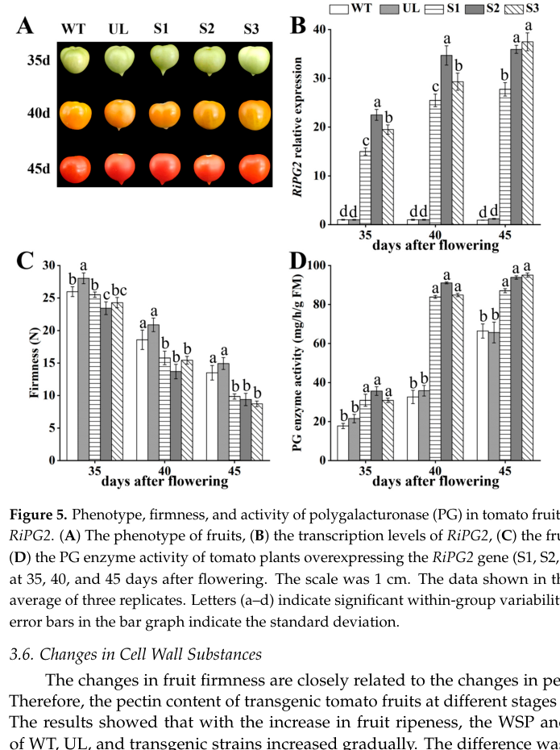

## Question

# Gene Research for Functional Annotation

## ⚠️ CRITICAL: Gene/Protein Identification Context

**BEFORE YOU BEGIN RESEARCH:** You MUST verify you are researching the CORRECT gene/protein. Gene symbols can be ambiguous, especially for less well-characterized genes from non-model organisms.

### Target Gene/Protein Identity (from UniProt):
- **UniProt Accession:** P05117
- **Protein Description:** RecName: Full=Polygalacturonase-2; Short=PG; EC=3.2.1.15 {ECO:0000269|PubMed:9701584}; AltName: Full=PG-2A; AltName: Full=PG-2B; AltName: Full=Pectinase; Flags: Precursor;
- **Gene Information:** Name=PG2; Synonyms=PG, PG2A, PG2B;
- **Organism (full):** Solanum lycopersicum (Tomato) (Lycopersicon esculentum).
- **Protein Family:** Belongs to the glycosyl hydrolase 28 family. .
- **Key Domains:** Glyco_hydro_28. (IPR000743); PbH1. (IPR006626); Pectin_lyas_fold. (IPR012334); Pectin_lyase_fold/virulence. (IPR011050); Glyco_hydro_28 (PF00295)

### MANDATORY VERIFICATION STEPS:

1. **Check if the gene symbol "PG2" matches the protein description above**
2. **Verify the organism is correct:** Solanum lycopersicum (Tomato) (Lycopersicon esculentum).
3. **Check if protein family/domains align with what you find in literature**
4. **If you find literature for a DIFFERENT gene with the same or similar symbol, STOP**

### If Gene Symbol is Ambiguous or You Cannot Find Relevant Literature:

**DO NOT PROCEED WITH RESEARCH ON A DIFFERENT GENE.** Instead:
- State clearly: "The gene symbol 'PG2' is ambiguous or literature is limited for this specific protein"
- Explain what you found (e.g., "Found extensive literature on a different gene with the same symbol in a different organism")
- Describe the protein based ONLY on the UniProt information provided above
- Suggest that the protein function can be inferred from domain/family information

### Research Target:

Please provide a comprehensive research report on the gene **PG2** (gene ID: PG2, UniProt: P05117) in SOLLC.

The research report should be a detailed narrative explaining the function, biological processes, and localization of the gene product. Citations should be given for all claims.

You should prioritize authoritative reviews and primary scientific literature when conducting research. You can supplement
this with annotations you find in gene/protein databases, but these can be outdated or inaccurate.

We are specifically interested in the primary function of the gene - for enzymes, what reaction is catalyzed, and what is the substrate specificity? For transporters, what is the substrate? For structural proteins or adapters, what is the broader structural role? For signaling molecules, what is the role in the pathway.

We are interested in where in or outside the cell the gene product carries out its function.

We are also interested in the signaling or biochemical pathways in which the gene functions. We are less interested in broad pleiotropic effects, except where these elucidate the precise role.

Include evidence where possible. We are interested in both experimental evidence as well as inference from structure, evolution, or bioinformatic analysis. Precise studies should be prioritized over high-throughput, where available.

## Output

Question: You are an expert researcher providing comprehensive, well-cited information.

Provide detailed information focusing on:
1. Key concepts and definitions with current understanding
2. Recent developments and latest research (prioritize 2023-2024 sources)
3. Current applications and real-world implementations
4. Expert opinions and analysis from authoritative sources
5. Relevant statistics and data from recent studies

Format as a comprehensive research report with proper citations. Include URLs and publication dates where available.
Always prioritize recent, authoritative sources and provide specific citations for all major claims.

# Gene Research for Functional Annotation

## ⚠️ CRITICAL: Gene/Protein Identification Context

**BEFORE YOU BEGIN RESEARCH:** You MUST verify you are researching the CORRECT gene/protein. Gene symbols can be ambiguous, especially for less well-characterized genes from non-model organisms.

### Target Gene/Protein Identity (from UniProt):
- **UniProt Accession:** P05117
- **Protein Description:** RecName: Full=Polygalacturonase-2; Short=PG; EC=3.2.1.15 {ECO:0000269|PubMed:9701584}; AltName: Full=PG-2A; AltName: Full=PG-2B; AltName: Full=Pectinase; Flags: Precursor;
- **Gene Information:** Name=PG2; Synonyms=PG, PG2A, PG2B;
- **Organism (full):** Solanum lycopersicum (Tomato) (Lycopersicon esculentum).
- **Protein Family:** Belongs to the glycosyl hydrolase 28 family. .
- **Key Domains:** Glyco_hydro_28. (IPR000743); PbH1. (IPR006626); Pectin_lyas_fold. (IPR012334); Pectin_lyase_fold/virulence. (IPR011050); Glyco_hydro_28 (PF00295)

### MANDATORY VERIFICATION STEPS:

1. **Check if the gene symbol "PG2" matches the protein description above**
2. **Verify the organism is correct:** Solanum lycopersicum (Tomato) (Lycopersicon esculentum).
3. **Check if protein family/domains align with what you find in literature**
4. **If you find literature for a DIFFERENT gene with the same or similar symbol, STOP**

### If Gene Symbol is Ambiguous or You Cannot Find Relevant Literature:

**DO NOT PROCEED WITH RESEARCH ON A DIFFERENT GENE.** Instead:
- State clearly: "The gene symbol 'PG2' is ambiguous or literature is limited for this specific protein"
- Explain what you found (e.g., "Found extensive literature on a different gene with the same symbol in a different organism")
- Describe the protein based ONLY on the UniProt information provided above
- Suggest that the protein function can be inferred from domain/family information

### Research Target:

Please provide a comprehensive research report on the gene **PG2** (gene ID: PG2, UniProt: P05117) in SOLLC.

The research report should be a detailed narrative explaining the function, biological processes, and localization of the gene product. Citations should be given for all claims.

You should prioritize authoritative reviews and primary scientific literature when conducting research. You can supplement
this with annotations you find in gene/protein databases, but these can be outdated or inaccurate.

We are specifically interested in the primary function of the gene - for enzymes, what reaction is catalyzed, and what is the substrate specificity? For transporters, what is the substrate? For structural proteins or adapters, what is the broader structural role? For signaling molecules, what is the role in the pathway.

We are interested in where in or outside the cell the gene product carries out its function.

We are also interested in the signaling or biochemical pathways in which the gene functions. We are less interested in broad pleiotropic effects, except where these elucidate the precise role.

Include evidence where possible. We are interested in both experimental evidence as well as inference from structure, evolution, or bioinformatic analysis. Precise studies should be prioritized over high-throughput, where available.

# Research Report: Functional Annotation of Tomato **PG2** (UniProt **P05117**) — Polygalacturonase-2 (EC 3.2.1.15)

## Executive summary
Polygalacturonase-2 (PG2; UniProt P05117) from *Solanum lycopersicum* (tomato) is a ripening-associated **endo-polygalacturonase** (EC 3.2.1.15) implicated in **pectin depolymerization** during fruit softening. Classic genetic evidence using antisense suppression supports a division of labor between tomato PG isoforms: **PG2 largely drives depolymerization**, while **PG1 may contribute more to solubilization**. Tomato PG2 occurs as two glyco-isoforms (PG2A/PG2B) and can associate with a β/h “converter” subunit to form a PG1-like complex under apoplast-like conditions. Recent 2024 work links **NO/GSNOR signaling** to reduced **SlPG2 transcript abundance**, reduced PG activity, and increased firmness during postharvest ripening.

---

## 0) Mandatory target verification (gene/protein identity and disambiguation)
### Confirmed target context
- **Organism:** *Solanum lycopersicum* (tomato).
- **Protein:** Polygalacturonase-2 (PG2), with historical tomato fruit isoforms **PG2A and PG2B** described biochemically and immunologically. These are consistently treated as the **catalytic PG2 polypeptides** distinct from PG1, which is a complex containing PG2 plus an additional subunit (converter/β- or h-subunit). (pogson1993accumulationofthe pages 5-6, peeters2004influenceofβ‐subunit pages 1-2)

### Important limitation
None of the retrieved primary studies explicitly cite the **UniProt accession P05117** in their text; therefore, the mapping is supported by **concordant isoform naming and biochemical definitions** (PG2/PG2A/PG2B in tomato fruit), which match the UniProt description provided by the user. (pogson1993accumulationofthe pages 5-6, peeters2004influenceofβ‐subunit pages 1-2)

---

## 1) Key concepts and definitions (current understanding)
### 1.1 Polygalacturonase (PG) and the pectin substrate
Tomato fruit polygalacturonases are described as **endopolygalacturonases** (EC 3.2.1.15; poly(1,4-α-D-galacturonide) glycanohydrolases), i.e., they cleave internal α-1,4 linkages in **homogalacturonan/pectic polyuronides**, contributing to pectin disassembly during ripening. (pogson1993accumulationofthe pages 1-2)

### 1.2 PG isoenzymes in tomato fruit: PG1 vs PG2
Tomato fruit contains **three related PG isoenzymes** commonly discussed as **PG1, PG2A, and PG2B**. (peeters2004influenceofβ‐subunit pages 1-2)
- **PG2A/PG2B (“PG2”)**: described as the **single catalytic polypeptide** forms, differing mainly in **glycosylation**. (peeters2004influenceofβ‐subunit pages 1-2)
- **PG1**: a more **thermostable** form that includes a **converter (β/h) subunit** associated with the PG2 catalytic polypeptide; reconstitution studies indicate the converter can transform PG2 into a PG1-like form in vitro. (peeters2004influenceofβ‐subunit pages 1-2)

This isoenzyme framing is central for functional annotation: PG2 corresponds to the catalytic pectin-hydrolyzing enzyme, whereas PG1 reflects an assembled complex with altered stability/association properties. (pogson1993accumulationofthe pages 5-6, peeters2004influenceofβ‐subunit pages 1-2)

---

## 2) Biochemical function: reaction, specificity, and biophysical context
### 2.1 Reaction catalyzed and primary biological role
**Functional reaction class:** PG2 is a pectin-degrading enzyme (EC 3.2.1.15) implicated in **depolymerizing solubilized pectin fragments** during ripening. (smith1990inheritanceandeffect pages 9-10, peeters2004influenceofβ‐subunit pages 1-2)

**Genetic evidence for depolymerization role:** In antisense-PG tomato lines, PG2 was described as “almost completely inhibited,” and the authors infer PG2 “may be responsible for pectin depolymerisation,” while PG1 may be more associated with solubilization. (smith1990inheritanceandeffect pages 9-10)

### 2.2 PG2A and PG2B isoforms
Two PG2 isoforms were reported with apparent molecular masses of about **45 kDa (PG2A)** and **43 kDa (PG2B)**. (pogson1993accumulationofthe pages 5-6)

### 2.3 Converter/β(h)-subunit interaction and the PG1 complex
Biochemical evidence shows PG2 can associate with a **β-subunit (converter; ~39 kDa glycoprotein)** to form a PG1-like complex, with association robust across a wide range of salt/pH conditions. (pogson1993accumulationofthe pages 5-6)

### 2.4 Environmental (apoplast-like) operating conditions
PG2–β-subunit/PG1-like complex formation occurs under **low ionic strength and pH ~4–5.5**, which the authors explicitly describe as expected for the fruit **apoplast** environment, supporting extracellular/cell-wall function. (pogson1993accumulationofthe pages 5-6)

### 2.5 Missing biochemical details (what is not resolved by the retrieved corpus)
The retrieved evidence does **not** provide enzyme kinetic constants (Km, kcat), detailed substrate preferences (e.g., degree of methylesterification dependence), or numeric pH/salt optima for PG2 specifically; these would require additional primary biochemical characterization papers not captured in the retrieved set. (peeters2004influenceofβ‐subunit pages 1-2, pogson1993accumulationofthe pages 5-6)

---

## 3) Biological processes, pathways, and localization
### 3.1 Ripening-associated expression and tissue context
- **High transcript abundance during ripening:** PG mRNA in ripening tomato **pericarp** was reported to accumulate to **~1–2% of total poly(A)+ RNA**, highlighting unusually strong induction in the fruit tissue most relevant to softening. (smith1990inheritanceandeffect pages 9-10)
- **Isoform dynamics:** PG1 is described as dominant in early ripening but only ~10% of total PG in fully ripe fruit, consistent with increasing predominance of PG2 later in ripening. (smith1990inheritanceandeffect pages 9-10)

### 3.2 Pericarp vs locule localization (supporting cell-wall/apoplastic deployment)
A PG1 β-subunit was detected in **pericarp** but not **locule** tissue, and the authors propose the β-subunit is positioned in the **cell wall** to provide a binding site for active PG2 synthesized during ripening—supporting functional localization in the cell-wall/apoplast compartment of pericarp tissue. (pogson1993accumulationofthe pages 1-2)

### 3.3 Relationship to ethylene and ripening control
In antisense-PG lines with large reductions in PG activity, **ethylene production and lycopene accumulation were not altered**, suggesting PG activity is not required to initiate ethylene-mediated ripening, but rather acts downstream as a cell-wall disassembly effector. (smith1990inheritanceandeffect pages 9-10)

### 3.4 Postharvest signaling: NO/GSNOR axis (2024)
A 2024 postharvest study reported that **SlGSNOR silencing** increased firmness (notably between **6–12 days** postharvest) while reducing PG activity and lowering **SlPG2** transcript abundance. (liu2024thecrucialrole pages 10-12)

This positions **SlPG2** within a modern regulatory model where NO/GSNOR signaling modulates expression and/or activity of multiple cell-wall enzymes during postharvest ripening and softening. (liu2024thecrucialrole pages 10-12)

---

## 4) Evidence for causal roles in softening: key experimental results and quantitative data
### 4.1 Antisense suppression (foundational causal evidence)
Smith et al. (1990; published **March 1990**) used antisense suppression of tomato PG, reporting: (smith1990inheritanceandeffect pages 9-10)
- **PG activity reduction:** ~**50–95%** inhibition across transformants; up to ~**99%** reduction in one line when antisense copy number was increased. (smith1990inheritanceandeffect pages 9-10)
- **Pectin depolymerization suppressed (molecular-weight shift):** soluble polyuronide weight-average Mr decreased to ~**80,000** in normal fruit 14 days after breaker, but antisense lines remained at higher Mr (~**95,000** and ~**135,000**), consistent with reduced depolymerization. (smith1990inheritanceandeffect pages 9-10)
- **Solubilization vs depolymerization separation:** total EDTA-soluble uronic acids were not strongly affected despite large PG reductions, supporting a mechanistic distinction between solubilization and depolymerization during ripening. (smith1990inheritanceandeffect pages 9-10)

### 4.2 A modern functional-genetics proxy (2024 transgenic PG overexpression)
A 2024 study overexpressing a heterologous PG2-class gene (raspberry RiPG2) in tomato provides contemporary corroboration that elevated PG activity drives softening and pectin fraction shifts (increased soluble pectin fractions; decreased protopectin and other wall components). While this is not tomato PG2 (P05117) itself, it supports conservation of PG2-class enzyme function in fleshy fruit softening. (li2024overexpressionofthe pages 8-11, li2024overexpressionofthe media 1edf85ad, li2024overexpressionofthe media 7bb70ee1)

---

## 5) Recent developments and latest research (prioritizing 2023–2024)
### 5.1 Postharvest regulation of SlPG2 via NO/GSNOR (2024)
Liu et al. (**February 2024**) report that SlGSNOR impairment decreases PG activity and reduces SlPG2 transcript abundance, concurrently increasing firmness during postharvest storage; this connects SlPG2 to a signaling framework (NO homeostasis) with translational relevance to postharvest management. URL: https://doi.org/10.3390/ijms25052729 (liu2024thecrucialrole pages 10-12)

### 5.2 Contemporary gene-editing strategy focus (2024)
A 2024 CRISPR/Cas9 tomato breeding study emphasizes that suppressing pectin-degrading enzymes (including PG and PL) increases firmness and shelf life, and demonstrates CRISPR knockouts of firmness-negative targets (FIS1 and PL) yielding significantly enhanced firmness while maintaining overall quality traits. Although it does not target SlPG2 specifically, it frames PG-pathway engineering (including SlPG2) as a practical breeding axis. URL: https://doi.org/10.3390/cimb47010009 (yang2024crisprcas9allowsfor pages 1-2)

---

## 6) Current applications and real-world implementations
### 6.1 Texture engineering and shelf-life extension via PG suppression
The 1990 antisense study provides an early biotechnology blueprint: strong PG suppression (50–95% to 99% activity reductions) reduced pectin depolymerization while allowing normal ripening markers (ethylene, lycopene), demonstrating that manipulating PG (including PG2-dominated activity) can alter texture-related cell-wall outcomes without globally arresting ripening. URL: https://doi.org/10.1007/BF00028773 (smith1990inheritanceandeffect pages 9-10)

### 6.2 Postharvest firmness management through signaling modulation (NO/GSNOR)
The 2024 postharvest work suggests that chemical inhibition or VIGS-based perturbation of the NO/GSNOR axis can reduce SlPG2 expression and PG activity and thereby maintain firmness. This points to a “regulate the regulator” strategy rather than direct PG2 inhibition/knockout. URL: https://doi.org/10.3390/ijms25052729 (liu2024thecrucialrole pages 10-12)

### 6.3 Food processing considerations (thermal stability; converter/h-subunit)
In food-processing contexts, PG isoenzyme assembly affects stability: PG2 (PG2A/PG2B) is described as **heat labile**, whereas association with the converter/h-subunit yields more **thermostable** PG1-like behavior, relevant for heat-treated tomato products (juice/paste) where endogenous PG activity can influence viscosity/texture. URL: https://doi.org/10.1002/bit.20134 (peeters2004influenceofβ‐subunit pages 1-2)

---

## 7) Expert synthesis and interpretive analysis (authoritative source-driven)
### 7.1 Mechanistic model supported by multi-decade evidence
Across classic and recent evidence, a coherent mechanistic model emerges:
1. During ripening, tomato pericarp strongly induces PG expression (high PG mRNA levels), and the PG isoenzyme complement shifts such that catalytic PG2 becomes prominent. (smith1990inheritanceandeffect pages 9-10)
2. PG2 contributes primarily to **depolymerization** of solubilized polyuronides; reducing PG activity strongly attenuates depolymerization (molecular-weight shift) without necessarily preventing solubilization or other ripening programs. (smith1990inheritanceandeffect pages 9-10)
3. In the apoplast/cell wall, PG2 can associate with a β/h-subunit positioned in the wall, potentially providing binding/stability features and giving rise to PG1-like complexes under apoplast-like pH conditions. (pogson1993accumulationofthe pages 5-6, pogson1993accumulationofthe pages 1-2)
4. Modern postharvest regulation links SlPG2 expression to NO/GSNOR signaling, integrating PG2 into broader redox/signaling control over softening enzyme networks. (liu2024thecrucialrole pages 10-12)

---

## 8) Key evidence table
The following table consolidates major annotation claims, the evidence, and citable sources.

| Claim/Annotation element | Evidence summary | System studied | Publication (authors, year) | URL/DOI | Context citation ID(s) |
|---|---|---|---|---|---|
| Enzyme reaction / substrate class | Tomato polygalacturonase (PG) is described as a pectin-degrading enzyme. In processing-focused work, PG2A/PG2B are the heat-labile catalytic forms collectively termed PG2, while PG1 contains PG2 plus an accessory subunit; this supports annotation of PG2 as the catalytic pectin-hydrolyzing component acting on cell-wall pectins. | Tomato fruit PG isoenzymes from ripening/processed fruit | Peeters et al., 2004 | https://doi.org/10.1002/bit.20134 | (peeters2004influenceofβ‐subunit pages 1-2) |
| Role in ripening-associated pectin depolymerization | Antisense suppression of tomato PG reduced total PG activity by ~50–95% (up to ~99% in higher-copy lines) and decreased pectin depolymerization without preventing ripening. Authors concluded PG1 may contribute to pectin solubilization, whereas PG2, which was nearly abolished, may be mainly responsible for pectin depolymerization. | Transgenic antisense tomato fruit during ripening | Smith et al., 1990 | https://doi.org/10.1007/BF00028773 | (smith1990inheritanceandeffect pages 9-10) |
| Quantitative effect on pectin molecular mass | In normal fruit, soluble pectin molecular mass dropped to ~80 kDa by 14 days after breaker, whereas antisense lines remained at ~95 kDa and ~135 kDa, consistent with reduced PG2-linked depolymerization. Total EDTA-soluble uronic acid was not strongly changed, separating solubilization from depolymerization. | Transgenic antisense tomato fruit | Smith et al., 1990 | https://doi.org/10.1007/BF00028773 | (smith1990inheritanceandeffect pages 9-10) |
| Isoforms PG2A and PG2B | PG2 exists as two isoforms, PG2A and PG2B, with approximate apparent molecular masses of 45 kDa and 43 kDa, respectively; differences are attributed mainly to glycosylation rather than distinct catalytic identities. | Ripening tomato fruit polygalacturonase preparations | Pogson & Brady, 1993; Peeters et al., 2004 | https://doi.org/10.1007/BF00240897; https://doi.org/10.1002/bit.20134 | (pogson1993accumulationofthe pages 5-6, peeters2004influenceofβ‐subunit pages 1-2) |
| PG1 complex formation with beta/h-subunit | PG1 is formed from catalytic PG2 plus a glycoprotein beta/h-subunit (converter). In vitro, purified PG2 added to mature-green pericarp formed a PG1-like complex containing PG2 and the ~39 kDa beta-subunit, with PG1-like mobility and antigenicity. | Tomato fruit pericarp extracts and purified isoenzymes | Pogson & Brady, 1993 | https://doi.org/10.1007/BF00240897 | (pogson1993accumulationofthe pages 5-6) |
| Properties of beta/h-subunit interaction | PG2 binding to the beta-subunit was robust across salt, pH, and reducing conditions and could occur even with denatured beta-subunit, indicating a strong non-covalent association. The complex forms under low ionic strength and pH 4–5.5, conditions relevant to the fruit apoplast/cell-wall space. | In vitro reconstitution using tomato PG fractions | Pogson & Brady, 1993 | https://doi.org/10.1007/BF00240897 | (pogson1993accumulationofthe pages 5-6) |
| Thermal stability distinction between PG1 and PG2 | PG2A/PG2B are heat-labile catalytic polypeptides, while PG1 is relatively thermostable because it contains the h-subunit. The h-subunit can convert PG2 to PG1 in vitro, and the resulting PG1 resembles native PG1 in physicochemical behavior. | Tomato juice / purified isoenzymes under heat and pressure treatment | Peeters et al., 2004 | https://doi.org/10.1002/bit.20134 | (peeters2004influenceofβ‐subunit pages 1-2) |
| In vivo relevance of PG1 | Processing work notes uncertainty over whether PG1 exists pre-formed in vivo or forms during extraction/handling, so the most secure annotation for P05117 is the catalytic PG2 polypeptide rather than the PG1 complex. | Tomato fruit PG isoenzymes | Peeters et al., 2004 | https://doi.org/10.1002/bit.20134 | (peeters2004influenceofβ‐subunit pages 1-2) |
| Contribution to fruit softening | Reduced PG/SlPG2 expression is associated with firmer fruit, while higher PG activity accelerates softening. In SlGSNOR-silenced tomato fruit, firmness was significantly higher from 6–12 days postharvest, accompanied by reduced PG activity and lower SlPG2 transcript abundance. | Postharvest tomato fruit with SlGSNOR silencing | Liu et al., 2024 | https://doi.org/10.3390/ijms25052729 | (liu2024thecrucialrole pages 10-12) |
| Regulatory factor: NO/GSNOR axis | SlGSNOR positively promotes ripening-associated softening; when SlGSNOR is silenced or inhibited, SlPG2 transcript abundance decreases together with PG, pectate lyase, and cellulase activities. This implicates NO/GSNOR signaling upstream of SlPG2 expression during postharvest softening. | Postharvest tomato fruit treated with N6022/GSNO or infected with TRV-SlGSNOR | Liu et al., 2024 | https://doi.org/10.3390/ijms25052729 | (liu2024thecrucialrole pages 10-12) |
| Broader functional inference from modern tomato transgenics | In tomato, heterologous overexpression of raspberry RiPG2 increased PG activity, decreased firmness, increased water-soluble and ion-bound pectins, and decreased protopectin/CSP/cellulose/hemicellulose, supporting the conserved interpretation that PG2-class enzymes drive pectin solubilization/depolymerization and softening. | Transgenic tomato overexpressing RiPG2 | Li et al., 2024 | https://doi.org/10.3390/agronomy14010160 | (li2024overexpressionofthe pages 11-12, li2024overexpressionofthe pages 8-11) |
| Ripening-stage expression association | In the RiPG2 transgenic tomato study, PG activity remained higher than controls throughout development, and firmness decreased accordingly; the authors interpret PG activity as promoting cell-wall hydrolysis during ripening. This is consistent with historical tomato PG2 evidence even though the transgene is from raspberry. | Tomato fruits at 35, 40, and 45 days after flowering | Li et al., 2024 | https://doi.org/10.3390/agronomy14010160 | (li2024overexpressionofthe pages 8-11) |
| Identity/disambiguation note for tomato PG2 | Multiple tomato studies consistently use PG2/PG2A/PG2B to denote the catalytic fruit endopolygalacturonase distinct from PG1, which is the PG2-containing complex with the beta/h-subunit. This literature usage aligns with the UniProt description of P05117 as tomato Polygalacturonase-2. | Tomato fruit polygalacturonase literature | Smith et al., 1990; Pogson & Brady, 1993; Peeters et al., 2004 | https://doi.org/10.1007/BF00028773; https://doi.org/10.1007/BF00240897; https://doi.org/10.1002/bit.20134 | (smith1990inheritanceandeffect pages 9-10, pogson1993accumulationofthe pages 5-6, peeters2004influenceofβ‐subunit pages 1-2) |

*Table: This table summarizes key experimental evidence relevant to functional annotation of Solanum lycopersicum PG2/P05117, emphasizing catalytic role, isoform relationships, complex formation with the beta/h-subunit, and regulation during ripening. It is useful for tracing each major claim to specific publications and workspace citation IDs.*

---

## 9) Figures (quantitative support)
Cropped figures from the 2024 transgenic tomato PG study provide visual quantitative support for firmness and PG activity changes and for shifts in pectin/cell-wall fractions across stages. (li2024overexpressionofthe media 1edf85ad, li2024overexpressionofthe media 7bb70ee1)

---

## 10) Practical functional annotation statement (recommended)
**PG2 (UniProt P05117; gene PG2 / PG2A / PG2B) from tomato is an extracellular/apoplastic, ripening-associated endopolygalacturonase (EC 3.2.1.15) that hydrolyzes homogalacturonan (poly(1,4-α-D-galacturonide)) and is strongly implicated in depolymerization of pectic polymers during fruit softening.** (pogson1993accumulationofthe pages 1-2, smith1990inheritanceandeffect pages 9-10)

**Localization/complex context:** PG2A/PG2B are catalytic isoforms that can bind a wall-associated converter/β(h)-subunit and form PG1-like complexes under apoplast-like pH (4–5.5), influencing stability/association properties during ripening and/or processing. (pogson1993accumulationofthe pages 5-6, peeters2004influenceofβ‐subunit pages 1-2)

**Regulatory context:** PG2 operates downstream of ripening programs (ethylene production unaffected by PG antisense suppression), and recent postharvest evidence links SlPG2 expression to NO/GSNOR signaling control of softening. (smith1990inheritanceandeffect pages 9-10, liu2024thecrucialrole pages 10-12)

---

## References (URLs and publication dates)
- Smith CJS et al. **1990-03**. *Plant Molecular Biology*. “Inheritance and effect on ripening of antisense polygalacturonase genes in transgenic tomatoes.” https://doi.org/10.1007/BF00028773 (smith1990inheritanceandeffect pages 9-10)
- Pogson BJ, Brady CJ. **1993-07**. *Planta*. “Accumulation of the β-subunit of polygalacturonase 1 in normal and mutant tomato fruit.” https://doi.org/10.1007/BF00240897 (pogson1993accumulationofthe pages 1-2)
- Peeters L et al. **2004-06**. *Biotechnology and Bioengineering*. “Influence of β-subunit on thermal and high-pressure process stability of tomato polygalacturonase.” https://doi.org/10.1002/bit.20134 (peeters2004influenceofβ‐subunit pages 1-2)
- Liu Z et al. **2024-02**. *International Journal of Molecular Sciences*. “The Crucial Role of SlGSNOR in Regulating Postharvest Tomato Fruit Ripening.” https://doi.org/10.3390/ijms25052729 (liu2024thecrucialrole pages 10-12)
- Yang Q et al. **2024-12**. *Current Issues in Molecular Biology*. “CRISPR/cas9 Allows for the Quick Improvement of Tomato Firmness Breeding.” https://doi.org/10.3390/cimb47010009 (yang2024crisprcas9allowsfor pages 1-2)
- Li T et al. **2024-01**. *Agronomy*. “Overexpression of the Rubus idaeus Polygalacturonases Gene RiPG2 Accelerates Fruit Softening in Solanum lycopersicum.” https://doi.org/10.3390/agronomy14010160 (li2024overexpressionofthe pages 8-11)

References

1. (pogson1993accumulationofthe pages 5-6): BarryJ. Pogson and ColinJ. Brady. Accumulation of the β-subunit of polygalacturonase 1 in normal and mutant tomato fruit. Planta, 191:71-78, Jul 1993. URL: https://doi.org/10.1007/bf00240897, doi:10.1007/bf00240897. This article has 11 citations and is from a peer-reviewed journal.

2. (peeters2004influenceofβ‐subunit pages 1-2): Liesbet Peeters, Diana Fachin, Chantal Smout, Ann van Loey, and Marc E. Hendrickx. Influence of β‐subunit on thermal and high‐pressure process stability of tomato polygalacturonase. Biotechnology and Bioengineering, 86:543-549, Jun 2004. URL: https://doi.org/10.1002/bit.20134, doi:10.1002/bit.20134. This article has 34 citations and is from a domain leading peer-reviewed journal.

3. (pogson1993accumulationofthe pages 1-2): BarryJ. Pogson and ColinJ. Brady. Accumulation of the β-subunit of polygalacturonase 1 in normal and mutant tomato fruit. Planta, 191:71-78, Jul 1993. URL: https://doi.org/10.1007/bf00240897, doi:10.1007/bf00240897. This article has 11 citations and is from a peer-reviewed journal.

4. (smith1990inheritanceandeffect pages 9-10): Christopher J. S. Smith, Colin F. Watson, Peter C. Morris, Colin R. Bird, Graham B. Seymour, Julie E. Gray, Christine Arnold, Gregory A. Tucker, Wolfgang Schuch, Steven Harding, and Donald Grierson. Inheritance and effect on ripening of antisense polygalacturonase genes in transgenic tomatoes. Plant Molecular Biology, 14:369-379, Mar 1990. URL: https://doi.org/10.1007/bf00028773, doi:10.1007/bf00028773. This article has 493 citations and is from a peer-reviewed journal.

5. (liu2024thecrucialrole pages 10-12): Zesheng Liu, Dengjing Huang, Yandong Yao, Xuejuan Pan, Yanqin Zhang, Yi Huang, Zhiqi Ding, Chunlei Wang, and Weibiao Liao. The crucial role of slgsnor in regulating postharvest tomato fruit ripening. International Journal of Molecular Sciences, 25:2729, Feb 2024. URL: https://doi.org/10.3390/ijms25052729, doi:10.3390/ijms25052729. This article has 6 citations.

6. (li2024overexpressionofthe pages 8-11): Tiemei Li, Xiaoyu Guo, Yuxiao Chen, Jing Li, Caihong Yu, Zhifeng Guo, and Guohui Yang. Overexpression of the rubus idaeus polygalacturonases gene ripg2 accelerates fruit softening in solanum lycopersicum. Agronomy, 14:160, Jan 2024. URL: https://doi.org/10.3390/agronomy14010160, doi:10.3390/agronomy14010160. This article has 12 citations and is from a peer-reviewed journal.

7. (li2024overexpressionofthe media 1edf85ad): Tiemei Li, Xiaoyu Guo, Yuxiao Chen, Jing Li, Caihong Yu, Zhifeng Guo, and Guohui Yang. Overexpression of the rubus idaeus polygalacturonases gene ripg2 accelerates fruit softening in solanum lycopersicum. Agronomy, 14:160, Jan 2024. URL: https://doi.org/10.3390/agronomy14010160, doi:10.3390/agronomy14010160. This article has 12 citations and is from a peer-reviewed journal.

8. (li2024overexpressionofthe media 7bb70ee1): Tiemei Li, Xiaoyu Guo, Yuxiao Chen, Jing Li, Caihong Yu, Zhifeng Guo, and Guohui Yang. Overexpression of the rubus idaeus polygalacturonases gene ripg2 accelerates fruit softening in solanum lycopersicum. Agronomy, 14:160, Jan 2024. URL: https://doi.org/10.3390/agronomy14010160, doi:10.3390/agronomy14010160. This article has 12 citations and is from a peer-reviewed journal.

9. (yang2024crisprcas9allowsfor pages 1-2): Qihong Yang, Liangyu Cai, Mila Wang, Guiyun Gan, Weiliu Li, Wenjia Li, Yaqin Jiang, Qi Yuan, Chunchun Qin, Chuying Yu, and Yikui Wang. Crispr/cas9 allows for the quick improvement of tomato firmness breeding. Current Issues in Molecular Biology, 47:9, Dec 2024. URL: https://doi.org/10.3390/cimb47010009, doi:10.3390/cimb47010009. This article has 9 citations.

10. (li2024overexpressionofthe pages 11-12): Tiemei Li, Xiaoyu Guo, Yuxiao Chen, Jing Li, Caihong Yu, Zhifeng Guo, and Guohui Yang. Overexpression of the rubus idaeus polygalacturonases gene ripg2 accelerates fruit softening in solanum lycopersicum. Agronomy, 14:160, Jan 2024. URL: https://doi.org/10.3390/agronomy14010160, doi:10.3390/agronomy14010160. This article has 12 citations and is from a peer-reviewed journal.

## Artifacts

- [Edison artifact artifact-00](PG2-deep-research-falcon_artifacts/artifact-00.md)

## Citations

1. pogson1993accumulationofthe pages 1-2
2. smith1990inheritanceandeffect pages 9-10
3. pogson1993accumulationofthe pages 5-6
4. liu2024thecrucialrole pages 10-12
5. li2024overexpressionofthe pages 8-11
6. li2024overexpressionofthe pages 11-12
7. https://doi.org/10.3390/ijms25052729
8. https://doi.org/10.3390/cimb47010009
9. https://doi.org/10.1007/BF00028773
10. https://doi.org/10.1002/bit.20134
11. https://doi.org/10.1007/BF00240897;
12. https://doi.org/10.1007/BF00240897
13. https://doi.org/10.3390/agronomy14010160
14. https://doi.org/10.1007/BF00028773;
15. https://doi.org/10.1007/bf00240897,
16. https://doi.org/10.1002/bit.20134,
17. https://doi.org/10.1007/bf00028773,
18. https://doi.org/10.3390/ijms25052729,
19. https://doi.org/10.3390/agronomy14010160,
20. https://doi.org/10.3390/cimb47010009,