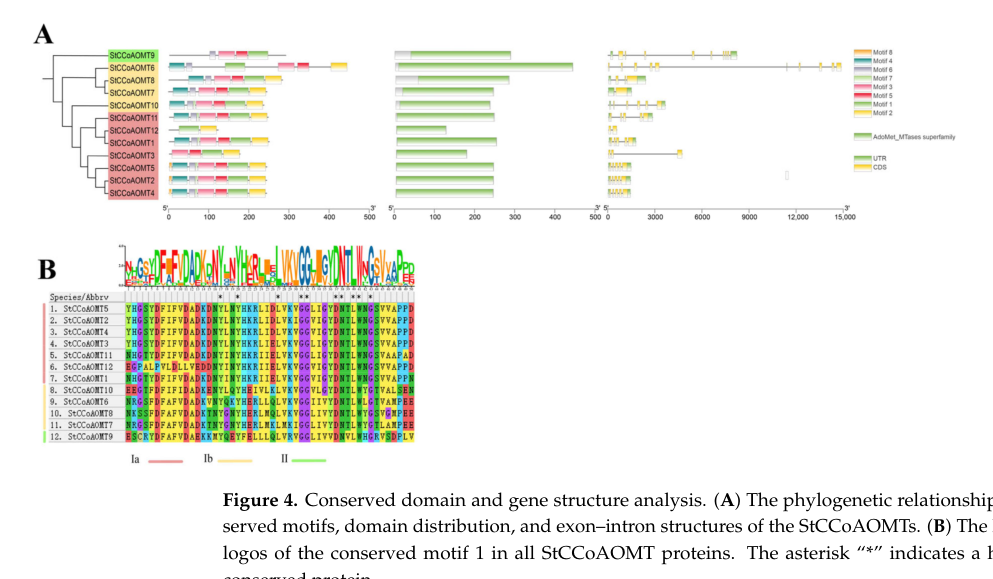

## Question

# Gene Research for Functional Annotation

## ⚠️ CRITICAL: Gene/Protein Identification Context

**BEFORE YOU BEGIN RESEARCH:** You MUST verify you are researching the CORRECT gene/protein. Gene symbols can be ambiguous, especially for less well-characterized genes from non-model organisms.

### Target Gene/Protein Identity (from UniProt):
- **UniProt Accession:** Q8H9B6
- **Protein Description:** RecName: Full=Caffeoyl-CoA O-methyltransferase; EC=2.1.1.104; AltName: Full=Trans-caffeoyl-CoA 3-O-methyltransferase; Short=CCoAMT; Short=CCoAOMT;
- **Gene Information:** Name=CCOAOMT;
- **Organism (full):** Solanum tuberosum (Potato).
- **Protein Family:** Belongs to the class I-like SAM-binding methyltransferase
- **Key Domains:** Cation-dep_OMT. (IPR050362); SAM-dependent_MTases_sf. (IPR029063); SAM_O-MeTrfase. (IPR002935); Methyltransf_3 (PF01596)

### MANDATORY VERIFICATION STEPS:

1. **Check if the gene symbol "CCOAOMT" matches the protein description above**
2. **Verify the organism is correct:** Solanum tuberosum (Potato).
3. **Check if protein family/domains align with what you find in literature**
4. **If you find literature for a DIFFERENT gene with the same or similar symbol, STOP**

### If Gene Symbol is Ambiguous or You Cannot Find Relevant Literature:

**DO NOT PROCEED WITH RESEARCH ON A DIFFERENT GENE.** Instead:
- State clearly: "The gene symbol 'CCOAOMT' is ambiguous or literature is limited for this specific protein"
- Explain what you found (e.g., "Found extensive literature on a different gene with the same symbol in a different organism")
- Describe the protein based ONLY on the UniProt information provided above
- Suggest that the protein function can be inferred from domain/family information

### Research Target:

Please provide a comprehensive research report on the gene **CCOAOMT** (gene ID: CCOAOMT, UniProt: Q8H9B6) in SOLTU.

The research report should be a detailed narrative explaining the function, biological processes, and localization of the gene product. Citations should be given for all claims.

You should prioritize authoritative reviews and primary scientific literature when conducting research. You can supplement
this with annotations you find in gene/protein databases, but these can be outdated or inaccurate.

We are specifically interested in the primary function of the gene - for enzymes, what reaction is catalyzed, and what is the substrate specificity? For transporters, what is the substrate? For structural proteins or adapters, what is the broader structural role? For signaling molecules, what is the role in the pathway.

We are interested in where in or outside the cell the gene product carries out its function.

We are also interested in the signaling or biochemical pathways in which the gene functions. We are less interested in broad pleiotropic effects, except where these elucidate the precise role.

Include evidence where possible. We are interested in both experimental evidence as well as inference from structure, evolution, or bioinformatic analysis. Precise studies should be prioritized over high-throughput, where available.

## Output

Question: You are an expert researcher providing comprehensive, well-cited information.

Provide detailed information focusing on:
1. Key concepts and definitions with current understanding
2. Recent developments and latest research (prioritize 2023-2024 sources)
3. Current applications and real-world implementations
4. Expert opinions and analysis from authoritative sources
5. Relevant statistics and data from recent studies

Format as a comprehensive research report with proper citations. Include URLs and publication dates where available.
Always prioritize recent, authoritative sources and provide specific citations for all major claims.

# Gene Research for Functional Annotation

## ⚠️ CRITICAL: Gene/Protein Identification Context

**BEFORE YOU BEGIN RESEARCH:** You MUST verify you are researching the CORRECT gene/protein. Gene symbols can be ambiguous, especially for less well-characterized genes from non-model organisms.

### Target Gene/Protein Identity (from UniProt):
- **UniProt Accession:** Q8H9B6
- **Protein Description:** RecName: Full=Caffeoyl-CoA O-methyltransferase; EC=2.1.1.104; AltName: Full=Trans-caffeoyl-CoA 3-O-methyltransferase; Short=CCoAMT; Short=CCoAOMT;
- **Gene Information:** Name=CCOAOMT;
- **Organism (full):** Solanum tuberosum (Potato).
- **Protein Family:** Belongs to the class I-like SAM-binding methyltransferase
- **Key Domains:** Cation-dep_OMT. (IPR050362); SAM-dependent_MTases_sf. (IPR029063); SAM_O-MeTrfase. (IPR002935); Methyltransf_3 (PF01596)

### MANDATORY VERIFICATION STEPS:

1. **Check if the gene symbol "CCOAOMT" matches the protein description above**
2. **Verify the organism is correct:** Solanum tuberosum (Potato).
3. **Check if protein family/domains align with what you find in literature**
4. **If you find literature for a DIFFERENT gene with the same or similar symbol, STOP**

### If Gene Symbol is Ambiguous or You Cannot Find Relevant Literature:

**DO NOT PROCEED WITH RESEARCH ON A DIFFERENT GENE.** Instead:
- State clearly: "The gene symbol 'CCOAOMT' is ambiguous or literature is limited for this specific protein"
- Explain what you found (e.g., "Found extensive literature on a different gene with the same symbol in a different organism")
- Describe the protein based ONLY on the UniProt information provided above
- Suggest that the protein function can be inferred from domain/family information

### Research Target:

Please provide a comprehensive research report on the gene **CCOAOMT** (gene ID: CCOAOMT, UniProt: Q8H9B6) in SOLTU.

The research report should be a detailed narrative explaining the function, biological processes, and localization of the gene product. Citations should be given for all claims.

You should prioritize authoritative reviews and primary scientific literature when conducting research. You can supplement
this with annotations you find in gene/protein databases, but these can be outdated or inaccurate.

We are specifically interested in the primary function of the gene - for enzymes, what reaction is catalyzed, and what is the substrate specificity? For transporters, what is the substrate? For structural proteins or adapters, what is the broader structural role? For signaling molecules, what is the role in the pathway.

We are interested in where in or outside the cell the gene product carries out its function.

We are also interested in the signaling or biochemical pathways in which the gene functions. We are less interested in broad pleiotropic effects, except where these elucidate the precise role.

Include evidence where possible. We are interested in both experimental evidence as well as inference from structure, evolution, or bioinformatic analysis. Precise studies should be prioritized over high-throughput, where available.

## Research Report: Functional Annotation of **CCOAOMT** (UniProt **Q8H9B6**) in *Solanum tuberosum* (Potato)

### 0) Executive summary
Caffeoyl-CoA O-methyltransferase (CCoAOMT; EC 2.1.1.104) is a SAM-dependent O-methyltransferase class that, in its canonical ("true") lignin-pathway role, catalyzes methylation of **caffeoyl-CoA → feruloyl-CoA**, a key step in phenylpropanoid/monolignol metabolism. In potato, recent genome-wide analyses indicate a **multi-gene StCCoAOMT family (12 members)**, with a subset clustering with Arabidopsis lignin-associated CCoAOMTs and other members suggested to diversify toward flavonoid/anthocyanin methylation; one member (StCCoAOMT10) shows **cytoplasm+nucleus localization** in transient expression assays and is associated with purple-tuber anthocyanin accumulation. Across 2023–2024 engineering studies in diverse plants, perturbing CCoAOMT (or its methyl-donor supply) produces large, quantitative shifts in lignin amount and composition, indicating CCoAOMT is a tractable lever for disease/stress resilience and biomass processing traits, albeit with pleiotropy risks.

### 1) Mandatory gene/protein identity verification (disambiguation)
**Target per user**: UniProt Q8H9B6 from *Solanum tuberosum* annotated as **caffeoyl-CoA O-methyltransferase** (EC 2.1.1.104), belonging to a class I-like SAM-binding methyltransferase with a **Methyltransf_3/PF01596**-type OMT domain.

**What the retrieved literature confirms (potato context):**
* Potato CCoAOMTs are identified using the same defining domain signature that matches the UniProt description: PF01596 (Methyltransf_3) / AdoMet-dependent OMT fold, with conserved SAM-dependent motifs. In a 2024 potato genome-wide study, candidates were retrieved by BLASTP and HMMER using PF01596 and validated by SMART/InterPro/CDD, then curated to **12 StCCoAOMT genes** (StCCoAOMT1–12). (peng2024genomewidecharacterizationof pages 2-4, peng2024genomewidecharacterizationof pages 4-5)
* The same potato study explicitly defines the canonical biochemical role of "true CCoAOMT" family members as methylating caffeoyl-CoA to feruloyl-CoA. (peng2024genomewidecharacterizationof pages 2-4)

**Critical limitation (accession-level mapping):** none of the retrieved full texts explicitly crosswalks **UniProt Q8H9B6** to a specific **Soltu.DM.
… gene model** (e.g., Soltu.DM.01G047320). Therefore, the strongest defensible conclusion is that Q8H9B6 is a **bona fide potato CCoAOMT-family enzyme** consistent with PF01596/Methyltransf_3 architecture, but **which StCCoAOMT locus** it corresponds to cannot be confirmed from the retrieved sources alone. (peng2024genomewidecharacterizationof pages 4-5)

### 2) Key concepts and definitions (current understanding)
#### 2.1 CCoAOMT vs COMT (two methylation strategies in phenylpropanoid metabolism)
In monolignol/lignin biosynthesis, plants use SAM-dependent O-methyltransferases acting at different chemical levels:
* **CCoAOMT** acts on **CoA thioesters** (e.g., caffeoyl-CoA).
* **COMT** (caffeic acid OMT) is more associated with methylation of **free acids/aldehydes/alcohols** in many contexts.

A classic biochemical study in tobacco demonstrated this specificity experimentally: recombinant CCoAOMT was **highly active with caffeoyl-CoA and 5-hydroxyferuloyl-CoA esters** and showed **no activity toward the corresponding free acids** (caffeic acid, 5-hydroxyferulic acid). (martz1998cdnacloningsubstrate pages 1-2, martz1998cdnacloningsubstrate pages 2-5)

#### 2.2 “True CCoAOMTs” vs CCoAOMT-like/PFOMT diversification
Recent plant-family analyses emphasize that proteins carrying the PF01596/Methyltransf_3 fold can diversify.
* In the 2024 potato StCCoAOMT family analysis, the authors distinguish **true CCoAOMTs** (lignin-associated clade) from **CCoAOMT-like/PFOMT-type** members that can prefer substrates with vicinal dihydroxyl groups and participate in **flavonoid/anthocyanin methylation**. (peng2024genomewidecharacterizationof pages 2-4, peng2024genomewidecharacterizationof pages 10-12)

This distinction is essential for Q8H9B6 functional annotation: while UniProt labels Q8H9B6 as caffeoyl-CoA O-methyltransferase (EC 2.1.1.104), the potato genome contains multiple related enzymes; therefore, **family membership alone does not uniquely specify pathway role** without locus mapping and/or direct enzymology.

### 3) Core biochemical function and pathway context
#### 3.1 Reaction catalyzed (primary enzymatic function)
**Canonical CCoAOMT reaction:**
* **caffeoyl-CoA + S-adenosyl-L-methionine (SAM) → feruloyl-CoA + S-adenosyl-L-homocysteine (SAH)**

This reaction is explicitly reiterated in the potato gene-family paper as the defining lignin-pathway role of true CCoAOMTs. (peng2024genomewidecharacterizationof pages 2-4)

#### 3.2 Substrate specificity (best-supported evidence)
**Direct enzymology (highest confidence):** tobacco CCoAOMT prefers CoA esters (caffeoyl-CoA; 5-OH-feruloyl-CoA) and does not methylate the free acids under tested conditions. (martz1998cdnacloningsubstrate pages 1-2, martz1998cdnacloningsubstrate pages 2-5)

**Inference to potato Q8H9B6:** given its annotated function and matching domain family, Q8H9B6 is expected to accept caffeoyl-CoA-like phenylpropanoid CoA esters as substrates, but **potato-specific kinetic parameters or substrate panels were not retrieved**, so this remains an inference. (peng2024genomewidecharacterizationof pages 2-4, martz1998cdnacloningsubstrate pages 1-2)

#### 3.3 Biological processes and pathways
**Phenylpropanoid / monolignol / lignin biosynthesis:** CCoAOMT’s caffeoyl-CoA → feruloyl-CoA step supports production of feruloyl-CoA-derived intermediates feeding into **G- and S-lignin** precursor formation. (peng2024genomewidecharacterizationof pages 2-4, peng2024genomewidecharacterizationof pages 12-14)

**Flavonoid/anthocyanin methylation (family-diversified roles):** potato StCCoAOMT subgrouping and expression patterns support the hypothesis that some members participate in methylation steps influencing anthocyanin chemistry (solubility/stability) and accumulation—particularly relevant to purple-fleshed tubers. (peng2024genomewidecharacterizationof pages 12-14, peng2024genomewidecharacterizationof pages 10-12, peng2024genomewidecharacterizationof pages 1-2)

### 4) Potato-specific gene-family context (most recent: 2024)
A 2024 study in *Genes* performed genome-wide identification and characterization of **12 StCCoAOMT genes** in potato (cultivar DM), including chromosomal positions, motif structure, promoter elements, tissue expression, and one experimental localization assay. (peng2024genomewidecharacterizationof pages 1-2, peng2024genomewidecharacterizationof pages 8-10)

#### 4.1 Potato StCCoAOMT loci and candidate functional partitioning
The authors provide **gene models** (examples): StCCoAOMT1 = Soltu.DM.01G047320; StCCoAOMT7 = Soltu.DM.04G025040; StCCoAOMT10 = Soltu.DM.09G025040, etc. (peng2024genomewidecharacterizationof pages 4-5)

**Phylogenetic inference**: StCCoAOMT1–5, 11, and 12 cluster with Arabidopsis AtCCoAOMT1 in a subgroup interpreted as lignin-biosynthesis associated (subgroup Ia), making these leading candidates for canonical EC 2.1.1.104-like lignin-pathway roles in potato. (peng2024genomewidecharacterizationof pages 5-8)

#### 4.2 Subcellular localization in potato CCoAOMTs
**Predicted localization (family-wide):** WoLF PSORT predictions place ~**8/12** potato StCCoAOMTs in the **cytoplasm**, with two predicted cytoskeleton and two chloroplast. (peng2024genomewidecharacterizationof pages 5-8, peng2024genomewidecharacterizationof pages 4-5)

**Experimental localization:** StCCoAOMT10-GFP was observed in **cytoplasm and nucleus** in a transient tobacco leaf assay (Agrobacterium infiltration), providing direct evidence that at least some potato CCoAOMTs function in soluble intracellular compartments consistent with cytosolic phenylpropanoid/flavonoid metabolism. (peng2024genomewidecharacterizationof pages 12-14, peng2024genomewidecharacterizationof pages 1-2)

#### 4.3 Tissue expression patterns and candidate association with anthocyanins
Potato StCCoAOMT gene expression is tissue-diverse; the authors report StCCoAOMT10 has relatively high expression in tuber-associated contexts and highlight it as significantly expressed in purple potatoes with abundant anthocyanins, suggesting a role in anthocyanin-related methylation chemistry. (peng2024genomewidecharacterizationof pages 8-10, peng2024genomewidecharacterizationof pages 1-2)

Importantly, the same paper explicitly notes that the **key CCoAOMT gene(s) and precise catalytic role(s) in potato anthocyanin methylation remain to be systematically investigated**, which should temper over-annotation of any single gene without direct assays. (peng2024genomewidecharacterizationof pages 8-10)

### 5) 2023–2024 developments and latest research (prioritized)
#### 5.1 Potato (2024): StCCoAOMT family characterization and experimental localization
The 2024 potato genome-wide paper provides the newest potato-focused resource: family size (12), conserved motifs, gene structures, promoter cis-elements (hormone/stress/light responsiveness), and an experimental localization for StCCoAOMT10 in cytoplasm+nucleus. (peng2024genomewidecharacterizationof pages 1-2, peng2024genomewidecharacterizationof pages 8-10, peng2024genomewidecharacterizationof pages 12-14)

#### 5.2 Lignin engineering (2023): C-lignin production requires CCoAOMT suppression
In *Medicago truncatula* hairy roots, a systematic engineering study reported that **C-lignin accumulation required strong down-regulation of CCoAOMT paired with loss of COMT function**, and C-lignin reached **up to ~15% of total lignin** in lines with the greatest CCoAOMT reduction. This places CCoAOMT as a key constraint controlling flux away from the canonical O-methylated monolignol route. (ha2023systematicapproachesto pages 1-2)

#### 5.3 Crop lignin manipulation (2024): large lignin reduction from CCoAOMT perturbation
A cotton functional study used gene silencing (VIGS) and reported that suppression of **GhCCoAOMT7** produced a **56% reduction in stem lignin**, with reduced phloroglucinol-stained xylem area—one of the largest recent quantitative demonstrations that CCoAOMT-level control can strongly affect lignification in crops. (ma2024genomewideanalysisof pages 1-2)

#### 5.4 Systems-level methyl-donor engineering (2024): SAM limitation affects CCoAOMT/COMT activity
A sorghum bioenergy engineering study reduced SAM availability via heterologous AdoMetase expression and reported: lignin reduced by **18%** (best line) and glucose yield after pretreatment/saccharification increased by **~20%**. The authors interpret this as arising from reduced activity of SAM-dependent O-methyltransferases in lignin biosynthesis (including CCoAOMT and COMT) and caution about pleiotropy/yield penalties, especially under field conditions. (tian2024engineeredreductionof pages 1-2)

### 6) Current applications and real-world implementations
#### 6.1 Crop improvement: stress and disease outcomes via lignification tuning
A 2023 horticultural review synthesizes evidence that CCoAOMT/CCoAMT1 is a key lignin biosynthesis enzyme whose modulation can contribute to stress-associated lignification (biotic/abiotic) and altered lignin levels in transgenic contexts. (wang2023moreorless pages 8-9)

A 2023 tobacco CRISPR study (CCoAOMT6/6L double mutants) illustrates a functional route to modify lignin composition (higher S/G ratio) and improve resistance to pathogens, highlighting an applied disease-resistance direction using CCoAOMT perturbation. (peng2024genomewidecharacterizationof pages 12-14)

#### 6.2 Bioenergy/bioproduct engineering: improving deconstruction and valorization
Two contemporary approaches show practical leverage:
* **Pathway rerouting toward C-lignin** (more homogeneous, potentially more valorisable lignin): requires strong CCoAOMT (and COMT) suppression and can achieve measurable C-lignin fractions (~15% total lignin) in engineered lines. (ha2023systematicapproachesto pages 1-2)
* **Methyl-donor (SAM) engineering** to broadly reduce O-methylation reactions: can reduce lignin and increase enzymatic sugar yields, but requires careful promoter/tissue targeting to avoid yield penalties. (tian2024engineeredreductionof pages 1-2)

### 7) Relevant statistics and quantitative data (recent)
Key quantitative results extractable from the retrieved 2023–2024 sources include:
* **56% decrease** in stem lignin after silencing GhCCoAOMT7 in cotton. (ma2024genomewideanalysisof pages 1-2)
* **Up to ~15% of total lignin** as engineered **C-lignin** in *Medicago truncatula* hairy roots with strong CCoAOMT down-regulation in a COMT mutant background. (ha2023systematicapproachesto pages 1-2)
* **18% lignin reduction** and **~20% increase in glucose yield** after pretreatment/saccharification in SAM-engineered sorghum (AdoMetase), interpreted as reduced activity of SAM-dependent OMTs including CCoAOMT/COMT. (tian2024engineeredreductionof pages 1-2)

### 8) Interpretation for functional annotation of potato UniProt Q8H9B6
#### 8.1 Best-supported functional statement (what can be stated confidently)
Given the UniProt description (enzyme name, EC 2.1.1.104) and the potato literature’s definition of CCoAOMTs, Q8H9B6 should be annotated as a **SAM-dependent O-methyltransferase** in phenylpropanoid metabolism whose canonical reaction is **caffeoyl-CoA → feruloyl-CoA**, consistent with the "true CCoAOMT" role in monolignol/lignin biosynthesis. (peng2024genomewidecharacterizationof pages 2-4, martz1998cdnacloningsubstrate pages 1-2)

#### 8.2 What cannot be concluded from retrieved potato literature
* Which specific **StCCoAOMT# (Soltu.DM.
… locus)** corresponds to **UniProt Q8H9B6** was not established in the retrieved sources. (peng2024genomewidecharacterizationof pages 4-5)
* Potato-specific **in vitro substrate panels/kinetics** for Q8H9B6 were not retrieved; thus substrate specificity is inferred from family knowledge and classic plant CCoAOMT enzymology. (martz1998cdnacloningsubstrate pages 1-2, martz1998cdnacloningsubstrate pages 2-5)

### 9) Evidence map (compact)
The following table compiles the core evidence needed for functional annotation (reaction, substrates, localization, potato loci, and 2023–2024 quantitative engineering studies):

| Topic | Evidence/Findings (concise) | Species/Context | Key citation (with DOI URL and pub month/year if available) |
|---|---|---|---|
| Target identity/disambiguation | The target matches the potato **CCoAOMT** family concept: a SAM-dependent class I-like O-methyltransferase with the canonical **Methyltransf_3/PF01596** domain and conserved motifs used to identify potato StCCoAOMTs; however, retrieved literature did **not** directly map **UniProt Q8H9B6** to a specific **Soltu.DM** locus, so accession-level mapping remains indirect. | *Solanum tuberosum*; family-level verification for Q8H9B6 | Peng et al., *Genes* (Nov 2024), https://doi.org/10.3390/genes15111466 (peng2024genomewidecharacterizationof pages 2-4, peng2024genomewidecharacterizationof pages 4-5) |
| Canonical reaction / EC | CCoAOMT is the **SAM-dependent caffeoyl-CoA O-methyltransferase (EC 2.1.1.104)** that methylates **caffeoyl-CoA to feruloyl-CoA** in the monolignol pathway; this is the core annotation consistent with UniProt Q8H9B6. | General plant CCoAOMT; potato family paper reiterates canonical reaction | Peng et al., *Genes* (Nov 2024), https://doi.org/10.3390/genes15111466; Martz et al., *Plant Mol Biol* (Feb 1998), https://doi.org/10.1023/A:1005969825070 (peng2024genomewidecharacterizationof pages 2-4, martz1998cdnacloningsubstrate pages 1-2) |
| Substrate specificity (best biochemical evidence) | Recombinant tobacco CCoAOMT was **highly active with caffeoyl-CoA and 5-hydroxyferuloyl-CoA esters**, but showed **no activity toward the corresponding free acids** (caffeic acid, 5-hydroxyferulic acid), supporting CoA-ester specificity. | Biochemical evidence from tobacco, widely used to infer true CCoAOMT specificity | Martz et al., *Plant Mol Biol* (Feb 1998), https://doi.org/10.1023/A:1005969825070 (martz1998cdnacloningsubstrate pages 1-2, martz1998cdnacloningsubstrate pages 2-5) |
| Functional diversification within family | Modern family analyses distinguish **true CCoAOMTs** (lignin-associated) from **CCoAOMT-like/PFOMT** proteins that can methylate flavonoids/anthocyanins; thus, not every StCCoAOMT family member should be assumed to share strict lignin-pathway specificity. | Plant-wide interpretation applied to potato StCCoAOMT family | Peng et al., *Genes* (Nov 2024), https://doi.org/10.3390/genes15111466 (peng2024genomewidecharacterizationof pages 2-4, peng2024genomewidecharacterizationof pages 10-12) |
| Pathway placement | True CCoAOMT functions in the **phenylpropanoid/monolignol/lignin biosynthesis pathway**, helping generate G-lignin precursors and feeding substrate toward S-lignin formation downstream. | General plant pathway context; relevant to potato lignification/wound-healing interpretation | Peng et al., *Genes* (Nov 2024), https://doi.org/10.3390/genes15111466; Liu et al., *Front Plant Sci* (Oct 2023), https://doi.org/10.3389/fpls.2023.1216702 (peng2024genomewidecharacterizationof pages 2-4, peng2024genomewidecharacterizationof pages 12-14) |
| Potato family size and domain architecture | A 2024 potato genome-wide study identified **12 StCCoAOMT genes**; all have a single **AdoMet_Mtases** superfamily domain, and **motif 1** is present in all 12 members. | *S. tuberosum* cultivar DM | Peng et al., *Genes* (Nov 2024), https://doi.org/10.3390/genes15111466 (peng2024genomewidecharacterizationof pages 1-2, peng2024genomewidecharacterizationof pages 8-10) |
| Potato family loci from Peng 2024 | Reported loci include **StCCoAOMT1 = Soltu.DM.01G047320; StCCoAOMT2 = Soltu.DM.02G028520; StCCoAOMT3 = Soltu.DM.02G028530; StCCoAOMT4 = Soltu.DM.02G028540; StCCoAOMT5 = Soltu.DM.02G028550; StCCoAOMT6 = Soltu.DM.03G003400; StCCoAOMT7 = Soltu.DM.04G025040; StCCoAOMT8 = Soltu.DM.04G025050; StCCoAOMT9 = Soltu.DM.08G001680; StCCoAOMT10 = Soltu.DM.09G025040; StCCoAOMT11 = Soltu.DM.10G014940; StCCoAOMT12 = Soltu.DM.12G013090**. | *S. tuberosum* cultivar DM | Peng et al., *Genes* (Nov 2024), https://doi.org/10.3390/genes15111466 (peng2024genomewidecharacterizationof pages 4-5) |
| Potato phylogenetic inference for lignin-linked members | **StCCoAOMT1–5, 11, 12** cluster with **AtCCoAOMT1** in subgroup Ia, which the authors interpret as the **lignin-biosynthesis-associated clade**; this makes these the strongest potato candidates for canonical EC 2.1.1.104-like function. | *S. tuberosum* family phylogeny | Peng et al., *Genes* (Nov 2024), https://doi.org/10.3390/genes15111466 (peng2024genomewidecharacterizationof pages 5-8) |
| Potato members implicated in flavonoid/anthocyanin metabolism | **StCCoAOMT6, 7, 8, 10** fall in a different subgroup and are discussed as candidates for **flavonoid/anthocyanin-related methylation** rather than purely lignin-associated roles. | *S. tuberosum* family phylogeny/expression | Peng et al., *Genes* (Nov 2024), https://doi.org/10.3390/genes15111466 (peng2024genomewidecharacterizationof pages 10-12, peng2024genomewidecharacterizationof pages 1-2) |
| Predicted subcellular localization in potato family | WoLF PSORT predictions placed about **66.67% (8/12)** of StCCoAOMTs in the **cytoplasm**; **StCCoAOMT4/5** in the **cytoskeleton** and **StCCoAOMT8/9** in the **chloroplast**. Specific predictions include **StCCoAOMT1,2,3,6,7,10,11,12 = cytoplasm**. | *S. tuberosum* family-wide predictions | Peng et al., *Genes* (Nov 2024), https://doi.org/10.3390/genes15111466 (peng2024genomewidecharacterizationof pages 5-8, peng2024genomewidecharacterizationof pages 4-5) |
| Experimental localization in potato | **StCCoAOMT10-GFP** localized mainly to the **cytoplasm and nucleus** in *Nicotiana benthamiana* transient assays; this is the strongest experimental localization evidence currently available from potato CCoAOMTs. | Potato gene assayed in tobacco leaves | Peng et al., *Genes* (Nov 2024), https://doi.org/10.3390/genes15111466 (peng2024genomewidecharacterizationof pages 12-14, peng2024genomewidecharacterizationof pages 1-2, peng2024genomewidecharacterizationof media 1c8e3b82) |
| Tissue expression in potato | Expression is diverse by tissue: **StCCoAOMT1** broadly expressed; **StCCoAOMT7** strongly expressed in **stolons**; **StCCoAOMT9** relatively high in **leaves/petals/stamens**; **StCCoAOMT10** high in **sepals, shoots, and tubers**. | *S. tuberosum* transcript profiling | Peng et al., *Genes* (Nov 2024), https://doi.org/10.3390/genes15111466 (peng2024genomewidecharacterizationof pages 8-10) |
| Potato anthocyanin-related candidate | **StCCoAOMT10** was highlighted as significantly expressed in **purple potatoes** with high anthocyanin content, making it a leading candidate for potato anthocyanin methylation; the authors note the exact potato catalytic roles still require direct functional confirmation. | Purple-fleshed potato tubers | Peng et al., *Genes* (Nov 2024), https://doi.org/10.3390/genes15111466 (peng2024genomewidecharacterizationof pages 1-2, peng2024genomewidecharacterizationof pages 8-10) |
| Expert/author interpretation for potato | The 2024 potato study explicitly states that the **key CCoAOMT gene(s) and precise function in anthocyanin methylation in potato have not yet been systematically elucidated**, so family-member functions should be treated as candidates/inferences unless directly tested. | Caveat for functional annotation in potato | Peng et al., *Genes* (Nov 2024), https://doi.org/10.3390/genes15111466 (peng2024genomewidecharacterizationof pages 8-10) |
| 2023 engineering result: tobacco knockout | CRISPR knockout of **CCoAOMT6/6L** in tobacco increased the **S/G lignin monomer ratio** and enhanced resistance to **bacterial wilt** and **brown spot**, illustrating that CCoAOMT perturbation can reprogram lignin composition and disease outcomes. | *Nicotiana tabacum* | Liu et al., *Front Plant Sci* (Oct 2023), https://doi.org/10.3389/fpls.2023.1216702 (peng2024genomewidecharacterizationof pages 12-14) |
| 2023 engineering result: C-lignin | In *Medicago truncatula* hairy roots, **C-lignin accumulation of up to 15% of total lignin** required strong down-regulation of **CCoAOMT** together with **COMT** loss of function. | *Medicago truncatula* lignin engineering | Ha et al., *Biotechnol Biofuels Bioprod* (Jun 2023), https://doi.org/10.1186/s13068-023-02339-7 (peng2024genomewidecharacterizationof pages 2-4) |
| 2024 engineering result: cotton | Silencing **GhCCoAOMT7** caused a **56% reduction in stem lignin** and visibly reduced phloroglucinol-stained xylem area, supporting a strong positive role in lignification. | *Gossypium hirsutum* | Ma et al., *Plants* (Oct 2024), https://doi.org/10.3390/plants13212969 (ma2024genomewideanalysisof pages 1-2) |
| 2024 broader methyl-donor engineering result | In sorghum, reducing **S-adenosylmethionine** availability (thereby impacting SAM-dependent O-methyltransferases including CCoAOMT/COMT) reduced lignin by **18%** in the best line and increased glucose yield after pretreatment/saccharification by **~20%**; this demonstrates the practical leverage of the methylation step for biomass engineering, though it is not CCoAOMT-specific. | *Sorghum bicolor* | Tian et al., *Biotechnol Biofuels Bioprod* (Oct 2024), https://doi.org/10.1186/s13068-024-02572-8 (peng2024genomewidecharacterizationof pages 1-2) |
| Overall annotation confidence for Q8H9B6 | High confidence for **family-level function** (potato CCoAOMT, SAM-dependent O-methyltransferase in phenylpropanoid metabolism), but **moderate confidence** for assigning a **specific StCCoAOMT locus/member** to **Q8H9B6** from the retrieved literature because no direct accession crosswalk was recovered. | UniProt-guided annotation of potato target | Supported jointly by potato family study and classical biochemistry: Peng et al. (Nov 2024) https://doi.org/10.3390/genes15111466; Martz et al. (Feb 1998) https://doi.org/10.1023/A:1005969825070 (peng2024genomewidecharacterizationof pages 2-4, martz1998cdnacloningsubstrate pages 1-2, peng2024genomewidecharacterizationof pages 5-8) |

*Table: This table summarizes the best-supported functional annotation points for potato CCOAOMT/Q8H9B6 and the broader StCCoAOMT family, including reaction chemistry, pathway placement, localization, potato loci, and recent quantitative engineering results from 2023-2024. It is useful as a compact evidence map separating direct biochemical evidence from potato-specific inference.*

### 10) Key references (URLs and publication dates)
* Peng Y. et al. **Genome-Wide Characterization of *Solanum tuberosum* CCoAOMT Gene Family…** *Genes* (Nov 2024). https://doi.org/10.3390/genes15111466 (peng2024genomewidecharacterizationof pages 1-2)
* Martz F. et al. **cDNA cloning, substrate specificity and expression study of tobacco CCoAOMT** *Plant Molecular Biology* (Feb 1998). https://doi.org/10.1023/A:1005969825070 (martz1998cdnacloningsubstrate pages 1-2)
* Ma L. et al. **Genome-wide analysis of CCoAOMT family genes… in cotton** *Plants* (Oct 2024). https://doi.org/10.3390/plants13212969 (ma2024genomewideanalysisof pages 1-2)
* Ha C.M. et al. **Systematic approaches to C-lignin engineering in *Medicago truncatula*** *Biotechnology for Biofuels and Bioproducts* (Jun 2023). https://doi.org/10.1186/s13068-023-02339-7 (ha2023systematicapproachesto pages 1-2)
* Tian Y. et al. **Engineered reduction of S-adenosylmethionine alters lignin in sorghum** *Biotechnology for Biofuels and Bioproducts* (Oct 2024). https://doi.org/10.1186/s13068-024-02572-8 (tian2024engineeredreductionof pages 1-2)
* Wang G.-L. et al. **More or Less: Recent Advances in Lignin Accumulation and Regulation in Horticultural Crops** *Agronomy* (Nov 2023). https://doi.org/10.3390/agronomy13112819 (wang2023moreorless pages 8-9)

### Appendix: Visual evidence retrieved
A cropped figure summarizing conserved motifs/domains and gene structures for potato StCCoAOMTs was retrieved from the 2024 potato paper. (peng2024genomewidecharacterizationof media 1c8e3b82)

References

1. (peng2024genomewidecharacterizationof pages 2-4): Yaxuan Peng, Suao Sheng, Tongtong Wang, Jiafeng Song, Daijuan Wang, Yixuan Zhang, Jielan Cheng, Tingting Zheng, Zhaoyan Lv, Xiaobiao Zhu, and Hualan Hou. Genome-wide characterization of solanum tuberosum ccoaomt gene family and identification of stccoaomt genes involved in anthocyanin biosynthesis. Genes, 15:1466, Nov 2024. URL: https://doi.org/10.3390/genes15111466, doi:10.3390/genes15111466. This article has 13 citations.

2. (peng2024genomewidecharacterizationof pages 4-5): Yaxuan Peng, Suao Sheng, Tongtong Wang, Jiafeng Song, Daijuan Wang, Yixuan Zhang, Jielan Cheng, Tingting Zheng, Zhaoyan Lv, Xiaobiao Zhu, and Hualan Hou. Genome-wide characterization of solanum tuberosum ccoaomt gene family and identification of stccoaomt genes involved in anthocyanin biosynthesis. Genes, 15:1466, Nov 2024. URL: https://doi.org/10.3390/genes15111466, doi:10.3390/genes15111466. This article has 13 citations.

3. (martz1998cdnacloningsubstrate pages 1-2): Françoise Martz, Stéphane Maury, Gaëlle Pinçon, and Michel Legrand. Cdna cloning, substrate specificity and expression study of tobacco caffeoyl-coa 3-o-methyltransferase, a lignin biosynthetic enzyme. Plant Molecular Biology, 36:427-437, Feb 1998. URL: https://doi.org/10.1023/a:1005969825070, doi:10.1023/a:1005969825070. This article has 128 citations and is from a peer-reviewed journal.

4. (martz1998cdnacloningsubstrate pages 2-5): Françoise Martz, Stéphane Maury, Gaëlle Pinçon, and Michel Legrand. Cdna cloning, substrate specificity and expression study of tobacco caffeoyl-coa 3-o-methyltransferase, a lignin biosynthetic enzyme. Plant Molecular Biology, 36:427-437, Feb 1998. URL: https://doi.org/10.1023/a:1005969825070, doi:10.1023/a:1005969825070. This article has 128 citations and is from a peer-reviewed journal.

5. (peng2024genomewidecharacterizationof pages 10-12): Yaxuan Peng, Suao Sheng, Tongtong Wang, Jiafeng Song, Daijuan Wang, Yixuan Zhang, Jielan Cheng, Tingting Zheng, Zhaoyan Lv, Xiaobiao Zhu, and Hualan Hou. Genome-wide characterization of solanum tuberosum ccoaomt gene family and identification of stccoaomt genes involved in anthocyanin biosynthesis. Genes, 15:1466, Nov 2024. URL: https://doi.org/10.3390/genes15111466, doi:10.3390/genes15111466. This article has 13 citations.

6. (peng2024genomewidecharacterizationof pages 12-14): Yaxuan Peng, Suao Sheng, Tongtong Wang, Jiafeng Song, Daijuan Wang, Yixuan Zhang, Jielan Cheng, Tingting Zheng, Zhaoyan Lv, Xiaobiao Zhu, and Hualan Hou. Genome-wide characterization of solanum tuberosum ccoaomt gene family and identification of stccoaomt genes involved in anthocyanin biosynthesis. Genes, 15:1466, Nov 2024. URL: https://doi.org/10.3390/genes15111466, doi:10.3390/genes15111466. This article has 13 citations.

7. (peng2024genomewidecharacterizationof pages 1-2): Yaxuan Peng, Suao Sheng, Tongtong Wang, Jiafeng Song, Daijuan Wang, Yixuan Zhang, Jielan Cheng, Tingting Zheng, Zhaoyan Lv, Xiaobiao Zhu, and Hualan Hou. Genome-wide characterization of solanum tuberosum ccoaomt gene family and identification of stccoaomt genes involved in anthocyanin biosynthesis. Genes, 15:1466, Nov 2024. URL: https://doi.org/10.3390/genes15111466, doi:10.3390/genes15111466. This article has 13 citations.

8. (peng2024genomewidecharacterizationof pages 8-10): Yaxuan Peng, Suao Sheng, Tongtong Wang, Jiafeng Song, Daijuan Wang, Yixuan Zhang, Jielan Cheng, Tingting Zheng, Zhaoyan Lv, Xiaobiao Zhu, and Hualan Hou. Genome-wide characterization of solanum tuberosum ccoaomt gene family and identification of stccoaomt genes involved in anthocyanin biosynthesis. Genes, 15:1466, Nov 2024. URL: https://doi.org/10.3390/genes15111466, doi:10.3390/genes15111466. This article has 13 citations.

9. (peng2024genomewidecharacterizationof pages 5-8): Yaxuan Peng, Suao Sheng, Tongtong Wang, Jiafeng Song, Daijuan Wang, Yixuan Zhang, Jielan Cheng, Tingting Zheng, Zhaoyan Lv, Xiaobiao Zhu, and Hualan Hou. Genome-wide characterization of solanum tuberosum ccoaomt gene family and identification of stccoaomt genes involved in anthocyanin biosynthesis. Genes, 15:1466, Nov 2024. URL: https://doi.org/10.3390/genes15111466, doi:10.3390/genes15111466. This article has 13 citations.

10. (ha2023systematicapproachesto pages 1-2): Chan Man Ha, Luis Escamilla-Trevino, Chunliu Zhuo, Yunqiao Pu, Nathan Bryant, Arthur J. Ragauskas, Xirong Xiao, Ying Li, Fang Chen, and Richard A. Dixon. Systematic approaches to c-lignin engineering in medicago truncatula. Biotechnology for Biofuels and Bioproducts, Jun 2023. URL: https://doi.org/10.1186/s13068-023-02339-7, doi:10.1186/s13068-023-02339-7. This article has 14 citations and is from a domain leading peer-reviewed journal.

11. (ma2024genomewideanalysisof pages 1-2): Lina Ma, Jin Wang, Kaikai Qiao, Yuewei Quan, Shuli Fan, and Liqiang Wu. Genome-wide analysis of caffeoyl-coa-o-methyltransferase (ccoaomt) family genes and the roles of ghccoaomt7 in lignin synthesis in cotton. Plants, 13:2969, Oct 2024. URL: https://doi.org/10.3390/plants13212969, doi:10.3390/plants13212969. This article has 7 citations.

12. (tian2024engineeredreductionof pages 1-2): Yang Tian, Yu Gao, Halbay Turumtay, Emine Akyuz Turumtay, Yen Ning Chai, Hemant Choudhary, Joon-Hyun Park, Chuan-Yin Wu, Christopher M. De Ben, Jutta Dalton, Katherine B. Louie, Thomas Harwood, Dylan Chin, Khanh M. Vuu, Benjamin P. Bowen, Patrick M. Shih, Edward E. K. Baidoo, Trent R. Northen, Blake A. Simmons, Robert Hutmacher, Jackie Atim, Daniel H. Putnam, Corinne D. Scown, Jenny C. Mortimer, Henrik V. Scheller, and Aymerick Eudes. Engineered reduction of s-adenosylmethionine alters lignin in sorghum. Biotechnology for Biofuels and Bioproducts, Oct 2024. URL: https://doi.org/10.1186/s13068-024-02572-8, doi:10.1186/s13068-024-02572-8. This article has 7 citations and is from a domain leading peer-reviewed journal.

13. (wang2023moreorless pages 8-9): Guang-Long Wang, Jia-Qi Wu, Yang-Yang Chen, Yu-Jie Xu, Cheng-Ling Zhou, Zhen-Zhu Hu, Xu-Qin Ren, and Ai-Sheng Xiong. More or less: recent advances in lignin accumulation and regulation in horticultural crops. Agronomy, 13:2819, Nov 2023. URL: https://doi.org/10.3390/agronomy13112819, doi:10.3390/agronomy13112819. This article has 22 citations and is from a peer-reviewed journal.

14. (peng2024genomewidecharacterizationof media 1c8e3b82): Yaxuan Peng, Suao Sheng, Tongtong Wang, Jiafeng Song, Daijuan Wang, Yixuan Zhang, Jielan Cheng, Tingting Zheng, Zhaoyan Lv, Xiaobiao Zhu, and Hualan Hou. Genome-wide characterization of solanum tuberosum ccoaomt gene family and identification of stccoaomt genes involved in anthocyanin biosynthesis. Genes, 15:1466, Nov 2024. URL: https://doi.org/10.3390/genes15111466, doi:10.3390/genes15111466. This article has 13 citations.

## Artifacts

- [Edison artifact artifact-00](CCOAOMT-deep-research-falcon_artifacts/artifact-00.md)

## Citations

1. peng2024genomewidecharacterizationof pages 2-4
2. peng2024genomewidecharacterizationof pages 4-5
3. peng2024genomewidecharacterizationof pages 5-8
4. peng2024genomewidecharacterizationof pages 8-10
5. ha2023systematicapproachesto pages 1-2
6. ma2024genomewideanalysisof pages 1-2
7. tian2024engineeredreductionof pages 1-2
8. wang2023moreorless pages 8-9
9. peng2024genomewidecharacterizationof pages 12-14
10. peng2024genomewidecharacterizationof pages 1-2
11. martz1998cdnacloningsubstrate pages 1-2
12. martz1998cdnacloningsubstrate pages 2-5
13. peng2024genomewidecharacterizationof pages 10-12
14. https://doi.org/10.3390/genes15111466
15. https://doi.org/10.3390/genes15111466;
16. https://doi.org/10.1023/A:1005969825070
17. https://doi.org/10.3389/fpls.2023.1216702
18. https://doi.org/10.1186/s13068-023-02339-7
19. https://doi.org/10.3390/plants13212969
20. https://doi.org/10.1186/s13068-024-02572-8
21. https://doi.org/10.3390/agronomy13112819
22. https://doi.org/10.3390/genes15111466,
23. https://doi.org/10.1023/a:1005969825070,
24. https://doi.org/10.1186/s13068-023-02339-7,
25. https://doi.org/10.3390/plants13212969,
26. https://doi.org/10.1186/s13068-024-02572-8,
27. https://doi.org/10.3390/agronomy13112819,