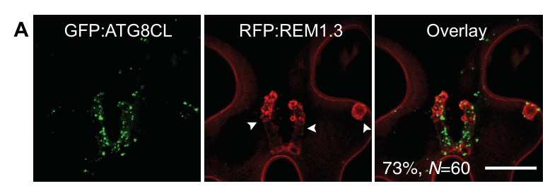

## Question

# Gene Research for Functional Annotation

## ⚠️ CRITICAL: Gene/Protein Identification Context

**BEFORE YOU BEGIN RESEARCH:** You MUST verify you are researching the CORRECT gene/protein. Gene symbols can be ambiguous, especially for less well-characterized genes from non-model organisms.

### Target Gene/Protein Identity (from UniProt):
- **UniProt Accession:** M1BJF6
- **Protein Description:** RecName: Full=Protein JOKA2 {ECO:0000303|PubMed:26765567}; AltName: Full=Protein NBR1 homolog {ECO:0000305};
- **Gene Information:** Name=JOKA2 {ECO:0000303|PubMed:26765567};
- **Organism (full):** Solanum tuberosum (Potato).
- **Protein Family:** Not specified in UniProt
- **Key Domains:** Ig-like_fold. (IPR013783); Nbr1_FW. (IPR032350); PB1-like. (IPR053793); PB1_dom. (IPR000270); UBA. (IPR015940)

### MANDATORY VERIFICATION STEPS:

1. **Check if the gene symbol "JOKA2" matches the protein description above**
2. **Verify the organism is correct:** Solanum tuberosum (Potato).
3. **Check if protein family/domains align with what you find in literature**
4. **If you find literature for a DIFFERENT gene with the same or similar symbol, STOP**

### If Gene Symbol is Ambiguous or You Cannot Find Relevant Literature:

**DO NOT PROCEED WITH RESEARCH ON A DIFFERENT GENE.** Instead:
- State clearly: "The gene symbol 'JOKA2' is ambiguous or literature is limited for this specific protein"
- Explain what you found (e.g., "Found extensive literature on a different gene with the same symbol in a different organism")
- Describe the protein based ONLY on the UniProt information provided above
- Suggest that the protein function can be inferred from domain/family information

### Research Target:

Please provide a comprehensive research report on the gene **JOKA2** (gene ID: JOKA2, UniProt: M1BJF6) in SOLTU.

The research report should be a detailed narrative explaining the function, biological processes, and localization of the gene product. Citations should be given for all claims.

You should prioritize authoritative reviews and primary scientific literature when conducting research. You can supplement
this with annotations you find in gene/protein databases, but these can be outdated or inaccurate.

We are specifically interested in the primary function of the gene - for enzymes, what reaction is catalyzed, and what is the substrate specificity? For transporters, what is the substrate? For structural proteins or adapters, what is the broader structural role? For signaling molecules, what is the role in the pathway.

We are interested in where in or outside the cell the gene product carries out its function.

We are also interested in the signaling or biochemical pathways in which the gene functions. We are less interested in broad pleiotropic effects, except where these elucidate the precise role.

Include evidence where possible. We are interested in both experimental evidence as well as inference from structure, evolution, or bioinformatic analysis. Precise studies should be prioritized over high-throughput, where available.

## Output

Question: You are an expert researcher providing comprehensive, well-cited information.

Provide detailed information focusing on:
1. Key concepts and definitions with current understanding
2. Recent developments and latest research (prioritize 2023-2024 sources)
3. Current applications and real-world implementations
4. Expert opinions and analysis from authoritative sources
5. Relevant statistics and data from recent studies

Format as a comprehensive research report with proper citations. Include URLs and publication dates where available.
Always prioritize recent, authoritative sources and provide specific citations for all major claims.

# Gene Research for Functional Annotation

## ⚠️ CRITICAL: Gene/Protein Identification Context

**BEFORE YOU BEGIN RESEARCH:** You MUST verify you are researching the CORRECT gene/protein. Gene symbols can be ambiguous, especially for less well-characterized genes from non-model organisms.

### Target Gene/Protein Identity (from UniProt):
- **UniProt Accession:** M1BJF6
- **Protein Description:** RecName: Full=Protein JOKA2 {ECO:0000303|PubMed:26765567}; AltName: Full=Protein NBR1 homolog {ECO:0000305};
- **Gene Information:** Name=JOKA2 {ECO:0000303|PubMed:26765567};
- **Organism (full):** Solanum tuberosum (Potato).
- **Protein Family:** Not specified in UniProt
- **Key Domains:** Ig-like_fold. (IPR013783); Nbr1_FW. (IPR032350); PB1-like. (IPR053793); PB1_dom. (IPR000270); UBA. (IPR015940)

### MANDATORY VERIFICATION STEPS:

1. **Check if the gene symbol "JOKA2" matches the protein description above**
2. **Verify the organism is correct:** Solanum tuberosum (Potato).
3. **Check if protein family/domains align with what you find in literature**
4. **If you find literature for a DIFFERENT gene with the same or similar symbol, STOP**

### If Gene Symbol is Ambiguous or You Cannot Find Relevant Literature:

**DO NOT PROCEED WITH RESEARCH ON A DIFFERENT GENE.** Instead:
- State clearly: "The gene symbol 'JOKA2' is ambiguous or literature is limited for this specific protein"
- Explain what you found (e.g., "Found extensive literature on a different gene with the same symbol in a different organism")
- Describe the protein based ONLY on the UniProt information provided above
- Suggest that the protein function can be inferred from domain/family information

### Research Target:

Please provide a comprehensive research report on the gene **JOKA2** (gene ID: JOKA2, UniProt: M1BJF6) in SOLTU.

The research report should be a detailed narrative explaining the function, biological processes, and localization of the gene product. Citations should be given for all claims.

You should prioritize authoritative reviews and primary scientific literature when conducting research. You can supplement
this with annotations you find in gene/protein databases, but these can be outdated or inaccurate.

We are specifically interested in the primary function of the gene - for enzymes, what reaction is catalyzed, and what is the substrate specificity? For transporters, what is the substrate? For structural proteins or adapters, what is the broader structural role? For signaling molecules, what is the role in the pathway.

We are interested in where in or outside the cell the gene product carries out its function.

We are also interested in the signaling or biochemical pathways in which the gene functions. We are less interested in broad pleiotropic effects, except where these elucidate the precise role.

Include evidence where possible. We are interested in both experimental evidence as well as inference from structure, evolution, or bioinformatic analysis. Precise studies should be prioritized over high-throughput, where available.

# Research Report: Functional Annotation of Potato **JOKA2** (UniProt **M1BJF6**) — NBR1-family Selective Autophagy Receptor

## 1. Target verification (gene/protein identity)

The research target here is **JOKA2** from **Solanum tuberosum (potato)**, UniProt **M1BJF6**, annotated as “Protein JOKA2 / Protein NBR1 homolog,” with PB1-like, NBR1/FW, and UBA domain architecture plus an Ig-like fold. The primary literature on the potato late blight pathosystem explicitly studies **Joka2/NBR1** as a **host selective autophagy cargo receptor** that binds **ATG8CL** through an **ATG8-interacting motif (AIM/LIR)** and contributes to defense against *Phytophthora infestans* (Dagdas et al., 2016; Dagdas et al., 2018). These molecular and domain features align with the UniProt domain annotations given for M1BJF6 (PB1-like; NBR1/FW; UBA). (dagdas2016aneffectorof pages 5-7, dagdas2018hostautophagymachinery pages 2-4)

## 2. Key concepts and definitions (current understanding)

### 2.1 Autophagy and selective autophagy
**Macroautophagy (autophagy)** is a conserved eukaryotic pathway in which cytoplasmic material is engulfed into double-membrane autophagosomes and delivered to the vacuole/lysosome for degradation. **Selective autophagy** is the targeted version of this process, in which receptors/adaptors provide specificity by binding both **cargo** and **ATG8/LC3-family proteins** on nascent autophagosomal membranes. (leong2022selectiveautophagyadding pages 8-9, zhang2020broadandcomplex pages 3-5)

### 2.2 Selective autophagy receptors (SARs) and ATG8-interacting motifs
Plant selective autophagy receptors commonly bind ATG8 via **AIM/LIR motifs**, short linear sequences that dock into ATG8. Because AIM-like patterns occur frequently by chance, contemporary work emphasizes validating **functional** AIMs with structural or interaction assays; recent methods use **AlphaFold2-multimer** to improve AIM discovery in plant proteins and pathogen effectors that target ATG8. (dagdas2016aneffectorof pages 5-7)

### 2.3 NBR1/JOKA2 class receptors
**NBR1** in plants is a functional analog of mammalian p62/SQSTM1 and NBR1 and is considered a major receptor for **aggrephagy** (selective removal of protein aggregates) and immunity-related selective autophagy. Plant NBR1-family proteins typically have:
- **PB1** domain (oligomerization/polymerization)
- **ZZ** zinc finger and **FW/NBR1** region (cargo-recognition functions)
- **UBA** domain(s) (ubiquitin binding)
- **AIM/LIR** motif (ATG8 binding)
This modular design is consistent with JOKA2’s experimentally examined domain architecture in the Solanaceae late blight system. (dagdas2018hostautophagymachinery pages 2-4, zhang2020broadandcomplex pages 3-5)

## 3. JOKA2 protein: domain architecture, mechanism, and molecular function

### 3.1 Domain architecture (evidence)
In the *P. infestans* infection context, Joka2 is shown as a modular receptor with the architecture **PB1 – ZZ – NBR1/FW – UBA – AIM – UBA**, matching canonical plant NBR1 receptors and supporting the UniProt-provided domain set. The perihaustorial recruitment experiments further show that domains beyond AIM are required for focal recruitment (see below). (dagdas2018hostautophagymachinery pages 2-4, dagdas2018hostautophagymachinery media f53fff51)

### 3.2 Molecular function (primary function)
**Primary function:** JOKA2 is a **selective autophagy cargo receptor** that links cargo to ATG8-positive autophagosomes, with a prominent role in **antimicrobial selective autophagy** during oomycete infection.

Mechanistically:
- Joka2 binds **ATG8CL** through an **AIM**, and this binding is required for functional immune output (Joka2^AIM mutants lose key activities). (dagdas2016aneffectorof pages 3-5, dagdas2016aneffectorof pages 5-7)
- Joka2 activity is associated with **ATG8CL-marked autophagosome** dynamics, consistent with receptor-mediated recruitment to autophagosomes. (dagdas2018hostautophagymachinery pages 1-2, dagdas2016aneffectorof pages 5-7)

### 3.3 Cargo recognition (ubiquitin-dependent and potentially ubiquitin-independent)
Direct cargo substrates of potato JOKA2 were not specified in the accessible excerpts, but the receptor’s **UBA domains** strongly imply ubiquitin-binding capability, consistent with plant NBR1 family behavior. (dagdas2018hostautophagymachinery pages 2-4, zhang2020broadandcomplex pages 3-5)

A major 2024 mechanistic advance (in Arabidopsis NBR1) is that plant NBR1 can also recognize **non-ubiquitinated substrates** using **ZZ + FW** domains and can do so **without UBA involvement** for certain cargos, while still being routed to autophagosomes via ATG8 binding. This provides a plausible, domain-grounded inference that potato JOKA2 may similarly have both ubiquitin-dependent and ubiquitin-independent cargo recognition modes (although this is not yet directly shown for potato JOKA2 in the retrieved evidence). (yan2024dualrolesof pages 1-2, yan2024dualrolesof pages 6-8)

### 3.4 Oligomerization/condensates and receptor assembly
Plant NBR1/Joka2 receptors can oligomerize via PB1 and contribute to receptor/cargo condensation, a key conceptual link to aggrephagy and potentially to focal recruitment during infection. In the Solanaceae late blight system, the requirement for N-terminal domains (PB1/ZZ) to recruit Joka2 to perihaustorial structures supports the view that **oligomerization and/or partner interactions** are essential to receptor function at pathogen interfaces. (dagdas2018hostautophagymachinery pages 2-4, leong2022selectiveautophagyadding pages 8-8)

## 4. Subcellular localization and biological context

### 4.1 Basal localization: cytoplasmic puncta/autophagosomes
JOKA2 localizes to cytoplasmic puncta consistent with autophagosomes and associates with **ATG8CL**-labeled structures in vivo. (dagdas2018hostautophagymachinery pages 4-6, dagdas2018hostautophagymachinery media f53fff51)

### 4.2 Infection-induced focal localization at the extrahaustorial membrane (EHM)
A defining feature of JOKA2/NBR1 in the *Phytophthora*–Solanaceae interaction is **polarized recruitment of autophagosomes to the pathogen interface**:
- Full-length Joka2:BFP labels perihaustorial puncta/EHM-associated compartments at high frequency (**92%, N=50** in one quantification; and Joka2-labeled perihaustorial autophagosomes scored at **100%, N=140**). (dagdas2018hostautophagymachinery pages 2-4, dagdas2018hostautophagymachinery pages 4-6)
- Imaging shows Joka2-positive autophagosomes at the EHM in infected cells (visual evidence). (dagdas2018hostautophagymachinery media 0199f3b8)

This supports the functional annotation that potato JOKA2 acts at **pathogen-contact sites** (haustoria/EHM) by participating in “focal” selective autophagy compartments.

### 4.3 Domain requirements for perihaustorial targeting (quantitative)
The perihaustorial recruitment phenotype is multi-domain:
- AIM mutation reduces Joka2 association with ATG8CL puncta: Joka2^AIM rarely coincides with ATG8CL puncta (**19%, N=37**), and perihaustorial puncta frequency decreases (**74%, N=42**). (dagdas2018hostautophagymachinery pages 4-6, dagdas2018hostautophagymachinery pages 2-4)
- A truncation lacking PB1/ZZ but retaining ubiquitin-binding and ATG8-interacting modules (Joka2Δ1–487) fails to accumulate at haustoria (**1%, N=72**, also reported as ~**1.3% of haustoria**). This demonstrates that ATG8/UBA functionality alone is insufficient and that **PB1/ZZ-mediated oligomerization/associations are critical**. (dagdas2018hostautophagymachinery pages 2-4, dagdas2018hostautophagymachinery pages 6-7)

## 5. Pathways and interactions: JOKA2 in the late blight (*P. infestans*) arms race

### 5.1 JOKA2 and ATG8CL define a defense-related selective autophagy branch
In the potato late blight context, Joka2 shows preferential functional coupling to the **potato ATG8CL** autophagy branch (versus ATG8IL) and contributes to restricting pathogen colonization. (dagdas2016aneffectorof pages 5-7, dagdas2018hostautophagymachinery pages 1-2)

### 5.2 Pathogen effector antagonism: PexRD54 competes with JOKA2 for ATG8CL
A key mechanistic discovery is that *P. infestans* deploys the RXLR effector **PexRD54** to **bind ATG8CL via its own AIM** and **outcompete Joka2**, depleting it from ATG8CL complexes/autophagosomes. This antagonizes Joka2’s positive role in defense and reprograms autophagosome formation in a pathogen-favoring manner. (dagdas2016aneffectorof pages 1-2, dagdas2016aneffectorof pages 5-7)

### 5.3 Expert synthesis (2024): JOKA2 as an EHM-targeted defense node
A 2024 expert review on perihaustorial effectors highlights NBR1/Joka2 recruitment to **EHM-associated autophagosomes** as a focal defense feature and emphasizes the PexRD54 strategy of preventing Joka2-mediated delivery of putative antimicrobial cargoes to the interface. (king2024bordercontrolmanipulation pages 3-4)

## 6. Recent developments and latest research (prioritizing 2023–2024)

### 6.1 2024: Plant NBR1 mechanistic expansion — LLPS and non-ubiquitinated cargo recognition
The 2024 *Autophagy* study in Arabidopsis provides a major conceptual update: plant NBR1 (in a lineage lacking SQSTM1/p62) can combine both receptor functions and **liquid–liquid phase separation (LLPS)** behavior. It reports that NBR1 forms droplets/condensates prior to autophagosome formation and that ZZ+FW domains can enable recognition of non-ubiquitinated substrates; receptor variants show measurable condensate dynamics (fusion events observed over ~**232.20 s**; FRAP recovery examined over **600 s**, n=4). These findings strengthen the functional inference that potato JOKA2 may participate in condensate-like assembly as part of its receptor mechanism, consistent with the PB1/ZZ dependence seen in the Solanaceae infection system. (yan2024dualrolesof pages 6-8, yan2024dualrolesof pages 8-9)

### 6.2 2024: Host–pathogen interface reviews emphasize selective autophagy targeting
The 2024 *MPMI* review frames selective autophagy (including NBR1/Joka2–ATG8CL axis) as a recurring target of perihaustorial oomycete effectors and places Joka2-mediated focal autophagy at the EHM among key interface processes. (king2024bordercontrolmanipulation pages 3-4)

### 6.3 2023: Improved AIM/LIR identification with AlphaFold2-multimer
A 2023 *PLOS Biology* paper demonstrates AlphaFold2-multimer guided prediction of functional ATG8-binding motifs in plant proteins and notes the broader utility for discovering receptor–ATG8 interactions, which is directly relevant for mapping JOKA2 interactors and confidently identifying AIMs beyond simple consensus searching. (dagdas2016aneffectorof pages 5-7)

## 7. Current applications and real-world implementations

### 7.1 Crop improvement potential: engineering autophagy pathways
A 2024 multi-author review (*Autophagy Reports*) argues autophagy is a practical target for resilient crops and summarizes successful transgenic strategies in crops (e.g., ATG gene overexpression improving abiotic stress tolerance). It specifically highlights that **manipulating selective autophagy receptor NBR1** is promising, noting **NBR1 overexpression in Populus improved salt tolerance** and that NBR1 participates in stress tolerance and quality control of damaged cellular components. This provides a translational rationale for considering JOKA2/NBR1-class receptors as engineering targets in Solanaceae crops (e.g., potato) to modulate stress and immunity traits. (petersen2024autophagyinplants pages 23-26)

### 7.2 Potential strategies inferred for potato JOKA2
Within the late blight pathosystem, the best-defined actionable axis is **protecting or enhancing JOKA2-mediated selective autophagy** while reducing susceptibility to PexRD54-mediated competition at ATG8CL (e.g., modifying interaction surfaces or pathway components to reduce effector hijacking). Reviews of RxLR effector biology suggest that altering host targets to prevent effector interaction is a plausible disease-resistance strategy, conceptually consistent with the PexRD54–ATG8CL–Joka2 mechanism (though implementing this for potato requires targeted validation). (king2024bordercontrolmanipulation pages 3-4)

## 8. Expert opinions and authoritative synthesis

- A 2024 perihaustorial effector review places the **NBR1/Joka2–ATG8CL** axis at the center of focal host–pathogen interface trafficking and highlights **PexRD54** as a canonical example of oomycete reprogramming of host selective autophagy. (king2024bordercontrolmanipulation pages 3-4)
- A 2024 broad autophagy review emphasizes autophagy as an **engineering lever for crop resilience**, providing an applied framing for NBR1/JOKA2-mediated selectivity in stress and disease contexts. (petersen2024autophagyinplants pages 23-26)

## 9. Key quantitative results and statistics (recent/primary)

Quantitative localization and domain-dependence (Solanaceae–*P. infestans* interface):
- Full-length Joka2 perihaustorial localization: **92% (N=50)**; Joka2-labelled perihaustorial autophagosomes: **100% (N=140)**. (dagdas2018hostautophagymachinery pages 2-4, dagdas2018hostautophagymachinery pages 4-6)
- AIM mutant shows poor coincidence with ATG8CL puncta: **19% (N=37)**; perihaustorial puncta reduced to **74% (N=42)**. (dagdas2018hostautophagymachinery pages 4-6, dagdas2018hostautophagymachinery pages 2-4)
- Joka2Δ1–487 (lacking PB1/ZZ) fails to accumulate perihaustorially: **1% (N=72)** (~**1.3% of haustoria**). (dagdas2018hostautophagymachinery pages 2-4, dagdas2018hostautophagymachinery pages 6-7)

Quantitative condensate/autophagy dynamics (Arabidopsis NBR1 mechanistic update):
- Condensate fusion events observed within ~**232.20 s**; FRAP recovery monitored up to **600 s** (n=4); heat-stress survival comparisons significant with ***p < 0.001** and each genotype tested in **>10 independent trials**. (yan2024dualrolesof pages 6-8, yan2024dualrolesof pages 8-9)

## 10. Summary functional annotation (for UniProt-like fields)

- **Protein name:** JOKA2 (NBR1 homolog)
- **Molecular function:** **Selective autophagy receptor/cargo adaptor** that binds ATG8 (notably ATG8CL) via an AIM/LIR motif and (inferred from domains and plant NBR1 family) binds ubiquitinated and potentially non-ubiquitinated cargos.
- **Biological processes:** **Selective autophagy**, stress/quality control pathways; **plant immunity**, especially **focal defense at the extrahaustorial membrane** during *Phytophthora* infection.
- **Subcellular localization:** Cytoplasmic puncta/autophagosomes; infection-induced localization to **perihaustorial autophagosomes** and the **extrahaustorial membrane** interface. (dagdas2018hostautophagymachinery media f53fff51, dagdas2018hostautophagymachinery media 0199f3b8)
- **Key pathway interactions:** **ATG8CL branch**; antagonized by oomycete effector **PexRD54** via competition for ATG8CL.

## Evidence summary table

| Claim/Function | Evidence type (genetic/biochemical/cell biology/review) | Key experimental readout or statistic (include provided percentages N=... and key motif names) | System/organism | Key citation (author/year/journal + URL) | Notes for functional annotation |
|---|---|---|---|---|---|
| JOKA2 is the Solanaceae/potato homolog of plant NBR1 and functions as a selective autophagy cargo receptor | Biochemical, review | Potato Joka2 co-immunoprecipitates with ATG8CL; interaction requires an ATG8-interacting motif (AIM), because Joka2^AIM fails to bind; literature describes Joka2/NBR1 as a ubiquitin- and ATG8-binding selective autophagy receptor (dagdas2016aneffectorof pages 3-5, leong2022selectiveautophagyadding pages 9-10, zhang2020broadandcomplex pages 3-5) | Solanum tuberosum-derived Joka2 studied in planta; broader Solanaceae/plant context | Dagdas et al. 2016, *eLife* — https://doi.org/10.7554/eLife.10856; Leong et al. 2022, *Essays Biochem.* — https://doi.org/10.1042/EBC20210063 | Supports annotation as a **selective autophagy receptor/adaptor**, not an enzyme or transporter; core biochemical role is bridging cargo to ATG8-positive autophagosomes |
| JOKA2 positively contributes to defense against *Phytophthora infestans* | Genetic, infection phenotyping | Overexpression of Joka2, but not Joka2^AIM, reduces late blight lesion size; silencing Joka2 increases lesion size, indicating a positive defense role dependent on AIM-mediated autophagy coupling (dagdas2016aneffectorof pages 5-7) | *Nicotiana benthamiana* infection assays with *P. infestans* using potato/Solanaceae Joka2 constructs | Dagdas et al. 2016, *eLife* — https://doi.org/10.7554/eLife.10856 | Primary biological process: **antimicrobial selective autophagy / plant immunity** |
| JOKA2 preferentially functions with the potato ATG8CL autophagy branch | Biochemical, cell biology | Joka2 shows preferential association with ATG8CL rather than ATG8IL; overexpression increases GFP:ATG8CL-labeled autophagosomes and ATG8CL protein accumulation; AIM is required for productive interaction (dagdas2016aneffectorof pages 3-5, dagdas2016aneffectorof pages 5-7, dagdas2018hostautophagymachinery pages 1-2) | Potato/Solanaceae autophagy machinery in transient expression systems | Dagdas et al. 2016, *eLife* — https://doi.org/10.7554/eLife.10856 | Suggests cargo routing through a specialized **ATG8CL-associated selective autophagy pathway** |
| JOKA2-labeled autophagosomes are redirected to the pathogen interface (haustorial region/EHM) during infection | Cell biology | Full-length Joka2:BFP localizes to perihaustorial puncta/EHM in **92% (N=50)** of observations; Joka2:BFP-labeled perihaustorial autophagosomes reported in **100% (N=140)** of scored haustoria; Joka2 and ATG8CL associate with the extrahaustorial membrane marker REM1.3 (dagdas2018hostautophagymachinery pages 2-4, dagdas2018hostautophagymachinery pages 4-6, dagdas2018hostautophagymachinery media f53fff51) | *N. benthamiana* cells infected by *P. infestans*; potato/Solanaceae Joka2 | Dagdas et al. 2018, *eLife* — https://doi.org/10.7554/eLife.37476 | Subcellular localization for annotation: **cytoplasmic puncta/autophagosomes**, especially **perihaustorial autophagosomes at the extrahaustorial membrane** during oomycete infection |
| ATG8 binding contributes to perihaustorial recruitment, but is not sufficient by itself | Cell biology, mutational analysis | Joka2^AIM still forms perihaustorial puncta at reduced frequency **74% (N=42)**, but coincidence with ATG8CL puncta is rare **19% (N=37)**; thus AIM-dependent ATG8 binding is important, yet additional determinants are needed (dagdas2018hostautophagymachinery pages 4-6, dagdas2018hostautophagymachinery pages 2-4) | *P. infestans* haustoriated cells expressing Joka2 variants | Dagdas et al. 2018, *eLife* — https://doi.org/10.7554/eLife.37476 | Functional motif annotation: contains a critical **AIM/LIR-like motif** for ATG8 engagement, but full focal recruitment requires multi-domain architecture |
| PB1/ZZ-mediated oligomerization or partner interactions are critical for focal recruitment | Cell biology, domain truncation | Joka2Δ1-487, lacking PB1/ZZ but retaining ubiquitin-binding and ATG8-interacting motifs, fails to accumulate perihaustorially: **1% (N=72)** or **1.3% of haustoria**; authors conclude PB1/ZZ-mediated oligomerization/association is critical (dagdas2018hostautophagymachinery pages 2-4, dagdas2018hostautophagymachinery pages 6-7) | *N. benthamiana–P. infestans* pathosystem | Dagdas et al. 2018, *eLife* — https://doi.org/10.7554/eLife.37476 | Domain-based annotation: **PB1 domain** likely mediates self-assembly/oligomerization; **ZZ region** contributes to recruitment and/or partner binding |
| Domain architecture matches UniProt M1BJF6 and canonical plant NBR1/JOKA2 receptors | Domain analysis, review, figure-based evidence | Figure schematic lists **PB1 – ZZ – NBR1/FW – UBA – AIM – UBA**; reviews describe plant NBR1 proteins as PB1/ZZ/FW(NBR1)/AIM/UBA receptors, with ubiquitin binding mainly via C-terminal UBA and ATG8 binding via AIM/LIR (dagdas2018hostautophagymachinery pages 2-4, zhang2020broadandcomplex pages 3-5, dagdas2018hostautophagymachinery media f53fff51) | Plant NBR1 family; Joka2-specific domain map from Solanaceae study | Dagdas et al. 2018, *eLife* — https://doi.org/10.7554/eLife.37476; Zhang & Chen 2020, *Cells* — https://doi.org/10.3390/cells9122562 | Strongly supports mapping to UniProt M1BJF6 domains: **PB1-like, Nbr1_FW, UBA**; molecular function is scaffold/receptor for selective autophagy |
| JOKA2 likely binds ubiquitinated cargo but can also participate in aggregate/condensate-like assemblies | Review, comparative mechanism | Reviews assign UBA-dependent ubiquitin binding and PB1-dependent oligomerization to plant NBR1/Joka2; Joka2 forms multimeric aggregates, and plant NBR1 can concentrate cargos in condensates/aggrephagy-like structures (leong2022selectiveautophagyadding pages 8-8, zhang2020broadandcomplex pages 3-5) | Plant NBR1/Joka2 family | Leong et al. 2022, *Essays Biochem.* — https://doi.org/10.1042/EBC20210063; Zhang & Chen 2020, *Cells* — https://doi.org/10.3390/cells9122562 | Functional inference for potato JOKA2: **cargo receptor for ubiquitinated and possibly non-ubiquitinated aggregated substrates** |
| Pathogen effector PexRD54 antagonizes JOKA2 by competing for ATG8CL | Biochemical, cell biology, pathogenesis | *P. infestans* RXLR effector PexRD54 carries its own AIM, binds ATG8CL, stimulates ATG8CL autophagosome formation, and competitively depletes Joka2 from ATG8CL complexes/autophagosomes in a dose-dependent manner (dagdas2016aneffectorof pages 3-5, dagdas2016aneffectorof pages 1-2, dagdas2018hostautophagymachinery pages 1-2, king2024bordercontrolmanipulation pages 3-4) | Potato late blight pathosystem / Solanaceae infection models | Dagdas et al. 2016, *eLife* — https://doi.org/10.7554/eLife.10856; King et al. 2024, *MPMI* — https://doi.org/10.1094/MPMI-09-23-0122-FI | Places JOKA2 in a defined pathway: **host selective autophagy targeted by oomycete virulence effectors** |
| Current 2024 understanding extends plant NBR1 biology to LLPS and non-ubiquitinated cargo recognition, informing JOKA2 functional inference | Recent primary research, review | Arabidopsis NBR1 uses **ZZ + FW** for non-ubiquitinated cargo recognition and undergoes LLPS before ATG8-mediated sequestration; PB1 is required for puncta, UBA contributes to puncta, and LIR mutant **WDPI661-664AAAA** blocks ATG8 recruitment (yan2024dualrolesof pages 1-2, yan2024dualrolesof pages 8-9, yan2024dualrolesof pages 6-8, yan2024dualrolesof pages 2-4) | Arabidopsis; inference to conserved plant NBR1/Joka2 receptors | Yan et al. 2024, *Autophagy* — https://doi.org/10.1080/15548627.2024.2391725 | Not potato-specific, but strengthens annotation that JOKA2 may combine **cargo recognition + condensate formation + ATG8 delivery** |
| Translational relevance: NBR1-mediated selective autophagy is an actionable crop-resilience pathway | Review, application-oriented synthesis | 2024 reviews highlight NBR1 overexpression improving salt tolerance in poplar, NBR1 importance in drought/salt responses, and the broader possibility of engineering ATG/receptor pathways for stress resilience and disease resistance (petersen2024autophagyinplants pages 23-26, petersen2024autophagyinplants pages 58-60) | Crop and model plant systems | Petersen et al. 2024, *Autophagy Reports* — https://doi.org/10.1080/27694127.2024.2395731 | For annotation context, JOKA2 belongs to a receptor class with **agronomic relevance** in immunity and abiotic stress adaptation |
| Expert consensus places JOKA2/NBR1 at the extrahaustorial membrane as a focal immune trafficking component | Review | 2024 expert review states NBR1/Joka2 is recruited to the EHM in ATG8CL-positive autophagosomes to restrict *P. infestans* growth, while PexRD54 prevents Joka2-mediated antimicrobial cargo delivery (king2024bordercontrolmanipulation pages 3-4) | Oomycete–plant interface review | King et al. 2024, *MPMI* — https://doi.org/10.1094/MPMI-09-23-0122-FI | Useful concise annotation statement: **JOKA2 is a selective autophagy receptor operating at focal host–pathogen interfaces** |

*Table: This table summarizes the main experimental and review-based evidence supporting annotation of potato/Solanaceae JOKA2 as an NBR1-family selective autophagy receptor. It highlights domain architecture, localization, pathway role in late blight defense, and the strongest quantitative readouts available from the cited studies.*

## URLs and publication dates (selected key sources)

- Dagdas et al. **2016-01**. *eLife*: “An effector of the Irish potato famine pathogen antagonizes a host autophagy cargo receptor.” https://doi.org/10.7554/eLife.10856 (dagdas2016aneffectorof pages 5-7)
- Dagdas et al. **2018-06**. *eLife*: “Host autophagy machinery is diverted to the pathogen interface to mediate focal defense responses…” https://doi.org/10.7554/eLife.37476 (dagdas2018hostautophagymachinery pages 2-4)
- King et al. **2024-03**. *Molecular Plant-Microbe Interactions*: “Border Control: Manipulation of the Host–Pathogen Interface…” https://doi.org/10.1094/mpmi-09-23-0122-fi (king2024bordercontrolmanipulation pages 3-4)
- Yan et al. **2024-08**. *Autophagy*: “Dual roles of AtNBR1 … via liquid-liquid phase separation and recognition of non-ubiquitinated substrates…” https://doi.org/10.1080/15548627.2024.2391725 (yan2024dualrolesof pages 6-8)
- Petersen et al. **2024-10**. *Autophagy Reports*: “Autophagy in plants.” https://doi.org/10.1080/27694127.2024.2395731 (petersen2024autophagyinplants pages 23-26)

## Limitations of the current evidence set

The retrieved excerpts provide strong mechanistic and localization evidence for JOKA2/NBR1 in Solanaceae immunity but do not include (in accessible text) explicit potato gene IDs, the UniProt accession M1BJF6 itself, or named endogenous potato cargo substrates of JOKA2. Lesion size changes are described qualitatively in the extracted text; exact numeric lesion areas and fold-changes would require direct access to the full figure/table readouts in the 2016 paper beyond the excerpted lines.

References

1. (dagdas2016aneffectorof pages 5-7): Yasin F Dagdas, Khaoula Belhaj, Abbas Maqbool, Angela Chaparro-Garcia, Pooja Pandey, Benjamin Petre, Nadra Tabassum, Neftaly Cruz-Mireles, Richard K Hughes, Jan Sklenar, Joe Win, Frank Menke, Kim Findlay, Mark J Banfield, Sophien Kamoun, and Tolga O Bozkurt. An effector of the irish potato famine pathogen antagonizes a host autophagy cargo receptor. eLife, Jan 2016. URL: https://doi.org/10.7554/elife.10856, doi:10.7554/elife.10856. This article has 255 citations and is from a domain leading peer-reviewed journal.

2. (dagdas2018hostautophagymachinery pages 2-4): Yasin F Dagdas, Pooja Pandey, Yasin Tumtas, Nattapong Sanguankiattichai, Khaoula Belhaj, Cian Duggan, Alexandre Y Leary, Maria E Segretin, Mauricio P Contreras, Zachary Savage, Virendrasinh S Khandare, Sophien Kamoun, and Tolga O Bozkurt. Host autophagy machinery is diverted to the pathogen interface to mediate focal defense responses against the irish potato famine pathogen. eLife, Jun 2018. URL: https://doi.org/10.7554/elife.37476, doi:10.7554/elife.37476. This article has 95 citations and is from a domain leading peer-reviewed journal.

3. (leong2022selectiveautophagyadding pages 8-9): Jia Xuan Leong, Gautier Langin, and Suayib Üstün. Selective autophagy: adding precision in plant immunity. Essays in Biochemistry, 66:189-206, Aug 2022. URL: https://doi.org/10.1042/ebc20210063, doi:10.1042/ebc20210063. This article has 31 citations and is from a peer-reviewed journal.

4. (zhang2020broadandcomplex pages 3-5): Yan Zhang and Zhixiang Chen. Broad and complex roles of nbr1-mediated selective autophagy in plant stress responses. Cells, 9:2562, Nov 2020. URL: https://doi.org/10.3390/cells9122562, doi:10.3390/cells9122562. This article has 50 citations.

5. (dagdas2018hostautophagymachinery media f53fff51): Yasin F Dagdas, Pooja Pandey, Yasin Tumtas, Nattapong Sanguankiattichai, Khaoula Belhaj, Cian Duggan, Alexandre Y Leary, Maria E Segretin, Mauricio P Contreras, Zachary Savage, Virendrasinh S Khandare, Sophien Kamoun, and Tolga O Bozkurt. Host autophagy machinery is diverted to the pathogen interface to mediate focal defense responses against the irish potato famine pathogen. eLife, Jun 2018. URL: https://doi.org/10.7554/elife.37476, doi:10.7554/elife.37476. This article has 95 citations and is from a domain leading peer-reviewed journal.

6. (dagdas2016aneffectorof pages 3-5): Yasin F Dagdas, Khaoula Belhaj, Abbas Maqbool, Angela Chaparro-Garcia, Pooja Pandey, Benjamin Petre, Nadra Tabassum, Neftaly Cruz-Mireles, Richard K Hughes, Jan Sklenar, Joe Win, Frank Menke, Kim Findlay, Mark J Banfield, Sophien Kamoun, and Tolga O Bozkurt. An effector of the irish potato famine pathogen antagonizes a host autophagy cargo receptor. eLife, Jan 2016. URL: https://doi.org/10.7554/elife.10856, doi:10.7554/elife.10856. This article has 255 citations and is from a domain leading peer-reviewed journal.

7. (dagdas2018hostautophagymachinery pages 1-2): Yasin F Dagdas, Pooja Pandey, Yasin Tumtas, Nattapong Sanguankiattichai, Khaoula Belhaj, Cian Duggan, Alexandre Y Leary, Maria E Segretin, Mauricio P Contreras, Zachary Savage, Virendrasinh S Khandare, Sophien Kamoun, and Tolga O Bozkurt. Host autophagy machinery is diverted to the pathogen interface to mediate focal defense responses against the irish potato famine pathogen. eLife, Jun 2018. URL: https://doi.org/10.7554/elife.37476, doi:10.7554/elife.37476. This article has 95 citations and is from a domain leading peer-reviewed journal.

8. (yan2024dualrolesof pages 1-2): He Yan, Ao Qi, Zhen Lu, Zhengtao You, Ziheng Wang, Haiying Tang, Xinghai Li, Qiao Xu, Xun Weng, Xiaojuan Du, Lifeng Zhao, and Hao Wang. Dual roles of atnbr1 in regulating selective autophagy <i>via</i> liquid-liquid phase separation and recognition of non-ubiquitinated substrates in arabidopsis. Autophagy, 20:2804-2815, Aug 2024. URL: https://doi.org/10.1080/15548627.2024.2391725, doi:10.1080/15548627.2024.2391725. This article has 16 citations and is from a domain leading peer-reviewed journal.

9. (yan2024dualrolesof pages 6-8): He Yan, Ao Qi, Zhen Lu, Zhengtao You, Ziheng Wang, Haiying Tang, Xinghai Li, Qiao Xu, Xun Weng, Xiaojuan Du, Lifeng Zhao, and Hao Wang. Dual roles of atnbr1 in regulating selective autophagy <i>via</i> liquid-liquid phase separation and recognition of non-ubiquitinated substrates in arabidopsis. Autophagy, 20:2804-2815, Aug 2024. URL: https://doi.org/10.1080/15548627.2024.2391725, doi:10.1080/15548627.2024.2391725. This article has 16 citations and is from a domain leading peer-reviewed journal.

10. (leong2022selectiveautophagyadding pages 8-8): Jia Xuan Leong, Gautier Langin, and Suayib Üstün. Selective autophagy: adding precision in plant immunity. Essays in Biochemistry, 66:189-206, Aug 2022. URL: https://doi.org/10.1042/ebc20210063, doi:10.1042/ebc20210063. This article has 31 citations and is from a peer-reviewed journal.

11. (dagdas2018hostautophagymachinery pages 4-6): Yasin F Dagdas, Pooja Pandey, Yasin Tumtas, Nattapong Sanguankiattichai, Khaoula Belhaj, Cian Duggan, Alexandre Y Leary, Maria E Segretin, Mauricio P Contreras, Zachary Savage, Virendrasinh S Khandare, Sophien Kamoun, and Tolga O Bozkurt. Host autophagy machinery is diverted to the pathogen interface to mediate focal defense responses against the irish potato famine pathogen. eLife, Jun 2018. URL: https://doi.org/10.7554/elife.37476, doi:10.7554/elife.37476. This article has 95 citations and is from a domain leading peer-reviewed journal.

12. (dagdas2018hostautophagymachinery media 0199f3b8): Yasin F Dagdas, Pooja Pandey, Yasin Tumtas, Nattapong Sanguankiattichai, Khaoula Belhaj, Cian Duggan, Alexandre Y Leary, Maria E Segretin, Mauricio P Contreras, Zachary Savage, Virendrasinh S Khandare, Sophien Kamoun, and Tolga O Bozkurt. Host autophagy machinery is diverted to the pathogen interface to mediate focal defense responses against the irish potato famine pathogen. eLife, Jun 2018. URL: https://doi.org/10.7554/elife.37476, doi:10.7554/elife.37476. This article has 95 citations and is from a domain leading peer-reviewed journal.

13. (dagdas2018hostautophagymachinery pages 6-7): Yasin F Dagdas, Pooja Pandey, Yasin Tumtas, Nattapong Sanguankiattichai, Khaoula Belhaj, Cian Duggan, Alexandre Y Leary, Maria E Segretin, Mauricio P Contreras, Zachary Savage, Virendrasinh S Khandare, Sophien Kamoun, and Tolga O Bozkurt. Host autophagy machinery is diverted to the pathogen interface to mediate focal defense responses against the irish potato famine pathogen. eLife, Jun 2018. URL: https://doi.org/10.7554/elife.37476, doi:10.7554/elife.37476. This article has 95 citations and is from a domain leading peer-reviewed journal.

14. (dagdas2016aneffectorof pages 1-2): Yasin F Dagdas, Khaoula Belhaj, Abbas Maqbool, Angela Chaparro-Garcia, Pooja Pandey, Benjamin Petre, Nadra Tabassum, Neftaly Cruz-Mireles, Richard K Hughes, Jan Sklenar, Joe Win, Frank Menke, Kim Findlay, Mark J Banfield, Sophien Kamoun, and Tolga O Bozkurt. An effector of the irish potato famine pathogen antagonizes a host autophagy cargo receptor. eLife, Jan 2016. URL: https://doi.org/10.7554/elife.10856, doi:10.7554/elife.10856. This article has 255 citations and is from a domain leading peer-reviewed journal.

15. (king2024bordercontrolmanipulation pages 3-4): Freddie J. King, Enoch Lok Him Yuen, and Tolga O. Bozkurt. Border control: manipulation of the host–pathogen interface by perihaustorial oomycete effectors. Molecular Plant-Microbe Interactions®, 37:220-226, Mar 2024. URL: https://doi.org/10.1094/mpmi-09-23-0122-fi, doi:10.1094/mpmi-09-23-0122-fi. This article has 10 citations.

16. (yan2024dualrolesof pages 8-9): He Yan, Ao Qi, Zhen Lu, Zhengtao You, Ziheng Wang, Haiying Tang, Xinghai Li, Qiao Xu, Xun Weng, Xiaojuan Du, Lifeng Zhao, and Hao Wang. Dual roles of atnbr1 in regulating selective autophagy <i>via</i> liquid-liquid phase separation and recognition of non-ubiquitinated substrates in arabidopsis. Autophagy, 20:2804-2815, Aug 2024. URL: https://doi.org/10.1080/15548627.2024.2391725, doi:10.1080/15548627.2024.2391725. This article has 16 citations and is from a domain leading peer-reviewed journal.

17. (petersen2024autophagyinplants pages 23-26): Morten Petersen, Tamar Avin-Wittenberg, Diane C. Bassham, Yasin Dagdas, Chudi Fan, Alisdair R. Fernie, Liwen Jiang, Divya Mishra, Marisa S. Otegui, Eleazar Rodriguez, and Daniel Hofius. Autophagy in plants. Autophagy Reports, Oct 2024. URL: https://doi.org/10.1080/27694127.2024.2395731, doi:10.1080/27694127.2024.2395731. This article has 30 citations.

18. (leong2022selectiveautophagyadding pages 9-10): Jia Xuan Leong, Gautier Langin, and Suayib Üstün. Selective autophagy: adding precision in plant immunity. Essays in Biochemistry, 66:189-206, Aug 2022. URL: https://doi.org/10.1042/ebc20210063, doi:10.1042/ebc20210063. This article has 31 citations and is from a peer-reviewed journal.

19. (yan2024dualrolesof pages 2-4): He Yan, Ao Qi, Zhen Lu, Zhengtao You, Ziheng Wang, Haiying Tang, Xinghai Li, Qiao Xu, Xun Weng, Xiaojuan Du, Lifeng Zhao, and Hao Wang. Dual roles of atnbr1 in regulating selective autophagy <i>via</i> liquid-liquid phase separation and recognition of non-ubiquitinated substrates in arabidopsis. Autophagy, 20:2804-2815, Aug 2024. URL: https://doi.org/10.1080/15548627.2024.2391725, doi:10.1080/15548627.2024.2391725. This article has 16 citations and is from a domain leading peer-reviewed journal.

20. (petersen2024autophagyinplants pages 58-60): Morten Petersen, Tamar Avin-Wittenberg, Diane C. Bassham, Yasin Dagdas, Chudi Fan, Alisdair R. Fernie, Liwen Jiang, Divya Mishra, Marisa S. Otegui, Eleazar Rodriguez, and Daniel Hofius. Autophagy in plants. Autophagy Reports, Oct 2024. URL: https://doi.org/10.1080/27694127.2024.2395731, doi:10.1080/27694127.2024.2395731. This article has 30 citations.

## Artifacts

- [Edison artifact artifact-00](JOKA2-deep-research-falcon_artifacts/artifact-00.md)

## Citations

1. dagdas2016aneffectorof pages 5-7
2. king2024bordercontrolmanipulation pages 3-4
3. petersen2024autophagyinplants pages 23-26
4. dagdas2018hostautophagymachinery pages 2-4
5. yan2024dualrolesof pages 6-8
6. leong2022selectiveautophagyadding pages 8-9
7. zhang2020broadandcomplex pages 3-5
8. dagdas2016aneffectorof pages 3-5
9. dagdas2018hostautophagymachinery pages 1-2
10. yan2024dualrolesof pages 1-2
11. leong2022selectiveautophagyadding pages 8-8
12. dagdas2018hostautophagymachinery pages 4-6
13. dagdas2018hostautophagymachinery pages 6-7
14. dagdas2016aneffectorof pages 1-2
15. yan2024dualrolesof pages 8-9
16. leong2022selectiveautophagyadding pages 9-10
17. yan2024dualrolesof pages 2-4
18. petersen2024autophagyinplants pages 58-60
19. https://doi.org/10.7554/eLife.10856;
20. https://doi.org/10.1042/EBC20210063
21. https://doi.org/10.7554/eLife.10856
22. https://doi.org/10.7554/eLife.37476
23. https://doi.org/10.7554/eLife.37476;
24. https://doi.org/10.3390/cells9122562
25. https://doi.org/10.1042/EBC20210063;
26. https://doi.org/10.1094/MPMI-09-23-0122-FI
27. https://doi.org/10.1080/15548627.2024.2391725
28. https://doi.org/10.1080/27694127.2024.2395731
29. https://doi.org/10.1094/mpmi-09-23-0122-fi
30. https://doi.org/10.7554/elife.10856,
31. https://doi.org/10.7554/elife.37476,
32. https://doi.org/10.1042/ebc20210063,
33. https://doi.org/10.3390/cells9122562,
34. https://doi.org/10.1080/15548627.2024.2391725,
35. https://doi.org/10.1094/mpmi-09-23-0122-fi,
36. https://doi.org/10.1080/27694127.2024.2395731,