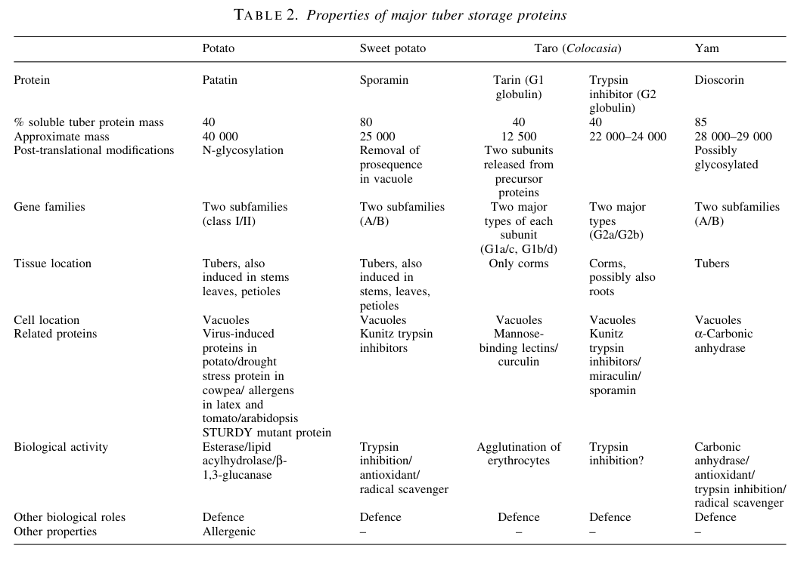

## Question

# Gene Research for Functional Annotation

## ⚠️ CRITICAL: Gene/Protein Identification Context

**BEFORE YOU BEGIN RESEARCH:** You MUST verify you are researching the CORRECT gene/protein. Gene symbols can be ambiguous, especially for less well-characterized genes from non-model organisms.

### Target Gene/Protein Identity (from UniProt):
- **UniProt Accession:** P15476
- **Protein Description:** RecName: Full=Patatin-B1; EC=3.1.1.-; Flags: Precursor;
- **Gene Information:** Name=PATB1;
- **Organism (full):** Solanum tuberosum (Potato).
- **Protein Family:** Belongs to the patatin family. .
- **Key Domains:** Acyl_Trfase/lysoPLipase. (IPR016035); PNPLA_dom. (IPR002641); Patatin (PF01734)

### MANDATORY VERIFICATION STEPS:

1. **Check if the gene symbol "PATB1" matches the protein description above**
2. **Verify the organism is correct:** Solanum tuberosum (Potato).
3. **Check if protein family/domains align with what you find in literature**
4. **If you find literature for a DIFFERENT gene with the same or similar symbol, STOP**

### If Gene Symbol is Ambiguous or You Cannot Find Relevant Literature:

**DO NOT PROCEED WITH RESEARCH ON A DIFFERENT GENE.** Instead:
- State clearly: "The gene symbol 'PATB1' is ambiguous or literature is limited for this specific protein"
- Explain what you found (e.g., "Found extensive literature on a different gene with the same symbol in a different organism")
- Describe the protein based ONLY on the UniProt information provided above
- Suggest that the protein function can be inferred from domain/family information

### Research Target:

Please provide a comprehensive research report on the gene **PATB1** (gene ID: PATB1, UniProt: P15476) in SOLTU.

The research report should be a detailed narrative explaining the function, biological processes, and localization of the gene product. Citations should be given for all claims.

You should prioritize authoritative reviews and primary scientific literature when conducting research. You can supplement
this with annotations you find in gene/protein databases, but these can be outdated or inaccurate.

We are specifically interested in the primary function of the gene - for enzymes, what reaction is catalyzed, and what is the substrate specificity? For transporters, what is the substrate? For structural proteins or adapters, what is the broader structural role? For signaling molecules, what is the role in the pathway.

We are interested in where in or outside the cell the gene product carries out its function.

We are also interested in the signaling or biochemical pathways in which the gene functions. We are less interested in broad pleiotropic effects, except where these elucidate the precise role.

Include evidence where possible. We are interested in both experimental evidence as well as inference from structure, evolution, or bioinformatic analysis. Precise studies should be prioritized over high-throughput, where available.

## Output

Question: You are an expert researcher providing comprehensive, well-cited information.

Provide detailed information focusing on:
1. Key concepts and definitions with current understanding
2. Recent developments and latest research (prioritize 2023-2024 sources)
3. Current applications and real-world implementations
4. Expert opinions and analysis from authoritative sources
5. Relevant statistics and data from recent studies

Format as a comprehensive research report with proper citations. Include URLs and publication dates where available.
Always prioritize recent, authoritative sources and provide specific citations for all major claims.

# Gene Research for Functional Annotation

## ⚠️ CRITICAL: Gene/Protein Identification Context

**BEFORE YOU BEGIN RESEARCH:** You MUST verify you are researching the CORRECT gene/protein. Gene symbols can be ambiguous, especially for less well-characterized genes from non-model organisms.

### Target Gene/Protein Identity (from UniProt):
- **UniProt Accession:** P15476
- **Protein Description:** RecName: Full=Patatin-B1; EC=3.1.1.-; Flags: Precursor;
- **Gene Information:** Name=PATB1;
- **Organism (full):** Solanum tuberosum (Potato).
- **Protein Family:** Belongs to the patatin family. .
- **Key Domains:** Acyl_Trfase/lysoPLipase. (IPR016035); PNPLA_dom. (IPR002641); Patatin (PF01734)

### MANDATORY VERIFICATION STEPS:

1. **Check if the gene symbol "PATB1" matches the protein description above**
2. **Verify the organism is correct:** Solanum tuberosum (Potato).
3. **Check if protein family/domains align with what you find in literature**
4. **If you find literature for a DIFFERENT gene with the same or similar symbol, STOP**

### If Gene Symbol is Ambiguous or You Cannot Find Relevant Literature:

**DO NOT PROCEED WITH RESEARCH ON A DIFFERENT GENE.** Instead:
- State clearly: "The gene symbol 'PATB1' is ambiguous or literature is limited for this specific protein"
- Explain what you found (e.g., "Found extensive literature on a different gene with the same symbol in a different organism")
- Describe the protein based ONLY on the UniProt information provided above
- Suggest that the protein function can be inferred from domain/family information

### Research Target:

Please provide a comprehensive research report on the gene **PATB1** (gene ID: PATB1, UniProt: P15476) in SOLTU.

The research report should be a detailed narrative explaining the function, biological processes, and localization of the gene product. Citations should be given for all claims.

You should prioritize authoritative reviews and primary scientific literature when conducting research. You can supplement
this with annotations you find in gene/protein databases, but these can be outdated or inaccurate.

We are specifically interested in the primary function of the gene - for enzymes, what reaction is catalyzed, and what is the substrate specificity? For transporters, what is the substrate? For structural proteins or adapters, what is the broader structural role? For signaling molecules, what is the role in the pathway.

We are interested in where in or outside the cell the gene product carries out its function.

We are also interested in the signaling or biochemical pathways in which the gene functions. We are less interested in broad pleiotropic effects, except where these elucidate the precise role.

Include evidence where possible. We are interested in both experimental evidence as well as inference from structure, evolution, or bioinformatic analysis. Precise studies should be prioritized over high-throughput, where available.

## Research Report: Functional Annotation of **PATB1 / Patatin-B1** (UniProt **P15476**) in *Solanum tuberosum* (Potato)

### Executive summary
Patatin-B1 (gene **PATB1**, UniProt **P15476**) is a canonical potato tuber patatin: a very abundant (~40% of soluble tuber protein in larger tubers) ~40–45 kDa **vacuolar glycoprotein** synthesized as a **signal-peptide-containing precursor** and deposited in tuber parenchyma vacuoles. It is best understood as a dual-function protein: (i) a major **nitrogen/carbon storage protein** in the tuber and (ii) a **lipid acyl hydrolase (LAH) / phospholipase A-like serine hydrolase** with broad activity toward polar and neutral glycerolipids, plus measurable esterase activity on model substrates. Experimental immunocytochemistry localizes patatin predominantly to vacuoles (not apoplast), consistent with the need to sequester a membrane-active lipid hydrolase away from cellular membranes. Evidence supports proposed roles in tuber physiology and defense/wound responses through lipid hydrolysis and fatty-acid release, but **isoform-specific kinetics and substrate preferences for PATB1 alone** are not well resolved in the retrieved literature corpus. (sonnewald1989immunocytochemicallocalizationof pages 1-2, shewry2003tuberstorageproteins. pages 2-3)

---

### 1) Verification of gene/protein identity (critical disambiguation)
A SwissProt database-matching table explicitly lists **“Patatin B1 precursor, *Solanum tuberosum* — P15476”**, confirming that UniProt accession **P15476** corresponds to potato Patatin-B1 (the requested target) and that it is annotated as a **precursor**. (james1994proteinidentificationin pages 2-3)

---

### 2) Key concepts and definitions (current understanding)

#### 2.1 Patatin proteins in potato
Patatin is the major soluble storage protein of potato tubers and is widely used as the reference example of a tuber storage glycoprotein. A highly cited review summarizes quantitative and biochemical features: patatin is ~40–45 kDa, highly abundant, and present as a heterogeneous mixture of related isoforms. (shewry2003tuberstorageproteins. pages 2-3)

A summary table of major tuber storage proteins lists patatin at **~40% of soluble tuber protein**, ~**40,000 Da**, and **vacuolar** localization, and notes reported enzymatic activities (esterase, lipid acylhydrolase, and β-1,3-glucanase). (shewry2003tuberstorageproteins. media 82b0ab48)

#### 2.2 “Precursor” and subcellular trafficking
A key feature of class I potato patatins (including Patatin-B1/PATB1) is that they are synthesized with an **N-terminal signal peptide (~23 aa)**, consistent with entry into the **secretory/endomembrane system** and deposition into vacuoles. (shewry2003tuberstorageproteins. pages 2-3)

This precursor/signal-peptide model is also explicitly stated in the primary immunolocalization study: patatin is “synthesized as a pre-protein with a hydrophobic signal sequence of 23 amino acids.” (sonnewald1989immunocytochemicallocalizationof pages 1-2)

#### 2.3 Enzyme class: lipid acyl hydrolase / phospholipase A-like
Biochemically, patatin has been attributed **lipid acyl hydrolase** activity acting on multiple glycerolipid classes. A major review traces this to early tuber enzyme purifications in which deacylation activity on a broad range of lipids was later shown to be due to patatin. The substrate range includes **mono- and diacylphospholipids, galactosyl diglycerides, mono- and diglycerides**. (shewry2003tuberstorageproteins. pages 2-3)

At the family level, patatins are often discussed as “PLA-like” enzymes (patatin-like phospholipases / PNPLA-domain enzymes). A recent systematic review (2025) summarizes a mechanistic model (conserved serine-hydrolase architecture, Gly-X-Ser-X-Gly motif, Ser–Asp catalytic dyad, Ca2+-independent PLA-like behavior), but this evidence is largely family-level synthesis rather than PATB1-only experimental biochemistry. (wu2025themultifunctionalrole pages 6-8, wu2025themultifunctionalrole pages 8-9)

---

### 3) Functional annotation of PATB1 (P15476): molecular function, substrates, and reaction

#### 3.1 Molecular function
The best-supported molecular function for potato Patatin-B1/PATB1 is **lipid acyl hydrolase (LAH)** activity with broad deacylation capacity on glycerolipids, consistent with a phospholipase A-like function. (shewry2003tuberstorageproteins. pages 2-3)

In primary text describing patatin’s enzymatic function, patatin is reported to have “a lipid-acyl-hydrolase activity,” with **polar lipids used as substrates**, and the cellular function is described as unclear but potentially hazardous to membranes if not compartmentalized. (sonnewald1989immunocytochemicallocalizationof pages 1-2)

#### 3.2 Substrate scope and specificity
Direct substrate categories supported in the retrieved corpus include: 
- **Polar lipids** (primary paper statement). (sonnewald1989immunocytochemicallocalizationof pages 1-2)
- **Mono- and diacylphospholipids, galactosyl diglycerides, mono- and diglycerides** (review summarizing primary biochemical attribution to patatin). (shewry2003tuberstorageproteins. pages 2-3)

Additional reported activities/assays include esterase activity against model chromogenic substrates such as **p-nitrophenyl (PNP) laurate** and **PNC acetate**, consistent with broad esterase/acyl-hydrolase behavior. (shewry2003tuberstorageproteins. pages 2-3)

**Limitation:** the retrieved literature does not provide PATB1-specific kinetic constants (e.g., Km, kcat) or chain-position specificity (PLA1 vs PLA2) resolved uniquely for PATB1, as opposed to patatin mixtures/isoform pools. Consequently, the most defensible annotation here is a **broad acyl-hydrolase / PLA-like** activity. (shewry2003tuberstorageproteins. pages 2-3, sonnewald1989immunocytochemicallocalizationof pages 1-2)

---

### 4) Biological processes and roles: storage, tuber biology, and defense/stress

#### 4.1 Storage protein role and quantitative abundance
Patatin is repeatedly described as a major tuber storage protein. In the primary immunolocalization study, patatin “accounts for up to 40% of the soluble protein.” (sonnewald1989immunocytochemicallocalizationof pages 1-2)

The storage-protein review reports that patatin levels scale with tuber size and that patatin forms about **40%** of total soluble protein in larger tubers (>~200 g). (shewry2003tuberstorageproteins. pages 2-3)

#### 4.2 Compartmentation supports safe coexistence with membranes
Patatin’s lipid-hydrolase activity implies potential membrane damage if present in the cytosol or apoplast. The primary immunolocalization paper explicitly motivates vacuolar compartmentation as a solution: membranes of intact cells “must be protected,” and “compartmentation of the protein within vacuoles could solve this problem.” (sonnewald1989immunocytochemicallocalizationof pages 1-2)

#### 4.3 Defense/wound response models
Several sources summarize defense-associated interpretations: patatin-mediated fatty-acid release may contribute to wound responses (e.g., suberin/wax precursor supply) and inhibit pests/pathogens. A dissertation-style synthesis notes patatin’s lipid acyl hydrolase activity on diverse lipids and links it to defense reactions and resistance mechanisms (e.g., *Phytophthora infestans*). (overeem2017findingcandidategenesa pages 6-8)

A potato disease-resistance thesis also summarizes reported antimicrobial/anti-insect activities and frames patatins as phospholipid/lysophospholipid hydrolases that efficiently cleave fatty acids from membrane lipids. (isayenka2020increasingresistanceto pages 25-29)

**Interpretation:** these defense roles are plausible but often derived from broader patatin-family functional studies or mixed-isoform preparations; the strongest direct evidence for PATB1 remains its localization and enzymatic capacity. (sonnewald1989immunocytochemicallocalizationof pages 1-2, shewry2003tuberstorageproteins. pages 2-3)

---

### 5) Subcellular localization: where PATB1 acts

#### 5.1 Experimental localization
A primary immunocytochemical study (electron microscopy using protein-specific antibodies) found patatin localized **mainly in the vacuoles** of tuber and induced leaf cells and reported no detectable patatin in **cell walls or intercellular spaces**. (sonnewald1989immunocytochemicallocalizationof pages 1-2, sonnewald1989immunocytochemicallocalizationof pages 2-5)

Histochemical staining for esterase activity in tuber sections showed activity restricted to parenchyma cells, consistent with the tissue distribution of patatin. (sonnewald1989immunocytochemicallocalizationof pages 2-5)

#### 5.2 Visual evidence
The following table from an authoritative review concisely summarizes patatin’s abundance, size, **vacuolar localization**, and enzymatic activities.

(shewry2003tuberstorageproteins. media 82b0ab48)

---

### 6) Pathways and signaling context
Direct pathway placement for PATB1 is not resolved as a single-gene causal node in the retrieved corpus. However, available evidence supports a mechanistic pathway hypothesis:
- Patatin/LAH activity releases fatty acids from glycerolipids (polar and neutral), generating **free fatty acids and lysolipids** that can enter lipid remodeling and potentially defense-related oxylipin/jasmonate signaling networks. This hypothesis is consistent with patatin-family roles in plant defense signaling described in related-species work (tobacco patatin-like enzymes contributing to soluble PLA2 activity before oxylipin accumulation during hypersensitive response), though that is not potato PATB1-specific evidence. (dhondt2000solublephospholipasea2 pages 1-2)

---

### 7) Recent developments and latest research (prioritizing 2023–2024)

#### 7.1 2024 applied functional genomics in the patatin-like family
A 2024 *Frontiers in Plant Science* study in poplar used activation tagging and follow-up overexpression to discover genes improving biomass/stress traits. Notably, overexpression of a **patatin-like gene (PtaPAT)** improved **drought tolerance** and increased **cellulose content**. The study provides substantial scale and implementation detail (2,700 activation-tagged lines screened; 761 mutant lines identified; phenotypes recapitulated by overexpression for key hits). This is not potato PATB1, but it demonstrates the continuing relevance and manipulability of patatin-like genes for real-world stress and industrial traits. (georgieva2024discoveryofgenes pages 1-2)

#### 7.2 Breeding/engineering directions for potato patatin traits
A 2025 systematic review (outside the user’s requested 2023–2024 window but summarizing up-to-date directions) describes actionable levers: isoform-aware polyploid GWAS/QTL strategies, allele dosage and cis-regulatory variants affecting patatin expression, and gene-editing/promoter engineering approaches. These reflect current expert synthesis of how patatin traits could be translated into cultivar improvement, though quantitative field effect sizes are not provided in the retrieved excerpt. (wu2025themultifunctionalrole pages 18-20, wu2025themultifunctionalrole pages 17-18)

**Limitation:** No 2023–2024 primary studies directly characterizing potato PATB1 enzymology or localization were retrieved with the current tool searches; the strongest direct mechanistic evidence remains from earlier primary studies and reviews that integrate them. (sonnewald1989immunocytochemicallocalizationof pages 1-2, shewry2003tuberstorageproteins. pages 2-3)

---

### 8) Current applications and real-world implementations

#### 8.1 Tuber protein and food/industrial relevance
The patatin fraction’s extreme abundance and biochemical heterogeneity have motivated studies on stability/aggregation and industrial processing; the storage-protein review explicitly notes industrial-scale interest in functional properties of patatin proteins. (shewry2003tuberstorageproteins. pages 2-3)

#### 8.2 Stress-associated secretion (potential applied angle)
A primary study (2013) reported a **patatin-like PLA2** activity secreted from cut/water-stressed potato tuber parenchyma and purified using lectin affinity consistent with patatin being a mannosyl glycoprotein. While framed around cytotoxicity assays, it demonstrates that patatin-like proteins can be recovered from stress-conditioned tuber tissues, suggesting relevance to wound/stress physiology and potential bioactive protein isolation workflows. (griffaut2013patatinlikepla2 pages 2-3)

---

### 9) Quantitative statistics and data (compiled)
Key quantitative points supported in the retrieved corpus:
- **Abundance:** up to ~**40% of soluble tuber protein** (primary and review evidence). (sonnewald1989immunocytochemicallocalizationof pages 1-2, shewry2003tuberstorageproteins. pages 2-3)
- **Molecular mass:** typically ~**40–45 kDa**; table summary ~**40,000 Da**. (shewry2003tuberstorageproteins. media 82b0ab48, shewry2003tuberstorageproteins. pages 2-3)
- **Signal peptide:** **23 amino acids** (precursor). (sonnewald1989immunocytochemicallocalizationof pages 1-2, shewry2003tuberstorageproteins. pages 2-3)
- **Substrate classes (biochemical attribution):** mono- and diacylphospholipids, galactosyl diglycerides, mono- and diglycerides; polar lipids. (shewry2003tuberstorageproteins. pages 2-3, sonnewald1989immunocytochemicallocalizationof pages 1-2)
- **2024 applied screen scale (patatin-like gene in poplar):** 2,700 lines screened; 761 mutants; overexpression of key candidates; 40% dry-stem weight increase for one gene; patatin-like gene improved drought tolerance and increased cellulose content. (georgieva2024discoveryofgenes pages 1-2)

---

### Evidence synthesis table
The following table consolidates the major functional-annotation claims for PATB1/P15476 with URLs, dates, and the specific evidence used.

| Claim | Key evidence statement (paraphrased) | Evidence type | Source (short citation with year) | Publication date | URL/DOI | Context ID for citation |
|---|---|---|---|---|---|---|
| Identity | SwissProt/UniProt accession **P15476** is explicitly listed as **“Patatin B1 precursor, Solanum tuberosum”**, confirming the target is potato Patatin-B1/PATB1 rather than a different similarly named protein. | Primary/database-linked | James et al. 1994 | Aug 1994 | https://doi.org/10.1002/pro.5560030822 | (james1994proteinidentificationin pages 2-3) |
| Family / precursor status | Potato patatins are mature proteins of ~**360 aa** synthesized with an **N-terminal 23-aa signal peptide**, consistent with UniProt’s “precursor” annotation and trafficking through the endomembrane system. | Review synthesizing primary literature | Shewry 2003 | Jun 2003 | https://doi.org/10.1093/aob/mcg084 | (shewry2003tuberstorageproteins. pages 2-3) |
| Localization | Immunocytochemistry showed patatin is localized **mainly in vacuoles** of potato tubers and induced leaves; **cell walls and intercellular space lacked detectable patatin**. | Primary | Sonnewald et al. 1989 | May 1989 | https://doi.org/10.1007/BF00393192 | (sonnewald1989immunocytochemicallocalizationof pages 1-2, sonnewald1989immunocytochemicallocalizationof pages 2-5) |
| Glycoprotein / trafficking | Patatin is a **glycoprotein** that becomes **N-glycosylated**; glycosylation plus vacuolar localization support **ER/Golgi trafficking** before deposition in storage vacuoles. | Primary + review | Sonnewald et al. 1989; Shewry 2003 | May 1989; Jun 2003 | https://doi.org/10.1007/BF00393192 ; https://doi.org/10.1093/aob/mcg084 | (sonnewald1989immunocytochemicallocalizationof pages 1-2, shewry2003tuberstorageproteins. pages 2-3) |
| Molecular size / abundance | Patatin is a major potato tuber protein of about **40–45 kDa** and can account for roughly **40% of soluble tuber protein**; one summary table lists ~**40,000 Da** and ~**40%** abundance. | Review/table summary | Shewry 2003 | Jun 2003 | https://doi.org/10.1093/aob/mcg084 | (shewry2003tuberstorageproteins. pages 2-3, shewry2003tuberstorageproteins. media 82b0ab48) |
| Isoform heterogeneity | Patatin exists as multiple glycoforms/isoforms; review data describe masses around **40,400–41,600 Da**, and other summaries report **40.6, 41.8, 42.9 kDa** isoforms in tubers. | Review / thesis-style summary | Shewry 2003; Overeem 2017 | Jun 2003; 2017 | https://doi.org/10.1093/aob/mcg084 | (shewry2003tuberstorageproteins. pages 2-3, overeem2017findingcandidategenesa pages 6-8) |
| Enzymatic function | Patatin has **lipid acyl hydrolase / phospholipase A-like activity** rather than being only a passive storage protein; early biochemical work identified deacylation of several lipid classes as patatin-dependent activity. | Review synthesizing primary literature | Shewry 2003 | Jun 2003 | https://doi.org/10.1093/aob/mcg084 | (shewry2003tuberstorageproteins. pages 2-3) |
| Substrate range | Reported substrates include **mono- and diacylphospholipids, galactolipids/galactosyl diglycerides, mono- and diglycerides**, indicating broad acyl-hydrolase activity toward membrane and neutral lipids. | Review synthesizing primary literature | Shewry 2003; Overeem 2017 | Jun 2003; 2017 | https://doi.org/10.1093/aob/mcg084 | (shewry2003tuberstorageproteins. pages 2-3, overeem2017findingcandidategenesa pages 6-8) |
| PLA2-like biochemical model | A recent systematic review describes patatins as **Ca2+-independent lipid acyl hydrolase / PLA2-like enzymes** with a **Ser–Asp catalytic dyad**, hydrolyzing **phosphatidylcholine, phosphatidylethanolamine, lysophospholipids, and neutral acylglycerols**; this is strong family-level inference but not PATB1-specific experimentation. | Review (family-level inference) | Wu et al. 2025 | Dec 2025 | https://doi.org/10.3390/biology15010029 | (wu2025themultifunctionalrole pages 6-8, wu2025themultifunctionalrole pages 8-9) |
| Catalytic motif | Conserved patatin-domain catalytic architecture includes a **Gly-X-Ser-X-Gly** motif and **Ser–Asp dyad**, supporting classification of PATB1 as a patatin-family serine hydrolase. | Review (family-level inference) | Wu et al. 2025 | Dec 2025 | https://doi.org/10.3390/biology15010029 | (wu2025themultifunctionalrole pages 6-8, wu2025themultifunctionalrole pages 8-9) |
| Additional enzymatic activities | Patatin has also been reported to show **esterase** activity toward **PNP-laurate, PNC-acetate, α-/β-naphthyl acetate/laurate, phenyl acetate**, and some summaries include **β-1,3-glucanase** activity. | Review / summary | Shewry 2003; Isayenka 2020 | Jun 2003; 2020 | https://doi.org/10.1093/aob/mcg084 | (shewry2003tuberstorageproteins. media 82b0ab48, isayenka2020increasingresistanceto pages 25-29) |
| Tissue specificity / expression | Class I patatin genes are the main tuber-expressed forms, whereas class II transcripts are largely root-associated and are about **50–100-fold less abundant in tubers**. | Review synthesizing primary literature | Shewry 2003 | Jun 2003 | https://doi.org/10.1093/aob/mcg084 | (shewry2003tuberstorageproteins. pages 2-3) |
| Cellular compartment within tuber | Patatin is mainly present in **parenchyma cell vacuoles**; esterase staining in tuber sections co-localizes with parenchyma, matching the immunolocalization pattern. | Primary | Sonnewald et al. 1989 | May 1989 | https://doi.org/10.1007/BF00393192 | (sonnewald1989immunocytochemicallocalizationof pages 1-2, sonnewald1989immunocytochemicallocalizationof pages 2-5) |
| Biological role: storage | Patatin is the **major soluble storage protein** of potato tubers and is widely interpreted as a **nitrogen/carbon reserve protein** in addition to its enzymatic activities. | Primary + review | Sonnewald et al. 1989; Shewry 2003 | May 1989; Jun 2003 | https://doi.org/10.1007/BF00393192 ; https://doi.org/10.1093/aob/mcg084 | (sonnewald1989immunocytochemicallocalizationof pages 1-2, shewry2003tuberstorageproteins. pages 2-3) |
| Biological role: defense / wound response | Reviews summarize evidence that patatin may contribute to **defense and wound responses** by releasing fatty acids from membranes, supplying precursors for **suberin/wax synthesis**, and inhibiting pests/pathogens such as **corn rootworm larvae** and **Phytophthora infestans** spores. | Review / summary | Isayenka 2020; Overeem 2017 | 2020; 2017 | N/A | (isayenka2020increasingresistanceto pages 25-29, overeem2017findingcandidategenesa pages 6-8) |
| Biological role: oxylipin-related signaling (indirect inference) | Patatin-like enzymes in tobacco are induced before **jasmonate/oxylipin accumulation** during pathogen response, supporting a broader plant-family model in which patatin-like phospholipases release fatty acids for defense signaling; this supports inference but is **not direct PATB1 evidence**. | Primary in related species | Dhondt et al. 2000 | Aug 2000 | https://doi.org/10.1046/j.1365-313X.2000.00802.x | (dhondt2000solublephospholipasea2 pages 1-2) |
| Recent developments / applications | Recent work outside potato showed overexpression of a **patatin-like gene** in poplar improved **drought tolerance** and increased **cellulose content**; this demonstrates ongoing applied interest in patatin-family genes, but the result is **not specific to potato PATB1**. | Primary in another species | Georgieva et al. 2024 | 18 Oct 2024 | https://doi.org/10.3389/fpls.2024.1468905 | (georgieva2024discoveryofgenes pages 1-2) |

*Table: This table compiles the main evidence supporting functional annotation of potato Patatin-B1 (PATB1; UniProt P15476), including identity verification, localization, enzyme activity, biological roles, and relevant quantitative details. It distinguishes direct potato evidence from broader patatin-family inference and recent cross-species developments.*

---

### Conclusions and confidence assessment
- **High confidence:** PATB1/P15476 is a potato patatin precursor with a signal peptide; it is a vacuolar glycoprotein concentrated in tuber parenchyma vacuoles; it is extremely abundant in tubers (~40% soluble protein) and ~40–45 kDa. (sonnewald1989immunocytochemicallocalizationof pages 1-2, shewry2003tuberstorageproteins. pages 2-3, shewry2003tuberstorageproteins. media 82b0ab48)
- **Moderate confidence:** PATB1 participates in lipid acyl hydrolase activity toward polar glycerolipids and broader glycerolipid deacylation; however, most biochemical characterizations reflect patatin mixtures/isoforms rather than PATB1 alone. (shewry2003tuberstorageproteins. pages 2-3, sonnewald1989immunocytochemicallocalizationof pages 1-2)
- **Lower confidence / needs direct PATB1-specific experiments:** precise catalytic constants, positional specificity (PLA1 vs PLA2), and definitive in vivo pathway positioning in jasmonate/oxylipin signaling for PATB1 specifically. (shewry2003tuberstorageproteins. pages 2-3, dhondt2000solublephospholipasea2 pages 1-2)

References

1. (sonnewald1989immunocytochemicallocalizationof pages 1-2): Uwe Sonnewald, Daniel Studer, Mario Rocha-Sosa, and Lothar Willmitzer. Immunocytochemical localization of patatin, the major glycoprotein in potato (solanum tuberosum l.) tubers. Planta, 178:176-183, May 1989. URL: https://doi.org/10.1007/bf00393192, doi:10.1007/bf00393192. This article has 78 citations and is from a peer-reviewed journal.

2. (shewry2003tuberstorageproteins. pages 2-3): P. R. SHEWRY. Tuber storage proteins. Annals of botany, 91 7:755-69, Jun 2003. URL: https://doi.org/10.1093/aob/mcg084, doi:10.1093/aob/mcg084. This article has 474 citations and is from a domain leading peer-reviewed journal.

3. (james1994proteinidentificationin pages 2-3): Peter James, Manfredo Quadroni, Ernesto Carafoli, and Gaston Gonnet. Protein identification in dna databases by peptide mass fingerprinting. Protein Science, 3:1347-1350, Aug 1994. URL: https://doi.org/10.1002/pro.5560030822, doi:10.1002/pro.5560030822. This article has 196 citations and is from a peer-reviewed journal.

4. (shewry2003tuberstorageproteins. media 82b0ab48): P. R. SHEWRY. Tuber storage proteins. Annals of botany, 91 7:755-69, Jun 2003. URL: https://doi.org/10.1093/aob/mcg084, doi:10.1093/aob/mcg084. This article has 474 citations and is from a domain leading peer-reviewed journal.

5. (wu2025themultifunctionalrole pages 6-8): Yicong Wu, Yunxia Zeng, Wenying Zhang, and Yonghong Zhou. The multifunctional role of patatin in potato tuber sink strength, starch biosynthesis, and stress adaptation: a systematic review. Biology, 15:29, Dec 2025. URL: https://doi.org/10.3390/biology15010029, doi:10.3390/biology15010029. This article has 1 citations.

6. (wu2025themultifunctionalrole pages 8-9): Yicong Wu, Yunxia Zeng, Wenying Zhang, and Yonghong Zhou. The multifunctional role of patatin in potato tuber sink strength, starch biosynthesis, and stress adaptation: a systematic review. Biology, 15:29, Dec 2025. URL: https://doi.org/10.3390/biology15010029, doi:10.3390/biology15010029. This article has 1 citations.

7. (overeem2017findingcandidategenesa pages 6-8): R Overeem. Finding candidate genes for the regulation of potato tuber protein content by a reverse genetics approach. Unknown journal, 2017.

8. (isayenka2020increasingresistanceto pages 25-29): I Isayenka. Increasing resistance to common scab in potato varieties cultivated in quebec. Unknown journal, 2020.

9. (sonnewald1989immunocytochemicallocalizationof pages 2-5): Uwe Sonnewald, Daniel Studer, Mario Rocha-Sosa, and Lothar Willmitzer. Immunocytochemical localization of patatin, the major glycoprotein in potato (solanum tuberosum l.) tubers. Planta, 178:176-183, May 1989. URL: https://doi.org/10.1007/bf00393192, doi:10.1007/bf00393192. This article has 78 citations and is from a peer-reviewed journal.

10. (dhondt2000solublephospholipasea2 pages 1-2): Sandrine Dhondt, Pierrette Geoffroy, Boguslawa A. Stelmach, Michel Legrand, and Thierry Heitz. Soluble phospholipase a2 activity is induced before oxylipin accumulation in tobacco mosaic virus‐infected tobacco leaves and is contributed by patatin‐like enzymes. The Plant Journal, 23:431-440, Aug 2000. URL: https://doi.org/10.1046/j.1365-313x.2000.00802.x, doi:10.1046/j.1365-313x.2000.00802.x. This article has 216 citations.

11. (georgieva2024discoveryofgenes pages 1-2): Tatyana Georgieva, Yordan Yordanov, Elena Yordanova, Md Rezaul Islam Khan, Kaiwen Lyu, and Victor Busov. Discovery of genes that positively affect biomass and stress associated traits in poplar. Frontiers in Plant Science, Oct 2024. URL: https://doi.org/10.3389/fpls.2024.1468905, doi:10.3389/fpls.2024.1468905. This article has 0 citations.

12. (wu2025themultifunctionalrole pages 18-20): Yicong Wu, Yunxia Zeng, Wenying Zhang, and Yonghong Zhou. The multifunctional role of patatin in potato tuber sink strength, starch biosynthesis, and stress adaptation: a systematic review. Biology, 15:29, Dec 2025. URL: https://doi.org/10.3390/biology15010029, doi:10.3390/biology15010029. This article has 1 citations.

13. (wu2025themultifunctionalrole pages 17-18): Yicong Wu, Yunxia Zeng, Wenying Zhang, and Yonghong Zhou. The multifunctional role of patatin in potato tuber sink strength, starch biosynthesis, and stress adaptation: a systematic review. Biology, 15:29, Dec 2025. URL: https://doi.org/10.3390/biology15010029, doi:10.3390/biology15010029. This article has 1 citations.

14. (griffaut2013patatinlikepla2 pages 2-3): Bernard Griffaut, Eric Debiton, Marie-Josèphe Galmier, Ana Mustel, Jean-Claude Madelmont, and Gérard Ledoigt. Patatin-like pla 2 with cytotoxicity against mammalian and plant tumour cells. Advances in Biological Chemistry, 03:485-500, Oct 2013. URL: https://doi.org/10.4236/abc.2013.35053, doi:10.4236/abc.2013.35053. This article has 3 citations.

## Artifacts

- [Edison artifact artifact-00](PATB1-deep-research-falcon_artifacts/artifact-00.md)

## Citations

1. james1994proteinidentificationin pages 2-3
2. sonnewald1989immunocytochemicallocalizationof pages 1-2
3. overeem2017findingcandidategenesa pages 6-8
4. isayenka2020increasingresistanceto pages 25-29
5. sonnewald1989immunocytochemicallocalizationof pages 2-5
6. georgieva2024discoveryofgenes pages 1-2
7. wu2025themultifunctionalrole pages 6-8
8. wu2025themultifunctionalrole pages 8-9
9. wu2025themultifunctionalrole pages 18-20
10. wu2025themultifunctionalrole pages 17-18
11. https://doi.org/10.1002/pro.5560030822
12. https://doi.org/10.1093/aob/mcg084
13. https://doi.org/10.1007/BF00393192
14. https://doi.org/10.3390/biology15010029
15. https://doi.org/10.1046/j.1365-313X.2000.00802.x
16. https://doi.org/10.3389/fpls.2024.1468905
17. https://doi.org/10.1007/bf00393192,
18. https://doi.org/10.1093/aob/mcg084,
19. https://doi.org/10.1002/pro.5560030822,
20. https://doi.org/10.3390/biology15010029,
21. https://doi.org/10.1046/j.1365-313x.2000.00802.x,
22. https://doi.org/10.3389/fpls.2024.1468905,
23. https://doi.org/10.4236/abc.2013.35053,