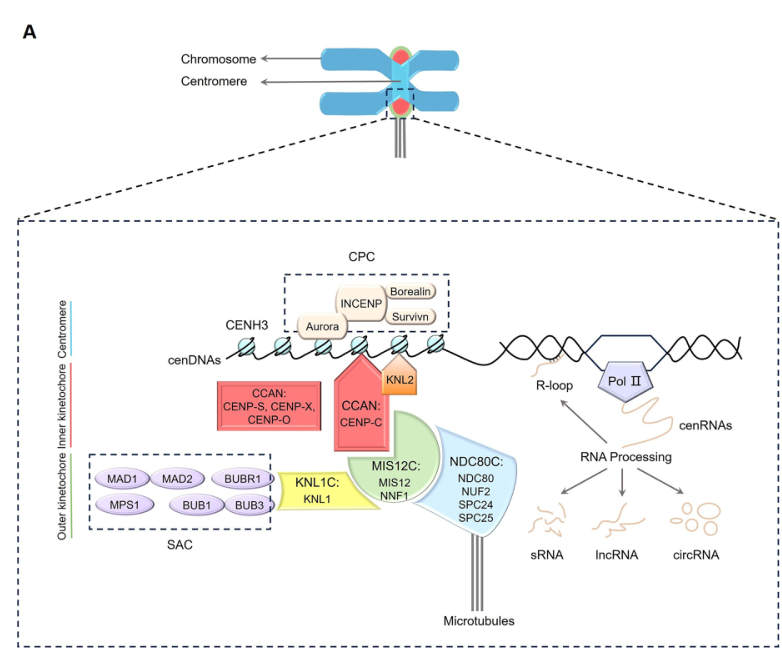

## Question

# Gene Research for Functional Annotation

## ⚠️ CRITICAL: Gene/Protein Identification Context

**BEFORE YOU BEGIN RESEARCH:** You MUST verify you are researching the CORRECT gene/protein. Gene symbols can be ambiguous, especially for less well-characterized genes from non-model organisms.

### Target Gene/Protein Identity (from UniProt):
- **UniProt Accession:** C5XPJ5
- **Protein Description:** SubName: Full=Uncharacterized protein {ECO:0000313|EMBL:EES00992.2};
- **Gene Information:** ORFNames=SORBI_3003G204000 {ECO:0000313|EMBL:EES00992.2};
- **Organism (full):** Sorghum bicolor (Sorghum) (Sorghum vulgare).
- **Protein Family:** Not specified in UniProt
- **Key Domains:** SPC24-like. (IPR044951)

### MANDATORY VERIFICATION STEPS:

1. **Check if the gene symbol "SORBI_3003G204000" matches the protein description above**
2. **Verify the organism is correct:** Sorghum bicolor (Sorghum) (Sorghum vulgare).
3. **Check if protein family/domains align with what you find in literature**
4. **If you find literature for a DIFFERENT gene with the same or similar symbol, STOP**

### If Gene Symbol is Ambiguous or You Cannot Find Relevant Literature:

**DO NOT PROCEED WITH RESEARCH ON A DIFFERENT GENE.** Instead:
- State clearly: "The gene symbol 'SORBI_3003G204000' is ambiguous or literature is limited for this specific protein"
- Explain what you found (e.g., "Found extensive literature on a different gene with the same symbol in a different organism")
- Describe the protein based ONLY on the UniProt information provided above
- Suggest that the protein function can be inferred from domain/family information

### Research Target:

Please provide a comprehensive research report on the gene **SORBI_3003G204000** (gene ID: C5XPJ5, UniProt: C5XPJ5) in SORBI.

The research report should be a detailed narrative explaining the function, biological processes, and localization of the gene product. Citations should be given for all claims.

You should prioritize authoritative reviews and primary scientific literature when conducting research. You can supplement
this with annotations you find in gene/protein databases, but these can be outdated or inaccurate.

We are specifically interested in the primary function of the gene - for enzymes, what reaction is catalyzed, and what is the substrate specificity? For transporters, what is the substrate? For structural proteins or adapters, what is the broader structural role? For signaling molecules, what is the role in the pathway.

We are interested in where in or outside the cell the gene product carries out its function.

We are also interested in the signaling or biochemical pathways in which the gene functions. We are less interested in broad pleiotropic effects, except where these elucidate the precise role.

Include evidence where possible. We are interested in both experimental evidence as well as inference from structure, evolution, or bioinformatic analysis. Precise studies should be prioritized over high-throughput, where available.

## Output

Question: You are an expert researcher providing comprehensive, well-cited information.

Provide detailed information focusing on:
1. Key concepts and definitions with current understanding
2. Recent developments and latest research (prioritize 2023-2024 sources)
3. Current applications and real-world implementations
4. Expert opinions and analysis from authoritative sources
5. Relevant statistics and data from recent studies

Format as a comprehensive research report with proper citations. Include URLs and publication dates where available.
Always prioritize recent, authoritative sources and provide specific citations for all major claims.

# Gene Research for Functional Annotation

## ⚠️ CRITICAL: Gene/Protein Identification Context

**BEFORE YOU BEGIN RESEARCH:** You MUST verify you are researching the CORRECT gene/protein. Gene symbols can be ambiguous, especially for less well-characterized genes from non-model organisms.

### Target Gene/Protein Identity (from UniProt):
- **UniProt Accession:** C5XPJ5
- **Protein Description:** SubName: Full=Uncharacterized protein {ECO:0000313|EMBL:EES00992.2};
- **Gene Information:** ORFNames=SORBI_3003G204000 {ECO:0000313|EMBL:EES00992.2};
- **Organism (full):** Sorghum bicolor (Sorghum) (Sorghum vulgare).
- **Protein Family:** Not specified in UniProt
- **Key Domains:** SPC24-like. (IPR044951)

### MANDATORY VERIFICATION STEPS:

1. **Check if the gene symbol "SORBI_3003G204000" matches the protein description above**
2. **Verify the organism is correct:** Sorghum bicolor (Sorghum) (Sorghum vulgare).
3. **Check if protein family/domains align with what you find in literature**
4. **If you find literature for a DIFFERENT gene with the same or similar symbol, STOP**

### If Gene Symbol is Ambiguous or You Cannot Find Relevant Literature:

**DO NOT PROCEED WITH RESEARCH ON A DIFFERENT GENE.** Instead:
- State clearly: "The gene symbol 'SORBI_3003G204000' is ambiguous or literature is limited for this specific protein"
- Explain what you found (e.g., "Found extensive literature on a different gene with the same symbol in a different organism")
- Describe the protein based ONLY on the UniProt information provided above
- Suggest that the protein function can be inferred from domain/family information

### Research Target:

Please provide a comprehensive research report on the gene **SORBI_3003G204000** (gene ID: C5XPJ5, UniProt: C5XPJ5) in SORBI.

The research report should be a detailed narrative explaining the function, biological processes, and localization of the gene product. Citations should be given for all claims.

You should prioritize authoritative reviews and primary scientific literature when conducting research. You can supplement
this with annotations you find in gene/protein databases, but these can be outdated or inaccurate.

We are specifically interested in the primary function of the gene - for enzymes, what reaction is catalyzed, and what is the substrate specificity? For transporters, what is the substrate? For structural proteins or adapters, what is the broader structural role? For signaling molecules, what is the role in the pathway.

We are interested in where in or outside the cell the gene product carries out its function.

We are also interested in the signaling or biochemical pathways in which the gene functions. We are less interested in broad pleiotropic effects, except where these elucidate the precise role.

Include evidence where possible. We are interested in both experimental evidence as well as inference from structure, evolution, or bioinformatic analysis. Precise studies should be prioritized over high-throughput, where available.

## Research report: Functional annotation of *Sorghum bicolor* SORBI_3003G204000 (UniProt C5XPJ5; SPC24-like domain)

### 0) Verification of the correct gene/protein (mandatory)
The research target in this report is strictly the *Sorghum bicolor* gene model **SORBI_3003G204000**, corresponding to **UniProt accession C5XPJ5**, described in UniProt as an **uncharacterized protein** with an **SPC24-like domain** (InterPro: **IPR044951**, per the user-provided UniProt context). No peer‑reviewed papers explicitly naming **C5XPJ5** or **SORBI_3003G204000** were retrievable in this run; therefore, functional statements about the sorghum protein are necessarily **domain/orthology-based inferences** from conserved SPC24 biology in plants and eukaryotes, and are labeled as such. (kozgunova2025recentadvancesin pages 3-5, shin2018mun(meristemunstructured) pages 19-22)

### 1) Key concepts and definitions (current understanding)

#### 1.1 Kinetochore and the outer kinetochore (KMN network)
The **kinetochore** is a large multi-protein assembly that forms on centromeric chromatin and mediates **chromosome segregation** by linking chromosomes to spindle **microtubules** during cell division. Plant kinetochore models, as in other eukaryotes, are commonly described as an inner kinetochore associated with centromeric chromatin and an outer kinetochore that engages microtubules and checkpoint machinery. (xie2024plantkinetochorecomplex pages 1-3)

A core outer-kinetochore organizational module is the **KMN network**, comprising **KNL1 complex, MIS12 complex, and NDC80 complex**, which collectively creates the principal microtubule-binding interface of the kinetochore. (xie2024plantkinetochorecomplex pages 1-3, xie2024plantkinetochorecomplex media 22acbc82)

#### 1.2 NDC80 complex and the role of SPC24
The **NDC80 complex** is a conserved heterotetramer composed of **NDC80 (Hec1), NUF2, SPC24, and SPC25**. In plants, as in other systems, **NDC80/NUF2** provide the microtubule-binding “head,” while **SPC24/SPC25** connect the complex to inner kinetochore receptors (via the MIS12 side of the KMN network), enabling force transmission from microtubules to chromosomes. (shin2018mun(meristemunstructured) pages 1-4, kozgunova2025recentadvancesin pages 3-5)

Structural/biophysical summaries of the complex describe a long coiled-coil “rod” linking the NDC80/NUF2 head to the SPC24/SPC25 C-terminal head, consistent with a predominantly **structural adaptor** function rather than enzymatic catalysis. (ustinov2020proteincomplexndc80 pages 2-5)

### 2) What is known about SORBI_3003G204000 / C5XPJ5 specifically
#### 2.1 Direct evidence limitations
No direct experimental evidence (e.g., mutant phenotype, localization microscopy, interaction proteomics) was found in the retrieved literature that explicitly references **SORBI_3003G204000** or **UniProt C5XPJ5**. Accordingly, **no sorghum-specific phenotype or pathway assignment** can be stated from primary literature in this run. (shin2018mun(meristemunstructured) pages 19-22)

#### 2.2 Best-supported functional inference from domain and conserved biology
Given the **SPC24-like domain** annotation and strong conservation of the NDC80 complex in plants, the most parsimonious functional assignment is that C5XPJ5 encodes a **putative SPC24 subunit of the NDC80 outer-kinetochore complex**. In this role, it would be expected to:

* **Molecular function (predicted):** contribute to **kinetochore assembly** and **link the NDC80 complex to inner kinetochore components** (via SPC24/SPC25 interface with MIS12/KMN), supporting robust kinetochore–microtubule coupling. (kozgunova2025recentadvancesin pages 3-5, ustinov2020proteincomplexndc80 pages 2-5)
* **Biological process (predicted):** support faithful **chromosome segregation** during mitosis (and likely meiosis), with expected downstream impacts on cell division and development if disrupted. (kozgunova2025recentadvancesin pages 3-5, xie2024plantkinetochorecomplex pages 1-3)
* **Subcellular localization (predicted):** **nuclear**, enriched at **centromere/kinetochore** foci in dividing cells. (kozgunova2025recentadvancesin pages 3-5, xie2024plantkinetochorecomplex media 22acbc82)

These inferences are consistent with experimentally validated roles for plant SPC24 homologs described below.

### 3) Evidence from plant orthologs and authoritative sources (expert-level functional interpretation)

Because SORBI_3003G204000 is uncharacterized in the retrieved literature, the strongest functional evidence comes from the experimentally characterized **Arabidopsis SPC24 homolog MUN (MERISTEM UNSTRUCTURED; AtSPC24)**.

#### 3.1 Complex membership and interaction partners
In Arabidopsis, **MUN/AtSPC24** is supported as an SPC24 ortholog and **NDC80 complex member**, with biochemical interaction evidence: SPC24 interacts with **SPC25**, and co-immunoprecipitation supports association of SPC24 with **NDC80, NUF2, and SPC25** (with SPC25 acting as an interaction “bridge” within the complex). (shin2018mun(meristemunstructured) pages 10-12)

**Inference for sorghum:** the closest functional prediction is that sorghum C5XPJ5 participates in analogous protein–protein interactions with sorghum orthologs of **SPC25, NDC80, and NUF2**, and likely interfaces with MIS12/KMN components through the SPC24/SPC25 end of the complex. (kozgunova2025recentadvancesin pages 3-5, ustinov2020proteincomplexndc80 pages 2-5)

#### 3.2 Subcellular localization
MUN/AtSPC24 shows **nuclear dot-like localization** consistent with **centromeres/kinetochores**, including co-localization with the centromeric histone **CENH3/HTR12** in Arabidopsis. (shin2018mun(meristemunstructured) pages 7-10, shin2018mun(meristemunstructured) pages 10-12)

**Inference for sorghum:** a conserved SPC24-like protein would be expected to localize to **kinetochores** during cell division. (kozgunova2025recentadvancesin pages 3-5, xie2024plantkinetochorecomplex media 22acbc82)

#### 3.3 Biological function and phenotypes (critical functional evidence)
Arabidopsis genetic evidence indicates SPC24 is essential for chromosome segregation and development:

* Hypomorphic disruption of MUN/AtSPC24 leads to **chromosome segregation defects** (e.g., lagging chromosomes/micronuclei), **aneuploidy**, reduced cell division, and stunted growth. (shin2018mun(meristemunstructured) pages 7-10)
* Null alleles exhibit **embryonic lethality/embryo arrest**, indicating an essential role in early development. (shin2018mun(meristemunstructured) pages 10-12)

**Inference for sorghum:** if SORBI_3003G204000 encodes an SPC24 subunit, strong loss-of-function would plausibly cause **severe mitotic defects** and potentially lethality or sterility phenotypes, consistent with essentiality observed for NDC80 subunits in plants. This remains a hypothesis until validated in sorghum. (kozgunova2025recentadvancesin pages 3-5)

### 4) Recent developments and latest research (prioritizing 2023–2024)

#### 4.1 Plant kinetochore composition and divergence (2023)
A 2023 kinetochore-focused review of plant meiosis reiterates that kinetochores are built from **>100 structural and regulatory proteins**, and highlights that only a subset of canonical eukaryotic kinetochore components have been experimentally characterized in plants to date. It also notes divergence of inner kinetochore composition: the vertebrate **CCAN** has **16 CENP proteins**, and **12/16 CCAN components** cannot be identified by homology in plants, emphasizing both conservation (outer kinetochore/KMN) and innovation (inner kinetochore) in plant lineages. (zhou2023exploringplantmeiosis pages 4-7)

For NDC80 specifically, the 2023 review explicitly defines the complex (Ndc80, Nuf2, Spc24, Spc25) and notes its role in microtubule binding and recruitment of checkpoint factors (e.g., MPS1), consistent with NDC80 being a key scaffold/signaling interface at the outer kinetochore. (zhou2023exploringplantmeiosis pages 4-7)

#### 4.2 Centromere/kinetochore biology as enabling technology (2024)
A highly cited 2024 review on plant centromeres situates NDC80 and SPC24 among known plant kinetochore proteins and emphasizes that kinetochore architecture (inner CCAN interacting with outer KMN) underpins microtubule attachment. The review also frames **applications**: centromere/kinetochore knowledge enables **haploid induction via centromere-mediated genome elimination** (a tool for crop improvement) and informs efforts toward **stably inherited synthetic/artificial chromosomes**. (naish2024thestructurefunction pages 1-2)

#### 4.3 Updated plant kinetochore “roadmap” (2024)
A 2024 review in *Frontiers in Plant Science* summarizes plant kinetochore composition, function, and regulation, reiterating the inner/outer kinetochore organization and the centrality of NDC80C (including SPC24) to outer-kinetochore microtubule attachment and kinetochore signaling. The paper also highlights that kinetochore proteins interact with centromeric DNA and RNA, reflecting expanding interest in centromere transcription and RNA-mediated regulation in kinetochore biology. (xie2024plantkinetochorecomplex pages 1-3)

### 5) Current applications and real-world implementations (plant/crop context)
Although SORBI_3003G204000 itself has no direct application literature in this run, **centromere/kinetochore biology** (the pathway in which SPC24-like proteins function) has active translational relevance:

* **Haploid induction for breeding:** centromere-mediated genome elimination is highlighted as a route to haploid induction, accelerating breeding pipelines by enabling rapid generation of homozygous lines after chromosome doubling. This is an application of centromere/kinetochore understanding broadly, not specifically SPC24. (naish2024thestructurefunction pages 1-2)
* **Plant artificial chromosomes (PACs)/synthetic genomics:** plant kinetochore and centromere knowledge is relevant to designing synthetic chromosomes that segregate stably. Outer kinetochore components (KMN/NDC80) are core to stable microtubule attachment, again providing conceptual relevance to SPC24-like proteins as enabling factors for chromosome inheritance technologies. (xie2024plantkinetochorecomplex pages 1-3, naish2024thestructurefunction pages 1-2)

### 6) Expert opinion and analysis (authoritative synthesis)
Multiple authoritative reviews converge on a core conclusion: **outer kinetochore architecture is conserved**, with NDC80C functioning as the primary microtubule-attachment module, whereas inner kinetochore composition in plants shows lineage-specific divergence. (xie2024plantkinetochorecomplex pages 1-3, naish2024thestructurefunction pages 1-2, zhou2023exploringplantmeiosis pages 4-7)

Within this conserved module, SPC24’s role is best understood as a **non-enzymatic structural adaptor**: it contributes to assembly of the NDC80 complex and couples the microtubule-binding head (NDC80/NUF2) to inner kinetochore receptors via the SPC24/SPC25 end, thereby enabling force transmission and proper chromosome movement. This mechanistic framing is consistent across structural/biochemical summaries of NDC80 and plant-specific SPC24 genetics. (kozgunova2025recentadvancesin pages 3-5, ustinov2020proteincomplexndc80 pages 2-5)

### 7) Relevant statistics and data (recent sources)
* Kinetochore assemblies are described as comprising **>100 structural and regulatory proteins** (a scale estimate used in plant meiosis/kinetochore reviews). (zhou2023exploringplantmeiosis pages 4-7)
* Vertebrate CCAN has **16 CENP proteins**, with **12/16** not identifiable by homology in plants, highlighting plant divergence primarily in the inner kinetochore. (zhou2023exploringplantmeiosis pages 4-7)
* Model systems (human/yeast) have been described as having ~**30 core kinetochore subunits** (a reference point used in plant-centromere review discussions of conserved core architecture). (naish2024thestructurefunction pages 1-2)

These quantitative statements inform expectations about conservation and the likely essentiality of core outer-kinetochore components like SPC24.

### 8) Schematic evidence (figure)
A schematic of the plant kinetochore places **NDC80C (NDC80/NUF2/SPC24/SPC25)** in the **outer kinetochore**, connected to **MIS12C** and the spindle microtubule interface—supporting the predicted cellular role/location for an SPC24-like sorghum protein. (xie2024plantkinetochorecomplex media 22acbc82)

### 9) Practical functional annotation summary (SORBI_3003G204000 / C5XPJ5)

| Evidence tier | Identity | Domain architecture | Predicted complex membership | Molecular function | Biological process | Subcellular localization | Key interaction partners | Phenotypes from plant orthologs | Strength/Type of evidence |
|---|---|---|---|---|---|---|---|---|---|
| Direct for Sorghum gene | UniProt C5XPJ5 = uncharacterized protein; ORF/gene name SORBI_3003G204000; organism *Sorghum bicolor*; no sorghum-specific functional paper retrieved (shin2018mun(meristemunstructured) pages 19-22) | SPC24-like domain reported for target; sorghum SPC24-like homolog presence in grasses supported indirectly by plant SPC24 homolog listings (shin2018mun(meristemunstructured) pages 19-22) | Putative NDC80/KMN outer-kinetochore component, but not experimentally shown in sorghum (kozgunova2025recentadvancesin pages 3-5, xie2024plantkinetochorecomplex pages 1-3) | Structural/adaptor role rather than enzyme; likely contributes to kinetochore assembly/linkage, not catalysis (kozgunova2025recentadvancesin pages 3-5, ustinov2020proteincomplexndc80 pages 2-5) | Likely chromosome segregation during cell division; sorghum-specific proof unavailable (kozgunova2025recentadvancesin pages 3-5, xie2024plantkinetochorecomplex pages 1-3) | Expected centromere/kinetochore in dividing nuclei; not directly shown in sorghum (kozgunova2025recentadvancesin pages 3-5, xie2024plantkinetochorecomplex pages 1-3) | Expected SPC25, NDC80, NUF2, MIS12-complex proteins; no sorghum interaction data found (shin2018mun(meristemunstructured) pages 10-12, kozgunova2025recentadvancesin pages 3-5) | None directly reported for SORBI_3003G204000 | Low-direct evidence; database/domain-based assignment only |
| Inference from plant SPC24 orthologs (Arabidopsis MUN/AtSPC24) | Arabidopsis MUN/AT3G08880 is an SPC24 homolog and NDC80-complex subunit (shin2018mun(meristemunstructured) pages 1-4, shin2018mun(meristemunstructured) pages 7-10) | Coiled-coil region plus C-terminal globular RWD domain; predicted 3D homology to known Spc24 proteins (shin2018mun(meristemunstructured) pages 7-10) | Canonical NDC80 tetramer with NDC80, NUF2, SPC24, SPC25 (shin2018mun(meristemunstructured) pages 1-4, shin2018mun(meristemunstructured) pages 10-12) | Kinetochore structural linker: SPC24-SPC25 connects to inner kinetochore/MIS12 side of NDC80 complex (shin2018mun(meristemunstructured) pages 1-4, kozgunova2025recentadvancesin pages 3-5) | Essential for mitotic chromosome segregation, cell division, embryo development, meristem growth (shin2018mun(meristemunstructured) pages 1-4, shin2018mun(meristemunstructured) pages 7-10, shin2018mun(meristemunstructured) pages 10-12) | Nuclear centromeric/kinetochore dots; co-localizes with CENH3/HTR12 (shin2018mun(meristemunstructured) pages 7-10, shin2018mun(meristemunstructured) pages 10-12) | Interacts with SPC25; co-IPs with NDC80, NUF2, SPC25 (shin2018mun(meristemunstructured) pages 10-12) | Hypomorphic mutants: stunted growth, low cell division, aneuploidy, lagging chromosomes, micronuclei; nulls: embryo arrest/zygotic lethality (shin2018mun(meristemunstructured) pages 1-4, shin2018mun(meristemunstructured) pages 7-10, shin2018mun(meristemunstructured) pages 10-12) | Moderate-strong evidence from plant ortholog experiments |
| General NDC80 complex knowledge | SPC24 is one of four conserved NDC80-complex subunits in eukaryotes (kozgunova2025recentadvancesin pages 3-5, ustinov2020proteincomplexndc80 pages 2-5) | NDC80 complex has long coiled-coil rod; Hec1/Ndc80-Nuf2 microtubule-binding head and Spc24-Spc25 C-terminal head (ustinov2020proteincomplexndc80 pages 2-5) | Outer kinetochore KMN network member, linked with MIS12C and KNL1C (kozgunova2025recentadvancesin pages 3-5, xie2024plantkinetochorecomplex pages 1-3, xie2024plantkinetochorecomplex media 22acbc82) | Non-enzymatic structural role: links kinetochore to spindle microtubules and transmits force for chromosome movement (kozgunova2025recentadvancesin pages 3-5, ustinov2020proteincomplexndc80 pages 2-5) | Kinetochore-microtubule attachment, chromosome congression/segregation, checkpoint-associated outer-kinetochore function (ustinov2020proteincomplexndc80 pages 2-5, xie2024plantkinetochorecomplex pages 1-3) | Outer kinetochore at centromeres on dividing chromosomes (kozgunova2025recentadvancesin pages 3-5, xie2024plantkinetochorecomplex pages 1-3, xie2024plantkinetochorecomplex media 22acbc82) | Spc24-Spc25 associates with MIS12-side kinetochore proteins; complex includes NDC80 and NUF2 (kozgunova2025recentadvancesin pages 3-5, ustinov2020proteincomplexndc80 pages 2-5) | Loss of NDC80-complex integrity generally causes segregation defects and lethality in plants/other eukaryotes (shin2018mun(meristemunstructured) pages 1-4, ustinov2020proteincomplexndc80 pages 2-5) | Strong comparative/structural evidence; not gene-specific |

*Table: This table summarizes the evidence tiers for annotating Sorghum bicolor SORBI_3003G204000/UniProt C5XPJ5, separating direct sorghum evidence from ortholog-based inference and broader NDC80 complex knowledge. It is useful for distinguishing what is experimentally supported versus what is predicted from conserved SPC24 biology.*

**Most likely primary function (high-confidence inference):** structural component of the **outer kinetochore NDC80 complex**, required for robust kinetochore–microtubule attachment and faithful chromosome segregation. (kozgunova2025recentadvancesin pages 3-5, ustinov2020proteincomplexndc80 pages 2-5)

**Likely cellular compartment:** nucleus, at centromere/kinetochore foci in dividing cells. (shin2018mun(meristemunstructured) pages 7-10, xie2024plantkinetochorecomplex media 22acbc82)

**Key predicted partners:** SPC25 (direct), NDC80, NUF2, and MIS12-side KMN proteins (indirect via NDC80C-KMN architecture). (shin2018mun(meristemunstructured) pages 10-12, kozgunova2025recentadvancesin pages 3-5)

### 10) Gaps and next experimental steps (for sorghum-specific confirmation)
Given the absence of direct sorghum literature for C5XPJ5 in this run, the most informative next steps would be: (i) subcellular localization (e.g., C5XPJ5-GFP in dividing tissues), (ii) interaction mapping (co-IP/AP-MS to test NDC80C membership), and (iii) genetic perturbation (CRISPR knockout or hypomorphs) to test for chromosome segregation defects/aneuploidy and developmental phenotypes analogous to Arabidopsis MUN. These steps are motivated by the strong ortholog evidence base and the essential phenotypes of SPC24 disruption in plants. (shin2018mun(meristemunstructured) pages 7-10, shin2018mun(meristemunstructured) pages 10-12, kozgunova2025recentadvancesin pages 3-5)

### Key sources (with URLs and publication dates)
* Xie Y, Wang M, Mo B, Liang C. **Plant kinetochore complex: composition, function, and regulation.** *Frontiers in Plant Science* (Oct 2024). https://doi.org/10.3389/fpls.2024.1467236 (xie2024plantkinetochorecomplex pages 1-3, xie2024plantkinetochorecomplex media 22acbc82)
* Naish M, Henderson IR. **The structure, function, and evolution of plant centromeres.** *Genome Research* (Feb 2024). https://doi.org/10.1101/gr.278409.123 (naish2024thestructurefunction pages 1-2)
* Zhou K-D et al. **Exploring Plant Meiosis: Insights from the Kinetochore Perspective.** *Current Issues in Molecular Biology* (Sep 2023). https://doi.org/10.3390/cimb45100504 (zhou2023exploringplantmeiosis pages 4-7, zhou2023exploringplantmeiosis pages 7-8)
* Shin J et al. **MUN (MERISTEM UNSTRUCTURED), encoding a SPC24 homolog…** *The Plant Journal* (Mar 2018). https://doi.org/10.1111/tpj.13823 (shin2018mun(meristemunstructured) pages 1-4, shin2018mun(meristemunstructured) pages 7-10, shin2018mun(meristemunstructured) pages 10-12)
* Ustinov NB et al. **Protein Complex NDC80: Properties, Functions…** *Biochemistry (Moscow)* (Apr 2020). https://doi.org/10.1134/s0006297920040057 (ustinov2020proteincomplexndc80 pages 2-5)

References

1. (kozgunova2025recentadvancesin pages 3-5): Elena Kozgunova. Recent advances in plant kinetochore research. Frontiers in Cell and Developmental Biology, Jan 2025. URL: https://doi.org/10.3389/fcell.2024.1510019, doi:10.3389/fcell.2024.1510019. This article has 3 citations.

2. (shin2018mun(meristemunstructured) pages 19-22): Jinwoo Shin, Goowon Jeong, Jong‐Yoon Park, Hoyeun Kim, and Ilha Lee. Mun (meristem unstructured), encoding a spc24 homolog of ndc80 kinetochore complex, affects development through cell division in arabidopsis thaliana. The Plant Journal, 93:977–991, Mar 2018. URL: https://doi.org/10.1111/tpj.13823, doi:10.1111/tpj.13823. This article has 31 citations.

3. (xie2024plantkinetochorecomplex pages 1-3): Yuqian Xie, Mingliang Wang, Beixin Mo, and Chao Liang. Plant kinetochore complex: composition, function, and regulation. Frontiers in Plant Science, Oct 2024. URL: https://doi.org/10.3389/fpls.2024.1467236, doi:10.3389/fpls.2024.1467236. This article has 3 citations.

4. (xie2024plantkinetochorecomplex media 22acbc82): Yuqian Xie, Mingliang Wang, Beixin Mo, and Chao Liang. Plant kinetochore complex: composition, function, and regulation. Frontiers in Plant Science, Oct 2024. URL: https://doi.org/10.3389/fpls.2024.1467236, doi:10.3389/fpls.2024.1467236. This article has 3 citations.

5. (shin2018mun(meristemunstructured) pages 1-4): Jinwoo Shin, Goowon Jeong, Jong‐Yoon Park, Hoyeun Kim, and Ilha Lee. Mun (meristem unstructured), encoding a spc24 homolog of ndc80 kinetochore complex, affects development through cell division in arabidopsis thaliana. The Plant Journal, 93:977–991, Mar 2018. URL: https://doi.org/10.1111/tpj.13823, doi:10.1111/tpj.13823. This article has 31 citations.

6. (ustinov2020proteincomplexndc80 pages 2-5): N. B. Ustinov, A. V. Korshunova, and N. B. Gudimchuk. Protein complex ndc80: properties, functions, and possible role in pathophysiology of cell division. Biochemistry (Moscow), 85:448-462, Apr 2020. URL: https://doi.org/10.1134/s0006297920040057, doi:10.1134/s0006297920040057. This article has 27 citations.

7. (shin2018mun(meristemunstructured) pages 10-12): Jinwoo Shin, Goowon Jeong, Jong‐Yoon Park, Hoyeun Kim, and Ilha Lee. Mun (meristem unstructured), encoding a spc24 homolog of ndc80 kinetochore complex, affects development through cell division in arabidopsis thaliana. The Plant Journal, 93:977–991, Mar 2018. URL: https://doi.org/10.1111/tpj.13823, doi:10.1111/tpj.13823. This article has 31 citations.

8. (shin2018mun(meristemunstructured) pages 7-10): Jinwoo Shin, Goowon Jeong, Jong‐Yoon Park, Hoyeun Kim, and Ilha Lee. Mun (meristem unstructured), encoding a spc24 homolog of ndc80 kinetochore complex, affects development through cell division in arabidopsis thaliana. The Plant Journal, 93:977–991, Mar 2018. URL: https://doi.org/10.1111/tpj.13823, doi:10.1111/tpj.13823. This article has 31 citations.

9. (zhou2023exploringplantmeiosis pages 4-7): Kang-Di Zhou, Cai-Xia Zhang, Fu-Rong Niu, Hao-Chen Bai, Dan-Dan Wu, Jia-Cheng Deng, Hong-Yuan Qian, Yun-Lei Jiang, and Wei Ma. Exploring plant meiosis: insights from the kinetochore perspective. Current Issues in Molecular Biology, 45:7974-7995, Sep 2023. URL: https://doi.org/10.3390/cimb45100504, doi:10.3390/cimb45100504. This article has 4 citations.

10. (naish2024thestructurefunction pages 1-2): Matthew Naish and Ian R. Henderson. The structure, function, and evolution of plant centromeres. Genome Research, 34:161-178, Feb 2024. URL: https://doi.org/10.1101/gr.278409.123, doi:10.1101/gr.278409.123. This article has 90 citations and is from a highest quality peer-reviewed journal.

11. (zhou2023exploringplantmeiosis pages 7-8): Kang-Di Zhou, Cai-Xia Zhang, Fu-Rong Niu, Hao-Chen Bai, Dan-Dan Wu, Jia-Cheng Deng, Hong-Yuan Qian, Yun-Lei Jiang, and Wei Ma. Exploring plant meiosis: insights from the kinetochore perspective. Current Issues in Molecular Biology, 45:7974-7995, Sep 2023. URL: https://doi.org/10.3390/cimb45100504, doi:10.3390/cimb45100504. This article has 4 citations.

## Artifacts

- [Edison artifact artifact-00](SORBI_3003G204000-deep-research-falcon_artifacts/artifact-00.md)

## Citations

1. xie2024plantkinetochorecomplex pages 1-3
2. kozgunova2025recentadvancesin pages 3-5
3. zhou2023exploringplantmeiosis pages 4-7
4. naish2024thestructurefunction pages 1-2
5. zhou2023exploringplantmeiosis pages 7-8
6. https://doi.org/10.3389/fpls.2024.1467236
7. https://doi.org/10.1101/gr.278409.123
8. https://doi.org/10.3390/cimb45100504
9. https://doi.org/10.1111/tpj.13823
10. https://doi.org/10.1134/s0006297920040057
11. https://doi.org/10.3389/fcell.2024.1510019,
12. https://doi.org/10.1111/tpj.13823,
13. https://doi.org/10.3389/fpls.2024.1467236,
14. https://doi.org/10.1134/s0006297920040057,
15. https://doi.org/10.3390/cimb45100504,
16. https://doi.org/10.1101/gr.278409.123,