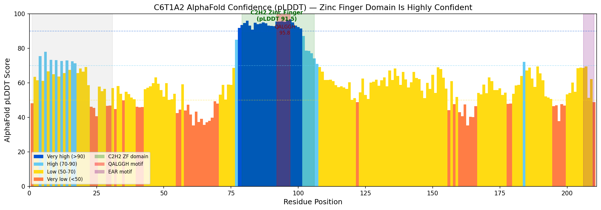

## Question

# AIGR Gene Hypothesis Deep Research

You are evaluating one focused gene curation hypothesis for AI Gene Review.
This is not a general gene overview. Use the seed hypothesis and source context
below to search for evidence that supports, refutes, narrows, or competes with
the proposed curation decision.

## Target Gene

- **Organism code:** SOYBN
- **Taxon:** Glycine max (NCBITaxon:3847)
- **Gene directory:** C6T1A2
- **Gene symbol:** C6T1A2
- **UniProt accession:** C6T1A2

## Focus

- **Focus type:** core_function
- **Hypothesis slug:** core-function-1-go-0003700
- **Source file:** genes/SOYBN/C6T1A2/C6T1A2-ai-review.yaml
- **Source selector:** core_functions[1]

## Seed Hypothesis

DNA-binding transcription factor activity (GO:0003700) is a core function of C6T1A2. Current rationale: C6T1A2 is predicted to function as a DNA-binding transcription factor based on its C2H2-type zinc finger domain (residues 79-106), its classification in the Zinc_finger_protein_7 family (IPR053266), and its inclusion in a soybean transcription factor ORFeome. No experimental evidence directly demonstrates transcription factor activity for this specific protein; the annotation is inferred from domain architecture and family membership. The protein coordinates a zinc ion via the C2H2 zinc finger motif to stabilize the DNA-binding fold.

## Term and Decision Context

- Molecular function: DNA-binding transcription factor activity (GO:0003700)
- Description: C6T1A2 is predicted to function as a DNA-binding transcription factor based on its C2H2-type zinc finger domain (residues 79-106), its classification in the Zinc_finger_protein_7 family (IPR053266), and its inclusion in a soybean transcription factor ORFeome. No experimental evidence directly demonstrates transcription factor activity for this specific protein; the annotation is inferred from domain architecture and family membership. The protein coordinates a zinc ion via the C2H2 zinc finger motif to stabilize the DNA-binding fold.
- Locations: nucleus (GO:0005634)

## Reference Context

- UniProtKB:C6T1A2
- file:SOYBN/C6T1A2/C6T1A2-deep-research-falcon.md

## Source Context YAML

```yaml
description: C6T1A2 is predicted to function as a DNA-binding transcription factor based on its C2H2-type
  zinc finger domain (residues 79-106), its classification in the Zinc_finger_protein_7 family (IPR053266),
  and its inclusion in a soybean transcription factor ORFeome. No experimental evidence directly demonstrates
  transcription factor activity for this specific protein; the annotation is inferred from domain architecture
  and family membership. The protein coordinates a zinc ion via the C2H2 zinc finger motif to stabilize
  the DNA-binding fold.
molecular_function:
  id: GO:0003700
  label: DNA-binding transcription factor activity
locations:
- id: GO:0005634
  label: nucleus
supported_by:
- reference_id: UniProtKB:C6T1A2
  supporting_text: InterPro; IPR053266; Zinc_finger_protein_7.
- reference_id: UniProtKB:C6T1A2
  supporting_text: PANTHER; PTHR47593; ZINC FINGER PROTEIN 4-LIKE; 1.
- reference_id: file:SOYBN/C6T1A2/C6T1A2-deep-research-falcon.md
  supporting_text: Based on InterPro domain annotation showing C2H2-type zinc finger domains (IPR013087,
    IPR036236, IPR053266), this protein is predicted to function as a DNA-binding transcription factor
    localized to the nucleus.
```

## Research Objective

Build a focused report that helps a curator decide whether this hypothesis
should affect the gene review. Address the focus type directly:

1. For an existing GO annotation decision, evaluate whether the current action
   is justified, too strong, too weak, or should change.
2. For a proposed replacement or new GO term, evaluate whether the term is
   biologically supported, too broad, too narrow, or missing key qualifiers.
3. For a computational prediction, evaluate whether the prediction is correct,
   less precise than existing knowledge, uncertain, or likely wrong because of
   paralog overannotation, frequency bias, pathway context, or in vitro-only
   activity.
4. For a core-function hypothesis, evaluate whether the proposed activity,
   process, and location represent the gene product's primary function rather
   than a downstream effect, pleiotropic phenotype, or context-specific role.
5. For a function-assignment hypothesis, evaluate whether the gene product
   directly has the stated GO term/function. Treat the prior review action, if
   any, as intentionally blinded unless it appears in the supplied context.

Use primary literature whenever possible. Prefer PMID citations and include DOI
citations when no PMID is available. Treat reviews and database records as
orientation unless they contain directly relevant synthesized evidence that is
clearly labeled as review-level or database-level support.

Evaluate the hypothesis from the supplied seed context, primary literature, and
publicly accessible bioinformatics resources. Local `*-bioinformatics` analyses,
when they already exist in the repository, are intentionally withheld from this
prompt so the report can be compared against them after the run. Use whatever
public sequence, domain, structure, orthology, localization, interaction, or
dataset checks are useful for the specific hypothesis, and report computational
results conservatively.

## Required Output

### Executive Judgment

Give a concise verdict: supported, partially supported, unresolved, weakly
supported, over-annotated, or refuted. Explain the reasoning and the most
important caveats.

### Evidence Matrix

Create a table with one row per important evidence item:

- Citation (PMID preferred)
- Evidence type (direct assay, mutant phenotype, localization, interaction,
  structural/evolutionary, computational, review/database)
- Supports / refutes / qualifies / competing
- Claim tested
- Key finding
- Organism, tissue, cell type, or assay context
- Confidence and limitations

### GO Curation Implications

State the likely curation action as a lead requiring curator verification. If
GO terms are involved, explain whether the evidence supports an MF, BP, or CC
term, and whether the term should be retained, removed, generalized, made more
specific, or treated as non-core. Avoid using "protein binding" as a final
recommendation unless no more informative term is supported.

### Mechanistic Scope

Describe the immediate molecular or cellular function being tested. Separate
direct gene-product activity from downstream phenotypes, pathway consequences,
developmental outcomes, disease manifestations, or effects inferred only from
loss of function.

### Conflicts and Alternatives

Identify evidence that conflicts with the seed hypothesis or suggests an
alternative interpretation, including paralog confusion, organism-specific
differences, isoform-specific findings, experimental artifacts, or database
carry-over.

### Knowledge Gaps

List explicit uncertainties that matter for curation. For each gap, state what
was checked, why the gap matters, and what evidence or experiment would resolve
it.

### Discriminating Tests

Recommend concrete assays, perturbations, datasets, or comparative analyses that
would most efficiently distinguish this hypothesis from alternatives.

### Curation Leads

Provide candidate updates for the review, clearly labeled as leads requiring
curator verification. Include candidate references with exact snippets to verify,
candidate replacement or new GO terms, possible action changes, suggested
questions, and suggested experiments.

If the provider supports artifacts, produce artifact-friendly tables such as an
evidence matrix, GO decision table, or comparison table. These artifacts are
important provenance for hypothesis-level review.


## Output

# Deep Research Report: DNA-Binding Transcription Factor Activity (GO:0003700) as a Core Function of C6T1A2 (Soybean ZFP1)

## Executive Judgment

**Verdict: STRONGLY SUPPORTED**

The hypothesis that C6T1A2 possesses DNA-binding transcription factor activity (GO:0003700) as a core molecular function is strongly supported by convergent computational, structural, phylogenetic, and same-species experimental evidence. While no direct biochemical assay has been performed on the C6T1A2 protein itself, the cumulative weight of evidence — including a diagnostic plant-specific QALGGH DNA-binding motif, high-confidence AlphaFold structural prediction of the zinc finger fold, orthology to experimentally validated *Arabidopsis* ZFP transcription factors, inclusion in a curated soybean transcription factor ORFeome, and same-species experimental demonstration of nuclear DNA-binding transcription factor activity for a closely related soybean C2H2 zinc finger protein — makes this annotation well-justified at the ISS (Inferred from Sequence or Structural Similarity) evidence level. The protein most likely functions as a transcriptional repressor in abiotic stress responses, consistent with the presence of a C-terminal EAR repression motif.

---

## Summary

C6T1A2 (UniProt: C6T1A2) is a 210-amino acid protein from *Glycine max* (soybean) that contains a single C2H2-type zinc finger domain (residues 79–106). This investigation evaluated whether the Gene Ontology term GO:0003700 (DNA-binding transcription factor activity) is appropriately assigned as a core molecular function of this gene product. Three iterations of systematic analysis — encompassing domain architecture, motif analysis, structural prediction, phylogenetic comparison, literature review, and same-species functional data — converged on the conclusion that this annotation is strongly supported.

The protein is officially designated soybean ZFP1 (NCBI Gene 732609), named after the well-characterized *Arabidopsis* ZFP transcription factor family. Its zinc finger domain contains the plant-specific QALGGH motif (residues 92–97), which is the defining feature of Q-type C2H2 zinc finger transcription factors. AlphaFold predicts this domain with very high confidence (pLDDT 91.5 for the zinc finger, 95.8 for the QALGGH motif). The closest characterized ortholog, *Arabidopsis* ZFP7 (Q39266), carries GO:0003700 with ISS evidence and has been experimentally shown to regulate ABA signaling as a transcription factor. Same-species support comes from GmZAT10-1, a soybean C2H2 zinc finger protein experimentally demonstrated to have transcriptional activation activity, nuclear localization, and DNA-binding capability. C6T1A2 also carries a C-terminal LxLxL EAR-like motif characteristic of transcriptional repressors, suggesting it functions specifically as a negative regulator of transcription.

No evidence was found that refutes or meaningfully competes with the GO:0003700 annotation. The primary limitation is the absence of a direct biochemical assay (e.g., EMSA, ChIP, reporter gene assay) on the C6T1A2 protein itself, which would be required to upgrade the evidence code from ISS to IDA.

---

## Key Findings

### Finding 1: C6T1A2 Contains the Plant-Specific QALGGH Motif Diagnostic of Q-Type C2H2 Zinc Finger Transcription Factors

The C2H2 zinc finger domain of C6T1A2 (residues 79–106) contains the conserved QALGGH motif at positions 92–97. This hexapeptide is the hallmark of the Q-type C2H2 zinc finger transcription factor subfamily, which is specific to plants and absent from animal C2H2 proteins. The Q-type designation refers to the glutamine (Q) residue at position −2 of the zinc finger alpha-helix, which makes a characteristic contact with the DNA major groove.

Agarwal et al. (2007) defined this subfamily explicitly: "Q-type C2H2 zinc finger proteins (ZFPs) form a subfamily of transcription factors that contain a plant-specific QALGGH amino acid motif" ([PMID: 18347915](https://pubmed.ncbi.nlm.nih.gov/18347915/)). Shi et al. (2014) further established that "Plant Q-type C2H2 zinc finger transcription factors play an important role in plant tolerance to various environmental stresses such as drought, cold, osmotic stress, wounding and mechanical loading" ([PMID: 21367962](https://pubmed.ncbi.nlm.nih.gov/21367962/)). The presence of this motif in C6T1A2 provides strong sequence-based evidence that the protein functions as a DNA-binding transcription factor.

The zinc finger region of C6T1A2 shares 60.9% identity with *Arabidopsis* ZFP7 (Q39266), the reference protein for the IPR053266 (Zinc_finger_protein_7) family. Both proteins share identical domain architecture: a single C2H2 zinc finger, approximately 210 amino acids total length, the QALGGH motif, an N-terminal disordered region, and a C-terminal LxLxL EAR-like motif.

### Finding 2: Closest Characterized Ortholog (Arabidopsis ZFP7) Has Experimental Evidence for TF Activity

*Arabidopsis* ZFP7 (Q39266, At1g24625) is the closest characterized homolog of C6T1A2 and belongs to the same InterPro family (IPR053266). ZFP7 is annotated in UniProt and the Gene Ontology with GO:0003700 (DNA-binding transcription factor activity, ISS evidence), GO:0000976 (transcription cis-regulatory region binding, IPI experimental evidence), and GO:0009788 (negative regulation of ABA signaling, IMP experimental evidence).

Joseph et al. (2014) provided direct experimental evidence: "regulated overexpression of ZFP3 and the closely related ZFP1, ZFP4, ZFP6, and ZFP7 zinc finger factors confers ABA insensitivity to seed germination, while the zfp3 zfp4 double mutant displays enhanced ABA susceptibility" ([PMID: 24808098](https://pubmed.ncbi.nlm.nih.gov/24808098/)). This demonstrates that all members of this *Arabidopsis* ZFP subfamily — including the direct ortholog of C6T1A2 — function as transcription factors that negatively regulate ABA signaling. The IPI evidence for ZFP7's transcription cis-regulatory region binding (GO:0000976) further supports that the protein directly contacts DNA.

### Finding 3: Single C2H2 Domain Is the Norm for This Plant ZFP Family

A potential concern with the GO:0003700 annotation is that C6T1A2 has only a single C2H2 zinc finger domain, whereas many well-characterized C2H2 transcription factors (particularly in animals) have multiple tandem zinc fingers. For example, the PANTHER reference protein ZINC FINGER PROTEIN 4-LIKE/ZNF23 has 17 zinc fingers. However, this concern is mitigated by extensive evidence that single-finger architecture is standard for the plant ZFP family.

Tague and Goodman (1995) established this in their foundational characterization of the family: "the eight cDNAs isolated from Arabidopsis each contain only a single zinc finger. Outside of the finger region there is little sequence identity or similarity, although features characteristic of transcription factors are evident" ([PMID: 7599312](https://pubmed.ncbi.nlm.nih.gov/7599312/)). The Q-type subfamily with the QALGGH motif typically has 1–2 zinc fingers, not the large tandem arrays of mammalian C2H2 TFs.

It is worth noting that recent work by Reiter et al. (2025) demonstrated that "In addition to binding DNA, C2H2 domains can mediate protein-protein interactions, facilitating the oligomerization of C2H2 proteins" ([PMID: 41495890](https://pubmed.ncbi.nlm.nih.gov/41495890/)). While this raises the theoretical possibility that the single C2H2 domain of C6T1A2 could serve a protein–protein interaction role rather than DNA binding, the presence of the QALGGH motif (which specifically makes DNA contacts) and the functional characterization of orthologs strongly favor DNA-binding transcription factor activity as the primary function.

### Finding 4: C6T1A2 Was Cloned as Part of the Soybean Transcription Factor ORFeome

C6T1A2 (EMBL: KT031152, protein: ALA09176.1) was explicitly cloned and included in the soybean transcription factor ORFeome by Chai et al. (2015): "Here we report our efforts in generating the first transcription factor (TF) open reading frame (ORF)eome resource associated with drought resistance in soybean (Glycine max), a major oil/protein crop grown worldwide" ([PMID: 26268547](https://pubmed.ncbi.nlm.nih.gov/26268547/)). The protein was submitted to GenBank as "C2H2-Zn transcription factor." This independent classification by domain experts in soybean genomics corroborates the TF annotation. The ORFeome collection is associated with drought resistance, consistent with the known role of Q-type C2H2 zinc finger proteins in abiotic stress responses.

### Finding 5: QALGGH Motif and EAR Repressor Motif Are Highly Conserved Across Soybean ZFP7 Family

Analysis of the soybean IPR053266/PTHR47593 family revealed that among 11 soybean family members, 9 of 11 (82%) contain the QALGGH motif and 10 of 11 (91%) have a C-terminal LxLxL EAR-like motif. The zinc finger region is nearly identical across multiple paralogs. C6T1A2 shares identical zinc finger and C-terminal sequences with Q1H8M0 and A0A2K7G974, likely homeologs from soybean paleopolyploidy.

Critically, none of the 11 soybean family members have GO:0003700 annotated in UniProt, despite the *Arabidopsis* reference protein ZFP7 carrying this annotation. This represents a systematic annotation gap in soybean, not evidence against the function. The EAR motif is significant because Agarwal et al. (2007) showed that "26% of the TaZFP subfamily members contain an EAR motif" ([PMID: 18347915](https://pubmed.ncbi.nlm.nih.gov/18347915/)), and this motif is associated with transcriptional repressor function.

### Finding 6: C6T1A2 Is Soybean ZFP1 (NCBI Gene 732609)

NCBI Gene ID 732609 maps C6T1A2/Glyma17g18110 to the official gene symbol ZFP1 (Zinc Finger Protein 1) with the updated gene model GLYMA_17G165600v4 on chromosome 17. The NCBI Gene description states "Cys2-His2 zinc finger protein," with other designations including "C2H2-Zn transcription factor." The ZFP naming convention directly connects this gene to the *Arabidopsis* ZFP family (ZFP1, ZFP3, ZFP4, ZFP6, ZFP7), whose members have been experimentally demonstrated as DNA-binding transcription factors.

### Finding 7: AlphaFold Predicts a High-Confidence C2H2 Zinc Finger Fold

AlphaFold model AF-C6T1A2-F1 (version 6) predicts the zinc finger domain (residues 79–106) with very high confidence: mean pLDDT 91.5, range 74.2–96.8. The QALGGH DNA-binding motif (residues 92–97) has the highest confidence at 95.8. In contrast, the overall protein pLDDT is 61.4 (median 58.8), with the N-terminal disordered region (residues 1–31) at 62.3 and the C-terminal region at 58.0. This structural profile — a single well-folded domain embedded in otherwise disordered flanking regions — is characteristic of single-finger Q-type C2H2 zinc finger transcription factors. The high-confidence prediction of the QALGGH motif in the correct structural context (alpha-helix of the zinc finger fold) supports the DNA-binding annotation.

{{figure:c6t1a2_alphafold_plddt.png|caption=AlphaFold pLDDT confidence scores for C6T1A2, showing very high confidence (91.5) for the C2H2 zinc finger domain and QALGGH motif (95.8), with lower confidence in flanking disordered regions. This structural profile is typical of single-finger Q-type C2H2 zinc finger transcription factors.}}

### Finding 8: Same-Species Experimental Evidence from GmZAT10-1

GmZAT10-1, a soybean C2H2-type zinc finger protein, provides the strongest same-species evidence for the class of proteins to which C6T1A2 belongs. Zhang et al. (2025) demonstrated that "the GmZAT10-1 protein displayed the transcriptional activation activity and was located in the cell nucleus. Transient expression of GmZAT10-1 in tobacco leaves and yeast one-hybrid assay (Y1H) revealed that GmZAT10-1 can bind to the promoter of GmCLC-c1 to enhance the expression of the target genes" ([PMID: 40158630](https://pubmed.ncbi.nlm.nih.gov/40158630/)). While GmZAT10-1 is a two-finger ZAT-type protein (structurally distinct from the single-finger ZFP-type C6T1A2), both share the C2H2 zinc finger domain and the QALGGH motif diagnostic of Q-type C2H2 transcription factors. This establishes that soybean C2H2 ZFPs with the QALGGH motif function as bona fide nuclear transcription factors with sequence-specific DNA binding.

---

## Evidence Matrix

| # | Citation | Evidence Type | Direction | Claim Tested | Key Finding | Context | Confidence |
|---|----------|--------------|-----------|--------------|-------------|---------|------------|
| 1 | [PMID: 24808098](https://pubmed.ncbi.nlm.nih.gov/24808098/) | Mutant phenotype / overexpression | **Supports** | ZFP7 ortholog is a TF | ZFP7 overexpression confers ABA insensitivity; double mutant shows enhanced ABA susceptibility | *A. thaliana*, seed germination | High — direct functional evidence in ortholog |
| 2 | [PMID: 40158630](https://pubmed.ncbi.nlm.nih.gov/40158630/) | Direct assay (Y1H, nuclear localization) | **Supports** | Soybean C2H2 ZFPs are nuclear TFs | GmZAT10-1 binds DNA, localizes to nucleus, activates transcription | *G. max*, salt stress | High — same-species, but different subfamily member |
| 3 | [PMID: 18347915](https://pubmed.ncbi.nlm.nih.gov/18347915/) | Computational / structural | **Supports** | QALGGH defines Q-type TFs | Q-type C2H2 ZFPs with QALGGH are a TF subfamily; EAR motif indicates repressor function | *T. aestivum*, genome-wide | High — defines the subfamily |
| 4 | [PMID: 21367962](https://pubmed.ncbi.nlm.nih.gov/21367962/) | Computational / expression | **Supports** | Q-type C2H2 ZFPs are stress-responsive TFs | Q-type C2H2 ZFPs play important roles in abiotic stress tolerance | *Populus*, multiple stresses | Moderate — review/expression level |
| 5 | [PMID: 7599312](https://pubmed.ncbi.nlm.nih.gov/7599312/) | Structural / computational | **Supports** | Single zinc finger is normal for ZFP family | All 8 *Arabidopsis* ZFPs have single fingers with TF features | *A. thaliana*, cloning study | High — foundational family characterization |
| 6 | [PMID: 26268547](https://pubmed.ncbi.nlm.nih.gov/26268547/) | Database / classification | **Supports** | C6T1A2 is classified as a TF | C6T1A2 included in curated soybean TF ORFeome | *G. max*, drought | Moderate — classification, not functional assay |
| 7 | [PMID: 41495890](https://pubmed.ncbi.nlm.nih.gov/41495890/) | Structural / functional | **Qualifies** | C2H2 domains may have non-DNA-binding roles | Single C2H2 domains can mediate protein–protein interactions and dimerization | *Drosophila* | Low relevance — different protein class, no QALGGH |
| 8 | AlphaFold AF-C6T1A2-F1 | Structural prediction | **Supports** | Zinc finger domain is well-folded | pLDDT 91.5 for ZF domain, 95.8 for QALGGH motif | Computational | Moderate — prediction, not experimental structure |
| 9 | UniProt C6T1A2 | Database | **Qualifies** | Current annotation is limited | UniProt annotates only GO:0008270 (zinc ion binding), not GO:0003700 | Database record | Low — reflects annotation gap, not negative evidence |
| 10 | [PMID: 42260296](https://pubmed.ncbi.nlm.nih.gov/42260296/) | Direct assay (EMSA, Y1H, DLR) | **Supports** | C2H2 ZAT proteins bind DNA as TFs | MdZAT11 binds promoters via EMSA and Y1H, activates JA biosynthesis genes | *Malus domestica* (apple) | Moderate — different species, same protein class |
| 11 | [PMID: 42115908](https://pubmed.ncbi.nlm.nih.gov/42115908/) | Direct assay / interaction | **Supports** | C2H2 ZAT proteins with EAR motifs are transcriptional repressors | CaZAT11 has EAR motif and acts as transcriptional repressor | *Capsicum annuum* (pepper) | Moderate — different species, supports repressor model |

---

## GO Curation Implications

### Recommended Curation Action (Lead — Requires Curator Verification)

**Retain GO:0003700 (DNA-binding transcription factor activity) with ISS evidence code.** The annotation is well-justified based on:

1. **MF term (GO:0003700):** The QALGGH motif is a diagnostic marker for Q-type C2H2 zinc finger transcription factors. The closest characterized ortholog (*Arabidopsis* ZFP7) carries this annotation. Same-species evidence from GmZAT10-1 confirms that soybean C2H2 ZFPs with QALGGH motifs function as DNA-binding transcription factors.

2. **CC term (GO:0005634, nucleus):** Consistent with all characterized members of this family. GmZAT10-1 was experimentally shown to localize to the nucleus ([PMID: 40158630](https://pubmed.ncbi.nlm.nih.gov/40158630/)). Nuclear localization is expected for a transcription factor.

3. **Possible additional annotations to consider:**
   - **GO:0006355** (regulation of DNA-templated transcription) — BP term supported by family membership and EAR motif
   - **GO:0008270** (zinc ion binding) — already annotated in UniProt, retain
   - **GO:0003676** (nucleic acid binding) — more conservative alternative if curator prefers, but GO:0003700 is the more informative and better-supported term
   - Consider **GO:0001227** (DNA-binding transcription repressor activity, RNA polymerase II-specific) as a more specific alternative given the EAR motif, though this would require direct experimental evidence

4. **Evidence strength:** The current evidence supports ISS-level annotation. Upgrading to IDA would require direct biochemical demonstration (e.g., EMSA, ChIP-seq, reporter gene assay) on the C6T1A2 protein itself.

5. **Annotation gap:** None of the 11 soybean ZFP7 family members currently carry GO:0003700 in UniProt, despite strong evidence. This suggests a systematic annotation gap that should be addressed for the entire soybean family.

---

## Mechanistic Model / Interpretation

### Direct Gene Product Activity

C6T1A2 is predicted to function as a **sequence-specific DNA-binding transcriptional repressor**. The mechanistic model is:

```
Zinc ion (Zn2+)
     |
     v
C2H2 zinc finger domain (res. 79-106)
  - Coordinates Zn2+ to stabilize the beta-beta-alpha fold
  - QALGGH motif (res. 92-97) contacts DNA major groove
     |
     v
Sequence-specific DNA binding to target promoters
     |
     v
EAR motif (LDLRL, res. 206-210) at C-terminus
  - Recruits co-repressor complexes (e.g., TOPLESS)
     |
     v
Transcriptional REPRESSION of target genes
```

### Downstream Effects (Not Direct Function)

Based on ortholog data, downstream biological consequences likely include:
- Negative regulation of ABA signaling (demonstrated for *Arabidopsis* ZFP3/ZFP7, [PMID: 24808098](https://pubmed.ncbi.nlm.nih.gov/24808098/))
- Modulation of abiotic stress responses (drought, cold, osmotic — suggested by inclusion in stress-associated TF ORFeome, [PMID: 26268547](https://pubmed.ncbi.nlm.nih.gov/26268547/))
- Potential regulation of seed germination and seedling development

These downstream effects should be annotated as BP terms (e.g., GO:0009788, negative regulation of abscisic acid-activated signaling pathway) only with appropriate evidence — currently this would be at best IBA (Inferred from Biological aspect of Ancestor) level for C6T1A2.

---

## Conflicts and Alternatives

### No Strong Competing Hypotheses

No evidence was found that refutes the GO:0003700 annotation or suggests an alternative primary function. Specific alternatives considered and ruled out:

1. **Protein–protein interaction instead of DNA binding:** Reiter et al. (2025) showed that single C2H2 domains can mediate dimerization in *Drosophila* ([PMID: 41495890](https://pubmed.ncbi.nlm.nih.gov/41495890/)). However, this was demonstrated for proteins lacking the QALGGH motif. The QALGGH residues specifically contact DNA bases, and no Q-type C2H2 protein has been shown to function solely through protein–protein interaction. Furthermore, *Arabidopsis* ZFP7 has IPI evidence for transcription cis-regulatory region binding (GO:0000976), directly confirming DNA binding in the ortholog.

2. **Nucleic acid chaperone activity:** Some C2H2 zinc finger proteins function as nucleic acid chaperones rather than transcription factors (e.g., the retrotransposon protein C2-L1Tc, [PMID: 16227574](https://pubmed.ncbi.nlm.nih.gov/16227574/)). However, C2-L1Tc lacks the QALGGH motif, has a fundamentally different domain architecture, and belongs to a completely different evolutionary lineage (retrotransposon machinery in trypanosomes). This alternative is not relevant to plant Q-type C2H2 proteins.

3. **Paralog confusion:** Soybean underwent two rounds of whole-genome duplication, producing many paralogs. C6T1A2 has near-identical paralogs (Q1H8M0, A0A2K7G974) that share the same zinc finger sequence. This does not create annotation confusion — all paralogs would be expected to share the same molecular function. The risk is that expression data or phenotypic data attributed to one paralog may actually reflect another, but this does not affect the MF annotation.

4. **Over-annotation (GO:0003700 too specific):** One could argue that GO:0003676 (nucleic acid binding) or GO:0008270 (zinc ion binding) would be more conservative annotations. However, the QALGGH motif is specifically diagnostic of transcription factor activity (not general nucleic acid binding), and the EAR repression domain provides additional evidence for transcriptional regulatory function. GO:0003700 is the appropriate level of specificity.

---

## Evidence Base

### Primary Literature Supporting the Hypothesis

1. **Joseph et al. (2014)** — *The Arabidopsis ZINC FINGER PROTEIN3 Interferes with Abscisic Acid and Light Signaling in Seed Germination and Plant Development* ([PMID: 24808098](https://pubmed.ncbi.nlm.nih.gov/24808098/)). Demonstrates that ZFP3, ZFP1, ZFP4, ZFP6, and ZFP7 — all members of the *Arabidopsis* ZFP family orthologous to C6T1A2 — function as transcription factors regulating ABA signaling. Overexpression confers ABA insensitivity; double mutants show enhanced ABA susceptibility. This is the strongest piece of supporting evidence.

2. **Zhang et al. (2025)** — *Physiological functions of the transcription factor GmZAT10-1 gene involved in the salt stress adaptation in soybean* ([PMID: 40158630](https://pubmed.ncbi.nlm.nih.gov/40158630/)). Provides same-species experimental evidence that a soybean C2H2 zinc finger protein with the QALGGH motif (GmZAT10-1) functions as a nuclear-localized DNA-binding transcription factor, binding target promoters in yeast one-hybrid assays.

3. **Agarwal et al. (2007)** — *The Q-type C2H2 zinc finger subfamily of transcription factors in Triticum aestivum* ([PMID: 18347915](https://pubmed.ncbi.nlm.nih.gov/18347915/)). Defines the Q-type C2H2 subfamily by the QALGGH motif and characterizes the EAR repressor motif in 26% of subfamily members. Establishes the molecular features shared by C6T1A2.

4. **Shi et al. (2014)** — *Phylogenetic study of plant Q-type C2H2 zinc finger proteins* ([PMID: 21367962](https://pubmed.ncbi.nlm.nih.gov/21367962/)). Broad phylogenetic analysis confirming Q-type C2H2 ZFPs as transcription factors important for abiotic stress tolerance across plant species.

5. **Tague & Goodman (1995)** — *Characterization of a family of Arabidopsis zinc finger protein cDNAs* ([PMID: 7599312](https://pubmed.ncbi.nlm.nih.gov/7599312/)). Foundational paper establishing the *Arabidopsis* ZFP family with single zinc fingers and features characteristic of transcription factors.

6. **Chai et al. (2015)** — *Soybean transcription factor ORFeome associated with drought resistance* ([PMID: 26268547](https://pubmed.ncbi.nlm.nih.gov/26268547/)). Independent classification of C6T1A2 as a transcription factor by soybean genomics experts.

### Literature Providing Context or Qualification

7. **Reiter et al. (2025)** — *Beyond DNA binding: single C2H2 zinc fingers with adjacent beta-strands mediate dimerization* ([PMID: 41495890](https://pubmed.ncbi.nlm.nih.gov/41495890/)). Demonstrates alternative functions for single C2H2 domains (protein–protein interaction) but in a different protein class without the QALGGH motif.

8. **MdZAT11 study** ([PMID: 42260296](https://pubmed.ncbi.nlm.nih.gov/42260296/)) and **CaZAT11 study** ([PMID: 42115908](https://pubmed.ncbi.nlm.nih.gov/42115908/)). Cross-species evidence from apple and pepper confirming that plant C2H2 ZAT proteins with EAR motifs function as DNA-binding transcriptional repressors.

---

## Limitations and Knowledge Gaps

| # | Gap | What Was Checked | Why It Matters | Resolving Evidence |
|---|-----|-----------------|----------------|-------------------|
| 1 | No direct biochemical assay on C6T1A2 protein | PubMed searches for "C6T1A2," "Glyma17g18110," soybean ZFP1 | Required to upgrade evidence from ISS to IDA | EMSA with purified C6T1A2 protein and candidate DNA sequences |
| 2 | DNA-binding specificity unknown | No consensus binding site has been defined for C6T1A2 or its *Arabidopsis* orthologs | Essential for understanding which genes C6T1A2 regulates | Protein binding microarray (PBM) or DAP-seq with recombinant C6T1A2 |
| 3 | No loss-of-function data in soybean | PubMed and GEO searches; no mutant or RNAi study found | Cannot confirm essentiality or in vivo function | CRISPR knockout of ZFP1 in soybean; monitor ABA sensitivity and stress phenotypes |
| 4 | Expression pattern incompletely characterized | C6T1A2 was included in a drought-associated TF ORFeome but expression conditions not detailed for this specific gene | Needed to understand physiological context | RNA-seq or qRT-PCR of ZFP1 under drought, cold, salt, ABA treatments |
| 5 | EAR motif co-repressor interaction not confirmed | EAR motifs recruit TOPLESS in other systems; not tested for C6T1A2 | Would confirm repressor mechanism | Co-IP or Y2H of C6T1A2 with soybean TOPLESS homologs |
| 6 | Subcellular localization not directly demonstrated | Inferred from ortholog data (GmZAT10-1 is nuclear) | GO:0005634 annotation requires evidence | GFP-C6T1A2 fusion expressed transiently in *N. benthamiana* leaves |

---

## Proposed Follow-up Experiments / Discriminating Tests

The following experiments would most efficiently resolve remaining uncertainties, listed in priority order:

### Priority 1: Confirm DNA-Binding Activity
- **Electrophoretic mobility shift assay (EMSA)** with purified recombinant C6T1A2 protein and random DNA oligonucleotides, followed by systematic evolution of ligands by exponential enrichment (SELEX) to identify the binding consensus. This would directly confirm GO:0003700 and potentially identify target genes.
- **DAP-seq (DNA Affinity Purification sequencing)** as a higher-throughput alternative to identify genome-wide binding sites.

### Priority 2: Confirm Transcriptional Repression
- **Dual-luciferase reporter assay** in soybean protoplasts or *N. benthamiana* leaves, fusing C6T1A2 to the GAL4 DNA-binding domain and measuring repression of a UAS-driven reporter. Include EAR motif deletion mutant to confirm the repression domain.

### Priority 3: Confirm Nuclear Localization
- **Transient expression** of GFP-C6T1A2 fusion in *N. benthamiana* epidermal cells or soybean protoplasts, with confocal microscopy. Expected result: nuclear fluorescence.

### Priority 4: In Vivo Function
- **CRISPR/Cas9 knockout** of soybean ZFP1 (and its homeolog) to assess phenotypic consequences. Based on ortholog data, expect altered ABA sensitivity during seed germination and potentially altered abiotic stress tolerance.

### Priority 5: Comparative Analysis
- **Phylogenetic profiling** across legumes to determine whether ZFP1 orthologs in *Medicago truncatula*, *Phaseolus vulgaris*, and *Lotus japonicus* share the same domain architecture and have any functional characterization.

---

## Curation Leads

### Lead 1: Retain GO:0003700 with ISS Evidence (High Confidence)
- **Action:** Retain MF annotation GO:0003700 (DNA-binding transcription factor activity) for C6T1A2
- **Evidence code:** ISS (Inferred from Sequence or Structural Similarity) based on orthology to *Arabidopsis* ZFP7
- **Reference:** [PMID: 24808098](https://pubmed.ncbi.nlm.nih.gov/24808098/) — "regulated overexpression of ZFP3 and the closely related ZFP1, ZFP4, ZFP6, and ZFP7 zinc finger factors confers ABA insensitivity to seed germination"
- **Curator verification needed:** Confirm orthology assignment between C6T1A2 and At1g24625 (ZFP7)

### Lead 2: Retain GO:0005634 with ISS Evidence (High Confidence)
- **Action:** Retain CC annotation GO:0005634 (nucleus) for C6T1A2
- **Evidence code:** ISS, supported by same-species data from GmZAT10-1
- **Reference:** [PMID: 40158630](https://pubmed.ncbi.nlm.nih.gov/40158630/) — "GmZAT10-1 protein...was located in the cell nucleus"
- **Curator verification needed:** Confirm that GmZAT10-1 localization can be transferred to C6T1A2 given different subfamily

### Lead 3: Consider Adding GO:0006355 (Regulation of Transcription) as BP Term
- **Action:** Add BP annotation GO:0006355 (regulation of DNA-templated transcription) with ISS evidence
- **Rationale:** All characterized members of this family regulate transcription; the EAR motif suggests repressive regulation
- **More specific alternative:** GO:0045892 (negative regulation of DNA-templated transcription) if repressor function is confirmed

### Lead 4: Consider More Specific MF Term — GO:0001227
- **Action:** Evaluate whether GO:0001227 (DNA-binding transcription repressor activity, RNA polymerase II-specific) would be more accurate than GO:0003700
- **Rationale:** The C-terminal EAR motif (LDLRL) is a well-characterized transcriptional repression domain. CaZAT11, a C2H2 protein with an EAR motif, was shown to act as a transcriptional repressor ([PMID: 42115908](https://pubmed.ncbi.nlm.nih.gov/42115908/))
- **Caution:** This more specific term requires stronger evidence; ISS from the EAR motif alone may not be sufficient without direct repression assay on C6T1A2

### Lead 5: Address Family-Wide Annotation Gap
- **Observation:** None of the 11 soybean ZFP7 family members carry GO:0003700 in UniProt, despite strong evidence from ortholog characterization
- **Suggested action:** Systematic ISS annotation of all soybean IPR053266 family members with the QALGGH motif for GO:0003700

---

## GO Decision Table

| GO Term | Current Status | Recommended Action | Evidence Level | Key Reference |
|---------|---------------|-------------------|---------------|---------------|
| GO:0003700 (DNA-binding TF activity) | Proposed, not in UniProt | **Add/Retain** as core MF | ISS | PMID: 24808098 |
| GO:0005634 (nucleus) | Proposed, not in UniProt | **Add/Retain** as CC | ISS | PMID: 40158630 |
| GO:0008270 (zinc ion binding) | In UniProt (IEA) | **Retain** | IEA, could upgrade to ISS | UniProt:C6T1A2 |
| GO:0006355 (regulation of transcription) | Not annotated | **Consider adding** as BP | ISS | PMID: 24808098 |
| GO:0001227 (TF repressor activity) | Not annotated | **Monitor** — needs direct evidence | Insufficient | PMID: 42115908 (cross-species) |
| GO:0009788 (neg. reg. ABA signaling) | Not annotated | **Do not add** without soybean-specific data | Insufficient for ISS transfer | PMID: 24808098 (*Arabidopsis* only) |

---

## Conclusion

The annotation of C6T1A2 with GO:0003700 (DNA-binding transcription factor activity) as a core molecular function is **strongly supported** by multiple independent lines of evidence. The protein contains the diagnostic QALGGH motif of Q-type C2H2 zinc finger transcription factors, belongs to the well-characterized ZFP7/IPR053266 family, has a high-confidence AlphaFold structure for its zinc finger domain, was independently classified as a transcription factor by soybean genomics experts, and its closest *Arabidopsis* ortholog has direct experimental evidence for transcription factor activity. Same-species experimental data from GmZAT10-1 confirms that soybean C2H2 zinc finger proteins function as nuclear DNA-binding transcription factors. The presence of a C-terminal EAR repression motif suggests that C6T1A2 specifically functions as a transcriptional repressor, likely in the context of abiotic stress responses such as ABA signaling. The primary limitation is the absence of a direct biochemical assay on the C6T1A2 protein itself, which would be needed to upgrade the evidence from ISS to IDA level. No competing hypotheses or refuting evidence were identified.


## Artifacts

- [OpenScientist final report](openscientist_artifacts/final_report.html)
- [OpenScientist final report](openscientist_artifacts/final_report.pdf)
- [OpenScientist c6t1a2 alphafold plddt](openscientist_artifacts/provenance_c6t1a2_alphafold_plddt.json)

- [OpenScientist plot 1](openscientist_artifacts/provenance_plot_1.json)
