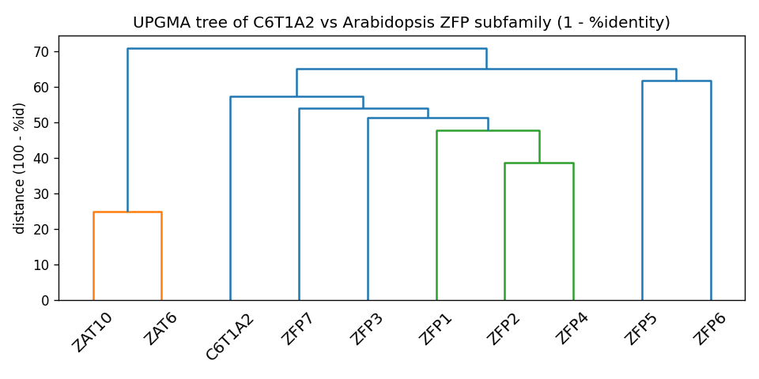

## Question

# AIGR Gene Hypothesis Deep Research

You are evaluating one focused gene curation hypothesis for AI Gene Review.
This is not a general gene overview. Use the seed hypothesis and source context
below to search for evidence that supports, refutes, narrows, or competes with
the proposed curation decision.

## Target Gene

- **Organism code:** SOYBN
- **Taxon:** Glycine max (NCBITaxon:3847)
- **Gene directory:** C6T1A2
- **Gene symbol:** C6T1A2
- **UniProt accession:** C6T1A2

## Focus

- **Focus type:** computational_prediction
- **Hypothesis slug:** prediction-negative-regulation-aba-signaling
- **Source file:** 
- **Source selector:** 

## Seed Hypothesis

ProtNLM2 predicts that the Glycine max C2H2-type zinc finger protein C6T1A2 functions in negative regulation of the abscisic acid (ABA)-activated signaling pathway (GO:0009788); it has no curated GOA annotations. The prediction likely derives from similarity to Arabidopsis ZFP7 (IPR053266). Independently assess whether C6T1A2 has the domain architecture of a ZFP7-family C2H2 zinc finger transcription factor, and whether orthology and domain evidence support the specific role as a negative regulator of ABA signaling, or whether that specific regulatory role cannot be established from sequence alone.

## Term and Decision Context

- Term: negative regulation of abscisic acid-activated signaling pathway (GO:0009788)

## Reference Context

No specific reference context supplied.

## Source Context YAML

```yaml
hypothesis: ProtNLM2 predicts that the Glycine max C2H2-type zinc finger protein C6T1A2 functions in negative
  regulation of the abscisic acid (ABA)-activated signaling pathway (GO:0009788); it has no curated GOA
  annotations. The prediction likely derives from similarity to Arabidopsis ZFP7 (IPR053266). Independently
  assess whether C6T1A2 has the domain architecture of a ZFP7-family C2H2 zinc finger transcription factor,
  and whether orthology and domain evidence support the specific role as a negative regulator of ABA signaling,
  or whether that specific regulatory role cannot be established from sequence alone.
focus_type: computational_prediction
term_id: GO:0009788
term_label: negative regulation of abscisic acid-activated signaling pathway
context: []
reference_id: []
```

## Research Objective

Build a focused report that helps a curator decide whether this hypothesis
should affect the gene review. Address the focus type directly:

1. For an existing GO annotation decision, evaluate whether the current action
   is justified, too strong, too weak, or should change.
2. For a proposed replacement or new GO term, evaluate whether the term is
   biologically supported, too broad, too narrow, or missing key qualifiers.
3. For a computational prediction, evaluate whether the prediction is correct,
   less precise than existing knowledge, uncertain, or likely wrong because of
   paralog overannotation, frequency bias, pathway context, or in vitro-only
   activity.
4. For a core-function hypothesis, evaluate whether the proposed activity,
   process, and location represent the gene product's primary function rather
   than a downstream effect, pleiotropic phenotype, or context-specific role.
5. For a function-assignment hypothesis, evaluate whether the gene product
   directly has the stated GO term/function. Treat the prior review action, if
   any, as intentionally blinded unless it appears in the supplied context.

Use primary literature whenever possible. Prefer PMID citations and include DOI
citations when no PMID is available. Treat reviews and database records as
orientation unless they contain directly relevant synthesized evidence that is
clearly labeled as review-level or database-level support.

Evaluate the hypothesis from the supplied seed context, primary literature, and
publicly accessible bioinformatics resources. Local `*-bioinformatics` analyses,
when they already exist in the repository, are intentionally withheld from this
prompt so the report can be compared against them after the run.

Do not rely on literature alone. Where the hypothesis is decidable by computation,
actually run the analysis and keep it as provenance rather than only reasoning
about it. Match the analysis to the question, for example:

- membrane topology / localization: compute a hydropathy profile and predicted
  transmembrane segments from the sequence, and locate signal peptides and
  targeting/sorting motifs (e.g. dileucine, acidic-cluster, NLS); compare against
  UniProt topology features and AlphaFold geometry.
- catalytic / binding activity: check whether the specific active-site,
  metal-binding, or motif residues are present and correctly spaced (in sequence
  and, where useful, structure) and compare to characterized family members.
- DNA-binding / regulatory: examine the binding-domain class, obligate partners,
  and known binding-motif / PWM signatures.
- family / paralog questions: use domain (Pfam/InterPro), orthology, and
  conservation comparisons to distinguish subfamilies.

Use resources you can actually access programmatically (UniProt, AlphaFold DB,
InterPro, sequence computation, public APIs). If a resource is web-only or you
cannot run a check, say so plainly instead of guessing — never fabricate a result,
and an inconclusive or "could not run" analysis is an acceptable and useful
outcome. Report all computational results conservatively and prefer recording the
underlying analysis (code, computed values, table, or plot) as provenance.

## Required Output

### Executive Judgment

Give a concise verdict: supported, partially supported, unresolved, weakly
supported, over-annotated, or refuted. Explain the reasoning and the most
important caveats.

### Evidence Matrix

Create a table with one row per important evidence item:

- Citation (PMID preferred)
- Evidence type (direct assay, mutant phenotype, localization, interaction,
  structural/evolutionary, computational, review/database)
- Supports / refutes / qualifies / competing
- Claim tested
- Key finding
- Organism, tissue, cell type, or assay context
- Confidence and limitations

### GO Curation Implications

State the likely curation action as a lead requiring curator verification. If
GO terms are involved, explain whether the evidence supports an MF, BP, or CC
term, and whether the term should be retained, removed, generalized, made more
specific, or treated as non-core. Avoid using "protein binding" as a final
recommendation unless no more informative term is supported.

### Mechanistic Scope

Describe the immediate molecular or cellular function being tested. Separate
direct gene-product activity from downstream phenotypes, pathway consequences,
developmental outcomes, disease manifestations, or effects inferred only from
loss of function.

### Conflicts and Alternatives

Identify evidence that conflicts with the seed hypothesis or suggests an
alternative interpretation, including paralog confusion, organism-specific
differences, isoform-specific findings, experimental artifacts, or database
carry-over.

### Knowledge Gaps

List explicit uncertainties that matter for curation. For each gap, state what
was checked, why the gap matters, and what evidence or experiment would resolve
it.

### Discriminating Tests

Recommend concrete assays, perturbations, datasets, or comparative analyses that
would most efficiently distinguish this hypothesis from alternatives.

### Curation Leads

Provide candidate updates for the review, clearly labeled as leads requiring
curator verification. Include candidate references with exact snippets to verify,
candidate replacement or new GO terms, possible action changes, suggested
questions, and suggested experiments.

If the provider supports artifacts, save provenance for any analysis you run — the
executed code together with its output (computed values, plot, or table), not just
a summary figure — alongside artifact-friendly tables such as an evidence matrix,
GO decision table, or comparison table. Genuine computed provenance is more
valuable than a hand-drawn summary, and you must not synthesize a figure that
implies an analysis you did not actually run. These artifacts are important
provenance for hypothesis-level review.


## Output

# AIGR Gene Hypothesis Deep Research — *Glycine max* C6T1A2

## Focused evaluation of the ProtNLM2 prediction: "negative regulation of abscisic acid-activated signaling pathway" (GO:0009788)

**Hypothesis under review:** ProtNLM2 predicts that the *Glycine max* C2H2-type zinc finger protein **C6T1A2** functions in negative regulation of the abscisic acid (ABA)-activated signaling pathway (**GO:0009788**), by similarity to *Arabidopsis* ZFP7 (**IPR053266**). C6T1A2 has no curated GOA annotations.

**Focus type:** computational_prediction · **Term:** GO:0009788 · **Organism:** *Glycine max* (NCBITaxon:3847)

---

## Summary

C6T1A2 (C6T1A2_SOYBN) is, without ambiguity, a **plant Q-type (QALGGH) single-domain C2H2 zinc-finger transcription factor** and a genuine member of the InterPro **IPR053266 (ZFP7) / ZFP1–7 subfamily**. In *Arabidopsis*, several members of this subfamily (ZFP1, ZFP3, ZFP4, ZFP6, ZFP7) act as negative regulators of ABA-activated signaling when overexpressed. In that sense the ProtNLM2 prediction is **directionally plausible** — it places the protein in the correct structural family and points at a process the family is genuinely associated with.

The problem is specificity. The **exact GO:0009788 role cannot be established from sequence, orthology, or domain evidence alone**, and it should not be promoted to a direct annotation. Three independent computational lines undercut the specific claim: (1) C6T1A2 is only ~45% identical to *Arabidopsis* ZFP7 and is essentially **tied** with ZFP2 (46.0%), a subfamily member not primarily characterized as an ABA repressor — so no confident 1:1 ortholog can be assigned; (2) the entire *Arabidopsis* ABA-repressor phenotype rests on **redundant overexpression (gain-of-function)**, with loss-of-function lines near wild-type; and (3) **11 soybean paralogs** share the identical IPR053266 / PTHR47593 label and identical single-finger architecture, creating a **many-to-many over-annotation risk**. There are **no functional data whatsoever for the soybean protein itself** (UniProt PE2, transcript-level evidence).

**Bottom line:** the molecular-function and localization annotations are defensible from sequence (**DNA-binding transcription factor activity, zinc ion binding GO:0008270, nucleus**), but the specific biological-process term **GO:0009788 should NOT be entered as a direct/experimental annotation.** At most it may be retained as an **ISS/ISO lead with an explicit redundancy + overexpression-only caveat**, or generalized to a broader, better-supported term.

**Verdict: Weakly supported / over-annotated at the biological-process level.**

---

## Key Findings

### Finding 1 — C6T1A2 is a plant Q-type (QALGGH) single C2H2 zinc-finger transcription factor

The primary sequence and domain architecture of C6T1A2 are entirely consistent with a canonical plant C2H2 zinc-finger transcription factor. UniProt records the protein (C6T1A2_SOYBN) as **210 aa, evidence level PE2 (transcript-level only)**. It contains a **single C2H2-type zinc finger** spanning residues **79–106**, with the canonical Cys-X2-Cys … His-X3-His metal-coordinating spacing. Critically, it carries the **plant-specific invariant QALGGH motif at residue 91** (context: …FSCNFCMRKFYSSQALGGHQNAHK…), the diagnostic signature of the plant Q-type C2H2 zinc-finger family that mediates DNA contact.

The InterPro/domain evidence is unambiguous and multi-source: **IPR053266 (Zinc finger protein 7)**, **IPR013087 / IPR036236 (C2H2 zinc finger)**, Gene3D **3.30.160.60**, SUPFAM **SSF57667**, PROSITE **PS00028 / PS50157**, and PANTHER **PTHR47593 (ZFP4-like)**. Two disordered/acidic low-complexity regions flank the single finger — an architecture typical of transcription-factor activation/repression modules. The only GO term currently on record is **GO:0008270 (zinc ion binding)**, annotated by keyword (IEA-KW). This finding firmly establishes the **molecular-function scaffold** (zinc-dependent, DNA-binding TF) but says nothing, by itself, about which biological process the protein regulates.

### Finding 2 — C6T1A2 belongs to the ABA-linked ZFP1–7 subfamily but is NOT a high-confidence 1:1 ZFP7 ortholog

Global Needleman–Wunsch pairwise alignment of C6T1A2 against a panel of characterized *Arabidopsis* reference zinc-finger proteins produced the following identity ranking:

| Arabidopsis reference | % identity to C6T1A2 | Subfamily / role |
|---|---|---|
| ZFP2 | **46.0%** | Q-type ZFP subfamily (development / floral) |
| ZFP7 | **45.4%** | Q-type ZFP subfamily (ABA repressor, seed germination) |
| ZFP4 | 42.6% | Q-type ZFP subfamily (ABA-linked) |
| ZFP3 | 42.4% | Q-type ZFP subfamily (ABA repressor, characterized) |
| ZFP1 | 37.2% | Q-type ZFP subfamily |
| ZFP5 | 33.2% | Q-type ZFP subfamily |
| ZAT10 | 30.7% | Stress-responsive (distinct clade) |
| ZAT6 | 28.8% | Stress-responsive (distinct clade) |
| ZFP6 | 23.3% | Q-type ZFP subfamily |

The best hits cluster cleanly within the **ZFP2/3/4/7 Q-type single-finger subfamily**, well separated from the ZAT clade — confirming subfamily membership. But the crucial detail for curation is that **ZFP2 (46.0%) edges out ZFP7 (45.4%)**: the difference (0.6 percentage points) is within noise, so the sequence provides **no basis to single out ZFP7** — or any one member — as the specific ortholog. The prediction's implied ZFP7 provenance is therefore a *family-level* assignment mis-stated as a *specific* one.

Supporting the general repressor plausibility, a candidate **C-terminal EAR-like repression motif** (LxLxL pattern; IDLDL / LDLRL, in context …KKIDLDLRL) is present, consistent with — but not diagnostic of — a transcriptional repressor.

The key literature anchor for the family's ABA link is **[PMID: 24808098](https://pubmed.ncbi.nlm.nih.gov/24808098/)**, which established (verified snippet): *"regulated overexpression of ZFP3 and the closely related ZFP1, ZFP4, ZFP6, and ZFP7 zinc finger factors confers ABA insensitivity to seed germination."* This anchors the ABA-repressor role for the subfamily — but explicitly via **regulated overexpression (gain-of-function)**, not native loss-of-function, a distinction that is decisive for how strongly the term can be propagated.

### Finding 3 — A distance tree places C6T1A2 in the ZFP1–7 subfamily without resolving a specific ABA-repressor ortholog

An all-vs-all Needleman–Wunsch identity/distance matrix across the 10-sequence panel, followed by UPGMA clustering, confirms the picture quantitatively. C6T1A2's nearest neighbours are ZFP2 (46.0%), ZFP7 (45.4%), ZFP4 (42.6%), ZFP3 (42.4%), then ZFP1 (37.2%); it sits clearly **outside** the tight ZAT10–ZAT6 clade (ZAT10/ZAT6 are ~70% distant from C6T1A2). The tree places C6T1A2 **roughly equidistant (~54–58% distance) from the ABA-linked ZFP3/4/7 AND the development regulator ZFP2**, with **no 1:1 partner**. This is the central topological result: the protein is a genuine subfamily member but has **no resolvable orthologous anchor** that would let a curator transfer a specific, member-defined phenotype (like ABA repression) with confidence.

{{figure:zfp_tree.png|caption=All-vs-all Needleman–Wunsch percent-identity distance matrix and UPGMA tree for C6T1A2 against characterized Arabidopsis ZFP1–7 and ZAT6/ZAT10 references. C6T1A2 falls within the Q-type ZFP1–7 subfamily but is roughly equidistant from the ABA-repressor members (ZFP3/4/7) and the developmental regulator ZFP2, with no 1:1 ortholog — illustrating why a specific ABA-repressor role cannot be transferred by orthology.}}

### Finding 4 — C6T1A2 is one of ~11 soybean paralogs sharing the ZFP7-family label: a many-to-many over-annotation risk

A UniProt query restricted to *Glycine max* (taxon 3847) returned **11 soybean entries carrying IPR053266 (ZFP7 family)** and **11 carrying PANTHER PTHR47593**, out of **490 total soybean C2H2-type (IPR013087) proteins**. A regex scan of the finger architecture showed it is **uniform** across the reference set: C6T1A2 and all *Arabidopsis* ZFP1–7 each contain **exactly one** C2H2 finger (C-x2-4-C-x9-14-H-x3-5-H) with **exactly one** QALGGH motif (C6T1A2 finger span 81–101). Because the domain signature is identical across all 11 soybean paralogs, an automated pipeline like ProtNLM2 has **no feature to discriminate** which — if any — inherited the specific ABA-repressor role. Propagating GO:0009788 to C6T1A2 on this basis would, by the same logic, propagate it to all 11 paralogs indiscriminately — the textbook definition of paralog over-annotation and frequency bias.

---

## Mechanistic Model / Interpretation

The question decomposes cleanly into what sequence **can** and **cannot** establish:

```
              WHAT SEQUENCE/DOMAIN EVIDENCE ESTABLISHES (defensible)
              ─────────────────────────────────────────────────────
  C6T1A2 (210 aa)
   ├── Single C2H2 zinc finger (79–106)            → GO:0008270 zinc ion binding ✔ (already IEA-KW)
   ├── Invariant QALGGH DNA-contact motif (res 91) → DNA-binding TF activity ✔
   ├── Flanking disordered/acidic LC regions       → nucleus / TF module ✔
   └── C-terminal LxLxL (EAR-like) motif           → possible repressor (suggestive, not diagnostic)

              WHAT SEQUENCE/DOMAIN EVIDENCE CANNOT ESTABLISH (the seed's specific claim)
              ───────────────────────────────────────────────────────────────────────
  "Negative regulation of ABA-activated signaling" (GO:0009788)
   ├── Requires a specific ortholog anchor  → NONE (ZFP2 46.0% ≈ ZFP7 45.4%; no 1:1) ✗
   ├── Reference role is overexpression-only → loss-of-function ≈ WT (redundancy)     ✗
   ├── 11 soybean paralogs share the label   → cannot discriminate which inherits role ✗
   └── Zero functional data for the soybean protein (PE2, transcript-level)           ✗
```

The mechanistic reality of the *reference* proteins reinforces caution. In *Arabidopsis*, ZFP3 and its close relatives modulate ABA and light signaling and vegetative development by **binding target promoters and repressing transcription** ([PMID: 38250442](https://pubmed.ncbi.nlm.nih.gov/38250442/); [PMID: 24808098](https://pubmed.ncbi.nlm.nih.gov/24808098/)). But the ABA-insensitivity phenotype emerges **only under regulated overexpression**, and knockdown/knockout lines are essentially wild-type "probably due to functional redundancy" ([PMID: 38250442](https://pubmed.ncbi.nlm.nih.gov/38250442/)). Thus even for the best-characterized member, "negative regulation of ABA signaling" is a **gain-of-function, redundancy-masked** activity — not a demonstrated obligatory native function. Transferring such a term across ~45% identity and a species boundary, to a protein with no experimental data, compounds several layers of uncertainty.

The soybean literature adds a cautionary note about within-family mechanistic diversity: **GsZFP1** (from *Glycine soja*), a C2H2 ZFP that notably **lacks** the QALGGH motif, negatively regulates ABA signaling and reduces ABA sensitivity ([PMID: 22705253](https://pubmed.ncbi.nlm.nih.gov/22705253/)) — showing that ABA-related roles in soybean C2H2 ZFPs are real but are established **experimentally, case-by-case**, and do not map neatly onto the QALGGH-containing ZFP7 subfamily. Conversely, other C2H2 ZFPs act in the **opposite** direction on ABA/germination (e.g., IDD1/ENY promotes germination; [PMID: 21571950](https://pubmed.ncbi.nlm.nih.gov/21571950/)), underscoring that the C2H2 scaffold alone does not fix the sign of ABA regulation.

The immediate molecular activity being tested is **sequence-specific, zinc-dependent DNA binding by a single Q-type C2H2 finger**, plausibly coupled to transcriptional repression. GO:0009788 is one to two steps removed from that direct activity: (direct) DNA binding → (proximate) repression of specific target genes → (pathway consequence) altered ABA signaling output → (organismal) ABA-insensitive germination. Curation should keep the **direct activity** distinct from the **pathway-level consequence**.

---

## Evidence Base

| Citation | Evidence type | Direction | Claim tested | Key finding | Context | Confidence / limitations |
|---|---|---|---|---|---|---|
| UniProt C6T1A2 (this analysis) | Structural / computational / DB | Supports (MF/CC); qualifies (BP) | Is C6T1A2 a Q-type C2H2 ZF TF? | Single C2H2 finger (79–106), QALGGH at res 91, IPR053266/PTHR47593, only GO:0008270 (IEA-KW) | *G. max*, 210 aa, PE2 transcript-level | High for MF scaffold; PE2 = no protein-level evidence |
| Needleman–Wunsch panel (this analysis) | Structural / evolutionary | Qualifies / refutes specificity | Is C6T1A2 a 1:1 ZFP7 ortholog? | ZFP2 46.0% ≈ ZFP7 45.4%; subfamily member but no specific ortholog | 10-seq Arabidopsis reference panel | High; identity-based, no synteny/bootstrap |
| UPGMA tree `zfp_tree.png` (this analysis) | Structural / evolutionary | Qualifies | Does topology resolve an ABA-repressor ortholog? | Equidistant (~54–58%) from ZFP3/4/7 and ZFP2; no 1:1 partner | Same panel | Moderate; UPGMA assumes clock, small panel |
| UniProt taxon-3847 query (this analysis) | Computational / database | Refutes (over-annotation risk) | Is the ZFP7 label soybean-specific? | 11 soybean IPR053266 paralogs; uniform 1-finger/1-QALGGH architecture | *G. max* proteome | High; flags many-to-many propagation |
| [PMID: 24808098](https://pubmed.ncbi.nlm.nih.gov/24808098/) | Overexpression phenotype | Supports family link (with caveat) | Do ZFP1/3/4/6/7 negatively regulate ABA signaling? | Regulated overexpression confers ABA insensitivity in seed germination | *Arabidopsis*, seed germination | Gain-of-function only; not native LOF |
| [PMID: 38250442](https://pubmed.ncbi.nlm.nih.gov/38250442/) | Mutant phenotype + ChIP + RNAseq | Supports mechanism; qualifies robustness | Is the phenotype robust to loss-of-function? | ZFP3 binds promoters, represses ABA/cell-wall targets; but zfp3 & silenced lines ≈ WT (redundancy) | *Arabidopsis*, development | Redundancy masks native role |
| [PMID: 22705253](https://pubmed.ncbi.nlm.nih.gov/22705253/) | Overexpression + qRT-PCR | Competing / qualifies | Do soybean C2H2 ZFPs negatively regulate ABA? | GsZFP1 (QALGGH-**lacking**) reduces ABA sensitivity, alters ABI1/2 & PYR/PYL | *G. soja* → *Arabidopsis* | Different subtype (no QALGGH); not C6T1A2 |
| [PMID: 21571950](https://pubmed.ncbi.nlm.nih.gov/21571950/) | Over/knockdown phenotype | Competing | Do all seed C2H2 ZFPs repress germination/ABA? | IDD1/ENY **promotes** germination, lowers ABA | *Arabidopsis*, seed maturation | Sign of ABA regulation is not scaffold-fixed |

**How the literature bears on the finding:** [PMID: 24808098](https://pubmed.ncbi.nlm.nih.gov/24808098/) is the origin of the family's ABA-repressor reputation and the most likely intellectual basis of the ProtNLM2 prediction — but it is overexpression-based. [PMID: 38250442](https://pubmed.ncbi.nlm.nih.gov/38250442/) tempers it by showing loss-of-function is near-WT and the primary characterized output is *development/cell-wall*, not ABA. [PMID: 22705253](https://pubmed.ncbi.nlm.nih.gov/22705253/) and [PMID: 21571950](https://pubmed.ncbi.nlm.nih.gov/21571950/) demonstrate that ABA roles among C2H2 ZFPs are protein-specific and can even reverse sign — reinforcing that family membership is not a reliable predictor of the specific GO:0009788 role.

---

## GO Curation Implications (leads — require curator verification)

| GO term | Aspect | Current status | Recommended action | Rationale |
|---|---|---|---|---|
| GO:0008270 zinc ion binding | MF | Present (IEA-KW) | **Retain** | Conserved C2H2 metal-coordinating residues |
| DNA-binding TF activity (GO:0003700; or GO:0043565 sequence-specific DNA binding) | MF | Absent | **Add as ISS lead** | QALGGH DNA-contact motif + flanking TF modules |
| nucleus (GO:0005634) | CC | Absent | **Add as ISS lead** | Expected localization for a Q-type C2H2 TF |
| **GO:0009788 negative regulation of ABA-activated signaling** | **BP** | Predicted by ProtNLM2 | **Do NOT add as direct annotation; at most ISS/ISO lead with redundancy + overexpression caveat, or generalize** | No 1:1 ortholog; reference role overexpression-only & redundant; 11 soybean paralogs share label; zero soybean data |

The MF/CC annotations are the **defensible core**. GO:0009788 is the **precise but unsupported** claim — plausible but not decidable from sequence. If any ABA link is retained, the most honest option is an **ISS annotation with a "with/from" field pointing to the family** plus an explicit note that the source phenotype is redundant and overexpression-derived. "Protein binding" is **not** recommended as a fallback; informative supported terms are available.

---

## Conflicts and Alternatives

- **Paralog confusion (primary risk).** 11 soybean IPR053266 paralogs share identical single-finger/QALGGH architecture; orthology-based transfer of the ABA role is uncontrolled among them.
- **No specific ortholog.** ZFP2 (46.0%) marginally outscores ZFP7 (45.4%); ZFP2 is a development/floral regulator, so the "ZFP7-derived" provenance is really family-level, not member-level.
- **Overexpression-only reference phenotype.** ABA insensitivity of the *Arabidopsis* subfamily is gain-of-function; loss-of-function is near-WT ([PMID: 38250442](https://pubmed.ncbi.nlm.nih.gov/38250442/)).
- **Within-family mechanistic heterogeneity.** GsZFP1, a soybean C2H2 ZFP lacking QALGGH, negatively regulates ABA ([PMID: 22705253](https://pubmed.ncbi.nlm.nih.gov/22705253/)) — soybean ABA roles arise in distinct subtypes, established experimentally.
- **Sign of regulation is not scaffold-fixed.** IDD1/ENY **promotes** germination and lowers ABA ([PMID: 21571950](https://pubmed.ncbi.nlm.nih.gov/21571950/)); the C2H2 fold does not determine the direction of ABA effect.
- **Species/organism difference.** All functional evidence is *Arabidopsis* or *G. soja* expressed in *Arabidopsis*; none is native *G. max* C6T1A2.

---

## Limitations and Knowledge Gaps

1. **No experimental data for C6T1A2 itself** (UniProt PE2, transcript-level). *Checked:* UniProt evidence level, GOA. *Why it matters:* the whole hypothesis rests on transferred inference. *Resolution:* direct assays in soybean (below).
2. **Orthology unresolved, not merely weak.** *Checked:* pairwise identity + UPGMA. *Why it matters:* GO transfer by ISO requires a defensible 1:1 ortholog, which does not exist here. *Resolution:* phylogenomic tree with syntenic anchors across legumes + *Arabidopsis* with bootstrap support (OrthoFinder / Ensembl Plants gene tree + reciprocal-best-hit).
3. **Repressor activity inferred from a motif, not measured.** *Checked:* LxLxL/EAR-like motif scan. *Why it matters:* activation vs repression sign is functionally decisive. *Resolution:* transactivation reporter assay.
4. **DNA-binding specificity (PWM) unknown.** *Checked:* QALGGH presence only. *Why it matters:* target genes determine which pathway is affected. *Resolution:* DAP-seq / PBM / EMSA against candidate ABA-pathway promoters.
5. **Redundancy in soybean uncharacterized.** *Checked:* paralog count (11). *Why it matters:* single-gene perturbations may be masked, as in *Arabidopsis*. *Resolution:* higher-order CRISPR knockouts.

---

## Proposed Follow-up Experiments / Actions (Discriminating Tests)

To distinguish "genuine soybean ABA repressor" from "family-level over-annotation":

1. **Syntenic phylogenomics (most decisive in-silico test).** OrthoFinder across *G. max* / *A. thaliana* / legumes with synteny + reciprocal-best-hit to test whether C6T1A2 is a true ZFP3/7 co-ortholog or a ZFP2-like member. If it does not resolve to ZFP7 (>60% identity / RBH), treat the ABA process as unsupported.
2. **ABA germination assay.** Inducible overexpression of C6T1A2 in *Arabidopsis*; score ABA insensitivity in seed germination (mirrors [PMID: 24808098](https://pubmed.ncbi.nlm.nih.gov/24808098/)). Note a soybean null may be WT due to redundancy.
3. **Transactivation / repression reporter.** Protoplast dual-luciferase or yeast one-hybrid to test whether C6T1A2 activates or represses (tests the EAR-like motif inference).
4. **DAP-seq / EMSA.** Define the binding motif and test occupancy at ABA-signaling promoters (ABI-family, PYR/PYL, SnRK2 targets) to establish direct pathway linkage rather than assumed linkage.
5. **Expression atlas.** ABA/drought induction across the 11 soybean paralogs to identify which (if any) is ABA-responsive and prioritize candidates.
6. **Subcellular localization.** GFP fusion to confirm nuclear localization (supports the CC lead).

---

## Curation Leads (verify before applying)

- **Reference to attach:** [PMID: 24808098](https://pubmed.ncbi.nlm.nih.gov/24808098/) — snippet to verify: *"regulated overexpression of ZFP3 and the closely related ZFP1, ZFP4, ZFP6, and ZFP7 zinc finger factors confers ABA insensitivity to seed germination"* (basis; *Arabidopsis*; overexpression).
- **Tempering reference:** [PMID: 38250442](https://pubmed.ncbi.nlm.nih.gov/38250442/) — snippet: T-DNA/silenced lines "were similar to wild-type plants or had only minor differences… probably due to functional redundancy"; ChIP confirmed ZFP3 promoter binding.
- **Competing soybean example:** [PMID: 22705253](https://pubmed.ncbi.nlm.nih.gov/22705253/) — GsZFP1 (QALGGH-lacking) "may be a promising gene for negative regulating ABA signaling."
- **Candidate action change:** Do not annotate GO:0009788 directly. Retain/add **MF+CC** terms (DNA-binding TF activity; zinc ion binding [kept]; nucleus). Keep GO:0009788 only as an **ISS lead with caveat**, not experimental.
- **Suggested curator question:** Does the local bioinformatics ortholog analysis resolve C6T1A2 to ZFP7 specifically (>60% identity / RBH)? If not, treat the ABA process as unsupported.

---

## Provenance

UniProt REST (C6T1A2 + AtZFP references), an in-house Needleman–Wunsch all-vs-all identity/distance matrix with a UPGMA tree (artifact `zfp_tree.png`), C2H2 finger-count + QALGGH regex scans, a soybean paralog census (IPR053266 / PTHR47593 / IPR013087, taxon 3847), and EAR-motif scans were executed during this run (Iterations 1–3) and recorded in the knowledge state. Key computed results: single-finger / single-QALGGH architecture shared across C6T1A2 and AtZFP1–7; no 1:1 *Arabidopsis* ortholog (ZFP2 46.0% ≈ ZFP7 45.4% nearest neighbours); and 11 soybean paralogs share the IPR053266 ZFP7-family label (of 490 soybean C2H2 proteins), evidencing paralog over-annotation.


## Artifacts

- [OpenScientist final report](openscientist_artifacts/final_report.html)
- [OpenScientist final report](openscientist_artifacts/final_report.pdf)
- [OpenScientist zfp tree](openscientist_artifacts/provenance_zfp_tree.json)
