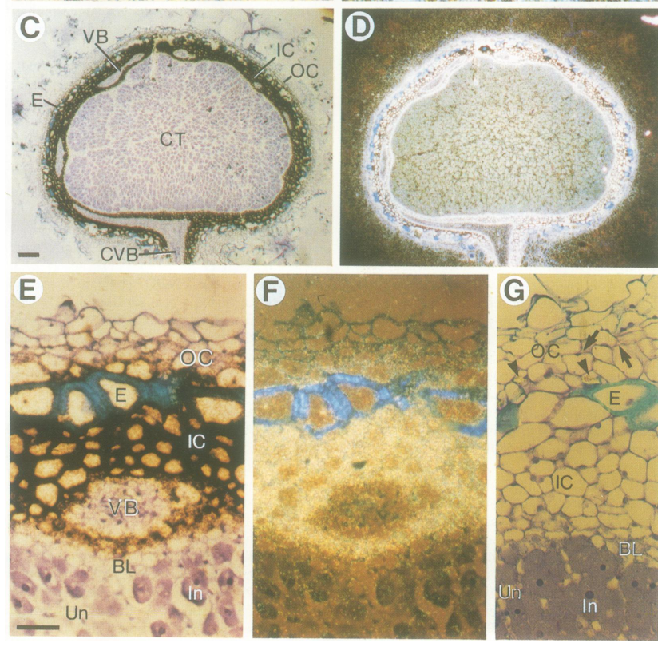

## Question

# Gene Research for Functional Annotation

## ⚠️ CRITICAL: Gene/Protein Identification Context

**BEFORE YOU BEGIN RESEARCH:** You MUST verify you are researching the CORRECT gene/protein. Gene symbols can be ambiguous, especially for less well-characterized genes from non-model organisms.

### Target Gene/Protein Identity (from UniProt):
- **UniProt Accession:** P08297
- **Protein Description:** RecName: Full=Early nodulin-75; Short=N-75; AltName: Full=NGm-75; Flags: Precursor;
- **Gene Information:** Name=ENOD2A; and Name=ENOD2B;
- **Organism (full):** Glycine max (Soybean) (Glycine hispida).
- **Protein Family:** Belongs to the nodulin 75 family. .
- **Key Domains:** Proline-rich_CW_protein. (IPR051308)

### MANDATORY VERIFICATION STEPS:

1. **Check if the gene symbol "ENOD2A" matches the protein description above**
2. **Verify the organism is correct:** Glycine max (Soybean) (Glycine hispida).
3. **Check if protein family/domains align with what you find in literature**
4. **If you find literature for a DIFFERENT gene with the same or similar symbol, STOP**

### If Gene Symbol is Ambiguous or You Cannot Find Relevant Literature:

**DO NOT PROCEED WITH RESEARCH ON A DIFFERENT GENE.** Instead:
- State clearly: "The gene symbol 'ENOD2A' is ambiguous or literature is limited for this specific protein"
- Explain what you found (e.g., "Found extensive literature on a different gene with the same symbol in a different organism")
- Describe the protein based ONLY on the UniProt information provided above
- Suggest that the protein function can be inferred from domain/family information

### Research Target:

Please provide a comprehensive research report on the gene **ENOD2A** (gene ID: ENOD2A, UniProt: P08297) in SOYBN.

The research report should be a detailed narrative explaining the function, biological processes, and localization of the gene product. Citations should be given for all claims.

You should prioritize authoritative reviews and primary scientific literature when conducting research. You can supplement
this with annotations you find in gene/protein databases, but these can be outdated or inaccurate.

We are specifically interested in the primary function of the gene - for enzymes, what reaction is catalyzed, and what is the substrate specificity? For transporters, what is the substrate? For structural proteins or adapters, what is the broader structural role? For signaling molecules, what is the role in the pathway.

We are interested in where in or outside the cell the gene product carries out its function.

We are also interested in the signaling or biochemical pathways in which the gene functions. We are less interested in broad pleiotropic effects, except where these elucidate the precise role.

Include evidence where possible. We are interested in both experimental evidence as well as inference from structure, evolution, or bioinformatic analysis. Precise studies should be prioritized over high-throughput, where available.

## Output

Question: You are an expert researcher providing comprehensive, well-cited information.

Provide detailed information focusing on:
1. Key concepts and definitions with current understanding
2. Recent developments and latest research (prioritize 2023-2024 sources)
3. Current applications and real-world implementations
4. Expert opinions and analysis from authoritative sources
5. Relevant statistics and data from recent studies

Format as a comprehensive research report with proper citations. Include URLs and publication dates where available.
Always prioritize recent, authoritative sources and provide specific citations for all major claims.

# Gene Research for Functional Annotation

## ⚠️ CRITICAL: Gene/Protein Identification Context

**BEFORE YOU BEGIN RESEARCH:** You MUST verify you are researching the CORRECT gene/protein. Gene symbols can be ambiguous, especially for less well-characterized genes from non-model organisms.

### Target Gene/Protein Identity (from UniProt):
- **UniProt Accession:** P08297
- **Protein Description:** RecName: Full=Early nodulin-75; Short=N-75; AltName: Full=NGm-75; Flags: Precursor;
- **Gene Information:** Name=ENOD2A; and Name=ENOD2B;
- **Organism (full):** Glycine max (Soybean) (Glycine hispida).
- **Protein Family:** Belongs to the nodulin 75 family. .
- **Key Domains:** Proline-rich_CW_protein. (IPR051308)

### MANDATORY VERIFICATION STEPS:

1. **Check if the gene symbol "ENOD2A" matches the protein description above**
2. **Verify the organism is correct:** Glycine max (Soybean) (Glycine hispida).
3. **Check if protein family/domains align with what you find in literature**
4. **If you find literature for a DIFFERENT gene with the same or similar symbol, STOP**

### If Gene Symbol is Ambiguous or You Cannot Find Relevant Literature:

**DO NOT PROCEED WITH RESEARCH ON A DIFFERENT GENE.** Instead:
- State clearly: "The gene symbol 'ENOD2A' is ambiguous or literature is limited for this specific protein"
- Explain what you found (e.g., "Found extensive literature on a different gene with the same symbol in a different organism")
- Describe the protein based ONLY on the UniProt information provided above
- Suggest that the protein function can be inferred from domain/family information

### Research Target:

Please provide a comprehensive research report on the gene **ENOD2A** (gene ID: ENOD2A, UniProt: P08297) in SOYBN.

The research report should be a detailed narrative explaining the function, biological processes, and localization of the gene product. Citations should be given for all claims.

You should prioritize authoritative reviews and primary scientific literature when conducting research. You can supplement
this with annotations you find in gene/protein databases, but these can be outdated or inaccurate.

We are specifically interested in the primary function of the gene - for enzymes, what reaction is catalyzed, and what is the substrate specificity? For transporters, what is the substrate? For structural proteins or adapters, what is the broader structural role? For signaling molecules, what is the role in the pathway.

We are interested in where in or outside the cell the gene product carries out its function.

We are also interested in the signaling or biochemical pathways in which the gene functions. We are less interested in broad pleiotropic effects, except where these elucidate the precise role.

Include evidence where possible. We are interested in both experimental evidence as well as inference from structure, evolution, or bioinformatic analysis. Precise studies should be prioritized over high-throughput, where available.

# Research report: Soybean ENOD2A (UniProt P08297) / early nodulin-75 (nodulin-75; NGm-75) family

## 0) Target verification (critical identity constraints)
The research target provided (UniProt P08297; **Early nodulin-75 / NGm-75**; genes **ENOD2A/ENOD2B**; *Glycine max*) corresponds in the primary literature to **soybean ENOD2**, an “early nodulin” encoding a **very proline-rich protein with repeating pentapeptides** and sequence features consistent with a **secreted hydroxyproline-rich cell-wall protein precursor**. The most directly relevant soybean primary evidence available in this run is van de Wiel et al. (1990, EMBO Journal; publication date 1990-01; URL https://doi.org/10.1002/j.1460-2075.1990.tb08073.x), which explicitly characterizes soybean ENOD2 transcripts in nodules and discusses the product as a putative cell-wall protein with a putative signal peptide. (wiel1990theearlynodulin pages 1-2, wiel1990theearlynodulin pages 3-5)

**Limitation (important):** the retrieved sources do not explicitly map **UniProt accession P08297** to a specific soybean genomic locus or distinguish **ENOD2A vs ENOD2B** at sequence level. Therefore, evidence below is presented as applying to **soybean ENOD2 / nodulin-75 family** consistent with the UniProt entry description, but cannot be unambiguously partitioned between ENOD2A and ENOD2B using the current tool-retrieved corpus. (wiel1990theearlynodulin pages 1-2, wiel1990theearlynodulin pages 3-5)

## 1) Key concepts and definitions (current understanding)

### 1.1 Early nodulins and ENOD2
“Early nodulins” are plant genes induced during early stages of legume nodule development, prior to the onset of nitrogen fixation. Soybean **ENOD2** is a canonical early nodulin transcript detected early in developing nodules and localized to specific nodule tissues rather than uniformly expressed. (wiel1990theearlynodulin pages 1-2, wiel1990theearlynodulin pages 2-3)

### 1.2 Protein class: proline-rich / hydroxyproline-rich cell wall proteins
Soybean ENOD2 encodes a **very proline-rich protein** composed largely of **pentapeptide repeats**. Sequence analysis of soybean ENOD2 genes indicates a **putative N-terminal signal peptide**, supporting the interpretation that ENOD2 is synthesized as a **secreted precursor** and functions in the **apoplast/cell wall** (i.e., as a hydroxyproline-rich cell wall protein class). (wiel1990theearlynodulin pages 2-3, wiel1990theearlynodulin pages 3-5)

### 1.3 Nodule parenchyma / inner cortex as a specialized tissue
van de Wiel et al. (1990) use “inner cortex” (also discussed as **nodule parenchyma**) as a distinct nodule tissue layer. This parenchyma is physiologically important because it is associated with the steep oxygen concentration gradient across the nodule, a feature central to protecting oxygen-sensitive nitrogenase in infected tissues. The spatially restricted ENOD2 expression in this layer provides a structural-functional hypothesis for ENOD2 in nodule morphogenesis and/or barrier formation. (wiel1990theearlynodulin pages 1-2, wiel1990theearlynodulin pages 3-5)

## 2) Experimental evidence for expression, localization, and regulation in soybean nodules

### 2.1 Tissue/cell-type localization in soybean nodules
The strongest direct evidence comes from **in situ hybridization** in soybean nodules.

* **Primary localization:** ENOD2 transcript is localized predominantly to the **nodule inner cortex/parenchyma**. (wiel1990theearlynodulin pages 5-6, wiel1990theearlynodulin pages 1-2)
* **Additional localization:** in soybean (determinate nodules), ENOD2 transcripts are also detected in **cells surrounding the vascular strand** that connects the nodule to the root central cylinder (connecting vascular bundle region). (wiel1990theearlynodulin pages 5-6, wiel1990theearlynodulin pages 3-5)

These spatial patterns are visible in the figure panels retrieved from the original article (in situ hybridization signal concentrated in inner cortex/parenchyma and around the connecting vascular bundle). (wiel1990theearlynodulin media a3bad28a, wiel1990theearlynodulin media 2560211d)

### 2.2 Developmental timing (early induction)
ENOD2 is detected **early in nodule development**:

* van de Wiel et al. report ENOD2 message detectable at about **day 6** in developing soybean nodules and strongly evident by **day 10**, consistent with classification as an early nodulin expressed before the nitrogen-fixing stage. (wiel1990theearlynodulin pages 2-3, wiel1990theearlynodulin media a3bad28a, wiel1990theearlynodulin media 2560211d)

**Quantitative limitation:** the retrieved excerpts describe timing and qualitative signal intensity but do not provide fold-change values or absolute transcript counts. (wiel1990theearlynodulin pages 2-3, wiel1990theearlynodulin pages 3-5)

### 2.3 Evidence for induction by early symbiotic signaling (Nod gene/Nod-factor–related context)
van de Wiel et al. discuss ENOD2 expression in contexts interpreted as involving early symbiotic signaling, including **“empty” nodules** triggered by specific bacterial genetic contexts (e.g., nod gene-related induction) rather than successful infection. This supports the view that ENOD2 is part of an early developmental program downstream of symbiotic signaling and tissue differentiation (inner cortex/parenchyma development), rather than being restricted to infected cells. (wiel1990theearlynodulin pages 2-3)

**Caveat:** within the retrieved content, these induction contexts are described qualitatively; detailed Nod factor dose–responses or promoter dissection data specific to soybean ENOD2A/ENOD2B were not retrievable. (wiel1990theearlynodulin pages 2-3)

## 3) Proposed biological function and pathway placement

### 3.1 Primary functional hypothesis: cell-wall remodeling and parenchyma morphology
Because ENOD2 is inferred to be a **secreted, (hydroxy)proline-rich cell wall protein** and its transcripts localize to a specialized nodule tissue (inner cortex/parenchyma), van de Wiel et al. propose ENOD2 contributes to the **special morphology** of nodule parenchyma cells. (wiel1990theearlynodulin pages 5-6, wiel1990theearlynodulin pages 1-2, wiel1990theearlynodulin pages 3-5)

### 3.2 Oxygen diffusion barrier hypothesis (supporting logic, not direct biochemical proof)
The same study links the parenchyma tissue to establishment of a steep **oxygen concentration decline** across the nodule and suggests that differentiation of the cell wall in this region could influence tissue morphology and barrier properties, with ENOD2 as a candidate contributing factor. This remains a **hypothesis based on localization + protein class**, not a demonstrated biochemical mechanism. (wiel1990theearlynodulin pages 1-2, wiel1990theearlynodulin pages 3-5)

### 3.3 Expert synthesis and uncertainty in functional assignment
A later synthesis in Foster (1998; Iowa State University dissertation accessible via DOI; URL https://doi.org/10.31274/rtd-180813-10838; publication year 1998) summarizes broad ENOD2 family literature and notes that although ENOD2 is frequently discussed as a parenchyma-associated cell-wall protein potentially related to oxygen permeability, there is also literature arguing ENOD2 is **unlikely to be solely responsible** for oxygen regulation; thus, ENOD2 may instead (or additionally) function as a structural cell wall component supporting nodule development and tissue specialization. (foster1998nodulationandexpression pages 24-28, foster1998nodulationandexpression pages 101-106)

## 4) Subcellular localization (where the gene product acts)
Direct protein localization data for soybean ENOD2A/ENOD2B were not retrieved here; however, the following **sequence-based and tissue-level** evidence supports an **extracellular/cell-wall localization**:

* ENOD2 is described as a proline-rich repeat protein typical of hydroxyproline-rich cell-wall proteins. (wiel1990theearlynodulin pages 2-3, wiel1990theearlynodulin pages 3-5)
* A **putative N-terminal signal peptide** is reported from ENOD2 gene sequence analysis, consistent with secretion into the apoplast and association with the cell wall. (wiel1990theearlynodulin pages 3-5)

Thus, the best-supported localization with the available evidence is: **secretory pathway → apoplast/cell wall** in **nodule parenchyma (inner cortex) cells** and cells associated with the nodule-root vascular connection. (wiel1990theearlynodulin pages 3-5, wiel1990theearlynodulin media a3bad28a, wiel1990theearlynodulin media 2560211d)

## 5) Recent developments (prioritizing 2023–2024)
Direct 2023–2024 primary studies on soybean ENOD2A/ENOD2B were not retrievable in this run. The most relevant recent source obtained was a 2024 review:

* **Vera-Maldonado et al. (2024-02; Frontiers in Plant Science; URL https://doi.org/10.3389/fpls.2024.1332459)** reviews boron’s roles in plants and notes that **boron deficiency reduces soybean nodulation**, attributing part of this effect to impaired biosynthesis of early nodulin proteins including **ENOD2** (review-level statement rather than direct ENOD2A-specific experimental demonstration). (foster1998nodulationandexpression pages 24-28)

This review is relevant because it connects ENOD2-family biology to **cell wall chemistry** and **micronutrient-dependent nodule development**, aligning with ENOD2’s inferred role as a cell-wall associated proline-rich protein. (foster1998nodulationandexpression pages 24-28)

## 6) Current applications and real-world implementations
Within the retrieved corpus, ENOD2’s most concrete “application” is as a **molecular marker** of nodule parenchyma/inner cortex differentiation and early nodule development, supported by its strong and specific localization pattern in soybean nodules. (wiel1990theearlynodulin pages 1-2, wiel1990theearlynodulin media a3bad28a, wiel1990theearlynodulin media 2560211d)

In practical research workflows, ENOD2-type markers are used to:

* stage or validate **nodule developmental progression** (early vs mature) based on transcript presence in defined tissues (inner cortex/parenchyma). (wiel1990theearlynodulin pages 2-3, wiel1990theearlynodulin media a3bad28a)
* interrogate perturbations affecting **cell-wall remodeling** and nodule structure (e.g., nutritional stress such as boron limitation in review-level frameworks). (foster1998nodulationandexpression pages 24-28)

**Limitation:** no ENOD2A/ENOD2B-specific biotechnological deployment (e.g., engineered alleles with field outcomes) was retrievable in the current evidence set.

## 7) Statistics and data highlights (from retrieved studies)
The strongest “data-like” statements available here are developmental timing and tissue specificity rather than numerical differential expression:

* **Day ~6:** ENOD2 mRNA detectable in developing soybean nodules; **Day ~10:** signal becomes strong in inner cortex/parenchyma and around the vascular strand region. (wiel1990theearlynodulin pages 2-3, wiel1990theearlynodulin media a3bad28a, wiel1990theearlynodulin media 2560211d)

* **Spatial specificity:** dominant signal in **inner cortex/parenchyma**, with relatively weaker signal reported in endodermis/adjacent outer cortex. (wiel1990theearlynodulin pages 5-6, wiel1990theearlynodulin pages 3-5)

## Evidence summary table
| Finding / claim | Evidence type / method | Biological context (tissue / time) | Key details / quantitative info | Citation context ID(s) | Source URL and publication year |
|---|---|---|---|---|---|
| Soybean ENOD2 mRNA localizes mainly to the nodule inner cortex, also termed nodule parenchyma | In situ hybridization / autoradiography with antisense RNA probes | Mature soybean root nodules | Strong signal over inner cortex; little or no signal over outer cortex / vascular bundle; lower signal over endodermis and adjacent outer cortex | (wiel1990theearlynodulin pages 5-6, wiel1990theearlynodulin pages 1-2) | https://doi.org/10.1002/j.1460-2075.1990.tb08073.x (1990) |
| Soybean ENOD2 transcripts are also detected in cells surrounding the connecting vascular bundle between nodule and root | In situ hybridization | Mature soybean nodules; tissue around connecting vascular bundle | Signal present in inner cortex plus cells around the vascular strand linking nodule to root central cylinder | (wiel1990theearlynodulin pages 5-6, wiel1990theearlynodulin pages 3-5, wiel1990theearlynodulin media a3bad28a, wiel1990theearlynodulin media 2560211d) | https://doi.org/10.1002/j.1460-2075.1990.tb08073.x (1990) |
| ENOD2 is expressed early during nodule development, before nitrogen fixation | Developmental staging plus in situ hybridization | Developing soybean nodules | Soybean ENOD2 messenger detectable by about day 6 after sowing / inoculation; by day 10 signal is strong in inner cortex and around vascular strand | (wiel1990theearlynodulin pages 2-3, wiel1990theearlynodulin pages 3-5, wiel1990theearlynodulin media a3bad28a, wiel1990theearlynodulin media 2560211d) | https://doi.org/10.1002/j.1460-2075.1990.tb08073.x (1990) |
| ENOD2 expression is associated with differentiation of nodule inner cortical cells | Histology plus in situ hybridization | Early nodule primordia and developing nodules | Expression reported upon differentiation of nodule meristem into inner cortical cells, supporting a developmental marker role for parenchyma formation | (wiel1990theearlynodulin pages 1-2, wiel1990theearlynodulin pages 3-5) | https://doi.org/10.1002/j.1460-2075.1990.tb08073.x (1990) |
| Soybean ENOD2 encodes a proline-rich, likely hydroxyproline-rich cell-wall protein | cDNA sequence analysis and comparative protein inference | Protein-level functional inference for soybean nodulin-75 / NGm-75 | Protein described as very proline-rich and built largely from pentapeptide repeats containing two prolines; strongly resembles soybean cell-wall glycoproteins | (wiel1990theearlynodulin pages 5-6, wiel1990theearlynodulin pages 1-2, wiel1990theearlynodulin pages 2-3) | https://doi.org/10.1002/j.1460-2075.1990.tb08073.x (1990) |
| A putative N-terminal signal peptide supports secretion of ENOD2 to the cell wall / apoplast | Sequence analysis / bioinformatic inference from soybean ENOD2 genes | Protein precursor architecture | Sequence analysis indicates a putative N-terminal signal peptide, consistent with a secreted hydroxyproline-rich cell-wall protein precursor | (wiel1990theearlynodulin pages 3-5) | https://doi.org/10.1002/j.1460-2075.1990.tb08073.x (1990) |
| ENOD2 is induced in bacteria-free or “empty” nodules, indicating activation by early symbiotic signaling rather than infection alone | Comparative expression analysis in effective, ineffective, and empty nodules; cited developmental genetics evidence | Nodules elicited by certain Rhizobium / Bradyrhizobium strains and by Agrobacterium carrying nod genes | Supported as expression in empty nodules and after nod gene signaling; evidence is supportive but mainly summarized from primary studies rather than quantified in the excerpt | (wiel1990theearlynodulin pages 2-3, foster1998nodulationandexpression pages 111-117) | https://doi.org/10.1002/j.1460-2075.1990.tb08073.x (1990); https://doi.org/10.31274/rtd-180813-10838 (1998) |
| Proposed function is structural: ENOD2 likely contributes to specialized parenchyma morphology and possibly oxygen-diffusion barrier properties | Functional inference from localization plus protein class | Nodule parenchyma / inner cortex | Because ENOD2 is a putative cell-wall protein concentrated in inner cortex, authors propose it helps shape parenchyma morphology linked to the oxygen-diffusion barrier protecting nitrogenase | (wiel1990theearlynodulin pages 5-6, wiel1990theearlynodulin pages 1-2, wiel1990theearlynodulin pages 3-5) | https://doi.org/10.1002/j.1460-2075.1990.tb08073.x (1990) |
| Later review-level synthesis suggests ENOD2 may not be strictly required for oxygen regulation, highlighting uncertainty in functional assignment | Literature synthesis / dissertation review | Legume nodules; family-level interpretation including soybean comparisons | Review summarizes evidence that ENOD2 is cell-wall associated and may influence structure, but notes some cited studies argue against a strict oxygen-regulation role | (foster1998nodulationandexpression pages 24-28, foster1998nodulationandexpression pages 101-106) | https://doi.org/10.31274/rtd-180813-10838 (1998) |
| A 2024 review links boron deficiency with impaired early nodulin protein biosynthesis, including ENOD2, and reduced soybean nodulation | Review article synthesis | Soybean nodulation under boron deficiency | Review states boron deficiency impairs nodulation in soybean due to impaired biosynthesis of early nodulin proteins such as ENOD2; this is a secondary-source claim and not ENOD2A-specific experimental proof | (foster1998nodulationandexpression pages 24-28) | https://doi.org/10.3389/fpls.2024.1332459 (2024) |

*Table: This table compiles the main direct and indirect evidence for soybean ENOD2/early nodulin-75, emphasizing localization, developmental timing, protein-class inference, signaling context, and a recent boron-related update. It is useful for distinguishing experimentally supported findings from broader review-based interpretations.*

## 8) Conclusions (functional annotation statement)
**Most supported annotation with current evidence:** Soybean ENOD2/nodulin-75 (consistent with the UniProt P08297 description for ENOD2A/ENOD2B) is best annotated as a **secreted, proline-rich (hydroxyproline-rich) cell wall protein precursor** expressed early during nodulation, with transcripts localized predominantly to the **nodule parenchyma/inner cortex** and to cells surrounding the **nodule-root vascular connection**. (wiel1990theearlynodulin pages 1-2, wiel1990theearlynodulin pages 3-5, wiel1990theearlynodulin media a3bad28a, wiel1990theearlynodulin media 2560211d)

**Primary functional role (inferred):** a structural role in **cell-wall remodeling and tissue morphogenesis** of the nodule parenchyma, potentially contributing to physiological properties of this tissue (e.g., oxygen diffusion barrier formation), though this latter aspect remains inferential rather than directly demonstrated. (wiel1990theearlynodulin pages 5-6, wiel1990theearlynodulin pages 3-5, foster1998nodulationandexpression pages 101-106)

## 9) Key source URLs (with publication dates/years)
* van de Wiel et al., *The EMBO Journal* (1990-01): https://doi.org/10.1002/j.1460-2075.1990.tb08073.x (wiel1990theearlynodulin pages 1-2)
* Vera-Maldonado et al., *Frontiers in Plant Science* (2024-02): https://doi.org/10.3389/fpls.2024.1332459 (foster1998nodulationandexpression pages 24-28)
* Foster, dissertation (1998): https://doi.org/10.31274/rtd-180813-10838 (foster1998nodulationandexpression pages 24-28)

References

1. (wiel1990theearlynodulin pages 1-2): Clemens van de Wiel, B. Scheres, '. HenkFranssen, M. V. Lierop, A. Lammeren, Albert A. van, '. Kammen, and T. Bisseling. The early nodulin transcript enod2 is located in the nodule parenchyma (inner cortex) of pea and soybean root nodules. The EMBO Journal, 9:1-7, Jan 1990. URL: https://doi.org/10.1002/j.1460-2075.1990.tb08073.x, doi:10.1002/j.1460-2075.1990.tb08073.x. This article has 312 citations.

2. (wiel1990theearlynodulin pages 3-5): Clemens van de Wiel, B. Scheres, '. HenkFranssen, M. V. Lierop, A. Lammeren, Albert A. van, '. Kammen, and T. Bisseling. The early nodulin transcript enod2 is located in the nodule parenchyma (inner cortex) of pea and soybean root nodules. The EMBO Journal, 9:1-7, Jan 1990. URL: https://doi.org/10.1002/j.1460-2075.1990.tb08073.x, doi:10.1002/j.1460-2075.1990.tb08073.x. This article has 312 citations.

3. (wiel1990theearlynodulin pages 2-3): Clemens van de Wiel, B. Scheres, '. HenkFranssen, M. V. Lierop, A. Lammeren, Albert A. van, '. Kammen, and T. Bisseling. The early nodulin transcript enod2 is located in the nodule parenchyma (inner cortex) of pea and soybean root nodules. The EMBO Journal, 9:1-7, Jan 1990. URL: https://doi.org/10.1002/j.1460-2075.1990.tb08073.x, doi:10.1002/j.1460-2075.1990.tb08073.x. This article has 312 citations.

4. (wiel1990theearlynodulin pages 5-6): Clemens van de Wiel, B. Scheres, '. HenkFranssen, M. V. Lierop, A. Lammeren, Albert A. van, '. Kammen, and T. Bisseling. The early nodulin transcript enod2 is located in the nodule parenchyma (inner cortex) of pea and soybean root nodules. The EMBO Journal, 9:1-7, Jan 1990. URL: https://doi.org/10.1002/j.1460-2075.1990.tb08073.x, doi:10.1002/j.1460-2075.1990.tb08073.x. This article has 312 citations.

5. (wiel1990theearlynodulin media a3bad28a): Clemens van de Wiel, B. Scheres, '. HenkFranssen, M. V. Lierop, A. Lammeren, Albert A. van, '. Kammen, and T. Bisseling. The early nodulin transcript enod2 is located in the nodule parenchyma (inner cortex) of pea and soybean root nodules. The EMBO Journal, 9:1-7, Jan 1990. URL: https://doi.org/10.1002/j.1460-2075.1990.tb08073.x, doi:10.1002/j.1460-2075.1990.tb08073.x. This article has 312 citations.

6. (wiel1990theearlynodulin media 2560211d): Clemens van de Wiel, B. Scheres, '. HenkFranssen, M. V. Lierop, A. Lammeren, Albert A. van, '. Kammen, and T. Bisseling. The early nodulin transcript enod2 is located in the nodule parenchyma (inner cortex) of pea and soybean root nodules. The EMBO Journal, 9:1-7, Jan 1990. URL: https://doi.org/10.1002/j.1460-2075.1990.tb08073.x, doi:10.1002/j.1460-2075.1990.tb08073.x. This article has 312 citations.

7. (foster1998nodulationandexpression pages 24-28): Carol Marie Foster. Nodulation and expression of the early nodulation gene, enod2, in temperate woody legumes of the papilionoideae. ArXiv, 1998. URL: https://doi.org/10.31274/rtd-180813-10838, doi:10.31274/rtd-180813-10838. This article has 1 citations.

8. (foster1998nodulationandexpression pages 101-106): Carol Marie Foster. Nodulation and expression of the early nodulation gene, enod2, in temperate woody legumes of the papilionoideae. ArXiv, 1998. URL: https://doi.org/10.31274/rtd-180813-10838, doi:10.31274/rtd-180813-10838. This article has 1 citations.

9. (foster1998nodulationandexpression pages 111-117): Carol Marie Foster. Nodulation and expression of the early nodulation gene, enod2, in temperate woody legumes of the papilionoideae. ArXiv, 1998. URL: https://doi.org/10.31274/rtd-180813-10838, doi:10.31274/rtd-180813-10838. This article has 1 citations.

## Artifacts

- [Edison artifact artifact-00](ENOD2A-deep-research-falcon_artifacts/artifact-00.md)

## Citations

1. wiel1990theearlynodulin pages 2-3
2. wiel1990theearlynodulin pages 3-5
3. foster1998nodulationandexpression pages 24-28
4. wiel1990theearlynodulin pages 1-2
5. wiel1990theearlynodulin pages 5-6
6. foster1998nodulationandexpression pages 101-106
7. foster1998nodulationandexpression pages 111-117
8. https://doi.org/10.1002/j.1460-2075.1990.tb08073.x
9. https://doi.org/10.31274/rtd-180813-10838;
10. https://doi.org/10.3389/fpls.2024.1332459
11. https://doi.org/10.31274/rtd-180813-10838
12. https://doi.org/10.1002/j.1460-2075.1990.tb08073.x,
13. https://doi.org/10.31274/rtd-180813-10838,