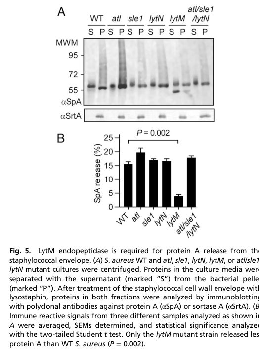

## Question

# Gene Research for Functional Annotation

## ⚠️ CRITICAL: Gene/Protein Identification Context

**BEFORE YOU BEGIN RESEARCH:** You MUST verify you are researching the CORRECT gene/protein. Gene symbols can be ambiguous, especially for less well-characterized genes from non-model organisms.

### Target Gene/Protein Identity (from UniProt):
- **UniProt Accession:** A0A0H2XJK7
- **Protein Description:** RecName: Full=Probable cell wall hydrolase LytN {ECO:0000256|ARBA:ARBA00020785};
- **Gene Information:** Name=lytN {ECO:0000313|EMBL:ABD22392.1}; OrderedLocusNames=SAUSA300_1140 {ECO:0000313|EMBL:ABD22392.1};
- **Organism (full):** Staphylococcus aureus (strain USA300).
- **Protein Family:** Not specified in UniProt
- **Key Domains:** CHAP_dom. (IPR007921); LysM. (IPR018392); LysM_dom_sf. (IPR036779); Papain-like_cys_pep_sf. (IPR038765); YSIRK_signal_dom. (IPR005877)

### MANDATORY VERIFICATION STEPS:

1. **Check if the gene symbol "lytN" matches the protein description above**
2. **Verify the organism is correct:** Staphylococcus aureus (strain USA300).
3. **Check if protein family/domains align with what you find in literature**
4. **If you find literature for a DIFFERENT gene with the same or similar symbol, STOP**

### If Gene Symbol is Ambiguous or You Cannot Find Relevant Literature:

**DO NOT PROCEED WITH RESEARCH ON A DIFFERENT GENE.** Instead:
- State clearly: "The gene symbol 'lytN' is ambiguous or literature is limited for this specific protein"
- Explain what you found (e.g., "Found extensive literature on a different gene with the same symbol in a different organism")
- Describe the protein based ONLY on the UniProt information provided above
- Suggest that the protein function can be inferred from domain/family information

### Research Target:

Please provide a comprehensive research report on the gene **lytN** (gene ID: lytN, UniProt: A0A0H2XJK7) in STAAU.

The research report should be a detailed narrative explaining the function, biological processes, and localization of the gene product. Citations should be given for all claims.

You should prioritize authoritative reviews and primary scientific literature when conducting research. You can supplement
this with annotations you find in gene/protein databases, but these can be outdated or inaccurate.

We are specifically interested in the primary function of the gene - for enzymes, what reaction is catalyzed, and what is the substrate specificity? For transporters, what is the substrate? For structural proteins or adapters, what is the broader structural role? For signaling molecules, what is the role in the pathway.

We are interested in where in or outside the cell the gene product carries out its function.

We are also interested in the signaling or biochemical pathways in which the gene functions. We are less interested in broad pleiotropic effects, except where these elucidate the precise role.

Include evidence where possible. We are interested in both experimental evidence as well as inference from structure, evolution, or bioinformatic analysis. Precise studies should be prioritized over high-throughput, where available.

## Output

Question: You are an expert researcher providing comprehensive, well-cited information.

Provide detailed information focusing on:
1. Key concepts and definitions with current understanding
2. Recent developments and latest research (prioritize 2023-2024 sources)
3. Current applications and real-world implementations
4. Expert opinions and analysis from authoritative sources
5. Relevant statistics and data from recent studies

Format as a comprehensive research report with proper citations. Include URLs and publication dates where available.
Always prioritize recent, authoritative sources and provide specific citations for all major claims.

# Gene Research for Functional Annotation

## ⚠️ CRITICAL: Gene/Protein Identification Context

**BEFORE YOU BEGIN RESEARCH:** You MUST verify you are researching the CORRECT gene/protein. Gene symbols can be ambiguous, especially for less well-characterized genes from non-model organisms.

### Target Gene/Protein Identity (from UniProt):
- **UniProt Accession:** A0A0H2XJK7
- **Protein Description:** RecName: Full=Probable cell wall hydrolase LytN {ECO:0000256|ARBA:ARBA00020785};
- **Gene Information:** Name=lytN {ECO:0000313|EMBL:ABD22392.1}; OrderedLocusNames=SAUSA300_1140 {ECO:0000313|EMBL:ABD22392.1};
- **Organism (full):** Staphylococcus aureus (strain USA300).
- **Protein Family:** Not specified in UniProt
- **Key Domains:** CHAP_dom. (IPR007921); LysM. (IPR018392); LysM_dom_sf. (IPR036779); Papain-like_cys_pep_sf. (IPR038765); YSIRK_signal_dom. (IPR005877)

### MANDATORY VERIFICATION STEPS:

1. **Check if the gene symbol "lytN" matches the protein description above**
2. **Verify the organism is correct:** Staphylococcus aureus (strain USA300).
3. **Check if protein family/domains align with what you find in literature**
4. **If you find literature for a DIFFERENT gene with the same or similar symbol, STOP**

### If Gene Symbol is Ambiguous or You Cannot Find Relevant Literature:

**DO NOT PROCEED WITH RESEARCH ON A DIFFERENT GENE.** Instead:
- State clearly: "The gene symbol 'lytN' is ambiguous or literature is limited for this specific protein"
- Explain what you found (e.g., "Found extensive literature on a different gene with the same symbol in a different organism")
- Describe the protein based ONLY on the UniProt information provided above
- Suggest that the protein function can be inferred from domain/family information

### Research Target:

Please provide a comprehensive research report on the gene **lytN** (gene ID: lytN, UniProt: A0A0H2XJK7) in STAAU.

The research report should be a detailed narrative explaining the function, biological processes, and localization of the gene product. Citations should be given for all claims.

You should prioritize authoritative reviews and primary scientific literature when conducting research. You can supplement
this with annotations you find in gene/protein databases, but these can be outdated or inaccurate.

We are specifically interested in the primary function of the gene - for enzymes, what reaction is catalyzed, and what is the substrate specificity? For transporters, what is the substrate? For structural proteins or adapters, what is the broader structural role? For signaling molecules, what is the role in the pathway.

We are interested in where in or outside the cell the gene product carries out its function.

We are also interested in the signaling or biochemical pathways in which the gene functions. We are less interested in broad pleiotropic effects, except where these elucidate the precise role.

Include evidence where possible. We are interested in both experimental evidence as well as inference from structure, evolution, or bioinformatic analysis. Precise studies should be prioritized over high-throughput, where available.

## Research report: *Staphylococcus aureus* USA300 **lytN** (UniProt **A0A0H2XJK7**; locus **SAUSA300_1140**) — functional annotation

### 0. Target verification (critical disambiguation)
The evidence retrieved pertains to *Staphylococcus aureus* “LytN”, described as a secreted, cross-wall (septal) peptidoglycan hydrolase with a YSIRK/GS signal peptide, a LysM peptidoglycan-binding module, and a CHAP catalytic domain with cysteine/histidine-dependent activity. This matches the provided UniProt identity (A0A0H2XJK7; USA300; domains: YSIRK signal, LysM, CHAP). (frankel2011lytnamurein pages 1-2)

### 1. Key concepts and current understanding

#### 1.1 What LytN is (definition)
LytN is an endogenous *S. aureus* peptidoglycan hydrolase (“murein hydrolase”) that localizes to the cross-wall compartment to remodel septal peptidoglycan during cell division and envelope assembly. (frankel2011lytnamurein pages 1-2)

#### 1.2 Domain architecture and definitions
* **YSIRK/GS signal peptide**: A specialized N-terminal signal peptide class in *S. aureus* that routes precursors to septal (cross-wall) secretion. LytN is explicitly reported to be secreted to the cross-wall compartment via a YSIRK/GS-type signal peptide. (frankel2011lytnamurein pages 11-12)
* **LysM domain**: A common cell-wall binding module that can contribute to peptidoglycan interaction/positioning. LytN carries LysM and can bind cell wall material; some review synthesis indicates that deletion of a LysM domain did not abolish LytN function, consistent with possible partial redundancy between targeting determinants (signal peptide, WTA-dependent interactions, and/or other regions). (wang2022staphylococcusaureuscell pages 10-11, frankel2011lytnamurein pages 12-13)
* **CHAP domain** (cysteine/histidine-dependent amidohydrolase/peptidase): LytN’s catalytic module, experimentally shown to mediate two distinct peptidoglycan cleavage activities (amidase and endopeptidase). (frankel2011lytnamurein pages 11-12, wang2022staphylococcusaureuscell pages 5-6)

#### 1.3 Primary enzymatic function: reactions and substrate specificity
Frankel et al. (2011; Journal of Biological Chemistry; publication date Sep 2011; https://doi.org/10.1074/jbc.M111.258863) provide direct product-level evidence that recombinant LytN cleaves *two* amide bonds in *S. aureus* peptidoglycan: (i) **MurNAc–L-Ala** (N-acetylmuramoyl-L-alanine amidase activity), and (ii) **D-Ala–Gly** (D-alanyl–glycine endopeptidase activity). (frankel2011lytnamurein pages 8-11, frankel2011lytnamurein pages 11-12)

Mechanistically, activity depends on conserved CHAP residues: mutation of **Cys266** or **His329** abolishes detectable murein hydrolase activity in the assays reported. (frankel2011lytnamurein pages 11-12, frankel2011lytnamurein pages 12-13)

### 2. Biological role, localization, and pathways

#### 2.1 Subcellular localization and where LytN acts
LytN is described as a murein hydrolase of the **cross-wall compartment** (septal region) and its precursor is secreted into this compartment via its YSIRK/GS signal peptide. (frankel2011lytnamurein pages 1-2, frankel2011lytnamurein pages 11-12)

A key functional insight is that correct *spatial delivery* matters: lytN mutant phenotypes were complemented by controlled expression of the LytN precursor (i.e., produced by the bacterium), but not by adding purified enzyme externally, supporting a model where cross-wall targeting is required for physiological function. (frankel2011lytnamurein pages 1-2, frankel2011lytnamurein pages 11-12)

#### 2.2 Link to cell division and envelope assembly
LytN contributes to **cross-wall splitting / daughter cell separation**, and disruption causes cross-wall structural defects and growth impairment; conversely, overexpression causes cross-wall rupture and lysis, indicating LytN activity must be tightly controlled to avoid lethal self-digestion. (frankel2011lytnamurein pages 11-12, becker2014releaseofprotein pages 3-4)

#### 2.3 Relationship to wall teichoic acid (WTA)
An authoritative review of *S. aureus* peptidoglycan hydrolases (Wang et al., 2022; FEMS Microbiology Reviews; publication date Jun 2022; https://doi.org/10.1093/femsre/fuac025) summarizes that **WTA mediates specific binding/localization of LytN to the cross-wall** and that WTA absence causes disordered localization. (wang2022staphylococcusaureuscell pages 10-11, wang2022staphylococcusaureuscell pages 8-10)

#### 2.4 Regulatory context (transcriptional control)
The same 2022 review synthesizes reported transcriptional control: lytN is repressed through the **ArlRS–MgrA** regulatory cascade and also through regulators such as **Rot**, **SpoVG**, and **Rat**, reflecting the general need to regulate autolysin activity. (wang2022staphylococcusaureuscell pages 10-11, wang2022staphylococcusaureuscell pages 8-10)

### 3. Experimental evidence and quantitative data

#### 3.1 Mass spectrometry and Edman sequencing evidence for bond cleavage
Frankel et al. (2011) report defined muropeptide products after LytN digestion, with diagnostic ions including **m/z 724.68, 796.69, 2367.12, 2440.69** and others, and use Edman degradation to show liberated peptide N-termini consistent with MurNAc–L-Ala and D-Ala–Gly cleavage. Reported Edman amounts include (example) **cycle-1 Ala 7.87 pmol and Gly 6.85 pmol** for one fragment, whereas a larger fragment yielded **five cycles of Gly** without Ala, supporting the assignment of distinct cleavage events. (frankel2011lytnamurein pages 8-11, frankel2011lytnamurein pages 11-12)

#### 3.2 Protein A (SpA) processing/release: quantitative phenotype
Becker et al. (2014; PNAS; publication date Jan 2014; https://doi.org/10.1073/pnas.1317181111) connect LytN to processing of sortase-anchored surface proteins, specifically **protein A (SpA)**. They report that LytN is secreted into the cross-wall via a YSIRK-G/S signal peptide and that its CHAP domain cleaves peptidoglycan via amidase/endopeptidase activities, influencing cell separation. (becker2014releaseofprotein pages 3-4)

Importantly, although LytN affects the structure of peptidoglycan-linked anchors in SpA, deletion of lytN does **not** substantially change the overall fraction of SpA released into culture medium: **WT 15.10% ± 1.28 vs lytN mutant 16.69% ± 1.44** (bar graph shown in their Figure 5B). (becker2014releaseofprotein pages 3-4, becker2014releaseofprotein media 5e522988)

### 4. Recent developments (prioritizing 2023–2024)

#### 4.1 Updated context on D-Ala–Gly hydrolase chemistry (2024)
Antenucci et al. (2024; eLife; publication date Aug 2024; https://doi.org/10.1101/2023.10.13.562287) re-assess substrate specificities among major *S. aureus* peptidoglycan hydrolases. In this context, they explicitly describe LytN as “the only other recognised D-Ala–Gly hydrolase in *S. aureus*” and reiterate the dual activity of LytN’s CHAP domain: cleavage of **D-Ala–Gly** and **MurNAc–L-Ala** bonds (citing the 2011 primary work). (antenucci2024reassessingthesubstrate pages 15-18)

This 2024 perspective is relevant because it reframes *S. aureus* endopeptidase chemistry: it emphasizes that D-Ala–Gly cleavage is not unique to LytN (in the sense that LytM can also show D-Ala–Gly-related activity), but LytN remains a canonical CHAP-based dual-activity enzyme for septal remodeling. (antenucci2024reassessingthesubstrate pages 15-18)

#### 4.2 2024 view on modular hydrolases and “enzybiotics” potential
A 2024 review on cell-wall targeting proteinaceous agents (Zhydzetski et al., 2024; Molecules; publication date Aug 2024; https://doi.org/10.3390/molecules29174065) highlights CHAP as a frequent catalytic motif and LysM as a common cell wall binding motif in bacteriophage lysins and related agents, and notes that disruption of LytN causes growth/morphology defects while overexpression causes lysis and death—consistent with essentiality of regulation and potential vulnerability of cell-wall remodeling systems. (zhydzetski2024agentstargetingthe pages 15-16, zhydzetski2024agentstargetingthe pages 14-15)

### 5. Current applications and real-world implementations

#### 5.1 Translational context: cell-wall lytic proteins as antibacterials
Although there is no direct evidence in the retrieved sources that *LytN itself* is deployed as a therapeutic, recent reviews emphasize the broader translational concept: cell-wall hydrolases (including CHAP-domain enzymes) can be engineered as antimicrobials (“enzybiotics”), via truncation to active catalytic domains and/or fusion with binding modules for potency and specificity. (zhydzetski2024agentstargetingthe pages 26-28, zhydzetski2024agentstargetingthe pages 21-22)

The 2024 Molecules review also notes that externally applied peptidoglycan hydrolases target conserved bonds in peptidoglycan, a mechanism distinct from classical antibiotics and potentially less prone to resistance development; it further describes domain-engineering strategies that can increase activity dramatically (e.g., CBD fusion approaches in related systems). (zhydzetski2024agentstargetingthe pages 15-16)

#### 5.2 Practical implication for LytN biology
The key real-world relevance of LytN is as a **cell division/envelope assembly factor** and a **potential vulnerability** in pathways that govern cross-wall remodeling. Its tight regulation and lethal overexpression phenotype underscore why hydrolases are considered both (i) targets and (ii) components for engineered antibacterials. (frankel2011lytnamurein pages 11-12, zhydzetski2024agentstargetingthe pages 15-16)

### 6. Expert synthesis and interpretation (evidence-weighted)
1. **Primary function**: LytN is best supported as a **bifunctional septal peptidoglycan hydrolase** that catalyzes cleavage of **MurNAc–L-Ala** and **D-Ala–Gly** bonds. The strongest evidence is direct product characterization by MS and Edman sequencing and loss-of-function active-site mutagenesis (Cys266/His329). (frankel2011lytnamurein pages 8-11, frankel2011lytnamurein pages 11-12)
2. **Spatial cell biology**: LytN belongs to the class of YSIRK/GS-signal-peptide proteins routed to the cross-wall; complementation behavior supports that correct spatial secretion/localization is critical for its physiological role. (frankel2011lytnamurein pages 1-2, frankel2011lytnamurein pages 11-12)
3. **Cell cycle role**: LytN supports cross-wall splitting and envelope integrity; underactivity (mutation) impairs growth/separation, while overactivity (overexpression) leads to rupture/lysis. (frankel2011lytnamurein pages 11-12, zhydzetski2024agentstargetingthe pages 15-16)
4. **Surface protein anchor remodeling**: LytN modifies the peptidoglycan-linked structures of protein A (SpA) but is not the only determinant of overall SpA shedding, as quantified by similar release fractions in WT and lytN mutants. (becker2014releaseofprotein pages 3-4, becker2014releaseofprotein media 5e522988)

### Summary table
The following table consolidates the main functional annotation points (domains, reactions, localization, regulation, phenotypes, and quantitative evidence) for rapid reference.

| Feature | Summary for *S. aureus* USA300 LytN (A0A0H2XJK7 / SAUSA300_1140) | Key quantitative / mechanistic details | Primary supporting citation IDs |
|---|---|---|---|
| Target verification | Literature evidence matches the specified *Staphylococcus aureus* LytN: a cross-wall murein hydrolase in *S. aureus* with YSIRK/GS signal peptide, LysM and CHAP-associated activity; no evidence here suggests confusion with a different non-*S. aureus* LytN. | Core description aligns with UniProt architecture and USA300 locus naming used in *S. aureus* studies. | (frankel2011lytnamurein pages 1-2) |
| Domain architecture | Secreted precursor with N-terminal YSIRK/GS-type signal peptide; peptidoglycan-binding LysM domain; catalytic CHAP domain. Some sources describe a single LysM domain; older secondary text describes a larger multidomain protein but agrees on YSIRK/GS + LysM + CHAP organization. | CHAP catalytic residues identified experimentally as Cys266 and His329. | (frankel2011lytnamurein pages 1-2, frankel2011lytnamurein pages 12-13, frankel2011lytnamurein pages 11-12, kent2013cellwallarchitecture pages 162-165) |
| Primary biochemical function | Peptidoglycan hydrolase involved in septal/cross-wall remodeling during daughter-cell separation and envelope assembly. | Functions in cleavage of septal peptidoglycan rather than bulk wall destruction; proper spatial delivery is required for function. | (frankel2011lytnamurein pages 1-2) |
| Catalytic activities | Dual CHAP-domain chemistry: N-acetylmuramoyl-L-alanine amidase and D-alanyl-glycine endopeptidase. Recent literature still cites LytN as the recognized *S. aureus* D-Ala–Gly hydrolase besides LytM-related work. | Cleaves MurNAc–L-Ala and D-Ala–Gly bonds in mature staphylococcal peptidoglycan. | (frankel2011lytnamurein pages 8-11, frankel2011lytnamurein pages 11-12, wang2022staphylococcusaureuscell pages 5-6, antenucci2024reassessingthesubstrate pages 15-18) |
| Substrate / bond specificity | Acts on staphylococcal peptidoglycan fragments including cross-linked muropeptides and releases uncross-linked wall peptides with or without MurNAc-GlcNAc. | Product evidence includes MurNAc-(peptide)-GlcNAc and MurNAc-peptide species; amidase activity appears to depend on intact glycan context/reducing-end presentation. | (frankel2011lytnamurein pages 8-11, frankel2011lytnamurein pages 11-12, frankel2011lytnamurein pages 12-13) |
| Catalytic residues | Conserved CHAP residues are essential for hydrolysis. | C266A and H329A variants lose detectable murein hydrolase activity. | (frankel2011lytnamurein pages 11-12, frankel2011lytnamurein pages 12-13) |
| Localization | Targeted to the cross-wall / septal compartment; exogenous recombinant protein can bind broadly to the cell wall, but physiological function depends on correct precursor secretion into the cross-wall. | YSIRK/GS signal peptide directs secretion to septal membranes/cross-wall; intracellular precursor complements mutant better than externally added enzyme. | (frankel2011lytnamurein pages 1-2, frankel2011lytnamurein pages 11-12) |
| WTA dependence | Cross-wall binding/localization is influenced by wall teichoic acid (WTA). | WTA mediates specific septal binding of LytN; WTA loss causes disordered localization in review summaries. | (wang2022staphylococcusaureuscell pages 10-11, wang2022staphylococcusaureuscell pages 8-10, kent2013cellwallarchitecture pages 162-165) |
| Regulation | lytN is negatively regulated by multiple envelope/autolysis regulators. | Repression reported for ArlRS–MgrA cascade, Rot, SpoVG, and Rat. | (wang2022staphylococcusaureuscell pages 10-11, wang2022staphylococcusaureuscell pages 8-10) |
| Growth/division phenotype of loss-of-function | Loss of LytN impairs proper growth and envelope assembly and causes cell separation/cross-wall defects. | Mutants show delayed growth, structural damage to the cross-wall, irregular wall layers/cell shapes, and inadequate splitting of septal peptidoglycan. | (frankel2011lytnamurein pages 1-2, frankel2011lytnamurein pages 12-13, becker2014releaseofprotein pages 3-4) |
| Overexpression phenotype | Too much LytN is harmful, indicating tight dosage control is important. | Overexpression causes cross-wall rupture, cell lysis, and cell death. | (frankel2011lytnamurein pages 11-12, zhydzetski2024agentstargetingthe pages 15-16) |
| Surface protein processing relevance | LytN contributes to remodeling peptidoglycan attached to surface proteins such as protein A (SpA), but is not the sole determinant of final SpA release into medium. | CHAP amidase/endopeptidase activity shapes anchor structure; released SpA from lytN mutant occurs at near-WT fraction. | (becker2014releaseofprotein pages 3-4, becker2014releaseofprotein pages 1-2, frankel2011lytnamurein pages 11-12) |
| Representative mass spectrometry evidence | Specific muropeptide products support dual bond cleavage assignments. | Reported ions/products include m/z 724.68, 796.69, 1204.48, 1205.08, 1276.07, 2367.12, 2440.69; CsCl exchange produced +110 m/z shift in sodiated-ion confirmation. | (frankel2011lytnamurein pages 8-11, frankel2011lytnamurein pages 11-12) |
| Representative Edman degradation evidence | Sequencing of released peptide fragments confirmed liberated Ala/Gly patterns consistent with D-Ala–Gly and MurNAc–L-Ala cleavage products. | Example values reported: cycle-1 Ala 7.87 pmol and Gly 6.85 pmol for one fragment; larger fragment yielded five Gly cycles without Ala. | (frankel2011lytnamurein pages 8-11) |
| Quantitative SpA release data | Deleting lytN does not markedly change total fraction of protein A released to medium, despite altered local cross-wall processing. | WT 15.10% ± 1.28 vs ΔlytN 16.69% ± 1.44 protein A released. | (becker2014releaseofprotein pages 3-4) |

*Table: This table condenses the main functional annotation points for *S. aureus* USA300 LytN, including domain architecture, enzymatic activities, localization, regulation, phenotypes, and quantitative evidence. It is useful as a citation-linked reference for assessing evidence strength and mechanistic interpretation.*

### References (URLs and publication dates)
* Frankel MB et al. **2011-09**. “LytN, a murein hydrolase in the cross-wall compartment of *Staphylococcus aureus*, is involved in proper bacterial growth and envelope assembly.” *J Biol Chem*. https://doi.org/10.1074/jbc.M111.258863 (frankel2011lytnamurein pages 8-11, frankel2011lytnamurein pages 11-12)
* Becker S et al. **2014-01**. “Release of protein A from the cell wall of *Staphylococcus aureus*.” *PNAS*. https://doi.org/10.1073/pnas.1317181111 (becker2014releaseofprotein pages 3-4, becker2014releaseofprotein media 5e522988)
* Wang M et al. **2022-06**. “*Staphylococcus aureus* cell wall maintenance – the multifaceted roles of peptidoglycan hydrolases in bacterial growth, fitness, and virulence.” *FEMS Microbiology Reviews*. https://doi.org/10.1093/femsre/fuac025 (wang2022staphylococcusaureuscell pages 10-11, wang2022staphylococcusaureuscell pages 8-10)
* Antenucci L et al. **2024-08**. “Reassessing the substrate specificities of the major *Staphylococcus aureus* peptidoglycan hydrolases lysostaphin and LytM.” *eLife*. https://doi.org/10.1101/2023.10.13.562287 (antenucci2024reassessingthesubstrate pages 15-18)
* Zhydzetski A et al. **2024-08**. “Agents Targeting the Bacterial Cell Wall as Tools to Combat Gram-Positive Pathogens.” *Molecules*. https://doi.org/10.3390/molecules29174065 (zhydzetski2024agentstargetingthe pages 15-16)

References

1. (frankel2011lytnamurein pages 1-2): Matthew B. Frankel, Antoni P.A. Hendrickx, Dominique M. Missiakas, and Olaf Schneewind. Lytn, a murein hydrolase in the cross-wall compartment of staphylococcus aureus, is involved in proper bacterial growth and envelope assembly. Journal of Biological Chemistry, 286:32593-32605, Sep 2011. URL: https://doi.org/10.1074/jbc.m111.258863, doi:10.1074/jbc.m111.258863. This article has 100 citations and is from a domain leading peer-reviewed journal.

2. (frankel2011lytnamurein pages 11-12): Matthew B. Frankel, Antoni P.A. Hendrickx, Dominique M. Missiakas, and Olaf Schneewind. Lytn, a murein hydrolase in the cross-wall compartment of staphylococcus aureus, is involved in proper bacterial growth and envelope assembly. Journal of Biological Chemistry, 286:32593-32605, Sep 2011. URL: https://doi.org/10.1074/jbc.m111.258863, doi:10.1074/jbc.m111.258863. This article has 100 citations and is from a domain leading peer-reviewed journal.

3. (wang2022staphylococcusaureuscell pages 10-11): Min Wang, Girbe Buist, and Jan Maarten van Dijl. Staphylococcus aureus cell wall maintenance – the multifaceted roles of peptidoglycan hydrolases in bacterial growth, fitness, and virulence. FEMS Microbiology Reviews, Jun 2022. URL: https://doi.org/10.1093/femsre/fuac025, doi:10.1093/femsre/fuac025. This article has 148 citations and is from a domain leading peer-reviewed journal.

4. (frankel2011lytnamurein pages 12-13): Matthew B. Frankel, Antoni P.A. Hendrickx, Dominique M. Missiakas, and Olaf Schneewind. Lytn, a murein hydrolase in the cross-wall compartment of staphylococcus aureus, is involved in proper bacterial growth and envelope assembly. Journal of Biological Chemistry, 286:32593-32605, Sep 2011. URL: https://doi.org/10.1074/jbc.m111.258863, doi:10.1074/jbc.m111.258863. This article has 100 citations and is from a domain leading peer-reviewed journal.

5. (wang2022staphylococcusaureuscell pages 5-6): Min Wang, Girbe Buist, and Jan Maarten van Dijl. Staphylococcus aureus cell wall maintenance – the multifaceted roles of peptidoglycan hydrolases in bacterial growth, fitness, and virulence. FEMS Microbiology Reviews, Jun 2022. URL: https://doi.org/10.1093/femsre/fuac025, doi:10.1093/femsre/fuac025. This article has 148 citations and is from a domain leading peer-reviewed journal.

6. (frankel2011lytnamurein pages 8-11): Matthew B. Frankel, Antoni P.A. Hendrickx, Dominique M. Missiakas, and Olaf Schneewind. Lytn, a murein hydrolase in the cross-wall compartment of staphylococcus aureus, is involved in proper bacterial growth and envelope assembly. Journal of Biological Chemistry, 286:32593-32605, Sep 2011. URL: https://doi.org/10.1074/jbc.m111.258863, doi:10.1074/jbc.m111.258863. This article has 100 citations and is from a domain leading peer-reviewed journal.

7. (becker2014releaseofprotein pages 3-4): Samuel Becker, Matthew B. Frankel, Olaf Schneewind, and Dominique Missiakas. Release of protein a from the cell wall of staphylococcus aureus. Proceedings of the National Academy of Sciences, 111:1574-1579, Jan 2014. URL: https://doi.org/10.1073/pnas.1317181111, doi:10.1073/pnas.1317181111. This article has 219 citations and is from a highest quality peer-reviewed journal.

8. (wang2022staphylococcusaureuscell pages 8-10): Min Wang, Girbe Buist, and Jan Maarten van Dijl. Staphylococcus aureus cell wall maintenance – the multifaceted roles of peptidoglycan hydrolases in bacterial growth, fitness, and virulence. FEMS Microbiology Reviews, Jun 2022. URL: https://doi.org/10.1093/femsre/fuac025, doi:10.1093/femsre/fuac025. This article has 148 citations and is from a domain leading peer-reviewed journal.

9. (becker2014releaseofprotein media 5e522988): Samuel Becker, Matthew B. Frankel, Olaf Schneewind, and Dominique Missiakas. Release of protein a from the cell wall of staphylococcus aureus. Proceedings of the National Academy of Sciences, 111:1574-1579, Jan 2014. URL: https://doi.org/10.1073/pnas.1317181111, doi:10.1073/pnas.1317181111. This article has 219 citations and is from a highest quality peer-reviewed journal.

10. (antenucci2024reassessingthesubstrate pages 15-18): Lina Antenucci, Salla Virtanen, Chandan Thapa, Minne Jartti, Ilona Pitkänen, Helena Tossavainen, and Perttu Permi. Reassessing the substrate specificities of the major staphylococcus aureus peptidoglycan hydrolases lysostaphin and lytm. eLife, Aug 2024. URL: https://doi.org/10.1101/2023.10.13.562287, doi:10.1101/2023.10.13.562287. This article has 11 citations and is from a domain leading peer-reviewed journal.

11. (zhydzetski2024agentstargetingthe pages 15-16): Aliaksandr Zhydzetski, Zuzanna Głowacka-Grzyb, Michal Bukowski, Tomasz Żądło, Emilia Bonar, and Benedykt Władyka. Agents targeting the bacterial cell wall as tools to combat gram-positive pathogens. Molecules, 29:4065, Aug 2024. URL: https://doi.org/10.3390/molecules29174065, doi:10.3390/molecules29174065. This article has 72 citations.

12. (zhydzetski2024agentstargetingthe pages 14-15): Aliaksandr Zhydzetski, Zuzanna Głowacka-Grzyb, Michal Bukowski, Tomasz Żądło, Emilia Bonar, and Benedykt Władyka. Agents targeting the bacterial cell wall as tools to combat gram-positive pathogens. Molecules, 29:4065, Aug 2024. URL: https://doi.org/10.3390/molecules29174065, doi:10.3390/molecules29174065. This article has 72 citations.

13. (zhydzetski2024agentstargetingthe pages 26-28): Aliaksandr Zhydzetski, Zuzanna Głowacka-Grzyb, Michal Bukowski, Tomasz Żądło, Emilia Bonar, and Benedykt Władyka. Agents targeting the bacterial cell wall as tools to combat gram-positive pathogens. Molecules, 29:4065, Aug 2024. URL: https://doi.org/10.3390/molecules29174065, doi:10.3390/molecules29174065. This article has 72 citations.

14. (zhydzetski2024agentstargetingthe pages 21-22): Aliaksandr Zhydzetski, Zuzanna Głowacka-Grzyb, Michal Bukowski, Tomasz Żądło, Emilia Bonar, and Benedykt Władyka. Agents targeting the bacterial cell wall as tools to combat gram-positive pathogens. Molecules, 29:4065, Aug 2024. URL: https://doi.org/10.3390/molecules29174065, doi:10.3390/molecules29174065. This article has 72 citations.

15. (kent2013cellwallarchitecture pages 162-165): V Kent. Cell wall architecture and the role of wall teichoic acid in staphylococcus aureus. Unknown journal, 2013.

16. (becker2014releaseofprotein pages 1-2): Samuel Becker, Matthew B. Frankel, Olaf Schneewind, and Dominique Missiakas. Release of protein a from the cell wall of staphylococcus aureus. Proceedings of the National Academy of Sciences, 111:1574-1579, Jan 2014. URL: https://doi.org/10.1073/pnas.1317181111, doi:10.1073/pnas.1317181111. This article has 219 citations and is from a highest quality peer-reviewed journal.

## Artifacts

- [Edison artifact artifact-00](lytN-deep-research-falcon_artifacts/artifact-00.md)

## Citations

1. frankel2011lytnamurein pages 1-2
2. frankel2011lytnamurein pages 11-12
3. becker2014releaseofprotein pages 3-4
4. antenucci2024reassessingthesubstrate pages 15-18
5. zhydzetski2024agentstargetingthe pages 15-16
6. frankel2011lytnamurein pages 8-11
7. wang2022staphylococcusaureuscell pages 10-11
8. frankel2011lytnamurein pages 12-13
9. wang2022staphylococcusaureuscell pages 5-6
10. wang2022staphylococcusaureuscell pages 8-10
11. zhydzetski2024agentstargetingthe pages 14-15
12. zhydzetski2024agentstargetingthe pages 26-28
13. zhydzetski2024agentstargetingthe pages 21-22
14. kent2013cellwallarchitecture pages 162-165
15. becker2014releaseofprotein pages 1-2
16. https://doi.org/10.1074/jbc.M111.258863
17. https://doi.org/10.1093/femsre/fuac025
18. https://doi.org/10.1073/pnas.1317181111
19. https://doi.org/10.1101/2023.10.13.562287
20. https://doi.org/10.3390/molecules29174065
21. https://doi.org/10.1074/jbc.m111.258863,
22. https://doi.org/10.1093/femsre/fuac025,
23. https://doi.org/10.1073/pnas.1317181111,
24. https://doi.org/10.1101/2023.10.13.562287,
25. https://doi.org/10.3390/molecules29174065,